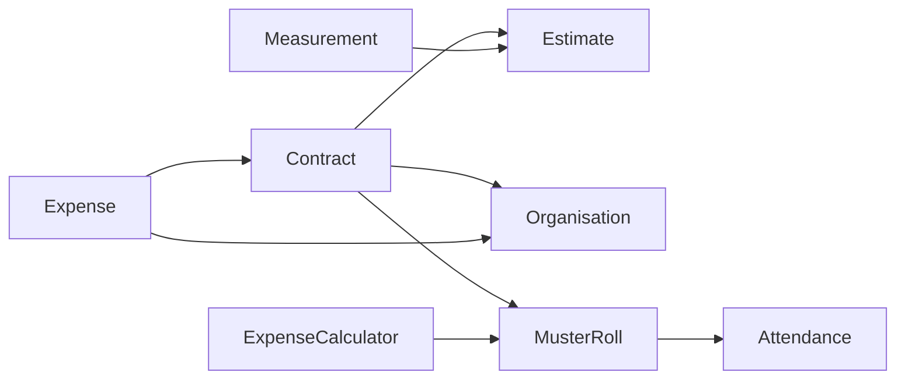
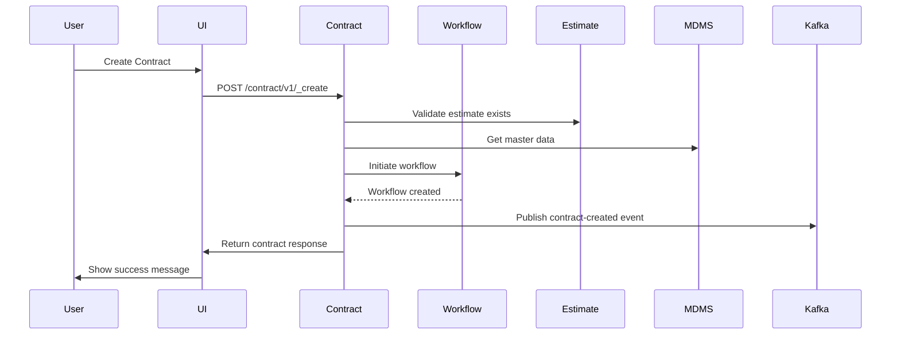
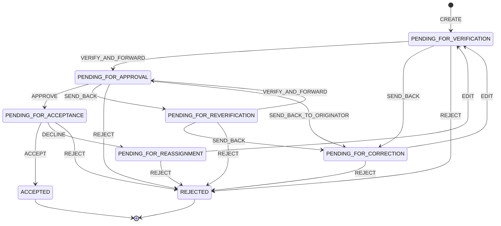
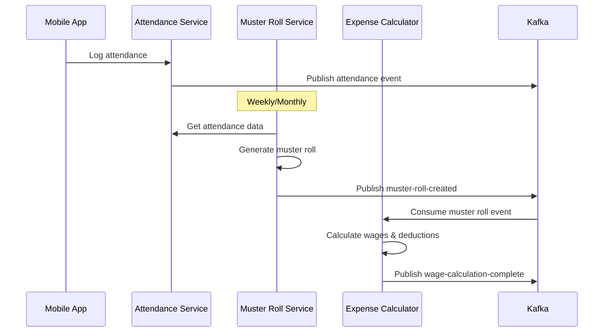
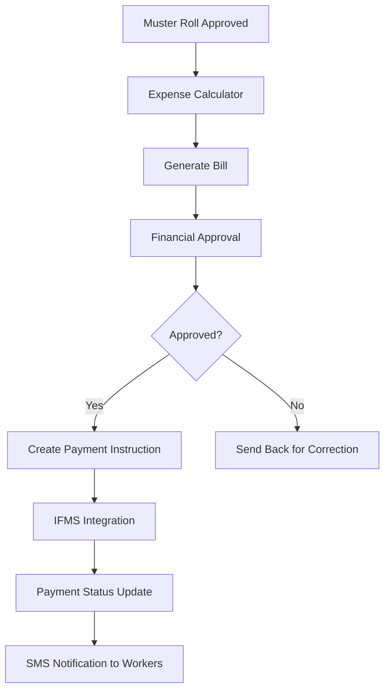
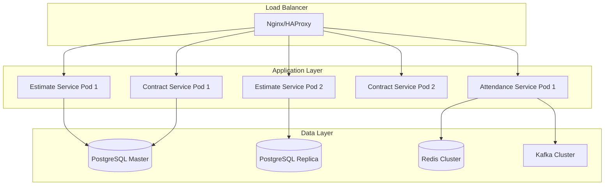

# DIGIT Works - Comprehensive Technical Documentation

## System & Architecture Overview

DIGIT Works is a comprehensive **microservices-based government works management system** built on the DIGIT platform. It manages the complete lifecycle of public works projects from estimation to completion, including contractor management, attendance tracking, and payment processing.

### High-Level Architecture

```mermaid
graph TB
    subgraph "Frontend Layer"
        UI[React Micro-UI Web] 
        Mobile[Flutter SHG App]
    end
    
    subgraph "Backend Services (Spring Boot + Java 17)"
        Estimates[Estimate Service:8032]
        Contracts[Contract Service:8024]
        Attendance[Attendance Service:8029]
        MusterRoll[Muster Roll Service:8088]
        Expense[Expense Service]
        Organisation[Organisation Service:8026]
        Measurement[Measurement Service]
        BankAccount[Bank Account Service]
        ExpenseCalc[Expense Calculator Service]
    end
    
    subgraph "Utilities & Support Services"
        WorksPDF[Works PDF Service:8080]
        MuktaServices[Mukta BFF Service:TypeScript]
        CronJobs[IFMS & Expense Cron Jobs:Python]
    end
    
    subgraph "Infrastructure"
        PostgreSQL[(PostgreSQL Database)]
        Kafka[Kafka Message Broker]
        Redis[(Redis Cache)]
        MDMS[MDMS - Master Data]
        Workflow[Workflow Engine]
        FileStore[File Storage Service]
    end
    
    UI --> Estimates
    UI --> Contracts
    Mobile --> Attendance
    
    Estimates --> PostgreSQL
    Contracts --> PostgreSQL
    Attendance --> Kafka
    MusterRoll --> Kafka
    
    WorksPDF --> Kafka
    WorksPDF --> PostgreSQL
    
    Estimates --> MDMS
    Contracts --> Workflow
    
    Attendance --> Redis
    Contracts --> Redis
```



### Component Responsibilities

| Service | Purpose | Port | Technology |
|---------|---------|------|------------|
| **Estimate Service** | Manages project estimates, SOR, non-SOR items, overheads | 8032 | Spring Boot 3.2.2, Java 17 |
| **Contract Service** | Handles work order creation, approval workflow | 8024 | Spring Boot 3.2.2, Java 17 |
| **Attendance Service** | Tracks worker attendance and registers | 8029 | Spring Boot, Java 17 |
| **Muster Roll Service** | Manages payroll and wage calculations | 8088 | Spring Boot, Java 17 |
| **Organisation Service** | Manages contractor and organization data | 8026 | Spring Boot, Java 17 |
| **Expense Service** | Handles bill creation and payment processing | - | Spring Boot, Java 17 |
| **Measurement Service** | Records work measurements against estimates | - | Spring Boot, Java 17 |
| **Works PDF Service** | Generates PDF reports via Kafka consumers | 8080 | Node.js, Express |
| **Mukta Services (BFF)** | Backend-for-Frontend aggregation service | - | TypeScript, Express |

## API Documentation

### Core REST APIs

All services follow consistent REST patterns with these standard endpoints:

#### Estimate Service (`/estimate/v1/`)
- **POST** `/estimate/v1/_create` - Create new estimate
- **POST** `/estimate/v1/_update` - Update existing estimate  
- **POST** `/estimate/v1/_search` - Search estimates with criteria
  - Query params: `tenantId`, `projectId`, `referenceNumber`, `estimateNumber`, `wfStatus`
  - Response: EstimateResponse with list of estimates

#### Contract Service (`/contract/v1/`)
- **POST** `/contract/v1/_create` - Create new contract
- **POST** `/contract/v1/_update` - Update contract
- **POST** `/contract/v1/_search` - Search contracts

#### Attendance Service (`/attendance/v1/`)
- **POST** `/attendance/v1/_create` - Create attendance register
- **POST** `/attendee/v1/_create` - Enroll attendee
- **POST** `/attendance/log/v1/_create` - Log attendance event

### Authentication & Authorization

- **JWT Token-based authentication** via DIGIT platform
- **Role-based access control (RBAC)** with these key roles:
  - `WORK_ORDER_CREATOR` - Can create contracts
  - `WORK_ORDER_VERIFIER` - Can verify and forward contracts
  - `WORK_ORDER_APPROVER` - Can approve contracts
  - `ORG_ADMIN` - Can accept/decline contracts
  - `ATTENDANCE_REGISTER_CREATOR` - Can create attendance registers

### Error Handling

All services use standardized error responses:
```json
{
  "ResponseInfo": {
    "apiId": "service-name",
    "ver": "1.0.0",
    "ts": 1513579888683,
    "resMsgId": "",
    "msgId": "",
    "status": "FAILED"
  },
  "Errors": [
    {
      "code": "INVALID_REQUEST",
      "message": "Invalid input data",
      "description": "Field validation failed"
    }
  ]
}
```

## Domain Models & Data Structures

### Core Entities

#### Contract Entity
```java
{
  "id": "uuid",
  "contractNumber": "CO/2023-24/000001", // Auto-generated
  "tenantId": "pb.amritsar",
  "estimateId": "uuid",
  "issueDate": 1642678800000,
  "defectLiabilityPeriod": 365,
  "securityMoneyPercent": 5.0,
  "agreementDate": 1642678800000,
  "wfStatus": "PENDING_FOR_VERIFICATION",
  "orgId": "uuid",
  "startDate": 1642678800000,
  "endDate": 1674214800000,
  "totalContractedAmount": 1000000.00,
  "contractType": "WORK_ORDER",
  "executingDepartment": "ENGINEERING",
  "documents": [...],
  "lineItems": [...],
  "additionalDetails": {}
}
```

#### Estimate Entity
```java
{
  "id": "uuid",
  "estimateNumber": "ES/2023-24/000001", // Format: ES/[fy:yyyy-yy]/[SEQ_ESTIMATE_NUM]
  "tenantId": "pb.amritsar",
  "projectId": "uuid",
  "name": "Road Construction Estimate",
  "referenceNumber": "REF/2023/001",
  "description": "Main road construction work",
  "executingDepartment": "PWD",
  "address": {...},
  "totalAmount": 1000000.00,
  "wfStatus": "APPROVED",
  "estimateDetails": [
    {
      "id": "uuid",
      "sorId": "SOR001",
      "category": "SOR",
      "noOfunit": 100,
      "unitRate": 1000.00,
      "amountDetail": [...],
      "additionalDetails": {}
    }
  ]
}
```

#### Attendance Register Entity
```java
{
  "id": "uuid", 
  "tenantId": "pb.amritsar",
  "registerNumber": "ATT/2023/001",
  "name": "Site A Attendance Register",
  "startDate": 1642678800000,
  "endDate": 1674214800000,
  "status": "ACTIVE",
  "staff": [...],
  "attendees": [...],
  "additionalDetails": {}
}
```

### Validation Rules
- `tenantId` - Required, 2-256 characters
- `estimateNumber` - Auto-generated, follows format pattern
- `contractNumber` - Auto-generated via ID generation service
- Amount fields - Non-negative decimal values
- Date fields - Unix timestamps
- UUID fields - Valid UUID format

### Enums
```java
enum ContractStatus {
    PENDING_FOR_VERIFICATION,
    PENDING_FOR_APPROVAL, 
    PENDING_FOR_ACCEPTANCE,
    ACCEPTED,
    REJECTED
}

enum EstimateStatus {
    ACTIVE,
    INACTIVE,
    INWORKFLOW
}

enum AttendanceStatus {
    PRESENT,
    ABSENT,
    HALF_DAY
}
```

## Database Design

### Key Tables

#### Attendance Module
```sql
-- Main attendance register table
CREATE TABLE eg_wms_attendance_register(
    id character varying(256) PRIMARY KEY,
    tenantid character varying(64) NOT NULL,
    registernumber character varying(128) UNIQUE NOT NULL,
    name character varying(128),
    startdate bigint NOT NULL,
    enddate bigint NOT NULL, 
    status character varying(64) NOT NULL,
    additionaldetails JSONB,
    -- Audit fields
    createdby character varying(256) NOT NULL,
    lastmodifiedby character varying(256),
    createdtime bigint,
    lastmodifiedtime bigint
);

-- Staff permissions for attendance registers
CREATE TABLE eg_wms_staff_permissions(
    id character varying(256) PRIMARY KEY,
    permission_type character varying(64) NOT NULL,
    staff_id character varying(64) NOT NULL,
    register_id character varying(64) NOT NULL,
    FOREIGN KEY (register_id) REFERENCES eg_wms_attendance_register(id),
    FOREIGN KEY (staff_id) REFERENCES eg_wms_attendance_staff(id)
);

-- Attendance logs for daily tracking
CREATE TABLE eg_wms_attendance_log(
    id character varying(256) PRIMARY KEY,
    individual_id character varying(64) NOT NULL,
    register_id character varying(64) NOT NULL,
    status character varying(64),
    time bigint NOT NULL,
    event_type character varying(64),
    FOREIGN KEY (register_id) REFERENCES eg_wms_attendance_register(id)
);
```

### Relationships
- **1:M** - Attendance Register → Staff/Attendees
- **1:M** - Attendance Register → Attendance Logs  
- **1:M** - Estimate → Estimate Details
- **1:M** - Contract → Line Items
- **1:M** - Organisation → Bank Accounts

### Indexes & Constraints
- Unique constraints on business identifiers (registernumber, estimateNumber, contractNumber)
- Foreign key constraints for referential integrity
- JSONB indexes on additionalDetails for flexible querying
- Compound indexes on (tenantId, status) for common search patterns

## Configuration & Application Properties

### Environment-Specific Configuration

#### Database Configuration
```properties
# PostgreSQL Configuration
spring.datasource.driver-class-name=org.postgresql.Driver
spring.datasource.url=jdbc:postgresql://localhost:5432/digit-works
spring.datasource.username=postgres
spring.datasource.password=1234

# Flyway Migration
spring.flyway.enabled=true
spring.flyway.table=contract_schema
spring.flyway.baseline-on-migrate=true
```

#### Kafka Configuration
```properties
# Kafka Broker
kafka.config.bootstrap_server_config=localhost:9092
spring.kafka.consumer.group-id=egov-contract-service
spring.kafka.producer.key-serializer=org.apache.kafka.common.serialization.StringSerializer
spring.kafka.producer.value-serializer=org.springframework.kafka.support.serializer.JsonSerializer

# Kafka Producer Settings
kafka.producer.config.retries_config=0
kafka.producer.config.batch_size_config=16384
kafka.producer.config.linger_ms_config=1
kafka.producer.config.buffer_memory_config=33554432
```

#### Service Integration URLs
```properties
# MDMS Configuration
egov.mdms.host=https://unified-dev.digit.org
egov.mdms.search.endpoint=/egov-mdms-service/v1/_search

# Workflow Configuration  
egov.workflow.host=https://unified-dev.digit.org
egov.workflow.transition.path=/egov-workflow-v2/egov-wf/process/_transition

# ID Generation
egov.idgen.host=https://unified-dev.digit.org
egov.idgen.path=/egov-idgen/id/_generate
egov.idgen.contract.number.name=contract.number
```

#### Redis Caching
```properties
spring.data.redis.host=localhost
spring.data.redis.port=6379
spring.data.redis.timeout=3600
is.caching.enabled=true
```

### Feature Flags
```properties
# Contract service features
contract.duedate.period=7
contract.revision.measurement.validation=true
contract.revision.max.limit=2

# Estimate service features  
estimate.revisionEstimate.measurementValidation=true
estimate.revisionEstimate.maxLimit=3

# Notification features
notification.sms.enabled=true
```

## Service Dependencies

### External Services
- **MDMS (Master Data Management Service)** - Provides master data like departments, skills, etc.
- **Workflow Service** - Handles approval workflows
- **User Service** - User authentication and management
- **Localization Service** - Multi-language support
- **File Store Service** - Document storage
- **ID Generation Service** - Generates unique business identifiers
- **PDF Service** - Document generation
- **URL Shortener Service** - Creates short URLs for notifications

### Internal Service Dependencies


### Key Libraries & Frameworks

#### Backend (Java)
- **Spring Boot 3.2.2** - Main framework
- **Spring Kafka** - Message broker integration
- **Spring Data Redis** - Caching layer
- **Flyway 9.22.3** - Database migration
- **PostgreSQL 42.7.1** - Database driver
- **Lombok** - Boilerplate reduction
- **Jackson** - JSON processing
- **Swagger** - API documentation

#### Frontend (React)
- **React 17.0.2** - UI framework
- **React Router DOM 5.3.0** - Routing
- **React Query 3.6.1** - Data fetching
- **React Hook Form 6.15.8** - Form management
- **@egovernments/digit-ui-react-components** - DIGIT UI components

#### Mobile (Flutter)
- **Flutter SDK >=2.19.0 <=4.0.0** - Mobile framework
- **flutter_bloc ^8.1.1** - State management
- **dio ^4.0.6** - HTTP client
- **auto_route ^5.0.2** - Navigation
- **freezed** - Immutable data classes

## Events & Messaging

### Kafka Topics & Events

#### Contract Service Topics
```properties
# Contract Events
contract.kafka.create.topic=save-contract
contract.kafka.update.topic=update-contract  
contracts.revision.topic=contracts-revision
```

**Event Schema - Contract Created:**
```json
{
  "eventType": "CONTRACT_CREATED",
  "eventTime": 1642678800000,
  "data": {
    "tenantId": "pb.amritsar",
    "contract": { /* Contract Object */ }
  }
}
```

#### Estimate Service Topics  
```properties
estimate.kafka.create.topic=save-estimate
estimate.kafka.update.topic=update-estimate
estimate.kafka.enrich.topic=enrich-estimate
```

#### Expense Calculator Topics
```properties
expense.calculator.consume.topic=calculate-musterroll
expense.calculator.create.topic=save-calculator  
expense.calculator.error.topic=calculate-error
expense.calculator.create.bill.topic=calculate-billmeta
```

#### PDF Generation Topics
```properties
KAFKA_RECEIVE_CREATE_JOB_TOPIC=PDF_GEN_RECEIVE
KAFKA_BULK_PDF_TOPIC=BULK_PDF_GEN
KAFKA_PAYMENT_EXCEL_GEN_TOPIC=PAYMENT_EXCEL_GEN
KAFKA_EXPENSE_PAYMENT_CREATE_TOPIC=expense-payment-create
```

### Message Patterns
- **Event Sourcing** - All state changes published as events
- **Async Processing** - Heavy operations (PDF generation, calculations) via Kafka
- **Dead Letter Queues** - Failed message handling via error topics
- **Idempotency** - Event replay safety via unique event IDs

## Business Flows & Execution

### 1. Contract Creation Flow



**Business Rules:**
1. Contract can only be created for approved estimates
2. Organisation must be verified and active
3. Contract amount cannot exceed estimate amount + 10%
4. Defect liability period defaults to 365 days

### 2. Contract Approval Workflow



### 3. Attendance & Muster Roll Flow



### 4. Payment Processing Flow



## Security Considerations

### Authentication Flow
1. **JWT Token Validation** - All API calls require valid JWT tokens
2. **RBAC Authorization** - Role-based access to specific operations
3. **Tenant Isolation** - Data scoped by tenantId to prevent cross-tenant access

### Data Protection
- **PII Encryption** - Sensitive fields encrypted at rest
- **Audit Logging** - All CRUD operations logged with user context  
- **Input Validation** - Bean validation with custom validators
- **SQL Injection Prevention** - Parameterized queries only

### Sensitive Data Handling
```java
// Bank account details encrypted
@Encrypted
private String accountNumber;

// Audit trail for all operations  
@Audit
public class Contract {
    private String createdBy;
    private Long createdTime;
    private String lastModifiedBy;
    private Long lastModifiedTime;
}
```

## Development Setup & Workflows

### Prerequisites
- **Java 17+** for backend services
- **Node.js 14+** for frontend and utilities
- **Flutter SDK** for mobile app
- **PostgreSQL 12+** for database
- **Kafka 2.8+** for messaging
- **Redis** for caching

### Build Commands

#### Backend Services
```bash
# Build individual service
cd backend/contracts
mvn clean package

# Build all services
./build-all.sh

# Run service locally  
mvn spring-boot:run
```

#### Frontend
```bash
cd frontend/micro-ui/web
npm install
npm run build        # Production build
npm start           # Development server
```

#### Mobile App
```bash
cd frontend/works_shg_app  
flutter pub get
flutter build apk   # Android build
flutter run         # Run in development
```

### Testing Framework
- **JUnit 4.13.2** for unit testing
- **Spring Boot Test** for integration testing
- **Mockito** for mocking dependencies
- **Jest** for frontend testing

### Docker Support
All services include Dockerfiles for containerized deployment:
```dockerfile
# Example service Dockerfile
FROM openjdk:17-jdk-alpine
COPY target/*.jar app.jar
ENTRYPOINT ["java","-jar","/app.jar"]
```

## Deployment Architecture

### Microservices Deployment


### CI/CD Pipeline
- **GitHub Actions** for automated builds
- **Docker Hub** for container registry
- **Kubernetes** for orchestration
- **Helm Charts** for deployment configuration

## Assumptions & Gaps

### Implementation Assumptions
1. **DIGIT Platform Integration** - Assumes DIGIT core services (MDMS, Workflow, User) are available
2. **Single Database** - All services share same PostgreSQL instance (may need sharding for scale)
3. **Synchronous API Calls** - Some inter-service calls are synchronous (potential bottleneck)
4. **File Storage** - Assumes external file store service for document management

### Known Gaps
1. **Missing API Documentation** - Some endpoint schemas not fully documented
2. **Database Schema Evolution** - No clear migration strategy for schema changes
3. **Monitoring & Observability** - Limited instrumentation for production monitoring
4. **Error Recovery** - Incomplete dead letter queue and retry mechanisms
5. **Performance Testing** - No evidence of load testing or performance benchmarks

### Technical Debt Areas
1. **Code Duplication** - Common utility code repeated across services
2. **Inconsistent Error Handling** - Different error response formats across services
3. **Missing Unit Tests** - Test coverage appears incomplete
4. **Configuration Management** - Property files have hardcoded values

### Recommendations for Future Work
1. **API Gateway** - Implement centralized routing and authentication
2. **Service Mesh** - Add Istio for better service-to-service communication
3. **Observability Stack** - Implement ELK/Prometheus for monitoring
4. **Database Sharding** - Plan for horizontal scaling of data layer
5. **Circuit Breakers** - Add resilience patterns for service failures

---

**Generated for Claude Code assistance**
**Last Updated:** 2025-12-17
**Version:** 1.1.1