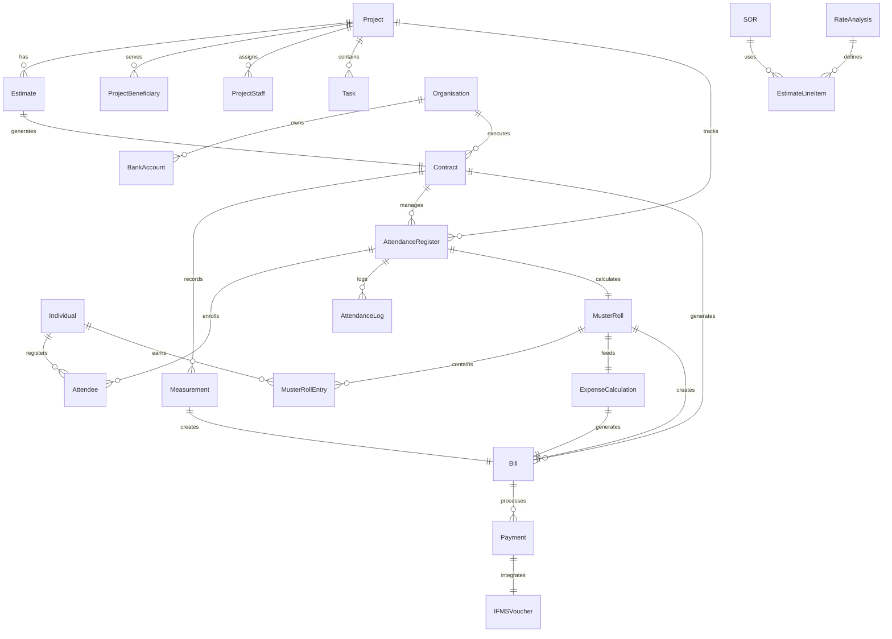

# DIGIT Works Platform v1.1 - Complete Service Documentation

## Table of Contents
1. [Platform Overview](#platform-overview)
2. [Service Architecture](#service-architecture)
3. [Actual Workflow](#actual-workflow)
4. [Service Dependencies & Master Data](#service-dependencies--master-data)
5. [API Specifications](#api-specifications)
6. [Data Models & Relationships](#data-models--relationships)

---

## Platform Overview

The DIGIT Works Platform v1.1 is a comprehensive system for managing public works projects. The platform consists of the following core services based on actual specifications:

### Core Services (Available in v1.1)
1. **Project Service** - Project management and hierarchy
2. **Organisation Service** - Contractor and vendor management  
3. **Estimate Service** - Cost estimation and BOQ management
4. **Contract Service** - Contract lifecycle management
5. **Measurement Service** - Work measurement and verification
6. **Expense/Bill Service** - Bill generation and payment processing
7. **Bank Account Service** - Bank account management
8. **SOR Service** - Schedule of Rates management
9. **Rate Analysis Service** - Analysis for non-SOR items
10. **Statement Service** - Financial statements and reports

### Works Management Services (WMS)
11. **Attendance Service** - Attendance logging and tracking
12. **Muster Roll Service** - Wage calculation and muster roll management
13. **Individual Service** - Wage seeker registration and management
14. **Expense Calculator Service** - Business logic for expense calculations

### Integration Services
15. **IFMS Adapter Service** - Integration with state financial systems
16. **SMS/Notification Service** - Communication and notifications
17. **Human Resource Management Service** - Employee and staff management

---

## Service Architecture

```
┌─────────────────────────────────────────────────────────────────┐
│                    DIGIT Works Platform v1.1                    │
├─────────────────────────────────────────────────────────────────┤
│                                                                 │
│  ┌──────────────┐  ┌──────────────┐  ┌──────────────┐        │
│  │   Project    │  │  Estimate    │  │   Contract   │        │
│  │   Service    │→ │   Service    │→ │   Service    │        │
│  └──────────────┘  └──────────────┘  └──────────────┘        │
│         ↓                  ↓                 ↓                 │
│  ┌──────────────┐  ┌──────────────┐  ┌──────────────┐        │
│  │Organisation  │  │     SOR      │  │ Measurement  │        │
│  │   Service    │  │   Service    │  │   Service    │        │
│  └──────────────┘  └──────────────┘  └──────────────┘        │
│                            ↓                 ↓                 │
│  ┌──────────────┐  ┌──────────────┐  ┌──────────────┐        │
│  │ Bank Account │  │Rate Analysis │  │Expense/Bill  │        │
│  │   Service    │  │   Service    │  │   Service    │        │
│  └──────────────┘  └──────────────┘  └──────────────┘        │
│                                              ↓                 │
│                                     ┌──────────────┐          │
│                                     │  Statement   │          │
│                                     │   Service    │          │
│                                     └──────────────┘          │
└─────────────────────────────────────────────────────────────────┘
```

---

## Actual Workflow

### Complete Works Management Flow (Based on Available Services)

```
1. Project Creation
   └─→ 2. Organisation Registration (Contractor/Vendor)
       └─→ 3. Estimate Preparation
           └─→ 4. Contract Creation
               └─→ 5. Work Execution Phase
                   ├─→ 5a. Attendance Registration
                   ├─→ 5b. Daily Attendance Logging
                   ├─→ 5c. Muster Roll Generation
                   └─→ 5d. Measurement Recording
                       └─→ 6. Expense Calculation
                           └─→ 7. Bill Generation
                               └─→ 8. Payment Processing (JIT Integration)
```

### Additional Workflows for Works Management

#### Wage Seeker Management
```
Individual Registration → Skill Verification → Work Assignment → Attendance Tracking → Wage Calculation
```

#### Payment Integration
```
Bill Approval → Expense Calculator → IFMS Integration → Payment Instruction → Payment Status Update
```

### Detailed Flow Description

#### Phase 1: Project Initiation
**Service**: Project Service  
**Dependencies**: 
- Organisation Service (for project owner details)
- MDMS Masters: ProjectType, Department, hierarchyType

**Flow**:
1. Create project with basic details
2. Link project beneficiaries
3. Assign project staff
4. Create project tasks (if enabled)
5. Link facilities and resources

#### Phase 2: Organisation Setup
**Service**: Organisation Service  
**Dependencies**:
- Bank Account Service
- MDMS Masters: OrgType, OrgFunctionClass, OrgTaxIdentifier

**Flow**:
1. Register organisation (contractor/vendor)
2. Add contact details
3. Link bank accounts
4. Define functional areas

#### Phase 3: Estimation
**Service**: Estimate Service  
**Dependencies**:
- Project Service (projectId required)
- SOR Service (for SOR items)
- Rate Analysis Service (for non-SOR items)
- MDMS Masters: EstimateTemplate, UOM, Overheads

**Flow**:
1. Create estimate linked to project
2. Add line items (SOR and non-SOR)
3. Apply overhead charges
4. Calculate total estimate value
5. Submit for approval

#### Phase 4: Contract Management
**Service**: Contract Service  
**Dependencies**:
- Estimate Service (estimateId required)
- Organisation Service (orgId for contractor)
- MDMS Masters: ContractType, DocumentConfig

**Flow**:
1. Create contract from approved estimate
2. Link contractor organisation
3. Define contract terms
4. Set security deposit
5. Process contract approval

#### Phase 5: Measurement
**Service**: Measurement Service  
**Dependencies**:
- Contract Service (contractId)
- MDMS Masters: MeasurementCriteria, UOM

**Flow**:
1. Create measurement book
2. Record measurements against contract items
3. Verify measurements
4. Approve measurement book

#### Phase 6: Billing & Payment
**Service**: Expense/Bill Service  
**Dependencies**:
- Contract Service
- Measurement Service
- Bank Account Service
- MDMS Masters: HeadCodes, ApplicableCharges, PaymentInstructionType

**Flow**:
1. Generate bill from approved measurements
2. Apply deductions and charges
3. Calculate net payable amount
4. Process payment instruction
5. Update payment status

---

## Service Dependencies & Master Data

### 1. Project Service

**API Endpoints**:
```
POST /project/v1/_create
POST /project/v1/_update
POST /project/v1/_search
POST /project/beneficiary/v1/_create
POST /project/beneficiary/v1/_search
POST /project/task/v1/_create
POST /project/task/v1/_search
POST /project/staff/v1/_create
POST /project/staff/v1/_search
POST /project/facility/v1/_create
POST /project/resource/v1/_create
```

**Dependencies**:
- Organisation Service (for project owner)

**MDMS Masters Used**:
- `works.ProjectType` - Project types and subtypes
- `common-masters.Department` - Department list
- `common-masters.hierarchyType` - Project hierarchy types
- `works.TargetDemography` - Target beneficiary types
- `common-masters.Designation` - Staff designations

**Key Fields**:
```json
{
  "id": "UUID",
  "projectNumber": "PR/2024-25/001",
  "name": "Road Construction Project",
  "projectType": "from MDMS",
  "department": "from MDMS",
  "startDate": "epoch",
  "endDate": "epoch",
  "address": {},
  "targets": [],
  "parent": "parent-project-id"
}
```

### 2. Organisation Service

**API Endpoints**:
```
POST /org-services/organisation/v1/_create
POST /org-services/organisation/v1/_update
POST /org-services/organisation/v1/_search
```

**Dependencies**:
- Bank Account Service

**MDMS Masters Used**:
- `common-masters.OrgType` - Organisation types
- `common-masters.OrgFunctionClass` - Functional classification
- `common-masters.OrgFunctionCategory` - Functional categories
- `common-masters.OrgTaxIdentifier` - Tax identifiers (PAN, GST)

**Key Fields**:
```json
{
  "id": "UUID",
  "name": "ABC Contractors",
  "applicationNumber": "ORG/2024-25/001",
  "orgNumber": "ORG001",
  "registrationStatus": "ACTIVE",
  "orgType": "from MDMS",
  "taxIdentifiers": [],
  "orgFunctions": [],
  "bankAccounts": []
}
```

### 3. Estimate Service

**API Endpoints**:
```
POST /estimate/v1/_create
POST /estimate/v1/_update
POST /estimate/v1/_search
```

**Dependencies**:
- Project Service (projectId required)
- SOR Service
- Rate Analysis Service

**MDMS Masters Used**:
- `WORKS.EstimateTemplate` - Estimate templates
- `common-masters.UOM` - Units of measurement
- `works.Overheads` - Overhead charges
- `works.Category` - Work categories

**Key Fields**:
```json
{
  "id": "UUID",
  "estimateNumber": "EST/2024-25/001",
  "projectId": "project-uuid",
  "estimateType": "ESTIMATE",
  "status": "ACTIVE",
  "estimateDetails": [
    {
      "lineItems": [],
      "category": "from MDMS",
      "uom": "from MDMS",
      "rate": 1000,
      "quantity": 100,
      "amount": 100000
    }
  ]
}
```

### 4. Contract Service

**API Endpoints**:
```
POST /contract/v1/_create
POST /contract/v1/_update
POST /contract/v1/_search
```

**Dependencies**:
- Estimate Service (estimateId required)
- Organisation Service (orgId for contractor)

**MDMS Masters Used**:
- `works.ContractType` - Contract types
- `works.DocumentConfig` - Required documents
- `expense.BusinessService` - Workflow configuration

**Key Fields**:
```json
{
  "id": "UUID",
  "contractNumber": "CON/2024-25/001",
  "estimateId": "estimate-uuid",
  "orgId": "contractor-org-uuid",
  "agreementDate": "epoch",
  "defectLiabilityPeriod": 365,
  "contractType": "from MDMS",
  "status": "ACTIVE",
  "securityDeposit": 50000,
  "agreementAmount": 1000000,
  "lineItems": []
}
```

### 5. Measurement Service

**API Endpoints**:
```
POST /measurement/v1/_create
POST /measurement/v1/_update  
POST /measurement/v1/_search
```

**Dependencies**:
- Contract Service (contractId required)

**MDMS Masters Used**:
- `works.MeasurementCriteria` - Measurement rules
- `common-masters.UOM` - Units of measurement
- `works.MeasurementBFFConfig` - UI configuration

**Key Fields**:
```json
{
  "id": "UUID",
  "measurementNumber": "MB/2024-25/001",
  "contractId": "contract-uuid",
  "physicalRefNumber": "MB-001",
  "isActive": true,
  "measurements": [
    {
      "targetId": "contract-line-item-id",
      "cumulativeValue": 50,
      "currentValue": 10
    }
  ]
}
```

### 6. Expense/Bill Service

**API Endpoints**:
```
POST /expense/bill/v1/_create
POST /expense/bill/v1/_update
POST /expense/bill/v1/_search
POST /expense/payment/v1/_create
POST /expense/payment/v1/_search
```

**Dependencies**:
- Contract Service
- Measurement Service
- Muster Roll Service
- Expense Calculator Service
- Bank Account Service

**MDMS Masters Used**:
- `expense.HeadCodes` - Budget head codes
- `expense.ApplicableCharges` - Deduction types
- `expense.PayerList` - Payer configuration
- `expense.PaymentInstructionType` - Payment types
- `expense.PaymentInstructionStatus` - Payment statuses

**Key Fields**:
```json
{
  "id": "UUID",
  "billNumber": "BILL/2024-25/001",
  "contractId": "contract-uuid",
  "fromPeriod": "epoch",
  "toPeriod": "epoch",
  "billAmount": 100000,
  "paidAmount": 0,
  "status": "APPROVED",
  "billDetails": [
    {
      "lineItems": [],
      "payableAmount": 100000,
      "billDeductions": []
    }
  ]
}
```

### 7. Bank Account Service

**API Endpoints**:
```
POST /bankaccount/v1/_create
POST /bankaccount/v1/_update
POST /bankaccount/v1/_search
```

**MDMS Masters Used**:
- `works.BankAccType` - Account types

**Key Fields**:
```json
{
  "id": "UUID",
  "accountNumber": "1234567890",
  "accountType": "from MDMS",
  "bankName": "State Bank",
  "bankBranch": "Main Branch",
  "ifscCode": "SBIN0001234"
}
```

### 8. SOR Service

**API Endpoints**:
```
POST /sor/v1/_create
POST /sor/v1/_update
POST /sor/v1/_search
```

**MDMS Masters Used**:
- `WORKS-SOR.SOR` - Schedule of rates
- `WORKS-SOR.Type` - SOR types
- `WORKS-SOR.SubType` - SOR subtypes
- `WORKS-SOR.Variant` - SOR variants
- `WORKS-SOR.Composition` - Material composition
- `WORKS-SOR.Overhead` - Overhead percentages
- `WORKS-SOR.Rates` - Location-specific rates

**Key Fields**:
```json
{
  "id": "UUID",
  "sorNumber": "SOR001",
  "sorType": "from MDMS",
  "description": "Earthwork excavation",
  "uom": "CUM",
  "rate": 500,
  "validFrom": "epoch",
  "validTo": "epoch"
}
```

### 9. Attendance Service

**API Endpoints**:
```
POST /attendance/v1/_create
POST /attendance/v1/_update
POST /attendance/v1/_search
POST /attendance/log/v1/_create
POST /attendance/log/v1/_update
POST /attendance/attendee/v1/_create
POST /attendance/staff/v1/_create
```

**Dependencies**:
- Individual Service
- Project Service

**MDMS Masters Used**:
- `common-masters.MusterRoll` - Muster roll configurations
- `common-masters.AttendanceHours` - Working hours configuration

**Key Fields**:
```json
{
  "id": "UUID",
  "attendanceRegisterNumber": "ATT/2024-25/001",
  "name": "Site Attendance Register",
  "referenceId": "contract-uuid",
  "serviceCode": "WORKS.ATTENDANCE",
  "attendees": [
    {
      "individualId": "individual-uuid",
      "enrollmentDate": "epoch",
      "denrollmentDate": "epoch"
    }
  ],
  "logs": [
    {
      "individualId": "individual-uuid", 
      "time": "epoch",
      "type": "ENTRY/EXIT"
    }
  ]
}
```

### 10. Muster Roll Service

**API Endpoints**:
```
POST /muster-roll/v1/_create
POST /muster-roll/v1/_update
POST /muster-roll/v1/_search
POST /muster-roll/v1/_estimate
```

**Dependencies**:
- Attendance Service
- Individual Service
- Contract Service

**MDMS Masters Used**:
- `common-masters.MusterRoll` - Muster roll business rules
- `common-masters.UOM` - Units for wage calculation
- `works.Category` - Work categories for wage rates

**Key Fields**:
```json
{
  "id": "UUID",
  "musterRollNumber": "MR/2024-25/001",
  "registerId": "attendance-register-uuid",
  "status": "APPROVED",
  "startDate": "epoch",
  "endDate": "epoch",
  "individualEntries": [
    {
      "individualId": "individual-uuid",
      "totalAttendance": 8.5,
      "actualWorkingDays": 21,
      "payableAmount": 10500
    }
  ]
}
```

### 11. Individual Service (Wage Seeker Registration)

**API Endpoints**:
```
POST /individual/v1/_create
POST /individual/v1/_update
POST /individual/v1/_search
```

**Dependencies**:
- None (Core service)

**MDMS Masters Used**:
- `common-masters.GenderType` - Gender options
- `common-masters.SocialCategory` - Social categories
- `common-masters.WageSeekerSkills` - Available skills
- `common-masters.Relationship` - Family relationships

**Key Fields**:
```json
{
  "id": "UUID",
  "individualId": "IND/2024-25/001",
  "name": {
    "givenName": "John",
    "familyName": "Doe"
  },
  "gender": "MALE",
  "dateOfBirth": "epoch",
  "skills": [
    {
      "type": "MASON",
      "level": "SKILLED"
    }
  ],
  "identifiers": [
    {
      "type": "AADHAAR",
      "value": "xxxx-xxxx-1234"
    }
  ]
}
```

### 12. Expense Calculator Service

**API Endpoints**:
```
POST /expense-calculator/v1/_calculate
POST /expense-calculator/v1/_estimate
```

**Dependencies**:
- Measurement Service
- Muster Roll Service
- Contract Service
- Expense Service

**MDMS Masters Used**:
- `expense.ApplicableCharges` - Tax and deduction rules
- `expense.HeadCodes` - Financial accounting heads
- `expense.BusinessService` - Calculation workflows

**Key Fields**:
```json
{
  "calculationCriteria": [
    {
      "contractId": "contract-uuid", 
      "musterRollId": "muster-uuid",
      "billCriteria": {
        "type": "WAGE",
        "fromPeriod": "epoch",
        "toPeriod": "epoch"
      }
    }
  ],
  "calculation": {
    "totalAmount": 100000,
    "deductions": 15000,
    "netAmount": 85000
  }
}
```

### 13. IFMS Integration Service

**Purpose**: Integration with State Financial Management Systems for payment processing

**API Endpoints**:
```
POST /ifms-adapter/payment/_create
POST /ifms-adapter/payment/_status
POST /ifms-adapter/voucher/_create
GET  /ifms-adapter/balance/_check
```

**Dependencies**:
- Expense Service
- External IFMS/JIT system

**MDMS Masters Used**:
- `ifms.HeadOfAccounts` - Chart of accounts mapping
- `ifms.SchemeDetails` - Government scheme codes
- `ifms.SSUDetails` - Spending unit details
- `ifms.JitMockResponse` - JIT integration test data

**Key Features**:
- Real-time fund availability check
- Payment order generation
- Status tracking and reconciliation
- Voucher management

---

## Data Models & Relationships

### Entity Relationship Diagram



### Service Flow Dependencies

```
Project Service
    ↓ (projectId)
Estimate Service → SOR Service
    ↓ (estimateId)    ↓
Contract Service ← Rate Analysis Service
    ↓ (contractId)
    ├─→ Measurement Service
    └─→ Attendance Service → Individual Service
            ↓ (attendance logs)
        Muster Roll Service
            ↓ (muster roll data)
        Expense Calculator Service
            ↓ (calculations)
        Expense/Bill Service → Bank Account Service
            ↓ (payment instructions)
        IFMS Integration Service
            ↓ (vouchers)
        Statement Service
```

### Complete Works Execution Flow

```
Individual Registration
    ↓
Project Creation → Contract Award
    ↓
Attendance Registration
    ↓
Daily Attendance Logging
    ↓
Muster Roll Generation (Weekly/Fortnightly)
    ↓
Wage Bill Creation (Expense Calculator)
    ↓
Bill Approval Workflow
    ↓
Payment Processing (IFMS/JIT Integration)
    ↓
Payment Status Update & Reconciliation
```

---

## Advanced Features

### JIT (Just In Time) Integration

**Purpose**: Real-time integration with state financial management systems for fund availability and payment processing.

**Key Features**:
1. **Fund Availability Check**: Real-time balance verification before bill creation
2. **Payment Order Generation**: Automatic creation of payment vouchers
3. **Status Tracking**: Real-time payment status updates
4. **Reconciliation**: Automatic matching of payments with bills

**Integration Flow**:
```
Bill Approval → Fund Check (JIT) → Payment Order → Voucher Creation → Payment Execution → Status Update
```

**MDMS Configuration**:
- `ifms.SchemeDetails` - Government scheme mapping
- `ifms.SSUDetails` - Spending unit configuration  
- `ifms.HeadOfAccounts` - Financial head mapping
- `ifms.JitMockResponse` - Test/Mock responses

### Expense Calculator Workflow

**Purpose**: Business logic engine for calculating wages, deductions, and final payable amounts.

**Calculation Types**:
1. **Wage Bills**: Based on muster roll attendance
2. **Material Bills**: Based on measurement quantities
3. **Supervision Bills**: Based on contract milestones

**Calculation Process**:
1. **Input Validation**: Verify contract, muster roll, or measurement data
2. **Base Calculation**: Calculate gross amounts based on rates
3. **Deduction Processing**: Apply taxes, advances, and other deductions
4. **Final Computation**: Generate net payable amount
5. **Bill Generation**: Create bill through Expense Service

**Business Rules (Configurable via MDMS)**:
- Tax rates and thresholds
- Deduction types and percentages
- Overtime calculation rules
- Bonus and incentive calculations

### Attendance and Muster Roll Business Logic

**Attendance Rules** (from `common-masters.MusterRoll`):
- `FULL_DAY_NUM_HOURS`: 8 hours = Full day
- `HALF_DAY_NUM_HOURS`: 4 hours = Half day  
- `ROUND_OFF_HOURS`: Whether to round attendance
- `EXIT_HOUR_FULL_DAY`: Latest exit time for full day

**Muster Roll Calculation**:
1. **Attendance Aggregation**: Sum daily attendance logs
2. **Skill-based Rates**: Apply rates based on worker skills
3. **Overtime Calculation**: Calculate overtime if applicable
4. **Deduction Processing**: Apply standard deductions
5. **Final Amount**: Calculate net wage amount

---

## Common MDMS Masters

### Access Control
- `ACCESSCONTROL-ROLES` - System roles
- `ACCESSCONTROL-ROLEACTIONS` - Role-action mapping
- `ACCESSCONTROL-ACTIONS-TEST` - Available actions

### Common Masters
- `common-masters.Department` - Department list
- `common-masters.Designation` - Designations
- `common-masters.UOM` - Units of measurement
- `common-masters.StateInfo` - State information
- `common-masters.IdFormat` - ID generation formats

### Works Specific
- `works.Category` - Work categories
- `works.ContractType` - Contract types
- `works.ProjectType` - Project types
- `works.CBORoles` - CBO roles
- `works.OICRoles` - OIC roles

### Financial
- `expense.HeadCodes` - Budget heads
- `expense.ApplicableCharges` - Deductions
- `segment-codes.*` - Financial segment codes
- `ifms.SchemeDetails` - Scheme information

### UI Configuration
- `commonMuktaUiConfig.*` - UI field configurations
- `commonUiConfig.*` - UI display configurations
- `INBOX.*` - Inbox configurations
- `SEARCH.*` - Search configurations

---

## API Response Structure

### Standard Request Format
```json
{
  "RequestInfo": {
    "apiId": "org.egov.works",
    "ver": "1.0",
    "ts": 1704067200000,
    "msgId": "unique-id",
    "authToken": "token"
  },
  "Entity": {
    // Entity specific data
  }
}
```

### Standard Response Format
```json
{
  "ResponseInfo": {
    "apiId": "org.egov.works",
    "ver": "1.0",
    "ts": 1704067200000,
    "msgId": "unique-id",
    "status": "successful"
  },
  "Entity": {
    // Response data
  }
}
```

---

## Workflow Integration

Each major entity follows workflow states:

### Estimate Workflow
```
DRAFT → SUBMITTED → CHECKED → APPROVED → REJECTED
```

### Contract Workflow
```
DRAFT → PENDING_APPROVAL → APPROVED → ACTIVE → COMPLETED
```

### Bill Workflow
```
DRAFT → SUBMITTED → VERIFIED → APPROVED → PAID
```

---

## Key Integration Points

1. **Project → Estimate**: projectId linkage
2. **Estimate → Contract**: estimateId linkage
3. **Contract → Measurement**: contractId linkage
4. **Measurement → Bill**: measurement-based billing
5. **Organisation → Contract**: contractor linkage
6. **All Services → MDMS**: Master data dependency
7. **All Services → Workflow**: State management

---

## Version Information

**Platform Version**: 1.1  
**API Version**: v1  
**OpenAPI Specification**: 3.0.0  
**Last Updated**: December 2024

---

*This document represents the actual state of DIGIT Works v1.1 based on available service specifications and MDMS configurations.*