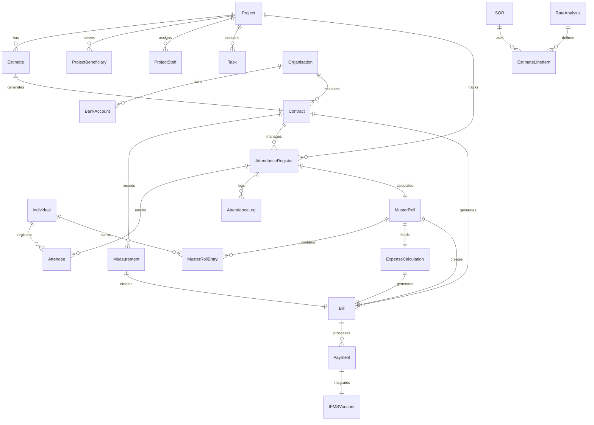

# DIGIT Works Platform v1.1 - Complete Service Documentation

## Table of Contents
1. [Platform Overview](#platform-overview)
2. [Service Architecture](#service-architecture)
3. [Actual Workflow](#actual-workflow)
4. [Service Dependencies & Master Data](#service-dependencies--master-data)
5. [API Specifications](#api-specifications)
6. [Data Models & Relationships](#data-models--relationships)

---

## Platform Overview

The DIGIT Works Platform v1.1 is a comprehensive system for managing public works projects. The platform consists of the following core services based on actual specifications:

### Core Services (Available in v1.1)
1. **Project Service** - Project management and hierarchy
2. **Organisation Service** - Contractor and vendor management  
3. **Estimate Service** - Cost estimation and BOQ management
4. **Contract Service** - Contract lifecycle management
5. **Measurement Service** - Work measurement and verification
6. **Expense/Bill Service** - Bill generation and payment processing
7. **Bank Account Service** - Bank account management
8. **SOR Service** - Schedule of Rates management
9. **Rate Analysis Service** - Analysis for non-SOR items
10. **Statement Service** - Financial statements and reports

### Works Management Services (WMS)
11. **Attendance Service** - Attendance logging and tracking
12. **Muster Roll Service** - Wage calculation and muster roll management
13. **Individual Service** - Wage seeker registration and management
14. **Expense Calculator Service** - Business logic for expense calculations

### Integration Services
15. **IFMS Adapter Service** - Integration with state financial systems
16. **SMS/Notification Service** - Communication and notifications
17. **Human Resource Management Service** - Employee and staff management

---

## Service Architecture

```
┌─────────────────────────────────────────────────────────────────┐
│                    DIGIT Works Platform v1.1                    │
├─────────────────────────────────────────────────────────────────┤
│                                                                 │
│  ┌──────────────┐  ┌──────────────┐  ┌──────────────┐        │
│  │   Project    │  │  Estimate    │  │   Contract   │        │
│  │   Service    │→ │   Service    │→ │   Service    │        │
│  └──────────────┘  └──────────────┘  └──────────────┘        │
│         ↓                  ↓                 ↓                 │
│  ┌──────────────┐  ┌──────────────┐  ┌──────────────┐        │
│  │Organisation  │  │     SOR      │  │ Measurement  │        │
│  │   Service    │  │   Service    │  │   Service    │        │
│  └──────────────┘  └──────────────┘  └──────────────┘        │
│                            ↓                 ↓                 │
│  ┌──────────────┐  ┌──────────────┐  ┌──────────────┐        │
│  │ Bank Account │  │Rate Analysis │  │Expense/Bill  │        │
│  │   Service    │  │   Service    │  │   Service    │        │
│  └──────────────┘  └──────────────┘  └──────────────┘        │
│                                              ↓                 │
│                                     ┌──────────────┐          │
│                                     │  Statement   │          │
│                                     │   Service    │          │
│                                     └──────────────┘          │
└─────────────────────────────────────────────────────────────────┘
```

---

## Actual Workflow

### Complete Works Management Flow (Based on Available Services)

```
1. Project Creation
   └─→ 2. Organisation Registration (Contractor/Vendor)
       └─→ 3. Estimate Preparation
           └─→ 4. Contract Creation
               └─→ 5. Work Execution Phase
                   ├─→ 5a. Attendance Registration
                   ├─→ 5b. Daily Attendance Logging
                   ├─→ 5c. Muster Roll Generation
                   └─→ 5d. Measurement Recording
                       └─→ 6. Expense Calculation
                           └─→ 7. Bill Generation
                               └─→ 8. Payment Processing (JIT Integration)
```

### Additional Workflows for Works Management

#### Wage Seeker Management
```
Individual Registration → Skill Verification → Work Assignment → Attendance Tracking → Wage Calculation
```

#### Payment Integration
```
Bill Approval → Expense Calculator → IFMS Integration → Payment Instruction → Payment Status Update
```

### Detailed Flow Description

#### Phase 1: Project Initiation
**Service**: Project Service  
**Dependencies**: 
- Organisation Service (for project owner details)
- MDMS Masters: ProjectType, Department, hierarchyType

**Flow**:
1. Create project with basic details
2. Link project beneficiaries
3. Assign project staff
4. Create project tasks (if enabled)
5. Link facilities and resources

#### Phase 2: Organisation Setup
**Service**: Organisation Service  
**Dependencies**:
- Bank Account Service
- MDMS Masters: OrgType, OrgFunctionClass, OrgTaxIdentifier

**Flow**:
1. Register organisation (contractor/vendor)
2. Add contact details
3. Link bank accounts
4. Define functional areas

#### Phase 3: Estimation
**Service**: Estimate Service  
**Dependencies**:
- Project Service (projectId required)
- SOR Service (for SOR items)
- Rate Analysis Service (for non-SOR items)
- MDMS Masters: EstimateTemplate, UOM, Overheads

**Flow**:
1. Create estimate linked to project
2. Add line items (SOR and non-SOR)
3. Apply overhead charges
4. Calculate total estimate value
5. Submit for approval

#### Phase 4: Contract Management
**Service**: Contract Service  
**Dependencies**:
- Estimate Service (estimateId required)
- Organisation Service (orgId for contractor)
- MDMS Masters: ContractType, DocumentConfig

**Flow**:
1. Create contract from approved estimate
2. Link contractor organisation
3. Define contract terms
4. Set security deposit
5. Process contract approval

#### Phase 5: Measurement
**Service**: Measurement Service  
**Dependencies**:
- Contract Service (contractId)
- MDMS Masters: MeasurementCriteria, UOM

**Flow**:
1. Create measurement book
2. Record measurements against contract items
3. Verify measurements
4. Approve measurement book

#### Phase 6: Billing & Payment
**Service**: Expense/Bill Service  
**Dependencies**:
- Contract Service
- Measurement Service
- Bank Account Service
- MDMS Masters: HeadCodes, ApplicableCharges, PaymentInstructionType

**Flow**:
1. Generate bill from approved measurements
2. Apply deductions and charges
3. Calculate net payable amount
4. Process payment instruction
5. Update payment status

---

## Service Dependencies & Master Data

### 1. Project Service

**API Endpoints**:
```
POST /project/v1/_create
POST /project/v1/_update
POST /project/v1/_search
POST /project/beneficiary/v1/_create
POST /project/beneficiary/v1/_search
POST /project/task/v1/_create
POST /project/task/v1/_search
POST /project/staff/v1/_create
POST /project/staff/v1/_search
POST /project/facility/v1/_create
POST /project/resource/v1/_create
```

**Dependencies**:
- Organisation Service (for project owner)

**MDMS Masters Used**:
- `works.ProjectType` - Project types and subtypes
- `common-masters.Department` - Department list
- `common-masters.hierarchyType` - Project hierarchy types
- `works.TargetDemography` - Target beneficiary types
- `common-masters.Designation` - Staff designations

**Key Fields**:
```json
{
  "id": "UUID",
  "projectNumber": "PR/2024-25/001",
  "name": "Road Construction Project",
  "projectType": "from MDMS",
  "department": "from MDMS",
  "startDate": "epoch",
  "endDate": "epoch",
  "address": {},
  "targets": [],
  "parent": "parent-project-id"
}
```

### 2. Organisation Service

**API Endpoints**:
```
POST /org-services/organisation/v1/_create
POST /org-services/organisation/v1/_update
POST /org-services/organisation/v1/_search
```

**Dependencies**:
- Bank Account Service

**MDMS Masters Used**:
- `common-masters.OrgType` - Organisation types
- `common-masters.OrgFunctionClass` - Functional classification
- `common-masters.OrgFunctionCategory` - Functional categories
- `common-masters.OrgTaxIdentifier` - Tax identifiers (PAN, GST)

**Key Fields**:
```json
{
  "id": "UUID",
  "name": "ABC Contractors",
  "applicationNumber": "ORG/2024-25/001",
  "orgNumber": "ORG001",
  "registrationStatus": "ACTIVE",
  "orgType": "from MDMS",
  "taxIdentifiers": [],
  "orgFunctions": [],
  "bankAccounts": []
}
```

### 3. Estimate Service

**API Endpoints**:
```
POST /estimate/v1/_create
POST /estimate/v1/_update
POST /estimate/v1/_search
```

**Dependencies**:
- Project Service (projectId required)
- SOR Service
- Rate Analysis Service

**MDMS Masters Used**:
- `WORKS.EstimateTemplate` - Estimate templates
- `common-masters.UOM` - Units of measurement
- `works.Overheads` - Overhead charges
- `works.Category` - Work categories

**Key Fields**:
```json
{
  "id": "UUID",
  "estimateNumber": "EST/2024-25/001",
  "projectId": "project-uuid",
  "estimateType": "ESTIMATE",
  "status": "ACTIVE",
  "estimateDetails": [
    {
      "lineItems": [],
      "category": "from MDMS",
      "uom": "from MDMS",
      "rate": 1000,
      "quantity": 100,
      "amount": 100000
    }
  ]
}
```

### 4. Contract Service

**API Endpoints**:
```
POST /contract/v1/_create
POST /contract/v1/_update
POST /contract/v1/_search
```

**Dependencies**:
- Estimate Service (estimateId required)
- Organisation Service (orgId for contractor)

**MDMS Masters Used**:
- `works.ContractType` - Contract types
- `works.DocumentConfig` - Required documents
- `expense.BusinessService` - Workflow configuration

**Key Fields**:
```json
{
  "id": "UUID",
  "contractNumber": "CON/2024-25/001",
  "estimateId": "estimate-uuid",
  "orgId": "contractor-org-uuid",
  "agreementDate": "epoch",
  "defectLiabilityPeriod": 365,
  "contractType": "from MDMS",
  "status": "ACTIVE",
  "securityDeposit": 50000,
  "agreementAmount": 1000000,
  "lineItems": []
}
```

### 5. Measurement Service

**API Endpoints**:
```
POST /measurement/v1/_create
POST /measurement/v1/_update  
POST /measurement/v1/_search
```

**Dependencies**:
- Contract Service (contractId required)

**MDMS Masters Used**:
- `works.MeasurementCriteria` - Measurement rules
- `common-masters.UOM` - Units of measurement
- `works.MeasurementBFFConfig` - UI configuration

**Key Fields**:
```json
{
  "id": "UUID",
  "measurementNumber": "MB/2024-25/001",
  "contractId": "contract-uuid",
  "physicalRefNumber": "MB-001",
  "isActive": true,
  "measurements": [
    {
      "targetId": "contract-line-item-id",
      "cumulativeValue": 50,
      "currentValue": 10
    }
  ]
}
```

### 6. Expense/Bill Service

**API Endpoints**:
```
POST /expense/bill/v1/_create
POST /expense/bill/v1/_update
POST /expense/bill/v1/_search
POST /expense/payment/v1/_create
POST /expense/payment/v1/_search
```

**Dependencies**:
- Contract Service
- Measurement Service
- Muster Roll Service
- Expense Calculator Service
- Bank Account Service

**MDMS Masters Used**:
- `expense.HeadCodes` - Budget head codes
- `expense.ApplicableCharges` - Deduction types
- `expense.PayerList` - Payer configuration
- `expense.PaymentInstructionType` - Payment types
- `expense.PaymentInstructionStatus` - Payment statuses

**Key Fields**:
```json
{
  "id": "UUID",
  "billNumber": "BILL/2024-25/001",
  "contractId": "contract-uuid",
  "fromPeriod": "epoch",
  "toPeriod": "epoch",
  "billAmount": 100000,
  "paidAmount": 0,
  "status": "APPROVED",
  "billDetails": [
    {
      "lineItems": [],
      "payableAmount": 100000,
      "billDeductions": []
    }
  ]
}
```

### 7. Bank Account Service

**API Endpoints**:
```
POST /bankaccount/v1/_create
POST /bankaccount/v1/_update
POST /bankaccount/v1/_search
```

**MDMS Masters Used**:
- `works.BankAccType` - Account types

**Key Fields**:
```json
{
  "id": "UUID",
  "accountNumber": "1234567890",
  "accountType": "from MDMS",
  "bankName": "State Bank",
  "bankBranch": "Main Branch",
  "ifscCode": "SBIN0001234"
}
```

### 8. SOR Service

**API Endpoints**:
```
POST /sor/v1/_create
POST /sor/v1/_update
POST /sor/v1/_search
```

**MDMS Masters Used**:
- `WORKS-SOR.SOR` - Schedule of rates
- `WORKS-SOR.Type` - SOR types
- `WORKS-SOR.SubType` - SOR subtypes
- `WORKS-SOR.Variant` - SOR variants
- `WORKS-SOR.Composition` - Material composition
- `WORKS-SOR.Overhead` - Overhead percentages
- `WORKS-SOR.Rates` - Location-specific rates

**Key Fields**:
```json
{
  "id": "UUID",
  "sorNumber": "SOR001",
  "sorType": "from MDMS",
  "description": "Earthwork excavation",
  "uom": "CUM",
  "rate": 500,
  "validFrom": "epoch",
  "validTo": "epoch"
}
```

### 9. Attendance Service

**API Endpoints**:
```
POST /attendance/v1/_create
POST /attendance/v1/_update
POST /attendance/v1/_search
POST /attendance/log/v1/_create
POST /attendance/log/v1/_update
POST /attendance/attendee/v1/_create
POST /attendance/staff/v1/_create
```

**Dependencies**:
- Individual Service
- Project Service

**MDMS Masters Used**:
- `common-masters.MusterRoll` - Muster roll configurations
- `common-masters.AttendanceHours` - Working hours configuration

**Key Fields**:
```json
{
  "id": "UUID",
  "attendanceRegisterNumber": "ATT/2024-25/001",
  "name": "Site Attendance Register",
  "referenceId": "contract-uuid",
  "serviceCode": "WORKS.ATTENDANCE",
  "attendees": [
    {
      "individualId": "individual-uuid",
      "enrollmentDate": "epoch",
      "denrollmentDate": "epoch"
    }
  ],
  "logs": [
    {
      "individualId": "individual-uuid", 
      "time": "epoch",
      "type": "ENTRY/EXIT"
    }
  ]
}
```

### 10. Muster Roll Service

**API Endpoints**:
```
POST /muster-roll/v1/_create
POST /muster-roll/v1/_update
POST /muster-roll/v1/_search
POST /muster-roll/v1/_estimate
```

**Dependencies**:
- Attendance Service
- Individual Service
- Contract Service

**MDMS Masters Used**:
- `common-masters.MusterRoll` - Muster roll business rules
- `common-masters.UOM` - Units for wage calculation
- `works.Category` - Work categories for wage rates

**Key Fields**:
```json
{
  "id": "UUID",
  "musterRollNumber": "MR/2024-25/001",
  "registerId": "attendance-register-uuid",
  "status": "APPROVED",
  "startDate": "epoch",
  "endDate": "epoch",
  "individualEntries": [
    {
      "individualId": "individual-uuid",
      "totalAttendance": 8.5,
      "actualWorkingDays": 21,
      "payableAmount": 10500
    }
  ]
}
```

### 11. Individual Service (Wage Seeker Registration)

**API Endpoints**:
```
POST /individual/v1/_create
POST /individual/v1/_update
POST /individual/v1/_search
```

**Dependencies**:
- None (Core service)

**MDMS Masters Used**:
- `common-masters.GenderType` - Gender options
- `common-masters.SocialCategory` - Social categories
- `common-masters.WageSeekerSkills` - Available skills
- `common-masters.Relationship` - Family relationships

**Key Fields**:
```json
{
  "id": "UUID",
  "individualId": "IND/2024-25/001",
  "name": {
    "givenName": "John",
    "familyName": "Doe"
  },
  "gender": "MALE",
  "dateOfBirth": "epoch",
  "skills": [
    {
      "type": "MASON",
      "level": "SKILLED"
    }
  ],
  "identifiers": [
    {
      "type": "AADHAAR",
      "value": "xxxx-xxxx-1234"
    }
  ]
}
```

### 12. Expense Calculator Service

**API Endpoints**:
```
POST /expense-calculator/v1/_calculate
POST /expense-calculator/v1/_estimate
```

**Dependencies**:
- Measurement Service
- Muster Roll Service
- Contract Service
- Expense Service

**MDMS Masters Used**:
- `expense.ApplicableCharges` - Tax and deduction rules
- `expense.HeadCodes` - Financial accounting heads
- `expense.BusinessService` - Calculation workflows

**Key Fields**:
```json
{
  "calculationCriteria": [
    {
      "contractId": "contract-uuid", 
      "musterRollId": "muster-uuid",
      "billCriteria": {
        "type": "WAGE",
        "fromPeriod": "epoch",
        "toPeriod": "epoch"
      }
    }
  ],
  "calculation": {
    "totalAmount": 100000,
    "deductions": 15000,
    "netAmount": 85000
  }
}
```

### 13. IFMS Integration Service

**Purpose**: Integration with State Financial Management Systems for payment processing

**API Endpoints**:
```
POST /ifms-adapter/payment/_create
POST /ifms-adapter/payment/_status
POST /ifms-adapter/voucher/_create
GET  /ifms-adapter/balance/_check
```

**Dependencies**:
- Expense Service
- External IFMS/JIT system

**MDMS Masters Used**:
- `ifms.HeadOfAccounts` - Chart of accounts mapping
- `ifms.SchemeDetails` - Government scheme codes
- `ifms.SSUDetails` - Spending unit details
- `ifms.JitMockResponse` - JIT integration test data

**Key Features**:
- Real-time fund availability check
- Payment order generation
- Status tracking and reconciliation
- Voucher management

---

## Complete Entity Models & Schemas

### Entity Model Overview

The DIGIT Works platform consists of multiple interconnected entity models. This section provides comprehensive details about each entity, its properties, dependencies, and relationships.

### Entity Classification

| Entity Name | Type | UUID Field | Schema Code (if Master) | Primary References | Service Owner |
|-------------|------|------------|------------------------|-------------------|---------------|
| **Project** | Core Entity | id | - | parent, organisationId | Project Service |
| **Estimate** | Core Entity | id | - | projectId | Estimate Service |
| **Contract** | Core Entity | id | - | estimateId, orgId | Contract Service |
| **Measurement** | Core Entity | id | - | contractId | Measurement Service |
| **Bill** | Core Entity | id | - | contractId, musterRollId | Expense Service |
| **Payment** | Core Entity | id | - | billId, bankAccountId | Expense Service |
| **Organisation** | Core Entity | id | - | - | Organisation Service |
| **BankAccount** | Core Entity | id | - | orgId | Bank Account Service |
| **Individual** | Core Entity | id | - | - | Individual Service |
| **AttendanceRegister** | Core Entity | id | - | referenceId (contractId) | Attendance Service |
| **MusterRoll** | Core Entity | id | - | registerId, contractId | Muster Roll Service |
| **SOR** | Core Entity | id | - | projectId | SOR Service |
| **RateAnalysis** | Core Entity | id | - | projectId | Rate Analysis Service |
| **Statement** | Core Entity | id | - | billId, paymentId | Statement Service |
| **ProjectBeneficiary** | Link Entity | id | - | projectId, beneficiaryId | Project Service |
| **ProjectStaff** | Link Entity | id | - | projectId, userId | Project Service |
| **ProjectTask** | Link Entity | id | - | projectId | Project Service |
| **ProjectFacility** | Link Entity | id | - | projectId, facilityId | Project Service |
| **ProjectResource** | Link Entity | id | - | projectId | Project Service |
| **Attendee** | Link Entity | id | - | registerId, individualId | Attendance Service |
| **AttendanceLog** | Activity Entity | id | - | registerId, individualId | Attendance Service |
| **EstimateDetail** | Sub Entity | id | - | estimateId | Estimate Service |
| **LineItem** | Sub Entity | id | - | estimateId, contractId | Multiple Services |
| **AmountBreakup** | Sub Entity | id | - | contractId | Contract Service |
| **BillDetail** | Sub Entity | id | - | billId | Expense Service |
| **MusterRollEntry** | Sub Entity | id | - | musterRollId, individualId | Muster Roll Service |
| **Document** | Support Entity | id | - | referenceId (any entity) | Multiple Services |
| **AuditDetails** | Support Entity | - | - | - | All Services |
| **Address** | Support Entity | - | - | - | Multiple Services |
| **GeoLocation** | Support Entity | - | - | - | Multiple Services |
| **Workflow** | Support Entity | - | - | businessId (any entity) | Workflow Service |
| **ProjectType** | Master Data | - | works.ProjectType | - | MDMS |
| **TargetDemography** | Master Data | - | works.TargetDemography | - | MDMS |
| **ContractType** | Master Data | - | works.ContractType | - | MDMS |
| **Department** | Master Data | - | common-masters.Department | - | MDMS |
| **Designation** | Master Data | - | common-masters.Designation | - | MDMS |
| **EmploymentType** | Master Data | - | egov-hrms.EmployeeType | - | MDMS |
| **UOM** | Master Data | - | common-masters.UOM | - | MDMS |
| **HeadCode** | Master Data | - | expense.HeadCodes | - | MDMS |
| **ApplicableCharge** | Master Data | - | expense.ApplicableCharges | - | MDMS |
| **CBORoles** | Master Data | - | works.CBORoles | - | MDMS |
| **OICRoles** | Master Data | - | works.OICRoles | - | MDMS |
| **SORMaster** | Master Data | - | WORKS-SOR.SOR | - | MDMS |
| **SORType** | Master Data | - | WORKS-SOR.Type | - | MDMS |
| **SORSubType** | Master Data | - | WORKS-SOR.SubType | - | MDMS |
| **SORVariant** | Master Data | - | WORKS-SOR.Variant | - | MDMS |
| **OrganisationType** | Master Data | - | common-masters.OrgType | - | MDMS |
| **OrganisationClass** | Master Data | - | common-masters.OrgFunctionClass | - | MDMS |
| **OrganisationCategory** | Master Data | - | common-masters.OrgFunctionCategory | - | MDMS |
| **AttendanceHours** | Master Data | - | common-masters.AttendanceHours | - | MDMS |
| **MusterRollConfig** | Master Data | - | common-masters.MusterRoll | - | MDMS |
| **GenderType** | Master Data | - | common-masters.GenderType | - | MDMS |
| **SocialCategory** | Master Data | - | common-masters.SocialCategory | - | MDMS |
| **WageSeekerSkills** | Master Data | - | common-masters.WageSeekerSkills | - | MDMS |
| **Relationship** | Master Data | - | common-masters.Relationship | - | MDMS |
| **StateInfo** | Master Data | - | common-masters.StateInfo | - | MDMS |
| **Roles** | Master Data | - | ACCESSCONTROL-ROLES.roles | - | MDMS |
| **Actions** | Master Data | - | ACCESSCONTROL-ACTIONS-TEST.actions-test | - | MDMS |

### Entity Dependency Matrix

| Entity | Direct Dependencies | Indirect Dependencies |
|--------|-------------------|----------------------|
| **Project** | Organisation (owner) | Department, ProjectType |
| **Estimate** | Project, SOR, RateAnalysis | Organisation, Department |
| **Contract** | Estimate, Organisation | Project, SOR |
| **AttendanceRegister** | Contract (reference), Individual | Project, Organisation |
| **MusterRoll** | AttendanceRegister, Individual | Contract, Project |
| **Measurement** | Contract | Project, Organisation |
| **Bill** | Contract, MusterRoll, Measurement | Project, Individual |
| **Payment** | Bill, BankAccount | Organisation, Individual |
| **Individual** | None (standalone) | - |
| **Organisation** | BankAccount | - |

### Detailed Entity Models

#### 1. Project Entity

**Purpose**: Core entity for managing works projects and their hierarchy

```json
{
  "id": "UUID - System generated unique identifier",
  "tenantId": "STRING - Tenant identifier for multi-tenancy",
  "projectNumber": "STRING - Auto-generated project number (PR/2024-25/001)",
  "name": "STRING - Project name/title",
  "projectType": "STRING - Reference to works.ProjectType master",
  "projectSubType": "STRING - Project sub-classification",
  "department": "STRING - Reference to common-masters.Department",
  "description": "STRING - Detailed project description",
  "referenceID": "STRING - External reference number",
  "projectHierarchy": "STRING - Hierarchical classification",
  "parent": "UUID - Reference to parent Project.id for hierarchy",
  "isTaskEnabled": "BOOLEAN - Whether task management is enabled",
  "startDate": "LONG - Project start date (epoch)",
  "endDate": "LONG - Project end date (epoch)",
  "address": {
    "tenantId": "STRING",
    "doorNo": "STRING",
    "plotNo": "STRING", 
    "landmark": "STRING",
    "city": "STRING",
    "district": "STRING",
    "region": "STRING",
    "state": "STRING",
    "country": "STRING",
    "pincode": "STRING",
    "geoLocation": {
      "latitude": "DOUBLE",
      "longitude": "DOUBLE"
    }
  },
  "targets": [
    {
      "id": "UUID",
      "targetNo": "STRING",
      "beneficiaryType": "STRING - Reference to works.TargetDemography",
      "totalNo": "LONG - Target quantity",
      "targetUnit": "STRING - Unit of measurement"
    }
  ],
  "documents": ["Array of Document objects"],
  "additionalDetails": "JSON - Additional properties",
  "isDeleted": "BOOLEAN - Soft delete flag",
  "rowVersion": "LONG - Optimistic locking",
  "auditDetails": "AuditDetails object"
}
```

**Relationships**:
- Has many: ProjectBeneficiary, ProjectStaff, ProjectTask, ProjectFacility, ProjectResource, Estimate
- References: Department (master), ProjectType (master), Organisation (owner)
- Hierarchy: Parent-Child with other Projects

#### 2. Organisation Entity

**Purpose**: Manage contractors, vendors, and other organizational entities

```json
{
  "id": "UUID - System generated unique identifier", 
  "tenantId": "STRING - Tenant identifier",
  "applicationNumber": "STRING - Application reference number",
  "orgNumber": "STRING - Organization registration number",
  "applicationStatus": "STRING - Application status",
  "externalRefNumber": "STRING - External reference",
  "registrationStatus": "STRING - Registration status (ACTIVE/INACTIVE)",
  "name": "STRING - Organization name",
  "orgType": "STRING - Reference to common-masters.OrgType",
  "subType": "STRING - Organization sub-type",
  "contactDetails": [
    {
      "id": "UUID",
      "contactName": "STRING - Contact person name", 
      "contactMobileNumber": "STRING - Mobile number",
      "contactEmail": "STRING - Email address",
      "contactLandlineNumber": "STRING - Landline number",
      "contactAddress": "Address object"
    }
  ],
  "identifiers": [
    {
      "id": "UUID",
      "type": "STRING - Identifier type",
      "value": "STRING - Identifier value"
    }
  ],
  "taxIdentifiers": [
    {
      "id": "UUID", 
      "taxType": "STRING - Reference to common-masters.OrgTaxIdentifier",
      "taxValue": "STRING - Tax identifier value"
    }
  ],
  "orgFunctions": [
    {
      "id": "UUID",
      "orgFunction": "STRING - Reference to common-masters.OrgFunctionClass",
      "validFrom": "LONG - Valid from date (epoch)",
      "validTo": "LONG - Valid to date (epoch)"
    }
  ],
  "documents": ["Array of Document objects"],
  "additionalDetails": "JSON - Additional properties",
  "isDeleted": "BOOLEAN - Soft delete flag", 
  "rowVersion": "LONG - Optimistic locking",
  "auditDetails": "AuditDetails object"
}
```

**Relationships**:
- Has many: BankAccount, Contract
- References: OrgType (master), OrgTaxIdentifier (master), OrgFunctionClass (master)

#### 3. Individual Entity (Wage Seeker)

**Purpose**: Manage wage seekers/workers registration and details

```json
{
  "id": "UUID - System generated unique identifier",
  "individualId": "STRING - Individual registration number",
  "clientReferenceId": "STRING - Client reference",
  "name": {
    "givenName": "STRING - First name",
    "familyName": "STRING - Last name", 
    "otherNames": "STRING - Middle name"
  },
  "dateOfBirth": "LONG - Date of birth (epoch)",
  "gender": "STRING - Reference to common-masters.GenderType", 
  "bloodGroup": "STRING - Blood group",
  "mobileNumber": "STRING - Mobile number",
  "altContactNumber": "STRING - Alternate contact",
  "email": "STRING - Email address",
  "address": ["Array of Address objects"],
  "fatherName": "STRING - Father's name",
  "husbandName": "STRING - Husband's name", 
  "relationship": "STRING - Reference to common-masters.Relationship",
  "identifiers": [
    {
      "identifierType": "STRING - ID type (AADHAAR, VOTER_ID, etc)",
      "identifierId": "STRING - ID number"
    }
  ],
  "skills": [
    {
      "type": "STRING - Reference to common-masters.WageSeekerSkills",
      "level": "STRING - Skill level (UNSKILLED, SEMI_SKILLED, SKILLED)"
    }
  ],
  "photo": "STRING - Photo file store ID",
  "isDeleted": "BOOLEAN - Soft delete flag",
  "rowVersion": "LONG - Optimistic locking", 
  "auditDetails": "AuditDetails object"
}
```

**Relationships**:
- Has many: Attendee, MusterRollEntry
- References: GenderType (master), Relationship (master), WageSeekerSkills (master)

#### 4. Contract Entity

**Purpose**: Manage work contracts with contractors/organizations

```json
{
  "id": "UUID - System generated unique identifier",
  "tenantId": "STRING - Tenant identifier",
  "contractNumber": "STRING - Auto-generated contract number",
  "supplementaryNumber": "STRING - Supplementary contract number", 
  "versionNumber": "LONG - Contract version",
  "oldUuid": "UUID - Previous version UUID",
  "businessService": "STRING - Workflow business service",
  "wfStatus": "STRING - Current workflow status",
  "executingAuthority": "STRING - Executing authority name",
  "contractType": "STRING - Reference to works.ContractType",
  "totalContractedAmount": "DOUBLE - Total contract value",
  "securityDeposit": "DOUBLE - Security deposit amount",
  "agreementDate": "LONG - Agreement date (epoch)",
  "defectLiabilityPeriod": "LONG - Defect liability period",
  "orgId": "UUID - Reference to Organisation.id",
  "startDate": "LONG - Contract start date (epoch)", 
  "endDate": "LONG - Contract end date (epoch)",
  "issueDate": "LONG - Contract issue date (epoch)",
  "status": "STRING - Contract status",
  "estimateId": "UUID - Reference to Estimate.id",
  "additionalDetails": "JSON - Additional contract details",
  "lineItems": [
    {
      "id": "UUID",
      "estimateLineItemId": "UUID - Reference to estimate line item",
      "type": "STRING - Line item type",
      "name": "STRING - Item description",
      "description": "STRING - Detailed description", 
      "unitRate": "DOUBLE - Rate per unit",
      "noOfunit": "DOUBLE - Quantity",
      "uom": "STRING - Reference to common-masters.UOM",
      "category": "STRING - Item category",
      "amountBreakups": [
        {
          "id": "UUID",
          "estimateAmountBreakupId": "UUID",
          "amount": "DOUBLE - Breakup amount"
        }
      ]
    }
  ],
  "documents": ["Array of Document objects"],
  "isDeleted": "BOOLEAN - Soft delete flag",
  "rowVersion": "LONG - Optimistic locking",
  "auditDetails": "AuditDetails object"
}
```

**Relationships**:
- Belongs to: Estimate, Organisation
- Has many: Measurement, AttendanceRegister, Bill
- References: ContractType (master), UOM (master)

#### 5. AttendanceRegister Entity

**Purpose**: Manage attendance registers for tracking worker attendance

```json
{
  "id": "UUID - System generated unique identifier",
  "tenantId": "STRING - Tenant identifier", 
  "attendanceRegisterNumber": "STRING - Auto-generated register number",
  "name": "STRING - Register name",
  "referenceId": "UUID - Reference to Contract.id",
  "serviceCode": "STRING - Service code (WORKS.ATTENDANCE)",
  "startDate": "LONG - Register start date (epoch)",
  "endDate": "LONG - Register end date (epoch)",
  "status": "STRING - Register status",
  "attendees": [
    {
      "id": "UUID",
      "individualId": "UUID - Reference to Individual.id",
      "enrollmentDate": "LONG - Enrollment date (epoch)",
      "denrollmentDate": "LONG - De-enrollment date (epoch)"
    }
  ],
  "staff": [
    {
      "id": "UUID", 
      "userId": "UUID - User ID of staff member",
      "enrollmentDate": "LONG - Staff enrollment date (epoch)",
      "denrollmentDate": "LONG - Staff de-enrollment date (epoch)"
    }
  ],
  "additionalDetails": "JSON - Additional register details",
  "isDeleted": "BOOLEAN - Soft delete flag",
  "rowVersion": "LONG - Optimistic locking", 
  "auditDetails": "AuditDetails object"
}
```

**Relationships**:
- Belongs to: Contract (via referenceId)
- Has many: Attendee, AttendanceLog, MusterRoll
- Links to: Individual (via attendees)

#### 6. AttendanceLog Entity

**Purpose**: Record individual attendance entries and exits

```json
{
  "id": "UUID - System generated unique identifier",
  "tenantId": "STRING - Tenant identifier",
  "registerId": "UUID - Reference to AttendanceRegister.id", 
  "individualId": "UUID - Reference to Individual.id",
  "clientReferenceId": "STRING - Client reference",
  "time": "LONG - Entry/Exit timestamp (epoch)",
  "type": "STRING - Log type (ENTRY/EXIT)",
  "status": "STRING - Log status", 
  "documentIds": ["Array of document file store IDs"],
  "additionalDetails": "JSON - Additional log details",
  "auditDetails": "AuditDetails object"
}
```

**Relationships**:
- Belongs to: AttendanceRegister, Individual
- Used by: MusterRoll (for calculations)

#### 7. MusterRoll Entity

**Purpose**: Calculate wages based on attendance and generate payroll

```json
{
  "id": "UUID - System generated unique identifier",
  "tenantId": "STRING - Tenant identifier",
  "musterRollNumber": "STRING - Auto-generated muster roll number",
  "registerId": "UUID - Reference to AttendanceRegister.id",
  "status": "STRING - Muster roll status",
  "musterRollStatus": "STRING - Processing status", 
  "startDate": "LONG - Muster period start date (epoch)",
  "endDate": "LONG - Muster period end date (epoch)",
  "individualEntries": [
    {
      "id": "UUID",
      "individualId": "UUID - Reference to Individual.id",
      "totalAttendance": "DOUBLE - Total attendance hours/days",
      "attendanceEntries": [
        {
          "time": "LONG - Attendance date (epoch)",
          "attendance": "DOUBLE - Attendance for the day"
        }
      ],
      "payableAmount": "DOUBLE - Amount payable to individual",
      "actualWorkingDays": "LONG - Actual working days",
      "additionalDetails": "JSON - Additional entry details"
    }
  ],
  "additionalDetails": "JSON - Additional muster roll details",
  "isDeleted": "BOOLEAN - Soft delete flag",
  "rowVersion": "LONG - Optimistic locking",
  "auditDetails": "AuditDetails object"  
}
```

**Relationships**:
- Belongs to: AttendanceRegister
- Has many: MusterRollEntry (via individualEntries)
- Links to: Individual (via entries)
- Feeds into: Bill (for wage payment)

#### 8. Measurement Entity

**Purpose**: Record work measurements for billing

```json
{
  "id": "UUID - System generated unique identifier", 
  "tenantId": "STRING - Tenant identifier",
  "measurementNumber": "STRING - Auto-generated measurement number",
  "physicalRefNumber": "STRING - Physical reference number",
  "referenceId": "UUID - Reference to Contract.id",
  "entryDate": "LONG - Measurement entry date (epoch)",
  "isActive": "BOOLEAN - Active status",
  "workflow": "Workflow object - Current workflow state",
  "measures": [
    {
      "id": "UUID",
      "targetId": "UUID - Reference to contract line item",
      "isActive": "BOOLEAN - Active status",
      "currentValue": "DOUBLE - Current measurement value",
      "cumulativeValue": "DOUBLE - Cumulative measurement value", 
      "comments": "STRING - Measurement comments",
      "measures": [
        {
          "id": "UUID",
          "value": "DOUBLE - Measured value",
          "breadth": "DOUBLE - Breadth measurement", 
          "height": "DOUBLE - Height measurement",
          "length": "DOUBLE - Length measurement",
          "number": "LONG - Number/count measurement"
        }
      ]
    }
  ],
  "documents": ["Array of Document objects"],
  "additionalDetails": "JSON - Additional measurement details",
  "isDeleted": "BOOLEAN - Soft delete flag",
  "rowVersion": "LONG - Optimistic locking",
  "auditDetails": "AuditDetails object"
}
```

**Relationships**:
- Belongs to: Contract
- References: Contract LineItems (via targetId)
- Feeds into: Bill (for measurement-based billing)

#### 9. Bill Entity (Expense)

**Purpose**: Generate bills for payments (wage bills, measurement bills)

```json
{
  "id": "UUID - System generated unique identifier",
  "tenantId": "STRING - Tenant identifier", 
  "billNumber": "STRING - Auto-generated bill number",
  "billDate": "LONG - Bill date (epoch)",
  "dueDate": "LONG - Payment due date (epoch)",
  "payerName": "STRING - Payer name",
  "payerAddress": "STRING - Payer address", 
  "payerId": "STRING - Payer ID",
  "billType": "STRING - Bill type (EXPENSE, PURCHASE)",
  "businessService": "STRING - Business service code",
  "fromPeriod": "LONG - Bill period start (epoch)",
  "toPeriod": "LONG - Bill period end (epoch)",
  "billDetails": [
    {
      "id": "UUID",
      "billId": "UUID - Reference to parent Bill.id",
      "demandId": "STRING - Demand reference",
      "billDescription": "STRING - Bill description",
      "expiryDate": "LONG - Expiry date (epoch)",
      "displayMessage": "STRING - Display message",
      "callBackForApportioning": "BOOLEAN - Callback flag",
      "cancellationRemarks": "STRING - Cancellation remarks",
      "additionalDetails": "JSON - Additional details",
      "payableLineItems": [
        {
          "id": "UUID", 
          "type": "STRING - Line item type",
          "lineItemId": "STRING - Line item reference",
          "isActive": "BOOLEAN - Active status",
          "isPayable": "BOOLEAN - Payable flag",
          "amount": "DOUBLE - Line item amount",
          "paidAmount": "DOUBLE - Amount already paid",
          "headCode": "STRING - Reference to expense.HeadCodes"
        }
      ],
      "billAccountDetails": [
        {
          "id": "UUID",
          "tenantId": "STRING",
          "billDetailId": "STRING", 
          "demandDetailId": "STRING",
          "order": "LONG - Accounting order",
          "amount": "DOUBLE - Account amount",
          "adjustedAmount": "DOUBLE - Adjusted amount"
        }
      ]
    }
  ],
  "totalAmount": "DOUBLE - Total bill amount",
  "businessService": "STRING - Business service code",
  "auditDetails": "AuditDetails object"
}
```

**Relationships**:
- Belongs to: Contract
- Can link to: MusterRoll, Measurement (via references)  
- Has many: Payment
- References: HeadCodes (master)

#### 10. Payment Entity

**Purpose**: Manage payment processing and tracking

```json
{
  "id": "UUID - System generated unique identifier",
  "tenantId": "STRING - Tenant identifier",
  "paymentNumber": "STRING - Auto-generated payment number", 
  "mobileNumber": "STRING - Payee mobile number",
  "paidBy": "STRING - Paid by user ID",
  "payerName": "STRING - Payer name",
  "payerAddress": "STRING - Payer address",
  "payerEmail": "STRING - Payer email",
  "payerId": "STRING - Payer identifier",
  "paymentMode": "STRING - Payment mode",
  "instrumentNumber": "STRING - Instrument number",
  "instrumentDate": "LONG - Instrument date (epoch)",
  "instrumentStatus": "STRING - Instrument status",
  "ifscCode": "STRING - Bank IFSC code",
  "auditDetails": "AuditDetails object",
  "additionalDetails": "JSON - Additional payment details",
  "paymentDetails": [
    {
      "id": "UUID", 
      "tenantId": "STRING",
      "totalDue": "DOUBLE - Total due amount",
      "totalAmountPaid": "DOUBLE - Total amount paid",
      "receiptNumber": "STRING - Receipt number",
      "receiptDate": "LONG - Receipt date (epoch)",
      "receiptType": "STRING - Receipt type",
      "businessService": "STRING - Business service",
      "billId": "UUID - Reference to Bill.id",
      "bill": "Bill object - Referenced bill"
    }
  ],
  "fileStoreId": "STRING - File store reference",
  "transactionDate": "LONG - Transaction date (epoch)"
}
```

**Relationships**:
- Belongs to: Bill
- Links to: BankAccount (via IFSC and account details)

### Master Data Entities

#### ProjectType Master
```json
{
  "code": "STRING - Unique project type code", 
  "name": "STRING - Project type name",
  "group": "STRING - Project group",
  "active": "BOOLEAN - Active status",
  "beneficiary": "STRING - Target beneficiary type",
  "projectSubType": ["Array of sub-type codes"]
}
```

#### ContractType Master  
```json
{
  "code": "STRING - Unique contract type code",
  "name": "STRING - Contract type name", 
  "description": "STRING - Type description",
  "createRegister": "BOOLEAN - Whether to create attendance register",
  "active": "BOOLEAN - Active status"
}
```

#### Department Master
```json
{
  "code": "STRING - Department code",
  "name": "STRING - Department name",
  "active": "BOOLEAN - Active status"
}
```

#### HeadCode Master (Financial)
```json
{
  "code": "STRING - Head code",
  "name": "STRING - Head name",
  "category": "STRING - Head category", 
  "service": "STRING - Associated service",
  "active": "BOOLEAN - Active status"
}
```

#### MusterRoll Configuration Master
```json
{
  "code": "STRING - Configuration key",
  "value": "STRING - Configuration value"
}
```

**Common Configuration Keys**:
- `FULL_DAY_NUM_HOURS`: "8" 
- `HALF_DAY_NUM_HOURS`: "4"
- `ROUND_OFF_HOURS`: "true"
- `EXIT_HOUR_FULL_DAY`: "18:00"

#### TargetDemography Master
```json
{
  "code": "STRING - Demography code",
  "name": "STRING - Target group name", 
  "active": "BOOLEAN - Active status"
}
```

#### CBO Roles Master
```json
{
  "code": "STRING - Role code",
  "name": "STRING - Role name",
  "active": "BOOLEAN - Active status"
}
```

#### SOR Type Master
```json
{
  "code": "STRING - SOR type code",
  "name": "STRING - SOR type name",
  "active": "BOOLEAN - Active status"
}
```

#### SOR SubType Master
```json
{
  "code": "STRING - SOR subtype code", 
  "name": "STRING - SOR subtype name",
  "active": "BOOLEAN - Active status"
}
```

#### SOR Variant Master
```json
{
  "code": "STRING - SOR variant code",
  "name": "STRING - SOR variant name", 
  "active": "BOOLEAN - Active status"
}
```

#### Organisation Type Master
```json
{
  "code": "STRING - Organisation type code",
  "name": "STRING - Organisation type name",
  "active": "BOOLEAN - Active status"
}
```

#### Organisation Class Master
```json
{
  "code": "STRING - Function class code",
  "name": "STRING - Function class name",
  "active": "BOOLEAN - Active status"
}
```

#### Organisation Category Master
```json
{
  "code": "STRING - Function category code",
  "name": "STRING - Function category name", 
  "active": "BOOLEAN - Active status"
}
```

#### Designation Master
```json
{
  "code": "STRING - Designation code",
  "name": "STRING - Designation name",
  "description": "STRING - Designation description",
  "active": "BOOLEAN - Active status"
}
```

#### Employment Type Master  
```json
{
  "code": "STRING - Employment type code",
  "name": "STRING - Employment type name",
  "active": "BOOLEAN - Active status"
}
```

#### Gender Type Master
```json
{
  "code": "STRING - Gender code", 
  "name": "STRING - Gender name",
  "active": "BOOLEAN - Active status"
}
```

#### Social Category Master
```json
{
  "code": "STRING - Category code",
  "name": "STRING - Category name",
  "active": "BOOLEAN - Active status"
}
```

#### Wage Seeker Skills Master
```json
{
  "code": "STRING - Skill code",
  "name": "STRING - Skill name",
  "type": "STRING - Skill type (UNSKILLED, SEMI_SKILLED, SKILLED)",
  "active": "BOOLEAN - Active status"
}
```

#### Relationship Master
```json
{
  "code": "STRING - Relationship code",
  "name": "STRING - Relationship name",
  "active": "BOOLEAN - Active status"
}
```

#### Unit of Measurement Master
```json
{
  "code": "STRING - UOM code",
  "name": "STRING - UOM name", 
  "value": "STRING - UOM symbol",
  "active": "BOOLEAN - Active status"
}
```

#### Applicable Charges Master (Standard Deductions)
```json
{
  "code": "STRING - Charge code",
  "name": "STRING - Charge name",
  "type": "STRING - Charge type (TAX, DEDUCTION, FEE)",
  "taxHead": "STRING - Associated tax head",
  "taxPeriod": "STRING - Tax period",
  "fromAmount": "DOUBLE - Minimum amount",
  "toAmount": "DOUBLE - Maximum amount", 
  "percentage": "DOUBLE - Percentage rate",
  "flatAmount": "DOUBLE - Flat amount",
  "active": "BOOLEAN - Active status"
}
```

### Support Entities

#### AuditDetails (Common to all entities)
```json
{
  "createdBy": "STRING - Created by user ID",
  "lastModifiedBy": "STRING - Last modified by user ID", 
  "createdTime": "LONG - Creation timestamp (epoch)",
  "lastModifiedTime": "LONG - Last modification timestamp (epoch)"
}
```

#### Document (Common to all entities)
```json
{
  "id": "UUID - Document ID",
  "documentType": "STRING - Document type",
  "fileStoreId": "STRING - File store reference", 
  "fileStore": "STRING - File store URL",
  "documentUid": "STRING - Document unique ID",
  "fileName": "STRING - Original file name",
  "active": "BOOLEAN - Active status"
}
```

#### Address (Common address structure)
```json
{
  "tenantId": "STRING - Tenant ID",
  "doorNo": "STRING - Door/house number",
  "plotNo": "STRING - Plot number",
  "landmark": "STRING - Landmark", 
  "city": "STRING - City",
  "district": "STRING - District",
  "region": "STRING - Region/zone",
  "state": "STRING - State",
  "country": "STRING - Country", 
  "pincode": "STRING - PIN code",
  "additionDetails": "JSON - Additional address details",
  "buildingName": "STRING - Building name",
  "street": "STRING - Street name",
  "locality": {
    "code": "STRING - Locality code",
    "name": "STRING - Locality name"
  },
  "geoLocation": {
    "latitude": "DOUBLE - Latitude coordinate", 
    "longitude": "DOUBLE - Longitude coordinate",
    "additionalDetails": "JSON - Additional geo details"
  }
}
```

---

## Data Models & Relationships

### Entity Relationship Diagram



### Service Flow Dependencies

```
Project Service
    ↓ (projectId)
Estimate Service → SOR Service
    ↓ (estimateId)    ↓
Contract Service ← Rate Analysis Service
    ↓ (contractId)
    ├─→ Measurement Service
    └─→ Attendance Service → Individual Service
            ↓ (attendance logs)
        Muster Roll Service
            ↓ (muster roll data)
        Expense Calculator Service
            ↓ (calculations)
        Expense/Bill Service → Bank Account Service
            ↓ (payment instructions)
        IFMS Integration Service
            ↓ (vouchers)
        Statement Service
```

### Complete Works Execution Flow

```
Individual Registration
    ↓
Project Creation → Contract Award
    ↓
Attendance Registration
    ↓
Daily Attendance Logging
    ↓
Muster Roll Generation (Weekly/Fortnightly)
    ↓
Wage Bill Creation (Expense Calculator)
    ↓
Bill Approval Workflow
    ↓
Payment Processing (IFMS/JIT Integration)
    ↓
Payment Status Update & Reconciliation
```

---

## Advanced Features

### JIT (Just In Time) Integration

**Purpose**: Real-time integration with state financial management systems for fund availability and payment processing.

**Key Features**:
1. **Fund Availability Check**: Real-time balance verification before bill creation
2. **Payment Order Generation**: Automatic creation of payment vouchers
3. **Status Tracking**: Real-time payment status updates
4. **Reconciliation**: Automatic matching of payments with bills

**Integration Flow**:
```
Bill Approval → Fund Check (JIT) → Payment Order → Voucher Creation → Payment Execution → Status Update
```

**MDMS Configuration**:
- `ifms.SchemeDetails` - Government scheme mapping
- `ifms.SSUDetails` - Spending unit configuration  
- `ifms.HeadOfAccounts` - Financial head mapping
- `ifms.JitMockResponse` - Test/Mock responses

### Expense Calculator Workflow

**Purpose**: Business logic engine for calculating wages, deductions, and final payable amounts.

**Calculation Types**:
1. **Wage Bills**: Based on muster roll attendance
2. **Material Bills**: Based on measurement quantities
3. **Supervision Bills**: Based on contract milestones

**Calculation Process**:
1. **Input Validation**: Verify contract, muster roll, or measurement data
2. **Base Calculation**: Calculate gross amounts based on rates
3. **Deduction Processing**: Apply taxes, advances, and other deductions
4. **Final Computation**: Generate net payable amount
5. **Bill Generation**: Create bill through Expense Service

**Business Rules (Configurable via MDMS)**:
- Tax rates and thresholds
- Deduction types and percentages
- Overtime calculation rules
- Bonus and incentive calculations

### Attendance and Muster Roll Business Logic

**Attendance Rules** (from `common-masters.MusterRoll`):
- `FULL_DAY_NUM_HOURS`: 8 hours = Full day
- `HALF_DAY_NUM_HOURS`: 4 hours = Half day  
- `ROUND_OFF_HOURS`: Whether to round attendance
- `EXIT_HOUR_FULL_DAY`: Latest exit time for full day

**Muster Roll Calculation**:
1. **Attendance Aggregation**: Sum daily attendance logs
2. **Skill-based Rates**: Apply rates based on worker skills
3. **Overtime Calculation**: Calculate overtime if applicable
4. **Deduction Processing**: Apply standard deductions
5. **Final Amount**: Calculate net wage amount

---

## Common MDMS Masters

### Access Control
- `ACCESSCONTROL-ROLES` - System roles
- `ACCESSCONTROL-ROLEACTIONS` - Role-action mapping
- `ACCESSCONTROL-ACTIONS-TEST` - Available actions

### Common Masters
- `common-masters.Department` - Department list
- `common-masters.Designation` - Designations
- `common-masters.UOM` - Units of measurement
- `common-masters.StateInfo` - State information
- `common-masters.IdFormat` - ID generation formats

### Works Specific
- `works.Category` - Work categories
- `works.ContractType` - Contract types
- `works.ProjectType` - Project types
- `works.CBORoles` - CBO roles
- `works.OICRoles` - OIC roles

### Financial
- `expense.HeadCodes` - Budget heads
- `expense.ApplicableCharges` - Deductions
- `segment-codes.*` - Financial segment codes
- `ifms.SchemeDetails` - Scheme information

### UI Configuration
- `commonMuktaUiConfig.*` - UI field configurations
- `commonUiConfig.*` - UI display configurations
- `INBOX.*` - Inbox configurations
- `SEARCH.*` - Search configurations

---

## API Response Structure

### Standard Request Format
```json
{
  "RequestInfo": {
    "apiId": "org.egov.works",
    "ver": "1.0",
    "ts": 1704067200000,
    "msgId": "unique-id",
    "authToken": "token"
  },
  "Entity": {
    // Entity specific data
  }
}
```

### Standard Response Format
```json
{
  "ResponseInfo": {
    "apiId": "org.egov.works",
    "ver": "1.0",
    "ts": 1704067200000,
    "msgId": "unique-id",
    "status": "successful"
  },
  "Entity": {
    // Response data
  }
}
```

---

## Workflow Integration

Each major entity follows workflow states:

### Estimate Workflow
```
DRAFT → SUBMITTED → CHECKED → APPROVED → REJECTED
```

### Contract Workflow
```
DRAFT → PENDING_APPROVAL → APPROVED → ACTIVE → COMPLETED
```

### Bill Workflow
```
DRAFT → SUBMITTED → VERIFIED → APPROVED → PAID
```

---

## Key Integration Points

1. **Project → Estimate**: projectId linkage
2. **Estimate → Contract**: estimateId linkage
3. **Contract → Measurement**: contractId linkage
4. **Measurement → Bill**: measurement-based billing
5. **Organisation → Contract**: contractor linkage
6. **All Services → MDMS**: Master data dependency
7. **All Services → Workflow**: State management

---

## Version Information

**Platform Version**: 1.1  
**API Version**: v1  
**OpenAPI Specification**: 3.0.0  
**Last Updated**: December 2024

---

*This document represents the actual state of DIGIT Works v1.1 based on available service specifications and MDMS configurations.*