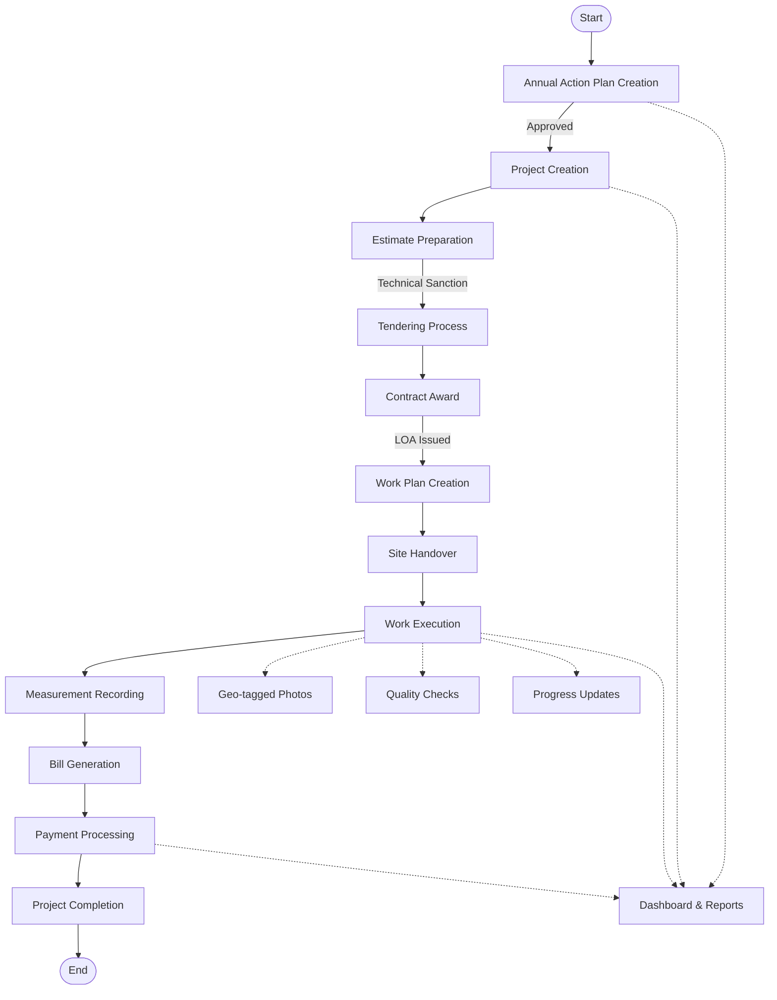
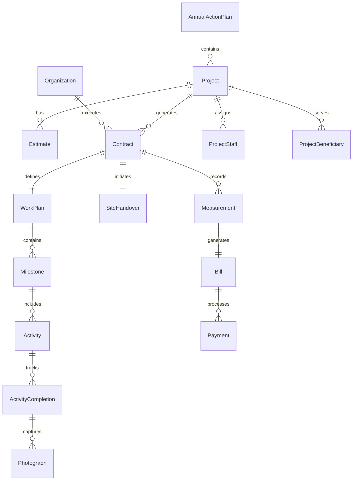
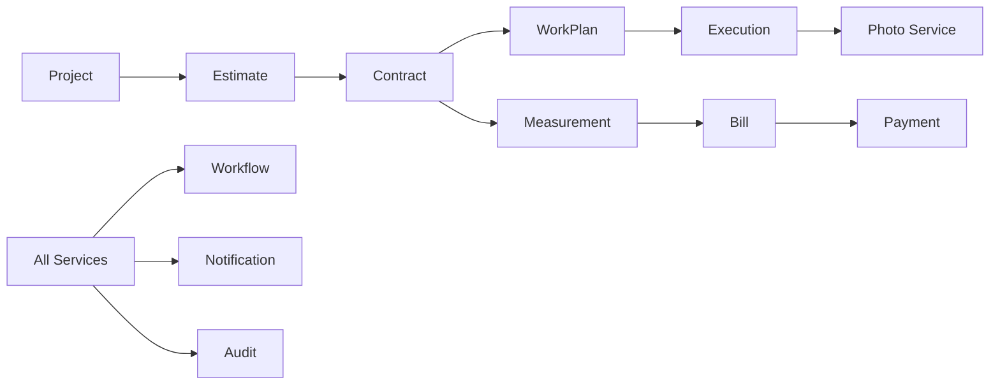

# DIGIT Works Platform v1.1 - Comprehensive Service Documentation

## Table of Contents
1. [Platform Overview](#platform-overview)
2. [Architecture](#architecture)
3. [Complete Workflow](#complete-workflow)
4. [Service Modules](#service-modules)
5. [Data Models](#data-models)
6. [API Specifications](#api-specifications)
7. [Integration Points](#integration-points)
8. [Security & Compliance](#security--compliance)

---

## Platform Overview

The DIGIT Works Platform v1.1 is a comprehensive e-governance solution for managing public works projects from inception to completion. It provides end-to-end digitalization of works management including planning, tendering, execution, monitoring, and payment processes.

### Key Features
- **Annual Action Planning** with budget allocation and tracking
- **Project Management** with hierarchical organization
- **Estimation and Rate Analysis** for accurate costing
- **Contract Management** with workflow automation
- **Work Execution Tracking** with geo-tagged evidence
- **Measurement and Payment Processing**
- **Real-time Dashboard and Analytics**

### Platform Components
```
┌─────────────────────────────────────────────────────────────────┐
│                     DIGIT Works Platform v1.1                   │
├─────────────────────────────────────────────────────────────────┤
│                                                                 │
│  ┌──────────────┐  ┌──────────────┐  ┌──────────────┐        │
│  │   Planning   │  │  Tendering   │  │  Execution   │        │
│  │   Module     │→ │   Module     │→ │   Module     │        │
│  └──────────────┘  └──────────────┘  └──────────────┘        │
│         ↓                  ↓                 ↓                 │
│  ┌──────────────┐  ┌──────────────┐  ┌──────────────┐        │
│  │  Foundation  │  │  Measurement │  │   Payment    │        │
│  │   Services   │  │   Module     │  │   Module     │        │
│  └──────────────┘  └──────────────┘  └──────────────┘        │
│                                                                 │
│  ┌────────────────────────────────────────────────────┐        │
│  │            Common Services & Infrastructure        │        │
│  └────────────────────────────────────────────────────┘        │
└─────────────────────────────────────────────────────────────────┘
```

---

## Architecture

### Microservices Architecture
The platform follows a microservices architecture pattern with the following services:

1. **Core Services**
   - Annual Action Plan Service
   - Project Service
   - Organization Service
   - SOR (Schedule of Rates) Service

2. **Works Services**
   - Estimate Service
   - Contract Service
   - Work Plan Service
   - Site Handover Service
   - Activity Completion Service

3. **Financial Services**
   - Measurement Service
   - Expense/Bill Service
   - Bank Account Service
   - Statement Service

4. **Support Services**
   - Document Management
   - Workflow Engine
   - Notification Service
   - Audit Service

### Technology Stack
- **Backend**: Spring Boot, Node.js
- **Database**: PostgreSQL
- **Cache**: Redis
- **Message Queue**: Kafka
- **API Gateway**: Zuul/Spring Cloud Gateway
- **Documentation**: OpenAPI 3.0

---

## Complete Workflow

### End-to-End Works Management Flow



### Detailed Process Flow

#### Phase 1: Planning & Approval
1. **Annual Action Plan Creation**
   - Define objectives and KPIs
   - Allocate department-wise budgets
   - Set financial year targets
   - Link strategic projects

2. **Project Initiation**
   - Create project hierarchy
   - Define project scope and deliverables
   - Assign project staff
   - Set timelines and milestones

3. **Estimation Process**
   - Prepare detailed estimates using SOR
   - Perform rate analysis for non-SOR items
   - Calculate overhead charges
   - Obtain technical sanction

#### Phase 2: Tendering & Contract Award
1. **Tender Preparation**
   - Prepare tender documents
   - Define eligibility criteria
   - Set evaluation parameters

2. **Contract Management**
   - Evaluate bids
   - Award contract
   - Issue Letter of Acceptance (LOA)
   - Execute agreement

#### Phase 3: Execution & Monitoring
1. **Work Planning**
   - Create detailed work plan
   - Define milestone-wise activities
   - Allocate resources
   - Set quality parameters

2. **Site Management**
   - Conduct site handover
   - Capture geo-location
   - Document site conditions
   - Verify utilities and access

3. **Execution Tracking**
   - Update activity completion
   - Upload geo-tagged photographs
   - Record quality checks
   - Track impediments

#### Phase 4: Measurement & Payment
1. **Measurement Recording**
   - Record work measurements
   - Verify against BOQ
   - Calculate quantities
   - Approve measurements

2. **Bill Processing**
   - Generate running bills
   - Apply deductions
   - Process payments
   - Update financial records

---

## Service Modules

### 1. Annual Action Plan Service

**Purpose**: Manage yearly planning cycles with budget allocation and project prioritization.

**Key Features**:
- Financial year-based planning
- Department-wise budget allocation
- Project linkage and prioritization
- Milestone and deliverable tracking
- KPI monitoring
- Workflow-based approvals

**API Endpoints**:
```
POST   /annual-action-plan/v1/_create
POST   /annual-action-plan/v1/_update
POST   /annual-action-plan/v1/_search
POST   /annual-action-plan/v1/_workflow
POST   /annual-action-plan/project/v1/_create
POST   /annual-action-plan/project/v1/_search
POST   /annual-action-plan/milestone/v1/_create
POST   /annual-action-plan/dashboard/v1/_get
```

### 2. Project Service

**Purpose**: Comprehensive project management with hierarchical organization and resource allocation.

**Key Features**:
- Project hierarchy management
- Beneficiary registration
- Task management
- Staff assignment
- Facility and resource linkage
- Target setting and monitoring

**API Endpoints**:
```
POST   /project/v1/_create
POST   /project/v1/_update
POST   /project/v1/_search
POST   /project/beneficiary/v1/_create
POST   /project/task/v1/_create
POST   /project/staff/v1/_create
POST   /project/facility/v1/_create
POST   /project/resource/v1/_create
```

### 3. Organization Service

**Purpose**: Manage organizational entities, contractors, and vendors.

**Key Features**:
- Organization registration
- Contact information management
- Tax identifier tracking
- Bank account linkage
- Function and jurisdiction mapping

**API Endpoints**:
```
POST   /org-services/organisation/v1/_create
POST   /org-services/organisation/v1/_update
POST   /org-services/organisation/v1/_search
```

### 4. Estimate Service

**Purpose**: Create and manage detailed project estimates with BOQ.

**Key Features**:
- Detailed and abstract estimates
- SOR-based estimation
- Non-SOR item management
- Overhead calculation
- Multi-level approval workflow

**API Endpoints**:
```
POST   /estimate/v1/_create
POST   /estimate/v1/_update
POST   /estimate/v1/_search
```

### 5. Contract Service

**Purpose**: End-to-end contract lifecycle management.

**Key Features**:
- Contract creation and modification
- Document management
- Milestone-based payment terms
- Amendment tracking
- Security deposit management

**API Endpoints**:
```
POST   /contract/v1/_create
POST   /contract/v1/_update
POST   /contract/v1/_search
POST   /contract/v1/_delete
```

### 6. Work Execution Service

**Purpose**: Track and monitor on-ground work execution.

**Key Features**:
- Work plan creation with milestones
- Site handover management
- Activity completion tracking
- Geo-tagged photo uploads
- Quality check recording
- Progress monitoring

**API Endpoints**:
```
POST   /work-plan/v1/_create
POST   /work-plan/v1/_update
POST   /site-handover/v1/_create
POST   /activity-completion/v1/_create
POST   /activity-completion/photo/v1/_upload
POST   /execution/dashboard/v1/_get
```

### 7. Measurement Service

**Purpose**: Record and verify work measurements for payment processing.

**Key Features**:
- Measurement book management
- BOQ-wise measurement recording
- Multi-level verification
- Consumption tracking
- Integration with billing

**API Endpoints**:
```
POST   /measurement/v1/_create
POST   /measurement/v1/_update
POST   /measurement/v1/_search
```

### 8. Expense/Bill Service

**Purpose**: Generate and process contractor bills and payments.

**Key Features**:
- Running account bill generation
- Final bill processing
- Deduction management
- Payment advice generation
- GST and tax calculations

**API Endpoints**:
```
POST   /expense/bill/v1/_create
POST   /expense/bill/v1/_update
POST   /expense/bill/v1/_search
POST   /expense/payment/v1/_create
```

---

## Data Models

### Core Entities

#### 1. Annual Action Plan
```json
{
  "id": "UUID",
  "planNumber": "AAP/2024-25/001",
  "name": "Annual Infrastructure Development Plan",
  "financialYear": "2024-25",
  "department": "PWD",
  "status": "APPROVED",
  "budget": {
    "totalBudget": 10000000,
    "allocatedBudget": 8500000,
    "utilizedBudget": 3200000,
    "availableBudget": 5300000
  },
  "objectives": [...],
  "kpis": [...],
  "projects": [...]
}
```

#### 2. Project
```json
{
  "id": "UUID",
  "projectNumber": "PR/2024-25/001",
  "name": "Road Infrastructure Development",
  "projectType": "CONSTRUCTION",
  "department": "PWD",
  "address": {...},
  "startDate": 1704067200000,
  "endDate": 1735689600000,
  "targets": [...],
  "isTaskEnabled": true,
  "parent": "parent-project-id"
}
```

#### 3. Contract
```json
{
  "id": "UUID",
  "contractNumber": "CTR/2024-25/001",
  "contractType": "WORK_ORDER",
  "projectId": "project-uuid",
  "status": "ACTIVE",
  "agreementDate": 1704067200000,
  "contractor": {
    "id": "contractor-uuid",
    "name": "ABC Constructions"
  },
  "contractValue": 5000000,
  "securityDeposit": 250000,
  "defectLiabilityPeriod": 365
}
```

#### 4. Work Plan
```json
{
  "id": "UUID",
  "workPlanNumber": "WP/2024-25/001",
  "contractId": "contract-uuid",
  "name": "Q1 Work Plan",
  "startDate": 1704067200000,
  "endDate": 1711929600000,
  "milestones": [
    {
      "id": "milestone-uuid",
      "name": "Foundation Completion",
      "targetDate": 1706659200000,
      "percentageCompletion": 45,
      "activities": [...]
    }
  ],
  "overallProgress": 35
}
```

#### 5. Site Handover
```json
{
  "id": "UUID",
  "handoverNumber": "SH/2024-25/001",
  "contractId": "contract-uuid",
  "handoverDate": 1704067200000,
  "geoLocation": {
    "latitude": 28.6139,
    "longitude": 77.2090,
    "accuracy": 10
  },
  "siteDetails": {...},
  "photographs": [...],
  "status": "COMPLETED"
}
```

#### 6. Activity Completion
```json
{
  "id": "UUID",
  "completionNumber": "AC/2024-25/001",
  "workPlanId": "workplan-uuid",
  "milestoneId": "milestone-uuid",
  "completionDate": 1704067200000,
  "percentageCompleted": 100,
  "geoLocation": {...},
  "photographs": [
    {
      "id": "photo-uuid",
      "category": "AFTER",
      "geoLocation": {...},
      "timestamp": 1704067200000
    }
  ],
  "qualityChecks": [...]
}
```

#### 7. Measurement
```json
{
  "id": "UUID",
  "measurementNumber": "MB/2024-25/001",
  "contractId": "contract-uuid",
  "measurementDate": 1704067200000,
  "measurements": [
    {
      "targetId": "boq-item-id",
      "cumulativeValue": 500,
      "currentValue": 100,
      "unit": "SQM"
    }
  ],
  "status": "APPROVED"
}
```

#### 8. Bill/Expense
```json
{
  "id": "UUID",
  "billNumber": "BILL/2024-25/001",
  "contractId": "contract-uuid",
  "billType": "RUNNING_BILL",
  "billDate": 1704067200000,
  "billAmount": 1500000,
  "deductions": {
    "gst": 270000,
    "tds": 30000,
    "retention": 75000
  },
  "netAmount": 1125000,
  "status": "APPROVED"
}
```

### Entity Relationships



---

## API Specifications

### Common Request Structure

All APIs follow a standard request/response pattern:

#### Request Format
```json
{
  "RequestInfo": {
    "apiId": "org.egov.works",
    "ver": "1.0",
    "ts": 1704067200000,
    "action": "create",
    "did": "device-id",
    "key": "msg-key",
    "msgId": "unique-message-id",
    "requesterId": "requester-id",
    "authToken": "auth-token",
    "userInfo": {
      "id": "user-id",
      "userName": "username",
      "roles": ["EMPLOYEE"]
    }
  },
  "EntityName": {
    // Entity specific payload
  }
}
```

#### Response Format
```json
{
  "ResponseInfo": {
    "apiId": "org.egov.works",
    "ver": "1.0",
    "ts": 1704067200000,
    "resMsgId": "response-message-id",
    "msgId": "unique-message-id",
    "status": "successful"
  },
  "EntityName": {
    // Entity specific response
  }
}
```

### Common Query Parameters

| Parameter | Type | Required | Description |
|-----------|------|----------|-------------|
| tenantId | string | Yes | Tenant identifier |
| limit | integer | Yes | Pagination limit (max 1000) |
| offset | integer | Yes | Pagination offset |
| includeDeleted | boolean | No | Include soft-deleted records |
| lastChangedSince | integer | No | Epoch timestamp for delta sync |

### Authentication & Authorization

All APIs require:
1. Valid auth token in RequestInfo
2. Appropriate role-based permissions
3. Tenant-specific access control

### Error Handling

Standard error response:
```json
{
  "ResponseInfo": {...},
  "Errors": [
    {
      "code": "INVALID_INPUT",
      "message": "Invalid contract ID provided",
      "description": "Contract with ID xxx not found",
      "params": ["contractId"]
    }
  ]
}
```

---

## Integration Points

### 1. External System Integration

#### IFMS (Integrated Financial Management System)
- Payment order generation
- Fund availability check
- Budget utilization updates
- Vendor payment status

#### GIS Integration
- Geo-tagging and location services
- Map-based project visualization
- Spatial analysis and reporting

#### Document Management System
- File upload and storage
- Version control
- Access control
- Digital signatures

### 2. Internal Service Communication



### 3. Notification Triggers

| Event | Recipients | Channel |
|-------|------------|---------|
| Plan Approved | Department Head, Project Manager | SMS, Email |
| Contract Awarded | Contractor, Project Team | SMS, Email, In-app |
| Site Handover | Contractor, Engineer | SMS, In-app |
| Milestone Completed | Project Manager, Finance | Email, In-app |
| Bill Generated | Contractor, Accounts | Email, In-app |
| Payment Processed | Contractor | SMS, Email |

### 4. Workflow Integration

Each major entity follows a configured workflow:

```yaml
AnnualActionPlan:
  states: [DRAFT, IN_REVIEW, PENDING_APPROVAL, APPROVED, REJECTED]
  actions: [SUBMIT, REVIEW, APPROVE, REJECT, SEND_BACK]
  
Contract:
  states: [DRAFT, PENDING_APPROVAL, APPROVED, ACTIVE, SUSPENDED, TERMINATED]
  actions: [SUBMIT, APPROVE, REJECT, ACTIVATE, SUSPEND, TERMINATE]

Bill:
  states: [DRAFT, SUBMITTED, VERIFIED, APPROVED, PAID, REJECTED]
  actions: [SUBMIT, VERIFY, APPROVE, REJECT, PAY]
```

---

## Security & Compliance

### Security Features

1. **Authentication**
   - OAuth 2.0 based authentication
   - Multi-factor authentication support
   - Session management

2. **Authorization**
   - Role-based access control (RBAC)
   - Attribute-based access control (ABAC)
   - Tenant isolation

3. **Data Security**
   - Encryption at rest and in transit
   - PII data masking
   - Audit trail for all transactions

4. **API Security**
   - Rate limiting
   - API key management
   - Request/Response validation

### Compliance Standards

1. **Government Standards**
   - e-Governance standards compliance
   - GFR (General Financial Rules) compliance
   - CVC (Central Vigilance Commission) guidelines

2. **Technical Standards**
   - ISO 27001 compliance
   - OWASP security guidelines
   - REST API best practices

3. **Audit Requirements**
   - Complete audit trail
   - Tamper-proof logs
   - Regular audit reports

### Data Privacy

1. **Personal Data Protection**
   - Consent management
   - Data minimization
   - Purpose limitation

2. **Data Retention**
   - Configurable retention policies
   - Automated data archival
   - Secure data disposal

---

## Monitoring & Analytics

### System Monitoring

1. **Performance Metrics**
   - API response times
   - Database query performance
   - Service availability

2. **Business Metrics**
   - Project completion rates
   - Payment processing time
   - Workflow efficiency

### Dashboard Components

```
┌────────────────────────────────────────────────────┐
│              Executive Dashboard                    │
├────────────────────────────────────────────────────┤
│                                                    │
│  ┌──────────────┐  ┌──────────────┐              │
│  │Total Projects│  │Active Works  │              │
│  │     156     │  │      89      │              │
│  └──────────────┘  └──────────────┘              │
│                                                    │
│  ┌────────────────────────────────┐               │
│  │     Budget Utilization          │               │
│  │     ████████░░░░░ 65%          │               │
│  └────────────────────────────────┘               │
│                                                    │
│  ┌────────────────────────────────┐               │
│  │    Milestone Progress           │               │
│  │    [Chart showing progress]     │               │
│  └────────────────────────────────┘               │
│                                                    │
│  ┌────────────────────────────────┐               │
│  │    Payment Status               │               │
│  │    Pending: ₹45L                │               │
│  │    Processed: ₹120L             │               │
│  └────────────────────────────────┘               │
└────────────────────────────────────────────────────┘
```

### Reports

1. **Operational Reports**
   - Daily progress report
   - Pending approvals
   - Payment due report

2. **Management Reports**
   - Project status report
   - Budget utilization
   - Contractor performance

3. **Compliance Reports**
   - Audit trail report
   - User activity report
   - System access logs

---

## Deployment Architecture

### Production Environment

```
┌─────────────────────────────────────────────────────┐
│                   Load Balancer                     │
└─────────────────────────────────────────────────────┘
                          │
        ┌─────────────────┼─────────────────┐
        │                 │                 │
┌───────▼──────┐  ┌───────▼──────┐  ┌──────▼───────┐
│   API Gateway│  │   API Gateway│  │  API Gateway │
└──────────────┘  └──────────────┘  └──────────────┘
        │                 │                 │
┌───────▼──────────────────────────────────▼────────┐
│              Kubernetes Cluster                    │
│                                                    │
│  ┌─────────┐ ┌─────────┐ ┌─────────┐             │
│  │Service 1│ │Service 2│ │Service 3│             │
│  └─────────┘ └─────────┘ └─────────┘             │
│                                                    │
└────────────────────────────────────────────────────┘
        │                 │                 │
┌───────▼──────┐  ┌───────▼──────┐  ┌──────▼───────┐
│  PostgreSQL  │  │     Redis    │  │    Kafka     │
│   (Primary)  │  │    (Cache)   │  │  (Messages)  │
└──────────────┘  └──────────────┘  └──────────────┘
```

### Scalability Considerations

1. **Horizontal Scaling**
   - Microservices can scale independently
   - Auto-scaling based on load
   - Load balancing across instances

2. **Database Optimization**
   - Read replicas for queries
   - Connection pooling
   - Query optimization

3. **Caching Strategy**
   - Redis for session management
   - API response caching
   - Database query caching

---

## Support & Maintenance

### Version Control
- Semantic versioning (MAJOR.MINOR.PATCH)
- Backward compatibility for 2 major versions
- Deprecation notices 6 months in advance

### Documentation
- API documentation (OpenAPI/Swagger)
- Developer guides
- User manuals
- Video tutorials

### Support Channels
- Technical support email
- Community forum
- Issue tracker (GitHub/JIRA)
- Knowledge base

---

## Appendix

### A. Glossary

| Term | Definition |
|------|------------|
| AAP | Annual Action Plan |
| BOQ | Bill of Quantities |
| DPR | Detailed Project Report |
| GFR | General Financial Rules |
| LOA | Letter of Acceptance |
| MB | Measurement Book |
| NIT | Notice Inviting Tender |
| RA | Running Account |
| SOR | Schedule of Rates |
| TS | Technical Sanction |

### B. Status Codes

| Code | Description |
|------|------------|
| 200 | Success |
| 201 | Created |
| 202 | Accepted |
| 400 | Bad Request |
| 401 | Unauthorized |
| 403 | Forbidden |
| 404 | Not Found |
| 500 | Internal Server Error |

### C. Role Definitions

| Role | Permissions |
|------|------------|
| SYSTEM_ADMIN | Full system access |
| DEPT_ADMIN | Department-level admin |
| PROJECT_MANAGER | Project creation and management |
| ENGINEER | Technical operations |
| CONTRACTOR | Contract execution |
| ACCOUNTS_OFFICER | Financial operations |
| VIEWER | Read-only access |

---

## Version History

| Version | Date | Changes |
|---------|------|---------|
| 1.1.0 | 2024-12-31 | Added Annual Action Plan, Work Execution modules |
| 1.0.0 | 2024-01-01 | Initial release with core modules |

---

*End of Document*

**Document Version**: 1.1.0  
**Last Updated**: December 31, 2024  
**Maintained By**: DIGIT Works Team  
**Contact**: works-support@egov.org.in