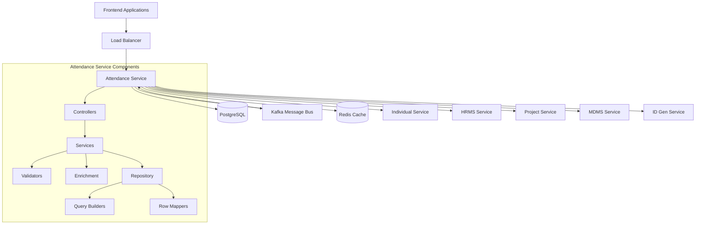
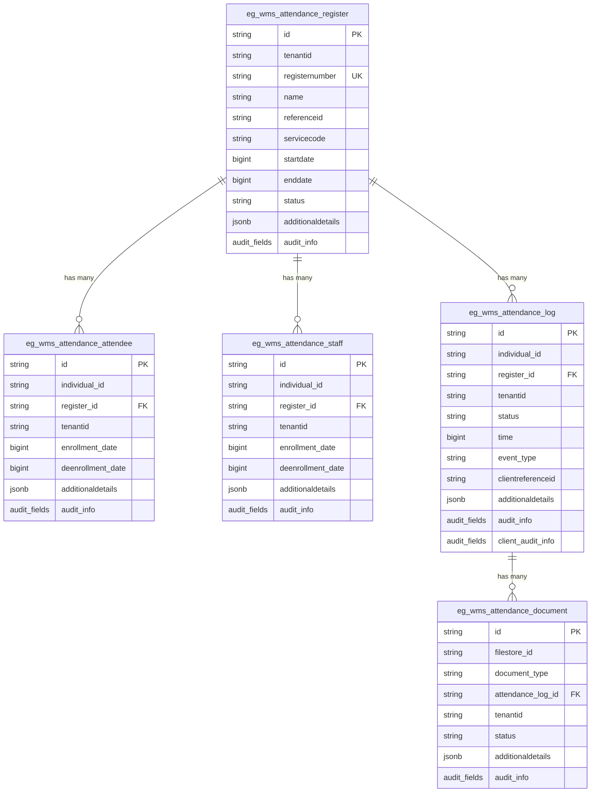
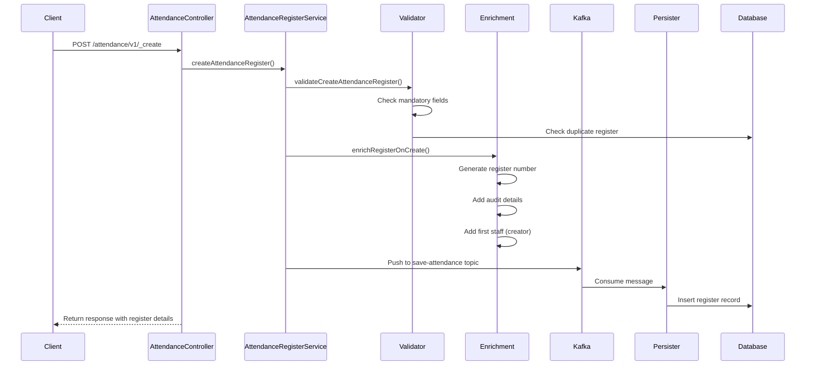
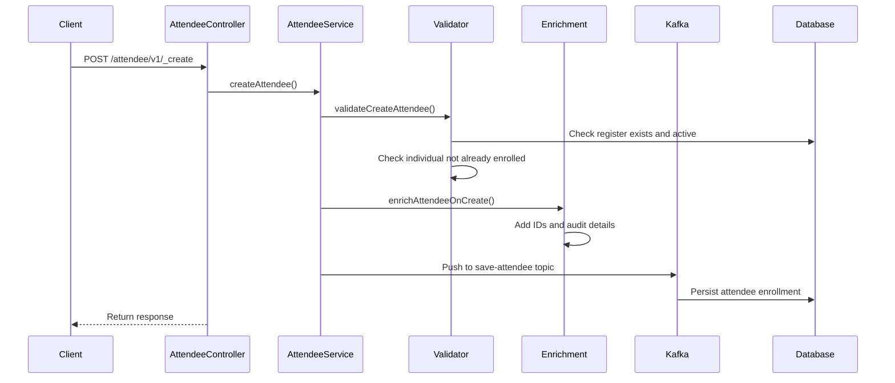
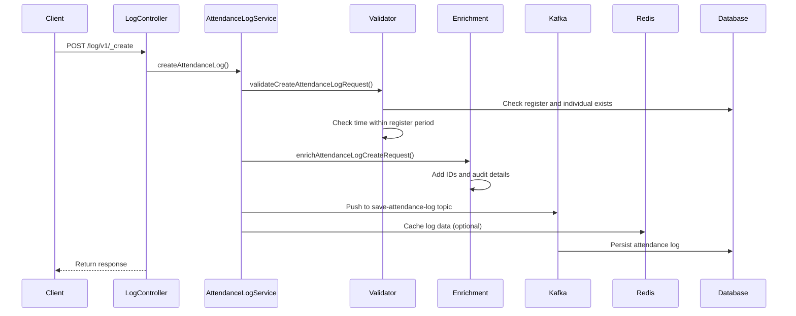
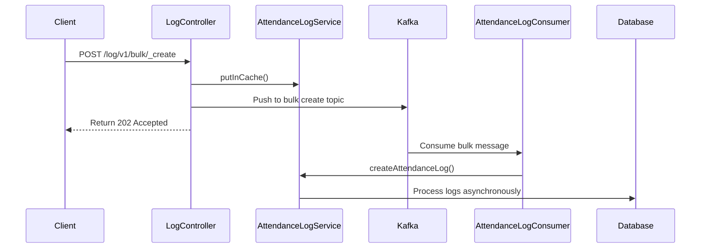
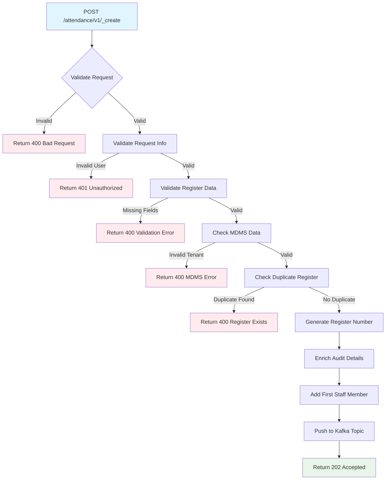
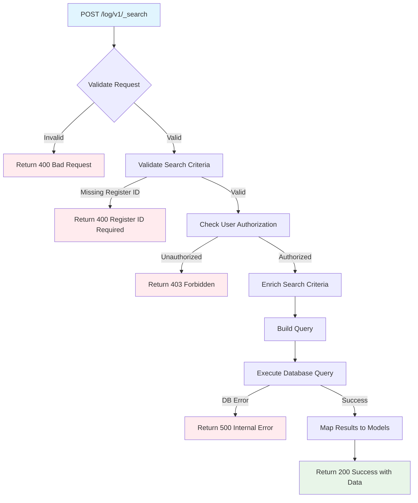
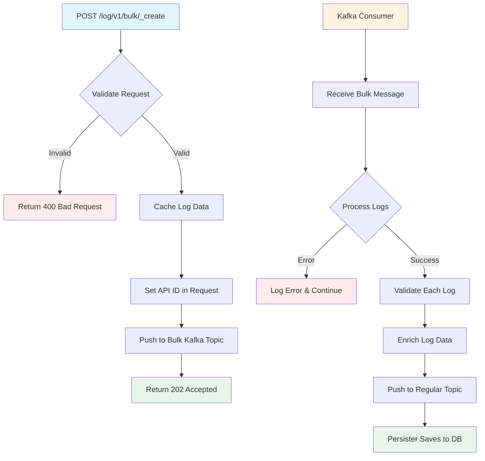
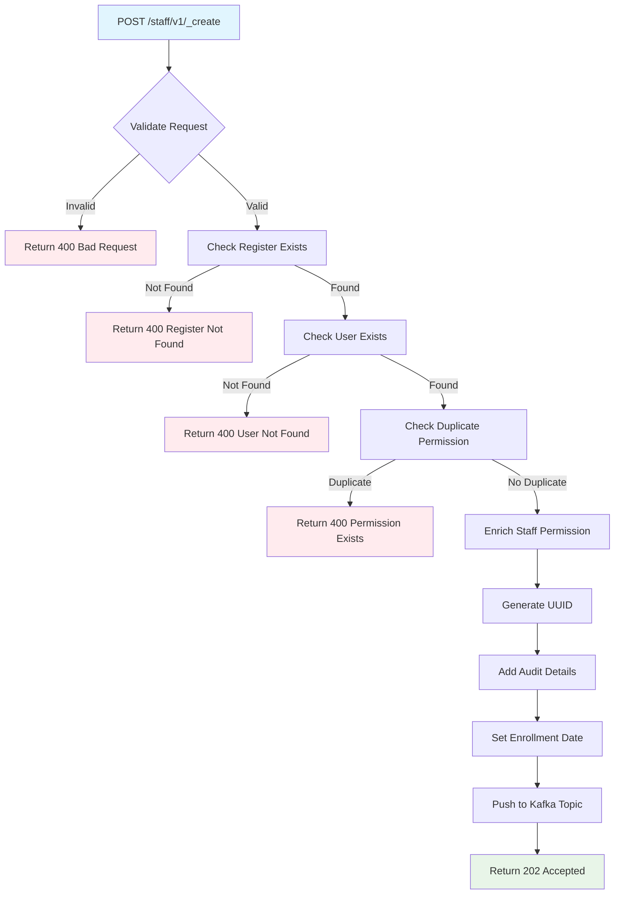

# Attendance Service Technical Documentation

## Table of Contents
1. [System & Architecture Overview](#system--architecture-overview)
2. [API Documentation](#api-documentation)
3. [Domain Models & Data Structures](#domain-models--data-structures)
4. [Database Design](#database-design)
5. [Configuration & Application Properties](#configuration--application-properties)
6. [Service Dependencies](#service-dependencies)
7. [Events & Messaging](#events--messaging)
8. [Execution & Business Flows](#execution--business-flows)
9. [Security Considerations](#security-considerations)
10. [API Flow Diagrams](#api-flow-diagrams)

## System & Architecture Overview

The Attendance Service is a Spring Boot 3.2.2 microservice built on Java 17 that manages attendance tracking for the DIGIT Works platform. It provides comprehensive attendance management including register creation, individual enrollment/de-enrollment, staff permissions, and attendance logging.

### High-level Architecture



### Component Responsibilities

- **Controllers**: REST API endpoints for attendance register, attendees, staff, and attendance logs
- **Services**: Business logic for attendance operations, validation, and enrichment
- **Validators**: Request validation, business rule validation, and MDMS validation
- **Enrichment**: Data enrichment for creates/updates including ID generation and audit details
- **Repository**: Data access layer with query builders and row mappers
- **Kafka Consumers**: Event-driven processing for bulk operations and external system integrations

### Interaction Between Services

- **Individual Service**: User registration and search integration
- **HRMS Service**: Employee data integration for staff management
- **Project Service**: Project and project staff integration
- **MDMS Service**: Master data validation for tenants and attendance configuration
- **ID Gen Service**: Auto-generation of attendance register numbers

## API Documentation

### REST APIs Overview

| Method | Endpoint | Description | Authentication |
|--------|----------|-------------|----------------|
| POST | `/attendance/v1/_create` | Create attendance register | Required |
| POST | `/attendance/v1/_update` | Update attendance register | Required |
| POST | `/attendance/v1/_search` | Search attendance registers | Required |
| POST | `/attendance/staff/v1/_create` | Grant staff permission | Required |
| POST | `/attendance/staff/v1/_delete` | Revoke staff permission | Required |
| POST | `/attendance/attendee/v1/_create` | Enroll attendees | Required |
| POST | `/attendance/attendee/v1/_delete` | De-enroll attendees | Required |
| POST | `/attendance/log/v1/_create` | Create attendance log | Required |
| POST | `/attendance/log/v1/_update` | Update attendance log | Required |
| POST | `/attendance/log/v1/_search` | Search attendance logs | Required |
| POST | `/attendance/log/v1/bulk/_create` | Bulk create attendance logs | Required |
| POST | `/attendance/log/v1/bulk/_update` | Bulk update attendance logs | Required |

### Authentication & Authorization

- **JWT Token**: Required in RequestInfo for all endpoints
- **Role-based Access**: User roles determine access to register operations
- **Open Search Roles**: Configurable roles for unrestricted attendance register search
  - Default roles: `SUPERUSER`, `EMPLOYEE`

### Error Handling Patterns

- **CustomException**: Standardized error response with error codes and messages
- **Validation Errors**: Field-level validation errors with detailed messages
- **HTTP Status Codes**: 
  - 200: Success
  - 202: Accepted (async operations)
  - 400: Bad Request
  - 500: Internal Server Error

### Example Request/Response

#### Create Attendance Register Request
```json
{
  "RequestInfo": {
    "apiId": "attendance-service",
    "ver": "1.0",
    "ts": 1665497225000,
    "action": "create",
    "authToken": "auth_token_here",
    "userInfo": {
      "id": 1,
      "uuid": "user-uuid"
    }
  },
  "attendanceRegister": [
    {
      "tenantId": "pb.amritsar",
      "name": "Project ABC Attendance",
      "referenceId": "project-123",
      "serviceCode": "WORKS-CONTRACT",
      "startDate": 1665497225000,
      "endDate": 1668089225000,
      "status": "ACTIVE"
    }
  ]
}
```

#### Create Attendance Register Response
```json
{
  "responseInfo": {
    "apiId": "attendance-service",
    "ver": "1.0",
    "ts": 1665497225000,
    "status": "successful"
  },
  "attendanceRegister": [
    {
      "id": "64e33343-7b4c-4353-9abf-4de8f5bcd732",
      "tenantId": "pb.amritsar",
      "registerNumber": "REG/2022-23/001",
      "name": "Project ABC Attendance",
      "referenceId": "project-123",
      "serviceCode": "WORKS-CONTRACT",
      "startDate": 1665497225000,
      "endDate": 1668089225000,
      "status": "ACTIVE",
      "auditDetails": {
        "createdBy": "user-uuid",
        "createdTime": 1665497225000,
        "lastModifiedBy": "user-uuid",
        "lastModifiedTime": 1665497225000
      }
    }
  ]
}
```

## Domain Models & Data Structures

### Core Domain Models

#### AttendanceRegister
```java
public class AttendanceRegister {
    private String id;                    // System generated UUID
    private String tenantId;             // Tenant identifier
    private String registerNumber;       // Auto-generated register number
    private String name;                 // Human-readable register name
    private String referenceId;          // Reference to contract/project
    private String serviceCode;          // Service type (WORKS-CONTRACT)
    private BigDecimal startDate;        // Start date timestamp
    private BigDecimal endDate;          // End date timestamp  
    private Status status;               // ACTIVE/INACTIVE
    private List<StaffPermission> staff; // Associated staff
    private List<IndividualEntry> attendees; // Enrolled attendees
    private AuditDetails auditDetails;
    private Object additionalDetails;
}
```

#### AttendanceLog
```java
public class AttendanceLog {
    private String id;                    // System generated UUID
    private String clientReferenceId;    // Client side reference
    private String registerId;           // Reference to attendance register
    private String individualId;         // Individual UUID
    private String tenantId;            // Tenant identifier
    private BigDecimal time;            // Event timestamp
    private String type;                // ENTRY/EXIT (configurable in MDMS)
    private Status status;              // ACTIVE/INACTIVE
    private List<Document> documentIds; // Supporting documents
    private AuditDetails auditDetails;
    private AuditDetails clientAuditDetails;
    private Object additionalDetails;
}
```

#### StaffPermission
```java
public class StaffPermission {
    private String id;                   // System generated UUID
    private String tenantId;            // Tenant identifier
    private String registerId;          // Attendance register reference
    private String userId;              // User/Individual ID
    private BigDecimal enrollmentDate;  // Permission grant date
    private BigDecimal denrollmentDate; // Permission revoke date
    private AuditDetails auditDetails;
    private Object additionalDetails;
}
```

#### IndividualEntry
```java
public class IndividualEntry {
    private String id;                   // System generated UUID
    private String tenantId;            // Tenant identifier  
    private String registerId;          // Attendance register reference
    private String individualId;        // Individual UUID
    private BigDecimal enrollmentDate;  // Enrollment timestamp
    private BigDecimal denrollmentDate; // De-enrollment timestamp
    private AuditDetails auditDetails;
    private Object additionalDetails;
}
```

### Entity Relationships

- **AttendanceRegister** 1:N **StaffPermission** (One register has multiple staff)
- **AttendanceRegister** 1:N **IndividualEntry** (One register has multiple attendees)  
- **AttendanceRegister** 1:N **AttendanceLog** (One register has multiple logs)
- **IndividualEntry** 1:N **AttendanceLog** (One attendee has multiple logs)

### Validation Rules

- **AttendanceRegister**: 
  - tenantId, name, referenceId, serviceCode are mandatory
  - referenceId + serviceCode + tenantId must be unique for ACTIVE registers
  - startDate must be before endDate
  - name max length: 256 characters

- **AttendanceLog**:
  - registerId, individualId, tenantId, time, type are mandatory
  - Individual must be enrolled in the register
  - time must be within register's start/end date range

- **StaffPermission**:
  - registerId, userId, tenantId are mandatory
  - User cannot have duplicate active permissions for same register

### Enum Definitions

#### Status
```java
public enum Status {
    ACTIVE("ACTIVE"),
    INACTIVE("INACTIVE");
}
```

## Database Design

### Tables/Collections

#### eg_wms_attendance_register
```sql
CREATE TABLE eg_wms_attendance_register(
    id                    character varying(256) PRIMARY KEY,
    tenantid             character varying(64) NOT NULL,
    registernumber       character varying(256) UNIQUE NOT NULL,
    name                 character varying(256),
    referenceid          character varying(256),
    servicecode          character varying(64),
    startdate            bigint NOT NULL,
    enddate              bigint,
    status               character varying(64) NOT NULL,
    additionaldetails    JSONB,
    createdby            character varying(256) NOT NULL,
    lastmodifiedby       character varying(256),
    createdtime          bigint,
    lastmodifiedtime     bigint
);
```

#### eg_wms_attendance_attendee
```sql
CREATE TABLE eg_wms_attendance_attendee(
    id                    character varying(256) PRIMARY KEY,
    individual_id         character varying(256) NOT NULL,
    register_id           character varying(256) NOT NULL,
    tenantid             character varying(64),
    enrollment_date       bigint NOT NULL,
    deenrollment_date     bigint,
    additionaldetails     JSONB,
    createdby            character varying(256) NOT NULL,
    lastmodifiedby       character varying(256),
    createdtime          bigint,
    lastmodifiedtime     bigint,
    FOREIGN KEY (register_id) REFERENCES eg_wms_attendance_register (id)
);
```

#### eg_wms_attendance_staff
```sql
CREATE TABLE eg_wms_attendance_staff(
    id                    character varying(256) PRIMARY KEY,
    individual_id         character varying(256) NOT NULL,
    register_id           character varying(256) NOT NULL,
    tenantid             character varying(64),
    enrollment_date       bigint NOT NULL,
    deenrollment_date     bigint,
    additionaldetails     JSONB,
    createdby            character varying(256) NOT NULL,
    lastmodifiedby       character varying(256),
    createdtime          bigint,
    lastmodifiedtime     bigint,
    FOREIGN KEY (register_id) REFERENCES eg_wms_attendance_register (id)
);
```

#### eg_wms_attendance_log
```sql
CREATE TABLE eg_wms_attendance_log(
    id                        character varying(256) PRIMARY KEY,
    individual_id             character varying(256) NOT NULL,
    register_id               character varying(256) NOT NULL,
    tenantid                 character varying(64),
    status                   character varying(64),
    time                     bigint NOT NULL,
    event_type               character varying(64),
    clientreferenceid        character varying(256),
    clientcreatedby          character varying(256),
    clientlastmodifiedby     character varying(256),
    clientcreatedtime        bigint,
    clientlastmodifiedtime   bigint,
    additionaldetails        JSONB,
    createdby                character varying(256) NOT NULL,
    lastmodifiedby           character varying(256),
    createdtime              bigint,
    lastmodifiedtime         bigint,
    FOREIGN KEY (register_id) REFERENCES eg_wms_attendance_register (id)
);
```

#### eg_wms_attendance_document
```sql
CREATE TABLE eg_wms_attendance_document(
    id                    character varying(256) PRIMARY KEY,
    filestore_id          character varying(256) NOT NULL,
    document_type         character varying(256),
    attendance_log_id     character varying(256) NOT NULL,
    tenantid             character varying(64),
    status               character varying(64),
    additionaldetails     JSONB,
    createdby            character varying(256) NOT NULL,
    lastmodifiedby       character varying(256),
    createdtime          bigint,
    lastmodifiedtime     bigint,
    FOREIGN KEY (attendance_log_id) REFERENCES eg_wms_attendance_log (id)
);
```

### Database Indexes

Performance optimized indexes for efficient querying:

```sql
-- Attendance Register Indexes
CREATE INDEX index_eg_wms_attendance_register_tenantId ON eg_wms_attendance_register (tenantId);
CREATE INDEX index_eg_wms_attendance_register_registernumber ON eg_wms_attendance_register (registernumber);
CREATE INDEX index_eg_wms_attendance_register_reference_id ON eg_wms_attendance_register (referenceid);
CREATE INDEX index_eg_wms_attendance_register_service_code ON eg_wms_attendance_register (servicecode);

-- Attendance Log Indexes  
CREATE INDEX index_eg_wms_attendance_log_tenantId ON eg_wms_attendance_log (tenantId);
CREATE INDEX index_eg_wms_attendance_log_register_id ON eg_wms_attendance_log (register_id);
CREATE INDEX index_eg_wms_attendance_log_individual_id ON eg_wms_attendance_log (individual_id);
CREATE INDEX index_eg_wms_attendance_log_time ON eg_wms_attendance_log (time);
```

### ER Diagram



## Configuration & Application Properties

### Environment-Specific Configurations

#### Database Configuration
```properties
spring.datasource.driver-class-name=org.postgresql.Driver
spring.datasource.url=jdbc:postgresql://localhost:5432/digit-works
spring.datasource.username=postgres
spring.datasource.password=1234
```

#### Flyway Migration Configuration
```properties
spring.flyway.enabled=true
spring.flyway.table=attendance_service_schema
spring.flyway.baseline-on-migrate=true
```

#### Kafka Configuration
```properties
kafka.config.bootstrap_server_config=localhost:9092
spring.kafka.consumer.group-id=egov-attendance-service
spring.kafka.consumer.value-deserializer=org.egov.tracer.kafka.deserializer.HashMapDeserializer
spring.kafka.producer.value-serializer=org.springframework.kafka.support.serializer.JsonSerializer
```

#### Redis Configuration
```properties
spring.redis.host=radis.backbone
spring.redis.port=6379
spring.cache.type=redis
spring.cache.redis.time-to-live=60
```

### Kafka Topics Configuration

```properties
# Attendance Register Topics
attendance.register.kafka.create.topic=save-attendance
attendance.register.kafka.update.topic=update-attendance

# Attendance Log Topics  
attendance.log.kafka.create.topic=save-attendance-log
attendance.log.kafka.update.topic=update-attendance-log
attendance.log.kafka.consumer.bulk.create.topic=save-attendance-log-bulk-health
attendance.log.kafka.consumer.bulk.update.topic=update-attendance-log-bulk-health

# Staff Topics
attendance.staff.kafka.create.topic=save-staff
attendance.staff.kafka.update.topic=update-staff

# Attendee Topics
attendance.attendee.kafka.create.topic=save-attendee
attendance.attendee.kafka.update.topic=update-attendee
```

### Service Integration Configuration

```properties
# Individual Service
works.individual.host=https://unified-dev.digit.org
works.individual.search.endpoint=individual/v1/_search

# HRMS Service  
egov.hrms.host=https://unified-dev.digit.org
egov.hrms.search.endpoint=/health-hrms/employees/_search

# Project Service
egov.project.host=http://unified-dev.digit.org
egov.project.staff.search.endpoint=/health-project/staff/v1/_search
egov.project.search.endpoint=/health-project/v1/_search

# MDMS Service
egov.mdms.host=https://unified-dev.digit.org
egov.mdms.search.endpoint=/egov-mdms-service/v1/_search

# ID Gen Service
egov.idgen.host=https://unified-dev.digit.org
egov.idgen.path=/egov-idgen/id/_generate
egov.idgen.attendance.register.number.name=attendance.register.number
```

### Feature Flags

```properties
# Service Integration Toggles
attendance.individual.service.integration.required=false
attendance.staff.service.integration.required=false
attendance.document.id.verification.required=false
attendance.register.first.staff.insert.enabled=true
```

## Service Dependencies

### External Services

| Service | Purpose | Integration Pattern |
|---------|---------|-------------------|
| **Individual Service** | User registration and search | REST API calls |
| **HRMS Service** | Employee data integration | REST API calls |  
| **Project Service** | Project and staff data | REST API + Kafka events |
| **MDMS Service** | Master data validation | REST API calls |
| **ID Gen Service** | Register number generation | REST API calls |

### Libraries and Frameworks

| Dependency | Version | Purpose |
|------------|---------|---------|
| **Spring Boot** | 3.2.2 | Core framework |
| **Spring Web** | - | REST API support |
| **Spring JDBC** | - | Database connectivity |
| **Spring Kafka** | - | Event messaging |
| **PostgreSQL Driver** | 42.7.1 | Database driver |
| **Lombok** | 1.18.22 | Code generation |
| **Jackson** | - | JSON serialization |
| **Flyway** | 9.22.3 | Database migration |
| **DIGIT Tracer** | 2.9.0-SNAPSHOT | Logging and monitoring |
| **DIGIT MDMS Client** | 2.9.0-SNAPSHOT | Master data integration |
| **Works Common** | 1.0.0-SNAPSHOT | Shared utilities |

### Internal Service-to-Service Calls

- **Individual Service**: Search individuals by user ID, validate individual existence
- **HRMS Service**: Retrieve employee details for staff management  
- **Project Service**: Fetch project details, validate project staff assignments
- **MDMS Service**: Validate tenant data, retrieve attendance configurations

## Events & Messaging

### Events Emitted

#### Attendance Register Events
```json
{
  "topic": "save-attendance",
  "eventType": "AttendanceRegisterCreate",
  "payload": {
    "RequestInfo": {...},
    "attendanceRegister": [...]
  }
}
```

#### Attendance Log Events  
```json
{
  "topic": "save-attendance-log",
  "eventType": "AttendanceLogCreate", 
  "payload": {
    "RequestInfo": {...},
    "attendance": [...]
  }
}
```

### Events Consumed

#### Organisation Contact Update
```json
{
  "topic": "organisation.contact.details.update",
  "eventType": "OrgContactUpdate",
  "payload": {
    "orgContactUpdateDiff": {
      "organisationId": "org-123",
      "contactDetails": {...}
    }
  }
}
```

#### Contract Revision
```json
{
  "topic": "contracts-revision", 
  "eventType": "ContractEndDateUpdate",
  "payload": {
    "RequestInfo": {...},
    "tenantId": "pb.amritsar",
    "referenceId": "contract-123", 
    "endDate": 1668089225000
  }
}
```

### Producer Services
- **Attendance Service** → **Persister Service** (All CRUD operations)
- **Attendance Service** → **Indexer Service** (Search index updates)

### Consumer Services  
- **Project Service** → **Attendance Service** (Staff updates)
- **Organisation Service** → **Attendance Service** (Contact updates)
- **Contract Service** → **Attendance Service** (End date extensions)

### Kafka Topics Used

| Topic Name | Purpose | Producer | Consumer |
|------------|---------|----------|----------|
| `save-attendance` | Register creation | Attendance Service | Persister |
| `update-attendance` | Register updates | Attendance Service | Persister |
| `save-attendance-log` | Log creation | Attendance Service | Persister |
| `save-attendance-log-bulk-health` | Bulk log creation | Attendance Service | Attendance Service |
| `organisation.contact.details.update` | Org contact updates | Organisation Service | Attendance Service |
| `contracts-revision` | Contract end date updates | Contract Service | Attendance Service |

## Execution & Business Flows

### Key Business Flows

#### 1. Attendance Register Creation Flow



#### 2. Attendee Enrollment Flow



#### 3. Attendance Log Creation Flow



#### 4. Bulk Attendance Log Processing



### Happy Path Scenarios

1. **Register Creation**: User creates register → System validates → Generates number → Persists → Returns success
2. **Staff Permission**: Admin grants staff permission → Validates register exists → Persists permission → Success
3. **Attendee Enrollment**: Staff enrolls individual → Validates not duplicate → Persists enrollment → Success  
4. **Attendance Logging**: Staff logs attendance → Validates individual enrolled → Persists log → Success

### Failure Scenarios

1. **Validation Failures**: Invalid data → Return 400 with error details
2. **Duplicate Register**: Register exists for reference → Return REGISTER_ALREADY_EXISTS error
3. **Individual Not Found**: Individual doesn't exist → Return INDIVIDUAL_NOT_FOUND error
4. **Time Range Violation**: Log time outside register period → Return TIME_OUTSIDE_RANGE error
5. **Database Failures**: DB connection issues → Return 500 with error details

## Security Considerations

### Authentication Flow
- **JWT Token Validation**: All requests must include valid JWT token in RequestInfo
- **User Context**: User information extracted from JWT for audit trail and authorization
- **Token Expiry**: Tokens have configured expiry time, service validates token freshness

### Authorization Checks
- **Role-Based Access**: User roles determine allowed operations
  - **SUPERUSER**: Full access to all operations
  - **EMPLOYEE**: Standard employee access
  - **Custom Roles**: Configurable role-based restrictions

- **Resource-Level Security**: 
  - Staff can only access registers they have permission for
  - Register search filtered based on user permissions
  - Attendance logs restricted to authorized registers

### Sensitive Data Handling
- **Personal Information**: Individual IDs reference external service, no PII stored locally
- **Audit Trail**: Complete audit trail for all operations with user information
- **Data Encryption**: Database connections use SSL/TLS encryption
- **Log Sanitization**: Sensitive data excluded from application logs

### Security Headers
- **CORS Configuration**: Configured for specific frontend domains
- **Content-Type Validation**: Strict content-type checking for API requests
- **Request Size Limits**: Maximum request size limits to prevent DoS attacks

## API Flow Diagrams

### Attendance Register Create API Flow



### Attendance Log Search API Flow



### Bulk Attendance Log Create API Flow



### Staff Permission Grant API Flow



---

*This documentation reflects the actual implementation of the Attendance Service as analyzed from the DIGIT Works codebase. For the latest updates, refer to the service's CHANGELOG.md and API specifications.*