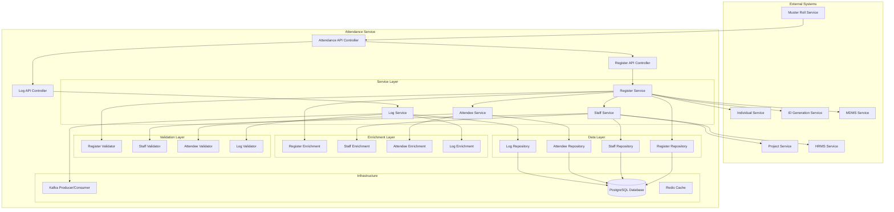
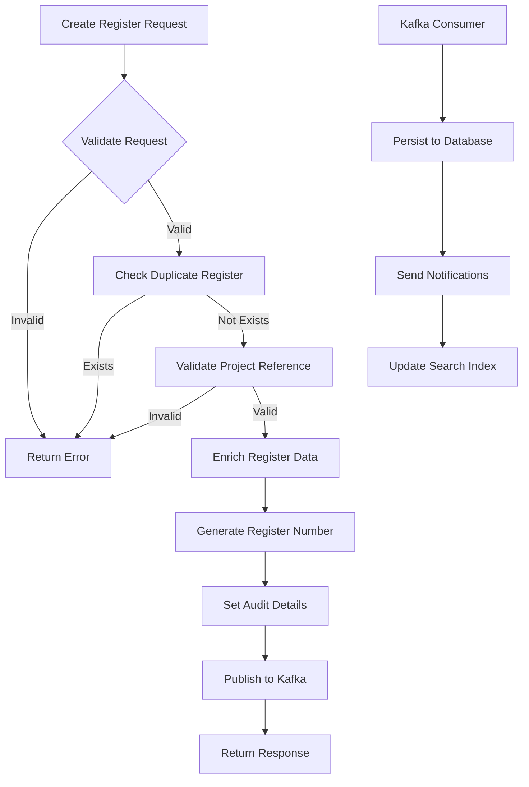
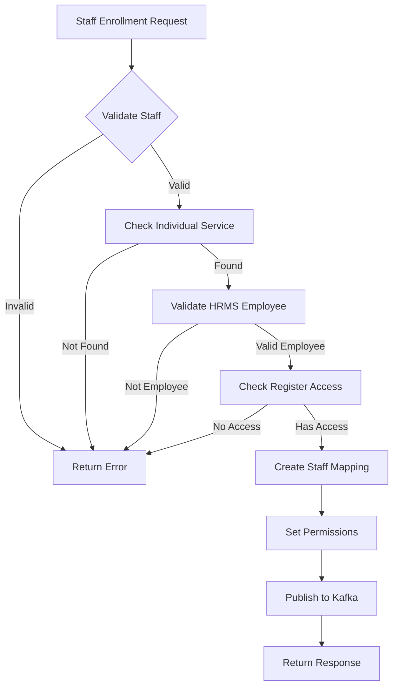
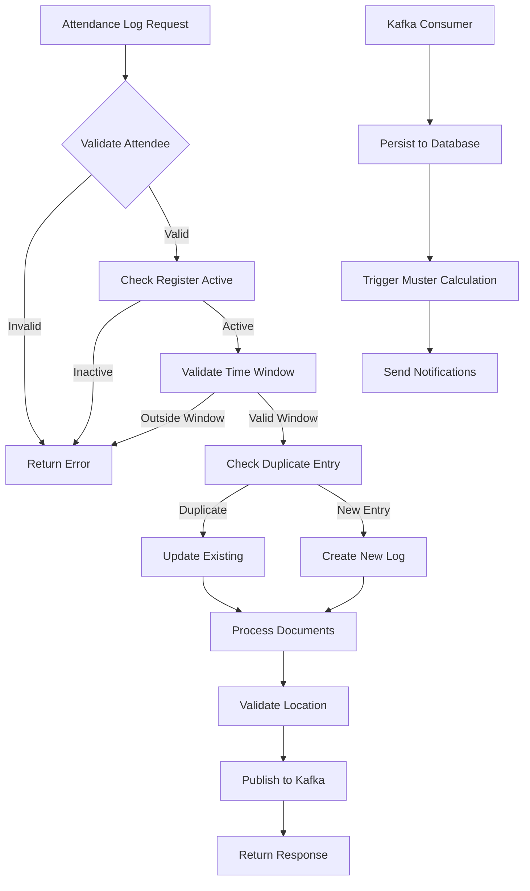
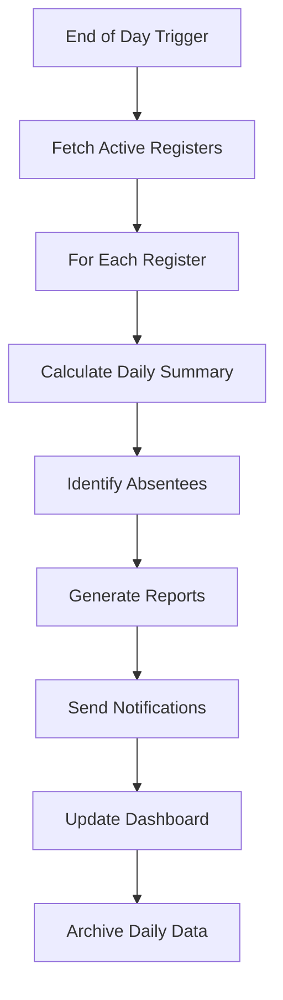

# Attendance Service - Technical Documentation

## Table of Contents
1. [System & Architecture Overview](#system--architecture-overview)
2. [API Documentation](#api-documentation)
3. [Domain Models & Data Structures](#domain-models--data-structures)
4. [Database Design](#database-design)
5. [Configuration & Application Properties](#configuration--application-properties)
6. [Service Dependencies](#service-dependencies)
7. [External Dependencies](#external-dependencies)
8. [Events & Messaging](#events--messaging)
9. [Execution & Business Flows](#execution--business-flows)
10. [Security Considerations](#security-considerations)

---

## System & Architecture Overview

### Service Purpose
The Attendance Service provides generic attendance logging functionality based on "in" and "out" timestamps. It captures real-time attendance data per individual and serves as the foundational service for attendance tracking in the DIGIT-Works ecosystem. This service works in conjunction with the Muster Roll service for attendance aggregation and wage calculations.

### Key Features
- **Attendance Register Management**: Create and manage attendance registers for different projects/locations
- **Staff & Attendee Management**: Track staff permissions and attendee enrollments
- **Real-time Logging**: Record entry/exit timestamps with geolocation support
- **Document Management**: Attach supporting documents for attendance verification
- **Multi-tenant Support**: Tenant-based data isolation and access control
- **Integration Ready**: Seamless integration with Individual, Project, and HRMS services

### System Architecture



---

## API Documentation

### Base Configuration
- **Context Path**: `/attendance`
- **Port**: 8023
- **API Version**: v1

### Endpoints

#### 1. Create Attendance Register
**POST** `/attendance/v1/_create`

Creates a new attendance register for a project or location.

**Request Body:**
```json
{
  "RequestInfo": {
    "apiId": "attendance-service",
    "ver": "1.0",
    "ts": 1675234567890,
    "action": "_create",
    "did": "",
    "key": "",
    "msgId": "20230201-123456",
    "authToken": "auth-token",
    "userInfo": {
      "id": 12345,
      "userName": "supervisor1",
      "roles": [{"code": "FIELD_SUPERVISOR", "name": "Field Supervisor"}]
    }
  },
  "attendanceRegister": {
    "tenantId": "pb.amritsar",
    "registerNumber": "ATT-REG-2024-001",
    "name": "Road Construction Project Register",
    "referenceId": "PROJECT-123",
    "serviceCode": "WORKS-ATTENDANCE",
    "startDate": 1675209600000,
    "endDate": 1677628799000,
    "status": "ACTIVE",
    "additionalDetails": {
      "projectName": "NH-1 Road Construction",
      "location": "Sector 15, Amritsar",
      "supervisorName": "Rajesh Kumar"
    }
  }
}
```

#### 2. Update Attendance Register
**POST** `/attendance/v1/_update`

Updates an existing attendance register.

#### 3. Search Attendance Registers
**POST** `/attendance/v1/_search`

Searches attendance registers based on various criteria.

**Query Parameters:**
- `tenantId` (required): Tenant identifier
- `ids`: List of register UUIDs
- `registerNumber`: Custom formatted register ID
- `name`: Name of the register
- `referenceId`: Project or reference ID
- `serviceCode`: Service code
- `fromDate`: Start date filter
- `toDate`: End date filter
- `status`: Register status
- `limit`: Number of records (default: 10, max: 1000)
- `offset`: Page offset (default: 0)

#### 4. Create Staff Mapping
**POST** `/attendance/staff/v1/_create`

Maps staff members to an attendance register with specific permissions.

**Request Body:**
```json
{
  "RequestInfo": {...},
  "staff": [{
    "tenantId": "pb.amritsar",
    "registerId": "register-uuid-123",
    "individualId": "individual-uuid-456",
    "enrollmentDate": 1675209600000,
    "deEnrollmentDate": 1677628799000,
    "additionalDetails": {
      "designation": "Site Engineer",
      "permissions": ["VIEW_ATTENDANCE", "MARK_ATTENDANCE"]
    }
  }]
}
```

#### 5. Create Attendee Mapping
**POST** `/attendance/attendee/v1/_create`

Maps attendees (wage seekers) to an attendance register.

#### 6. Create Attendance Log
**POST** `/attendance/log/v1/_create`

Records attendance entry/exit with timestamp.

**Request Body:**
```json
{
  "RequestInfo": {...},
  "attendanceLog": [{
    "tenantId": "pb.amritsar",
    "registerId": "register-uuid-123",
    "individualId": "individual-uuid-789",
    "status": "PRESENT",
    "time": 1675234567890,
    "eventType": "ENTRY",
    "documentIds": ["doc-uuid-001"],
    "additionalDetails": {
      "latitude": 31.6340,
      "longitude": 74.8723,
      "photo": "photo-uuid-123",
      "remarks": "On-time entry"
    }
  }]
}
```

#### 7. Search Attendance Logs
**POST** `/attendance/log/v1/_search`

Searches attendance logs with various filters.

**Query Parameters:**
- `tenantId` (required): Tenant identifier
- `registerId`: Register UUID
- `individualId`: Individual UUID
- `fromDate`: From date filter
- `toDate`: To date filter
- `status`: Attendance status (PRESENT/ABSENT)
- `eventType`: Event type (ENTRY/EXIT)
- `limit`: Number of records
- `offset`: Page offset

---

## Domain Models & Data Structures

### Core Models

#### AttendanceRegister Model
```java
public class AttendanceRegister {
    private String id;                      // UUID
    private String tenantId;                // Tenant identifier
    private String registerNumber;          // Custom register number
    private String name;                    // Register name
    private String referenceId;             // Project/entity reference
    private String serviceCode;             // Service code
    private Long startDate;                 // Start date (epoch)
    private Long endDate;                   // End date (epoch)
    private String status;                  // ACTIVE/INACTIVE
    private List<Staff> staff;              // Staff mappings
    private List<Attendee> attendees;       // Attendee mappings
    private AuditDetails auditDetails;      // Audit information
    private Object additionalDetails;       // Additional data
}
```

#### Staff Model
```java
public class Staff {
    private String id;                      // UUID
    private String tenantId;                // Tenant identifier
    private String registerId;              // Register reference
    private String individualId;            // Individual service reference
    private Long enrollmentDate;            // Enrollment date
    private Long deEnrollmentDate;          // De-enrollment date
    private List<StaffPermission> permissions; // Staff permissions
    private AuditDetails auditDetails;      // Audit information
    private Object additionalDetails;       // Additional data
}
```

#### Attendee Model
```java
public class Attendee {
    private String id;                      // UUID
    private String tenantId;                // Tenant identifier
    private String registerId;              // Register reference
    private String individualId;            // Individual service reference
    private Long enrollmentDate;            // Enrollment date
    private Long deEnrollmentDate;          // De-enrollment date
    private String skillCode;               // Skill/trade code
    private AuditDetails auditDetails;      // Audit information
    private Object additionalDetails;       // Additional data
}
```

#### AttendanceLog Model
```java
public class AttendanceLog {
    private String id;                      // UUID
    private String tenantId;                // Tenant identifier
    private String registerId;              // Register reference
    private String individualId;            // Individual reference
    private String status;                  // PRESENT/ABSENT/PARTIAL
    private Long time;                      // Timestamp (epoch)
    private String eventType;               // ENTRY/EXIT
    private List<Document> documents;       // Supporting documents
    private AuditDetails auditDetails;      // Audit information
    private Object additionalDetails;       // Additional data (GPS, photos)
}
```

#### StaffPermission Model
```java
public class StaffPermission {
    private String id;                      // UUID
    private String permissionType;          // Permission type
    private String staffId;                 // Staff reference
    private String registerId;              // Register reference
    private AuditDetails auditDetails;      // Audit information
    private Object additionalDetails;       // Additional data
}
```

---

## Database Design

### Database Schema

#### eg_wms_attendance_register Table
```sql
CREATE TABLE eg_wms_attendance_register(
    id                      character varying(256) PRIMARY KEY,
    tenantid               character varying(64) NOT NULL,
    registernumber         character varying(128) NOT NULL,
    name                   character varying(128),
    referenceId            character varying(256),
    serviceCode            character varying(128),
    startdate              bigint NOT NULL,
    enddate                bigint NOT NULL,
    status                 character varying(64) NOT NULL,
    additionaldetails      JSONB,
    createdby              character varying(256) NOT NULL,
    lastmodifiedby         character varying(256),
    createdtime            bigint,
    lastmodifiedtime       bigint,
    CONSTRAINT uk_eg_wms_attendance_register UNIQUE (registernumber)
);

CREATE INDEX idx_attendance_register_tenant ON eg_wms_attendance_register(tenantid);
CREATE INDEX idx_attendance_register_reference ON eg_wms_attendance_register(referenceId);
CREATE INDEX idx_attendance_register_service ON eg_wms_attendance_register(serviceCode);
CREATE INDEX idx_attendance_register_dates ON eg_wms_attendance_register(startdate, enddate);
```

#### eg_wms_attendance_staff Table
```sql
CREATE TABLE eg_wms_attendance_staff(
    id                      character varying(256) PRIMARY KEY,
    individual_id           character varying(64) NOT NULL,
    register_id             character varying(64) NOT NULL,
    enrollment_date         bigint NOT NULL,
    deenrollment_date       bigint NOT NULL,
    additionaldetails       JSONB,
    createdby               character varying(256) NOT NULL,
    lastmodifiedby          character varying(256),
    createdtime             bigint,
    lastmodifiedtime        bigint,
    CONSTRAINT fk_eg_wms_attendance_staff FOREIGN KEY (register_id) REFERENCES eg_wms_attendance_register (id)
);

CREATE INDEX idx_staff_register ON eg_wms_attendance_staff(register_id);
CREATE INDEX idx_staff_individual ON eg_wms_attendance_staff(individual_id);
```

#### eg_wms_staff_permissions Table
```sql
CREATE TABLE eg_wms_staff_permissions(
    id                      character varying(256) PRIMARY KEY,
    permission_type         character varying(64) NOT NULL,
    staff_id                character varying(64) NOT NULL,
    register_id             character varying(64) NOT NULL,
    additionaldetails       JSONB,
    createdby               character varying(256) NOT NULL,
    lastmodifiedby          character varying(256),
    createdtime             bigint,
    lastmodifiedtime        bigint,
    CONSTRAINT fk_eg_wms_register_staff_permissions FOREIGN KEY (register_id) REFERENCES eg_wms_attendance_register (id),
    CONSTRAINT fk_eg_wms_staff_permissions FOREIGN KEY (staff_id) REFERENCES eg_wms_attendance_staff (id)
);
```

#### eg_wms_attendance_attendee Table
```sql
CREATE TABLE eg_wms_attendance_attendee(
    id                      character varying(256) PRIMARY KEY,
    individual_id           character varying(64) NOT NULL,
    register_id             character varying(64) NOT NULL,
    enrollment_date         bigint NOT NULL,
    deenrollment_date       bigint NOT NULL,
    skill_code              character varying(64),
    additionaldetails       JSONB,
    createdby               character varying(256) NOT NULL,
    lastmodifiedby          character varying(256),
    createdtime             bigint,
    lastmodifiedtime        bigint,
    CONSTRAINT fk_eg_wms_attendance_attendee FOREIGN KEY (register_id) REFERENCES eg_wms_attendance_register (id)
);

CREATE INDEX idx_attendee_register ON eg_wms_attendance_attendee(register_id);
CREATE INDEX idx_attendee_individual ON eg_wms_attendance_attendee(individual_id);
CREATE INDEX idx_attendee_skill ON eg_wms_attendance_attendee(skill_code);
```

#### eg_wms_attendance_log Table
```sql
CREATE TABLE eg_wms_attendance_log(
    id                      character varying(256) PRIMARY KEY,
    individual_id           character varying(64) NOT NULL,
    register_id             character varying(64) NOT NULL,
    status                  character varying(64),
    time                    bigint NOT NULL,
    event_type              character varying(64),
    additionaldetails       JSONB,
    createdby               character varying(256) NOT NULL,
    lastmodifiedby          character varying(256),
    createdtime             bigint,
    lastmodifiedtime        bigint,
    CONSTRAINT fk_eg_wms_attendance_log FOREIGN KEY (register_id) REFERENCES eg_wms_attendance_register (id)
);

CREATE INDEX idx_log_register ON eg_wms_attendance_log(register_id);
CREATE INDEX idx_log_individual ON eg_wms_attendance_log(individual_id);
CREATE INDEX idx_log_time ON eg_wms_attendance_log(time);
CREATE INDEX idx_log_status ON eg_wms_attendance_log(status);
```

#### eg_wms_attendance_document Table
```sql
CREATE TABLE eg_wms_attendance_document(
    id                      character varying(256) PRIMARY KEY,
    filestore_id            character varying(64) NOT NULL,
    document_type           character varying(64),
    attendance_log_id       character varying(64) NOT NULL,
    additionaldetails       JSONB,
    createdby               character varying(256) NOT NULL,
    lastmodifiedby          character varying(256),
    createdtime             bigint,
    lastmodifiedtime        bigint,
    CONSTRAINT fk_eg_wms_attendance_document FOREIGN KEY (attendance_log_id) REFERENCES eg_wms_attendance_log (id)
);

CREATE INDEX idx_document_log ON eg_wms_attendance_document(attendance_log_id);
CREATE INDEX idx_document_type ON eg_wms_attendance_document(document_type);
```

---

## Configuration & Application Properties

### Server Configuration
```properties
server.contextPath=/attendance
server.servlet.contextPath=/attendance
server.port=8023
app.timezone=UTC

# Database Configuration
spring.datasource.driver-class-name=org.postgresql.Driver
spring.datasource.url=jdbc:postgresql://localhost:5432/digit-works
spring.datasource.username=postgres
spring.datasource.password=postgres

# Flyway Configuration
spring.flyway.enabled=true
spring.flyway.table=attendance_service_schema
spring.flyway.baseline-on-migrate=true

# Kafka Configuration
kafka.config.bootstrap_server_config=localhost:9092
spring.kafka.consumer.group-id=egov-attendance-service
spring.kafka.producer.key-serializer=org.apache.kafka.common.serialization.StringSerializer
spring.kafka.producer.value-serializer=org.springframework.kafka.support.serializer.JsonSerializer

# Kafka Topics
attendance.register.kafka.create.topic=save-attendance
attendance.register.kafka.update.topic=update-attendance
attendance.log.kafka.create.topic=save-attendance-log
attendance.log.kafka.update.topic=update-attendance-log
attendance.staff.kafka.create.topic=save-staff
attendance.staff.kafka.update.topic=update-staff
attendance.attendee.kafka.create.topic=save-attendee
attendance.attendee.kafka.update.topic=update-attendee

# Search Configuration
attendance.register.default.offset=0
attendance.register.default.limit=10
attendance.register.search.max.limit=1000

# Service Integration
attendance.individual.service.integration.required=false
attendance.staff.service.integration.required=false
attendance.document.id.verification.required=false
```

---

## Service Dependencies

### Internal DIGIT Services

1. **Individual Service** (`works.individual.host`)
   - **Purpose**: Individual registry for staff and attendees
   - **APIs Used**: `/individual/v1/_search`
   - **Usage**: Validate individual IDs, fetch individual details

2. **HRMS Service** (`egov.hrms.host`)
   - **Purpose**: Employee management and validation
   - **APIs Used**: `/health-hrms/employees/_search`
   - **Usage**: Validate staff members, fetch employee details

3. **Project Service** (`egov.project.host`)
   - **Purpose**: Project management and staff allocation
   - **APIs Used**: `/health-project/staff/v1/_search`, `/health-project/v1/_search`
   - **Usage**: Validate project references, fetch project staff

4. **ID Generation Service** (`egov.idgen.host`)
   - **Purpose**: Generate unique register numbers
   - **APIs Used**: `/egov-idgen/id/_generate`
   - **Usage**: Auto-generate attendance register numbers

5. **MDMS Service** (`egov.mdms.host`)
   - **Purpose**: Master data validation
   - **APIs Used**: `/egov-mdms-service/v1/_search`
   - **Usage**: Validate tenant data, skill codes, attendance types

---

## External Dependencies

### Infrastructure Dependencies

1. **PostgreSQL Database**
   - **Version**: 12+
   - **Purpose**: Primary data storage
   - **Connection Pool**: HikariCP
   - **Configuration**:
     ```properties
     spring.datasource.hikari.maximum-pool-size=10
     spring.datasource.hikari.minimum-idle=5
     spring.datasource.hikari.idle-timeout=600000
     spring.datasource.hikari.max-lifetime=1800000
     ```

2. **Apache Kafka**
   - **Version**: 2.8+
   - **Purpose**: Event streaming and async processing
   - **Topics Required**:
     - save-attendance
     - update-attendance
     - save-attendance-log
     - update-attendance-log
     - save-staff
     - update-staff
     - save-attendee
     - update-attendee
   - **Configuration**:
     ```properties
     spring.kafka.consumer.auto-offset-reset=earliest
     spring.kafka.consumer.properties.session.timeout.ms=30000
     spring.kafka.producer.properties.max.request.size=5242880
     ```

3. **Redis Cache**
   - **Version**: 6.0+
   - **Purpose**: Performance optimization and caching
   - **Configuration**:
     ```properties
     spring.redis.host=localhost
     spring.redis.port=6379
     spring.cache.type=redis
     spring.cache.redis.time-to-live=60
     spring.cache.autoexpiry=true
     ```

### External Service Dependencies

1. **GPS/Location Services**
   - **Purpose**: Geolocation validation for attendance
   - **Usage**: Validate attendance location, calculate distance from work site
   - **Integration**: Embedded in mobile applications

2. **File Store Service**
   - **Purpose**: Store attendance photos and documents
   - **APIs**: `/filestore/v1/files/upload`
   - **Storage**: S3/Azure Blob/Local filesystem

3. **SMS Gateway** (via Notification Service)
   - **Purpose**: Send attendance notifications
   - **Integration**: Through Kafka events
   - **Events**: Daily attendance summary, absence alerts

---

## Events & Messaging

### Kafka Topics

#### Produced Events

| Topic | Purpose | Event Schema |
|-------|---------|--------------|
| `save-attendance` | Create register | AttendanceRegisterRequest |
| `update-attendance` | Update register | AttendanceRegisterRequest |
| `save-attendance-log` | Create log entry | AttendanceLogRequest |
| `update-attendance-log` | Update log entry | AttendanceLogRequest |
| `save-staff` | Create staff mapping | StaffRequest |
| `update-staff` | Update staff mapping | StaffRequest |
| `save-attendee` | Create attendee mapping | AttendeeRequest |
| `update-attendee` | Update attendee mapping | AttendeeRequest |

#### Consumed Events

| Topic | Purpose | Handler |
|-------|---------|---------|
| `project-staff-attendance-health-topic` | Project staff updates | ProjectStaffConsumer |
| `organisation.contact.details.update` | Org contact updates | OrganisationContactDetailsStaffUpdateService |
| `contracts-revision` | Contract revisions | ContractRevisionConsumer |

### Event Schema

```json
{
  "RequestInfo": {
    "apiId": "attendance-service",
    "ver": "1.0",
    "ts": 1675234567890,
    "action": "create",
    "userInfo": {...}
  },
  "attendanceRegister": {
    "id": "register-uuid",
    "tenantId": "pb.amritsar",
    "registerNumber": "ATT-REG-2024-001",
    "referenceId": "PROJECT-123",
    "startDate": 1675209600000,
    "endDate": 1677628799000,
    "status": "ACTIVE",
    "auditDetails": {...}
  }
}
```

---

## Execution & Business Flows

### 1. Attendance Register Creation Flow



### 2. Staff Enrollment Flow



### 3. Attendance Logging Flow



### 4. Daily Attendance Summary Flow



---

## Security Considerations

### Authentication & Authorization
1. **JWT Token Validation**: All APIs require valid JWT tokens
2. **Role-Based Access Control**:
   - FIELD_SUPERVISOR: Full register management and attendance logging
   - SITE_ENGINEER: View attendance and limited logging
   - WAGE_SEEKER: Mark own attendance only
   - ADMIN: Full system access

### Data Security
1. **PII Protection**:
   - Individual IDs encrypted in logs
   - Location data anonymized in reports
   - Photo access restricted by permissions

2. **Input Validation**:
   - Timestamp validation for logical sequences
   - GPS coordinate validation
   - File type restrictions for documents

3. **SQL Injection Prevention**:
   - Parameterized queries
   - Input sanitization
   - No dynamic SQL construction

### Operational Security
1. **Attendance Fraud Prevention**:
   - GPS location validation
   - Photo verification requirements
   - Time window restrictions
   - Duplicate entry detection

2. **Data Integrity**:
   - Immutable attendance logs
   - Audit trail for all modifications
   - Transaction consistency

3. **Privacy Compliance**:
   - Data retention policies
   - Consent management for location tracking
   - Right to data portability

### Performance & Monitoring
1. **Rate Limiting**: API rate limits to prevent abuse
2. **Monitoring**: Real-time monitoring of attendance patterns
3. **Alerting**: Automated alerts for unusual attendance patterns
4. **Backup**: Regular database backups and disaster recovery