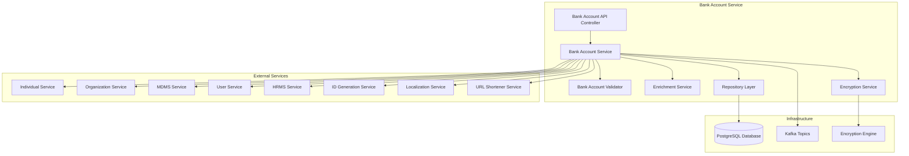
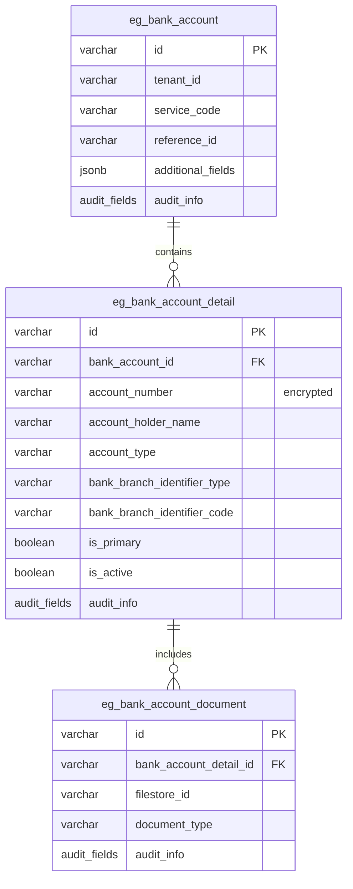
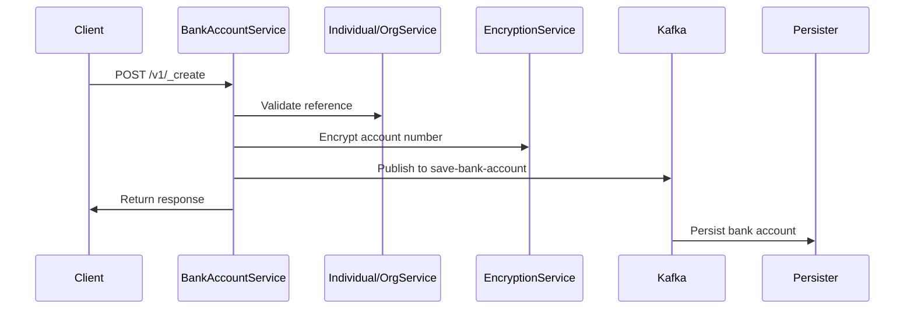
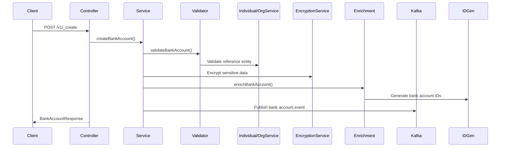
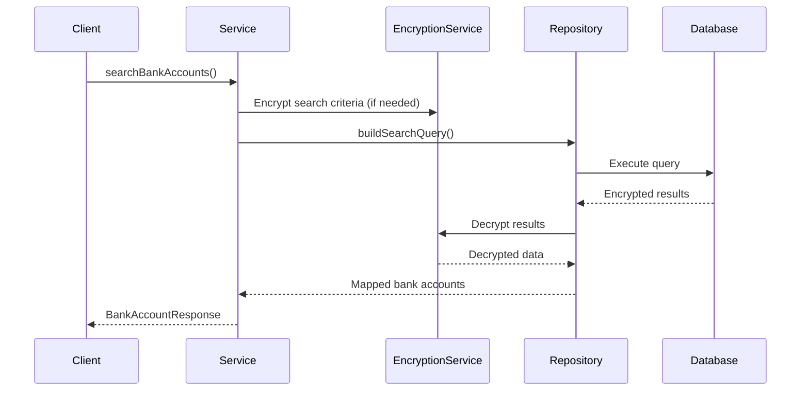
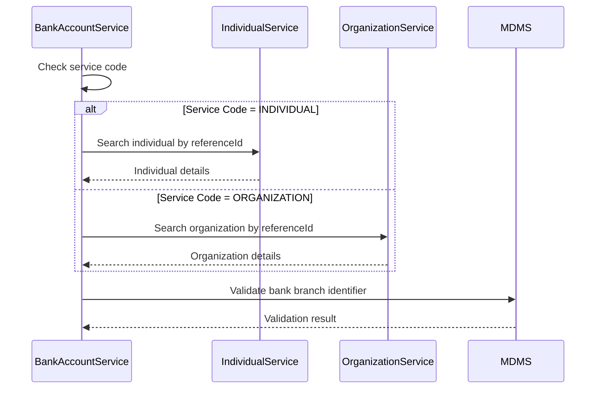
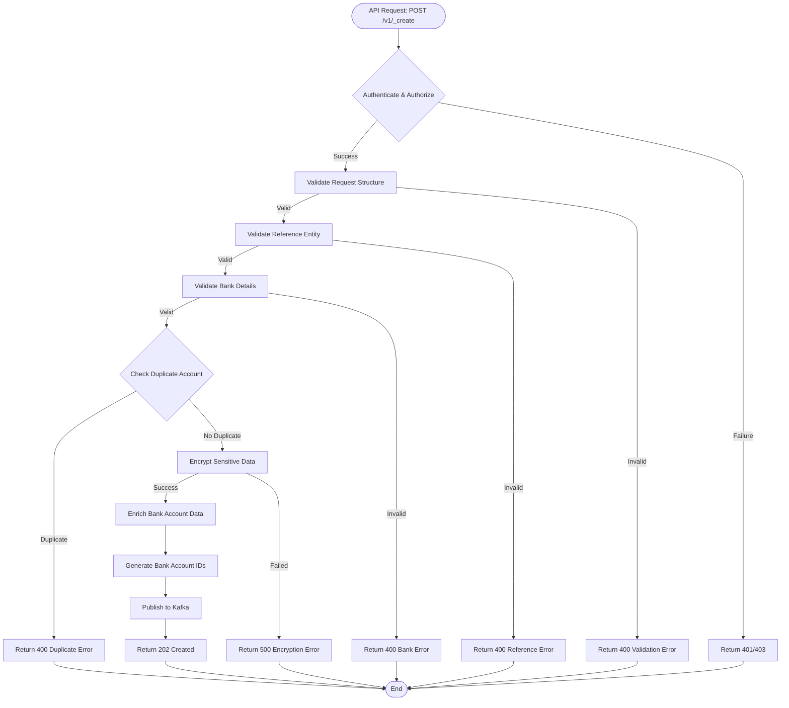
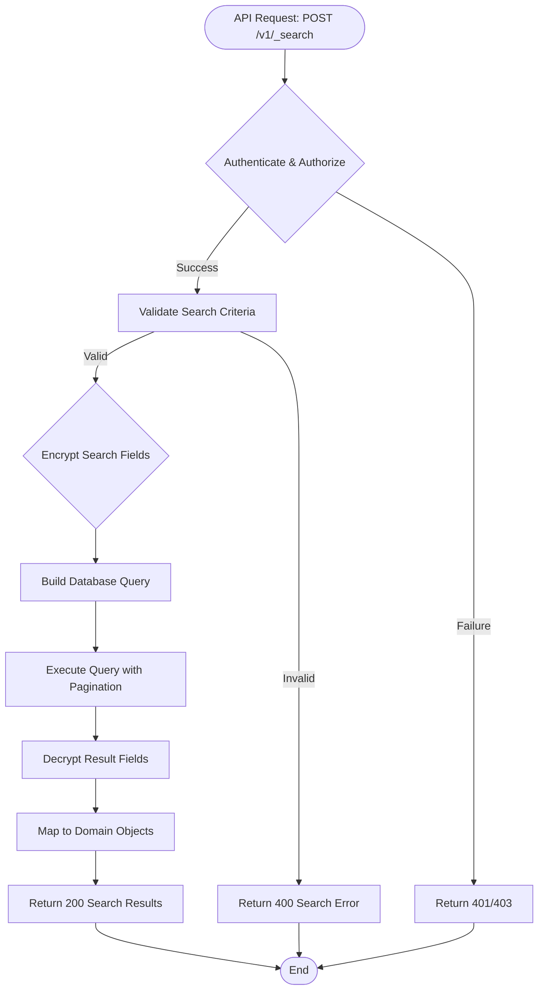

# Bank Account Service - Technical Documentation

## Table of Contents
1. [System & Architecture Overview](#system--architecture-overview)
2. [API Documentation](#api-documentation)
3. [Domain Models & Data Structures](#domain-models--data-structures)
4. [Database Design](#database-design)
5. [Configuration & Application Properties](#configuration--application-properties)
6. [Service Dependencies](#service-dependencies)
7. [Events & Messaging](#events--messaging)
8. [Execution & Business Flows](#execution--business-flows)
9. [Security Considerations](#security-considerations)
10. [API Flow Diagrams](#api-flow-diagrams)

## System & Architecture Overview

The Bank Account Service is a core registry component of the DIGIT Works platform that manages banking details for individuals and organizations. Built on Spring Boot 3.x with Java 17, it provides secure storage and management of bank account information with data encryption capabilities.

### High-Level Architecture



### Component Responsibilities

- **Controller Layer**: Handles HTTP requests for bank account CRUD operations
- **Service Layer**: Core business logic for bank account management
- **Validator**: Input validation and business rule enforcement
- **Enrichment Service**: Data enrichment with IDs and audit details
- **Encryption Service**: Secure encryption/decryption of sensitive banking data
- **Repository Layer**: Data access with encrypted storage

### Key Features

1. **Secure Data Storage**: Bank account details encrypted at rest
2. **Multi-Entity Support**: Supports both individual and organization accounts
3. **Service Integration**: Validates entities through Individual/Organization services
4. **Audit Trail**: Complete audit history for all operations
5. **Search Capabilities**: Flexible search with encrypted data support

## API Documentation

### Base Information
- **Context Path**: `/bankaccount-service`
- **Port**: `8038`
- **API Version**: `v1`

### Authentication & Authorization
- Uses JWT token-based authentication
- Role-based access control for bank account operations
- Tenant-based data isolation

### REST Endpoints

#### 1. Create Bank Account

**Endpoint**: `POST /bankaccount-service/v1/_create`

**Description**: Creates new bank account records with encryption.

**Request Schema**:
```json
{
  "RequestInfo": {
    "apiId": "bankaccount-service",
    "ver": "1.0",
    "ts": "timestamp",
    "action": "create",
    "userInfo": {
      "uuid": "string",
      "roles": []
    }
  },
  "bankAccount": {
    "tenantId": "string (required, 2-64 chars)",
    "serviceCode": "string (required, 2-64 chars)",
    "referenceId": "string (required, 2-64 chars)",
    "bankAccountDetails": [
      {
        "id": "string",
        "tenantId": "string (required)",
        "bankBranchIdentifier": {
          "type": "string (IFSC|SWIFT)",
          "code": "string (required)"
        },
        "accountNumber": "string (required, encrypted)",
        "accountHolderName": "string (required)",
        "accountType": "string (SAVINGS|CURRENT|OVERDRAFT)",
        "isPrimary": "boolean",
        "isActive": "boolean",
        "documents": [
          {
            "fileStoreId": "string",
            "documentType": "string"
          }
        ]
      }
    ],
    "additionalFields": {}
  }
}
```

**Response Schema**:
```json
{
  "ResponseInfo": {
    "apiId": "bankaccount-service",
    "ver": "1.0",
    "ts": "timestamp",
    "status": "successful"
  },
  "bankAccount": [
    {
      "id": "uuid",
      "tenantId": "string",
      "serviceCode": "string",
      "referenceId": "string",
      "bankAccountDetails": [...],
      "auditDetails": {
        "createdBy": "string",
        "createdTime": "timestamp",
        "lastModifiedBy": "string",
        "lastModifiedTime": "timestamp"
      }
    }
  ]
}
```

#### 2. Update Bank Account

**Endpoint**: `POST /bankaccount-service/v1/_update`

**Description**: Updates existing bank account records.

**Request Schema**: Same as create with required `id` field.

#### 3. Search Bank Accounts

**Endpoint**: `POST /bankaccount-service/v1/_search`

**Description**: Searches bank accounts based on criteria.

**Request Schema**:
```json
{
  "RequestInfo": {},
  "bankAccountSearchCriteria": {
    "tenantId": "string (required)",
    "ids": ["string"],
    "serviceCode": ["string"],
    "referenceId": ["string"],
    "accountNumber": "string",
    "isActive": "boolean"
  },
  "pagination": {
    "limit": "number (default: 100, max: 200)",
    "offset": "number (default: 0)",
    "sortBy": "string",
    "sortOrder": "ASC|DESC"
  }
}
```

### Error Handling

```json
{
  "ResponseInfo": {
    "apiId": "bankaccount-service",
    "ver": "1.0", 
    "ts": "timestamp",
    "status": "FAILED"
  },
  "Errors": [
    {
      "code": "ERROR_CODE",
      "message": "Error description",
      "description": "Detailed error information"
    }
  ]
}
```

**Common Error Codes**:
- `BANK_ACCOUNT_NOT_FOUND`: Bank account not found
- `INVALID_TENANT`: Invalid tenant ID
- `DUPLICATE_ACCOUNT`: Duplicate account for reference
- `ENCRYPTION_ERROR`: Encryption/decryption failure
- `REFERENCE_VALIDATION_FAILED`: Invalid reference entity

## Domain Models & Data Structures

### Core Domain Models

#### BankAccount Entity
```java
public class BankAccount {
    private String id;                                // UUID
    private String tenantId;                          // Required (2-64 chars)
    private String serviceCode;                       // Required (2-64 chars)
    private String referenceId;                       // Required (2-64 chars)
    private List<BankAccountDetails> bankAccountDetails; // Required (min 1)
    private Object additionalFields;                  // Extensible metadata
    private AuditDetails auditDetails;                // Audit information
}
```

#### BankAccountDetails Entity
```java
public class BankAccountDetails {
    private String id;                                // UUID
    private String tenantId;                          // Required
    private BankBranchIdentifier bankBranchIdentifier; // Required
    private String accountNumber;                     // Required (encrypted)
    private String accountHolderName;                 // Required
    private String accountType;                       // SAVINGS|CURRENT|OVERDRAFT
    private Boolean isPrimary;                        // Primary account flag
    private Boolean isActive;                         // Active status
    private List<Document> documents;                 // Supporting documents
    private AuditDetails auditDetails;                // Audit information
    private Object additionalFields;                  // Extensible metadata
}
```

#### BankBranchIdentifier Entity
```java
public class BankBranchIdentifier {
    private String type;                              // IFSC|SWIFT
    private String code;                              // Required identifier code
    private Object additionalFields;                  // Extensible metadata
}
```

### Validation Rules

- **BankAccount Level**:
  - tenantId: Required, 2-64 characters
  - serviceCode: Required, 2-64 characters  
  - referenceId: Required, 2-64 characters, must reference valid entity
  - bankAccountDetails: Required, minimum 1 entry

- **BankAccountDetails Level**:
  - accountNumber: Required, will be encrypted
  - accountHolderName: Required
  - bankBranchIdentifier: Required with valid type and code
  - Only one primary account allowed per bank account

### Enums

```java
public enum AccountType {
    SAVINGS, CURRENT, OVERDRAFT
}

public enum BranchIdentifierType {
    IFSC, SWIFT
}
```

### Encryption Specifications

- **Encrypted Fields**: accountNumber
- **Encryption Method**: AES-256 encryption
- **Key Management**: Centralized encryption service integration
- **Search Support**: Encrypted field search through decryption

## Database Design

### Tables Overview

#### eg_bank_account
Primary table for bank accounts.

```sql
CREATE TABLE eg_bank_account (
    id                      VARCHAR(256) PRIMARY KEY,
    tenant_id               VARCHAR(64) NOT NULL,
    service_code            VARCHAR(64) NOT NULL,
    reference_id            VARCHAR(64) NOT NULL,
    additional_fields       JSONB,
    created_by              VARCHAR(256) NOT NULL,
    last_modified_by        VARCHAR(256),
    created_time            BIGINT NOT NULL,
    last_modified_time      BIGINT NOT NULL
);
```

#### eg_bank_account_detail
Bank account detail records.

```sql
CREATE TABLE eg_bank_account_detail (
    id                      VARCHAR(256) PRIMARY KEY,
    tenant_id               VARCHAR(64) NOT NULL,
    bank_account_id         VARCHAR(256) NOT NULL,
    account_number          VARCHAR(256) NOT NULL, -- Encrypted
    account_holder_name     VARCHAR(256) NOT NULL,
    account_type            VARCHAR(64),
    bank_branch_identifier_type VARCHAR(32) NOT NULL,
    bank_branch_identifier_code VARCHAR(64) NOT NULL,
    is_primary              BOOLEAN DEFAULT FALSE,
    is_active               BOOLEAN DEFAULT TRUE,
    additional_fields       JSONB,
    created_by              VARCHAR(256) NOT NULL,
    last_modified_by        VARCHAR(256),
    created_time            BIGINT NOT NULL,
    last_modified_time      BIGINT NOT NULL,
    FOREIGN KEY (bank_account_id) REFERENCES eg_bank_account (id)
);
```

#### eg_bank_account_document
Documents associated with bank accounts.

```sql
CREATE TABLE eg_bank_account_document (
    id                      VARCHAR(256) PRIMARY KEY,
    bank_account_detail_id  VARCHAR(256) NOT NULL,
    filestore_id            VARCHAR(256) NOT NULL,
    document_type           VARCHAR(128),
    additional_fields       JSONB,
    created_by              VARCHAR(256) NOT NULL,
    last_modified_by        VARCHAR(256),
    created_time            BIGINT NOT NULL,
    last_modified_time      BIGINT NOT NULL,
    FOREIGN KEY (bank_account_detail_id) REFERENCES eg_bank_account_detail (id)
);
```

### Entity Relationship Diagram



### Indexes and Performance

**Primary Indexes**:
- `eg_bank_account`: id, (tenant_id, service_code, reference_id) unique
- `eg_bank_account_detail`: id, bank_account_id (FK)
- `eg_bank_account_document`: id, bank_account_detail_id (FK)

**Secondary Indexes**:
- `index_eg_bank_account_tenantId`
- `index_eg_bank_account_serviceCode`
- `index_eg_bank_account_referenceId`
- `index_eg_bank_account_detail_isPrimary`

### Data Constraints

- **Unique Constraints**: (tenant_id, service_code, reference_id)
- **Foreign Key Constraints**: Maintaining referential integrity
- **Check Constraints**: Only one primary account per bank account

## Configuration & Application Properties

### Environment-Specific Configuration

```properties
# Server Configuration
server.contextPath=/bankaccount-service
server.port=8038
app.timezone=UTC

# Database Configuration
spring.datasource.driver-class-name=org.postgresql.Driver
spring.datasource.url=jdbc:postgresql://localhost:5432/works
spring.datasource.username=postgres
spring.datasource.password=root

# Flyway Migration
spring.flyway.table=public
spring.flyway.baseline-on-migrate=true
spring.flyway.enabled=true

# Kafka Configuration
kafka.config.bootstrap_server_config=localhost:9092
spring.kafka.consumer.group-id=bankaccounts
spring.kafka.producer.value-serializer=org.springframework.kafka.support.serializer.JsonSerializer

# Kafka Topics
bank.account.kafka.create.topic=save-bank-account
bank.account.kafka.update.topic=update-bank-account

# Search Configuration
bank.account.default.offset=0
bank.account.default.limit=100
bank.account.search.max.limit=200

# External Service URLs
egov.individual.host=https://works-dev.digit.org
egov.individual.search.endpoint=/individual/v1/_search
egov.organisation.host=https://works-dev.digit.org
egov.organisation.search.endpoint=/org-services/organisation/v1/_search
egov.mdms.host=https://works-dev.digit.org
egov.mdms.search.endpoint=/mdms-v2/v1/_search
egov.user.host=https://works-dev.digit.org
egov.hrms.host=https://works-dev.digit.org
egov.hrms.search.endpoint=/egov-hrms/employees/_search
egov.idgen.host=https://works-dev.digit.org/
egov.localization.host=https://works-dev.digit.org
egov.url.shortner.host=https://works-dev.digit.org

# State Configuration
state.level.tenant.id=pg
```

### Feature Flags

- `is.workflow.enabled`: Enable/disable workflow integration
- `egov.sms.notification.topic`: SMS notification enablement

### Security Configuration

- **Encryption**: Enabled for sensitive fields
- **Data Protection**: Encrypted storage for account numbers
- **Access Control**: Role-based access to bank account operations

## Service Dependencies

### External Services Used

#### 1. Individual Service
- **Purpose**: Validate individual references and fetch individual details
- **Host**: `egov.individual.host`
- **Endpoint**: `/individual/v1/_search`
- **Usage**: Reference validation for individual bank accounts

#### 2. Organization Service
- **Purpose**: Validate organization references and fetch organization details
- **Host**: `egov.organisation.host`
- **Endpoint**: `/org-services/organisation/v1/_search`
- **Usage**: Reference validation for organization bank accounts

#### 3. MDMS Service
- **Purpose**: Master data validation
- **Host**: `egov.mdms.host`
- **Endpoint**: `/mdms-v2/v1/_search`
- **Data Retrieved**:
  - Bank branch validation data
  - Account type configurations
  - Service code validations

#### 4. User Service
- **Purpose**: User authentication and details
- **Host**: `egov.user.host`
- **Endpoints**:
  - `/user/_search`
  - `/user/_createnovalidate`
  - `/user/_updatenovalidate`

#### 5. HRMS Service
- **Purpose**: Employee details for HRMS integration
- **Host**: `egov.hrms.host`
- **Endpoint**: `/egov-hrms/employees/_search`

#### 6. ID Generation Service
- **Purpose**: Generate bank account IDs
- **Host**: `egov.idgen.host`
- **Endpoint**: `/egov-idgen/id/_generate`

#### 7. Localization Service
- **Purpose**: Multi-language support
- **Host**: `egov.localization.host`
- **Endpoint**: `/localization/messages/v1/_search`

#### 8. URL Shortener Service
- **Purpose**: Generate short URLs for notifications
- **Host**: `egov.url.shortner.host`
- **Endpoint**: `/egov-url-shortening/shortener`

### Libraries and Frameworks

- **Spring Boot 3.x**: Core framework
- **Jakarta Validation**: Input validation (Jakarta migration)
- **PostgreSQL Driver**: Database connectivity
- **Flyway**: Database migration
- **Apache Kafka**: Event messaging
- **Jackson**: JSON processing
- **Swagger**: API documentation
- **Lombok**: Code generation
- **DIGIT Common Libraries**: Shared utilities and encryption

## Events & Messaging

### Kafka Topics Used

#### Producer Topics

1. **save-bank-account**
   - **Purpose**: Bank account creation events
   - **Producer**: Bank Account Service
   - **Consumers**: Persister, Indexer
   - **Payload**: BankAccountRequest
   - **Trigger**: After successful bank account creation

2. **update-bank-account**
   - **Purpose**: Bank account update events
   - **Producer**: Bank Account Service
   - **Consumers**: Persister, Indexer
   - **Payload**: BankAccountRequest
   - **Trigger**: After successful bank account updates

3. **egov.core.notification.sms**
   - **Purpose**: SMS notifications
   - **Producer**: Bank Account Service (via NotificationUtil)
   - **Consumers**: SMS Service
   - **Payload**: SMS notification request

### Event Flow



### Message Schema

#### BankAccountRequest Message
```json
{
  "RequestInfo": {
    "apiId": "bankaccount-service",
    "ver": "1.0",
    "ts": 1234567890,
    "action": "create",
    "userInfo": {...}
  },
  "bankAccount": {
    "id": "uuid",
    "tenantId": "tenant",
    "serviceCode": "INDIVIDUAL|ORGANIZATION",
    "referenceId": "reference-uuid",
    "bankAccountDetails": [
      {
        "accountNumber": "encrypted-account-number",
        "accountHolderName": "Account Holder Name",
        "bankBranchIdentifier": {
          "type": "IFSC",
          "code": "BANK0001234"
        },
        "isPrimary": true,
        "isActive": true
      }
    ]
  }
}
```

## Execution & Business Flows

### Key Business Flows

#### 1. Bank Account Creation Flow



#### 2. Bank Account Search Flow



#### 3. Reference Validation Flow



### Business Rules

1. **Bank Account Creation**:
   - Reference ID must exist in Individual/Organization service
   - Account number must be unique per tenant
   - Only one primary account allowed per bank account
   - Bank branch identifier must be valid

2. **Encryption Rules**:
   - Account numbers always encrypted before storage
   - Decryption only during authorized access
   - Search on encrypted fields requires decryption

3. **Validation Rules**:
   - Service code must match reference entity type
   - Account type must be valid enum value
   - Branch identifier type and code must be consistent

### Error Scenarios

1. **Reference Validation Failures**: Invalid individual/organization reference
2. **Encryption Failures**: Encryption service unavailable
3. **Duplicate Account**: Account number already exists
4. **Invalid Branch**: Bank branch identifier not valid
5. **Primary Account Conflict**: Multiple primary accounts for same bank account

## Security Considerations

### Data Protection

#### Encryption at Rest
- **Account Numbers**: AES-256 encryption before database storage
- **Key Management**: Centralized encryption service integration
- **Data Classification**: Sensitive banking data marked and protected

#### Authentication & Authorization
- **JWT Token Validation**: All requests require valid JWT
- **Role-based Access**: Access control based on user roles
- **Tenant Isolation**: All operations scoped to tenant context

### Data Security Measures

#### Sensitive Data Handling
- **Encryption**: All sensitive banking details encrypted
- **Audit Trail**: Complete audit log of all operations
- **Data Minimization**: Only necessary data stored and transmitted
- **Secure Transmission**: HTTPS for all API communications

#### Access Controls
- **Service-Level Security**: Authentication required for all endpoints
- **Field-Level Security**: Encrypted storage for sensitive fields
- **Search Security**: Encrypted field search with proper authorization

### Compliance Considerations

#### Financial Data Compliance
- **Data Retention**: Configurable retention policies
- **Audit Requirements**: Complete audit trail maintained
- **Privacy Protection**: Personal banking data protection
- **Regulatory Compliance**: Adherence to banking data regulations

## API Flow Diagrams

### Create Bank Account API Flow



### Search Bank Account API Flow



---

*This documentation reflects the actual implementation of the Bank Account Service in the DIGIT Works platform. For the latest updates, refer to the service's API specifications and configuration files.*