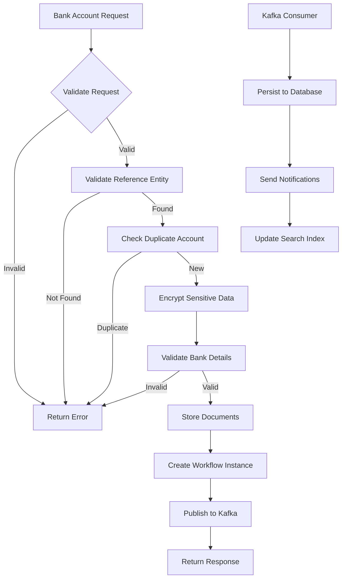
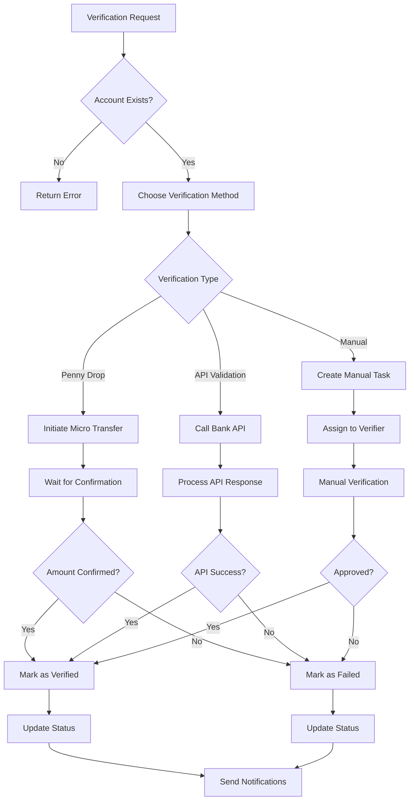
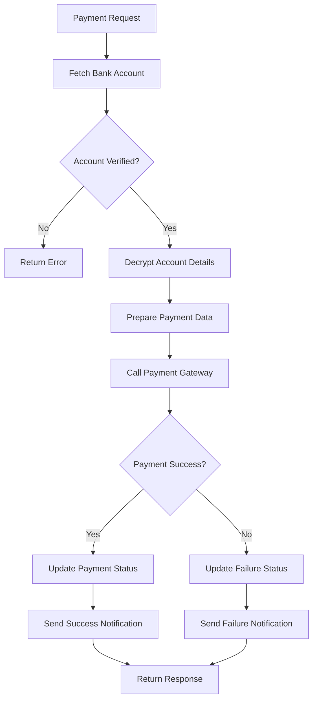
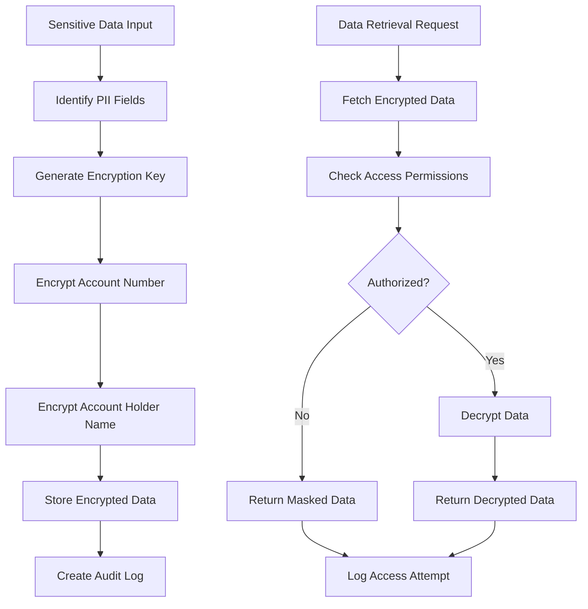

# Bank Account Service - Technical Documentation

## Table of Contents
1. [System & Architecture Overview](#system--architecture-overview)
2. [API Documentation](#api-documentation)
3. [Domain Models & Data Structures](#domain-models--data-structures)
4. [Database Design](#database-design)
5. [Configuration & Application Properties](#configuration--application-properties)
6. [Service Dependencies](#service-dependencies)
7. [External Dependencies](#external-dependencies)
8. [Events & Messaging](#events--messaging)
9. [Execution & Business Flows](#execution--business-flows)
10. [Security Considerations](#security-considerations)

---

## System & Architecture Overview

### Service Purpose
The Bank Account Service is a secure registry that manages financial account details of individual and organizational entities within the DIGIT-Works ecosystem. It provides comprehensive storage and management of bank account information with advanced PII encryption features, ensuring financial data security while enabling seamless payment processing across the platform.

### Key Features
- **Multi-entity Support**: Bank accounts for both individuals and organizations
- **PII Encryption**: Advanced encryption for sensitive financial data
- **Multi-account Management**: Support for multiple accounts per entity
- **Document Management**: Secure storage of bank documents and proofs
- **Branch Identification**: Comprehensive bank branch identifier support (IFSC, SWIFT, etc.)
- **Workflow Integration**: Approval workflows for account verification
- **International Support**: Configurable for global banking systems

### System Architecture

```mermaid
graph TB
    subgraph "External Systems"
        INDIVIDUAL[Individual Service]
        ORGANISATION[Organisation Service]
        ENCRYPTION[Encryption Service]
        WORKFLOW[Workflow Service]
        IDGEN[ID Generation Service]
        MDMS[MDMS Service]
        FILESTORE[File Store Service]
        NOTIFICATION[Notification Service]
        BANKAPI[Bank Validation APIs]
    end
    
    subgraph "Bank Account Service"
        API[Bank Account API Controller]
        
        subgraph "Service Layer"
            BANKSVC[Bank Account Service]
            ENCSVC[Encryption Service]
            ENRSVC[Enrichment Service]
            VALSVC[Validation Service]
        end
        
        subgraph "Utility Layer"
            ENCUTIL[Encryption Util]
            BANKUTIL[Bank Account Util]
            IDGENUTIL[ID Gen Util]
            INDIVUTIL[Individual Util]
            ORGUTIL[Organisation Util]
        end
        
        subgraph "Data Layer"
            BANKREPO[Bank Account Repository]
            DETAILREPO[Account Detail Repository]
            DOCREPO[Document Repository]
            BRANCHREPO[Branch Identifier Repository]
        end
        
        subgraph "Infrastructure"
            KAFKA[Kafka Producer/Consumer]
            DB[(PostgreSQL Database)]
            CACHE[Cache Layer]
        end
    end
    
    API --> BANKSVC
    BANKSVC --> ENCSVC
    BANKSVC --> ENRSVC
    BANKSVC --> VALSVC
    
    ENCSVC --> ENCUTIL
    BANKSVC --> BANKUTIL
    BANKSVC --> IDGENUTIL
    BANKSVC --> INDIVUTIL
    BANKSVC --> ORGUTIL
    
    BANKSVC --> BANKREPO
    BANKSVC --> DETAILREPO
    BANKSVC --> DOCREPO
    BANKSVC --> BRANCHREPO
    
    BANKREPO --> DB
    DETAILREPO --> DB
    DOCREPO --> DB
    BRANCHREPO --> DB
    
    BANKSVC --> KAFKA
    
    ENCSVC --> ENCRYPTION
    VALSVC --> INDIVIDUAL
    VALSVC --> ORGANISATION
    BANKSVC --> WORKFLOW
    BANKSVC --> IDGEN
    BANKSVC --> MDMS
    BANKSVC --> FILESTORE
    BANKSVC --> NOTIFICATION
    VALSVC --> BANKAPI
```



---

## API Documentation

### Base Configuration
- **Context Path**: `/bankaccount-service`
- **Port**: 8038
- **API Version**: v1

### Endpoints

#### 1. Create Bank Account
**POST** `/bankaccount-service/bankaccount/v1/_create`

Creates a new bank account for an individual or organization.

**Request Body:**
```json
{
  "RequestInfo": {
    "apiId": "bankaccount-service",
    "ver": "1.0",
    "ts": 1675234567890,
    "action": "_create",
    "did": "",
    "key": "",
    "msgId": "20230201-123456",
    "authToken": "auth-token",
    "userInfo": {
      "id": 12345,
      "userName": "finance1",
      "roles": [{"code": "BANK_ACCOUNT_ADMIN", "name": "Bank Account Admin"}]
    }
  },
  "bankAccounts": [{
    "tenantId": "pb.amritsar",
    "serviceCode": "WORKS-BANK-ACCOUNT",
    "referenceId": "individual-uuid-123",
    "bankAccountDetails": [{
      "tenantId": "pb.amritsar",
      "accountHolderName": "Rajesh Kumar",
      "accountNumber": "1234567890123456",
      "accountType": "SAVINGS",
      "isPrimary": true,
      "isActive": true,
      "bankBranchIdentifier": {
        "type": "IFSC",
        "code": "SBIN0001234",
        "additionalDetails": {
          "bankName": "State Bank of India",
          "branchName": "Amritsar Main Branch",
          "branchAddress": "Mall Road, Amritsar, Punjab"
        }
      },
      "documents": [{
        "documentType": "BANK_PASSBOOK",
        "fileStore": "filestore-uuid-456",
        "documentUid": "doc-uuid-789",
        "additionalDetails": {
          "fileName": "bank_passbook.pdf",
          "uploadDate": 1675234567890
        }
      }],
      "additionalDetails": {
        "nomineeDetails": {
          "nomineeName": "Sunita Kumar",
          "relationship": "SPOUSE"
        },
        "accountOpenDate": "2020-01-15"
      }
    }],
    "additionalDetails": {
      "entityType": "INDIVIDUAL",
      "purpose": "WAGE_PAYMENT"
    }
  }],
  "workflow": {
    "action": "SUBMIT",
    "comment": "Bank account submitted for verification",
    "assignees": ["verifier-uuid-456"]
  }
}
```

#### 2. Update Bank Account
**POST** `/bankaccount-service/bankaccount/v1/_update`

Updates an existing bank account.

#### 3. Search Bank Accounts
**POST** `/bankaccount-service/bankaccount/v1/_search`

Searches bank accounts based on various criteria.

**Query Parameters:**
- `tenantId` (required): Tenant identifier
- `ids`: List of bank account UUIDs
- `referenceId`: Reference entity ID (individual/organization)
- `serviceCode`: Service code
- `accountNumber`: Account number (encrypted search)
- `accountHolderName`: Account holder name
- `accountType`: Type of account
- `isActive`: Active status filter
- `isPrimary`: Primary account filter
- `limit`: Number of records (default: 100, max: 200)
- `offset`: Page offset (default: 0)

#### 4. Verify Bank Account
**POST** `/bankaccount-service/bankaccount/v1/_verify`

Initiates bank account verification process.

**Request Body:**
```json
{
  "RequestInfo": {...},
  "bankAccountId": "bank-account-uuid-123",
  "verificationType": "PENNY_DROP",
  "verificationDetails": {
    "amount": 1.00,
    "referenceNumber": "VERIFY123456"
  }
}
```

#### 5. Deactivate Bank Account
**POST** `/bankaccount-service/bankaccount/v1/_deactivate`

Deactivates a bank account.

---

## Domain Models & Data Structures

### Core Models

#### BankAccount Model
```java
public class BankAccount {
    private String id;                              // UUID
    private String tenantId;                        // Tenant identifier
    private String serviceCode;                     // Service code (WORKS-BANK-ACCOUNT)
    private String referenceId;                     // Individual/Organization reference
    private List<BankAccountDetail> bankAccountDetails; // Account details
    private String status;                          // ACTIVE/INACTIVE/PENDING_VERIFICATION
    private Workflow workflow;                      // Workflow details
    private AuditDetails auditDetails;              // Audit information
    private Object additionalDetails;               // Additional data
}
```

#### BankAccountDetail Model
```java
public class BankAccountDetail {
    private String id;                              // UUID
    private String tenantId;                        // Tenant identifier
    private String bankAccountId;                   // Parent bank account reference
    private String accountHolderName;               // Account holder name (encrypted)
    private String accountNumber;                   // Account number (encrypted)
    private String accountType;                     // SAVINGS/CURRENT/NRE/NRO
    private Boolean isPrimary;                      // Primary account flag
    private Boolean isActive;                       // Active status
    private BankBranchIdentifier bankBranchIdentifier; // Branch details
    private List<Document> documents;               // Supporting documents
    private AuditDetails auditDetails;              // Audit information
    private Object additionalDetails;               // Additional data
}
```

#### BankBranchIdentifier Model
```java
public class BankBranchIdentifier {
    private String id;                              // UUID
    private String bankAccountDetailId;             // Account detail reference
    private String type;                            // IFSC/SWIFT/ROUTING/BSB
    private String code;                            // Identifier code
    private Object additionalDetails;               // Bank and branch details
}
```

#### BankAccountDocument Model
```java
public class BankAccountDocument {
    private String id;                              // UUID
    private String bankAccountDetailId;             // Account detail reference
    private String documentType;                    // BANK_PASSBOOK/CHEQUE/STATEMENT
    private String fileStore;                       // File store reference
    private String documentUid;                     // Document unique identifier
    private Object additionalDetails;               // Document metadata
}
```

#### VerificationRequest Model
```java
public class VerificationRequest {
    private String bankAccountId;                   // Bank account to verify
    private String verificationType;                // PENNY_DROP/MANUAL/API_VERIFICATION
    private String accountNumber;                   // Account number to verify
    private String ifscCode;                        // IFSC code for verification
    private BigDecimal amount;                      // Verification amount for penny drop
    private Object verificationDetails;             // Additional verification data
}
```

---

## Database Design

### Database Schema

#### eg_bank_account Table
```sql
CREATE TABLE eg_bank_account(
    id                      character varying(256) PRIMARY KEY,
    tenant_id               character varying(64) NOT NULL,
    service_code            character varying(128) NOT NULL,
    reference_id            character varying(256) NOT NULL,
    status                  character varying(64) DEFAULT 'ACTIVE',
    additional_details      JSONB,
    created_by              character varying(256) NOT NULL,
    last_modified_by        character varying(256),
    created_time            bigint,
    last_modified_time      bigint
);

CREATE INDEX idx_bank_account_tenant ON eg_bank_account(tenant_id);
CREATE INDEX idx_bank_account_reference ON eg_bank_account(reference_id);
CREATE INDEX idx_bank_account_service ON eg_bank_account(service_code);
CREATE INDEX idx_bank_account_status ON eg_bank_account(status);
CREATE INDEX idx_bank_account_created_time ON eg_bank_account(created_time);
```

#### eg_bank_account_detail Table
```sql
CREATE TABLE eg_bank_account_detail(
    id                      character varying(256) PRIMARY KEY,
    tenant_id               character varying(64) NOT NULL,
    bank_account_id         character varying(256) NOT NULL,
    account_holder_name     character varying(256),        -- Encrypted
    account_number          character varying(256) NOT NULL, -- Encrypted
    account_type            character varying(140) NOT NULL,
    is_primary              boolean DEFAULT false,
    is_active               boolean DEFAULT true,
    additional_details      JSONB,
    created_by              character varying(256) NOT NULL,
    last_modified_by        character varying(256),
    created_time            bigint,
    last_modified_time      bigint,
    CONSTRAINT fk_eg_bank_account_detail FOREIGN KEY (bank_account_id) REFERENCES eg_bank_account (id)
);

CREATE INDEX idx_bank_detail_account ON eg_bank_account_detail(bank_account_id);
CREATE INDEX idx_bank_detail_primary ON eg_bank_account_detail(is_primary);
CREATE INDEX idx_bank_detail_active ON eg_bank_account_detail(is_active);
CREATE INDEX idx_bank_detail_type ON eg_bank_account_detail(account_type);
```

#### eg_bank_accounts_doc Table
```sql
CREATE TABLE eg_bank_accounts_doc(
    id                      character varying(256) PRIMARY KEY,
    bank_account_detail_id  character varying(64) NOT NULL,
    document_type           character varying(128),
    file_store              character varying(128),
    document_uid            character varying(256),
    additional_details      jsonb,
    CONSTRAINT fk_eg_bank_accounts_doc FOREIGN KEY (bank_account_detail_id) REFERENCES eg_bank_account_detail (id)
);

CREATE INDEX idx_bank_doc_detail ON eg_bank_accounts_doc(bank_account_detail_id);
CREATE INDEX idx_bank_doc_type ON eg_bank_accounts_doc(document_type);
```

#### eg_bank_branch_identifier Table
```sql
CREATE TABLE eg_bank_branch_identifier(
    id                      character varying(256) PRIMARY KEY,
    bank_account_detail_id  character varying(64) NOT NULL,
    type                    character varying(140), -- IFSC/SWIFT/ROUTING/BSB
    code                    character varying(140),
    additional_details      JSONB,
    CONSTRAINT fk_eg_bank_branch_identifier FOREIGN KEY (bank_account_detail_id) REFERENCES eg_bank_account_detail (id)
);

CREATE INDEX idx_branch_detail ON eg_bank_branch_identifier(bank_account_detail_id);
CREATE INDEX idx_branch_type ON eg_bank_branch_identifier(type);
CREATE INDEX idx_branch_code ON eg_bank_branch_identifier(code);
```

#### eg_bank_account_verification Table
```sql
CREATE TABLE eg_bank_account_verification(
    id                      character varying(256) PRIMARY KEY,
    bank_account_detail_id  character varying(256) NOT NULL,
    verification_type       character varying(128) NOT NULL,
    verification_status     character varying(64) DEFAULT 'PENDING',
    verification_amount     numeric(10,2),
    reference_number        character varying(128),
    verification_date       bigint,
    verification_response   JSONB,
    created_by              character varying(256) NOT NULL,
    last_modified_by        character varying(256),
    created_time            bigint,
    last_modified_time      bigint,
    CONSTRAINT fk_bank_verification FOREIGN KEY (bank_account_detail_id) REFERENCES eg_bank_account_detail (id)
);

CREATE INDEX idx_verification_detail ON eg_bank_account_verification(bank_account_detail_id);
CREATE INDEX idx_verification_status ON eg_bank_account_verification(verification_status);
CREATE INDEX idx_verification_type ON eg_bank_account_verification(verification_type);
```

---

## Configuration & Application Properties

### Server Configuration
```properties
server.contextPath=/bankaccount-service
server.servlet.contextPath=/bankaccount-service
server.port=8038
app.timezone=UTC

# Database Configuration
spring.datasource.driver-class-name=org.postgresql.Driver
spring.datasource.url=jdbc:postgresql://localhost:5432/digit-works
spring.datasource.username=postgres
spring.datasource.password=postgres

# Flyway Configuration
spring.flyway.url=jdbc:postgresql://localhost:5432/digit-works
spring.flyway.user=postgres
spring.flyway.password=postgres
spring.flyway.table=bankaccount_schema
spring.flyway.baseline-on-migrate=true
spring.flyway.outOfOrder=true
spring.flyway.locations=classpath:/db/migration/main
spring.flyway.enabled=true

# Kafka Configuration
kafka.config.bootstrap_server_config=localhost:9092
spring.kafka.consumer.group-id=bankaccounts
spring.kafka.producer.key-serializer=org.apache.kafka.common.serialization.StringSerializer
spring.kafka.producer.value-serializer=org.springframework.kafka.support.serializer.JsonSerializer

# Kafka Topics
bank.account.kafka.create.topic=save-bank-account
bank.account.kafka.update.topic=update-bank-account

# Search Configuration
bank.account.default.offset=0
bank.account.default.limit=100
bank.account.search.max.limit=200

# Encryption Configuration
egov.encryption.key=encryption-key-here
egov.encryption.iv=initialization-vector-here

# Workflow Configuration
is.workflow.enabled=true

# State Level Configuration
state.level.tenant.id=pb
```

---

## Service Dependencies

### Internal DIGIT Services

1. **Individual Service** (`egov.individual.host`)
   - **Purpose**: Validate individual references
   - **APIs Used**: `/individual/v1/_search`
   - **Usage**: Validate individual IDs, fetch individual details

2. **Organisation Service** (`egov.organisation.host`)
   - **Purpose**: Validate organization references
   - **APIs Used**: `/org-services/organisation/v1/_search`
   - **Usage**: Validate organization IDs, fetch organization details

3. **Encryption Service** (`egov.enc.host`)
   - **Purpose**: Encrypt/decrypt sensitive data
   - **APIs Used**: `/crypto-service/encrypt`, `/crypto-service/decrypt`
   - **Usage**: Encrypt account numbers, account holder names

4. **Workflow Service** (`egov.workflow.host`)
   - **Purpose**: Account verification workflows
   - **APIs Used**: 
     - `/egov-workflow-v2/egov-wf/process/_transition`
     - `/egov-workflow-v2/egov-wf/process/_search`
   - **Usage**: Handle account verification and approval workflows

5. **ID Generation Service** (`egov.idgen.host`)
   - **Purpose**: Generate unique identifiers
   - **APIs Used**: `/egov-idgen/id/_generate`
   - **Usage**: Generate bank account IDs

6. **MDMS Service** (`egov.mdms.host`)
   - **Purpose**: Master data validation
   - **APIs Used**: `/egov-mdms-service/v1/_search`
   - **Usage**: Validate account types, bank codes, document types

7. **File Store Service** (`egov.filestore.host`)
   - **Purpose**: Document storage
   - **APIs Used**: `/filestore/v1/files/upload`, `/filestore/v1/files/url`
   - **Usage**: Store bank account documents

8. **Notification Service**
   - **Purpose**: Send notifications
   - **Integration**: Via Kafka topics
   - **Events**: Account verification, approval notifications

---

## External Dependencies

### Infrastructure Dependencies

1. **PostgreSQL Database**
   - **Version**: 12+
   - **Purpose**: Primary data storage with encryption support
   - **Configuration**:
     ```properties
     spring.datasource.hikari.maximum-pool-size=10
     spring.datasource.hikari.connection-timeout=30000
     ```

2. **Apache Kafka**
   - **Version**: 2.8+
   - **Purpose**: Event streaming and async processing
   - **Topics Required**:
     - save-bank-account
     - update-bank-account
     - egov.core.notification.sms
   - **Configuration**:
     ```properties
     spring.kafka.consumer.auto-offset-reset=earliest
     ```

3. **Encryption Service**
   - **Purpose**: PII data encryption/decryption
   - **Type**: AES-256 encryption
   - **Configuration**: Field-level encryption for sensitive data

### External Service Dependencies

1. **Bank Validation APIs**
   - **Purpose**: Validate bank account details
   - **APIs**: Third-party bank validation services
   - **Usage**: IFSC validation, account verification

2. **Penny Drop Services**
   - **Purpose**: Account verification via micro-deposits
   - **Integration**: Banking partner APIs
   - **Usage**: Verify account ownership

3. **Payment Gateway APIs**
   - **Purpose**: Payment processing integration
   - **APIs**: UPI, NEFT, RTGS APIs
   - **Usage**: Process payments to verified accounts

---

## Events & Messaging

### Kafka Topics

#### Produced Events

| Topic | Purpose | Event Schema |
|-------|---------|--------------|
| `save-bank-account` | Create bank account | BankAccountRequest |
| `update-bank-account` | Update bank account | BankAccountRequest |
| `bank-account-verified` | Account verification | VerificationRequest |

#### Consumed Events

| Topic | Purpose | Handler |
|-------|---------|---------|
| `individual-updated` | Update account holder | IndividualUpdateHandler |
| `organization-updated` | Update organization accounts | OrganizationUpdateHandler |

### Event Schema

```json
{
  "RequestInfo": {
    "apiId": "bankaccount-service",
    "ver": "1.0",
    "ts": 1675234567890,
    "action": "create",
    "userInfo": {...}
  },
  "bankAccounts": [{
    "id": "bank-account-uuid",
    "tenantId": "pb.amritsar",
    "serviceCode": "WORKS-BANK-ACCOUNT",
    "referenceId": "individual-uuid-123",
    "bankAccountDetails": [...],
    "auditDetails": {...}
  }]
}
```

---

## Execution & Business Flows

### 1. Bank Account Creation Flow



### 2. Account Verification Flow



### 3. Payment Integration Flow



### 4. Data Encryption Flow



---

## Security Considerations

### Authentication & Authorization
1. **JWT Token Validation**: All APIs require valid JWT tokens
2. **Role-Based Access Control**:
   - BANK_ACCOUNT_ADMIN: Full access to all bank accounts
   - BANK_ACCOUNT_CREATOR: Create and update accounts
   - BANK_ACCOUNT_VIEWER: Read-only access
   - FINANCE_USER: Access for payment processing
   - AUDITOR: Audit access with decryption rights

### Data Security
1. **PII Encryption**:
   - Account numbers encrypted using AES-256
   - Account holder names encrypted
   - Bank branch codes protected
   - Encryption keys rotated regularly

2. **Access Control**:
   - Field-level access control
   - Audit logging for all decryption operations
   - Masked display for unauthorized users

3. **Data Masking**:
   - Account numbers masked in logs
   - Partial masking in search results
   - Full encryption in database

### Compliance & Privacy
1. **PCI DSS Compliance**:
   - Secure storage of financial data
   - Regular security assessments
   - Compliance with payment card industry standards

2. **Data Privacy**:
   - GDPR compliance for data protection
   - Right to be forgotten implementation
   - Consent management for data processing

3. **Banking Regulations**:
   - Know Your Customer (KYC) compliance
   - Anti-Money Laundering (AML) checks
   - Reserve Bank regulations compliance

### Security Monitoring
1. **Fraud Detection**:
   - Unusual account creation patterns
   - Multiple accounts for single entity
   - Suspicious verification attempts

2. **Access Monitoring**:
   - Real-time monitoring of data access
   - Alert on unauthorized decryption attempts
   - Regular security audits

3. **Data Integrity**:
   - Hash verification for encrypted data
   - Regular integrity checks
   - Backup and recovery procedures

### Performance & Optimization
1. **Encryption Performance**: Optimized encryption/decryption algorithms
2. **Database Optimization**: Proper indexing for encrypted fields
3. **Caching Strategy**: Secure caching with encrypted data
4. **API Rate Limiting**: Protection against brute force attacks