# DIGIT Works Business Flow Documentation

## Table of Contents

1. [Overview](#overview)
2. [End-to-End Project Lifecycle Flow](#end-to-end-project-lifecycle-flow)
3. [Contract Execution Workflow](#contract-execution-workflow)
4. [Attendance to Payment Flow](#attendance-to-payment-flow)
5. [Bill Generation and Payment Process](#bill-generation-and-payment-process)
6. [Document Generation Flows](#document-generation-flows)
7. [Organisation Onboarding Flow](#organisation-onboarding-flow)
8. [Error Handling and Recovery Flows](#error-handling-and-recovery-flows)
9. [Event-Driven Architecture Flow](#event-driven-architecture-flow)

---

## Overview

This document provides comprehensive business flow diagrams showing how the different DIGIT Works services interact with each other for key business processes. The DIGIT Works platform consists of multiple microservices that work together to manage public works programs including project management, contract execution, attendance tracking, bill generation, and payment processing.

### Core Services Architecture

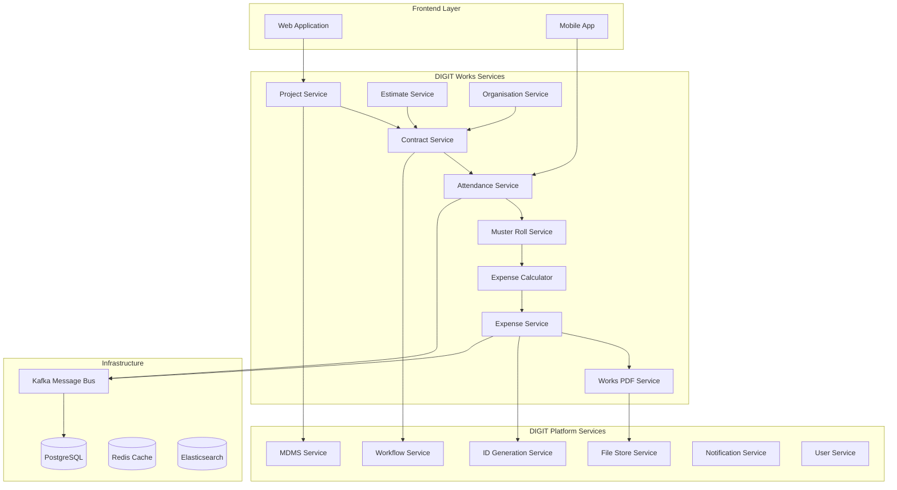
```mermaid
graph TB
    subgraph "Frontend Layer"
        WEB[Web Application]
        MOBILE[Mobile App]
    end
    
    subgraph "DIGIT Works Services"
        PROJECT[Project Service]
        ESTIMATE[Estimate Service]
        CONTRACT[Contract Service]
        ORG[Organisation Service]
        ATTENDANCE[Attendance Service]
        MUSTER[Muster Roll Service]
        EXPENSE[Expense Service]
        CALC[Expense Calculator]
        PDF[Works PDF Service]
    end
    
    subgraph "DIGIT Platform Services"
        MDMS[MDMS Service]
        WORKFLOW[Workflow Service]
        IDGEN[ID Generation Service]
        FILESTORE[File Store Service]
        NOTIFICATION[Notification Service]
        USER[User Service]
    end
    
    subgraph "Infrastructure"
        KAFKA[Kafka Message Bus]
        POSTGRES[(PostgreSQL)]
        REDIS[(Redis Cache)]
        ES[(Elasticsearch)]
    end
    
    WEB --> PROJECT
    MOBILE --> ATTENDANCE
    
    PROJECT --> CONTRACT
    CONTRACT --> ATTENDANCE
    ATTENDANCE --> MUSTER
    MUSTER --> CALC
    CALC --> EXPENSE
    EXPENSE --> PDF
    
    ORG --> CONTRACT
    ESTIMATE --> CONTRACT
    
    PROJECT --> MDMS
    CONTRACT --> WORKFLOW
    EXPENSE --> IDGEN
    PDF --> FILESTORE
    
    ATTENDANCE --> KAFKA
    EXPENSE --> KAFKA
    KAFKA --> POSTGRES
```

---

## End-to-End Project Lifecycle Flow

This flow shows the complete journey from project creation to final payment, involving all major services and their interactions.

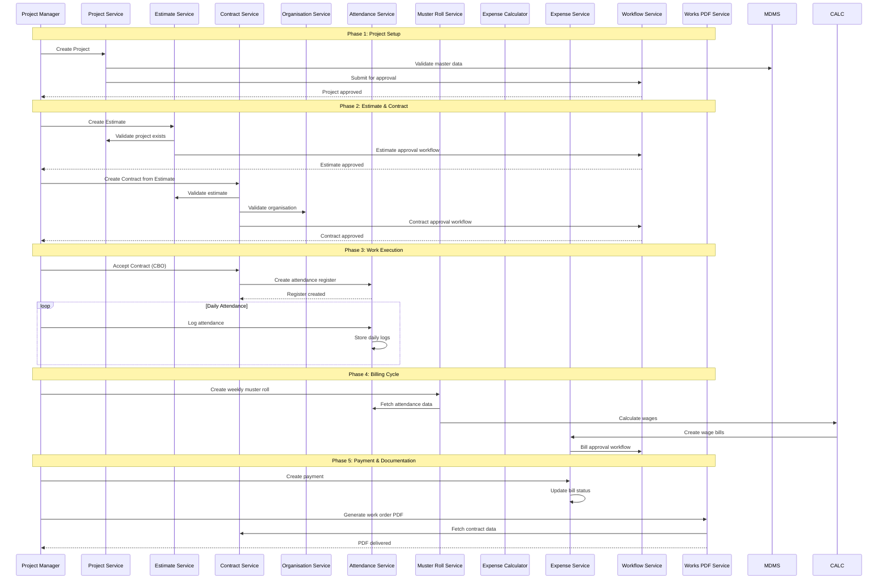
```mermaid
sequenceDiagram
    participant PM as Project Manager
    participant PS as Project Service
    participant EST as Estimate Service
    participant CS as Contract Service
    participant OS as Organisation Service
    participant AS as Attendance Service
    participant MS as Muster Roll Service
    participant EC as Expense Calculator
    participant ES as Expense Service
    participant WF as Workflow Service
    participant PDFS as Works PDF Service

    Note over PM,PDFS: Phase 1: Project Setup
    PM->>PS: Create Project
    PS->>MDMS: Validate master data
    PS->>WF: Submit for approval
    WF-->>PM: Project approved

    Note over PM,PDFS: Phase 2: Estimate & Contract
    PM->>EST: Create Estimate
    EST->>PS: Validate project exists
    EST->>WF: Estimate approval workflow
    WF-->>PM: Estimate approved
    
    PM->>CS: Create Contract from Estimate
    CS->>EST: Validate estimate
    CS->>OS: Validate organisation
    CS->>WF: Contract approval workflow
    WF-->>PM: Contract approved

    Note over PM,PDFS: Phase 3: Work Execution
    PM->>CS: Accept Contract (CBO)
    CS->>AS: Create attendance register
    AS-->>CS: Register created
    
    loop Daily Attendance
        PM->>AS: Log attendance
        AS->>AS: Store daily logs
    end

    Note over PM,PDFS: Phase 4: Billing Cycle
    PM->>MS: Create weekly muster roll
    MS->>AS: Fetch attendance data
    MS->>CALC: Calculate wages
    CALC->>ES: Create wage bills
    ES->>WF: Bill approval workflow
    
    Note over PM,PDFS: Phase 5: Payment & Documentation
    PM->>ES: Create payment
    ES->>ES: Update bill status
    PM->>PDFS: Generate work order PDF
    PDFS->>CS: Fetch contract data
    PDFS-->>PM: PDF delivered
```

### Key Integration Points

1. **Project → Estimate**: Project ID validates estimate creation
2. **Estimate → Contract**: Estimate reference creates work contracts
3. **Contract → Attendance**: Contract acceptance triggers register creation
4. **Attendance → Muster Roll**: Weekly attendance aggregation
5. **Muster Roll → Bills**: Automatic wage bill generation
6. **Bills → Payment**: Payment processing with status updates

---

## Contract Execution Workflow

Shows the detailed flow from estimate approval to contract execution, including all approval stages and parallel processes.

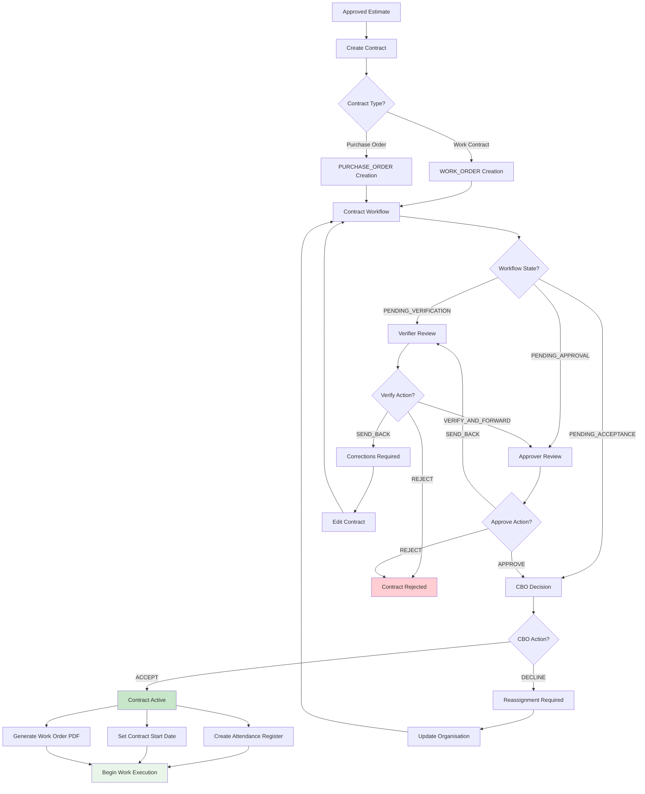
```mermaid
flowchart TD
    A[Approved Estimate] --> B[Create Contract]
    B --> C{Contract Type?}
    
    C -->|Work Contract| D[WORK_ORDER Creation]
    C -->|Purchase Order| E[PURCHASE_ORDER Creation]
    
    D --> F[Contract Workflow]
    E --> F
    
    F --> G{Workflow State?}
    G -->|PENDING_VERIFICATION| H[Verifier Review]
    G -->|PENDING_APPROVAL| I[Approver Review]
    G -->|PENDING_ACCEPTANCE| J[CBO Decision]
    
    H --> K{Verify Action?}
    K -->|VERIFY_AND_FORWARD| I
    K -->|SEND_BACK| L[Corrections Required]
    K -->|REJECT| M[Contract Rejected]
    
    I --> N{Approve Action?}
    N -->|APPROVE| J
    N -->|SEND_BACK| H
    N -->|REJECT| M
    
    J --> O{CBO Action?}
    O -->|ACCEPT| P[Contract Active]
    O -->|DECLINE| Q[Reassignment Required]
    
    P --> R[Create Attendance Register]
    P --> S[Set Contract Start Date]
    P --> T[Generate Work Order PDF]
    
    Q --> U[Update Organisation]
    U --> F
    
    L --> V[Edit Contract]
    V --> F
    
    R --> W[Begin Work Execution]
    S --> W
    T --> W

    style P fill:#c8e6c9
    style M fill:#ffcdd2
    style W fill:#e8f5e8
```

### Business Rules

1. **Sequential Approval**: Verification → Approval → Acceptance
2. **Role-Based Actions**: Each role has specific allowed actions
3. **Parallel Processing**: Register creation and PDF generation happen simultaneously
4. **Error Recovery**: Send back mechanisms allow corrections at each stage
5. **State Validation**: Actions validated against current workflow state

---

## Attendance to Payment Flow

Comprehensive flow showing daily attendance tracking through to final wage payments, including both synchronous and asynchronous processing.

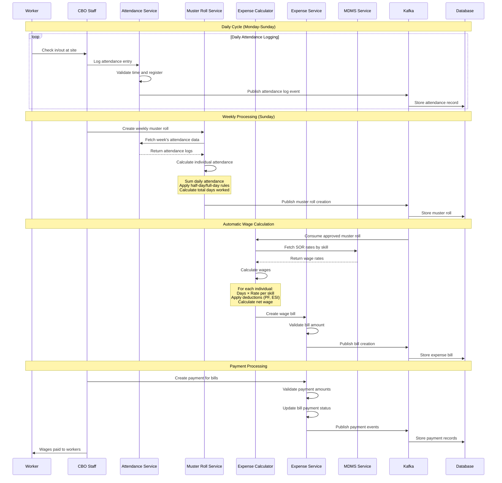
```mermaid
sequenceDiagram
    participant W as Worker
    participant CBO as CBO Staff
    participant AS as Attendance Service
    participant MS as Muster Roll Service
    participant EC as Expense Calculator
    participant ES as Expense Service
    participant MDMS as MDMS Service
    participant K as Kafka
    participant DB as Database

    Note over W,DB: Daily Cycle (Monday-Sunday)
    
    loop Daily Attendance Logging
        W->>CBO: Check in/out at site
        CBO->>AS: Log attendance entry
        AS->>AS: Validate time and register
        AS->>K: Publish attendance log event
        K->>DB: Store attendance record
    end

    Note over W,DB: Weekly Processing (Sunday)
    
    CBO->>MS: Create weekly muster roll
    MS->>AS: Fetch week's attendance data
    AS-->>MS: Return attendance logs
    
    MS->>MS: Calculate individual attendance
    Note over MS: Sum daily attendance<br/>Apply half-day/full-day rules<br/>Calculate total days worked
    
    MS->>K: Publish muster roll creation
    K->>DB: Store muster roll

    Note over W,DB: Automatic Wage Calculation
    
    K->>EC: Consume approved muster roll
    EC->>MDMS: Fetch SOR rates by skill
    MDMS-->>EC: Return wage rates
    
    EC->>EC: Calculate wages
    Note over EC: For each individual:<br/>Days × Rate per skill<br/>Apply deductions (PF, ESI)<br/>Calculate net wage
    
    EC->>ES: Create wage bill
    ES->>ES: Validate bill amount
    ES->>K: Publish bill creation
    K->>DB: Store expense bill

    Note over W,DB: Payment Processing
    
    CBO->>ES: Create payment for bills
    ES->>ES: Validate payment amounts
    ES->>ES: Update bill payment status
    ES->>K: Publish payment events
    K->>DB: Store payment records
    
    CBO->>W: Wages paid to workers
```

### Timing Considerations

1. **Real-time**: Attendance logging (immediate)
2. **Daily**: Attendance validation and aggregation
3. **Weekly**: Muster roll creation (every Sunday)
4. **Asynchronous**: Wage calculation and bill generation
5. **Batch**: Payment processing for multiple bills

---

## Bill Generation and Payment Process

Shows the three types of bills (wage, purchase, supervision) and their different generation patterns and approval workflows.

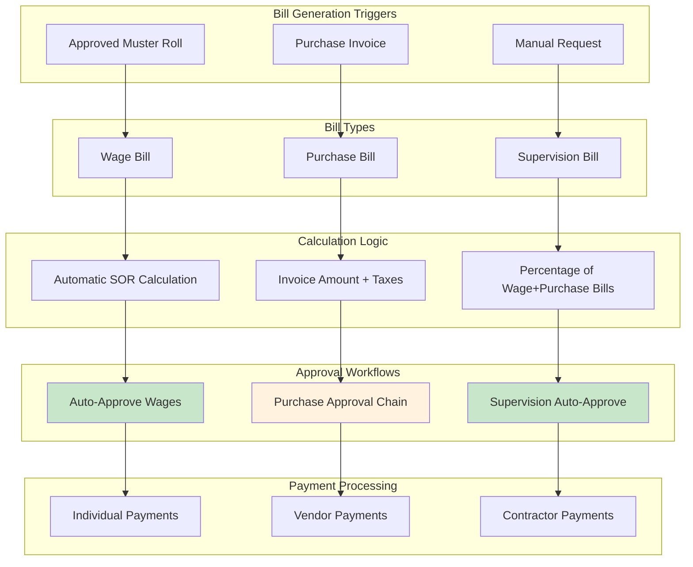
```mermaid
flowchart TD
    subgraph "Bill Generation Triggers"
        A1[Approved Muster Roll]
        A2[Purchase Invoice]
        A3[Manual Request]
    end
    
    subgraph "Bill Types"
        B1[Wage Bill]
        B2[Purchase Bill]
        B3[Supervision Bill]
    end
    
    subgraph "Calculation Logic"
        C1[Automatic SOR Calculation]
        C2[Invoice Amount + Taxes]
        C3[Percentage of Wage+Purchase Bills]
    end
    
    subgraph "Approval Workflows"
        D1[Auto-Approve Wages]
        D2[Purchase Approval Chain]
        D3[Supervision Auto-Approve]
    end
    
    subgraph "Payment Processing"
        E1[Individual Payments]
        E2[Vendor Payments]
        E3[Contractor Payments]
    end
    
    A1 --> B1
    A2 --> B2
    A3 --> B3
    
    B1 --> C1
    B2 --> C2
    B3 --> C3
    
    C1 --> D1
    C2 --> D2
    C3 --> D3
    
    D1 --> E1
    D2 --> E2
    D3 --> E3
    
    style D1 fill:#c8e6c9
    style D2 fill:#fff3e0
    style D3 fill:#c8e6c9
```

### Detailed Bill Processing Flow

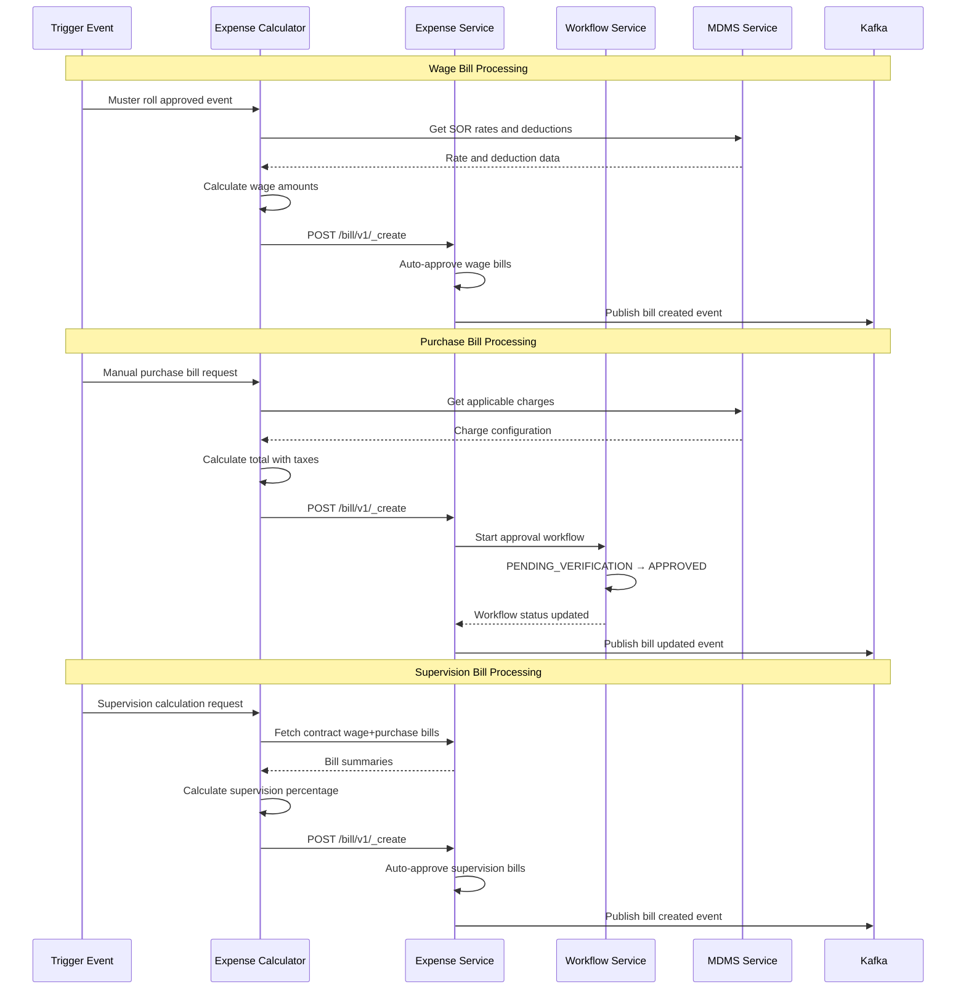
```mermaid
sequenceDiagram
    participant T as Trigger Event
    participant EC as Expense Calculator
    participant ES as Expense Service
    participant WF as Workflow Service
    participant MDMS as MDMS Service
    participant K as Kafka

    Note over T,K: Wage Bill Processing
    T->>EC: Muster roll approved event
    EC->>MDMS: Get SOR rates and deductions
    MDMS-->>EC: Rate and deduction data
    EC->>EC: Calculate wage amounts
    EC->>ES: POST /bill/v1/_create
    ES->>ES: Auto-approve wage bills
    ES->>K: Publish bill created event

    Note over T,K: Purchase Bill Processing  
    T->>EC: Manual purchase bill request
    EC->>MDMS: Get applicable charges
    MDMS-->>EC: Charge configuration
    EC->>EC: Calculate total with taxes
    EC->>ES: POST /bill/v1/_create
    ES->>WF: Start approval workflow
    WF->>WF: PENDING_VERIFICATION → APPROVED
    WF-->>ES: Workflow status updated
    ES->>K: Publish bill updated event

    Note over T,K: Supervision Bill Processing
    T->>EC: Supervision calculation request
    EC->>ES: Fetch contract wage+purchase bills
    ES-->>EC: Bill summaries
    EC->>EC: Calculate supervision percentage
    EC->>ES: POST /bill/v1/_create
    ES->>ES: Auto-approve supervision bills
    ES->>K: Publish bill created event
```

### Payment Flow

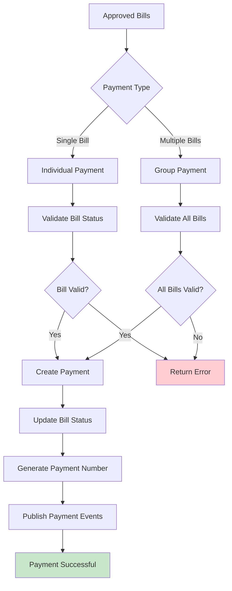
```mermaid
flowchart TD
    A[Approved Bills] --> B{Payment Type}
    
    B -->|Single Bill| C[Individual Payment]
    B -->|Multiple Bills| D[Group Payment]
    
    C --> E[Validate Bill Status]
    D --> F[Validate All Bills]
    
    E --> G{Bill Valid?}
    F --> H{All Bills Valid?}
    
    G -->|Yes| I[Create Payment]
    G -->|No| J[Return Error]
    
    H -->|Yes| I
    H -->|No| J
    
    I --> K[Update Bill Status]
    K --> L[Generate Payment Number]
    L --> M[Publish Payment Events]
    M --> N[Payment Successful]
    
    style N fill:#c8e6c9
    style J fill:#ffcdd2
```

---

## Document Generation Flows

Shows how PDF generation integrates with other services and the different document types and their data sources.

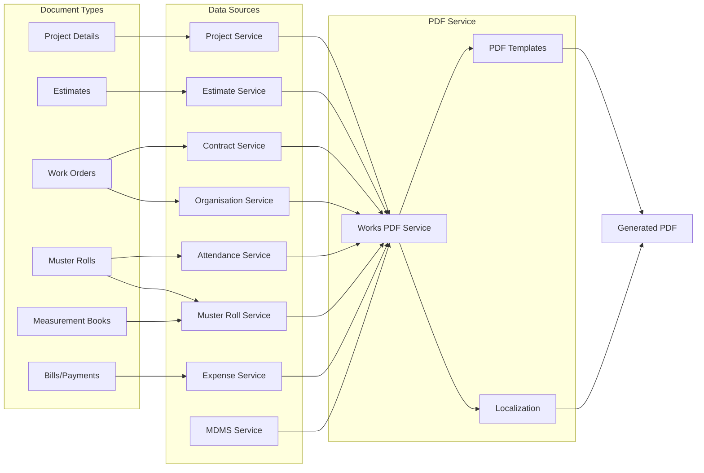
```mermaid
flowchart LR
    subgraph "Document Types"
        DOC1[Project Details]
        DOC2[Estimates]
        DOC3[Work Orders]
        DOC4[Muster Rolls]
        DOC5[Bills/Payments]
        DOC6[Measurement Books]
    end
    
    subgraph "Data Sources"
        PS[Project Service]
        EST[Estimate Service]
        CS[Contract Service]
        AS[Attendance Service]
        MS[Muster Roll Service]
        ES[Expense Service]
        OS[Organisation Service]
        MDMS[MDMS Service]
    end
    
    subgraph "PDF Service"
        PDFS[Works PDF Service]
        TEMPLATES[PDF Templates]
        LOCAL[Localization]
    end
    
    DOC1 --> PS
    DOC2 --> EST
    DOC3 --> CS
    DOC3 --> OS
    DOC4 --> MS
    DOC4 --> AS
    DOC5 --> ES
    DOC6 --> MS
    
    PS --> PDFS
    EST --> PDFS
    CS --> PDFS
    OS --> PDFS
    AS --> PDFS
    MS --> PDFS
    ES --> PDFS
    MDMS --> PDFS
    
    PDFS --> TEMPLATES
    PDFS --> LOCAL
    
    TEMPLATES --> PDF[Generated PDF]
    LOCAL --> PDF
```

### Document Generation Sequence

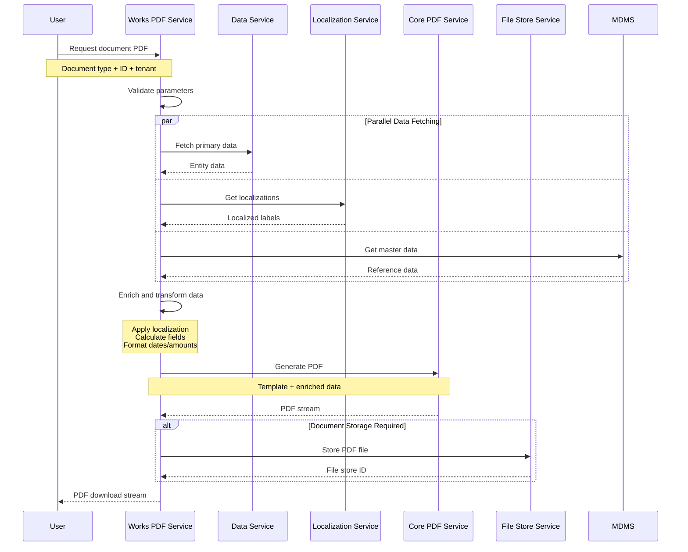
```mermaid
sequenceDiagram
    participant U as User
    participant PDFS as Works PDF Service
    participant DS as Data Service
    participant LS as Localization Service
    participant CORE as Core PDF Service
    participant FS as File Store Service

    U->>PDFS: Request document PDF
    Note over U,PDFS: Document type + ID + tenant
    
    PDFS->>PDFS: Validate parameters
    
    par Parallel Data Fetching
        PDFS->>DS: Fetch primary data
        DS-->>PDFS: Entity data
    and
        PDFS->>LS: Get localizations
        LS-->>PDFS: Localized labels
    and
        PDFS->>MDMS: Get master data
        MDMS-->>PDFS: Reference data
    end
    
    PDFS->>PDFS: Enrich and transform data
    Note over PDFS: Apply localization<br/>Calculate fields<br/>Format dates/amounts
    
    PDFS->>CORE: Generate PDF
    Note over PDFS,CORE: Template + enriched data
    CORE-->>PDFS: PDF stream
    
    alt Document Storage Required
        PDFS->>FS: Store PDF file
        FS-->>PDFS: File store ID
    end
    
    PDFS-->>U: PDF download stream
```

### Multi-language Support

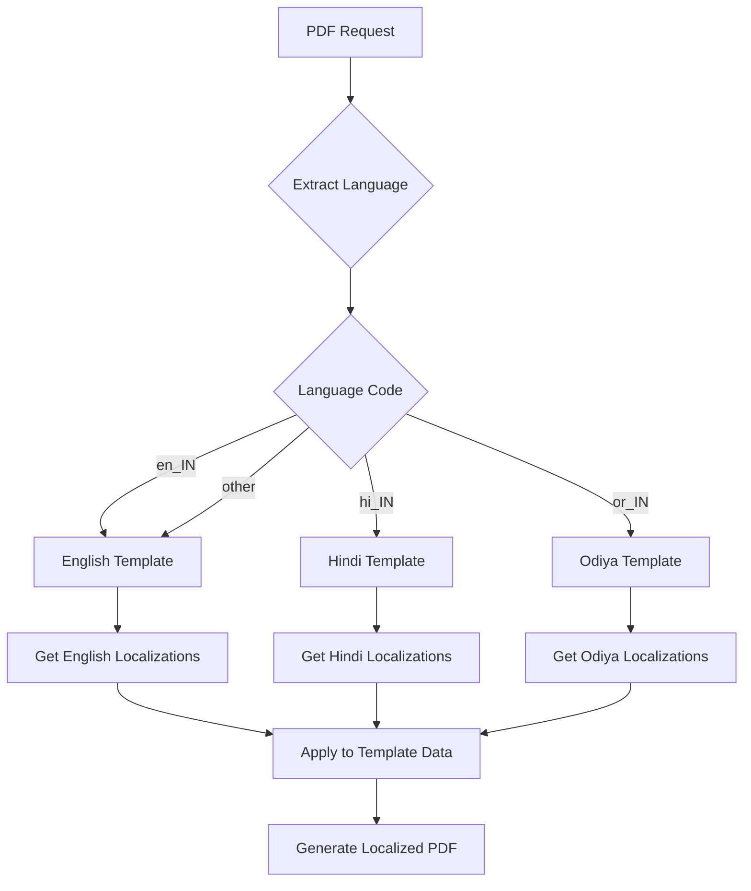
```mermaid
flowchart TD
    A[PDF Request] --> B{Extract Language}
    B --> C{Language Code}
    
    C -->|en_IN| D[English Template]
    C -->|hi_IN| E[Hindi Template]
    C -->|or_IN| F[Odiya Template]
    C -->|other| D
    
    D --> G[Get English Localizations]
    E --> H[Get Hindi Localizations]
    F --> I[Get Odiya Localizations]
    
    G --> J[Apply to Template Data]
    H --> J
    I --> J
    
    J --> K[Generate Localized PDF]
```

---

## Organisation Onboarding Flow

Shows contractor/CBO registration, verification, and contract assignment process.

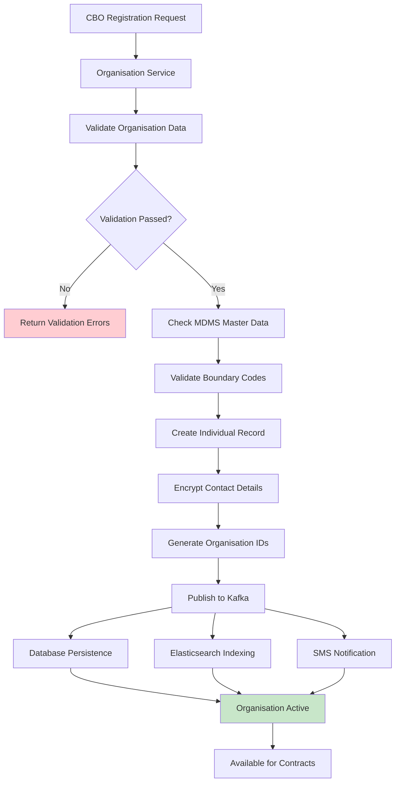
```mermaid
flowchart TD
    A[CBO Registration Request] --> B[Organisation Service]
    B --> C[Validate Organisation Data]
    C --> D{Validation Passed?}
    
    D -->|No| E[Return Validation Errors]
    D -->|Yes| F[Check MDMS Master Data]
    
    F --> G[Validate Boundary Codes]
    G --> H[Create Individual Record]
    H --> I[Encrypt Contact Details]
    I --> J[Generate Organisation IDs]
    J --> K[Publish to Kafka]
    
    K --> L[Database Persistence]
    K --> M[Elasticsearch Indexing]
    K --> N[SMS Notification]
    
    L --> O[Organisation Active]
    M --> O
    N --> O
    
    O --> P[Available for Contracts]
    
    style O fill:#c8e6c9
    style E fill:#ffcdd2
```

### Organisation Verification Process

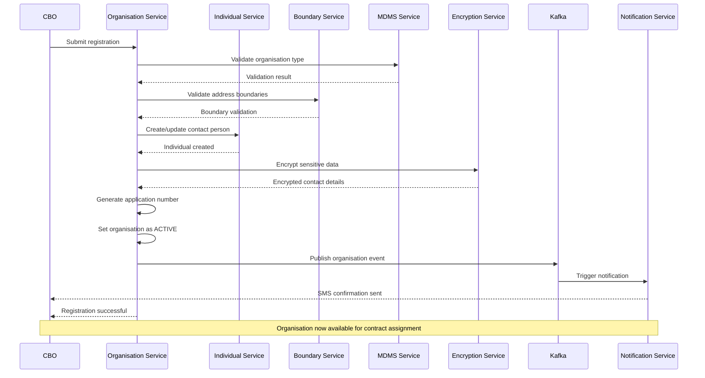
```mermaid
sequenceDiagram
    participant CBO as CBO
    participant OS as Organisation Service
    participant IS as Individual Service
    participant BS as Boundary Service
    participant MDMS as MDMS Service
    participant ES as Encryption Service
    participant K as Kafka
    participant NS as Notification Service

    CBO->>OS: Submit registration
    OS->>MDMS: Validate organisation type
    MDMS-->>OS: Validation result
    
    OS->>BS: Validate address boundaries
    BS-->>OS: Boundary validation
    
    OS->>IS: Create/update contact person
    IS-->>OS: Individual created
    
    OS->>ES: Encrypt sensitive data
    ES-->>OS: Encrypted contact details
    
    OS->>OS: Generate application number
    OS->>OS: Set organisation as ACTIVE
    
    OS->>K: Publish organisation event
    K->>NS: Trigger notification
    NS-->>CBO: SMS confirmation sent
    
    OS-->>CBO: Registration successful
    
    Note over CBO,NS: Organisation now available for contract assignment
```

### Contract Assignment Flow

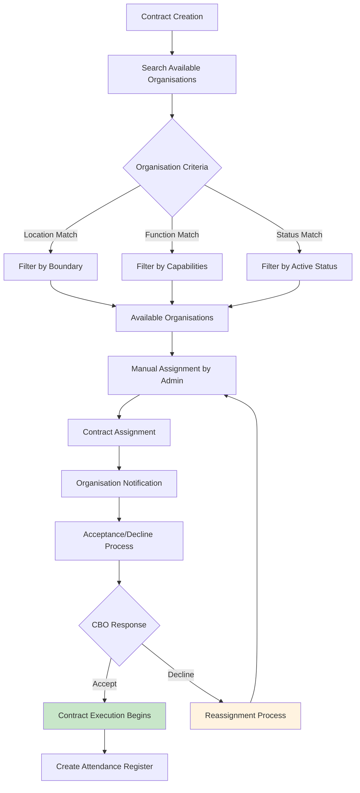
```mermaid
flowchart TD
    A[Contract Creation] --> B[Search Available Organisations]
    B --> C{Organisation Criteria}
    
    C -->|Location Match| D[Filter by Boundary]
    C -->|Function Match| E[Filter by Capabilities]
    C -->|Status Match| F[Filter by Active Status]
    
    D --> G[Available Organisations]
    E --> G
    F --> G
    
    G --> H[Manual Assignment by Admin]
    H --> I[Contract Assignment]
    I --> J[Organisation Notification]
    J --> K[Acceptance/Decline Process]
    
    K --> L{CBO Response}
    L -->|Accept| M[Contract Execution Begins]
    L -->|Decline| N[Reassignment Process]
    
    M --> O[Create Attendance Register]
    N --> H
    
    style M fill:#c8e6c9
    style N fill:#fff3e0
```

---

## Error Handling and Recovery Flows

Shows how services handle failures, retry mechanisms, and fallback strategies.

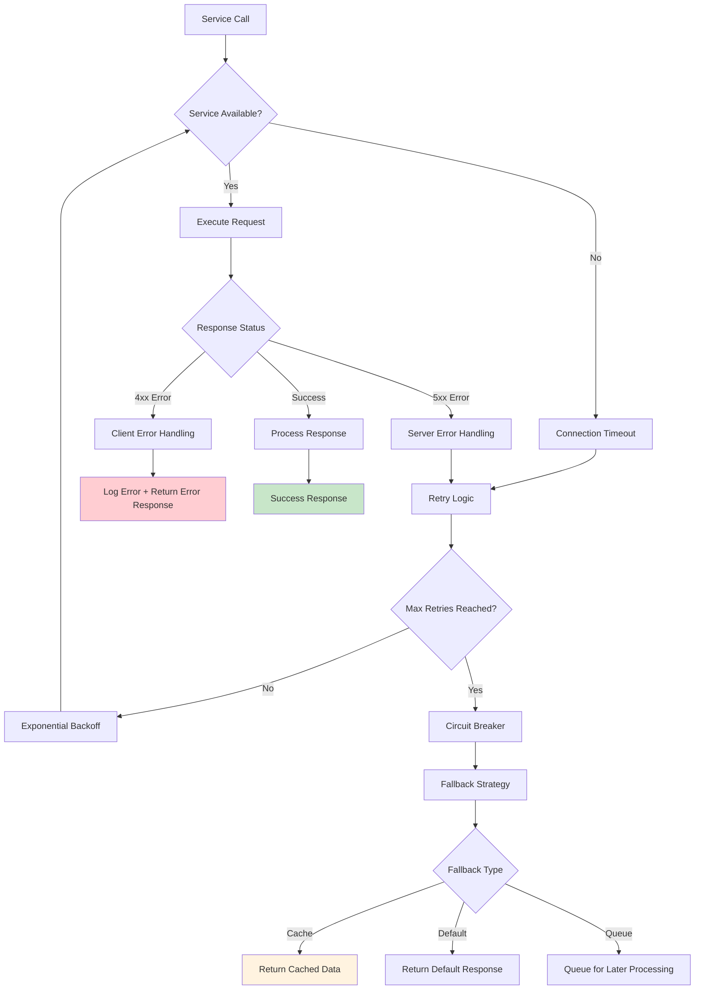
```mermaid
flowchart TD
    A[Service Call] --> B{Service Available?}
    
    B -->|No| C[Connection Timeout]
    B -->|Yes| D[Execute Request]
    
    C --> E[Retry Logic]
    E --> F{Max Retries Reached?}
    F -->|No| G[Exponential Backoff]
    F -->|Yes| H[Circuit Breaker]
    
    G --> B
    H --> I[Fallback Strategy]
    
    D --> J{Response Status}
    J -->|Success| K[Process Response]
    J -->|4xx Error| L[Client Error Handling]
    J -->|5xx Error| M[Server Error Handling]
    
    L --> N[Log Error + Return Error Response]
    M --> E
    
    I --> O{Fallback Type}
    O -->|Cache| P[Return Cached Data]
    O -->|Default| Q[Return Default Response]
    O -->|Queue| R[Queue for Later Processing]
    
    K --> S[Success Response]
    
    style S fill:#c8e6c9
    style N fill:#ffcdd2
    style P fill:#fff3e0
```

### Kafka Event Processing Error Handling

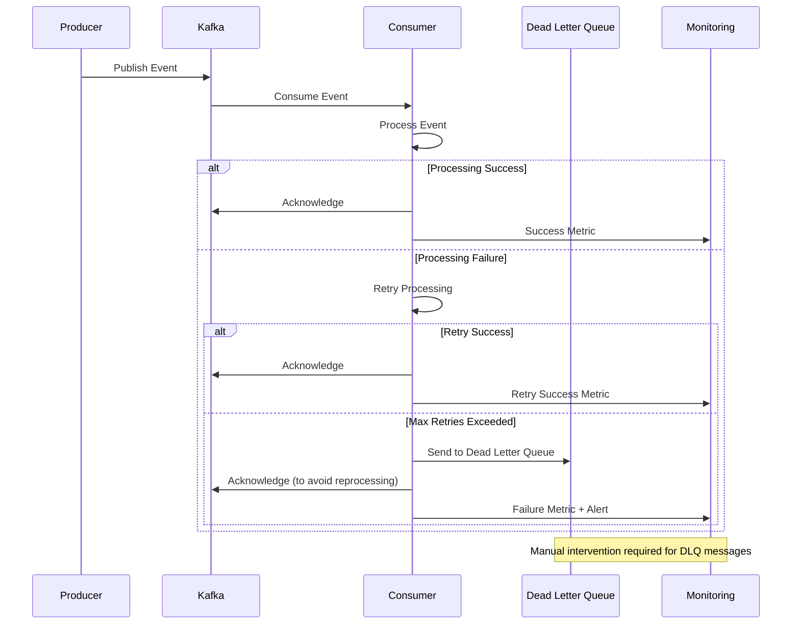
```mermaid
sequenceDiagram
    participant P as Producer
    participant K as Kafka
    participant C as Consumer
    participant DLQ as Dead Letter Queue
    participant M as Monitoring

    P->>K: Publish Event
    K->>C: Consume Event
    
    C->>C: Process Event
    
    alt Processing Success
        C->>K: Acknowledge
        C->>M: Success Metric
    else Processing Failure
        C->>C: Retry Processing
        
        alt Retry Success
            C->>K: Acknowledge  
            C->>M: Retry Success Metric
        else Max Retries Exceeded
            C->>DLQ: Send to Dead Letter Queue
            C->>K: Acknowledge (to avoid reprocessing)
            C->>M: Failure Metric + Alert
        end
    end
    
    Note over DLQ,M: Manual intervention required for DLQ messages
```

### Service Dependency Failure Recovery

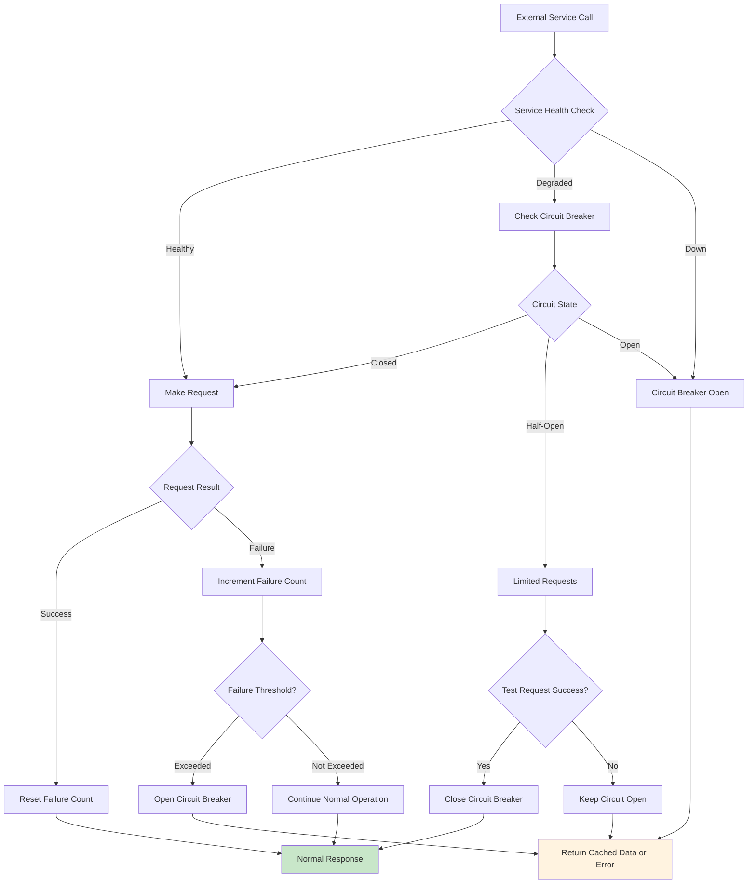
```mermaid
flowchart TD
    A[External Service Call] --> B{Service Health Check}
    
    B -->|Healthy| C[Make Request]
    B -->|Degraded| D[Check Circuit Breaker]
    B -->|Down| E[Circuit Breaker Open]
    
    D --> F{Circuit State}
    F -->|Closed| C
    F -->|Half-Open| G[Limited Requests]
    F -->|Open| E
    
    C --> H{Request Result}
    H -->|Success| I[Reset Failure Count]
    H -->|Failure| J[Increment Failure Count]
    
    J --> K{Failure Threshold?}
    K -->|Exceeded| L[Open Circuit Breaker]
    K -->|Not Exceeded| M[Continue Normal Operation]
    
    E --> N[Return Cached Data or Error]
    G --> O{Test Request Success?}
    O -->|Yes| P[Close Circuit Breaker]
    O -->|No| Q[Keep Circuit Open]
    
    I --> R[Normal Response]
    L --> N
    M --> R
    P --> R
    Q --> N
    
    style R fill:#c8e6c9
    style N fill:#fff3e0
```

---

## Event-Driven Architecture Flow

Shows Kafka topics and event flows between services, including asynchronous processing patterns.

### Topic Overview

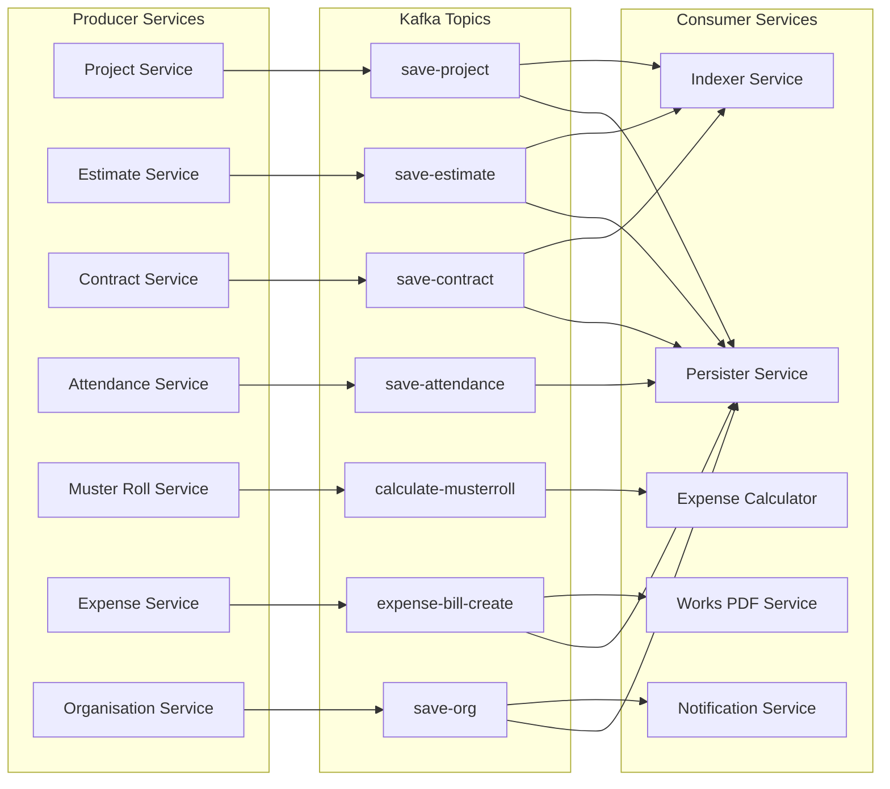
```mermaid
flowchart LR
    subgraph "Producer Services"
        P1[Project Service]
        P2[Estimate Service] 
        P3[Contract Service]
        P4[Attendance Service]
        P5[Muster Roll Service]
        P6[Expense Service]
        P7[Organisation Service]
    end
    
    subgraph "Kafka Topics"
        T1[save-project]
        T2[save-estimate]
        T3[save-contract]
        T4[save-attendance]
        T5[calculate-musterroll]
        T6[expense-bill-create]
        T7[save-org]
    end
    
    subgraph "Consumer Services"
        C1[Persister Service]
        C2[Indexer Service]
        C3[Expense Calculator]
        C4[Notification Service]
        C5[Works PDF Service]
    end
    
    P1 --> T1
    P2 --> T2
    P3 --> T3
    P4 --> T4
    P5 --> T5
    P6 --> T6
    P7 --> T7
    
    T1 --> C1
    T1 --> C2
    T2 --> C1
    T2 --> C2
    T3 --> C1
    T3 --> C2
    T4 --> C1
    T5 --> C3
    T6 --> C1
    T6 --> C5
    T7 --> C1
    T7 --> C4
```

### End-to-End Event Flow

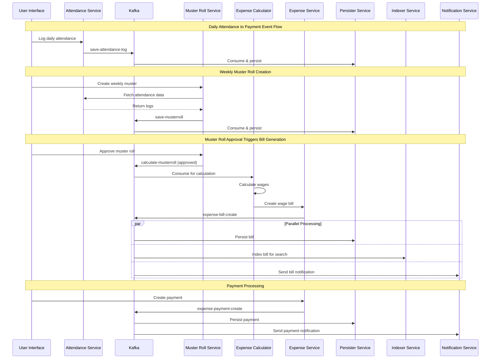
```mermaid
sequenceDiagram
    participant UI as User Interface
    participant AS as Attendance Service
    participant K as Kafka
    participant MS as Muster Roll Service
    participant EC as Expense Calculator
    participant ES as Expense Service
    participant PS as Persister Service
    participant IS as Indexer Service
    participant NS as Notification Service

    Note over UI,NS: Daily Attendance to Payment Event Flow
    
    UI->>AS: Log daily attendance
    AS->>K: save-attendance-log
    K->>PS: Consume & persist
    
    Note over UI,NS: Weekly Muster Roll Creation
    
    UI->>MS: Create weekly muster
    MS->>AS: Fetch attendance data
    AS-->>MS: Return logs
    MS->>K: save-musterroll
    K->>PS: Consume & persist
    
    Note over UI,NS: Muster Roll Approval Triggers Bill Generation
    
    UI->>MS: Approve muster roll
    MS->>K: calculate-musterroll (approved)
    K->>EC: Consume for calculation
    
    EC->>EC: Calculate wages
    EC->>ES: Create wage bill
    ES->>K: expense-bill-create
    
    par Parallel Processing
        K->>PS: Persist bill
    and
        K->>IS: Index bill for search
    and
        K->>NS: Send bill notification
    end
    
    Note over UI,NS: Payment Processing
    
    UI->>ES: Create payment
    ES->>K: expense-payment-create
    K->>PS: Persist payment
    K->>NS: Send payment notification
```

### Asynchronous Processing Patterns

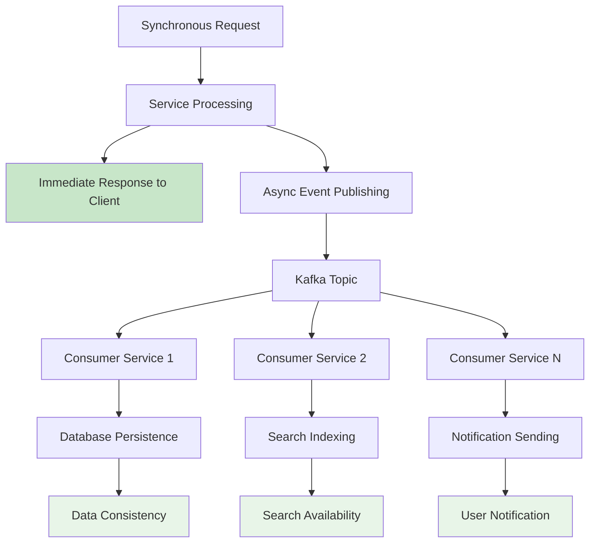
```mermaid
flowchart TD
    A[Synchronous Request] --> B[Service Processing]
    B --> C[Immediate Response to Client]
    B --> D[Async Event Publishing]
    
    D --> E[Kafka Topic]
    E --> F[Consumer Service 1]
    E --> G[Consumer Service 2]
    E --> H[Consumer Service N]
    
    F --> I[Database Persistence]
    G --> J[Search Indexing]
    H --> K[Notification Sending]
    
    I --> L[Data Consistency]
    J --> M[Search Availability]
    K --> N[User Notification]
    
    style C fill:#c8e6c9
    style L fill:#e8f5e8
    style M fill:#e8f5e8
    style N fill:#e8f5e8
```

### Event Ordering and Consistency

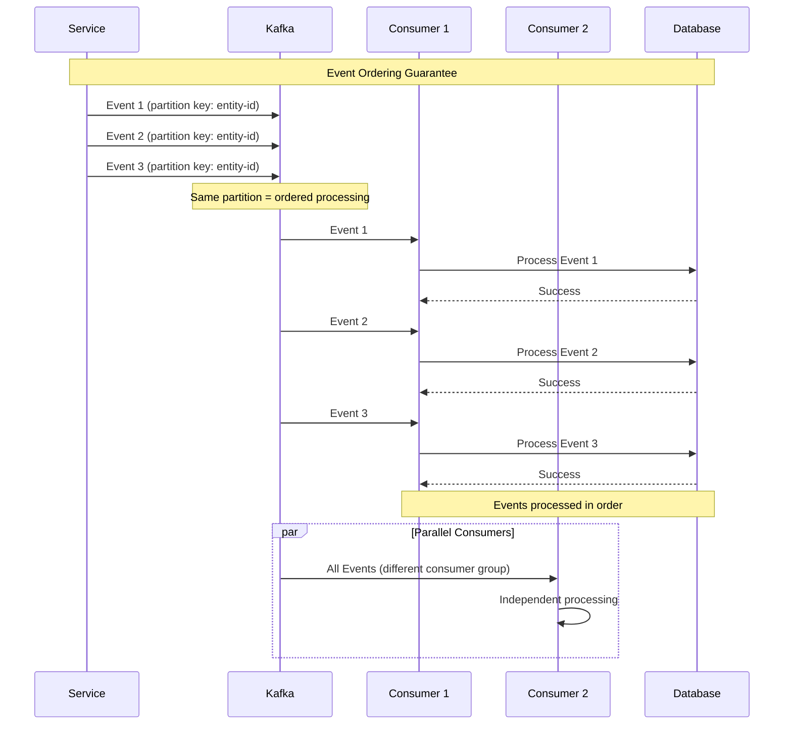
```mermaid
sequenceDiagram
    participant S as Service
    participant K as Kafka
    participant C1 as Consumer 1
    participant C2 as Consumer 2
    participant DB as Database

    Note over S,DB: Event Ordering Guarantee
    
    S->>K: Event 1 (partition key: entity-id)
    S->>K: Event 2 (partition key: entity-id)
    S->>K: Event 3 (partition key: entity-id)
    
    Note over K: Same partition = ordered processing
    
    K->>C1: Event 1
    C1->>DB: Process Event 1
    DB-->>C1: Success
    
    K->>C1: Event 2  
    C1->>DB: Process Event 2
    DB-->>C1: Success
    
    K->>C1: Event 3
    C1->>DB: Process Event 3
    DB-->>C1: Success
    
    Note over C1,DB: Events processed in order
    
    par Parallel Consumers
        K->>C2: All Events (different consumer group)
        C2->>C2: Independent processing
    end
```

### Business Event Correlation

```mermaid
flowchart TD
    A[Contract Acceptance] --> B[Multiple Related Events]
    
    B --> C[create-attendance-register]
    B --> D[update-contract-status]
    B --> E[send-notification]
    B --> F[generate-work-order]
    
    C --> G[Attendance Service]
    D --> H[Contract Service]
    E --> I[Notification Service]
    F --> J[PDF Service]
    
    G --> K[Register Created]
    H --> L[Contract Updated]
    I --> M[CBO Notified]
    J --> N[Work Order Generated]
    
    K --> O[Work Execution Ready]
    L --> O
    M --> O
    N --> O
    
    style O fill:#c8e6c9
```

---

## Summary

This comprehensive business flow documentation demonstrates how DIGIT Works services interact to deliver end-to-end public works management capabilities. Key architectural patterns include:

### Integration Patterns
- **Service-to-Service**: Direct REST API calls for real-time data
- **Event-Driven**: Kafka-based async processing for scalability
- **Workflow-Driven**: State-based approval processes
- **Document-Driven**: PDF generation with data aggregation

### Data Flow Characteristics
- **Real-time**: Attendance logging, validation responses
- **Near-real-time**: Bill generation, payment processing  
- **Batch**: Weekly muster roll processing, bulk operations
- **Async**: Document generation, notifications, indexing

### Error Recovery Mechanisms
- **Retry Logic**: Exponential backoff for transient failures
- **Circuit Breakers**: Prevent cascade failures
- **Dead Letter Queues**: Handle persistent processing failures
- **Fallback Strategies**: Graceful degradation of functionality

### Scalability Features
- **Horizontal Scaling**: Stateless service design
- **Event Partitioning**: Ordered processing per entity
- **Caching**: Redis for performance optimization
- **Async Processing**: Non-blocking operations via Kafka

This documentation serves as a comprehensive reference for developers, architects, and stakeholders to understand the complex interactions and dependencies within the DIGIT Works platform.