# Contract Service - Technical Documentation

## Table of Contents
1. [System & Architecture Overview](#system--architecture-overview)
2. [API Documentation](#api-documentation)
3. [Domain Models & Data Structures](#domain-models--data-structures)
4. [Database Design](#database-design)
5. [Configuration & Application Properties](#configuration--application-properties)
6. [Service Dependencies](#service-dependencies)
7. [Events & Messaging](#events--messaging)
8. [Execution & Business Flows](#execution--business-flows)
9. [Security Considerations](#security-considerations)
10. [API Flow Diagrams](#api-flow-diagrams)

---

## System & Architecture Overview

### Service Purpose
The Contract Service manages work orders, contract approvals, time extensions, and contract revisions within the DIGIT Works platform. It serves as a critical component bridging estimates with actual work execution through comprehensive contract lifecycle management.

### Key Features
- **Contract Creation & Management**: Create contracts from approved estimates
- **Multi-level Approval Workflow**: Support for Creator → Verifier → Approver → Organisation flow
- **Time Extension Requests**: Handle contract duration extensions with approvals
- **Contract Revisions**: Support estimate updates and contract modifications
- **SMS Notifications**: Real-time notifications for status changes
- **Integration Hub**: Seamless integration with estimates, organizations, and workflow services
- **Business Service Support**: Handle different business services (CONTRACT, CONTRACT-REVISION, CONTRACT-REVISION-ESTIMATE)

### System Architecture

```mermaid
graph TB
    subgraph "External Systems"
        EST[Estimate Service]
        WF[Workflow Service]
        ORG[Organization Service]
        PROJ[Project Service]
        NOTIF[Notification Service]
        MDMS[MDMS Service]
        HRMS[HRMS Service]
        LOC[Location Service]
    end
    
    subgraph "Contract Service"
        API[Contract API Controller]
        SVC[Contract Service]
        WFS[Workflow Service]
        NS[Notification Service]
        ENR[Contract Enrichment]
        VAL[Contract Validator]
        
        subgraph "Data Layer"
            REPO[Contract Repository]
            LINEITEM[LineItems Repository]
            AMOUNT[AmountBreakup Repository]
            DOC[Document Repository]
        end
        
        subgraph "Infrastructure"
            KAFKA[Kafka Producer/Consumer]
            REDIS[Redis Cache]
            DB[(PostgreSQL Database)]
        end
    end
    
    API --> SVC
    SVC --> ENR
    SVC --> VAL
    SVC --> WFS
    SVC --> NS
    SVC --> REPO
    SVC --> LINEITEM
    SVC --> AMOUNT
    SVC --> DOC
    SVC --> KAFKA
    SVC --> REDIS
    
    REPO --> DB
    LINEITEM --> DB
    AMOUNT --> DB
    DOC --> DB
    
    SVC --> EST
    WFS --> WF
    NS --> NOTIF
    SVC --> ORG
    SVC --> PROJ
    SVC --> MDMS
    SVC --> HRMS
    SVC --> LOC
```

### Component Responsibilities

| Component | Responsibility |
|-----------|----------------|
| ContractApiController | REST API endpoints for contract operations |
| ContractService | Core business logic and orchestration |
| WorkflowService | Integration with workflow engine |
| NotificationService | SMS and notification management |
| ContractEnrichment | Data enrichment and ID generation |
| ContractServiceValidator | Request validation and business rules |
| ContractRepository | Database operations for contracts |
| ContractProducer/Consumer | Kafka message handling |

---

## API Documentation

### Base Configuration
- **Context Path**: `/contract`
- **Port**: 8024
- **API Version**: v1

### Endpoints

#### 1. Create Contract
**POST** `/contract/v1/_create`

Creates a new contract from an approved estimate.

**Request Body:**
```json
{
  "requestInfo": {
    "apiId": "contract-service",
    "ver": "1.0",
    "ts": 1675234567890,
    "action": "_create",
    "did": "",
    "key": "",
    "msgId": "20230201-123456",
    "authToken": "auth-token",
    "userInfo": {
      "id": 12345,
      "userName": "contractor1",
      "roles": [{"code": "CONTRACTOR", "name": "Contractor"}]
    }
  },
  "contract": {
    "tenantId": "pb.amritsar",
    "executingAuthority": "CONTRACTOR",
    "contractType": "WORK_ORDER",
    "totalContractedAmount": 100000,
    "securityDeposit": 5000,
    "agreementDate": 1675234567890,
    "defectLiabilityPeriod": 1706770567890,
    "orgId": "org-123",
    "startDate": 1675234567890,
    "endDate": 1677826567890,
    "completionPeriod": 30,
    "lineItems": [
      {
        "estimateId": "est-123",
        "estimateLineItemId": "lineitem-123",
        "tenantId": "pb.amritsar",
        "unitRate": 500,
        "noOfunit": 200,
        "status": "ACTIVE"
      }
    ],
    "documents": [
      {
        "documentType": "CONTRACT_DOC",
        "fileStoreId": "file-123",
        "status": "ACTIVE"
      }
    ],
    "businessService": "CONTRACT"
  },
  "workflow": {
    "action": "SUBMIT",
    "comment": "Contract created for project",
    "assignees": ["user-uuid-123"]
  }
}
```

**Response:**
```json
{
  "responseInfo": {
    "apiId": "contract-service",
    "ver": "1.0",
    "ts": 1675234567890,
    "resMsgId": "response-123",
    "msgId": "20230201-123456",
    "status": "successful"
  },
  "contracts": [
    {
      "id": "contract-uuid-123",
      "contractNumber": "CT/2023/001",
      "tenantId": "pb.amritsar",
      "wfStatus": "SUBMITTED",
      "status": "ACTIVE",
      "executingAuthority": "CONTRACTOR",
      "contractType": "WORK_ORDER",
      "totalContractedAmount": 100000,
      "securityDeposit": 5000,
      "agreementDate": 1675234567890,
      "orgId": "org-123",
      "startDate": 1675234567890,
      "endDate": 1677826567890,
      "completionPeriod": 30,
      "businessService": "CONTRACT",
      "auditDetails": {
        "createdBy": "user-123",
        "createdTime": 1675234567890,
        "lastModifiedBy": "user-123",
        "lastModifiedTime": 1675234567890
      }
    }
  ]
}
```

#### 2. Update Contract
**POST** `/contract/v1/_update`

Updates an existing contract with workflow actions.

**Request Body:**
```json
{
  "requestInfo": {
    "apiId": "contract-service",
    "ver": "1.0",
    "ts": 1675234567890,
    "action": "_update",
    "userInfo": {
      "id": 12345,
      "userName": "verifier1",
      "roles": [{"code": "VERIFIER", "name": "Verifier"}]
    }
  },
  "contract": {
    "id": "contract-uuid-123",
    "tenantId": "pb.amritsar",
    "contractNumber": "CT/2023/001",
    "businessService": "CONTRACT"
  },
  "workflow": {
    "action": "VERIFY",
    "comment": "Contract verified and approved",
    "assignees": ["approver-uuid-456"]
  }
}
```

#### 3. Search Contracts
**POST** `/contract/v1/_search`

Searches contracts based on various criteria.

**Request Body:**
```json
{
  "requestInfo": {
    "apiId": "contract-service",
    "ver": "1.0",
    "ts": 1675234567890
  },
  "tenantId": "pb.amritsar",
  "ids": ["contract-uuid-123"],
  "contractNumber": "CT/2023/001",
  "estimateIds": ["est-123"],
  "businessService": "CONTRACT",
  "wfStatus": "APPROVED",
  "status": "ACTIVE",
  "pagination": {
    "limit": 10,
    "offSet": 0,
    "sortBy": "createdTime",
    "order": "desc"
  }
}
```

---

## Domain Models & Data Structures

### Core Models

#### Contract Model
```java
public class Contract {
    private String id;                          // UUID - Auto-generated
    private String contractNumber;              // Auto-generated from IDGEN
    private String supplementNumber;            // For revisions/extensions
    private Long versionNumber;                 // Contract version
    private String oldUuid;                     // Previous contract reference
    private String businessService;             // CONTRACT | CONTRACT-REVISION | CONTRACT-REVISION-ESTIMATE
    private String tenantId;                    // Tenant identifier
    private String wfStatus;                    // Workflow status
    private String executingAuthority;          // DEPARTMENT | CONTRACTOR
    private String contractType;                // WORK_ORDER | PURCHASE_ORDER
    private BigDecimal totalContractedAmount;   // Contract amount
    private BigDecimal securityDeposit;         // Security deposit amount
    private BigDecimal agreementDate;           // Agreement timestamp
    private BigDecimal issueDate;               // Issue timestamp
    private BigDecimal defectLiabilityPeriod;   // Liability period timestamp
    private String orgId;                       // Organization ID
    private BigDecimal startDate;               // Work start timestamp
    private BigDecimal endDate;                 // Work end timestamp
    private Integer completionPeriod;           // Completion period in days
    private Status status;                      // ACTIVE | INACTIVE
    private List<LineItems> lineItems;          // Contract line items
    private List<Document> documents;           // Attached documents
    private ProcessInstance processInstance;    // Workflow instance
    private AuditDetails auditDetails;          // Audit information
    private Object additionalDetails;           // Additional data
}
```

#### LineItems Model
```java
public class LineItems {
    private String id;                          // UUID
    private String estimateId;                  // Reference to estimate
    private String estimateLineItemId;          // Reference to estimate line item
    private String contractId;                  // Reference to contract
    private String tenantId;                    // Tenant identifier
    private BigDecimal unitRate;                // Unit rate override
    private BigDecimal noOfunit;                // Number of units
    private Status status;                      // ACTIVE | INACTIVE
    private List<AmountBreakup> amountBreakups; // Amount breakdowns
    private AuditDetails auditDetails;          // Audit information
    private Object additionalDetails;           // Additional data
}
```

#### AmountBreakup Model
```java
public class AmountBreakup {
    private String id;                          // UUID
    private String estimateAmountBreakupId;     // Reference to estimate breakup
    private String lineItemId;                  // Reference to line item
    private BigDecimal amount;                  // Override amount
    private Status status;                      // ACTIVE | INACTIVE
    private AuditDetails auditDetails;          // Audit information
    private Object additionalDetails;           // Additional data
}
```

### Validation Rules

| Field | Validation Rules |
|-------|------------------|
| tenantId | Required, 2-64 characters |
| contractNumber | 1-64 characters, auto-generated |
| executingAuthority | Required, enum: DEPARTMENT/CONTRACTOR |
| contractType | enum: WORK_ORDER/PURCHASE_ORDER |
| totalContractedAmount | Positive number |
| agreementDate | Cannot be future date |
| lineItems.estimateId | Required, valid estimate reference |
| orgId | Valid organization reference |

---

## Database Design

### Entity Relationship Diagram
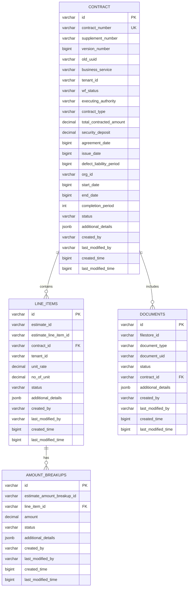

### Database Schema (DDL)

#### Main Contract Table
```sql
CREATE TABLE eg_wms_contract (
  id                            character varying(256),
  contract_number               character varying(64) NOT NULL,
  supplement_number             character varying(64),
  version_number                bigint,
  old_uuid                      character varying(256),
  business_service              character varying(64),
  tenant_id                     character varying(64) NOT NULL,
  wf_status                     character varying(64),
  executing_authority           character varying(64) NOT NULL,
  contract_type                 character varying(64),
  total_contracted_amount       decimal,
  security_deposit              decimal,
  agreement_date                bigint NOT NULL,
  issue_date                    bigint,
  defect_liability_period       bigint,
  org_id                        character varying(256) NOT NULL,
  start_date                    bigint,
  end_date                      bigint,
  completion_period             integer,
  status                        character varying(64) NOT NULL,
  additional_details            JSONB,
  created_by                    character varying(256) NOT NULL,
  last_modified_by              character varying(256),
  created_time                  bigint,
  last_modified_time            bigint,
  CONSTRAINT pk_eg_wms_contract PRIMARY KEY (id)
);
```

#### Line Items Table
```sql
CREATE TABLE eg_wms_contract_line_items (
  id                          character varying(256),
  estimate_id                 character varying(256) NOT NULL,
  estimate_line_item_id       character varying(256),
  contract_id                 character varying(256),
  tenant_id                   character varying(64) NOT NULL,
  unit_rate                   decimal,
  no_of_unit                  decimal,
  status                      character varying(64) NOT NULL,
  additional_details          JSONB,
  created_by                  character varying(256) NOT NULL,
  last_modified_by            character varying(256),
  created_time                bigint,
  last_modified_time          bigint,
  CONSTRAINT pk_eg_wms_contract_line_items PRIMARY KEY (id),
  CONSTRAINT fk_eg_wms_contract_line_items FOREIGN KEY (contract_id) REFERENCES eg_wms_contract (id)
);
```

### Performance Indexes
```sql
-- Contract table indexes
CREATE INDEX IF NOT EXISTS index_eg_wms_contract_tenantId ON eg_wms_contract (tenant_id);
CREATE INDEX IF NOT EXISTS index_eg_wms_contract_status ON eg_wms_contract (status);
CREATE INDEX IF NOT EXISTS index_eg_wms_contract_contractNumber ON eg_wms_contract (contract_number);
CREATE INDEX IF NOT EXISTS index_eg_wms_contract_orgId ON eg_wms_contract (org_id);
CREATE INDEX IF NOT EXISTS index_eg_wms_contract_businessService ON eg_wms_contract (business_service);
CREATE INDEX IF NOT EXISTS index_eg_wms_contract_wfStatus ON eg_wms_contract (wf_status);
CREATE INDEX IF NOT EXISTS index_eg_wms_contract_createdTime ON eg_wms_contract (created_time);

-- Line items table indexes
CREATE INDEX IF NOT EXISTS index_eg_wms_contract_line_items_estimateId ON eg_wms_contract_line_items (estimate_id);
CREATE INDEX IF NOT EXISTS index_eg_wms_contract_line_items_contractId ON eg_wms_contract_line_items (contract_id);
CREATE INDEX IF NOT EXISTS index_eg_wms_contract_line_items_tenantId ON eg_wms_contract_line_items (tenant_id);
```

---

## Configuration & Application Properties

### Core Configuration
```properties
# Server Configuration
server.contextPath=/contract
server.servlet.contextPath=/contract
server.port=8024
app.timezone=UTC

# Database Configuration
spring.datasource.driver-class-name=org.postgresql.Driver
spring.datasource.url=jdbc:postgresql://localhost:5432/digit-works
spring.datasource.username=postgres
spring.datasource.password=1234

# Flyway Configuration
spring.flyway.table=contract_schema
spring.flyway.baseline-on-migrate=true
spring.flyway.enabled=true
```

### Kafka Configuration
```properties
# Kafka Consumer/Producer Configuration
spring.kafka.consumer.group-id=egov-contract-service
spring.kafka.producer.key-serializer=org.apache.kafka.common.serialization.StringSerializer
spring.kafka.producer.value-serializer=org.springframework.kafka.support.serializer.JsonSerializer

# Kafka Topics
contract.kafka.create.topic=save-contract
contract.kafka.update.topic=update-contract
contracts.revision.topic=contracts-revision
estimate.kafka.update.topic=update-estimate
kafka.topics.notification.sms=egov.core.notification.sms
kafka.topics.works.notification.sms.name=works.notification.sms
```

### External Service URLs
```properties
# Workflow Service
egov.workflow.host=https://works-dev.digit.org
egov.workflow.transition.path=/egov-workflow-v2/egov-wf/process/_transition
egov.workflow.businessservice.search.path=/egov-workflow-v2/egov-wf/businessservice/_search
egov.workflow.processinstance.search.path=/egov-workflow-v2/egov-wf/process/_search

# Business Service Configuration
contract.workflow.business.service=CONTRACT
contract.workflow.time.extension.business.service=CONTRACT-REVISION
contract.workflow.revision.business.service=CONTRACT-REVISION-ESTIMATE
contract.workflow.module.name=contract-service

# Estimate Service
works.estimate.host=https://works-dev.digit.org
works.estimate.search.endpoint=/estimate/v1/_search

# Organization Service
egov.org.host=https://works-dev.digit.org
egov.org.search.endpoint=/org-services/organisation/v1/_search

# Project Service
works.project.host=https://works-dev.digit.org
works.project.search.endpoint=/project/v1/_search

# HRMS Service
egov.hrms.host=https://works-dev.digit.org/
egov.hrms.search.endpoint=egov-hrms/employees/_search

# MDMS Service
egov.mdms.host=https://works-dev.digit.org
egov.mdms.search.endpoint=/egov-mdms-service/v1/_search

# ID Generation Service
egov.idgen.host=https://works-dev.digit.org
egov.idgen.path=/egov-idgen/id/_generate
egov.idgen.contract.number.name=contract.number
egov.idgen.supplement.number.name=contract.supplement.number
egov.idgen.contract.revision.number.name=contract.revision.number
```

### Business Configuration
```properties
# Search Configuration
contract.default.offset=0
contract.default.limit=10
contract.search.max.limit=100

# Contract Configuration
contract.duedate.period=7
contract.revision.max.limit=2
contract.revision.measurement.validation=true

# Caching Configuration
spring.data.redis.host=localhost
spring.data.redis.port=6379
spring.data.redis.timeout=3600
is.caching.enabled=true

# Notification Configuration
notification.sms.enabled=true
sms.isAdditonalFieldRequired=true

# Localization
egov.localization.host=https://works-dev.digit.org
egov.localization.context.path=/localization/messages/v1
egov.localization.search.endpoint=/_search
egov.localization.statelevel=true
```

---

## Service Dependencies

### Internal Dependencies
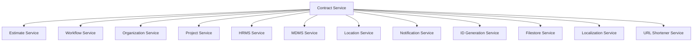

### Service Integration Details

| Service | Purpose | Key APIs Used |
|---------|---------|---------------|
| **Estimate Service** | Fetch estimate details for contract creation | `/estimate/v1/_search` |
| **Workflow Service** | Manage contract approval workflows | `/egov-wf/process/_transition`, `/egov-wf/businessservice/_search` |
| **Organization Service** | Validate contractor organizations | `/org-services/organisation/v1/_search` |
| **Project Service** | Get project details and metadata | `/project/v1/_search` |
| **HRMS Service** | Fetch employee details for notifications | `/egov-hrms/employees/_search` |
| **MDMS Service** | Master data for contract types, roles | `/egov-mdms-service/v1/_search` |
| **Location Service** | Boundary and location information | `/egov-location/location/v11/boundarys/_search` |
| **ID Generation Service** | Generate contract and supplement numbers | `/egov-idgen/id/_generate` |
| **Notification Service** | SMS notifications | `egov.core.notification.sms` (Kafka) |
| **Filestore Service** | Document storage and validation | `/filestore/v1/files/url` |

### Integration Patterns

#### Estimate Service Integration
```java
// Fetch estimates for contract creation
public List<Estimate> fetchActiveEstimates(RequestInfo requestInfo, String tenantId, Set<String> estimateIds) {
    EstimateSearchCriteria criteria = EstimateSearchCriteria.builder()
        .tenantId(tenantId)
        .ids(new ArrayList<>(estimateIds))
        .requestInfo(requestInfo)
        .build();
    
    EstimateResponse response = estimateServiceUtil.searchEstimate(criteria);
    return response.getEstimates().stream()
        .filter(estimate -> Status.ACTIVE.equals(estimate.getStatus()))
        .collect(Collectors.toList());
}
```

#### Workflow Integration
```java
// Update workflow status
public String updateWorkflowStatus(ContractRequest contractRequest) {
    ProcessInstance processInstance = getProcessInstanceForContract(contractRequest);
    ProcessInstanceRequest workflowRequest = new ProcessInstanceRequest(
        contractRequest.getRequestInfo(), 
        Collections.singletonList(processInstance)
    );
    
    ProcessInstance response = callWorkFlow(workflowRequest, contractRequest.getContract().getId());
    contract.setWfStatus(response.getState().getState());
    contract.setStatus(Status.fromValue(response.getState().getApplicationStatus()));
    
    return response.getState().getApplicationStatus();
}
```

---

## Events & Messaging

### Kafka Topics

#### Produced Topics
| Topic | Purpose | Message Type | Trigger |
|-------|---------|--------------|---------|
| `save-contract` | Contract creation events | ContractRequest | Contract create API |
| `update-contract` | Contract update events | ContractRequest | Contract update API |
| `contracts-revision` | Time extension events | ContractRequest | Time extension requests |
| `egov.core.notification.sms` | SMS notifications | SMSRequest | Workflow status changes |
| `works.notification.sms` | Works-specific SMS | WorksSmsRequest | Enhanced notifications |

#### Consumed Topics
| Topic | Purpose | Message Type | Handler |
|-------|---------|--------------|---------|
| `update-estimate` | Estimate updates | EstimateRequest | ContractConsumer.listen() |

### Event Schemas

#### Contract Creation Event
```json
{
  "requestInfo": {
    "apiId": "contract-service",
    "ver": "1.0",
    "ts": 1675234567890,
    "action": "_create",
    "userInfo": {...}
  },
  "contract": {
    "id": "contract-uuid-123",
    "contractNumber": "CT/2023/001",
    "tenantId": "pb.amritsar",
    "businessService": "CONTRACT",
    "status": "ACTIVE",
    "wfStatus": "SUBMITTED",
    "executingAuthority": "CONTRACTOR",
    "lineItems": [...],
    "documents": [...],
    "auditDetails": {...}
  },
  "workflow": {
    "action": "SUBMIT",
    "comment": "Contract created",
    "assignees": ["user-uuid"]
  }
}
```

#### SMS Notification Event
```json
{
  "mobileNumber": "9876543210",
  "message": "Contract CT/2023/001 has been approved for project P/2023/001",
  "additionalFields": {
    "templateCode": "CONTRACTS_APPROVE_CREATOR",
    "requestInfo": {...},
    "tenantId": "pb.amritsar"
  }
}
```

### Message Processing Flow
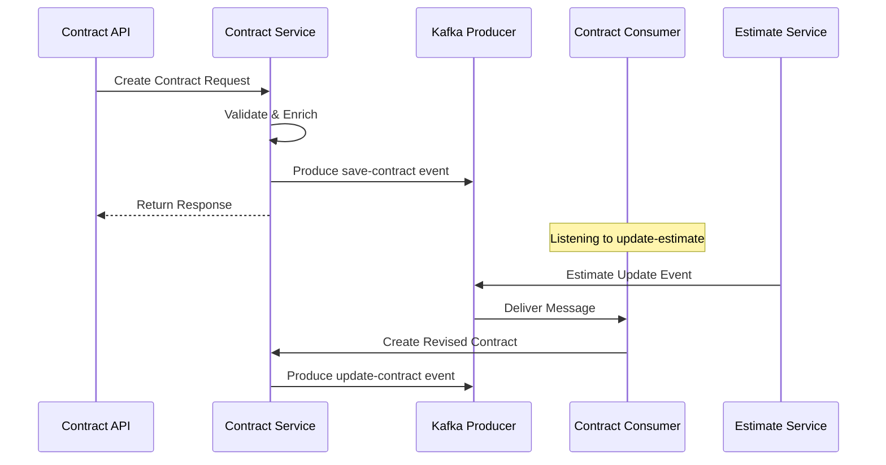

---

## Execution & Business Flows

### 1. Contract Creation Flow
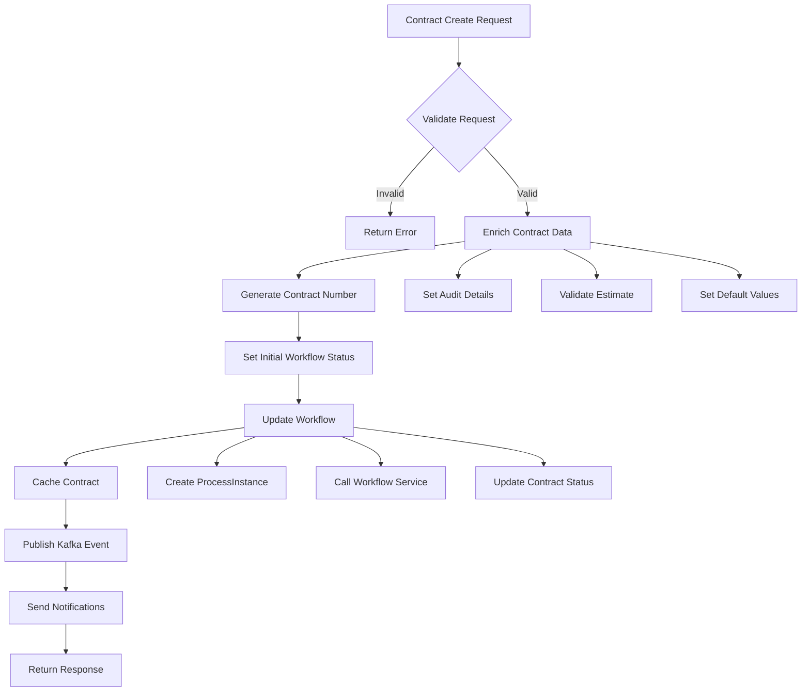

### 2. Contract Approval Workflow
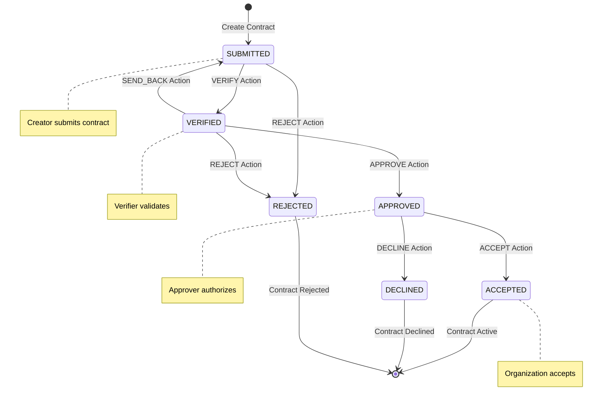

### 3. Time Extension Request Flow
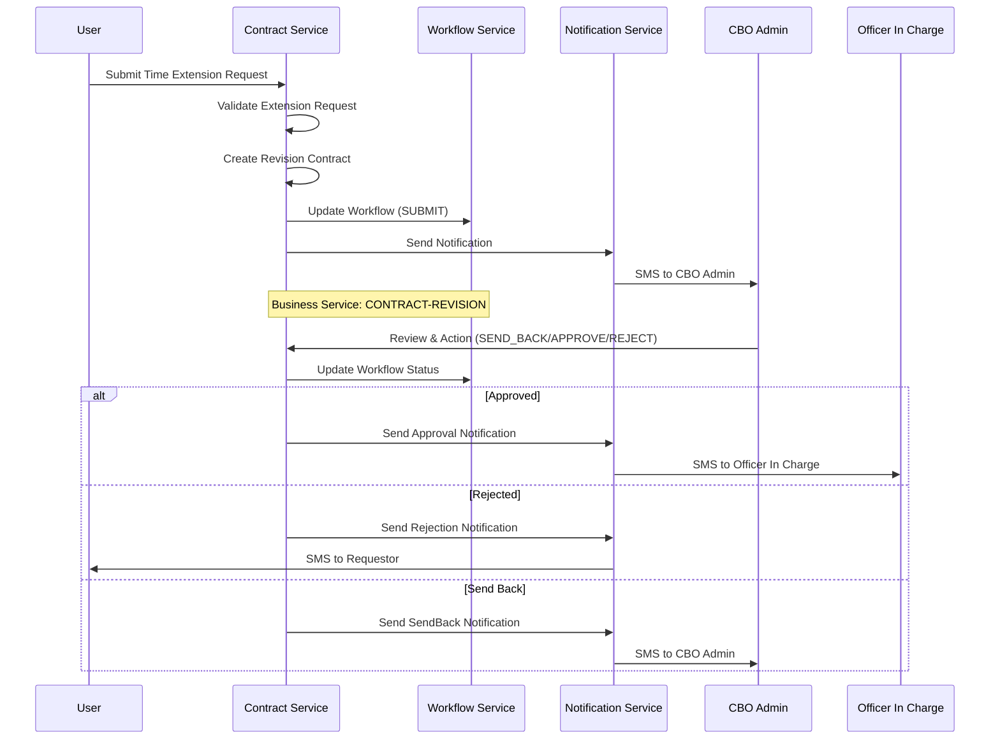

### 4. Contract Revision with Estimate Update Flow
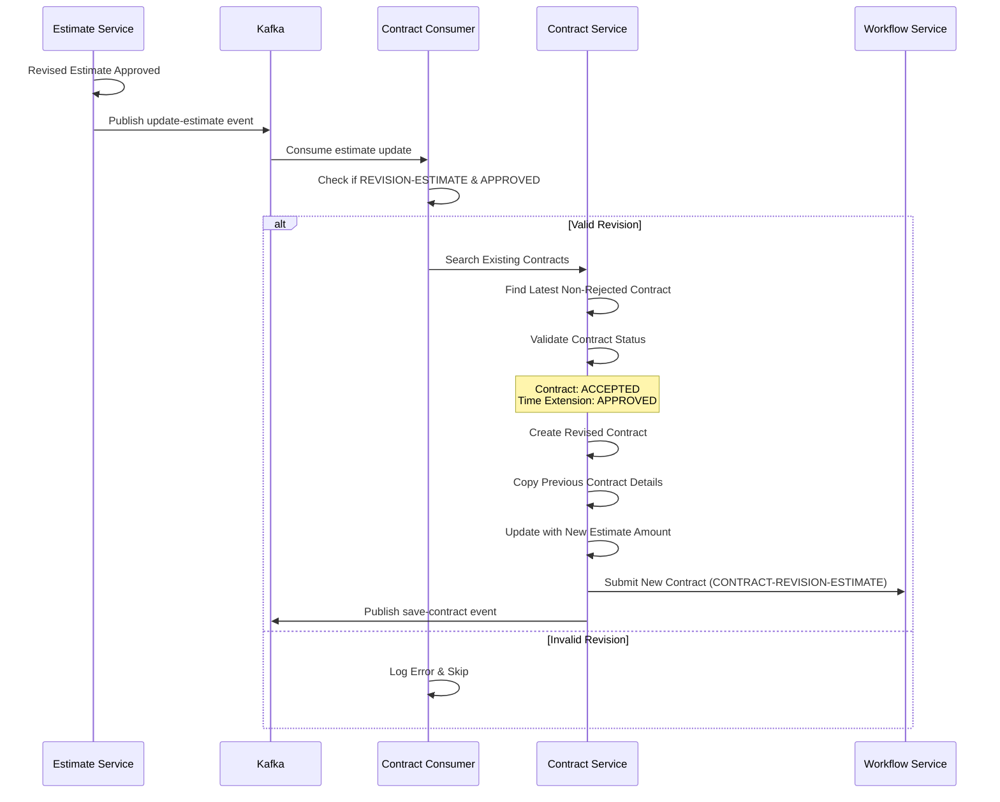

### 5. Business Service Flow Matrix

| Business Service | Workflow Status | Notification Recipients | Next Actions |
|------------------|-----------------|------------------------|--------------|
| **CONTRACT** | SUBMITTED → VERIFIED | Creator | APPROVE, REJECT, SEND_BACK |
| **CONTRACT** | VERIFIED → APPROVED | Creator, CBO Admin | ACCEPT, DECLINE |
| **CONTRACT** | APPROVED → ACCEPTED | Creator | Contract becomes active |
| **CONTRACT-REVISION** | SUBMITTED → APPROVED | CBO Admin | Time extension approved |
| **CONTRACT-REVISION** | SUBMITTED → REJECTED | Officer In Charge | Time extension rejected |
| **CONTRACT-REVISION-ESTIMATE** | Auto-SUBMITTED | Creator | Estimate revision contract |

### 6. Notification Flow
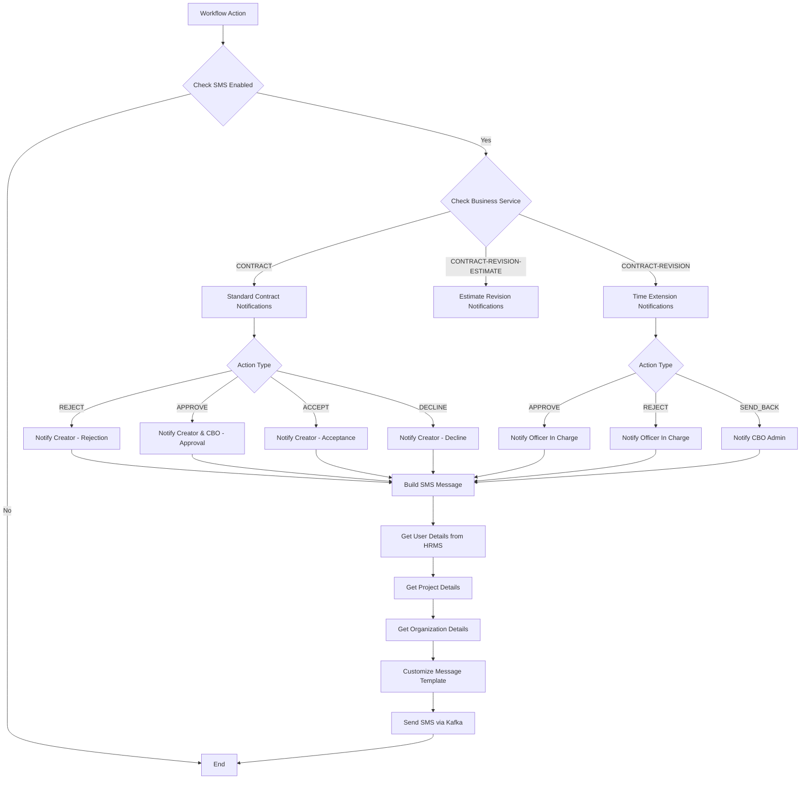

---

## Security Considerations

### Authentication & Authorization
1. **JWT Token Validation**: All API requests require valid JWT tokens
2. **Role-Based Access Control**: 
   - Creator: Can create contracts
   - Verifier: Can verify contracts
   - Approver: Can approve contracts
   - CBO Admin: Can accept/decline contracts

### Data Security
1. **Sensitive Data Handling**: 
   - Contract amounts and financial details are logged securely
   - Personal information (mobile numbers) is masked in logs
2. **Database Security**: 
   - Connection pooling with encrypted connections
   - Audit trails for all database operations

### API Security
1. **Input Validation**: Comprehensive validation using JSR-303 annotations
2. **SQL Injection Prevention**: Use of parameterized queries
3. **Cross-Site Scripting (XSS) Prevention**: Input sanitization

### Infrastructure Security
1. **Redis Security**: Connection timeout and authentication
2. **Kafka Security**: Group-based consumer isolation
3. **File Store Security**: Document validation before storage

---

## API Flow Diagrams

### 1. Contract Create API Flow
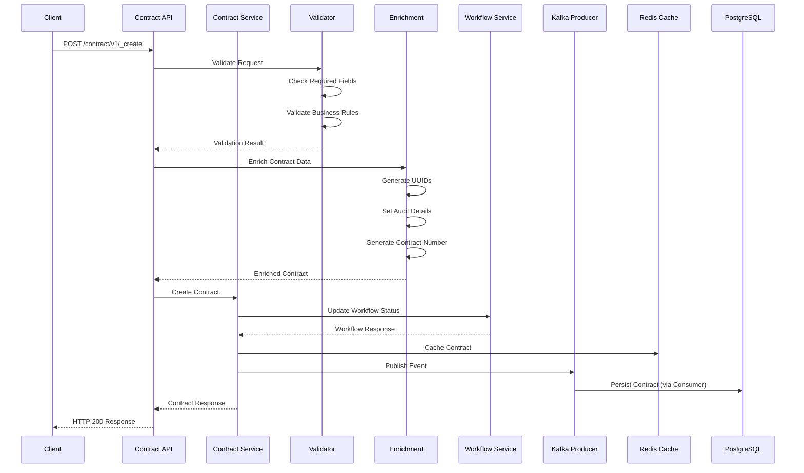

### 2. Contract Search API Flow
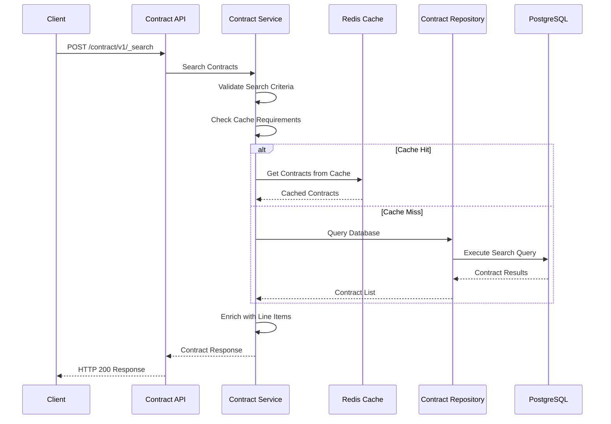

### 3. Contract Update API Flow
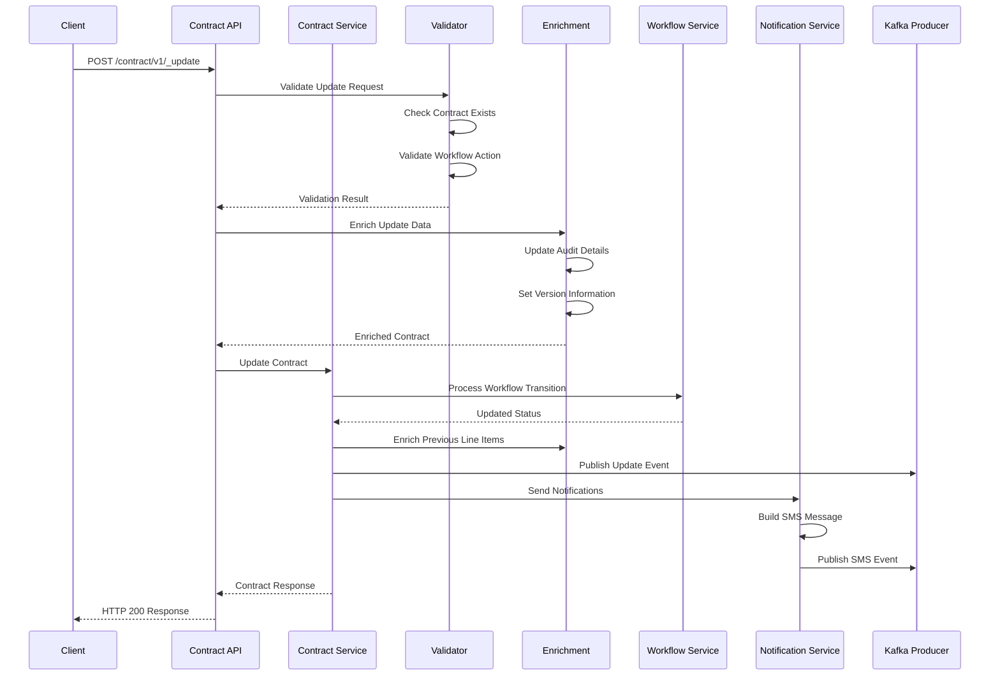

### 4. Time Extension Request Flow
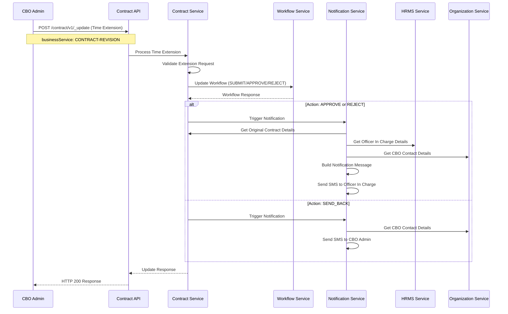

### 5. Estimate Revision Integration Flow
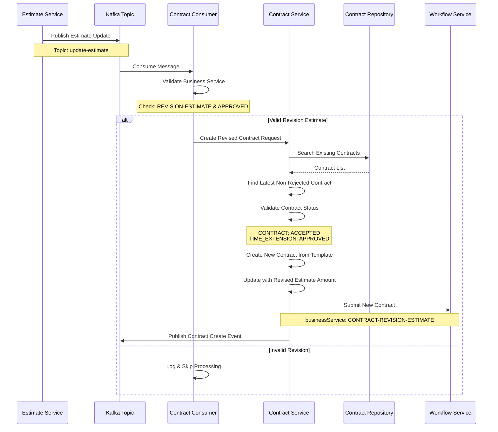

This comprehensive documentation provides complete technical details for the Contract Service, including system architecture, API specifications, database design, configuration, business flows, and integration patterns. The service effectively manages the complete contract lifecycle from creation through revisions and time extensions, with robust workflow integration and notification capabilities.