# Contract Service - Technical Documentation

## Table of Contents
1. [System & Architecture Overview](#system--architecture-overview)
2. [API Documentation](#api-documentation)
3. [Domain Models & Data Structures](#domain-models--data-structures)
4. [Database Design](#database-design)
5. [Configuration & Application Properties](#configuration--application-properties)
6. [Service Dependencies](#service-dependencies)
7. [Events & Messaging](#events--messaging)
8. [Execution & Business Flows](#execution--business-flows)
9. [Security Considerations](#security-considerations)
10. [API Flow Diagrams](#api-flow-diagrams)

## System & Architecture Overview

The Contract Service is a core component of the DIGIT Works platform responsible for managing work contracts and purchase orders. Built on Spring Boot 3.x framework, it follows a microservices architecture with RESTful APIs, event-driven communication via Kafka, and PostgreSQL for data persistence.

### High-Level Architecture

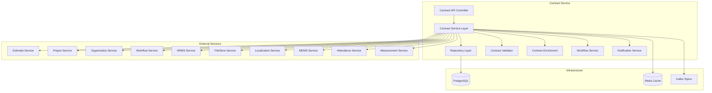

### Component Responsibilities

- **Controller Layer**: Handles HTTP requests/responses and API routing
- **Service Layer**: Implements business logic and orchestrates operations
- **Repository Layer**: Manages data access and database operations
- **Validation**: Validates business rules and data integrity
- **Enrichment**: Enriches data with additional information
- **Workflow Service**: Manages contract approval workflows
- **Notification Service**: Handles SMS and notification delivery

## API Documentation

### Base Information
- **Context Path**: `/contract`
- **Port**: `8024`
- **API Version**: `v1`

### REST Endpoints

#### 1. Create Contract

**Endpoint**: `POST /contract/v1/_create`

**Description**: Creates a new contract with validation and workflow integration.

**Request Schema**:
```json
{
  "RequestInfo": {
    "apiId": "string",
    "ver": "string",
    "ts": "timestamp",
    "action": "string",
    "did": "string",
    "key": "string",
    "msgId": "string",
    "authToken": "string",
    "userInfo": {
      "uuid": "string",
      "userName": "string",
      "name": "string",
      "mobileNumber": "string",
      "emailId": "string",
      "roles": []
    }
  },
  "contract": {
    "tenantId": "string (required)",
    "executingAuthority": "string (required)",
    "contractType": "string (required)",
    "totalContractedAmount": "number",
    "securityDeposit": "number",
    "agreementDate": "timestamp",
    "defectLiabilityPeriod": "timestamp",
    "orgId": "string (required)",
    "startDate": "timestamp",
    "endDate": "timestamp",
    "completionPeriod": "integer (required)",
    "lineItems": [
      {
        "estimateId": "string (required)",
        "estimateLineItemId": "string",
        "tenantId": "string (required)",
        "unitRate": "number",
        "noOfunit": "number",
        "amountBreakups": [
          {
            "estimateAmountBreakupId": "string (required)",
            "amount": "number (required)"
          }
        ]
      }
    ],
    "documents": [
      {
        "fileStore": "string",
        "documentType": "string",
        "documentUid": "string"
      }
    ],
    "additionalDetails": "object"
  },
  "workflow": {
    "action": "string (required)",
    "comment": "string",
    "assignees": ["string"]
  }
}
```

**Response**: Returns created contract with generated IDs and workflow status.

#### 2. Search Contracts

**Endpoint**: `POST /contract/v1/_search`

**Description**: Searches contracts based on various criteria with pagination support.

**Request Schema**:
```json
{
  "RequestInfo": {},
  "tenantId": "string (required)",
  "contractNumber": "string",
  "supplementNumber": "string",
  "businessService": "string",
  "ids": ["string"],
  "estimateIds": ["string"],
  "estimateLineItemIds": ["string"],
  "contractType": "string",
  "status": "string",
  "wfStatus": ["string"],
  "orgIds": ["string"],
  "fromDate": "timestamp",
  "toDate": "timestamp",
  "pagination": {
    "limit": "number",
    "offSet": "number",
    "sortBy": "string",
    "order": "asc|desc"
  }
}
```

**Response**: Returns paginated contract list with total count.

#### 3. Update Contract

**Endpoint**: `POST /contract/v1/_update`

**Description**: Updates existing contracts with workflow transitions.

**Request Schema**: Same as create contract with additional `id` field required.

### Authentication & Authorization

- **Authentication**: JWT token-based authentication
- **Authorization**: Role-based access control (RBAC)
- **Required Roles**:
  - `WORK_ORDER_CREATOR`: Create and edit contracts
  - `WORK_ORDER_VERIFIER`: Verify and forward contracts
  - `WORK_ORDER_APPROVER`: Approve or reject contracts
  - `ORG_ADMIN`: Accept or decline contracts

### Error Handling

All APIs return standard error responses:

```json
{
  "responseInfo": {
    "status": "ERROR"
  },
  "errors": [
    {
      "code": "ERROR_CODE",
      "message": "Error description",
      "description": "Detailed error information"
    }
  ]
}
```

Common error codes:
- `REQUEST_INFO`: Missing request info
- `CONTRACT_NOT_FOUND`: Contract not found
- `INVALID_TENANT`: Invalid tenant ID
- `VALIDATION_ERROR`: Business validation failure

## Domain Models & Data Structures

### Core Entities

#### Contract Entity
```java
public class Contract {
    private String id;                      // UUID (auto-generated)
    private String contractNumber;          // Generated contract number
    private String supplementNumber;        // For contract revisions
    private Long versionNumber;            // Version tracking
    private String oldUuid;                // Reference to previous contract
    private String businessService;        // CONTRACT or CONTRACT-REVISION
    private String tenantId;               // Tenant identifier
    private String wfStatus;               // Workflow status
    private String executingAuthority;     // DEPARTMENT or CONTRACTOR
    private String contractType;           // WORK_ORDER or PURCHASE_ORDER
    private BigDecimal totalContractedAmount;
    private BigDecimal securityDeposit;
    private BigDecimal agreementDate;
    private BigDecimal issueDate;
    private BigDecimal defectLiabilityPeriod;
    private String orgId;                  // Organization reference
    private BigDecimal startDate;
    private BigDecimal endDate;
    private Integer completionPeriod;      // In days
    private Status status;                 // DRAFT, INWORKFLOW, ACTIVE, INACTIVE
    private List<LineItems> lineItems;
    private List<Document> documents;
    private ProcessInstance processInstance;
    private AuditDetails auditDetails;
    private Object additionalDetails;
}
```

#### LineItems Entity
```java
public class LineItems {
    private String id;                     // UUID
    private String estimateId;             // Reference to estimate
    private String estimateLineItemId;     // Specific estimate line item
    private String contractLineItemRef;    // Contract reference
    private String tenantId;
    private Double unitRate;
    private Double noOfunit;
    private String category;
    private String name;
    private Status status;
    private List<AmountBreakup> amountBreakups;
    private AuditDetails auditDetails;
    private Object additionalDetails;
}
```

#### AmountBreakup Entity
```java
public class AmountBreakup {
    private String id;                     // UUID
    private String estimateAmountBreakupId; // Reference to estimate breakup
    private Double amount;
    private Status status;
    private Object additionalDetails;
}
```

### Status Enum
```java
public enum Status {
    DRAFT,          // Initial state
    INWORKFLOW,     // Under workflow processing
    ACTIVE,         // Approved and active
    INACTIVE        // Rejected or terminated
}
```

### Search Criteria
```java
public class ContractCriteria {
    private RequestInfo requestInfo;
    private String tenantId;              // Required
    private String contractNumber;
    private String supplementNumber;
    private String businessService;
    private List<String> ids;
    private List<String> estimateIds;
    private List<String> estimateLineItemIds;
    private String contractType;
    private String status;
    private List<String> wfStatus;
    private List<String> orgIds;
    private BigDecimal fromDate;
    private BigDecimal toDate;
    private Pagination pagination;
}
```

## Database Design

### Entity Relationship Diagram

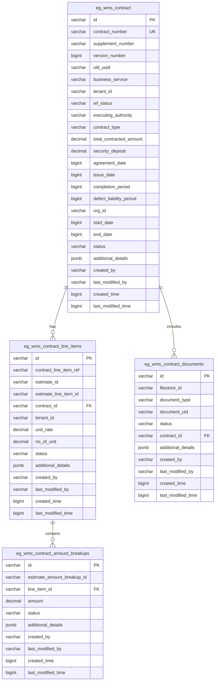

### Table Relationships

- **One-to-Many**: Contract → LineItems (1:N)
- **One-to-Many**: LineItems → AmountBreakups (1:N) 
- **One-to-Many**: Contract → Documents (1:N)

### Indexes and Performance

**Primary Indexes**:
- `eg_wms_contract`: id, contract_number (unique)
- `eg_wms_contract_line_items`: id, contract_id (FK)
- `eg_wms_contract_amount_breakups`: id, line_item_id (FK)
- `eg_wms_contract_documents`: id, contract_id (FK)

**Secondary Indexes** (for query performance):
- `index_eg_wms_contract_tenantId`
- `index_eg_wms_contract_status`
- `index_eg_wms_contract_orgId`
- `index_eg_wms_contract_startDate`
- `index_eg_wms_contract_endDate`
- `index_eg_wms_contract_createdTime`
- `index_eg_wms_contract_line_items_estimateId`
- `index_eg_wms_contract_line_items_estimateLineItemId`

### Data Constraints

- **Not Null**: tenantId, executingAuthority, orgId, status, created_by, agreement_date
- **Unique Constraints**: contract_number
- **Foreign Key Constraints**: 
  - contract_line_items.contract_id → contract.id
  - amount_breakups.line_item_id → line_items.id
  - documents.contract_id → contract.id

## Configuration & Application Properties

### Environment-Specific Configuration

```properties
# Server Configuration
server.contextPath=/contract
server.port=8024
app.timezone=UTC

# Database Configuration
spring.datasource.driver-class-name=org.postgresql.Driver
spring.datasource.url=jdbc:postgresql://localhost:5432/digit-works
spring.datasource.username=postgres
spring.datasource.password=1234

# Flyway Configuration
spring.flyway.table=contract_schema
spring.flyway.baseline-on-migrate=true
spring.flyway.enabled=true

# Kafka Configuration
spring.kafka.consumer.group-id=egov-contract-service
spring.kafka.producer.key-serializer=org.apache.kafka.common.serialization.StringSerializer
spring.kafka.producer.value-serializer=org.springframework.kafka.support.serializer.JsonSerializer
spring.kafka.listener.missing-topics-fatal=false
spring.kafka.consumer.properties.spring.json.use.type.headers=false

# Redis Configuration
spring.data.redis.host=localhost
spring.data.redis.port=6379
spring.data.redis.timeout=3600
is.caching.enabled=true

# Business Configuration
contract.default.offset=0
contract.default.limit=10
contract.search.max.limit=100
contract.duedate.period=7
contract.revision.max.limit=2
contract.revision.measurement.validation=true
```

### Feature Flags

- `is.caching.enabled`: Enable/disable Redis caching
- `notification.sms.enabled`: Enable/disable SMS notifications
- `contract.revision.measurement.validation`: Validate measurements during contract revision

### External Service URLs

```properties
# MDMS Service
egov.mdms.host=https://unified-dev.digit.org
egov.mdms.search.endpoint=/egov-mdms-service/v1/_search

# Workflow Service
egov.workflow.host=https://unified-dev.digit.org
egov.workflow.transition.path=/egov-workflow-v2/egov-wf/process/_transition

# Estimate Service
works.estimate.host=https://unified-dev.digit.org
works.estimate.search.endpoint=/estimate/v1/_search

# Organization Service
egov.org.host=https://unified-dev.digit.org
egov.org.search.endpoint=/org-services/organisation/v1/_search

# HRMS Service
egov.hrms.host=https://unified-dev.digit.org
egov.hrms.search.endpoint=/egov-hrms/employees/_search

# FileStore Service
egov.filestore.host=https://unified-dev.digit.org
egov.filestore.endpoint=/filestore/v1/files/url

# Project Service
works.project.host=https://unified-dev.digit.org
works.project.search.endpoint=/project/v1/_search

# Localization Service
egov.localization.host=https://unified-dev.digit.org
egov.localization.context.path=/localization/messages/v1
egov.localization.search.endpoint=/_search
```

## Service Dependencies

### Internal Dependencies

1. **Estimate Service**: Validates estimate IDs and fetches estimate details
2. **Project Service**: Retrieves project information and details
3. **Organization Service**: Validates organization IDs and fetches org details
4. **Attendance Service**: Creates attendance registers for accepted contracts
5. **Measurement Service**: Validates measurements during contract revisions

### External Dependencies

1. **Workflow Service**: Manages contract approval workflows and state transitions
2. **HRMS Service**: Fetches employee details for notifications and validation
3. **MDMS Service**: Provides master data for validation (tenants, contract types, executing authorities)
4. **FileStore Service**: Validates document uploads and manages file storage
5. **Localization Service**: Provides localized messages for notifications
6. **ID Generation Service**: Generates contract and supplement numbers

### Libraries and Frameworks

- **Spring Boot 3.x**: Main application framework
- **Spring Data JPA**: Database abstraction layer
- **PostgreSQL Driver**: Database connectivity
- **Redis**: Caching layer
- **Apache Kafka**: Asynchronous messaging
- **Jackson**: JSON processing
- **Flyway**: Database migration
- **Lombok**: Code generation
- **Jakarta Validation**: Request validation
- **Swagger**: API documentation
- **eGov Tracer**: Distributed tracing

## Events & Messaging

### Kafka Topics

#### Produced Events

1. **save-contract**: Contract creation events
   ```json
   {
     "requestInfo": {},
     "contract": {},
     "workflow": {}
   }
   ```

2. **update-contract**: Contract update events
   ```json
   {
     "requestInfo": {},
     "contract": {},
     "workflow": {}
   }
   ```

3. **contracts-revision**: Contract revision/time extension events
   ```json
   {
     "RequestInfo": {},
     "tenantId": "string",
     "referenceId": "string",
     "endDate": "timestamp"
   }
   ```

4. **egov.core.notification.sms**: SMS notification events
   ```json
   {
     "mobileNumber": "string",
     "message": "string"
   }
   ```

#### Consumed Events

Currently, the service does not actively consume any Kafka events, but has a consumer framework ready for future implementation.

### Event Flow

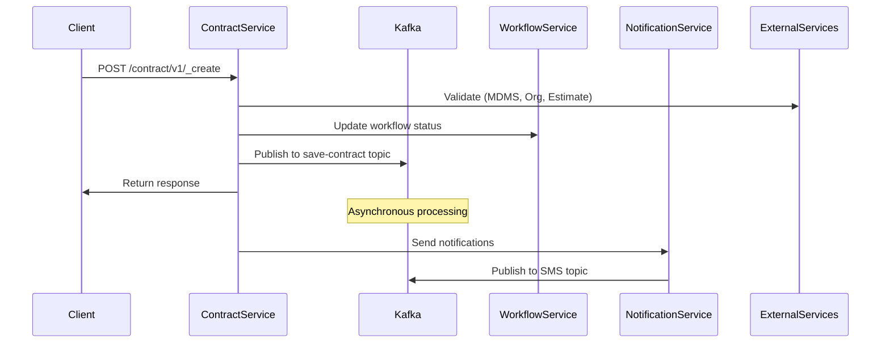

## Execution & Business Flows

### Contract Creation Flow

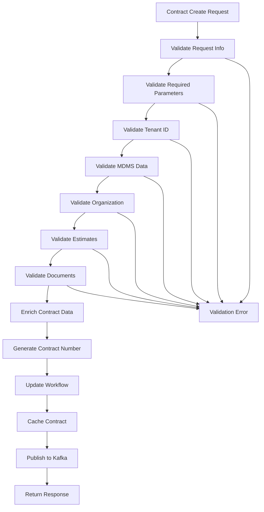

### Contract Update Flow

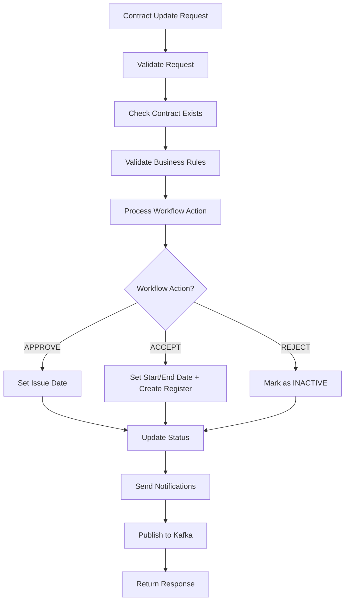

### Contract Revision Flow

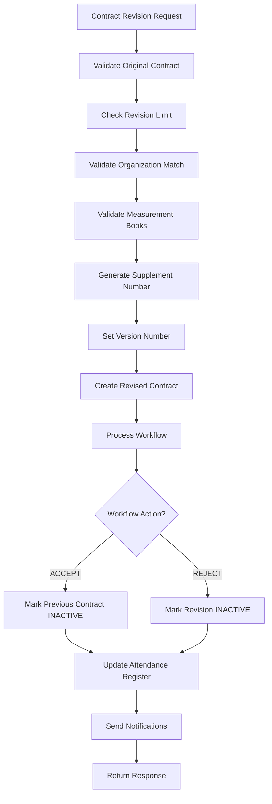

### Workflow States and Transitions

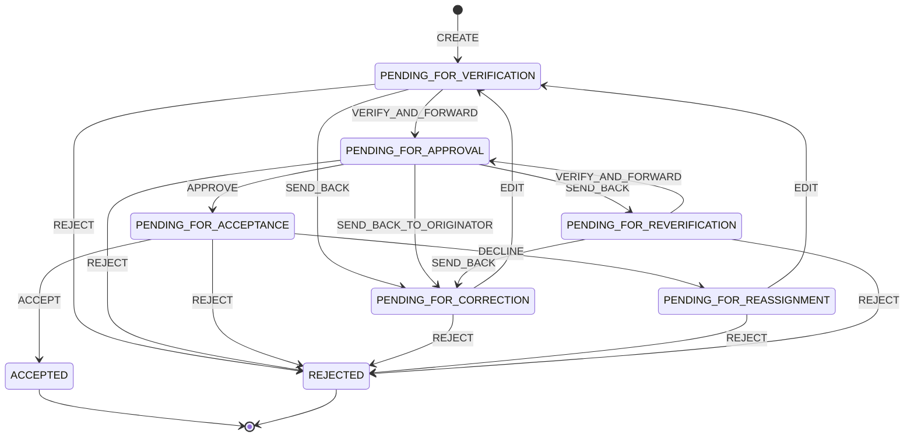

## Security Considerations

### Authentication Flow

1. **JWT Token Validation**: All requests require valid JWT token in Authorization header
2. **User Info Extraction**: Extract user UUID, roles, and tenant from token
3. **Request Info Validation**: Validate mandatory fields in RequestInfo object

### Authorization Checks

**Role-based Access Control**:
- `WORK_ORDER_CREATOR`: Create, edit contracts in draft/correction state
- `WORK_ORDER_VERIFIER`: Verify, forward, send back contracts
- `WORK_ORDER_APPROVER`: Approve, reject, send back contracts
- `ORG_ADMIN`: Accept, decline contracts from organization

### Data Security

1. **Tenant Isolation**: All data queries filtered by tenantId
2. **Input Validation**: Comprehensive validation of all input parameters
3. **SQL Injection Prevention**: Parameterized queries used throughout
4. **XSS Prevention**: Input sanitization for user-provided data

### Sensitive Data Handling

1. **Document Validation**: FileStore IDs validated before storage
2. **Personal Information**: Employee details fetched from HRMS service
3. **Audit Trail**: Complete audit trail maintained for all operations
4. **Cache Security**: Redis cache enabled only if configured securely

## API Flow Diagrams

### 1. Contract Create API Flow

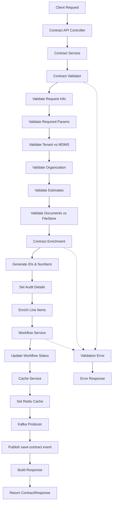

### 2. Contract Search API Flow

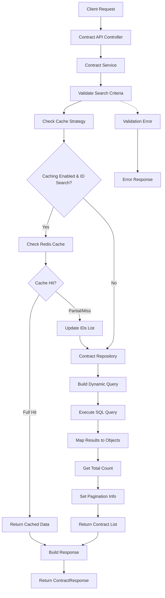

### 3. Contract Update API Flow

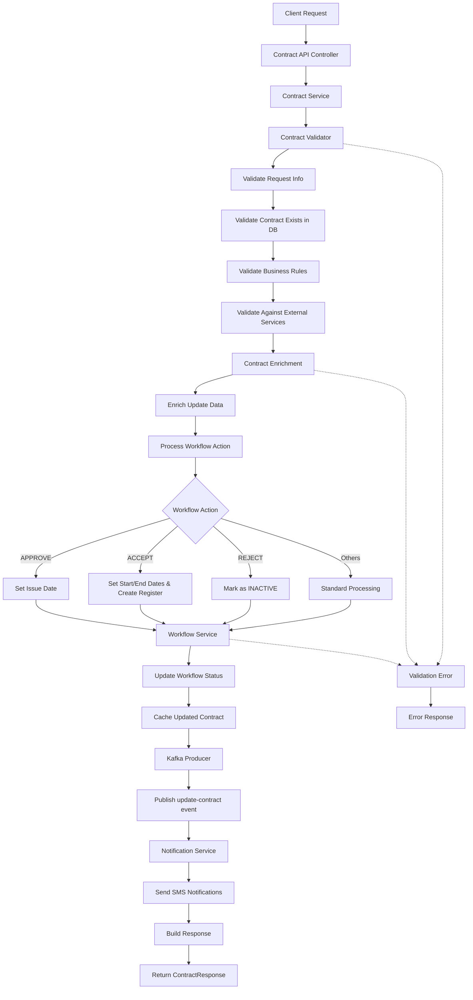

### 4. Contract Revision Flow

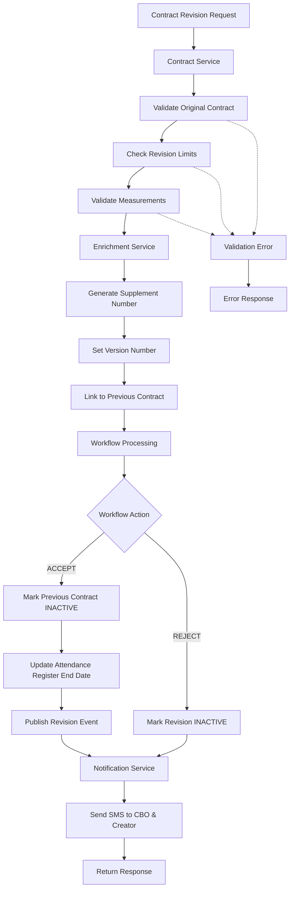

This comprehensive documentation covers all aspects of the Contract Service implementation including architecture, APIs, database design, business flows, and security considerations. The service follows DIGIT platform standards and integrates seamlessly with other microservices in the ecosystem.