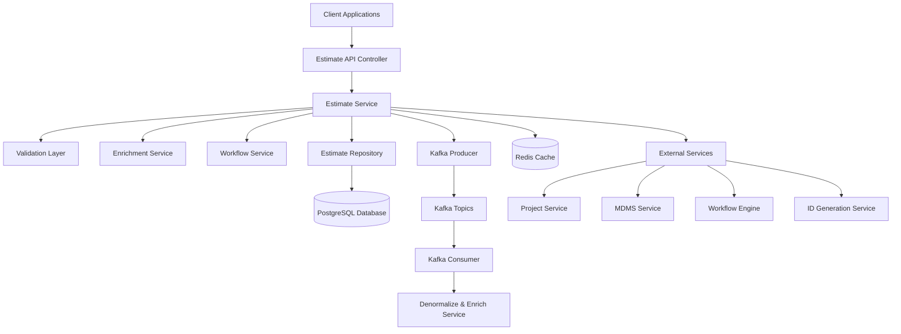
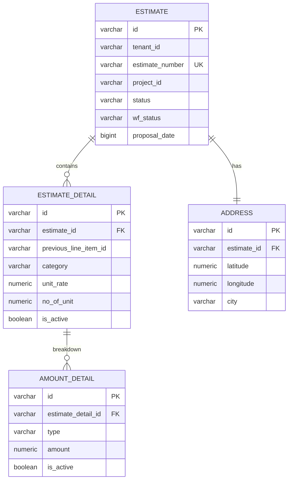
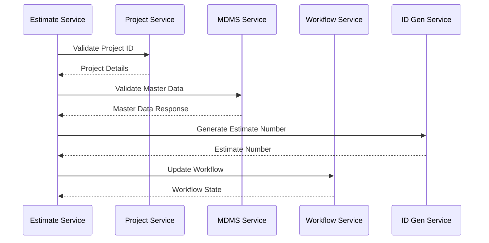
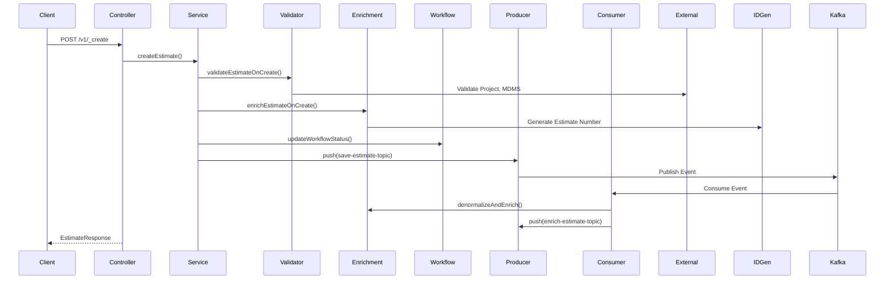
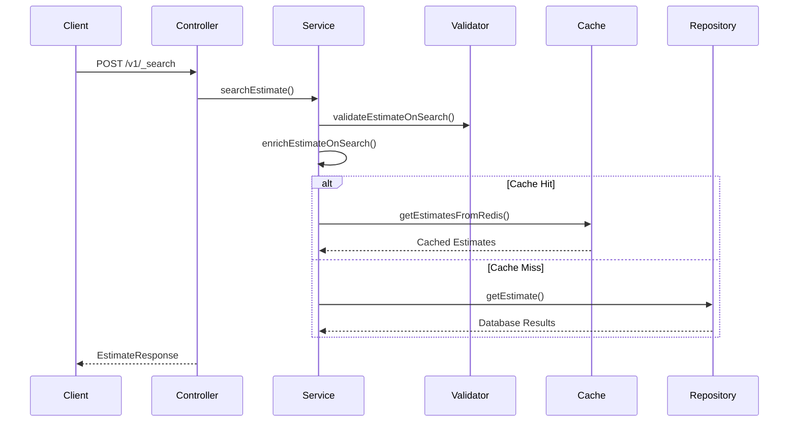
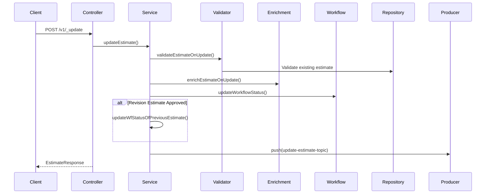
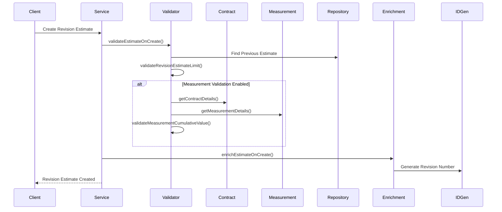
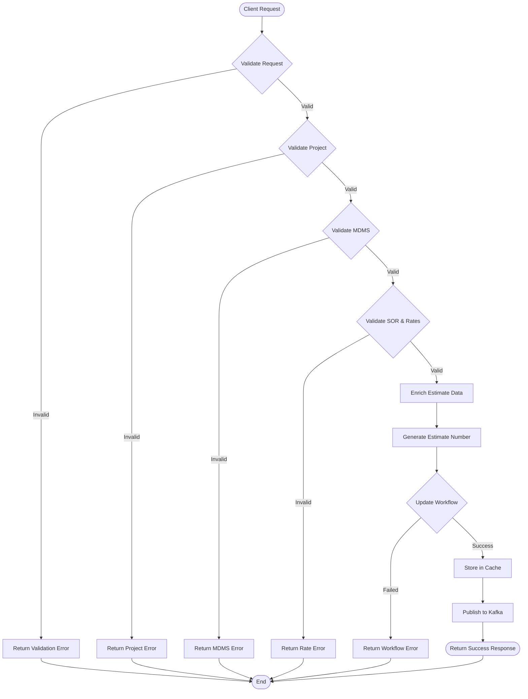
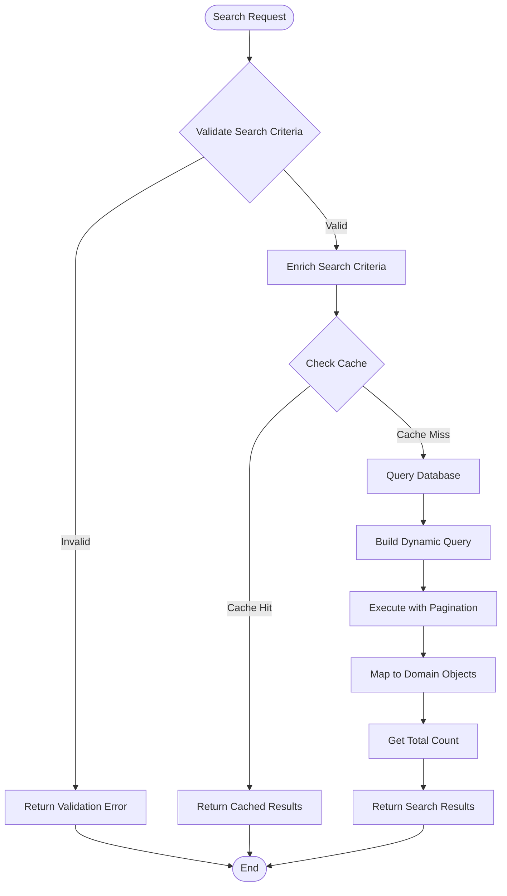
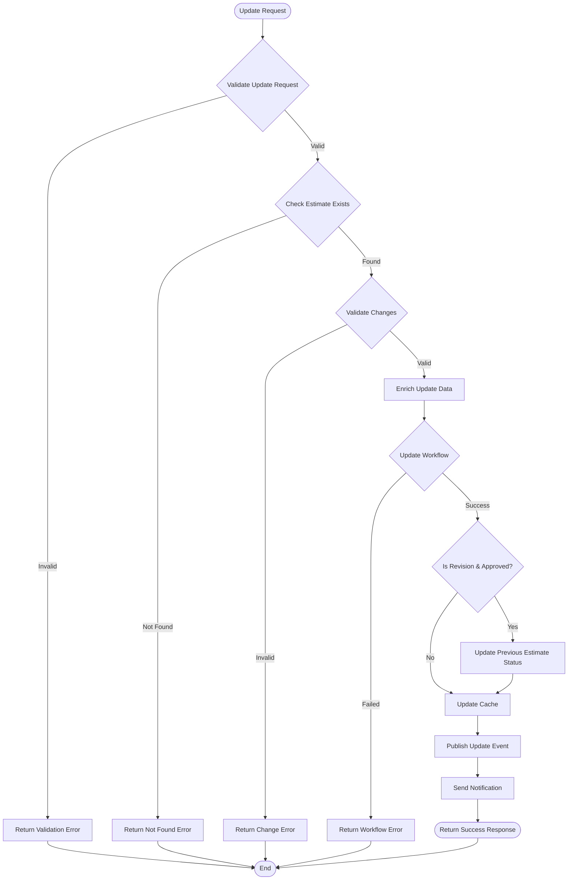

# Estimate Service - Technical Documentation

## Table of Contents
1. [System & Architecture Overview](#system--architecture-overview)
2. [API Documentation](#api-documentation)
3. [Domain Models & Data Structures](#domain-models--data-structures)
4. [Database Design](#database-design)
5. [Configuration & Application Properties](#configuration--application-properties)
6. [Service Dependencies](#service-dependencies)
7. [Events & Messaging](#events--messaging)
8. [Execution & Business Flows](#execution--business-flows)
9. [Security Considerations](#security-considerations)
10. [API Flow Diagrams](#api-flow-diagrams)

## System & Architecture Overview

### High-Level Architecture
The Estimate Service is a core component of the DIGIT Works platform that manages construction project estimates. It follows a microservices architecture built on Spring Boot with event-driven communication patterns.



### Component Responsibilities

- **API Layer**: REST endpoints for CRUD operations on estimates
- **Service Layer**: Core business logic and orchestration
- **Validation Layer**: Input validation and business rule enforcement
- **Enrichment Layer**: Data enrichment and auto-calculation
- **Repository Layer**: Data access and query building
- **Kafka Integration**: Asynchronous processing and event handling
- **Cache Layer**: Redis-based caching for performance optimization

### Interaction Between Services

The Estimate Service integrates with:
- **Project Service**: Validates project existence and retrieves project details
- **MDMS Service**: Validates master data (departments, UOMs, categories)
- **Workflow Engine**: Manages approval workflows
- **ID Generation Service**: Generates estimate numbers
- **Contract Service**: Validates contracts for revision estimates
- **Measurement Service**: Validates measurements against estimates

## API Documentation

### Base URL
- Context Path: `/estimate`
- Port: `8032`

### Authentication & Authorization
- Uses JWT token-based authentication
- Role-based access control with specific roles:
  - `ESTIMATE_CREATOR`: Create and update estimates
  - `ESTIMATE_VERIFIER`: Verify estimates
  - `TECHNICAL_SANCTIONER`: Technical approval
  - `ESTIMATE_APPROVER`: Final approval

### REST APIs

#### 1. Create Estimate
- **Endpoint**: `POST /estimate/v1/_create`
- **Description**: Creates a new estimate in the system
- **Request Schema**:
```json
{
  "RequestInfo": {...},
  "estimate": {
    "tenantId": "string",
    "name": "string",
    "projectId": "string", 
    "executingDepartment": "string",
    "address": {...},
    "estimateDetails": [...]
  },
  "workflow": {
    "action": "SUBMIT"
  }
}
```
- **Response Schema**:
```json
{
  "ResponseInfo": {...},
  "estimates": [{
    "id": "uuid",
    "estimateNumber": "ES/2022-23/010",
    "status": "INWORKFLOW",
    "wfStatus": "PENDINGFORVERIFICATION",
    ...
  }]
}
```

#### 2. Search Estimates
- **Endpoint**: `POST /estimate/v1/_search`
- **Description**: Searches estimates based on criteria
- **Query Parameters**:
  - `tenantId` (required): Tenant identifier
  - `ids[]`: List of estimate IDs (max 10)
  - `projectId`: Project ID filter
  - `estimateNumber`: Estimate number filter
  - `executingDepartment`: Department filter
  - `wfStatus`: Workflow status filter
  - `fromProposalDate`, `toProposalDate`: Date range filter
  - `limit`, `offset`: Pagination parameters
  - `sortBy`: Sort field (createdTime, proposalDate, etc.)
  - `sortOrder`: ASC/DESC

#### 3. Update Estimate
- **Endpoint**: `POST /estimate/v1/_update`
- **Description**: Updates an existing estimate
- **Request Schema**: Same as create with required `id` field
- **Business Rules**:
  - Only proposal date is non-editable
  - Requires valid estimate ID
  - Workflow action determines next state

### Error Handling Patterns
- Standard HTTP status codes
- Detailed error responses with error codes
- Validation errors include field-level messages
- Custom exceptions for business logic violations

### Example Requests and Responses

#### Create Estimate Example
```json
{
  "RequestInfo": {
    "apiId": "estimate-service",
    "ver": "1.0.0",
    "userInfo": {
      "uuid": "user-uuid",
      "tenantId": "pg.citya"
    }
  },
  "estimate": {
    "tenantId": "pg.citya",
    "name": "Road Construction Estimate",
    "projectId": "project-123",
    "executingDepartment": "DEPT001",
    "address": {
      "latitude": 30.7333,
      "longitude": 76.7794,
      "city": "Chandigarh",
      "pincode": "160001"
    },
    "estimateDetails": [{
      "category": "SOR",
      "sorId": "SOR001",
      "unitRate": 100.0,
      "noOfunit": 50.0,
      "uom": "CUM",
      "amountDetail": [{
        "type": "LABOUR",
        "amount": 5000.0
      }]
    }]
  },
  "workflow": {
    "action": "SUBMIT",
    "comment": "Initial submission"
  }
}
```

## Domain Models & Data Structures

### Core Domain Models

#### Estimate
```java
public class Estimate {
    private String id;                    // UUID
    private String tenantId;              // Tenant identifier
    private String estimateNumber;        // Auto-generated (ES/YYYY-YY/SEQ)
    private String revisionNumber;        // For revision estimates (RE/YYYY-YY/SEQ)
    private String businessService;       // ESTIMATE or REVISION-ESTIMATE
    private BigDecimal versionNumber;     // Version tracking
    private String oldUuid;              // Previous estimate reference
    private String projectId;           // Linked project
    private BigDecimal proposalDate;     // Timestamp
    private StatusEnum status;           // DRAFT, INWORKFLOW, ACTIVE, INACTIVE
    private String wfStatus;             // Workflow state
    private String name;                 // Estimate name
    private String referenceNumber;      // User reference
    private String description;          // Description
    private String executingDepartment;  // Department code
    private Address address;             // Location details
    private List<EstimateDetail> estimateDetails; // Line items
    private AuditDetails auditDetails;   // Audit tracking
    private Object additionalDetails;    // Extensible metadata
    private Project project;             // Denormalized project data
    private ProcessInstance processInstances; // Workflow data
}
```

#### EstimateDetail
```java
public class EstimateDetail {
    private String id;                   // UUID
    private String previousLineItemId;   // For revision tracking
    private String sorId;               // Schedule of Rates ID
    private String category;            // SOR, NON-SOR, OVERHEAD
    private String name;                // Line item name
    private String description;         // Description
    private Double unitRate;            // Rate per unit
    private Double noOfunit;            // Calculated quantity
    private String uom;                 // Unit of measurement
    private Double uomValue;            // UOM value
    private BigDecimal length;          // Dimension
    private BigDecimal width;           // Dimension  
    private BigDecimal height;          // Dimension
    private BigDecimal quantity;        // Quantity
    private Boolean isDeduction;        // Deduction flag
    private List<AmountDetail> amountDetail; // Amount breakdown
    private boolean isActive;           // Active status
    private Object additionalDetails;   // Extensible metadata
}
```

#### AmountDetail
```java
public class AmountDetail {
    private String id;                  // UUID
    private String type;                // LABOUR, MATERIAL, GST, etc.
    private Double amount;              // Amount value
    private boolean isActive;           // Active status
    private Object additionalDetails;   // Extensible metadata
}
```

### Entity Relationships
- Estimate (1) → (N) EstimateDetail
- EstimateDetail (1) → (N) AmountDetail
- Estimate (1) → (1) Address
- Estimate (N) → (1) Project

### Validation Rules
- **Estimate Level**:
  - TenantId: Required, 2-64 chars
  - Name: Required, 2-140 chars
  - ProjectId: Required, valid project
  - ExecutingDepartment: Required, valid MDMS code
  - At least one SOR or NON-SOR line item required

- **EstimateDetail Level**:
  - Either sorId or name required
  - UnitRate required for SOR/NON-SOR categories
  - NoOfunit calculated from dimensions if not provided
  - UOM validation against MDMS

- **AmountDetail Level**:
  - Amount: Required, non-null
  - Type: Valid overhead type for OVERHEAD category

### Enum Definitions
```java
public enum StatusEnum {
    DRAFT, INWORKFLOW, ACTIVE, INACTIVE
}

public enum SortOrder {
    ASC, DESC
}

public enum SortBy {
    createdTime, executingDepartment, proposalDate, wfStatus, totalAmount
}
```

## Database Design

### Tables/Collections

#### eg_wms_estimate
```sql
CREATE TABLE eg_wms_estimate(
    id                     VARCHAR(256) PRIMARY KEY,
    tenant_id              VARCHAR(64) NOT NULL,
    estimate_number        VARCHAR(128) NOT NULL UNIQUE,
    revision_number        VARCHAR(128),
    business_service       VARCHAR(64),
    version_number         NUMERIC,
    old_uuid              VARCHAR(256),
    project_id            VARCHAR(256) NOT NULL,
    proposal_date         BIGINT NOT NULL,
    status                VARCHAR(64) NOT NULL,
    wf_status             VARCHAR(64) NOT NULL,
    name                  VARCHAR(140) NOT NULL,
    reference_number      VARCHAR(140),
    description           VARCHAR(240),
    executing_department  VARCHAR(64) NOT NULL,
    additional_details    JSONB,
    created_by            VARCHAR(256) NOT NULL,
    last_modified_by      VARCHAR(256),
    created_time          BIGINT,
    last_modified_time    BIGINT
);
```

#### eg_wms_estimate_detail
```sql
CREATE TABLE eg_wms_estimate_detail(
    id                    VARCHAR(256) PRIMARY KEY,
    tenant_id             VARCHAR(64) NOT NULL,
    estimate_id           VARCHAR(256) NOT NULL,
    previous_line_item_id VARCHAR(256),
    sor_id                VARCHAR(256),
    category              VARCHAR(256) NOT NULL,
    name                  VARCHAR(140),
    description           VARCHAR(256),
    unit_rate             NUMERIC,
    no_of_unit            NUMERIC,
    uom                   VARCHAR(256),
    uom_value             NUMERIC,
    length                NUMERIC,
    width                 NUMERIC,
    height                NUMERIC,
    quantity              NUMERIC,
    is_deduction          BOOLEAN,
    is_active             BOOLEAN DEFAULT TRUE,
    additional_details    JSONB,
    FOREIGN KEY (estimate_id) REFERENCES eg_wms_estimate (id)
);
```

#### eg_wms_estimate_amount_detail
```sql
CREATE TABLE eg_wms_estimate_amount_detail(
    id                    VARCHAR(256) PRIMARY KEY,
    tenant_id             VARCHAR(64) NOT NULL,
    estimate_detail_id    VARCHAR(256) NOT NULL,
    type                  VARCHAR(140) NOT NULL,
    amount                NUMERIC NOT NULL,
    is_active             BOOLEAN DEFAULT TRUE,
    additional_details    JSONB,
    FOREIGN KEY (estimate_detail_id) REFERENCES eg_wms_estimate_detail (id)
);
```

#### eg_wms_estimate_address
```sql
CREATE TABLE eg_wms_estimate_address(
    id                    VARCHAR(256) PRIMARY KEY,
    tenant_id             VARCHAR(64) NOT NULL,
    estimate_id           VARCHAR(256) NOT NULL,
    latitude              NUMERIC NOT NULL,
    longitude             NUMERIC NOT NULL,
    address_number        VARCHAR,
    address_line_1        VARCHAR NOT NULL,
    address_line_2        VARCHAR,
    landmark              VARCHAR,
    city                  VARCHAR(256) NOT NULL,
    pin_code              VARCHAR(30) NOT NULL,
    detail                VARCHAR(256),
    FOREIGN KEY (estimate_id) REFERENCES eg_wms_estimate (id)
);
```

### Primary & Foreign Keys
- **Primary Keys**: All tables have UUID-based primary keys
- **Foreign Keys**:
  - estimate_detail.estimate_id → estimate.id
  - amount_detail.estimate_detail_id → estimate_detail.id
  - address.estimate_id → estimate.id

### Relationships
- **1:N Relationships**:
  - estimate ← estimate_detail
  - estimate_detail ← amount_detail
- **1:1 Relationships**:
  - estimate ← address

### Indexes and Constraints
```sql
-- Unique constraint on estimate number
CONSTRAINT uk_eg_wms_estimate UNIQUE (estimate_number)

-- Indexes for search optimization
CREATE INDEX idx_estimate_tenant_id ON eg_wms_estimate(tenant_id);
CREATE INDEX idx_estimate_project_id ON eg_wms_estimate(project_id);
CREATE INDEX idx_estimate_status ON eg_wms_estimate(status);
CREATE INDEX idx_estimate_wf_status ON eg_wms_estimate(wf_status);
CREATE INDEX idx_estimate_created_time ON eg_wms_estimate(created_time);
```

### ER Diagram


## Configuration & Application Properties

### Environment-Specific Configurations

#### Database Configuration
```properties
spring.datasource.driver-class-name=org.postgresql.Driver
spring.datasource.url=jdbc:postgresql://localhost:5432/digit-works
spring.datasource.username=postgres
spring.datasource.password=1234
spring.flyway.enabled=true
spring.flyway.table=estimate_service_schema
```

#### Kafka Configuration
```properties
kafka.config.bootstrap_server_config=localhost:9092
spring.kafka.consumer.group-id=works-estimate
spring.kafka.consumer.key-deserializer=org.apache.kafka.common.serialization.StringDeserializer
spring.kafka.producer.key-serializer=org.apache.kafka.common.serialization.StringSerializer
spring.kafka.producer.value-serializer=org.springframework.kafka.support.serializer.JsonSerializer

# Topics
estimate.kafka.create.topic=save-estimate
estimate.kafka.update.topic=update-estimate
estimate.kafka.enrich.topic=enrich-estimate
```

#### Redis Configuration
```properties
spring.data.redis.host=localhost
spring.data.redis.port=6379
redis.expiry.time=3600
is.caching.enabled=true
```

#### External Service Configuration
```properties
# MDMS Service
egov.mdms.host=https://unified-dev.digit.org
egov.mdms.search.endpoint=/egov-mdms-service/v1/_search

# MDMS V2 Service
egov.mdms.host.v2=https://unified-dev.digit.org
egov.mdms.search.endpoint.v2=/mdms-v2/v1/_search

# ID Generation Service
egov.idgen.host=https://unified-dev.digit.org
egov.idgen.path=/egov-idgen/id/_generate
egov.idgen.estimate.number.name=estimate.number
egov.idgen.estimate.number.format=ES/[fy:yyyy-yy]/[SEQ_ESTIMATE_NUM]

# Workflow Service
egov.workflow.host=https://unified-dev.digit.org
egov.workflow.transition.path=/egov-workflow-v2/egov-wf/process/_transition
estimate.workflow.business.service=ESTIMATE

# Project Service
works.project.service.host=https://unified-dev.digit.org/
works.project.service.path=project/v1/_search
```

#### Application Properties
```properties
server.contextPath=/estimate
server.port=8032
app.timezone=UTC

# Search Configuration
estimate.default.offset=0
estimate.default.limit=100
estimate.search.max.limit=200

# Revision Estimate Configuration
estimate.revisionEstimate.buisnessService=REVISION-ESTIMATE
estimate.revisionEstimate.measurementValidation=true
estimate.revisionEstimate.maxLimit=3
```

### Feature Flags
- `is.caching.enabled`: Enable/disable Redis caching
- `notification.sms.enabled`: Enable SMS notifications
- `estimate.revisionEstimate.measurementValidation`: Enable measurement validation for revision estimates

## Service Dependencies

### External Services Used

#### 1. Project Service
- **Purpose**: Validate project existence and retrieve project details
- **Host**: `works.project.service.host`
- **Endpoint**: `/project/v1/_search`
- **Usage**: Called during estimate validation

#### 2. MDMS Service (V1 & V2)
- **Purpose**: Master data validation
- **V1 Host**: `egov.mdms.host`
- **V2 Host**: `egov.mdms.host.v2`
- **Data Retrieved**:
  - Departments
  - UOM (Unit of Measurement)
  - Categories
  - Overheads
  - SOR (Schedule of Rates)
  - Rates with effective dates

#### 3. Workflow Engine
- **Purpose**: Manage approval workflows
- **Host**: `egov.workflow.host`
- **Endpoints**:
  - `/egov-workflow-v2/egov-wf/process/_transition`
  - `/egov-workflow-v2/egov-wf/businessservice/_search`

#### 4. ID Generation Service
- **Purpose**: Generate estimate and revision numbers
- **Host**: `egov.idgen.host`
- **Endpoint**: `/egov-idgen/id/_generate`
- **Formats**:
  - Estimate: `ES/[fy:yyyy-yy]/[SEQ_ESTIMATE_NUM]`
  - Revision: `RE/[fy:yyyy-yy]/[SEQ_ESTIMATE_REVISION_NUM]`

#### 5. Contract Service
- **Purpose**: Validate contracts for revision estimates
- **Host**: `egov.contract.host`
- **Endpoint**: `/contract/v1/_search`

#### 6. Measurement Service
- **Purpose**: Validate measurements against estimates
- **Host**: `egov.measurementService.host`
- **Endpoint**: `/measurement-service/v1/_search`

### Internal Service-to-Service Calls

#### Service Call Flow


### Libraries and Frameworks
- **Spring Boot 3.2.2**: Core framework
- **Spring Kafka**: Message processing
- **Spring Data Redis**: Caching
- **PostgreSQL Driver 42.7.1**: Database connectivity
- **Flyway**: Database migrations
- **Jackson**: JSON processing
- **Lombok**: Code generation
- **eGov Common Libraries**:
  - `tracer`: Distributed tracing
  - `works-services-common`: Common utilities
  - `mdms-client`: MDMS integration

## Events & Messaging

### Kafka Topics Used

#### 1. save-estimate
- **Purpose**: Created estimate events
- **Producer**: Estimate Service
- **Consumers**: 
  - Denormalize Consumer (internal)
  - Persister Service
  - Indexer Service

#### 2. update-estimate  
- **Purpose**: Updated estimate events
- **Producer**: Estimate Service
- **Consumers**:
  - Denormalize Consumer (internal)
  - Persister Service
  - Indexer Service

#### 3. enrich-estimate
- **Purpose**: Enriched estimate events with project and workflow data
- **Producer**: Denormalize Consumer
- **Consumers**:
  - Indexer Service
  - Notification Service

#### 4. egov.core.notification.sms
- **Purpose**: SMS notifications
- **Producer**: Notification Service
- **Consumers**: SMS Service

### Events Emitted and Consumed

#### Events Emitted

##### EstimateRequest Event
```json
{
  "topic": "save-estimate",
  "payload": {
    "RequestInfo": {...},
    "estimate": {
      "id": "estimate-uuid",
      "estimateNumber": "ES/2023-24/001",
      "status": "INWORKFLOW",
      "wfStatus": "PENDINGFORVERIFICATION",
      ...
    },
    "workflow": {
      "action": "SUBMIT",
      "comment": "Initial submission"
    }
  }
}
```

#### Events Consumed

##### save-estimate/update-estimate Consumer
```java
@KafkaListener(topics = {"${estimate.kafka.create.topic}","${estimate.kafka.update.topic}"})
public void listen(final String message, @Header(KafkaHeaders.RECEIVED_TOPIC) String topic) {
    EstimateRequest estimateRequest = mapper.readValue(message, EstimateRequest.class);
    EstimateRequest enrichedRequest = denormalizeAndEnrichEstimateService.denormalizeAndEnrich(estimateRequest);
    producer.push(serviceConfiguration.getEnrichEstimateTopic(), enrichedRequest);
}
```

### Producer and Consumer Services

#### EstimateProducer
```java
@Component
public class EstimateProducer {
    private final CustomKafkaTemplate<String, Object> kafkaTemplate;
    
    public void push(String topic, Object value) {
        kafkaTemplate.send(topic, value);
    }
}
```

#### DenormalizeAndEnrichEstimateConsumer
- Consumes estimate create/update events
- Enriches with project details
- Enriches with workflow process instances
- Publishes enriched events for indexing

## Execution & Business Flows

### Key Business Flows

#### 1. Create Estimate Flow



**Step-by-step Process:**
1. **Request Validation**: Validate request structure and user info
2. **Business Validation**: 
   - Validate project existence
   - Validate MDMS master data
   - Validate SOR rates and effective dates
   - Validate estimate details and amount calculations
3. **Enrichment**:
   - Generate unique estimate ID
   - Generate estimate number from ID Gen service
   - Set proposal date
   - Calculate noOfUnit from dimensions
   - Set audit details
4. **Workflow Processing**: Update workflow state based on action
5. **Caching**: Store in Redis if caching enabled
6. **Event Publishing**: Publish to Kafka for persistence and indexing
7. **Asynchronous Enrichment**: Consumer enriches with project and workflow data

#### 2. Search Estimate Flow



#### 3. Update Estimate Flow



#### 4. Revision Estimate Flow



### Happy Path and Failure Scenarios

#### Happy Path - Estimate Approval
1. **Create**: EST_CREATOR creates estimate → Status: INWORKFLOW, WF: PENDINGFORVERIFICATION
2. **Verify**: EST_VERIFIER verifies → Action: VERIFYANDFORWARD → WF: PENDINGFORTECHNICALSANCTION  
3. **Technical Sanction**: TECHNICAL_SANCTIONER approves → Action: TECHNICALSANCTION → WF: PENDINGFORAPPROVAL
4. **Final Approval**: EST_APPROVER approves → Action: APPROVE → Status: ACTIVE, WF: APPROVED

#### Failure Scenarios
1. **Validation Failures**: Invalid master data, missing project, calculation errors
2. **Workflow Rejection**: Any approver rejects → Status: INACTIVE, WF: REJECTED
3. **Send Back**: Approver sends back for corrections → WF: PENDINGFORCORRECTION
4. **Revision Limit**: Exceeding max revision limit throws exception
5. **Measurement Validation**: noOfUnit less than measurement cumulative value

## Security Considerations

### Authentication Flow
- JWT token-based authentication
- Token validation through common interceptors
- User information extracted from RequestInfo

### Authorization Checks
- Role-based access control at API level
- Workflow action permissions based on user roles
- Tenant-based data isolation

### Sensitive Data Handling
- No PII stored in estimates
- Financial amounts stored with precision
- Audit trail for all changes
- Soft delete through isActive flags

## API Flow Diagrams

### Create Estimate API Flow



### Search Estimate API Flow



### Update Estimate API Flow



---

**Document Version**: 1.0  
**Last Updated**: December 2024  
**Authors**: Technical Documentation Team  
**Review Status**: Technical Review Completed