# Estimate Service Documentation

## Table of Contents
1. [System & Architecture Overview](#system--architecture-overview)
2. [API Documentation](#api-documentation)
3. [Domain Models & Data Structures](#domain-models--data-structures)
4. [Database Design](#database-design)
5. [Configuration & Application Properties](#configuration--application-properties)
6. [Service Dependencies](#service-dependencies)
7. [Events & Messaging](#events--messaging)
8. [Execution & Business Flows](#execution--business-flows)
9. [Security Considerations](#security-considerations)
10. [API Flow Diagrams](#api-flow-diagrams)

## System & Architecture Overview

The Estimate Service is a Spring Boot 3.2.2 microservice that manages project estimation and costing in the DIGIT Works platform. It handles the creation, updating, and approval of project estimates with detailed breakdown of materials, labor, and overhead costs.

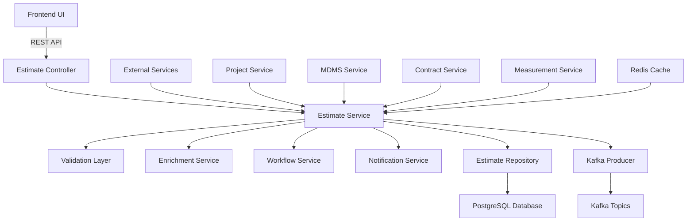

### Core Components

- **Controllers**: REST endpoints for estimate operations
- **Services**: Business logic and orchestration
- **Validators**: Request validation and business rules
- **Enrichment**: Data enhancement and UUID generation
- **Repository**: Database operations and queries
- **Kafka Integration**: Asynchronous processing and events

## API Documentation

### Base URL: `/estimate/v1`

#### 1. Create Estimate
- **Endpoint**: `POST /_create`
- **Description**: Creates a new project estimate
- **Authentication**: Required (JWT token)

**Request Body**:
```json
{
  "RequestInfo": {
    "apiId": "estimate-service",
    "ver": "1.0",
    "ts": 1234567890,
    "action": "create",
    "did": "1",
    "key": "abcd-efgh",
    "msgId": "search with from and to values",
    "authToken": "{{token}}"
  },
  "estimate": {
    "tenantId": "od.testing",
    "projectId": "PROJECT_ID",
    "name": "Estimate for Road Construction",
    "referenceNumber": "EST-REF-001",
    "description": "Detailed estimate for road construction project",
    "executingDepartment": "Engineering",
    "address": {
      "tenantId": "od.testing",
      "doorNo": "123",
      "plotNo": "456",
      "landmark": "Near School",
      "city": "od.testing",
      "district": "Cuttack",
      "region": "Odisha",
      "state": "Odisha",
      "country": "IN",
      "pincode": "753001"
    },
    "estimateDetails": [
      {
        "category": "SOR",
        "name": "Excavation in earth",
        "description": "Earth excavation for foundation",
        "sorId": "SOR001",
        "uom": "CUM",
        "unitRate": 150.00,
        "noOfunit": 100.0,
        "length": 10.0,
        "width": 5.0,
        "height": 2.0,
        "quantity": 1.0,
        "amountDetail": [
          {
            "heads": [
              {
                "category": "MATERIAL",
                "amount": 5000.0
              },
              {
                "category": "LABOUR",
                "amount": 10000.0
              }
            ]
          }
        ]
      }
    ],
    "workflow": {
      "action": "SUBMIT",
      "assignees": [],
      "comments": "Submitting for verification"
    }
  }
}
```

**Response**:
```json
{
  "ResponseInfo": {
    "apiId": "estimate-service",
    "ver": "1.0", 
    "ts": 1234567890,
    "resMsgId": "uief87324",
    "msgId": "search with from and to values",
    "status": "successful"
  },
  "estimates": [
    {
      "id": "estimate-uuid",
      "tenantId": "od.testing",
      "estimateNumber": "EP/2023-24/000001",
      "projectId": "PROJECT_ID",
      "proposalDate": 1234567890,
      "status": "ACTIVE",
      "wfStatus": "PENDINGFORVERIFICATION",
      "name": "Estimate for Road Construction",
      "referenceNumber": "EST-REF-001",
      "description": "Detailed estimate for road construction project",
      "executingDepartment": "Engineering",
      "address": {...},
      "estimateDetails": [...],
      "auditDetails": {
        "createdBy": "user-uuid",
        "lastModifiedBy": "user-uuid", 
        "createdTime": 1234567890,
        "lastModifiedTime": 1234567890
      }
    }
  ]
}
```

#### 2. Update Estimate
- **Endpoint**: `POST /_update`
- **Description**: Updates an existing estimate
- **Authentication**: Required

#### 3. Search Estimates
- **Endpoint**: `POST /_search`
- **Description**: Search and retrieve estimates based on criteria

**Query Parameters**:
- `tenantId` (required): Tenant identifier
- `ids`: List of estimate IDs
- `estimateNumber`: Estimate number
- `projectId`: Associated project ID
- `status`: Estimate status
- `fromProposalDate`: Start date filter
- `toProposalDate`: End date filter
- `limit`: Number of records (default: 10)
- `offset`: Page offset (default: 0)

#### 4. Count Estimates
- **Endpoint**: `POST /_count`
- **Description**: Get count of estimates matching search criteria

### Error Handling

All APIs follow standard error response format:

```json
{
  "ResponseInfo": {
    "apiId": "estimate-service",
    "ver": "1.0",
    "ts": 1234567890,
    "resMsgId": "uief87324",
    "msgId": "search with from and to values",
    "status": "failed"
  },
  "Errors": [
    {
      "code": "INVALID_TENANT",
      "message": "Invalid tenantId provided",
      "description": "The tenant: od.invalid is not present in MDMS"
    }
  ]
}
```

## Domain Models & Data Structures

### Core Entities

#### Estimate
```java
public class Estimate {
    private String id;
    private String tenantId;
    private String estimateNumber;
    private String versionNumber;
    private String oldUuid;
    private String businessService;
    private String revisionNumber;
    private String projectId;
    private Long proposalDate;
    private Status status;
    private String wfStatus;
    private String name;
    private String referenceNumber;
    private String description;
    private String executingDepartment;
    private Address address;
    private List<EstimateDetail> estimateDetails;
    private Object additionalDetails;
    private AuditDetails auditDetails;
}
```

#### EstimateDetail
```java
public class EstimateDetail {
    private String id;
    private String sorId;
    private String category; // SOR, NON-SOR, OVERHEAD
    private String name;
    private String description;
    private String uom;
    private Double unitRate;
    private Double noOfunit;
    private Double length;
    private Double width;
    private Double height;
    private Double quantity;
    private Boolean isDeduction;
    private List<AmountDetail> amountDetail;
    private String previousLineItemId;
    private Status status;
    private Object additionalDetails;
    private AuditDetails auditDetails;
}
```

#### AmountDetail
```java
public class AmountDetail {
    private String id;
    private String type;
    private List<Head> heads;
    private Double amount;
    private Status status;
    private Object additionalDetails;
    private AuditDetails auditDetails;
}
```

### Validation Rules

- **EstimateNumber**: Auto-generated, format EP/{FY}/XXXXXX
- **ProjectId**: Must exist in Project service and be active
- **TenantId**: Must be valid as per MDMS tenant configuration
- **EstimateDetails**: At least one detail required
- **UnitRate**: Must be positive for non-deduction items
- **NoOfUnit**: Must match calculated quantity (length × width × height × quantity)
- **SOR ID**: Must exist in MDMS SOR master for SOR category items

### Enums

```java
public enum Status {
    ACTIVE, INACTIVE, INWORKFLOW
}

public enum Category {
    SOR, NON_SOR, OVERHEAD
}
```

## Database Design

### Tables

#### eg_wms_estimate
```sql
CREATE TABLE eg_wms_estimate (
    id character varying(64) PRIMARY KEY,
    tenant_id character varying(64) NOT NULL,
    estimate_number character varying(64) NOT NULL,
    version_number bigint,
    old_uuid character varying(64),
    business_service character varying(128),
    revision_number character varying(64),
    project_id character varying(64) NOT NULL,
    proposal_date bigint,
    status character varying(64) NOT NULL,
    wf_status character varying(64),
    name character varying(1024) NOT NULL,
    reference_number character varying(64),
    description character varying(4096),
    executing_department character varying(256),
    created_by character varying(64) NOT NULL,
    last_modified_by character varying(64) NOT NULL,
    created_time bigint NOT NULL,
    last_modified_time bigint NOT NULL,
    additional_details JSONB,
    CONSTRAINT uk_estimate_number UNIQUE (estimate_number, tenant_id),
    CONSTRAINT uk_estimate_revision UNIQUE (revision_number, tenant_id)
);

CREATE INDEX idx_estimate_tenant_id ON eg_wms_estimate (tenant_id);
CREATE INDEX idx_estimate_project_id ON eg_wms_estimate (project_id);
CREATE INDEX idx_estimate_status ON eg_wms_estimate (status);
CREATE INDEX idx_estimate_wf_status ON eg_wms_estimate (wf_status);
CREATE INDEX idx_estimate_proposal_date ON eg_wms_estimate (proposal_date);
CREATE INDEX idx_estimate_created_time ON eg_wms_estimate (created_time);
```

#### eg_wms_estimate_detail
```sql
CREATE TABLE eg_wms_estimate_detail (
    id character varying(64) PRIMARY KEY,
    estimate_id character varying(64) NOT NULL,
    sor_id character varying(64),
    category character varying(64) NOT NULL,
    name character varying(1024) NOT NULL,
    description character varying(4096),
    uom character varying(64),
    unit_rate numeric(12,2),
    no_of_unit numeric(12,4),
    length numeric(12,4),
    width numeric(12,4),
    height numeric(12,4),
    quantity numeric(12,4),
    is_deduction boolean DEFAULT false,
    previous_line_item_id character varying(64),
    status character varying(64) NOT NULL,
    created_by character varying(64) NOT NULL,
    last_modified_by character varying(64) NOT NULL,
    created_time bigint NOT NULL,
    last_modified_time bigint NOT NULL,
    additional_details JSONB,
    CONSTRAINT fk_estimate_detail_estimate FOREIGN KEY (estimate_id) REFERENCES eg_wms_estimate (id)
);

CREATE INDEX idx_estimate_detail_estimate_id ON eg_wms_estimate_detail (estimate_id);
CREATE INDEX idx_estimate_detail_sor_id ON eg_wms_estimate_detail (sor_id);
CREATE INDEX idx_estimate_detail_category ON eg_wms_estimate_detail (category);
CREATE INDEX idx_estimate_detail_status ON eg_wms_estimate_detail (status);
```

#### eg_wms_estimate_address
```sql
CREATE TABLE eg_wms_estimate_address (
    id character varying(64) PRIMARY KEY,
    estimate_id character varying(64) NOT NULL,
    tenant_id character varying(64) NOT NULL,
    door_no character varying(64),
    plot_no character varying(64),
    landmark character varying(1024),
    city character varying(64),
    district character varying(64),
    region character varying(64),
    state character varying(64),
    country character varying(8),
    pincode character varying(16),
    additional_details JSONB,
    CONSTRAINT fk_estimate_address_estimate FOREIGN KEY (estimate_id) REFERENCES eg_wms_estimate (id)
);

CREATE INDEX idx_estimate_address_estimate_id ON eg_wms_estimate_address (estimate_id);
CREATE INDEX idx_estimate_address_city ON eg_wms_estimate_address (city);
```

#### eg_wms_estimate_amount_detail
```sql
CREATE TABLE eg_wms_estimate_amount_detail (
    id character varying(64) PRIMARY KEY,
    estimate_detail_id character varying(64) NOT NULL,
    type character varying(64),
    heads JSONB,
    amount numeric(12,2),
    status character varying(64) NOT NULL,
    created_by character varying(64) NOT NULL,
    last_modified_by character varying(64) NOT NULL,
    created_time bigint NOT NULL,
    last_modified_time bigint NOT NULL,
    additional_details JSONB,
    CONSTRAINT fk_amount_detail_estimate_detail FOREIGN KEY (estimate_detail_id) REFERENCES eg_wms_estimate_detail (id)
);

CREATE INDEX idx_amount_detail_estimate_detail_id ON eg_wms_estimate_amount_detail (estimate_detail_id);
CREATE INDEX idx_amount_detail_type ON eg_wms_estimate_amount_detail (type);
CREATE INDEX idx_amount_detail_status ON eg_wms_estimate_amount_detail (status);
```

### Entity Relationship Diagram

```mermaid
erDiagram
    ESTIMATE ||--o{ ESTIMATE_DETAIL : contains
    ESTIMATE ||--o{ ESTIMATE_ADDRESS : has
    ESTIMATE_DETAIL ||--o{ AMOUNT_DETAIL : includes
    
    ESTIMATE {
        varchar id PK
        varchar tenant_id
        varchar estimate_number UK
        bigint version_number
        varchar old_uuid
        varchar business_service
        varchar revision_number UK
        varchar project_id FK
        bigint proposal_date
        varchar status
        varchar wf_status
        varchar name
        varchar reference_number
        varchar description
        varchar executing_department
        jsonb additional_details
        audit_details
    }
    
    ESTIMATE_DETAIL {
        varchar id PK
        varchar estimate_id FK
        varchar sor_id
        varchar category
        varchar name
        varchar description
        varchar uom
        numeric unit_rate
        numeric no_of_unit
        numeric length
        numeric width
        numeric height
        numeric quantity
        boolean is_deduction
        varchar previous_line_item_id
        varchar status
        jsonb additional_details
        audit_details
    }
    
    ESTIMATE_ADDRESS {
        varchar id PK
        varchar estimate_id FK
        varchar tenant_id
        varchar door_no
        varchar plot_no
        varchar landmark
        varchar city
        varchar district
        varchar region
        varchar state
        varchar country
        varchar pincode
        jsonb additional_details
    }
    
    AMOUNT_DETAIL {
        varchar id PK
        varchar estimate_detail_id FK
        varchar type
        jsonb heads
        numeric amount
        varchar status
        jsonb additional_details
        audit_details
    }
```

## Configuration & Application Properties

### Server Configuration
```properties
server.contextPath=/estimate
server.servlet.contextPath=/estimate
server.port=8080
app.timezone=UTC
```

### Database Configuration
```properties
spring.datasource.driver-class-name=org.postgresql.Driver
spring.datasource.url=jdbc:postgresql://localhost:5432/digit-works
spring.datasource.username=egov
spring.datasource.password=egov

spring.flyway.enabled=true
spring.flyway.table=estimate_service_schema
spring.flyway.baseline-on-migrate=true
```

### Kafka Configuration
```properties
kafka.config.bootstrap_server_config=localhost:9092
spring.kafka.consumer.properties.spring.deserializer.value.delegate.class=org.springframework.kafka.support.serializer.JsonDeserializer
spring.kafka.consumer.key-deserializer=org.apache.kafka.common.serialization.StringDeserializer
spring.kafka.producer.key-serializer=org.apache.kafka.common.serialization.StringSerializer
spring.kafka.producer.value-serializer=org.springframework.kafka.support.serializer.JsonSerializer

# Topics
kafka.topics.save.estimate=save-estimate
kafka.topics.update.estimate=update-estimate
kafka.topics.notification.sms=egov.core.notification.sms
kafka.topics.works.notification.sms.name=works.notification.sms
```

### External Service URLs
```properties
egov.mdms.host=https://unified-dev.digit.org
egov.mdms.search.endpoint=/egov-mdms-service/v1/_search
egov.mdms.v2.host=https://unified-dev.digit.org
egov.mdms.v2.search.endpoint=/mdms-v2/v1/_search

works.project.host=https://unified-dev.digit.org
works.project.search.endpoint=/project/v1/_search

egov.contract.host=https://unified-dev.digit.org
egov.contract.search.endpoint=/contract/v1/_search

egov.measurementService.host=https://unified-dev.digit.org
egov.measurementService.search.endpoint=/measurement-service/v1/_search

egov.idgen.host=https://unified-dev.digit.org
egov.idgen.path=/egov-idgen/id/_generate
egov.idgen.estimate.number.name=estimate.number
egov.idgen.revision.number.name=estimate.revision.number

egov.workflow.host=https://unified-dev.digit.org
egov.workflow.transition.path=/egov-workflow-v2/egov-wf/process/_transition
egov.workflow.businessservice.search.path=/egov-workflow-v2/egov-wf/businessservice/_search
egov.workflow.processinstance.search.path=/egov-workflow-v2/egov-wf/process/_search

egov.localization.host=https://unified-dev.digit.org
egov.localization.context.path=/localization/messages/v1
egov.localization.search.endpoint=/_search
```

### Business Configuration
```properties
estimate.default.offset=0
estimate.default.limit=10
estimate.search.max.limit=100

estimate.rateSearch.schemacode=WORKS-SOR.Rate2
estimate.sorSearch.moduleName=WORKS-SOR

# Revision Configuration
estimate.revisionEstimate.buisnessService=REVISION-ESTIMATE
estimate.revisionEstimate.measurementValidation=true
estimate.revisionEstimate.maxLimit=3

# Notification
notification.sms.enabled=true
sms.isAdditonalFieldRequired=true
```

## Service Dependencies

### Internal DIGIT Services

1. **Project Service** (`works.project.host`)
   - **Purpose**: Validate project existence and fetch project details
   - **APIs Used**: `/project/v1/_search`
   - **Usage**: Project validation during estimate creation

2. **MDMS Service** (`egov.mdms.host`)
   - **Purpose**: Master data validation (tenants, SOR, UOM, departments)
   - **APIs Used**: `/egov-mdms-service/v1/_search`, `/mdms-v2/v1/_search`
   - **Usage**: Validate SOR codes, UOM, tenant data

3. **ID Generation Service** (`egov.idgen.host`)
   - **Purpose**: Generate unique estimate numbers and revision numbers
   - **APIs Used**: `/egov-idgen/id/_generate`
   - **Usage**: Auto-generate estimate numbers in format EP/{FY}/XXXXXX

4. **Workflow Service** (`egov.workflow.host`)
   - **Purpose**: Manage estimate approval workflows
   - **APIs Used**: `/egov-workflow-v2/egov-wf/process/_transition`
   - **Usage**: Handle estimate status transitions (Submit → Verify → Approve)

5. **Contract Service** (`egov.contract.host`)
   - **Purpose**: Validate contract associations for revision estimates
   - **APIs Used**: `/contract/v1/_search`
   - **Usage**: Check if contracts exist before allowing estimate revisions

6. **Measurement Service** (`egov.measurementService.host`)
   - **Purpose**: Validate measurement book entries for revision estimates
   - **APIs Used**: `/measurement-service/v1/_search`
   - **Usage**: Ensure measurement quantities don't exceed revised estimate quantities

7. **Localization Service** (`egov.localization.host`)
   - **Purpose**: SMS notification content localization
   - **APIs Used**: `/localization/messages/v1/_search`
   - **Usage**: Multi-language SMS notifications

### External Dependencies

1. **PostgreSQL Database**
   - **Purpose**: Primary data storage
   - **Connection**: JDBC connection pool
   - **Usage**: Store estimate data, search, and reporting

2. **Kafka Message Broker**
   - **Purpose**: Asynchronous processing and event streaming
   - **Topics**: `save-estimate`, `update-estimate`, `works.notification.sms`
   - **Usage**: Event-driven architecture, notifications

3. **Redis Cache**
   - **Purpose**: Performance optimization (if enabled)
   - **Usage**: Cache frequently accessed data

## Events & Messaging

### Kafka Topics

#### 1. save-estimate
- **Purpose**: Persist newly created estimates
- **Producer**: Estimate Service
- **Consumer**: Estimate Service (persistence consumer)
- **Event Schema**:
```json
{
  "RequestInfo": {...},
  "estimates": [...]
}
```

#### 2. update-estimate  
- **Purpose**: Update existing estimates
- **Producer**: Estimate Service  
- **Consumer**: Estimate Service, Contract Service
- **Event Schema**:
```json
{
  "RequestInfo": {...},
  "estimates": [...],
  "workflow": {...}
}
```

#### 3. works.notification.sms
- **Purpose**: Send SMS notifications for estimate status changes
- **Producer**: Estimate Service
- **Consumer**: Notification Service
- **Event Schema**:
```json
{
  "message": "Your estimate EP/2023-24/000001 has been approved",
  "mobileNumber": "+919876543210",
  "additionalFields": {
    "templateCode": "ESTIMATE_APPROVED",
    "requestInfo": {...},
    "tenantId": "od.testing"
  }
}
```

### Event Processing Patterns

#### Create Estimate Flow
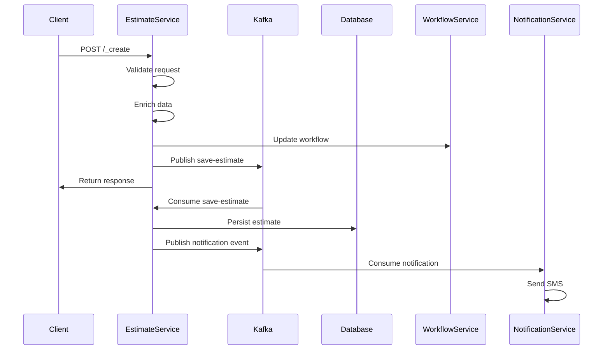

## Execution & Business Flows

### 1. Estimate Creation Flow

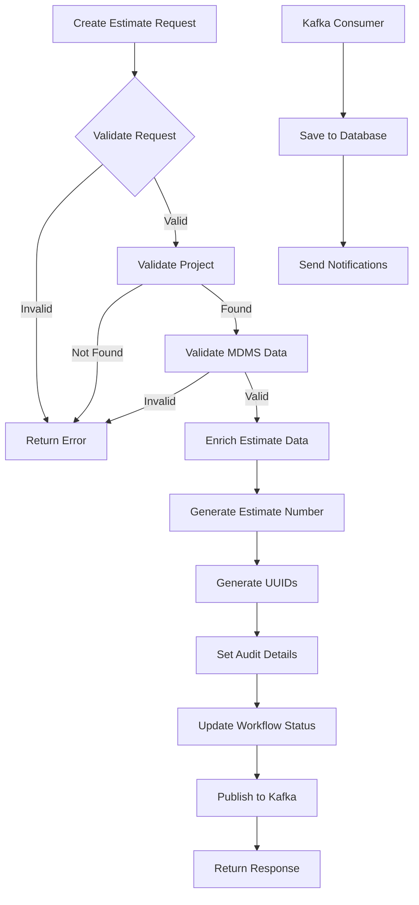

### 2. Estimate Update Flow

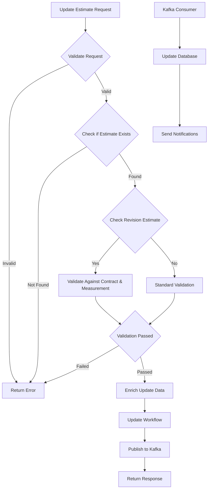

### 3. Estimate Search Flow

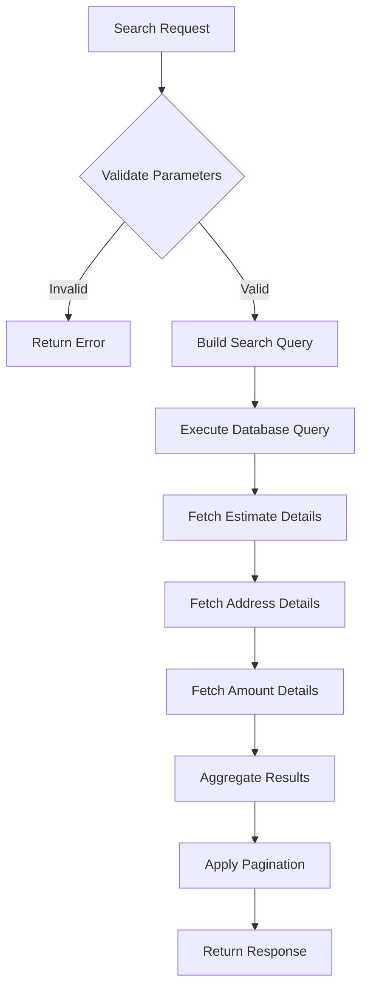

### 4. Revision Estimate Validation Flow

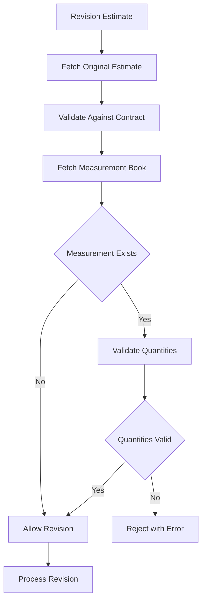

## Security Considerations

### Authentication & Authorization

1. **JWT Token Validation**
   - All APIs require valid JWT token in Authorization header
   - Token validation through `RequestInfo.authToken`
   - Integration with DIGIT user service for token validation

2. **Role-Based Access Control**
   - **ESTIMATE_CREATOR**: Can create and update estimates
   - **ESTIMATE_VERIFIER**: Can verify submitted estimates
   - **ESTIMATE_APPROVER**: Can approve verified estimates
   - **ESTIMATE_VIEWER**: Can search and view estimates

3. **Tenant Isolation**
   - All operations are scoped to tenant ID
   - Cross-tenant data access not allowed
   - Tenant validation against MDMS

### Input Validation

1. **Request Validation**
   - JSON schema validation for all API requests
   - Field length and format validation
   - Required field checks

2. **Business Rule Validation**
   - Project ID existence validation
   - SOR code validation against MDMS
   - UOM validation
   - Quantity calculation validation

3. **SQL Injection Prevention**
   - Parameterized queries for all database operations
   - Input sanitization
   - No dynamic SQL construction

### Data Protection

1. **Sensitive Data Handling**
   - No PII stored in estimate data
   - Audit trail for all operations
   - Data retention policies

2. **Encryption**
   - Database connections use SSL/TLS
   - Kafka messages encrypted in transit
   - Configuration secrets managed securely

## API Flow Diagrams

### 1. Create Estimate API Flow

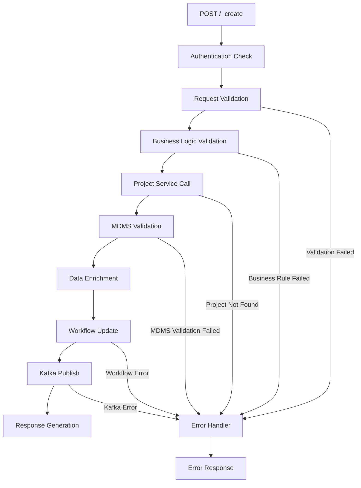

### 2. Update Estimate API Flow

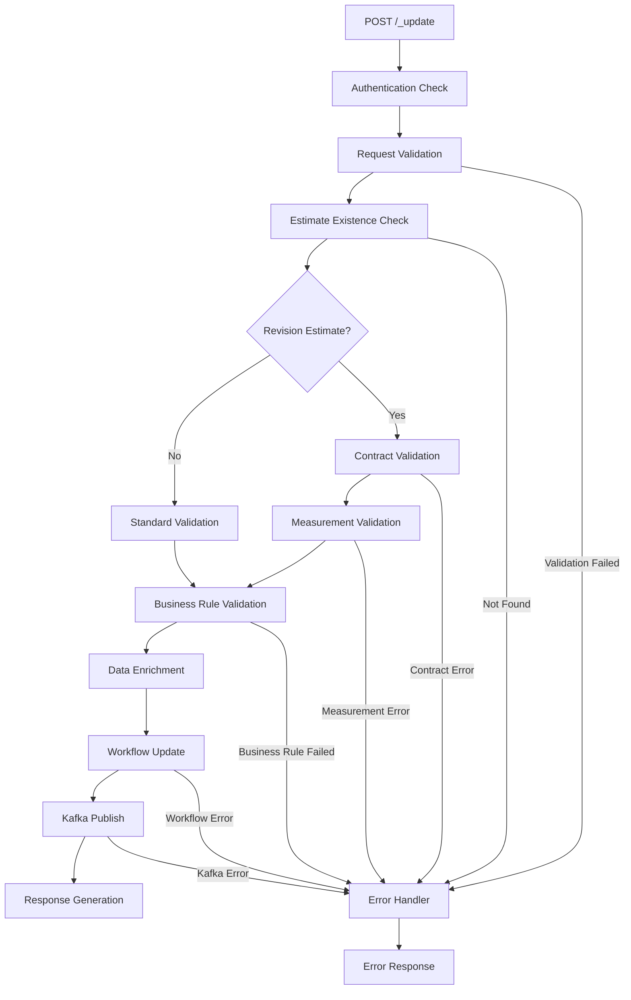

### 3. Search Estimate API Flow

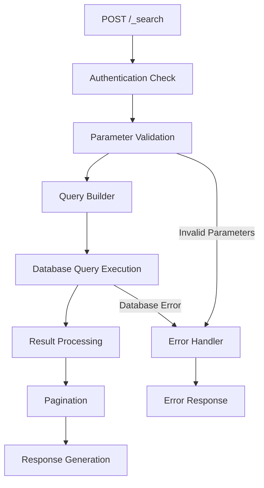

### 4. Workflow Integration Flow

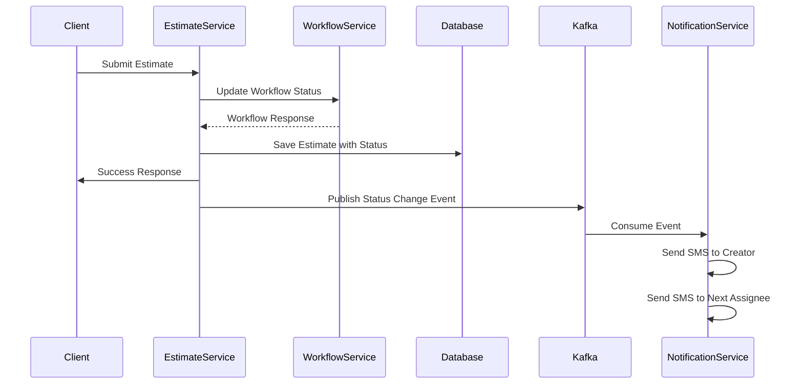

### 5. Error Handling Flow

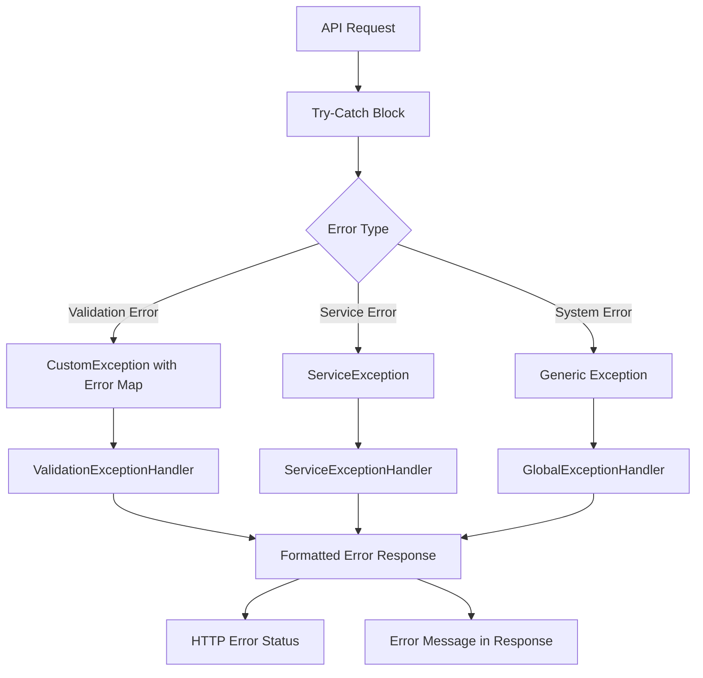

This comprehensive documentation provides detailed insights into the Estimate Service's architecture, APIs, data models, business flows, and technical implementation details.