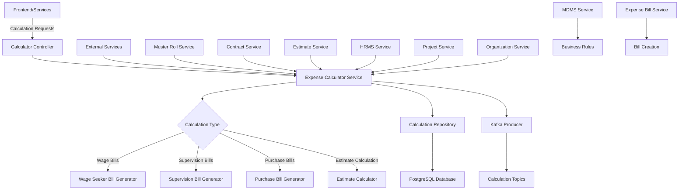
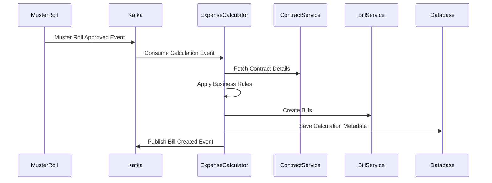
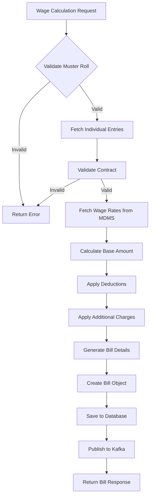
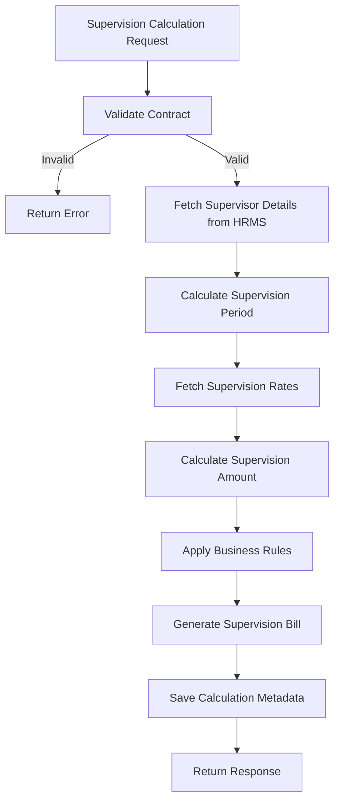
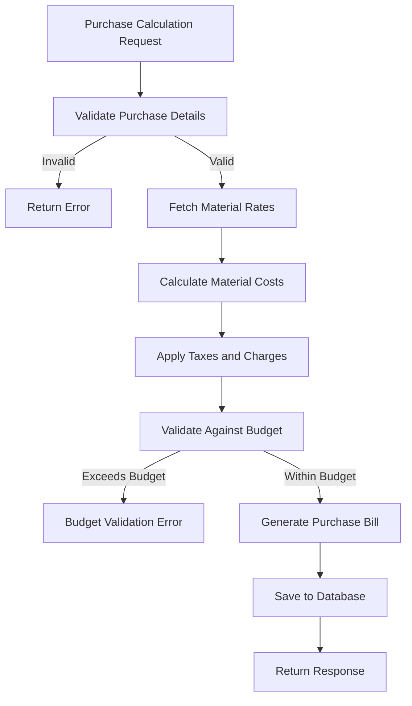
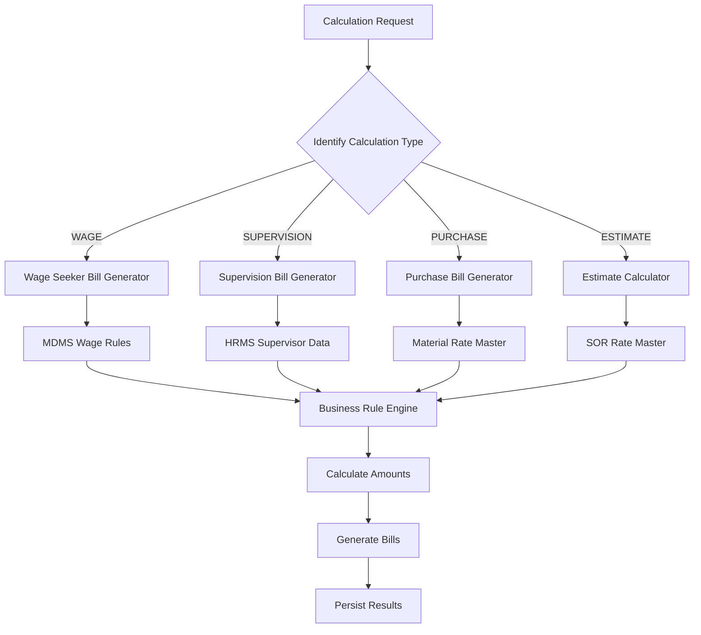
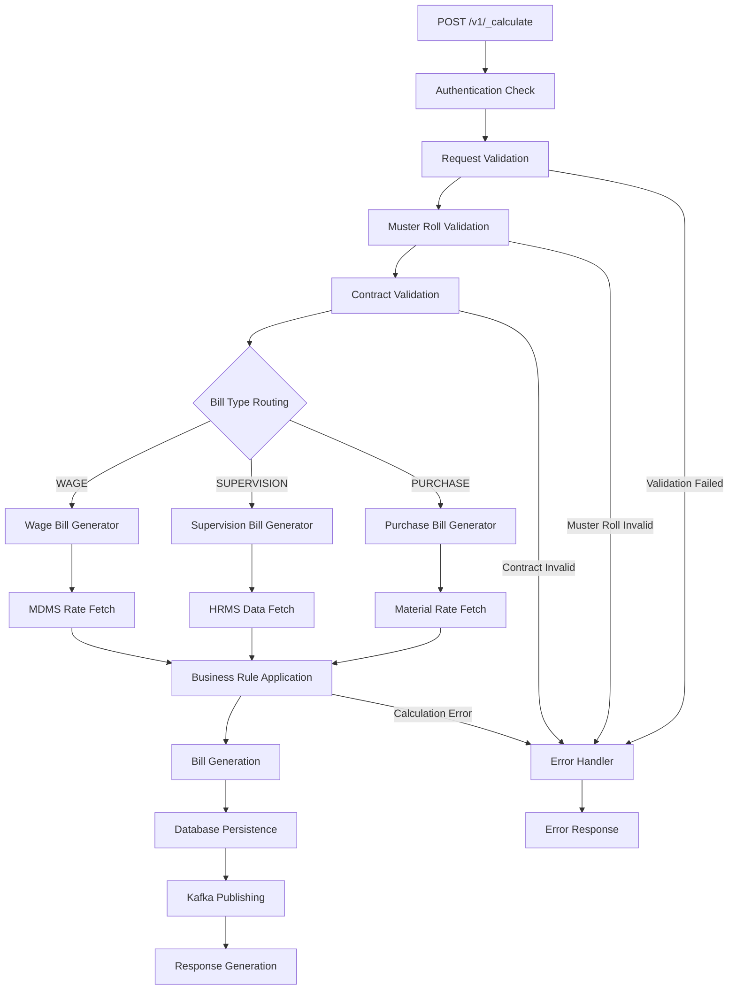
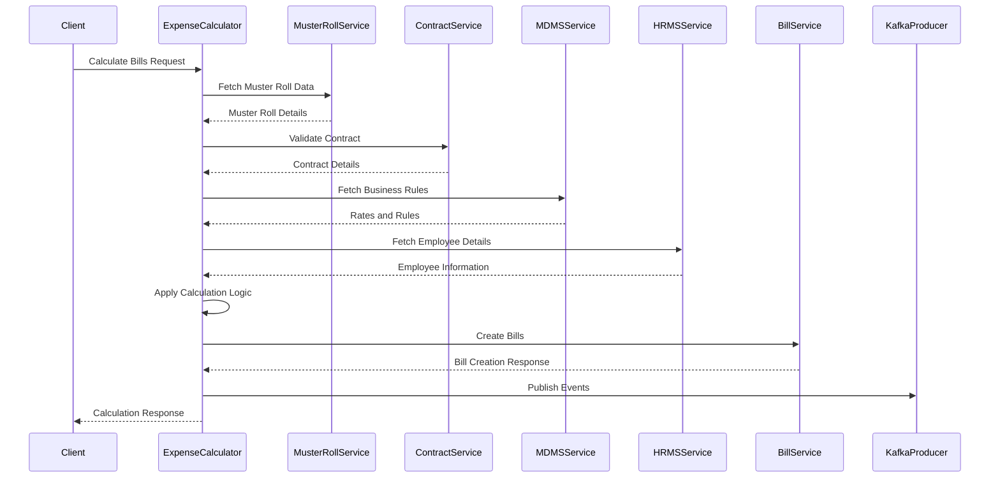
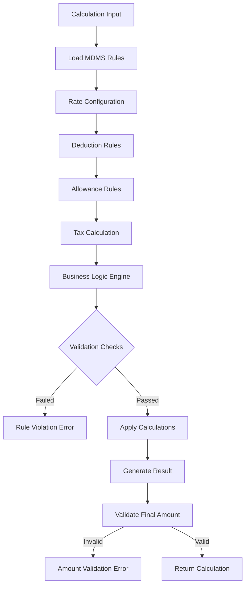

# Expense Calculator Service Documentation

## Table of Contents
1. [System & Architecture Overview](#system--architecture-overview)
2. [API Documentation](#api-documentation)
3. [Domain Models & Data Structures](#domain-models--data-structures)
4. [Database Design](#database-design)
5. [Configuration & Application Properties](#configuration--application-properties)
6. [Service Dependencies](#service-dependencies)
7. [Events & Messaging](#events--messaging)
8. [Execution & Business Flows](#execution--business-flows)
9. [Security Considerations](#security-considerations)
10. [API Flow Diagrams](#api-flow-diagrams)

## System & Architecture Overview

The Expense Calculator Service is a sophisticated Spring Boot microservice that handles complex calculation logic and business rules for expense generation in the DIGIT Works platform. It processes muster rolls, contracts, and estimates to generate accurate wage bills, supervision bills, and purchase bills with comprehensive business rule validation.



### Core Components

- **Calculation Engine**: Multi-type calculation logic (wage, supervision, purchase, estimate)
- **Bill Generators**: Specialized generators for different bill types
- **Business Rule Engine**: MDMS-driven calculation rules and rates
- **Multi-Service Integration**: Coordinate with muster roll, contract, estimate services
- **Kafka Integration**: Event-driven calculation processing
- **Validation Framework**: Comprehensive business rule validation

## API Documentation

### Base URL: `/expense-calculator`

#### 1. Calculate Bills
- **Endpoint**: `POST /v1/_calculate`
- **Description**: Calculates and generates wage or supervision bills based on muster roll data
- **Authentication**: Required (JWT token)

**Request Body**:
```json
{
  "RequestInfo": {
    "apiId": "expense-calculator",
    "ver": "1.0",
    "ts": 1234567890,
    "action": "calculate",
    "did": "1",
    "key": "abcd-efgh",
    "msgId": "calculate request",
    "authToken": "{{token}}"
  },
  "criteria": {
    "tenantId": "od.testing",
    "musterRollId": "muster-roll-uuid",
    "billType": "WAGE",
    "contractNumber": "CT/2023-24/000001",
    "fromDate": 1234567890,
    "toDate": 1234567899,
    "additionalDetails": {}
  },
  "pagination": {
    "limit": 10,
    "offset": 0
  }
}
```

**Response**:
```json
{
  "ResponseInfo": {
    "apiId": "expense-calculator",
    "ver": "1.0",
    "ts": 1234567890,
    "resMsgId": "uief87324",
    "msgId": "calculate request",
    "status": "successful"
  },
  "bills": [
    {
      "id": "bill-uuid",
      "tenantId": "od.testing",
      "billNumber": "WB/2023-24/000001",
      "billType": "WAGE",
      "billCategory": "EXPENSE.WAGES",
      "musterRollNumber": "MR/2023-24/000001",
      "contractNumber": "CT/2023-24/000001",
      "fromPeriod": 1234567890,
      "toPeriod": 1234567899,
      "totalAmount": 15000.00,
      "status": "ACTIVE",
      "billDetails": [
        {
          "id": "bill-detail-uuid",
          "billId": "bill-uuid",
          "payee": {
            "type": "INDIVIDUAL",
            "identifier": "individual-uuid",
            "name": "John Doe"
          },
          "lineItems": [
            {
              "id": "line-item-uuid",
              "type": "PAYABLE",
              "headCode": "WEG",
              "amount": 1500.00,
              "paidAmount": 0.00,
              "quantity": 10.0,
              "unitRate": 150.00,
              "description": "Wage for skilled labor"
            }
          ]
        }
      ],
      "auditDetails": {
        "createdBy": "user-uuid",
        "lastModifiedBy": "user-uuid",
        "createdTime": 1234567890,
        "lastModifiedTime": 1234567890
      }
    }
  ]
}
```

#### 2. Calculate Estimates
- **Endpoint**: `POST /v1/_estimate`
- **Description**: Calculates estimate amounts based on SOR and business rules
- **Authentication**: Required

**Request Body**:
```json
{
  "RequestInfo": {...},
  "criteria": {
    "tenantId": "od.testing",
    "estimateId": "estimate-uuid",
    "contractId": "contract-uuid",
    "sorDetails": [
      {
        "sorId": "SOR001",
        "quantity": 100.0,
        "rate": 150.0,
        "category": "LABOUR"
      }
    ]
  }
}
```

#### 3. Search Bill Mappers
- **Endpoint**: `POST /v1/_search`
- **Description**: Search calculation metadata and bill mapping information
- **Authentication**: Required

#### 4. Purchase Bill Calculation
- **Endpoint**: `POST /purchase/v1/_calculate`
- **Description**: Calculates purchase bills for material expenses
- **Authentication**: Required

### Error Handling

All APIs follow standard error response format:

```json
{
  "ResponseInfo": {
    "apiId": "expense-calculator",
    "ver": "1.0",
    "ts": 1234567890,
    "resMsgId": "uief87324",
    "msgId": "calculate request",
    "status": "failed"
  },
  "Errors": [
    {
      "code": "CALCULATION_ERROR",
      "message": "Bill calculation failed",
      "description": "Muster roll data validation failed"
    }
  ]
}
```

## Domain Models & Data Structures

### Core Entities

#### CalculationRequest
```java
public class CalculationRequest {
    private RequestInfo requestInfo;
    private CalculationCriteria criteria;
    private Pagination pagination;
}
```

#### CalculationCriteria
```java
public class CalculationCriteria {
    private String tenantId;
    private String musterRollId;
    private String billType;
    private String contractNumber;
    private Long fromDate;
    private Long toDate;
    private List<String> musterRollNumbers;
    private Object additionalDetails;
}
```

#### Bill
```java
public class Bill {
    private String id;
    private String tenantId;
    private String billNumber;
    private String billType;
    private String billCategory;
    private String musterRollNumber;
    private String contractNumber;
    private Long fromPeriod;
    private Long toPeriod;
    private Double totalAmount;
    private String status;
    private String wfStatus;
    private List<BillDetail> billDetails;
    private List<Document> documents;
    private Object additionalDetails;
    private Workflow workflow;
    private AuditDetails auditDetails;
}
```

#### BillDetail
```java
public class BillDetail {
    private String id;
    private String billId;
    private Payee payee;
    private List<LineItem> lineItems;
    private Double amount;
    private Object additionalDetails;
    private AuditDetails auditDetails;
}
```

#### LineItem
```java
public class LineItem {
    private String id;
    private String type; // PAYABLE, DEDUCTION
    private String headCode;
    private Double amount;
    private Double paidAmount;
    private Double quantity;
    private Double unitRate;
    private String description;
    private Object additionalDetails;
    private AuditDetails auditDetails;
}
```

#### Calculation (Estimate)
```java
public class Calculation {
    private String id;
    private String tenantId;
    private String estimateId;
    private String contractId;
    private Double totalAmount;
    private List<CalculationDetail> calculationDetails;
    private Object additionalDetails;
    private AuditDetails auditDetails;
}
```

### Bill Types and Categories

#### Bill Types
- **WAGE**: Wage bills for labor payment
- **SUPERVISION**: Supervision bills for oversight charges
- **PURCHASE**: Purchase bills for material procurement

#### Business Services
- **EXPENSE.WAGES**: Wage bill workflow
- **EXPENSE.SUPERVISION**: Supervision bill workflow
- **EXPENSE.PURCHASE**: Purchase bill workflow

### Validation Rules

- **Muster Roll Validation**: Must be approved and within valid period
- **Contract Validation**: Must be active and within execution period
- **Individual Validation**: Must be valid wage seekers or supervisors
- **Rate Validation**: Must match MDMS configured rates
- **Quantity Validation**: Cannot exceed approved muster roll quantities
- **Amount Calculation**: Must follow business rules for deductions and additions

## Database Design

### Tables

#### eg_works_calculation
```sql
CREATE TABLE eg_works_calculation (
    id character varying(128) PRIMARY KEY,
    tenant_id character varying(64) NOT NULL,
    calculation_type character varying(64) NOT NULL,
    reference_id character varying(128),
    total_amount numeric(12,2),
    status character varying(64),
    created_by character varying(64) NOT NULL,
    last_modified_by character varying(64) NOT NULL,
    created_time bigint NOT NULL,
    last_modified_time bigint NOT NULL,
    additional_details JSONB,
    
    CONSTRAINT uk_calculation_reference UNIQUE (reference_id, tenant_id)
);

CREATE INDEX idx_calculation_tenant_id ON eg_works_calculation (tenant_id);
CREATE INDEX idx_calculation_type ON eg_works_calculation (calculation_type);
CREATE INDEX idx_calculation_reference_id ON eg_works_calculation (reference_id);
CREATE INDEX idx_calculation_created_time ON eg_works_calculation (created_time);
```

### Data Flow Architecture

```mermaid
erDiagram
    CALCULATION_REQUEST ||--|| MUSTER_ROLL : references
    CALCULATION_REQUEST ||--|| CONTRACT : validates
    MUSTER_ROLL ||--o{ INDIVIDUAL_ENTRY : contains
    BILL ||--o{ BILL_DETAIL : contains
    BILL_DETAIL ||--o{ LINE_ITEM : includes
    BILL_DETAIL ||--|| PAYEE : pays_to
    
    CALCULATION_REQUEST {
        string tenantId
        string musterRollId
        string billType
        string contractNumber
        long fromDate
        long toDate
    }
    
    BILL {
        string id
        string tenantId
        string billNumber
        string billType
        string musterRollNumber
        double totalAmount
        string status
        audit_details
    }
    
    BILL_DETAIL {
        string id
        string billId
        string payeeType
        string payeeId
        double amount
        audit_details
    }
    
    LINE_ITEM {
        string id
        string type
        string headCode
        double amount
        double quantity
        double unitRate
        string description
    }
```

## Configuration & Application Properties

### Server Configuration
```properties
server.contextPath=/expense-calculator
server.servlet.contextPath=/expense-calculator
server.port=8087
app.timezone=UTC
```

### Database Configuration
```properties
spring.datasource.driver-class-name=org.postgresql.Driver
spring.datasource.url=jdbc:postgresql://localhost:5432/digit-works
spring.datasource.username=egov
spring.datasource.password=egov

spring.flyway.url=jdbc:postgresql://localhost:5432/digit-works
spring.flyway.table=expense_calculator_schema
spring.flyway.baseline-on-migrate=true
spring.flyway.locations=classpath:/db/migration/main
```

### Kafka Configuration
```properties
kafka.config.bootstrap_server_config=localhost:9092
spring.kafka.consumer.group-id=expense-calculator
spring.kafka.producer.key-serializer=org.apache.kafka.common.serialization.StringSerializer
spring.kafka.producer.value-serializer=org.springframework.kafka.support.serializer.JsonSerializer

# Topics
expense.calculator.consume.topic=calculate-musterroll
expense.calculator.create.topic=save-calculator
expense.calculator.error.topic=calculate-error
expense.calculator.create.bill.topic=calculate-billmeta
expense.billing.bill.create=expense-bill-create
expense.billing.bill.update=expense-bill-update
expense.billing.bill.index=expense-bill-index-topic
```

### External Service URLs
```properties
# Muster Roll Service
egov.musterroll.host=https://works-dev.digit.org
egov.musterroll.search.endpoint=/muster-roll/v1/_search

# Contract Service
egov.contract.service.host=https://works-dev.digit.org/
egov.contract.service.search.endpoint=/contract/v1/_search

# Estimate Service
works.estimate.host=http://localhost:8288
works.estimate.search.endpoint=/estimate/v1/_search

# Project Service
project.service.host=https://works-dev.digit.org/
project.search.path=project/v1/_search

# HRMS Service
egov.hrms.host=https://works-dev.digit.org
egov.hrms.search.endpoint=/egov-hrms/employees/_search

# Organization Service
egov.organisation.host=https://works-dev.digit.org
egov.organisation.endpoint=/org-services/organisation/v1/_search

# Bill Service
egov.bill.host=https://works-dev.digit.org
egov.bill.create.endpoint=/expense/bill/v1/_create
egov.bill.update.endpoint=/expense/bill/v1/_update
egov.expense.bill.service.search.endpoint=/expense/bill/v1/_search

# User Service
egov.user.host=https://works-dev.digit.org
egov.user.search.path=/user/_search
```

### Business Configuration
```properties
# Expense Business Rules
egov.works.expense.wage.head.code=WEG
egov.works.expense.payer.type=ULB
egov.works.expense.wage.labour.charge.unit=day
egov.works.expense.payee.type=INDIVIDUAL
egov.works.expense.wage.business.service=EXPENSE.WAGES
egov.works.expense.purchase.business.service=EXPENSE.PURCHASE
egov.works.expense.supervision.business.service=EXPENSE.SUPERVISION

# Master Data Categories
works.wages.master.category=works.wages

# ID Generation Formats
egov.works.expense.purchasebill.referenceId.format=purchase.reference.number
egov.works.expense.superbill.referenceId.format=supervision.reference.number
egov.works.expense.wagebill.referenceId.format=wage.reference.number

# Search Configuration
expense.billing.default.limit=100
expense.billing.default.offset=0
expense.billing.search.max.limit=200
```

## Service Dependencies

### Internal DIGIT Services

1. **Muster Roll Service** (`egov.musterroll.host`)
   - **Purpose**: Fetch muster roll data for wage calculations
   - **APIs Used**: `/muster-roll/v1/_search`
   - **Usage**: Retrieve attendance and individual entry data

2. **Contract Service** (`egov.contract.service.host`)
   - **Purpose**: Validate contracts and fetch contract details
   - **APIs Used**: `/contract/v1/_search`
   - **Usage**: Contract validation and rate information

3. **Estimate Service** (`works.estimate.host`)
   - **Purpose**: Estimate calculations and validations
   - **APIs Used**: `/estimate/v1/_search`
   - **Usage**: SOR-based calculations and estimate validations

4. **HRMS Service** (`egov.hrms.host`)
   - **Purpose**: Employee and supervisor validation
   - **APIs Used**: `/egov-hrms/employees/_search`
   - **Usage**: Validate supervisors and calculate supervision charges

5. **Organization Service** (`egov.organisation.host`)
   - **Purpose**: Organization details for bill generation
   - **APIs Used**: `/org-services/organisation/v1/_search`
   - **Usage**: Organization information for bill headers

6. **MDMS Service** (`egov.mdms.host`)
   - **Purpose**: Business rules and master data for calculations
   - **APIs Used**: `/egov-mdms-service/v1/_search`
   - **Usage**: Wage rates, deduction rules, calculation formulas

7. **Expense Bill Service** (`egov.bill.host`)
   - **Purpose**: Bill creation and management
   - **APIs Used**: `/expense/bill/v1/_create`, `/expense/bill/v1/_update`
   - **Usage**: Create and update expense bills

### External Dependencies

1. **PostgreSQL Database**
   - **Purpose**: Calculation metadata and bill mapping storage
   - **Connection**: JDBC connection pool
   - **Usage**: Store calculation results and audit trails

2. **Kafka Message Broker**
   - **Purpose**: Asynchronous calculation processing
   - **Topics**: Multiple calculation and bill processing topics
   - **Usage**: Event-driven calculation workflow

## Events & Messaging

### Kafka Topics

#### 1. calculate-musterroll
- **Purpose**: Trigger bill calculations based on muster roll approval
- **Producer**: Muster Roll Service
- **Consumer**: Expense Calculator Service

#### 2. save-calculator
- **Purpose**: Persist calculation results
- **Producer**: Expense Calculator Service
- **Consumer**: Expense Calculator Service

#### 3. calculate-billmeta
- **Purpose**: Create bill metadata
- **Producer**: Expense Calculator Service
- **Consumer**: Bill processing services

### Event Processing Patterns

#### Calculation Flow


## Execution & Business Flows

### 1. Wage Bill Calculation Flow



### 2. Supervision Bill Calculation Flow



### 3. Purchase Bill Calculation Flow



### 4. Multi-Type Calculation Engine



## Security Considerations

### Authentication & Authorization

1. **JWT Token Validation**
   - All APIs require valid JWT token
   - Token validation through `RequestInfo.authToken`
   - Integration with DIGIT user service

2. **Role-Based Access Control**
   - **EXPENSE_CALCULATOR**: Can perform calculations
   - **BILL_APPROVER**: Can approve calculated bills
   - **FINANCE_OFFICER**: Can view calculation details
   - **ADMIN**: Full access to calculation services

3. **Tenant Isolation**
   - All calculations scoped to tenant ID
   - Cross-tenant calculation data access not allowed
   - Contract and muster roll validation within tenant

### Input Validation

1. **Request Validation**
   - JSON schema validation for calculation requests
   - Business rule validation for calculation parameters
   - Amount and quantity validation

2. **Business Rule Validation**
   - Muster roll approval status validation
   - Contract validity period validation
   - Individual eligibility validation
   - Rate consistency validation with MDMS

3. **Calculation Validation**
   - Mathematical precision validation
   - Business rule compliance checking
   - Amount limit validation

### Data Protection

1. **Calculation Security**
   - Encrypted storage of calculation metadata
   - Audit trail for all calculations
   - Rate tampering prevention

2. **Financial Data Protection**
   - Secure handling of wage and payment data
   - PII protection for individual wage seekers
   - Compliance with financial data regulations

## API Flow Diagrams

### 1. Calculate Bills API Flow



### 2. Multi-Service Integration Flow



### 3. Business Rule Engine Flow



This comprehensive documentation provides detailed insights into the Expense Calculator Service's calculation engine, multi-type bill generation, business rule framework, and complex multi-service integration for accurate financial calculations in DIGIT Works platform.