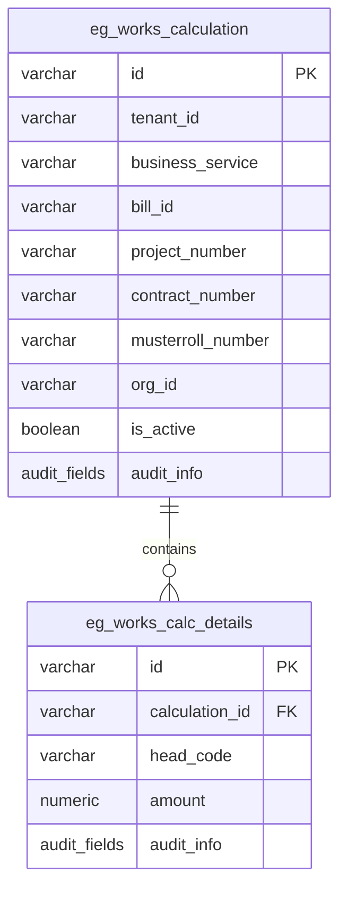
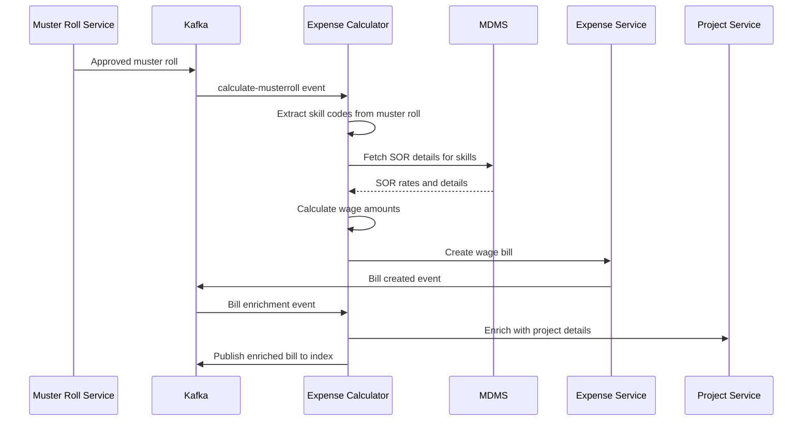
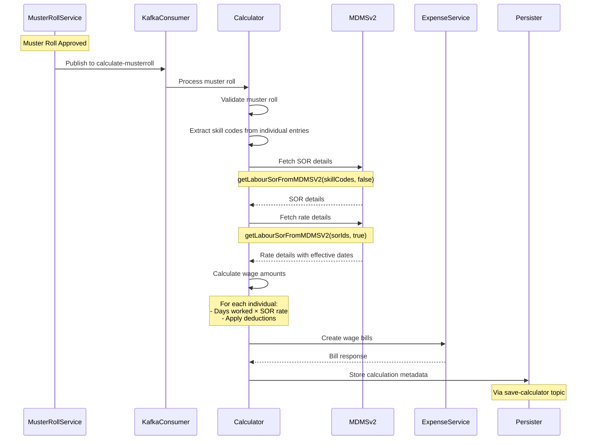
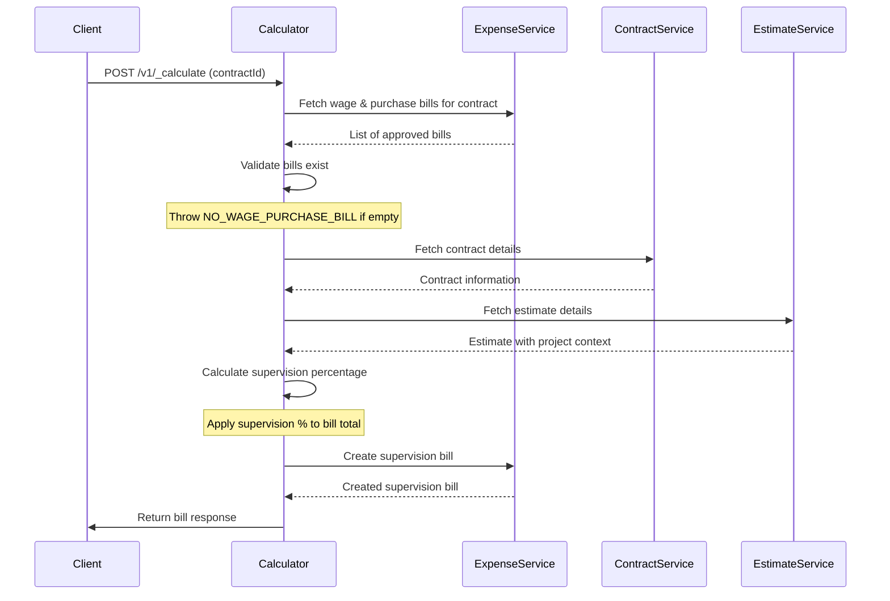
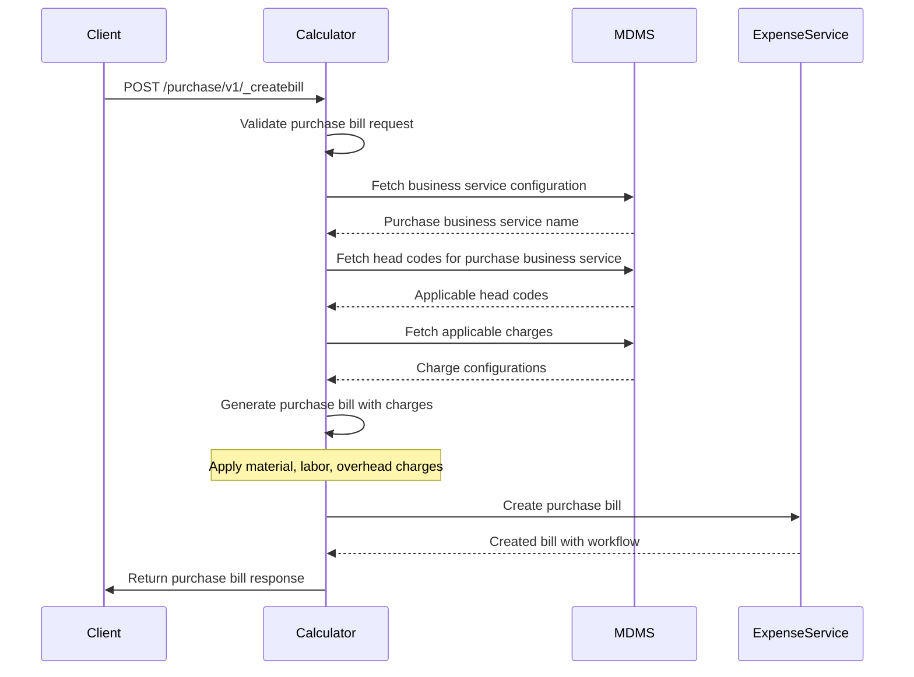
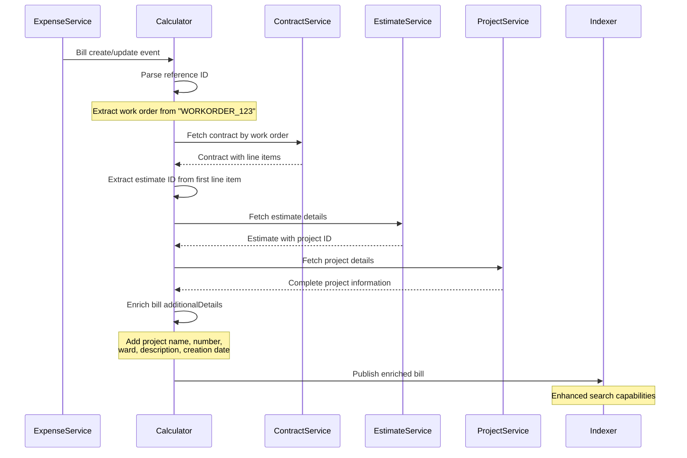
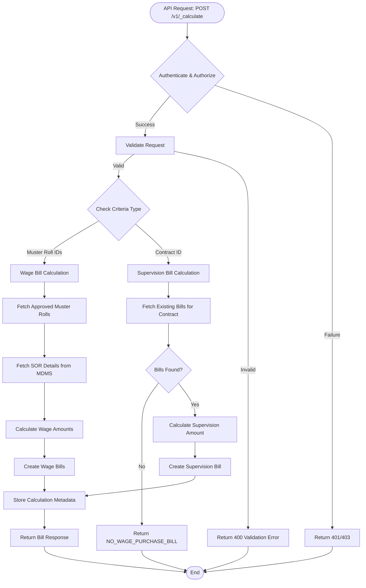
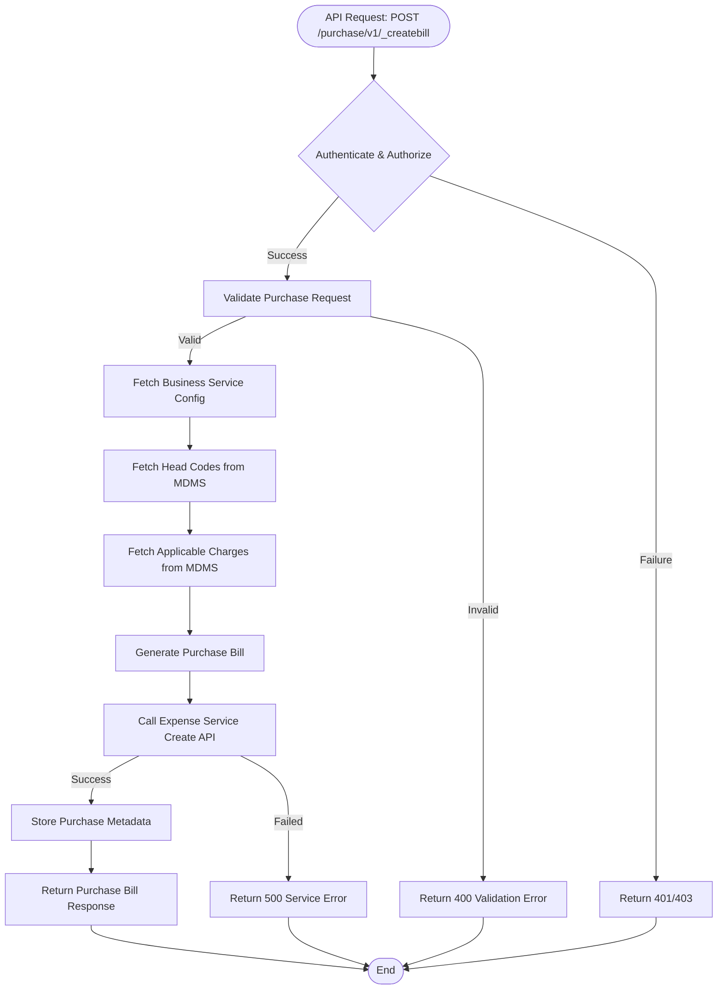

# Expense Calculator Service - Technical Documentation

## Table of Contents
1. [System & Architecture Overview](#system--architecture-overview)
2. [API Documentation](#api-documentation)
3. [Domain Models & Data Structures](#domain-models--data-structures)
4. [Database Design](#database-design)
5. [Configuration & Application Properties](#configuration--application-properties)
6. [Service Dependencies](#service-dependencies)
7. [Events & Messaging](#events--messaging)
8. [Execution & Business Flows](#execution--business-flows)
9. [Security Considerations](#security-considerations)
10. [API Flow Diagrams](#api-flow-diagrams)

## System & Architecture Overview

The Expense Calculator Service is the business logic engine for bill calculation and generation in the DIGIT Works platform. Built on Spring Boot 3.2.2 with Java 17, it processes muster rolls, generates wage bills, calculates supervision bills, and manages purchase bill calculations with complex business rules and integrations.

### High-Level Architecture

```mermaid
graph TB
    subgraph "Expense Calculator Service"
        API[Calculator API Controller]
        CalcService[Expense Calculator Service]
        WageGen[Wage Bill Generator]
        PurchaseGen[Purchase Bill Generator] 
        SuperGen[Supervision Bill Generator]
        Validator[Calculator Validator]
        Enrichment[Calculator Enrichment]
        Repository[Calculator Repository]
        MetaMapper[Bill Meta Mapper]
    end
    
    subgraph "External Services"
        ExpenseService[Expense Service]
        MusterRoll[Muster Roll Service]
        Contract[Contract Service]
        Estimate[Estimate Service]
        Project[Project Service]
        MDMS[MDMS Service]
        MDMSv2[MDMS v2 Service]
        IDGen[ID Generation Service]
        Organization[Organization Service]
        Individual[Individual Service]
        HRMS[HRMS Service]
    end
    
    subgraph "Infrastructure"
        PostgreSQL[(PostgreSQL Database)]
        Kafka[Kafka Topics]
        Redis[(Redis Cache)]
    end
    
    API --> CalcService
    CalcService --> WageGen
    CalcService --> PurchaseGen
    CalcService --> SuperGen
    CalcService --> Validator
    CalcService --> Enrichment
    CalcService --> Repository
    CalcService --> MetaMapper
    
    Repository --> PostgreSQL
    CalcService --> Kafka
    CalcService --> Redis
    
    CalcService --> ExpenseService
    CalcService --> MusterRoll
    CalcService --> Contract
    CalcService --> Estimate
    CalcService --> Project
    CalcService --> MDMS
    CalcService --> MDMSv2
    CalcService --> IDGen
    CalcService --> Organization
    CalcService --> Individual
    CalcService --> HRMS
```



### Component Responsibilities

- **Calculator Controller**: REST API endpoints for calculation operations
- **Expense Calculator Service**: Core business logic orchestration
- **Wage Bill Generator**: Processes muster rolls and generates wage seeker bills
- **Purchase Bill Generator**: Creates and manages purchase bills with applicable charges
- **Supervision Bill Generator**: Calculates supervision bills based on other bills
- **Validator**: Input validation and business rule enforcement
- **Enrichment**: Data enrichment with external service integration
- **Repository**: Calculator metadata storage and search
- **Meta Mapper**: Maps bill data to metadata for tracking

### Key Features

1. **Multi-Bill Type Support**: Wage, Purchase, and Supervision bills
2. **Automatic Bill Generation**: Kafka-driven automatic wage bill creation
3. **Complex Calculations**: SOR-based wage calculations with deductions
4. **Project Enrichment**: Enriches bills with comprehensive project context
5. **Metadata Tracking**: Maintains calculation history and bill relationships
6. **Search Capabilities**: Flexible search across projects and bills

## API Documentation

### Base Information
- **Context Path**: `/expense-calculator`
- **Port**: `8087`
- **API Version**: `v1`

### Authentication & Authorization
- Uses JWT token-based authentication
- Role-based access control for calculation operations
- Tenant-based data isolation

### REST Endpoints

#### Calculator APIs

##### 1. Calculate Bills

**Endpoint**: `POST /expense-calculator/works-calculator/v1/_calculate`

**Description**: Calculates and creates wage or supervision bills based on criteria.

**Request Schema**:
```json
{
  "RequestInfo": {
    "apiId": "expense-calculator",
    "ver": "1.0",
    "ts": "timestamp",
    "action": "calculate",
    "userInfo": {...}
  },
  "criteria": {
    "tenantId": "string (required)",
    "musterRollId": ["string"], // For wage bills
    "contractId": "string"      // For supervision bills
  }
}
```

##### 2. Estimate Bills

**Endpoint**: `POST /expense-calculator/works-calculator/v1/_estimate`

**Description**: Estimates bill amounts without creating actual bills.

**Request Schema**: Same as calculate with estimation flag.

##### 3. Search Calculations

**Endpoint**: `POST /expense-calculator/works-calculator/v1/_search`

**Description**: Searches calculation history and bill metadata.

**Request Schema**:
```json
{
  "RequestInfo": {},
  "searchCriteria": {
    "tenantId": "string (required)",
    "projectName": "string",
    "boundary": "string",
    "projectNumbers": ["string"],
    "billIds": ["string"]
  },
  "pagination": {
    "limit": "number",
    "offset": "number"
  }
}
```

#### Purchase Bill APIs

##### 1. Create Purchase Bill

**Endpoint**: `POST /expense-calculator/purchase/v1/_createbill`

**Description**: Creates a purchase bill with applicable charges.

**Request Schema**:
```json
{
  "RequestInfo": {...},
  "bill": {
    "tenantId": "string (required)",
    "invoiceNumber": "string (required)",
    "invoiceDate": "bigint",
    "vendorId": "string (required)",
    "totalAmount": "bigDecimal (required)",
    "description": "string",
    "documents": [
      {
        "fileStore": "string",
        "documentType": "string"
      }
    ]
  },
  "workflow": {
    "action": "string (required)",
    "comment": "string"
  }
}
```

##### 2. Update Purchase Bill

**Endpoint**: `POST /expense-calculator/purchase/v1/_updatebill`

**Description**: Updates an existing purchase bill.

**Request Schema**: Same as create with required `id` field.

### Response Schemas

#### Calculation Response
```json
{
  "ResponseInfo": {...},
  "calculation": {
    "tenantId": "string",
    "estimates": [
      {
        "tenantId": "string",
        "calcDetails": [
          {
            "headCode": "string",
            "amount": "bigDecimal"
          }
        ]
      }
    ]
  }
}
```

#### Bill Response
```json
{
  "ResponseInfo": {...},
  "bills": [
    {
      "id": "string",
      "billNumber": "string",
      "referenceId": "string",
      "totalAmount": "bigDecimal",
      "businessService": "EXPENSE.WAGES|EXPENSE.PURCHASE|EXPENSE.SUPERVISION",
      "status": "ACTIVE|INACTIVE|INWORKFLOW"
    }
  ]
}
```

### Error Handling

**Common Error Codes**:
- `NO_WAGE_PURCHASE_BILL`: Required bills not found for supervision calculation
- `NO_CALCULATION_DETAIL`: No calculation details found for bills
- `SOR_NOT_FOUND`: Schedule of Rates not found in MDMS
- `NO_SOR_FOUND`: No SOR found for skill codes
- `MUSTER_ROLL_NOT_FOUND`: Muster roll not found or not approved

## Domain Models & Data Structures

### Core Domain Models

#### Calculation Entity
```java
public class Calculation {
    private String tenantId;                    // Required
    private List<CalcEstimate> estimates;       // Calculation estimates
}
```

#### CalcEstimate Entity
```java
public class CalcEstimate {
    private String tenantId;                    // Required
    private List<CalcDetail> calcDetails;       // Calculation details
}
```

#### CalcDetail Entity
```java
public class CalcDetail {
    private String headCode;                    // Required (from MDMS)
    private BigDecimal amount;                  // Required
}
```

#### Criteria Entity
```java
public class Criteria {
    private String tenantId;                    // Required
    private List<String> musterRollId;          // For wage bill calculation
    private String contractId;                  // For supervision bill calculation
}
```

#### PurchaseBill Entity
```java
public class PurchaseBill {
    private String id;                          // UUID
    private String tenantId;                    // Required
    private String invoiceNumber;               // Required
    private BigDecimal invoiceDate;             // Required
    private String vendorId;                    // Required
    private BigDecimal totalAmount;             // Required
    private String description;                 // Optional
    private List<Document> documents;           // Supporting documents
    private Object additionalDetails;           // Extensible metadata
}
```

#### SorDetail Entity
```java
public class SorDetail {
    private String id;                          // SOR ID
    private String code;                        // SOR code
    private String description;                 // SOR description
    private List<RateDetail> rateDetails;       // Rate information
}
```

#### RateDetail Entity  
```java
public class RateDetail {
    private String id;                          // Rate ID
    private String sorId;                       // Reference to SOR
    private BigDecimal rate;                    // Rate value
    private BigDecimal validFrom;               // Effective from date
    private BigDecimal validTo;                 // Effective to date
}
```

### Calculator Metadata Models

#### BillMapper Entity
```java
public class BillMapper {
    private String billId;                      // Bill ID
    private String projectId;                   // Project reference
    private String projectNumber;               // Project number
    private String contractNumber;              // Contract number
    private String musterrollNumber;            // Muster roll number
    private String orgId;                       // Organization ID
    private Bill bill;                          // Associated bill object
}
```

### Business Service Configurations

```java
public class BusinessService {
    private String code;                        // Business service code
    private String businessService;             // Actual business service name
}
```

### Enums

```java
public enum BillType {
    EXPENSE_WAGES("EXPENSE.WAGES"),
    EXPENSE_PURCHASE("EXPENSE.PURCHASE"), 
    EXPENSE_SUPERVISION("EXPENSE.SUPERVISION");
}
```

## Database Design

### Tables Overview

#### eg_works_calculation
Stores calculation metadata for bill tracking.

```sql
CREATE TABLE eg_works_calculation (
    id                      VARCHAR(256) PRIMARY KEY,
    tenant_id               VARCHAR(64) NOT NULL,
    business_service        VARCHAR(128),
    bill_id                 VARCHAR(256) NOT NULL,
    bill_number             VARCHAR(128),
    bill_reference          VARCHAR(128),
    contract_number         VARCHAR(128),
    musterroll_number       VARCHAR(128),
    project_number          VARCHAR(128),
    org_id                  VARCHAR(256),
    is_active               BOOLEAN DEFAULT TRUE,
    additional_details      JSONB,
    created_by              VARCHAR(256) NOT NULL,
    last_modified_by        VARCHAR(256),
    created_time            BIGINT NOT NULL,
    last_modified_time      BIGINT NOT NULL
);
```

#### eg_works_calc_details
Stores calculation detail metadata.

```sql
CREATE TABLE eg_works_calc_details (
    id                      VARCHAR(256) PRIMARY KEY,
    calculation_id          VARCHAR(256) NOT NULL,
    head_code               VARCHAR(128),
    amount                  NUMERIC(12,2),
    additional_details      JSONB,
    created_by              VARCHAR(256) NOT NULL,
    last_modified_by        VARCHAR(256),
    created_time            BIGINT NOT NULL,
    last_modified_time      BIGINT NOT NULL,
    FOREIGN KEY (calculation_id) REFERENCES eg_works_calculation (id)
);
```

### Entity Relationship Diagram



### Indexes and Performance

**Primary Indexes**:
- `eg_works_calculation`: id, bill_id
- `eg_works_calc_details`: id, calculation_id (FK)

**Secondary Indexes**:
- `index_eg_works_calculation_tenantId`
- `index_eg_works_calculation_projectNumber`
- `index_eg_works_calculation_contractNumber`
- `index_eg_works_calculation_billId`

## Configuration & Application Properties

### Environment-Specific Configuration

```properties
# Server Configuration
server.contextPath=/expense-calculator
server.port=8087
app.timezone=UTC

# Database Configuration
spring.datasource.driver-class-name=org.postgresql.Driver
spring.datasource.url=jdbc:postgresql://localhost:5432/digit-works
spring.datasource.username=postgres
spring.datasource.password=1234

# Flyway Migration
spring.flyway.table=expense_calculator_schema
spring.flyway.baseline-on-migrate=true
spring.flyway.enabled=true

# Kafka Configuration
kafka.config.bootstrap_server_config=localhost:9092
spring.kafka.consumer.group-id=expense-calculator
spring.kafka.producer.value-serializer=org.springframework.kafka.support.serializer.JsonSerializer

# Kafka Topics
expense.calculator.consume.topic=calculate-musterroll
expense.calculator.create.topic=save-calculator
expense.calculator.error.topic=calculate-error
expense.calculator.create.bill.topic=calculate-billmeta
expense.billing.bill.index=expense-bill-index-topic

# External Service URLs
egov.bill.host=https://unified-dev.digit.org
egov.bill.create.endpoint=/expense/bill/v1/_create
egov.bill.update.endpoint=/expense/bill/v1/_update
egov.expense.bill.service.search.endpoint=/expense/bill/v1/_search

egov.musterroll.host=https://unified-dev.digit.org
egov.musterroll.search.endpoint=/muster-roll/v1/_search

egov.contract.service.host=https://unified-dev.digit.org/
egov.contract.service.search.endpoint=/contract/v1/_search

works.estimate.host=http://localhost:8288
works.estimate.search.endpoint=/estimate/v1/_search

project.service.host=https://unified-dev.digit.org/
project.search.path=project/v1/_search

egov.organisation.host=https://unified-dev.digit.org
egov.organisation.endpoint=/org-services/organisation/v1/_search

# MDMS Configuration
egov.mdms.host=https://unified-dev.digit.org
egov.mdms.search.endpoint=/egov-mdms-service/v1/_search
egov.mdms.V2.host=https://unified-dev.digit.org
egov.mdms.search.V2.endpoint=/mdms-v2/v1/_search

# ID Generation
egov.idgen.host=https://unified-dev.digit.org/
egov.idgen.supervision.reference.number=supervision.reference.number

# Business Service Configuration
egov.works.expense.wage.head.code=WEG
egov.works.expense.payer.type=ULB
egov.works.expense.wage.payee.type=INDIVIDUAL
egov.works.expense.wage.business.service=EXPENSE.WAGES
egov.works.expense.purchase.business.service=EXPENSE.PURCHASE
egov.works.expense.supervision.business.service=EXPENSE.SUPERVISION

# Search Configuration
expense.billing.default.limit=100
expense.billing.default.offset=0
expense.billing.search.max.limit=200
```

### Feature Flags

- `is.workflow.enabled`: Enable/disable workflow integration
- `notification.sms.enabled`: Enable SMS notifications for supervision bills

## Service Dependencies

### External Services Used

#### 1. Expense Service
- **Purpose**: Create and update bills, search existing bills
- **Host**: `egov.bill.host`
- **Endpoints**:
  - `/expense/bill/v1/_create`
  - `/expense/bill/v1/_update`
  - `/expense/bill/v1/_search`

#### 2. Muster Roll Service
- **Purpose**: Fetch approved muster rolls for wage calculation
- **Host**: `egov.musterroll.host`
- **Endpoint**: `/muster-roll/v1/_search`

#### 3. Contract Service
- **Purpose**: Fetch contract details for supervision calculation
- **Host**: `egov.contract.service.host`
- **Endpoint**: `/contract/v1/_search`

#### 4. Estimate Service
- **Purpose**: Retrieve estimate details for project enrichment
- **Host**: `works.estimate.host`
- **Endpoint**: `/estimate/v1/_search`

#### 5. Project Service
- **Purpose**: Get comprehensive project details for enrichment
- **Host**: `project.service.host`
- **Endpoint**: `/project/v1/_search`

#### 6. MDMS Service (V1 & V2)
- **Purpose**: Master data for SOR, rates, head codes, business services
- **V1 Host**: `egov.mdms.host`
- **V2 Host**: `egov.mdms.V2.host`
- **Data Retrieved**:
  - Schedule of Rates (SOR)
  - Rate details with effective dates
  - Head codes for bill line items
  - Business service configurations
  - Applicable charges

#### 7. Organization Service
- **Purpose**: Organization details for bills
- **Host**: `egov.organisation.host`
- **Endpoint**: `/org-services/organisation/v1/_search`

### Libraries and Frameworks

- **Spring Boot 3.2.2**: Core framework
- **Jackson**: JSON processing with ObjectMapper
- **Apache Kafka**: Event-driven architecture
- **PostgreSQL Driver**: Database connectivity
- **Lombok**: Code generation
- **Works Services Common**: Shared models and utilities

## Events & Messaging

### Kafka Topics Used

#### Consumer Topics

1. **calculate-musterroll**
   - **Purpose**: Automatic wage bill generation from approved muster rolls
   - **Producer**: Muster Roll Service
   - **Consumer**: ExpenseCalculatorConsumer.listen()
   - **Payload**: MusterRollRequest
   - **Business Logic**:
     - Validates muster roll status
     - Fetches SOR details from MDMS v2
     - Calculates wage amounts based on attendance and rates
     - Creates wage bills via Expense Service
     - Stores calculation metadata

2. **expense-bill-create / expense-bill-update**
   - **Purpose**: Bill enrichment with project details
   - **Producer**: Expense Service
   - **Consumer**: ExpenseCalculatorConsumer.listenBill()
   - **Payload**: BillRequest
   - **Business Logic**:
     - Extracts work order number from reference ID
     - Fetches contract details via Contract Service
     - Retrieves estimate information via Estimate Service
     - Gets project details via Project Service
     - Enriches bill with comprehensive project context
     - Re-publishes enriched bill to index topic

#### Producer Topics

1. **save-calculator**
   - **Purpose**: Calculation metadata persistence
   - **Producer**: ExpenseCalculatorService
   - **Consumers**: Persister Service
   - **Payload**: BillMetaRecords

2. **calculate-error**
   - **Purpose**: Error handling for failed calculations
   - **Producer**: ExpenseCalculatorConsumer
   - **Consumers**: Error handling service
   - **Payload**: MusterRollConsumerError

3. **expense-bill-index-topic**
   - **Purpose**: Enriched bill indexing
   - **Producer**: ExpenseCalculatorService.processBillForAdditionalDetailsEnrichment()
   - **Consumers**: Indexer Service
   - **Payload**: BillRequest (enriched with project details)

### Event Processing Flow



## Execution & Business Flows

### Key Business Flows

#### 1. Automatic Wage Bill Generation Flow



#### 2. Supervision Bill Calculation Flow



#### 3. Purchase Bill Creation Flow



#### 4. Bill Enrichment Flow



### Business Rules and Calculations

#### Wage Bill Calculation Rules

1. **SOR Rate Application**: 
   - Fetch SOR rates based on skill codes from muster roll individual entries
   - Use rates valid for the muster roll period
   - Apply daily rates based on attendance entries

2. **Amount Calculation**:
   ```java
   grossWage = daysWorked × sorRate
   deductions = calculateDeductions(grossWage)
   netWage = grossWage - deductions
   ```

3. **Head Code Mapping**:
   - Wage payments: Use configured wage head code (WEG)
   - Deductions: Use specific head codes for PF, ESI, TDS

#### Supervision Bill Calculation Rules

1. **Base Calculation**: Sum of approved wage and purchase bills for contract
2. **Supervision Rate**: Configurable percentage from MDMS  
3. **Final Amount**: Base amount × supervision percentage

#### Purchase Bill Rules

1. **Applicable Charges**: Retrieved from MDMS based on business service
2. **Head Code Assignment**: Based on charge type (material, labor, overhead)
3. **Total Calculation**: Invoice amount + applicable charges

### Error Handling

1. **SOR Not Found**: When skill codes don't match any SOR in MDMS
2. **No Bills Found**: When contract has no wage/purchase bills for supervision
3. **Calculation Failure**: When calculation details are empty
4. **Service Integration**: When external services are unavailable

## Security Considerations

### Authentication & Authorization
- **JWT Token Validation**: Required for all calculation endpoints
- **Role-based Access**: Calculator operations require appropriate roles
- **Tenant Isolation**: All calculations scoped to tenant context

### Data Security
- **Sensitive Data**: Financial calculations handled securely
- **Audit Trail**: Complete audit log of all calculations
- **Integration Security**: Secure communication with all external services

### Business Logic Security
- **Validation**: Comprehensive validation of all calculation inputs
- **Rate Validation**: Ensures SOR rates are current and valid
- **Amount Validation**: Prevents negative or invalid amounts

## API Flow Diagrams

### Calculate Bills API Flow



### Purchase Bill Creation API Flow



---

*This documentation reflects the actual implementation of the Expense Calculator Service in the DIGIT Works platform, including the sophisticated bill calculation logic, project enrichment capabilities, and comprehensive integration patterns.*