# Expense Service - Technical Documentation

## Table of Contents
1. [System & Architecture Overview](#system--architecture-overview)
2. [API Documentation](#api-documentation)
3. [Domain Models & Data Structures](#domain-models--data-structures)
4. [Database Design](#database-design)
5. [Configuration & Application Properties](#configuration--application-properties)
6. [Service Dependencies](#service-dependencies)
7. [Events & Messaging](#events--messaging)
8. [Execution & Business Flows](#execution--business-flows)
9. [Security Considerations](#security-considerations)
10. [API Flow Diagrams](#api-flow-diagrams)

---

## System & Architecture Overview

The Expense Service is a microservice-based solution consisting of two main components:

### Core Components

#### 1. Expense Service (`/backend/expense`)
- **Primary Responsibility**: Manages bills and payments lifecycle
- **Port**: 8099
- **Context Path**: `/expense`
- **Version**: 1.0.1
- **Technology Stack**: Spring Boot 3.2.2, Java 17, PostgreSQL

#### 2. Expense Calculator Service (`/backend/expense-calculator`)
- **Primary Responsibility**: Business logic for bill calculations and generation
- **Port**: 8087  
- **Context Path**: `/expense-calculator`
- **Version**: 2.0.2
- **Technology Stack**: Spring Boot 3.2.2, Java 17, PostgreSQL

### High-Level Architecture

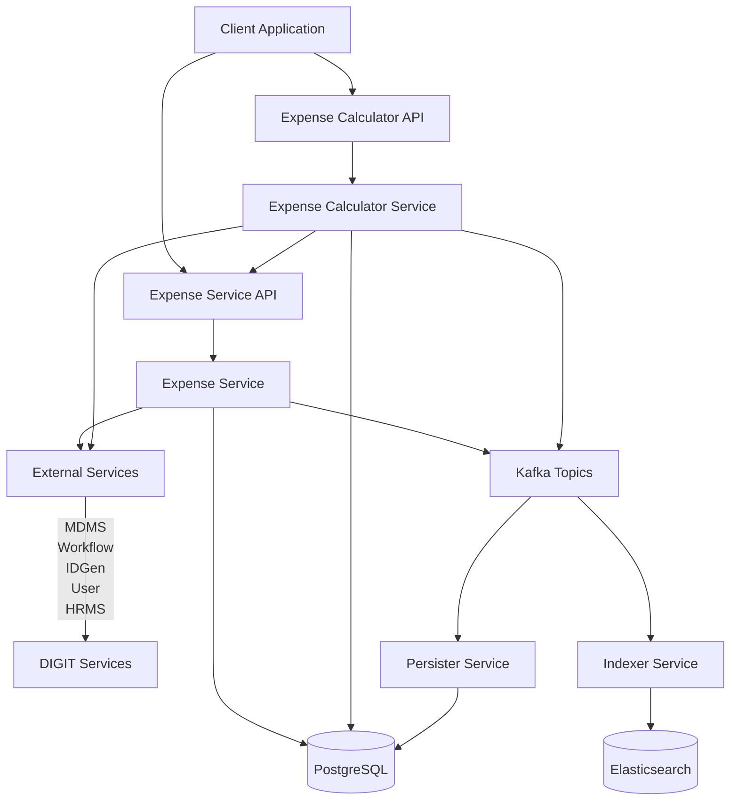

### Component Interaction

The Expense Calculator Service acts as a business logic processor that:
1. Receives calculation requests from clients
2. Performs complex business calculations for wage, purchase, and supervision bills
3. Calls the Expense Service to create/update bills
4. Consumes muster roll events to automatically generate wage bills

---

## API Documentation

### Expense Service APIs

#### Bill Management APIs

**Base URL**: `/expense/bill/v1`

##### 1. Create Bill
- **Endpoint**: `POST /bill/v1/_create`
- **Method**: POST
- **Description**: Creates a new expense bill
- **Authentication**: Required (JWT token)
- **Authorization**: BILL_CREATOR role

**Request Schema**:
```json
{
  "RequestInfo": {...},
  "bill": {
    "tenantId": "string",
    "billDate": "number (timestamp)",
    "dueDate": "number (timestamp)",
    "totalAmount": "BigDecimal",
    "businessService": "string",
    "referenceId": "string",
    "fromPeriod": "number (timestamp)",
    "toPeriod": "number (timestamp)",
    "payer": {
      "type": "string",
      "identifier": "string"
    },
    "billDetails": [...],
    "additionalDetails": {}
  },
  "workflow": {
    "action": "string",
    "comments": "string"
  }
}
```

**Response Schema**:
```json
{
  "ResponseInfo": {...},
  "bills": [
    {
      "id": "string",
      "billNumber": "string", 
      "status": "ACTIVE|INACTIVE|INWORKFLOW",
      "paymentStatus": "INITIATED|SUCCESSFUL|FAILED|CANCELLED",
      ...
    }
  ]
}
```

##### 2. Update Bill
- **Endpoint**: `POST /bill/v1/_update`
- **Method**: POST
- **Description**: Updates an existing bill
- **Authentication**: Required
- **Authorization**: Role-based (BILL_CREATOR, BILL_VERIFIER, BILL_APPROVER)

##### 3. Search Bills
- **Endpoint**: `POST /bill/v1/_search`
- **Method**: POST
- **Description**: Searches bills based on criteria
- **Authentication**: Required

**Search Criteria**:
```json
{
  "RequestInfo": {...},
  "billCriteria": {
    "tenantId": "string (required)",
    "ids": ["string"],
    "businessService": "string",
    "referenceId": ["string"],
    "status": "ACTIVE|INACTIVE|INWORKFLOW"
  },
  "pagination": {
    "limit": "number (default: 100, max: 200)",
    "offset": "number (default: 0)"
  }
}
```

#### Payment Management APIs

**Base URL**: `/expense/payment/v1`

##### 1. Create Payment
- **Endpoint**: `POST /payment/v1/_create`
- **Method**: POST
- **Description**: Creates a payment for one or more bills
- **Authentication**: Required

##### 2. Update Payment
- **Endpoint**: `POST /payment/v1/_update`
- **Method**: POST
- **Description**: Updates payment status
- **Authentication**: Required

##### 3. Search Payments
- **Endpoint**: `POST /payment/v1/_search`
- **Method**: POST
- **Description**: Searches payments based on criteria
- **Authentication**: Required

### Expense Calculator APIs

#### Calculation APIs

**Base URL**: `/expense-calculator/works-calculator/v1`

##### 1. Calculate Bills
- **Endpoint**: `POST /v1/_calculate`
- **Method**: POST
- **Description**: Calculates and creates wage or supervision bills
- **Authentication**: Required

##### 2. Estimate Bills
- **Endpoint**: `POST /v1/_estimate`
- **Method**: POST
- **Description**: Estimates bill amounts without creating actual bills
- **Authentication**: Required

##### 3. Search Calculations
- **Endpoint**: `POST /v1/_search`
- **Method**: POST
- **Description**: Searches calculation history
- **Authentication**: Required

#### Purchase Bill APIs

**Base URL**: `/expense-calculator/purchase/v1`

##### 1. Create Purchase Bill
- **Endpoint**: `POST /v1/_createbill`
- **Method**: POST
- **Description**: Creates a purchase bill
- **Authentication**: Required

##### 2. Update Purchase Bill
- **Endpoint**: `POST /v1/_updatebill`
- **Method**: POST
- **Description**: Updates a purchase bill
- **Authentication**: Required

### Error Handling

All APIs follow standard DIGIT error response format:

```json
{
  "ResponseInfo": {
    "apiId": "string",
    "ver": "string",
    "ts": "timestamp",
    "status": "FAILED"
  },
  "Errors": [
    {
      "code": "ERROR_CODE",
      "message": "Error description",
      "description": "Detailed error information"
    }
  ]
}
```

**Common Error Codes**:
- `BILL_ALREADY_EXISTS`: Bill already exists for reference ID
- `WORKFLOW_REQUIRED`: Workflow is mandatory for business service
- `INVALID_DATE_RANGE`: Due date should be greater than bill date
- `MASTER_DATA_NOT_FOUND`: Required master data not found in MDMS
- `INSUFFICIENT_BILL_AMOUNT`: Paid amount exceeds bill amount
- `NO_WAGE_PURCHASE_BILL`: Required bills not found for supervision calculation

---

## Domain Models & Data Structures

### Core Domain Models

#### Bill Entity
```java
public class Bill {
    private String id;                    // UUID
    private String tenantId;              // Required
    private Long billDate;                // Required
    private Long dueDate;
    private BigDecimal totalAmount;       // Default: 0
    private BigDecimal totalPaidAmount;   // Default: 0
    private String businessService;       // Required (EXPENSE.WAGES|EXPENSE.PURCHASE|EXPENSE.SUPERVISION)
    private String referenceId;           // Required, links to business entity
    private Long fromPeriod;              // Billing period start
    private Long toPeriod;                // Billing period end
    private PaymentStatus paymentStatus;
    private Status status;
    private String billNumber;            // Auto-generated
    private Party payer;                  // Required
    private List<BillDetail> billDetails; // Required
    private Object additionalDetails;
    private AuditDetails auditDetails;
    private String wfStatus;              // Workflow status
}
```

#### BillDetail Entity
```java
public class BillDetail {
    private String id;                         // UUID
    private String referenceId;                // Links to external entity (e.g., wage seeker)
    private String billId;                     // Foreign key to Bill
    private BigDecimal totalAmount;
    private BigDecimal totalPaidAmount;
    private PaymentStatus paymentStatus;
    private Status status;
    private Long fromPeriod;
    private Long toPeriod;
    private BigDecimal netLineItemAmount;
    private Party payee;                       // Required
    private List<LineItem> lineItems;
    private List<LineItem> payableLineItems;   // Required
    private Object additionalDetails;
    private AuditDetails auditDetails;
}
```

#### LineItem Entity
```java
public class LineItem {
    private String id;                    // UUID
    private String tenantId;              // Required
    private String headCode;              // Required (master data)
    private BigDecimal amount;            // Required
    private BigDecimal paidAmount;
    private LineItemType type;            // Required (PAYABLE|DEDUCTION)
    private Status status;
    private PaymentStatus paymentStatus;
    private Boolean isLineItemPayable;
    private Object additionalDetails;
    private AuditDetails auditDetails;
}
```

#### Payment Entity
```java
public class Payment {
    private String id;                          // UUID
    private String tenantId;                    // Required
    private BigDecimal netPayableAmount;        // Required
    private BigDecimal netPaidAmount;           // Required
    private String paymentNumber;               // Auto-generated
    private PaymentStatus status;
    private ReferenceStatus referenceStatus;
    private List<PaymentBill> bills;            // Required
    private Object additionalDetails;
    private AuditDetails auditDetails;
}
```

#### Party Entity
```java
public class Party {
    private String id;
    private String tenantId;
    private String type;               // Required (INDIVIDUAL|DEPARTMENT|ULB)
    private String identifier;         // Required (unique identifier)
    private String parentId;           // Bill ID or Bill Detail ID
    private Status status;
    private Object additionalDetails;
    private AuditDetails auditDetails;
}
```

### Enums

#### PaymentStatus
```java
public enum PaymentStatus {
    INITIATED,      // Initial status
    SUCCESSFUL,     // Payment completed successfully
    FAILED,         // Payment failed
    PARTIAL,        // Partial payment made
    CANCELLED       // Payment cancelled
}
```

#### Status
```java
public enum Status {
    ACTIVE,         // Active record
    INACTIVE,       // Inactive record
    INWORKFLOW,     // In workflow process
    CANCELLED,      // Cancelled
    REJECTED        // Rejected
}
```

#### LineItemType
```java
public enum LineItemType {
    PAYABLE,        // Amount to be paid
    DEDUCTION       // Amount to be deducted
}
```

### Validation Rules

1. **Bill Validation**:
   - Unique bill per reference ID and business service
   - Due date must be greater than bill date
   - Total paid amount cannot exceed total amount
   - Bill details must have at least one payable line item

2. **Payment Validation**:
   - Bills must exist and be in valid status
   - Payment amount cannot exceed bill amount
   - No duplicate payments for same bills

3. **Business Service Validation**:
   - Must be defined in MDMS
   - Workflow configuration required if enabled

---

## Database Design

### Tables Overview

#### Core Tables

##### 1. eg_expense_bill
Primary table storing bill information.

| Column | Type | Constraints | Description |
|--------|------|-------------|-------------|
| id | varchar(64) | PK, NOT NULL | Unique bill identifier |
| tenantid | varchar(250) | PK, NOT NULL | Tenant identifier |
| billdate | bigint | NOT NULL | Bill generation date |
| duedate | bigint | | Payment due date |
| totalamount | numeric(12,2) | | Total bill amount |
| totalpaidamount | numeric(12,2) | | Total paid amount |
| businessservice | varchar(250) | NOT NULL | Business service type |
| referenceid | varchar(250) | NOT NULL | Reference entity ID |
| fromperiod | bigint | | Period start date |
| toperiod | bigint | | Period end date |
| status | varchar(64) | NOT NULL | Bill status |
| paymentstatus | varchar(64) | | Payment status |
| billnumber | varchar(128) | NOT NULL | Generated bill number |
| additionaldetails | jsonb | | Additional information |
| createdby | varchar(64) | NOT NULL | Creator UUID |
| createdtime | bigint | NOT NULL | Creation timestamp |
| lastmodifiedby | varchar(64) | NOT NULL | Modifier UUID |
| lastmodifiedtime | bigint | NOT NULL | Modification timestamp |

**Unique Index**: `index_unique_eg_expense_bill (referenceId, businessservice, tenantid) WHERE status != 'INACTIVE'`

##### 2. eg_expense_billdetail
Stores individual payee details within a bill.

| Column | Type | Constraints | Description |
|--------|------|-------------|-------------|
| id | varchar(64) | PK, NOT NULL | Unique detail identifier |
| tenantid | varchar(250) | PK, NOT NULL | Tenant identifier |
| referenceid | varchar(250) | | External entity reference |
| billid | varchar(64) | FK, NOT NULL | Reference to eg_expense_bill |
| totalamount | numeric(12,2) | | Detail total amount |
| totalpaidamount | numeric(12,2) | | Detail paid amount |
| paymentstatus | varchar(64) | | Payment status |
| status | varchar(64) | NOT NULL | Detail status |
| fromperiod | bigint | | Period start |
| toperiod | bigint | | Period end |
| netlineitemamount | numeric(12,2) | | Net payable amount |
| additionaldetails | jsonb | | Additional information |

##### 3. eg_expense_lineitem
Stores amount breakdowns (payable and deductions).

| Column | Type | Constraints | Description |
|--------|------|-------------|-------------|
| id | varchar(64) | PK, NOT NULL | Unique line item identifier |
| billdetailid | varchar(64) | FK, NOT NULL | Reference to billdetail |
| tenantid | varchar(250) | NOT NULL | Tenant identifier |
| headcode | varchar(250) | NOT NULL | Head code from MDMS |
| amount | numeric(12,2) | NOT NULL | Line item amount |
| paidamount | numeric(12,2) | NOT NULL | Paid amount |
| type | varchar(64) | NOT NULL | PAYABLE or DEDUCTION |
| status | varchar(64) | NOT NULL | Line item status |
| paymentstatus | varchar(64) | | Payment status |
| islineitempayable | boolean | NOT NULL | Whether item is payable |
| additionaldetails | jsonb | | Additional information |

##### 4. eg_expense_party
Stores payer and payee information.

| Column | Type | Constraints | Description |
|--------|------|-------------|-------------|
| id | varchar(64) | PK, NOT NULL | Unique party identifier |
| tenantid | varchar(250) | NOT NULL | Tenant identifier |
| type | varchar(250) | NOT NULL | Party type |
| status | varchar(64) | NOT NULL | Party status |
| identifier | varchar(250) | NOT NULL | Unique party identifier |
| parentid | varchar(250) | NOT NULL | Bill or BillDetail ID |
| additionaldetails | jsonb | | Additional information |

#### Payment Tables

##### 5. eg_expense_payment
Main payment table.

| Column | Type | Constraints | Description |
|--------|------|-------------|-------------|
| id | varchar(256) | PK, NOT NULL | Unique payment identifier |
| tenantid | varchar(64) | NOT NULL | Tenant identifier |
| netpayableamount | numeric(12,2) | NOT NULL | Net payable amount |
| netpaidamount | numeric(12,2) | NOT NULL | Net paid amount |
| paymentnumber | varchar(128) | NOT NULL | Generated payment number |
| status | varchar(64) | NOT NULL | Payment status |
| additionaldetails | jsonb | | Additional information |

##### 6. eg_expense_payment_bill
Links payments to bills (many-to-many).

##### 7. eg_expense_payment_billdetail  
Links payments to bill details.

##### 8. eg_expense_payment_lineitem
Links payments to specific line items.

#### Calculator Tables

##### 9. eg_works_calculation
Stores calculation metadata for bill tracking.

| Column | Type | Constraints | Description |
|--------|------|-------------|-------------|
| id | varchar(256) | PK | Unique calculation identifier |
| tenant_id | varchar(64) | NOT NULL | Tenant identifier |
| business_service | varchar(128) | | Business service type |
| bill_id | varchar(256) | NOT NULL | Generated bill ID |
| bill_number | varchar(128) | | Bill number |
| bill_reference | varchar(128) | | Bill reference |
| contract_number | varchar(128) | | Contract number |
| musterroll_number | varchar(128) | | Muster roll number |
| project_number | varchar(128) | | Project number |
| org_id | varchar(256) | | Organization ID |
| is_active | boolean | | Active status |
| additionaldetails | JSONB | | Additional details |

##### 10. eg_works_calc_details
Stores calculation detail metadata.

### Entity Relationship Diagram

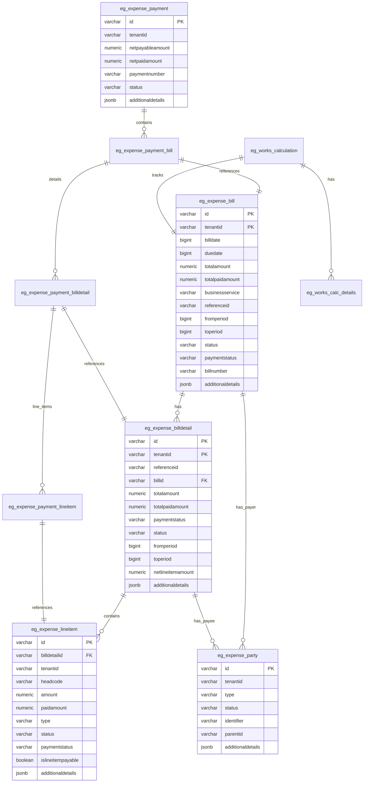

### Key Relationships

1. **One-to-Many**: Bill → BillDetails → LineItems
2. **One-to-Many**: Bill → Parties (payer), BillDetail → Parties (payees)
3. **Many-to-Many**: Payment ↔ Bills (through payment_bill junction)
4. **One-to-One**: Calculation → Bill (tracking relationship)

### Indexes and Constraints

1. **Primary Keys**: Composite keys on (id, tenantid) for multi-tenancy
2. **Foreign Keys**: Maintain referential integrity
3. **Unique Constraints**: Prevent duplicate bills per reference and business service
4. **Business Constraints**: 
   - Bill due date >= bill date
   - Paid amount <= total amount
   - At least one payable line item per bill detail

---

## Configuration & Application Properties

### Expense Service Configuration

#### Database Configuration
```properties
# Database
spring.datasource.driver-class-name=org.postgresql.Driver
spring.datasource.url=jdbc:postgresql://localhost:5432/digit-works
spring.datasource.username=postgres
spring.datasource.password=1234

# Flyway Migration
spring.flyway.url=jdbc:postgresql://localhost:5432/digit-works
spring.flyway.user=postgres
spring.flyway.password=1234
spring.flyway.table=expense_schema
spring.flyway.baseline-on-migrate=true
spring.flyway.outOfOrder=true
spring.flyway.locations=classpath:/db/migration/main
spring.flyway.enabled=true
```

#### Kafka Configuration
```properties
# Kafka Server
kafka.config.bootstrap_server_config=localhost:9092
spring.kafka.consumer.value-deserializer=org.egov.tracer.kafka.deserializer.HashMapDeserializer
spring.kafka.consumer.key-deserializer=org.apache.kafka.common.serialization.StringDeserializer
spring.kafka.consumer.group-id=expense
spring.kafka.producer.key-serializer=org.apache.kafka.common.serialization.StringSerializer
spring.kafka.producer.value-serializer=org.springframework.kafka.support.serializer.JsonSerializer

# Kafka Topics
expense.billing.bill.create=expense-bill-create
expense.billing.bill.update=expense-bill-update
expense.billing.payment.create=expense-payment-create
expense.billing.payment.update=expense-payment-update
kafka.topics.consumer=expense-billing-consumer-topic
```

#### Service URLs
```properties
# MDMS
egov.mdms.host=https://unified-dev.digit.org
egov.mdms.search.endpoint=/egov-mdms-service/v1/_search
egov.mdms.v2.host=https://unified-dev.digit.org
egov.mdms.v2.search.endpoint=/mdms-v2/v1/_search

# ID Generation
egov.idgen.host=https://unified-dev.digit.org/
egov.idgen.path=egov-idgen/id/_generate
egov.idgen.works.wage.bill.number.name=wage.bill.number
egov.idgen.works.wage.bill.number.format=WB/[fy:yyyy-yy]/[SEQ_WAGE_NUM]
egov.idgen.works.purchase.bill.number.name=purchase.bill.number
egov.idgen.works.purchase.bill.number.format=PB/[fy:yyyy-yy]/[SEQ_PURCHASE_NUM]
egov.idgen.works.supervision.bill.number.name=supervision.bill.number
egov.idgen.works.supervision.bill.number.format=SB/[fy:yyyy-yy]/[SEQ_SUPERVISION_NUM]

# Workflow
egov.workflow.host=http://localhost:8090
egov.workflow.transition.path=/egov-workflow-v2/egov-wf/process/_transition
egov.workflow.businessservice.search.path=/egov-workflow-v2/egov-wf/businessservice/_search
egov.workflow.processinstance.search.path=/egov-workflow-v2/egov-wf/process/_search

# User Service
egov.user.host=https://unified-dev.digit.org
egov.user.context.path=/user/users
egov.user.create.path=/_createnovalidate
egov.user.search.path=/user/_search
egov.user.update.path=/_updatenovalidate

# HRMS
egov.hrms.host=http://localhost:8082
egov.hrms.search.endpoint=/egov-hrms/employees/_search

# Organization Service
works.organisation.host=https://unified-dev.digit.org
works.organisation.endpoint=/org-services/organisation/v1/_search

# Contract Service
works.contract.host=https://unified-dev.digit.org
works.contract.endpoint=/contract/v1/_search

# Individual Service
works.individual.host=https://unified-dev.digit.org
works.individual.endpoint=/individual/v1/_search

# Localization
egov.localization.host=https://unified-dev.digit.org
egov.localization.workDir.path=/localization/messages/v1
egov.localization.context.path=/localization/messages/v1
egov.localization.search.endpoint=/_search
egov.localization.statelevel=true

# URL Shortener
egov.url.shortner.host=https://unified-dev.digit.org
egov.url.shortner.endpoint=/egov-url-shortening/shortener

# Notifications
egov.sms.notification.topic=egov.core.notification.sms
```

#### Business Configuration
```properties
# Workflow Configuration
business.workflow.status.map={"EXPENSE.WAGES":"true","EXPENSE.PURCHASE":"false","EXPENSE.SUPERVISION":"true"}
expense.workflow.module.name=expense

# Default Values
expense.payment.default.status=INITIATED
expense.reference.default.status=PAYMENT_INITIATED

# Search Limits
expense.billing.default.limit=100
expense.billing.default.offset=0
expense.billing.search.max.limit=200
```

### Expense Calculator Configuration

#### Additional Calculator-Specific Properties
```properties
# Kafka Topics
expense.calculator.consume.topic=calculate-musterroll
expense.calculator.create.topic=save-calculator
expense.calculator.error.topic=calculate-error
expense.calculator.create.bill.topic=calculate-billmeta

# Business Service Configuration
egov.works.expense.wage.head.code=WEG
egov.works.expense.payer.type=ULB
egov.works.expense.wage.labour.charge.unit=day
egov.works.expense.wage.payee.type=INDIVIDUAL
egov.works.expense.wage.business.service=EXPENSE.WAGES
egov.works.expense.purchase.business.service=EXPENSE.PURCHASE
egov.works.expense.supervision.business.service=EXPENSE.SUPERVISION

# External Services
egov.musterroll.host=https://unified-dev.digit.org
egov.musterroll.search.endpoint=/muster-roll/v1/_search

project.service.host=https://unified-dev.digit.org/
project.search.path=project/v1/_search

works.estimate.host=http://localhost:8288
works.estimate.search.endpoint=/estimate/v1/_search

# IDGen Reference Formats
egov.works.expense.purchasebill.referenceId.format=purchase.reference.number
egov.works.expense.superbill.referenceId.format=supervision.reference.number
egov.works.expense.wagebill.referenceId.format=wage.reference.number
```

### Environment-Specific Configurations

#### Development Environment
- Database: Local PostgreSQL
- Kafka: Local instance
- External services: Development DIGIT platform URLs

#### Production Environment
- Database: Production PostgreSQL with connection pooling
- Kafka: Production Kafka cluster
- External services: Production DIGIT platform URLs
- Additional monitoring and logging configurations

### Feature Flags

```properties
# Workflow enabling/disabling per business service
business.workflow.status.map={"EXPENSE.WAGES":"true","EXPENSE.PURCHASE":"false","EXPENSE.SUPERVISION":"true"}

# Workflow global flag
is.workflow.enabled=true
```

---

## Service Dependencies

### DIGIT Backbone Services

#### 1. Master Data Management Service (MDMS)
- **Purpose**: Provides master data for head codes, business services, charges
- **Endpoints Used**:
  - `/egov-mdms-service/v1/_search`
  - `/mdms-v2/v1/_search`
- **Data Retrieved**:
  - Head codes for line items
  - Business service configurations
  - Applicable charges and rates
  - Labour charge details (SOR - Schedule of Rates)
  - Billing slab configurations

#### 2. ID Generation Service
- **Purpose**: Generates formatted bill and payment numbers
- **Endpoint**: `/egov-idgen/id/_generate`
- **ID Formats**:
  - Wage bills: `WB/[fy:yyyy-yy]/[SEQ_WAGE_NUM]`
  - Purchase bills: `PB/[fy:yyyy-yy]/[SEQ_PURCHASE_NUM]` 
  - Supervision bills: `SB/[fy:yyyy-yy]/[SEQ_SUPERVISION_NUM]`

#### 3. Workflow Service
- **Purpose**: Manages bill approval workflows
- **Endpoints Used**:
  - `/egov-workflow-v2/egov-wf/process/_transition`
  - `/egov-workflow-v2/egov-wf/businessservice/_search`
  - `/egov-workflow-v2/egov-wf/process/_search`
- **Workflow Types**:
  - EXPENSE.WAGES: Direct approval
  - EXPENSE.PURCHASE: Multi-step approval (verification → approval)
  - EXPENSE.SUPERVISION: Direct approval

#### 4. User Service
- **Purpose**: User authentication and authorization
- **Endpoints Used**:
  - `/user/_search`
  - `/user/_createnovalidate`
  - `/user/_updatenovalidate`

#### 5. Persister Service
- **Purpose**: Asynchronous database persistence
- **Configuration Files**:
  - `expense-bill-payment-persister.yaml`
  - `expense-billarray-payment-persister.yaml`

#### 6. Indexer Service
- **Purpose**: Elasticsearch indexing for search
- **Topic**: Consumes from same Kafka topics as Persister

#### 7. Notification Service
- **Purpose**: SMS and email notifications
- **Topic**: `egov.core.notification.sms`
- **Notifications Sent**:
  - Supervision bill creation alerts
  - Purchase bill status updates

#### 8. Localization Service
- **Purpose**: Multi-language support
- **Endpoint**: `/localization/messages/v1/_search`

### Works Module Services

#### 1. Muster Roll Service
- **Purpose**: Provides attendance and wage calculation data
- **Endpoint**: `/muster-roll/v1/_search`
- **Integration**: Calculator consumes muster roll events to auto-generate wage bills

#### 2. Contract Service
- **Purpose**: Work contract management
- **Endpoint**: `/contract/v1/_search`
- **Usage**: Links bills to contracts, supervision bill calculations

#### 3. Project Service
- **Purpose**: Project information
- **Endpoint**: `/project/v1/_search`
- **Usage**: Project details for bill enrichment and search

#### 4. Estimate Service
- **Purpose**: Work estimates and measurements
- **Endpoint**: `/estimate/v1/_search`
- **Usage**: Supervision bill calculations based on estimates

#### 5. Organization Service
- **Purpose**: Organization and CBO details
- **Endpoint**: `/org-services/organisation/v1/_search`
- **Usage**: Contractor and organization information

#### 6. Individual Service
- **Purpose**: Individual worker details
- **Endpoint**: `/individual/v1/_search`
- **Usage**: Wage seeker information for wage bills

#### 7. HRMS Service
- **Purpose**: Employee information
- **Endpoint**: `/egov-hrms/employees/_search`
- **Usage**: Employee details for various bill types

### External Integrations

#### 1. URL Shortener Service
- **Endpoint**: `/egov-url-shortening/shortener`
- **Usage**: Shortened URLs for notifications

#### 2. File Store Service
- **Usage**: Document attachments for bills

### Service-to-Service Communication

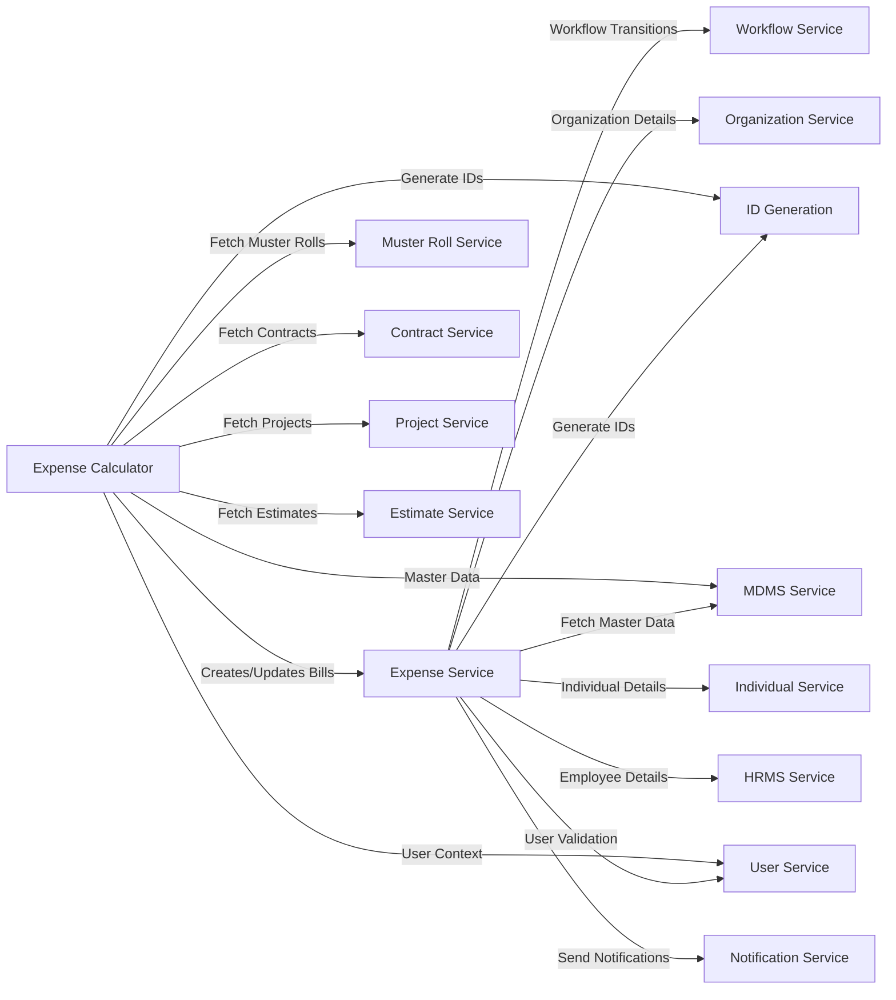

### Libraries and Frameworks

#### Spring Boot Dependencies
- **spring-boot-starter-web**: REST API framework
- **spring-boot-starter-jdbc**: Database connectivity
- **spring-boot-starter-validation**: Request validation
- **spring-boot-starter-test**: Testing framework

#### Database and Migration
- **postgresql**: PostgreSQL JDBC driver
- **flyway-core**: Database migration tool

#### DIGIT Framework Dependencies
- **tracer**: Distributed tracing and Kafka integration
- **mdms-client**: MDMS service client
- **works-services-common**: Shared models and utilities
- **health-services-models**: Common health check models

#### Utility Libraries
- **lombok**: Code generation for boilerplate
- **jackson-datatype-jsr310**: Date/time JSON serialization
- **swagger-annotations**: API documentation
- **json-smart**: JSON processing

---

## Events & Messaging

### Kafka Topics

#### Expense Service Topics

##### Producer Topics

1. **expense-bill-create**
   - **Purpose**: Bill creation events
   - **Producer**: Expense Service (BillService.create())
   - **Consumers**: Persister, Indexer
   - **Payload**: BillRequest
   - **Trigger**: After successful bill creation validation

2. **expense-bill-update**
   - **Purpose**: Bill update events
   - **Producer**: Expense Service (BillService.update(), PaymentService backupdate)
   - **Consumers**: Persister, Indexer
   - **Payload**: BillRequest
   - **Trigger**: After bill updates, payment status changes

3. **expense-payment-create**
   - **Purpose**: Payment creation events
   - **Producer**: Expense Service (PaymentService.create())
   - **Consumers**: Persister
   - **Payload**: PaymentRequest
   - **Trigger**: After payment creation validation

4. **expense-payment-update**
   - **Purpose**: Payment update events
   - **Producer**: Expense Service (PaymentService.update())
   - **Consumers**: Persister
   - **Payload**: PaymentRequest
   - **Trigger**: After payment status updates

##### Consumer Topics

1. **expense-billing-consumer-topic**
   - **Purpose**: General expense service consumption (currently disabled)
   - **Consumer**: ExpenseConsumer (commented out)
   - **Status**: Disabled in current implementation

#### Expense Calculator Topics

##### Producer Topics

1. **save-calculator**
   - **Purpose**: Bill metadata persistence
   - **Producer**: ExpenseCalculatorService
   - **Consumers**: Persister
   - **Payload**: BillMetaRecords
   - **Trigger**: After successful bill creation

2. **calculate-error**
   - **Purpose**: Error handling for failed calculations
   - **Producer**: ExpenseCalculatorConsumer
   - **Consumers**: Error handling service
   - **Payload**: MusterRollConsumerError
   - **Trigger**: Exception during muster roll processing

3. **expense-bill-index-topic**
   - **Purpose**: Bill indexing with enriched project details
   - **Producer**: ExpenseCalculatorService
   - **Consumers**: Indexer
   - **Payload**: BillRequest (enriched)
   - **Trigger**: After bill enrichment with project information

##### Consumer Topics

1. **calculate-musterroll**
   - **Purpose**: Automatic wage bill generation
   - **Producer**: Muster Roll Service
   - **Consumer**: ExpenseCalculatorConsumer.listen()
   - **Payload**: MusterRollRequest
   - **Trigger**: Muster roll approval/completion
   - **Business Logic**: 
     - Validates muster roll
     - Fetches SOR details from MDMS
     - Creates wage bills automatically
     - Posts bills to Expense Service

2. **expense-bill-create / expense-bill-update**
   - **Purpose**: Bill enrichment with project details
   - **Producer**: Expense Service
   - **Consumer**: ExpenseCalculatorConsumer.listenBill()
   - **Payload**: BillRequest
   - **Trigger**: Bill creation/update
   - **Business Logic**:
     - Enriches bills with project information
     - Adds project name, number, ward details
     - Re-indexes enriched bill

### Event Flow Diagrams

#### Bill Creation Event Flow
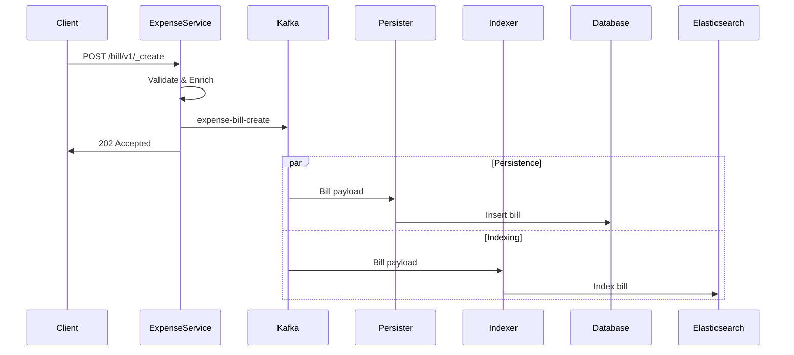

#### Muster Roll to Wage Bill Flow
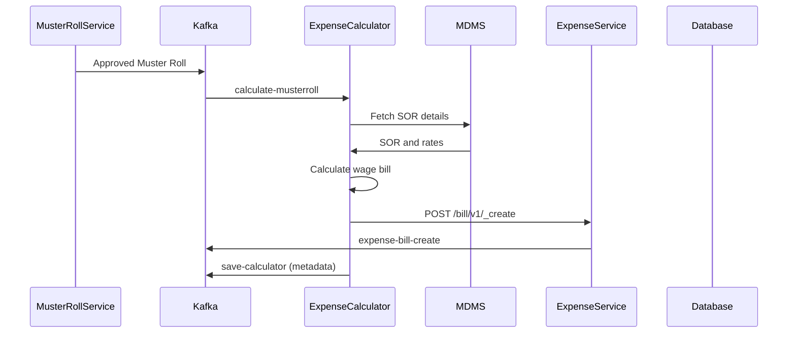

### Message Schemas

#### BillRequest Message
```json
{
  "RequestInfo": {
    "apiId": "expense-service",
    "ver": "1.0",
    "ts": 1234567890,
    "action": "create",
    "userInfo": {...}
  },
  "bill": {
    "id": "uuid",
    "tenantId": "tenant",
    "billDate": 1234567890,
    "totalAmount": 10000.00,
    "businessService": "EXPENSE.WAGES",
    "referenceId": "MUSTER_001",
    "billDetails": [...],
    "additionalDetails": {}
  },
  "workflow": {
    "action": "SUBMIT",
    "comments": "Bill creation"
  }
}
```

#### MusterRollRequest Message
```json
{
  "RequestInfo": {...},
  "musterRoll": {
    "id": "uuid",
    "tenantId": "tenant",
    "musterRollNumber": "MR_001",
    "referenceId": "CONTRACT_001",
    "individualEntries": [
      {
        "id": "uuid",
        "individualId": "individual_uuid",
        "attendanceEntries": [...],
        "additionalDetails": {
          "skillCode": "MASON"
        }
      }
    ],
    "additionalDetails": {
      "projectId": "project_uuid",
      "contractId": "contract_uuid"
    }
  }
}
```

### Error Handling

#### Dead Letter Queue Pattern
- **Error Topic**: `calculate-error`
- **Purpose**: Capture failed muster roll processing
- **Retry Strategy**: Manual intervention required
- **Error Information**: Original request + exception details

#### Idempotency
- **Bill Creation**: Prevented by unique constraint on (referenceId, businessService, tenantId)
- **Payment Creation**: Validated against existing payments for same bills
- **Message Processing**: No automatic retry to prevent duplicate processing

---

## Execution & Business Flows

### Bill Creation Flows

#### 1. Wage Bill Generation Flow

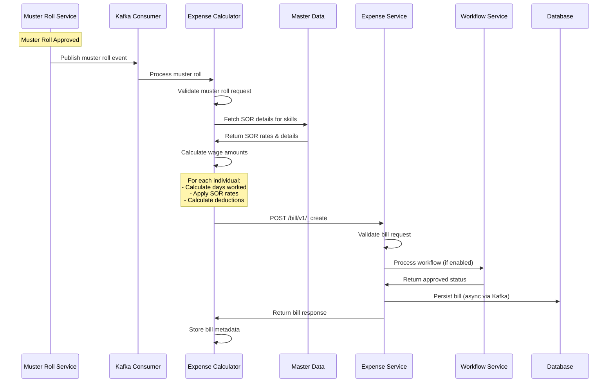

**Key Steps**:
1. **Muster Roll Event**: Approved muster roll triggers wage bill generation
2. **Validation**: Validate muster roll status and data integrity
3. **SOR Lookup**: Fetch Schedule of Rates from MDMS based on skill codes
4. **Amount Calculation**: 
   - Calculate gross wages (days × rate)
   - Apply deductions (PF, ESI, TDS)
   - Determine net payable amount
5. **Bill Creation**: Call Expense Service to create bill
6. **Workflow Processing**: Auto-approve for wage bills (configurable)
7. **Metadata Storage**: Store calculation metadata for tracking

#### 2. Purchase Bill Creation Flow

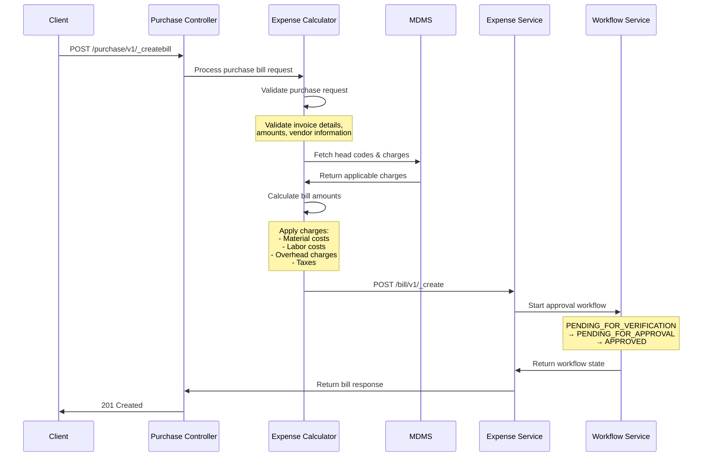

**Key Steps**:
1. **Request Validation**: Validate invoice details, amounts, vendor info
2. **Master Data Lookup**: Fetch applicable charges and head codes
3. **Amount Calculation**: Apply material, labor, overhead, and tax charges
4. **Workflow Initiation**: Start multi-step approval workflow
5. **Bill Persistence**: Store bill with workflow status

#### 3. Supervision Bill Generation Flow

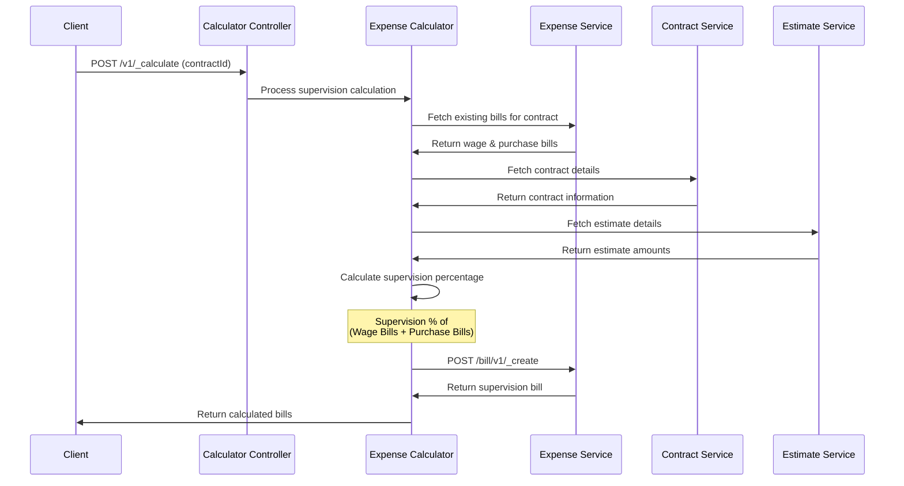

**Key Steps**:
1. **Contract Validation**: Verify contract exists and is valid
2. **Bill Aggregation**: Fetch all wage and purchase bills for contract
3. **Estimate Lookup**: Get project estimates for reference
4. **Supervision Calculation**: Apply supervision percentage to total bill amount
5. **Bill Creation**: Create supervision bill linking to contract

### Payment Processing Flow

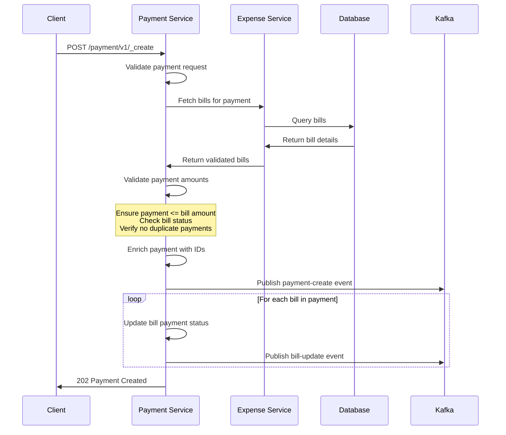

**Key Steps**:
1. **Payment Validation**: Validate bills exist and amounts are correct
2. **Duplicate Check**: Ensure no existing payments for same bills
3. **Amount Validation**: Verify payment amount ≤ bill amount
4. **Payment Enrichment**: Add UUIDs, audit details, set status to INITIATED
5. **Bill Updates**: Update payment status and paid amounts on linked bills
6. **Event Publishing**: Async persistence via Kafka

### Business Rules

#### Bill Creation Rules
1. **Uniqueness**: Only one active bill per (referenceId, businessService, tenantId)
2. **Amount Validation**: Total paid amount cannot exceed total bill amount
3. **Date Validation**: Due date must be greater than or equal to bill date
4. **Line Item Rules**: At least one payable line item required
5. **Workflow Compliance**: Workflow mandatory for configured business services

#### Payment Rules
1. **Bill Status**: Can only pay bills in ACTIVE status
2. **Amount Limits**: Payment amount cannot exceed remaining bill amount
3. **Bill Ownership**: All bills must belong to same tenant
4. **Status Updates**: Bills marked with payment status upon payment creation

#### Calculation Rules

##### Wage Bill Calculation
1. **Rate Application**: Use SOR rates based on skill codes
2. **Attendance Calculation**: Days worked × daily rate
3. **Deduction Hierarchy**: 
   - PF: % of gross wages
   - ESI: % of gross wages  
   - TDS: % of gross wages (if applicable)
4. **Net Calculation**: Gross - Total Deductions

##### Purchase Bill Calculation
1. **Base Amount**: Invoice amount as provided
2. **Applicable Charges**: Applied based on MDMS configuration
3. **Tax Calculation**: GST and other taxes as per rules
4. **Total Amount**: Base + Charges + Taxes

##### Supervision Bill Calculation
1. **Base Calculation**: Sum of approved wage and purchase bills
2. **Supervision Rate**: Configurable percentage from MDMS
3. **Amount**: Base amount × supervision percentage

### Error Handling and Recovery

#### Validation Failures
1. **Bill Exists**: Return error with reference to existing bill
2. **Invalid Dates**: Return error with date validation message
3. **Amount Mismatch**: Return error with amount details
4. **Missing Master Data**: Return error with missing data references

#### Workflow Failures
1. **Role Mismatch**: User lacks required role for action
2. **Invalid State**: Action not allowed in current workflow state
3. **SLA Breach**: Workflow step exceeded time limit

#### External Service Failures
1. **MDMS Unavailable**: Cache master data or return service unavailable
2. **Workflow Service Down**: Allow bill creation without workflow (configurable)
3. **IDGen Service Down**: Generate temporary IDs or return error

#### Recovery Mechanisms
1. **Async Processing**: Bills persisted via Kafka ensure eventual consistency
2. **Idempotent Operations**: Prevent duplicate bills and payments
3. **Error Tracking**: Failed calculations tracked in error topic
4. **Manual Intervention**: Error records available for manual processing

---

## Security Considerations

### Authentication and Authorization

#### Authentication Flow
1. **JWT Token Validation**: All API endpoints require valid JWT token in Authorization header
2. **User Context**: RequestInfo contains authenticated user information
3. **Tenant Validation**: Operations restricted to user's authorized tenants

#### Authorization Matrix

| Operation | Required Roles | Additional Checks |
|-----------|----------------|-------------------|
| Create Wage Bill | BILL_CREATOR | Auto-generated from muster rolls |
| Create Purchase Bill | BILL_CREATOR | Manual creation |
| Create Supervision Bill | BILL_CREATOR | Contract-based access |
| Verify Bill | BILL_VERIFIER | Same tenant, appropriate workflow state |
| Approve Bill | BILL_APPROVER | Same tenant, appropriate workflow state |
| Create Payment | PAYMENT_CREATOR | Access to underlying bills |
| Update Payment | PAYMENT_UPDATER | Original payment creator or authorized role |
| Search Bills/Payments | Any authenticated user | Tenant-based filtering |

#### Workflow-Based Security

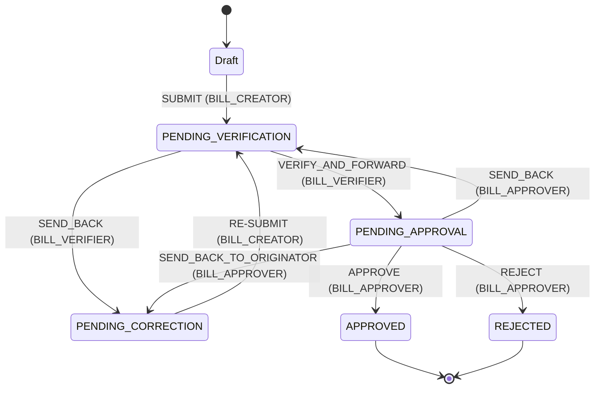

### Data Protection

#### Personal Data Handling
1. **Wage Seeker Information**: Individual identifiers, attendance data, payment amounts
2. **Data Minimization**: Only collect necessary information for bill processing
3. **Retention Policy**: Define data retention periods for bill and payment records
4. **Anonymization**: Remove personal identifiers from aggregated reports

#### Sensitive Financial Data
1. **Encryption at Rest**: Database encryption for sensitive financial information
2. **Encryption in Transit**: HTTPS/TLS for all API communications
3. **Payment Information**: Secure handling of payment amounts and bank details
4. **Audit Trails**: Complete audit log of all financial transactions

### Input Validation and Sanitization

#### Request Validation
1. **Schema Validation**: All requests validated against OpenAPI specifications
2. **Business Validation**: Amount limits, date ranges, reference validations
3. **SQL Injection Prevention**: Parameterized queries, prepared statements
4. **XSS Prevention**: Input sanitization for any user-provided content

#### Data Integrity
1. **Referential Integrity**: Foreign key constraints in database
2. **Business Rules**: Amount validation, status transition validation
3. **Idempotency**: Prevent duplicate operations through unique constraints
4. **Concurrency Control**: Optimistic locking using audit details

### Access Control

#### Tenant Isolation
1. **Multi-Tenancy**: All operations scoped to tenant context
2. **Data Segregation**: Physical separation of tenant data
3. **Cross-Tenant Access**: Strictly prohibited and validated

#### Resource-Level Security
1. **Bill Access**: Users can only access bills within their tenant
2. **Payment Access**: Users can only create payments for accessible bills
3. **Search Filtering**: Results automatically filtered by tenant and user roles

### Security Headers and Configurations

#### API Security Headers
```properties
# Security headers configuration
server.servlet.session.cookie.secure=true
server.servlet.session.cookie.http-only=true
server.servlet.session.cookie.same-site=strict
```

#### CORS Configuration
```properties
# CORS settings for web clients
management.endpoints.web.cors.allowed-origins=https://digit.org
management.endpoints.web.cors.allowed-methods=GET,POST
management.endpoints.web.cors.allowed-headers=*
```

### Logging and Monitoring

#### Security Event Logging
1. **Authentication Events**: Failed login attempts, token validation failures
2. **Authorization Events**: Access denied, privilege escalation attempts
3. **Data Access Events**: Sensitive data access, bulk data exports
4. **Administrative Events**: Configuration changes, user role modifications

#### Security Monitoring
1. **Real-time Alerts**: Unusual access patterns, bulk operations
2. **Audit Dashboards**: Security event trends, access patterns
3. **Compliance Reporting**: Generate security compliance reports

### Vulnerability Management

#### Regular Security Assessments
1. **Dependency Scanning**: Regular updates of third-party libraries
2. **Static Code Analysis**: Automated security code reviews
3. **Penetration Testing**: Regular security testing of APIs
4. **Vulnerability Patching**: Timely application of security patches

#### Secure Development Practices
1. **Code Reviews**: Security-focused code review process
2. **Security Testing**: Integration of security tests in CI/CD pipeline
3. **Secure Defaults**: Secure configuration defaults
4. **Principle of Least Privilege**: Minimal required permissions

### Compliance and Regulatory Requirements

#### Data Privacy Compliance
1. **GDPR Compliance**: If handling EU citizen data
2. **Data Subject Rights**: Right to access, modify, delete personal data
3. **Consent Management**: Explicit consent for data processing
4. **Privacy Impact Assessments**: Regular privacy assessments

#### Financial Compliance
1. **Audit Requirements**: Complete audit trails for financial transactions
2. **Financial Controls**: Segregation of duties, approval workflows
3. **Regulatory Reporting**: Generate required financial compliance reports

---

## API Flow Diagrams

### Bill Creation Flow

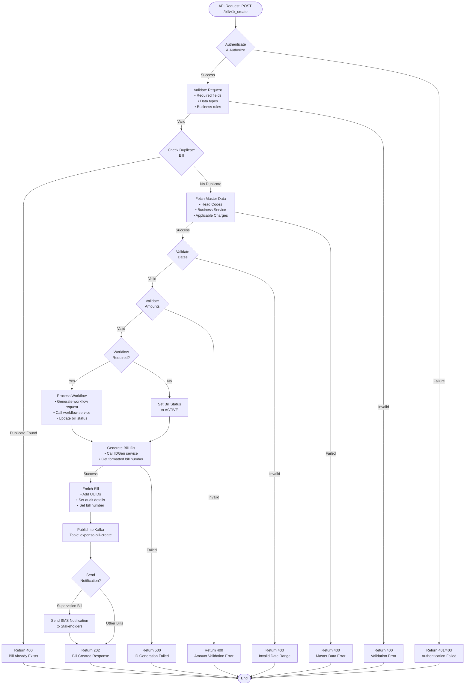

### Payment Creation Flow

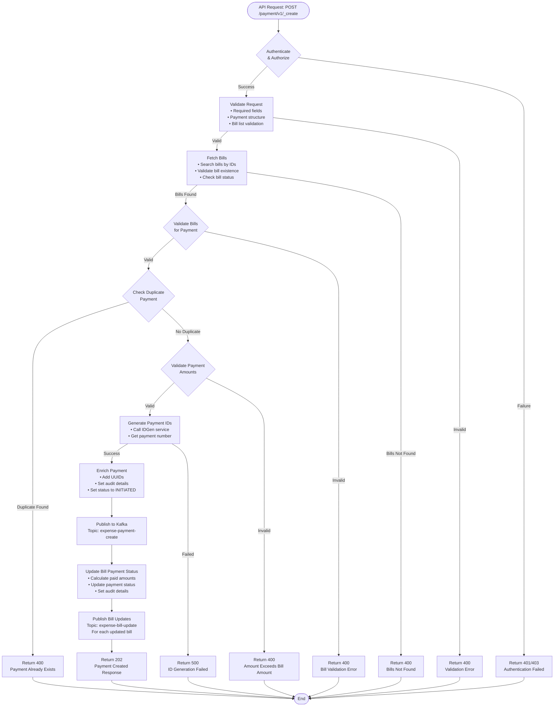

### Wage Bill Calculation Flow

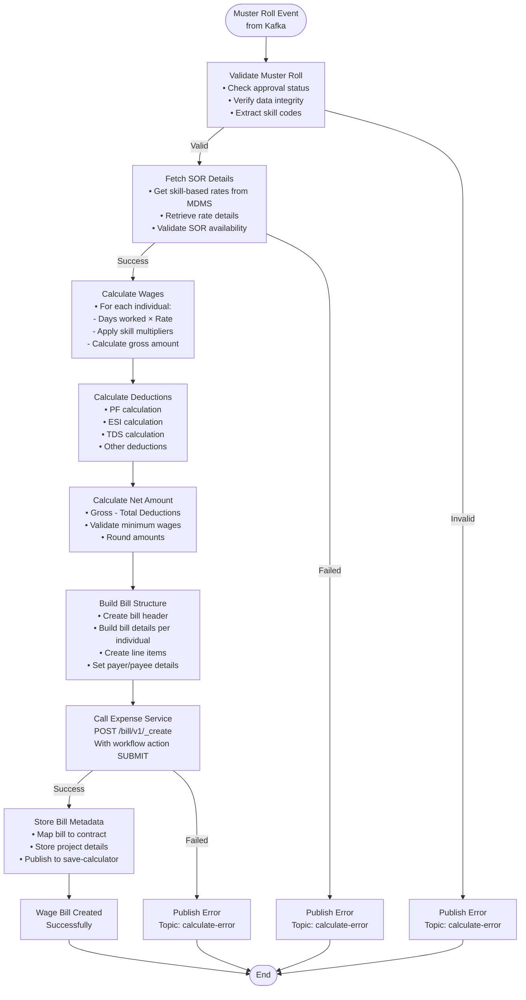

### Purchase Bill Creation Flow

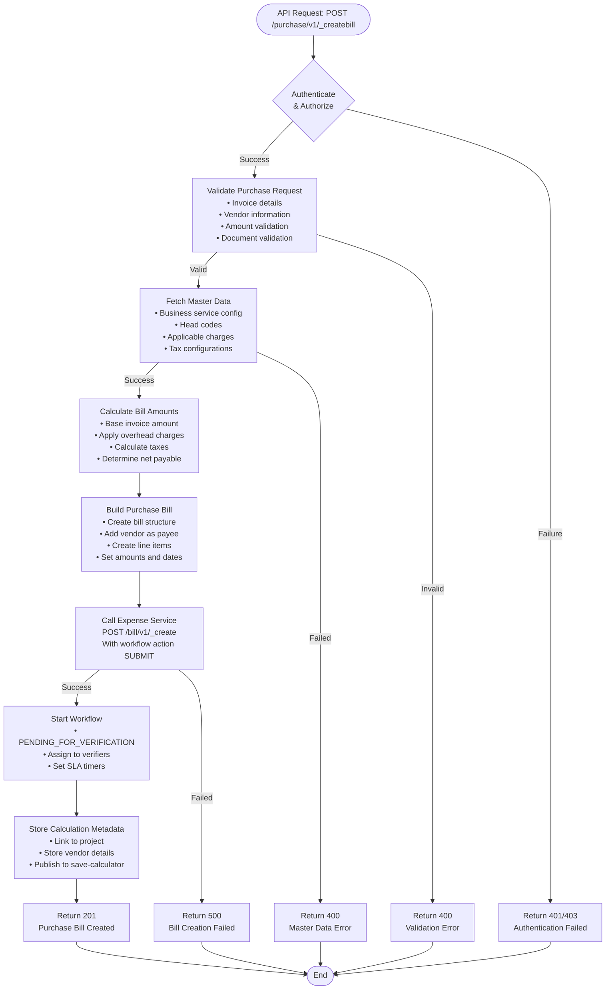

### Supervision Bill Calculation Flow

```mermaid
flowchart TD
    Start([API Request: POST /v1/_calculate<br/>with contractId]) --> Auth{Authenticate<br/>& Authorize}
    
    Auth -->|Success| ValidateContract[Validate Contract<br/>• Check contract exists<br/>• Verify contract status<br/>• Validate user access]
    Auth -->|Failure| AuthError[Return 401/403<br/>Authentication Failed]
    
    ValidateContract -->|Valid| FetchBills[Fetch Related Bills<br/>• Get wage bills for contract<br/>• Get purchase bills for contract<br/>• Validate bill statuses]
    ValidateContract -->|Invalid| ContractError[Return 400<br/>Contract Validation Error]
    
    FetchBills -->|Bills Found| ValidateBills{Validate Bills<br/>for Calculation}
    FetchBills -->|No Bills| NoBillsError[Return 400<br/>No Wage/Purchase Bills Found]
    
    ValidateBills -->|Valid| FetchEstimate[Fetch Contract Estimate<br/>• Get estimate details<br/>• Retrieve project information<br/>• Get supervision rates]
    ValidateBills -->|Invalid| BillError[Return 400<br/>Bills Not Ready for Calculation]
    
    FetchEstimate -->|Success| CalcSupervision[Calculate Supervision<br/>• Sum approved bill amounts<br/>• Apply supervision percentage<br/>• Calculate supervision fee<br/>• Determine payee (contractor)]
    FetchEstimate -->|Failed| EstimateError[Return 400<br/>Estimate Not Found]
    
    CalcSupervision --> ValidateCalc{Validate<br/>Calculation}
    
    ValidateCalc -->|Valid| BuildSupBill[Build Supervision Bill<br/>• Create bill structure<br/>• Set contractor as payee<br/>• Create supervision line items<br/>• Link to contract]
    ValidateCalc -->|Invalid| CalcError[Return 400<br/>No Calculation Details Found]
    
    BuildSupBill --> CallExpense[Call Expense Service<br/>POST /bill/v1/_create<br/>With workflow action SUBMIT]
    
    CallExpense -->|Success| StoreMeta[Store Bill Metadata<br/>• Map to contract<br/>• Store project details<br/>• Link to base bills]
    CallExpense -->|Failed| ExpenseError[Return 500<br/>Bill Creation Failed]
    
    StoreMeta --> Response[Return 202<br/>Supervision Bill Created]
    
    Response --> End([End])
    
    AuthError --> End
    ContractError --> End
    NoBillsError --> End
    BillError --> End
    EstimateError --> End
    CalcError --> End
    ExpenseError --> End
```

### Bill Search Flow

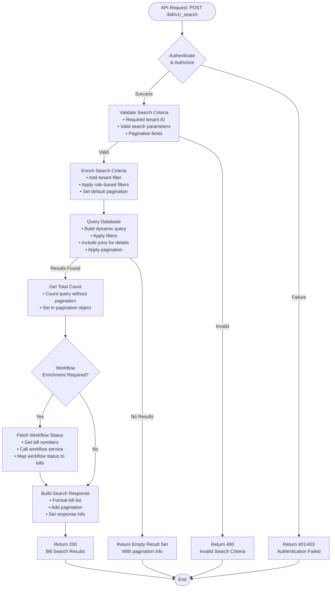

### Error Handling Flow

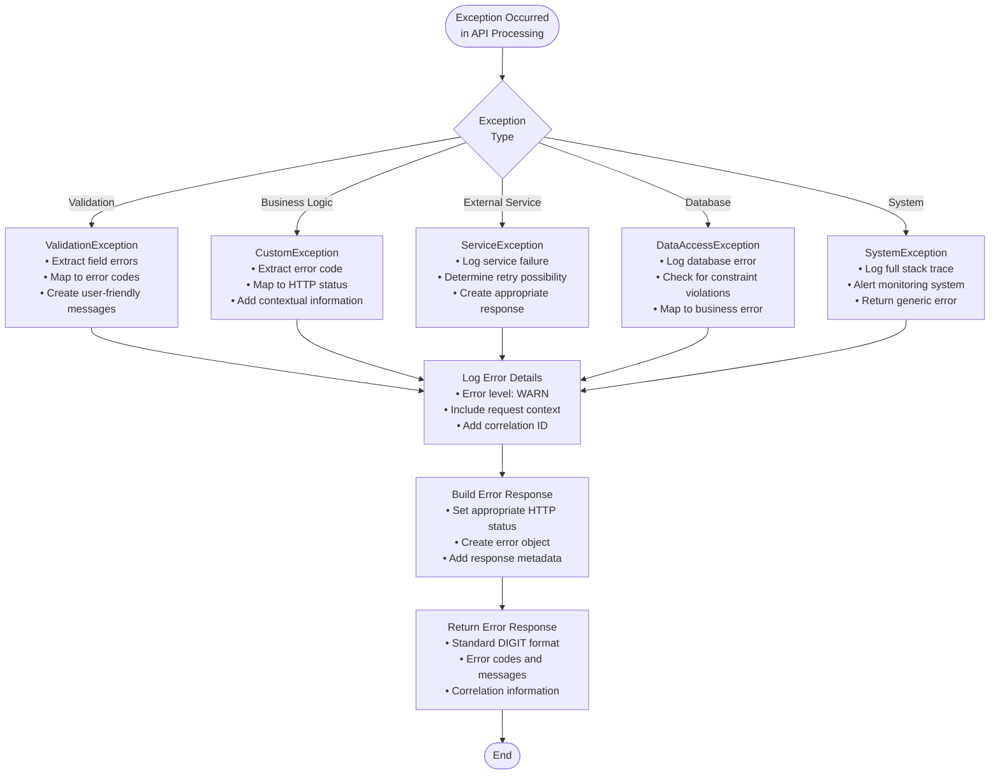

---

This comprehensive technical documentation covers all aspects of the Expense Service implementation in the DIGIT Works platform, providing detailed insights into the architecture, APIs, data models, business flows, and operational considerations.