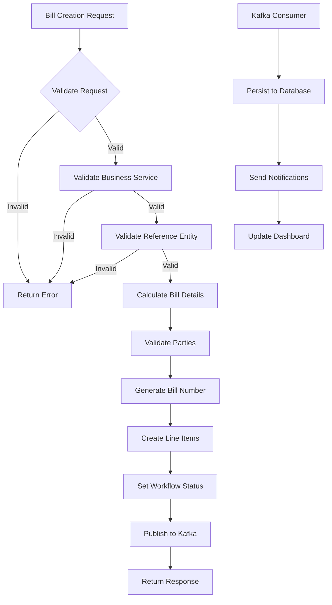
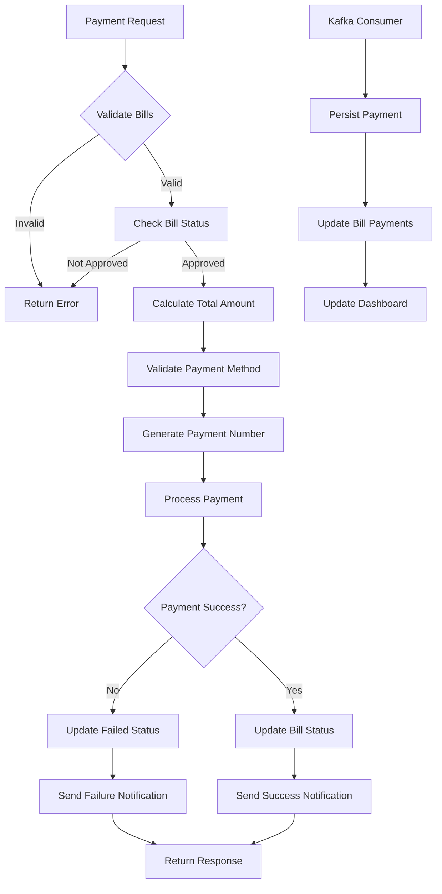
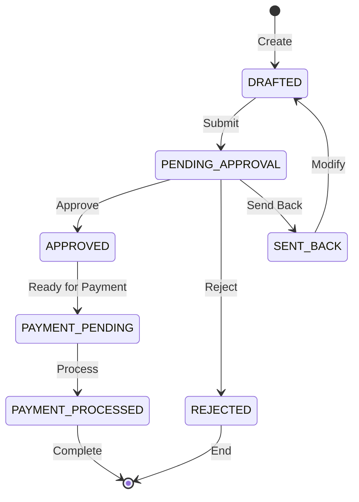
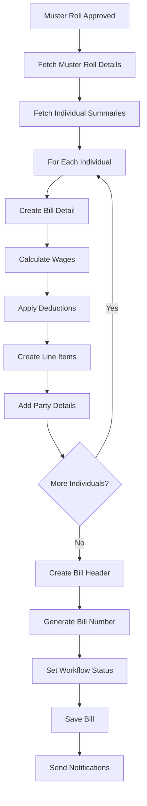

# Expense Service - Technical Documentation

## Table of Contents
1. [System & Architecture Overview](#system--architecture-overview)
2. [API Documentation](#api-documentation)
3. [Domain Models & Data Structures](#domain-models--data-structures)
4. [Database Design](#database-design)
5. [Configuration & Application Properties](#configuration--application-properties)
6. [Service Dependencies](#service-dependencies)
7. [External Dependencies](#external-dependencies)
8. [Events & Messaging](#events--messaging)
9. [Execution & Business Flows](#execution--business-flows)
10. [Security Considerations](#security-considerations)

---

## System & Architecture Overview

### Service Purpose
The Expense Service implements comprehensive bill and payment functionality for the DIGIT-Works ecosystem. It manages the creation, processing, and tracking of various types of bills (wage, purchase, supervision) and their corresponding payments. The service works in combination with calculator services to generate accurate billing based on work completion and attendance data.

### Key Features
- **Multi-type Bill Management**: Support for wage bills, purchase bills, and supervision bills
- **Payment Processing**: Group bills into payments and track payment status
- **Workflow Integration**: Configurable approval workflows for different bill types
- **Line Item Management**: Detailed breakdown of bill components and charges
- **Party Management**: Track payers and payees for bills and payments
- **Integration Ready**: Seamless integration with calculators, organizations, and workflow services

### System Architecture

```mermaid
graph TB
    subgraph "External Systems"
        CALCULATOR[Expense Calculator]
        ORGANISATION[Organisation Service]
        INDIVIDUAL[Individual Service]
        CONTRACT[Contract Service]
        WORKFLOW[Workflow Service]
        IDGEN[ID Generation Service]
        NOTIFICATION[Notification Service]
        HRMS[HRMS Service]
    end
    
    subgraph "Expense Service"
        API[Expense API Controller]
        BILLAPI[Bill API Controller]
        PAYAPI[Payment API Controller]
        
        subgraph "Service Layer"
            BILLSVC[Bill Service]
            PAYSVC[Payment Service]
            CALCSVC[Calculation Service]
            NOTISVC[Notification Service]
            WFSVC[Workflow Service]
        end
        
        subgraph "Enrichment Layer"
            BILLENR[Bill Enrichment]
            PAYENR[Payment Enrichment]
            PARTYENR[Party Enrichment]
        end
        
        subgraph "Validation Layer"
            BILLVAL[Bill Validator]
            PAYVAL[Payment Validator]
            AMOUNTVAL[Amount Validator]
        end
        
        subgraph "Data Layer"
            BILLREPO[Bill Repository]
            PAYREPO[Payment Repository]
            DETAILREPO[Bill Detail Repository]
            LINEREPO[Line Item Repository]
            PARTYREPO[Party Repository]
        end
        
        subgraph "Infrastructure"
            KAFKA[Kafka Producer/Consumer]
            DB[(PostgreSQL Database)]
            CACHE[Cache Layer]
        end
    end
    
    API --> BILLAPI
    API --> PAYAPI
    BILLAPI --> BILLSVC
    PAYAPI --> PAYSVC
    
    BILLSVC --> BILLENR
    BILLSVC --> BILLVAL
    BILLSVC --> CALCSVC
    BILLSVC --> WFSVC
    
    PAYSVC --> PAYENR
    PAYSVC --> PAYVAL
    PAYSVC --> NOTISVC
    
    BILLSVC --> BILLREPO
    BILLSVC --> DETAILREPO
    BILLSVC --> LINEREPO
    BILLSVC --> PARTYREPO
    
    PAYSVC --> PAYREPO
    
    BILLREPO --> DB
    PAYREPO --> DB
    DETAILREPO --> DB
    LINEREPO --> DB
    PARTYREPO --> DB
    
    BILLSVC --> KAFKA
    PAYSVC --> KAFKA
    NOTISVC --> KAFKA
    
    CALCSVC --> CALCULATOR
    BILLSVC --> ORGANISATION
    BILLSVC --> INDIVIDUAL
    BILLSVC --> CONTRACT
    WFSVC --> WORKFLOW
    BILLSVC --> IDGEN
    NOTISVC --> NOTIFICATION
    BILLSVC --> HRMS
```



---

## API Documentation

### Base Configuration
- **Context Path**: `/expense`
- **Port**: 8099
- **API Version**: v1

### Endpoints

#### 1. Create Bill
**POST** `/expense/bill/v1/_create`

Creates a new bill (wage, purchase, or supervision).

**Request Body:**
```json
{
  "RequestInfo": {
    "apiId": "expense-service",
    "ver": "1.0",
    "ts": 1675234567890,
    "action": "_create",
    "did": "",
    "key": "",
    "msgId": "20230201-123456",
    "authToken": "auth-token",
    "userInfo": {
      "id": 12345,
      "userName": "accounts1",
      "roles": [{"code": "BILL_CREATOR", "name": "Bill Creator"}]
    }
  },
  "bills": [{
    "tenantId": "pb.amritsar",
    "billType": "EXPENSE.WAGES",
    "businessService": "EXPENSE.WAGES",
    "billNumber": "WB/2024-25/00001",
    "billDate": 1675234567890,
    "dueDate": 1675407367890,
    "fromPeriod": 1675209600000,
    "toPeriod": 1675468800000,
    "referenceId": "muster-roll-uuid-123",
    "totalAmount": 150000.00,
    "status": "ACTIVE",
    "paymentStatus": "UNPAID",
    "billDetails": [{
      "id": "bill-detail-uuid-456",
      "referenceId": "individual-uuid-789",
      "totalAmount": 5000.00,
      "fromPeriod": 1675209600000,
      "toPeriod": 1675468800000,
      "status": "ACTIVE",
      "lineItems": [{
        "headCode": "LABOUR_WAGES",
        "amount": 4500.00,
        "type": "CREDIT",
        "status": "ACTIVE",
        "isLineItemPayable": true
      }, {
        "headCode": "TDS",
        "amount": 500.00,
        "type": "DEBIT",
        "status": "ACTIVE",
        "isLineItemPayable": false
      }]
    }],
    "parties": [{
      "type": "PAYEE",
      "identifier": "individual-uuid-789",
      "status": "ACTIVE"
    }],
    "additionalDetails": {
      "projectId": "project-uuid-123",
      "contractId": "contract-uuid-456",
      "musterRollNumber": "MR/2024-25/02/01/001"
    }
  }],
  "workflow": {
    "action": "SUBMIT",
    "comment": "Submitting wage bill for approval",
    "assignees": ["approver-uuid-789"]
  }
}
```

#### 2. Update Bill
**POST** `/expense/bill/v1/_update`

Updates an existing bill.

#### 3. Search Bills
**POST** `/expense/bill/v1/_search`

Searches bills based on various criteria.

**Query Parameters:**
- `tenantId` (required): Tenant identifier
- `ids`: List of bill UUIDs
- `billNumber`: Bill number
- `businessService`: Business service type
- `billType`: Type of bill (EXPENSE.WAGES, EXPENSE.PURCHASE, EXPENSE.SUPERVISION)
- `referenceId`: Reference entity ID
- `paymentStatus`: Payment status
- `status`: Bill status
- `fromDate`: Bill date from
- `toDate`: Bill date to
- `limit`: Number of records (default: 100, max: 200)
- `offset`: Page offset (default: 0)

#### 4. Create Payment
**POST** `/expense/payment/v1/_create`

Creates a payment for one or more bills.

**Request Body:**
```json
{
  "RequestInfo": {...},
  "payments": [{
    "tenantId": "pb.amritsar",
    "paymentNumber": "PAY/2024-25/00001",
    "paymentDate": 1675234567890,
    "totalAmount": 150000.00,
    "totalPaidAmount": 150000.00,
    "paymentStatus": "SUCCESSFUL",
    "referenceStatus": "PAYMENT_SUCCESSFUL",
    "bills": [
      "bill-uuid-123",
      "bill-uuid-456"
    ],
    "paymentDetails": {
      "paymentMethod": "BANK_TRANSFER",
      "transactionId": "TXN123456789",
      "bankAccount": "bank-account-uuid-789"
    },
    "additionalDetails": {
      "paymentMode": "ONLINE",
      "chequeNumber": null,
      "chequeDate": null
    }
  }]
}
```

#### 5. Update Payment
**POST** `/expense/payment/v1/_update`

Updates payment status and details.

#### 6. Search Payments
**POST** `/expense/payment/v1/_search`

Searches payments based on various criteria.

---

## Domain Models & Data Structures

### Core Models

#### Bill Model
```java
public class Bill {
    private String id;                          // UUID
    private String tenantId;                    // Tenant identifier
    private String billNumber;                  // Auto-generated bill number
    private String businessService;             // Business service type
    private String billType;                    // EXPENSE.WAGES/PURCHASE/SUPERVISION
    private Long billDate;                      // Bill creation date
    private Long dueDate;                       // Payment due date
    private BigDecimal totalAmount;             // Total bill amount
    private BigDecimal totalPaidAmount;         // Total paid amount
    private String referenceId;                 // Reference entity (muster roll, contract, etc.)
    private Long fromPeriod;                    // Period start date
    private Long toPeriod;                      // Period end date
    private String status;                      // ACTIVE/INACTIVE
    private String paymentStatus;               // PAID/UNPAID/PARTIALLY_PAID
    private List<BillDetail> billDetails;       // Bill line items
    private List<Party> parties;               // Payers and payees
    private Workflow workflow;                  // Workflow details
    private AuditDetails auditDetails;          // Audit information
    private Object additionalDetails;           // Additional data
}
```

#### BillDetail Model
```java
public class BillDetail {
    private String id;                          // UUID
    private String tenantId;                    // Tenant identifier
    private String billId;                      // Parent bill reference
    private String referenceId;                 // Entity reference (individual, item, etc.)
    private BigDecimal totalAmount;             // Total amount for this detail
    private BigDecimal totalPaidAmount;         // Total paid for this detail
    private String paymentStatus;               // PAID/UNPAID/PARTIALLY_PAID
    private String status;                      // ACTIVE/INACTIVE
    private Long fromPeriod;                    // Period start
    private Long toPeriod;                      // Period end
    private BigDecimal netLineItemAmount;       // Net amount after deductions
    private List<LineItem> lineItems;           // Individual line items
    private AuditDetails auditDetails;          // Audit information
    private Object additionalDetails;           // Additional data
}
```

#### LineItem Model
```java
public class LineItem {
    private String id;                          // UUID
    private String billDetailId;                // Parent bill detail reference
    private String tenantId;                    // Tenant identifier
    private String headCode;                    // Chart of accounts code
    private BigDecimal amount;                  // Line item amount
    private BigDecimal paidAmount;              // Paid amount
    private String type;                        // CREDIT/DEBIT
    private String status;                      // ACTIVE/INACTIVE
    private String paymentStatus;               // Payment status
    private Boolean isLineItemPayable;          // Whether this item is payable
    private AuditDetails auditDetails;          // Audit information
    private Object additionalDetails;           // Additional data
}
```

#### Payment Model
```java
public class Payment {
    private String id;                          // UUID
    private String tenantId;                    // Tenant identifier
    private String paymentNumber;               // Auto-generated payment number
    private Long paymentDate;                   // Payment date
    private BigDecimal totalAmount;             // Total payment amount
    private BigDecimal totalPaidAmount;         // Actual paid amount
    private String paymentStatus;               // INITIATED/SUCCESSFUL/FAILED
    private String referenceStatus;             // Reference status for bills
    private List<String> bills;                 // Associated bill IDs
    private PaymentDetails paymentDetails;      // Payment method details
    private AuditDetails auditDetails;          // Audit information
    private Object additionalDetails;           // Additional data
}
```

#### Party Model
```java
public class Party {
    private String id;                          // UUID
    private String tenantId;                    // Tenant identifier
    private String type;                        // PAYER/PAYEE
    private String status;                      // ACTIVE/INACTIVE
    private String identifier;                  // Individual/Organisation ID
    private String parentId;                    // Bill or bill detail ID
    private AuditDetails auditDetails;          // Audit information
    private Object additionalDetails;           // Additional data
}
```

---

## Database Design

### Database Schema

#### eg_expense_bill Table
```sql
CREATE TABLE eg_expense_bill (
    id                      character varying(64) NOT NULL,
    tenantid               character varying(250) NOT NULL,
    billdate               bigint NOT NULL,
    duedate                bigint,
    totalamount            numeric(12,2),
    totalpaidamount        numeric(12,2),
    businessservice        character varying(250) NOT NULL,
    referenceid            character varying(250) NOT NULL,
    fromperiod             bigint,
    toperiod               bigint,
    status                 character varying(64) NOT NULL,
    paymentstatus          character varying(64),
    billnumber             character varying(128) NOT NULL,
    createdby              character varying(64) NOT NULL,
    createdtime            bigint NOT NULL,
    lastmodifiedby         character varying(64) NOT NULL,
    lastmodifiedtime       bigint NOT NULL,
    additionaldetails      jsonb,
    CONSTRAINT pk_eg_expense_bill PRIMARY KEY (id, tenantid)
);

CREATE UNIQUE INDEX index_unique_eg_expense_bill ON eg_expense_bill (referenceid, businessservice, tenantid) WHERE status != 'INACTIVE';
CREATE INDEX idx_bill_tenant ON eg_expense_bill(tenantid);
CREATE INDEX idx_bill_business_service ON eg_expense_bill(businessservice);
CREATE INDEX idx_bill_payment_status ON eg_expense_bill(paymentstatus);
CREATE INDEX idx_bill_dates ON eg_expense_bill(billdate);
CREATE INDEX idx_bill_reference ON eg_expense_bill(referenceid);
```

#### eg_expense_billdetail Table
```sql
CREATE TABLE eg_expense_billdetail (
    id                      character varying(64) NOT NULL,
    tenantid               character varying(250) NOT NULL,
    referenceid            character varying(250),
    billid                 character varying(64) NOT NULL,
    totalamount            numeric(12,2),
    totalpaidamount        numeric(12,2),
    paymentstatus          character varying(64),
    status                 character varying(64) NOT NULL,
    fromperiod             bigint,
    toperiod               bigint,
    netlineitemamount      numeric(12,2),
    createdby              character varying(64) NOT NULL,
    createdtime            bigint NOT NULL,
    lastmodifiedby         character varying(64) NOT NULL,
    lastmodifiedtime       bigint NOT NULL,
    additionaldetails      jsonb,
    CONSTRAINT pk_eg_expense_billdetail PRIMARY KEY (id, tenantid),
    CONSTRAINT fk_eg_expense_billdetail FOREIGN KEY (billid, tenantid) REFERENCES eg_expense_bill (id, tenantid)
);

CREATE INDEX idx_billdetail_bill ON eg_expense_billdetail(billid);
CREATE INDEX idx_billdetail_reference ON eg_expense_billdetail(referenceid);
CREATE INDEX idx_billdetail_payment_status ON eg_expense_billdetail(paymentstatus);
```

#### eg_expense_lineitem Table
```sql
CREATE TABLE eg_expense_lineitem (
    id                      character varying(64) NOT NULL,
    billdetailid           character varying(64) NOT NULL,
    tenantid               character varying(250) NOT NULL,
    headcode               character varying(250) NOT NULL,
    amount                 numeric(12,2) NOT NULL,
    paidamount             numeric(12,2) NOT NULL,
    type                   character varying(64) NOT NULL,
    status                 character varying(64) NOT NULL,
    paymentstatus          character varying(64),
    islineitempayable      boolean NOT NULL,
    createdby              character varying(64) NOT NULL,
    createdtime            bigint NOT NULL,
    lastmodifiedby         character varying(64) NOT NULL,
    lastmodifiedtime       bigint NOT NULL,
    additionaldetails      jsonb,
    CONSTRAINT pk_eg_expense_lineitem PRIMARY KEY (id, tenantid),
    CONSTRAINT fk_eg_expense_lineitem FOREIGN KEY (billdetailid, tenantid) REFERENCES eg_expense_billdetail (id, tenantid)
);

CREATE INDEX idx_lineitem_billdetail ON eg_expense_lineitem(billdetailid);
CREATE INDEX idx_lineitem_head ON eg_expense_lineitem(headcode);
CREATE INDEX idx_lineitem_type ON eg_expense_lineitem(type);
CREATE INDEX idx_lineitem_payable ON eg_expense_lineitem(islineitempayable);
```

#### eg_expense_payment Table
```sql
CREATE TABLE eg_expense_payment (
    id                      character varying(64) NOT NULL,
    tenantid               character varying(250) NOT NULL,
    paymentnumber          character varying(128) NOT NULL,
    paymentdate            bigint NOT NULL,
    totalamount            numeric(12,2) NOT NULL,
    totalpaidamount        numeric(12,2),
    paymentstatus          character varying(64) NOT NULL,
    referencestatus        character varying(64),
    createdby              character varying(64) NOT NULL,
    createdtime            bigint NOT NULL,
    lastmodifiedby         character varying(64) NOT NULL,
    lastmodifiedtime       bigint NOT NULL,
    additionaldetails      jsonb,
    CONSTRAINT pk_eg_expense_payment PRIMARY KEY (id, tenantid)
);

CREATE INDEX idx_payment_tenant ON eg_expense_payment(tenantid);
CREATE INDEX idx_payment_status ON eg_expense_payment(paymentstatus);
CREATE INDEX idx_payment_date ON eg_expense_payment(paymentdate);
CREATE INDEX idx_payment_number ON eg_expense_payment(paymentnumber);
```

#### eg_expense_party Table
```sql
CREATE TABLE eg_expense_party (
    id                      character varying(64) NOT NULL,
    tenantid               character varying(250) NOT NULL,
    type                   character varying(250) NOT NULL,
    status                 character varying(64) NOT NULL,
    identifier             character varying(250) NOT NULL,
    parentid               character varying(250) NOT NULL,
    createdby              character varying(64) NOT NULL,
    createdtime            bigint NOT NULL,
    lastmodifiedby         character varying(64) NOT NULL,
    lastmodifiedtime       bigint NOT NULL,
    additionaldetails      jsonb,
    CONSTRAINT pk_eg_expense_party PRIMARY KEY (id, tenantid)
);

CREATE INDEX idx_party_type ON eg_expense_party(type);
CREATE INDEX idx_party_identifier ON eg_expense_party(identifier);
CREATE INDEX idx_party_parent ON eg_expense_party(parentid);
```

---

## Configuration & Application Properties

### Server Configuration
```properties
server.contextPath=/expense
server.servlet.contextPath=/expense
server.port=8099
app.timezone=UTC

# Database Configuration
spring.datasource.driver-class-name=org.postgresql.Driver
spring.datasource.url=jdbc:postgresql://localhost:5432/digit-works
spring.datasource.username=postgres
spring.datasource.password=postgres

# Flyway Configuration
spring.flyway.url=jdbc:postgresql://localhost:5432/digit-works
spring.flyway.user=postgres
spring.flyway.password=postgres
spring.flyway.table=expense_schema
spring.flyway.baseline-on-migrate=true
spring.flyway.outOfOrder=true
spring.flyway.locations=classpath:/db/migration/main
spring.flyway.enabled=true

# Kafka Configuration
kafka.config.bootstrap_server_config=localhost:9092
spring.kafka.consumer.group-id=expense
spring.kafka.producer.key-serializer=org.apache.kafka.common.serialization.StringSerializer
spring.kafka.producer.value-serializer=org.springframework.kafka.support.serializer.JsonSerializer

# Kafka Topics
expense.billing.bill.create=expense-bill-create
expense.billing.bill.update=expense-bill-update
expense.billing.payment.create=expense-payment-create
expense.billing.payment.update=expense-payment-update

# Search Configuration
expense.billing.default.limit=100
expense.billing.default.offset=0
expense.billing.search.max.limit=200

# Payment Configuration
expense.payment.default.status=INITIATED
expense.reference.default.status=PAYMENT_INITIATED

# Workflow Configuration
business.workflow.status.map={"EXPENSE.WAGES":"true","EXPENSE.PURCHASE":"false","EXPENSE.SUPERVISION":"true"}
expense.workflow.module.name=expense

# Notification Configuration
notification.sms.enabled=true
sms.isAdditonalFieldRequired=true
kafka.topics.works.notification.sms.name=works.notification.sms
```

---

## Service Dependencies

### Internal DIGIT Services

1. **Organisation Service** (`works.organisation.host`)
   - **Purpose**: Validate contractors and organizations
   - **APIs Used**: `/org-services/organisation/v1/_search`
   - **Usage**: Validate bill parties, fetch organization details

2. **Individual Service** (`works.individual.host`)
   - **Purpose**: Validate individuals and wage seekers
   - **APIs Used**: `/individual/v1/_search`
   - **Usage**: Validate payees, fetch individual details

3. **Contract Service** (`works.contract.host`)
   - **Purpose**: Contract details and validation
   - **APIs Used**: `/contract/v1/_search`
   - **Usage**: Validate contract references, fetch contract terms

4. **Workflow Service** (`egov.workflow.host`)
   - **Purpose**: Bill approval workflows
   - **APIs Used**: 
     - `/egov-workflow-v2/egov-wf/process/_transition`
     - `/egov-workflow-v2/egov-wf/process/_search`
   - **Usage**: Handle bill approval workflows

5. **ID Generation Service** (`egov.idgen.host`)
   - **Purpose**: Generate bill and payment numbers
   - **APIs Used**: `/egov-idgen/id/_generate`
   - **Usage**: Auto-generate bill numbers and payment numbers

6. **HRMS Service** (`egov.hrms.host`)
   - **Purpose**: Employee validation
   - **APIs Used**: `/egov-hrms/employees/_search`
   - **Usage**: Validate employee references in bills

7. **Notification Service**
   - **Purpose**: Send notifications
   - **Integration**: Via Kafka topics
   - **Events**: Bill creation, approval, payment notifications

---

## External Dependencies

### Infrastructure Dependencies

1. **PostgreSQL Database**
   - **Version**: 12+
   - **Purpose**: Primary data storage
   - **Configuration**:
     ```properties
     spring.datasource.hikari.maximum-pool-size=10
     spring.datasource.hikari.connection-timeout=30000
     ```

2. **Apache Kafka**
   - **Version**: 2.8+
   - **Purpose**: Event streaming and async processing
   - **Topics Required**:
     - expense-bill-create
     - expense-bill-update
     - expense-payment-create
     - expense-payment-update
     - works.notification.sms
   - **Configuration**:
     ```properties
     spring.kafka.consumer.auto-offset-reset=earliest
     spring.kafka.producer.properties.max.request.size=5242880
     ```

### External Service Dependencies

1. **Payment Gateway**
   - **Purpose**: Process actual payments
   - **Integration**: REST API calls
   - **Usage**: Bank transfers, digital payments

2. **Banking APIs**
   - **Purpose**: Account validation and transfers
   - **APIs**: Bank-specific APIs
   - **Usage**: Validate account numbers, process transfers

3. **Tax Calculation Services**
   - **Purpose**: Calculate tax deductions
   - **Integration**: External tax service APIs
   - **Usage**: TDS calculations, GST computations

4. **Accounting Systems**
   - **Purpose**: Financial reporting integration
   - **APIs**: ERP system APIs
   - **Usage**: Export financial data, accounting entries

---

## Events & Messaging

### Kafka Topics

#### Produced Events

| Topic | Purpose | Event Schema |
|-------|---------|--------------|
| `expense-bill-create` | Create bill | BillRequest |
| `expense-bill-update` | Update bill | BillRequest |
| `expense-payment-create` | Create payment | PaymentRequest |
| `expense-payment-update` | Update payment | PaymentRequest |
| `works.notification.sms` | Send notifications | NotificationRequest |

#### Consumed Events

| Topic | Purpose | Handler |
|-------|---------|---------|
| `muster-roll-approved` | Create wage bills | MusterRollBillHandler |
| `contract-milestone-completed` | Create purchase bills | PurchaseBillHandler |

### Event Schema

```json
{
  "RequestInfo": {
    "apiId": "expense-service",
    "ver": "1.0",
    "ts": 1675234567890,
    "action": "create",
    "userInfo": {...}
  },
  "bills": [{
    "id": "bill-uuid",
    "tenantId": "pb.amritsar",
    "billNumber": "WB/2024-25/00001",
    "businessService": "EXPENSE.WAGES",
    "totalAmount": 150000.00,
    "referenceId": "muster-roll-uuid-123",
    "billDetails": [...],
    "parties": [...],
    "auditDetails": {...}
  }]
}
```

---

## Execution & Business Flows

### 1. Bill Creation Flow



### 2. Payment Processing Flow



### 3. Bill Approval Workflow



### 4. Wage Bill Generation Flow



---

## Security Considerations

### Authentication & Authorization
1. **JWT Token Validation**: All APIs require valid JWT tokens
2. **Role-Based Access Control**:
   - BILL_CREATOR: Create and submit bills
   - BILL_APPROVER: Approve bills
   - PAYMENT_PROCESSOR: Process payments
   - FINANCE_ADMIN: Full access to bills and payments
   - AUDITOR: Read-only access for audit purposes

### Data Security
1. **Financial Data Protection**:
   - Bill amounts encrypted in transit and at rest
   - Access logging for all financial operations
   - Audit trail for all modifications

2. **Input Validation**:
   - Amount validation with reasonable limits
   - Business logic validation
   - Party validation against master data

3. **Payment Security**:
   - Secure payment processing
   - Bank account validation
   - Transaction integrity checks

### Compliance & Audit
1. **Financial Compliance**:
   - Immutable bill records once approved
   - Complete audit trail for all transactions
   - Regulatory compliance for payments

2. **Tax Compliance**:
   - Accurate tax calculations
   - TDS compliance
   - GST compliance where applicable

3. **Fraud Prevention**:
   - Duplicate bill detection
   - Amount threshold validations
   - Multi-level approval workflows

### Performance & Monitoring
1. **Database Optimization**: Proper indexing for bill and payment queries
2. **Calculation Performance**: Optimized algorithms for complex calculations
3. **Monitoring**: Real-time monitoring of bill processing
4. **Alerting**: Automated alerts for failed payments and anomalies