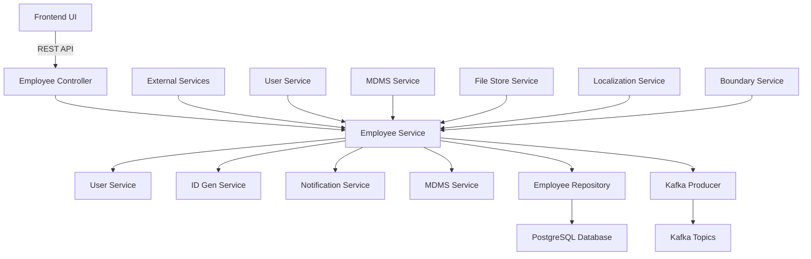
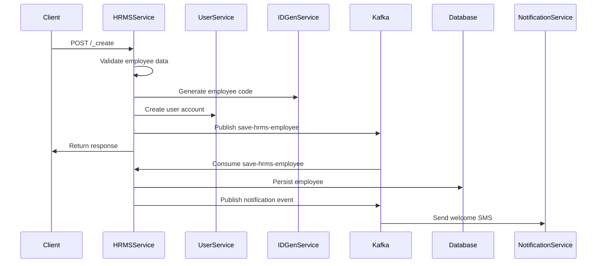
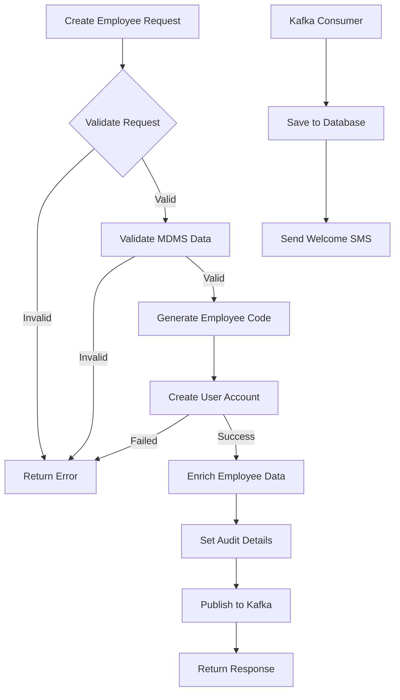
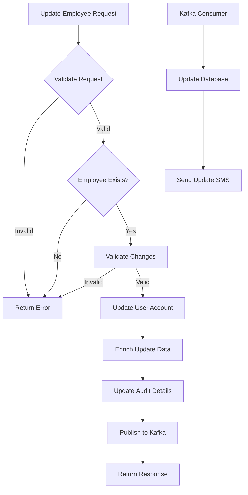
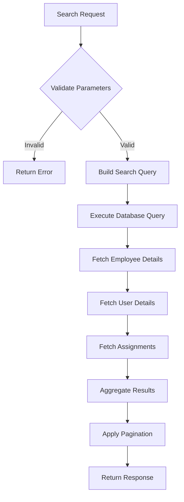
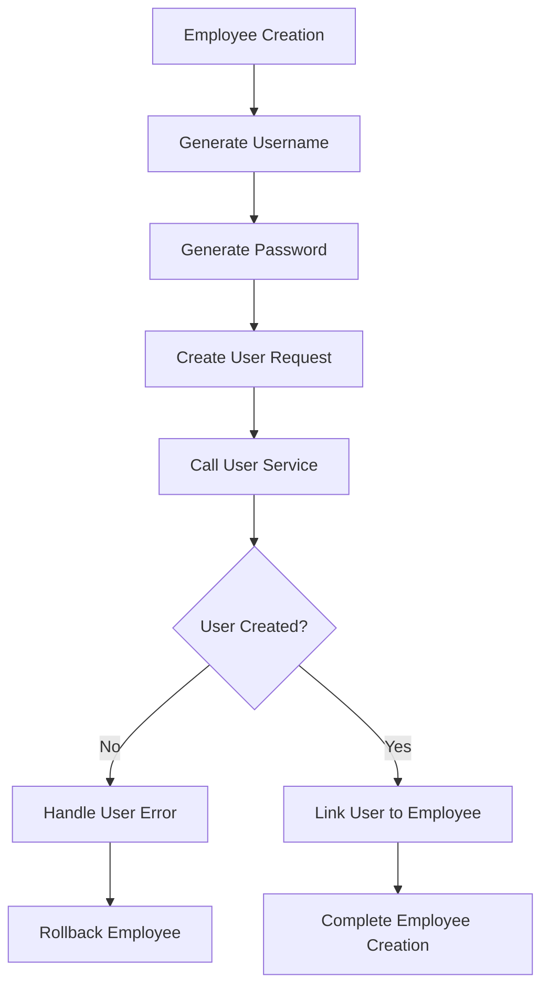
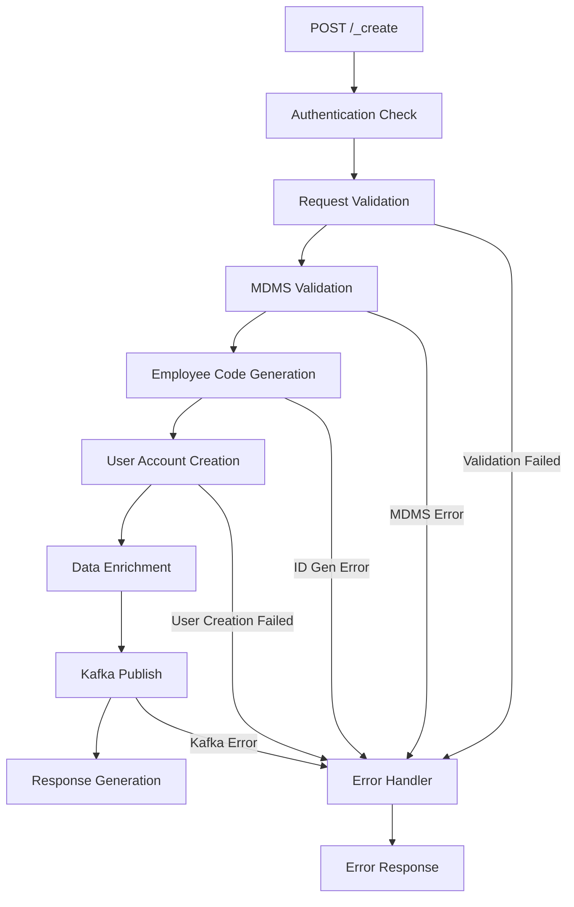
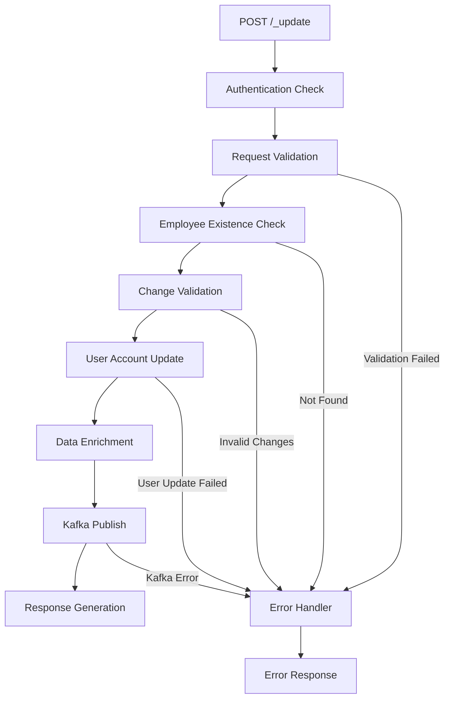
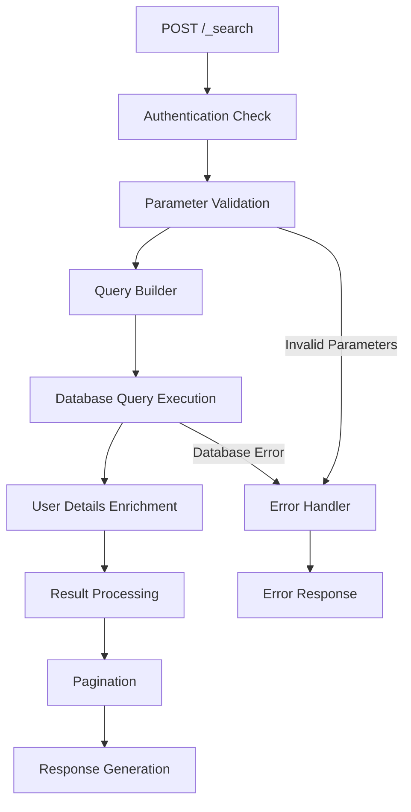
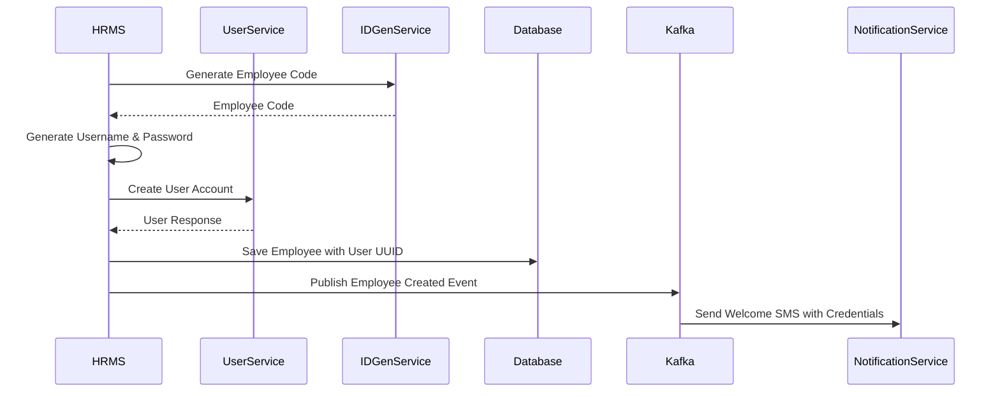

# HRMS Service Documentation

## Table of Contents
1. [System & Architecture Overview](#system--architecture-overview)
2. [API Documentation](#api-documentation)
3. [Domain Models & Data Structures](#domain-models--data-structures)
4. [Database Design](#database-design)
5. [Configuration & Application Properties](#configuration--application-properties)
6. [Service Dependencies](#service-dependencies)
7. [Events & Messaging](#events--messaging)
8. [Execution & Business Flows](#execution--business-flows)
9. [Security Considerations](#security-considerations)
10. [API Flow Diagrams](#api-flow-diagrams)

## System & Architecture Overview

The HRMS (Human Resource Management System) Service is a Spring Boot microservice that manages employee lifecycle in the DIGIT Works platform. It handles employee creation, updates, assignments, and integrates with user service for account creation and management.



### Core Components

- **Controllers**: REST endpoints for employee operations
- **Services**: Business logic and employee lifecycle management
- **Validators**: Employee data validation and business rules
- **Repository**: Database operations and queries
- **User Integration**: Account creation and management
- **Kafka Integration**: Asynchronous processing and events

## API Documentation

### Base URL: `/egov-hrms/employees`

#### 1. Create Employee
- **Endpoint**: `POST /_create`
- **Description**: Creates a new employee with user account
- **Authentication**: Required (JWT token)

**Request Body**:
```json
{
  "RequestInfo": {
    "apiId": "hrms-service",
    "ver": "1.0",
    "ts": 1234567890,
    "action": "create",
    "did": "1",
    "key": "abcd-efgh",
    "msgId": "create employee request",
    "authToken": "{{token}}"
  },
  "employees": [
    {
      "tenantId": "od.testing",
      "code": "EMP-001",
      "employeeStatus": "EMPLOYED",
      "employeeType": "PERMANENT",
      "dateOfAppointment": 1234567890,
      "user": {
        "userName": "john.doe@example.com",
        "name": "John Doe",
        "mobileNumber": "+919876543210",
        "emailId": "john.doe@example.com",
        "type": "EMPLOYEE",
        "roles": [
          {
            "code": "EMPLOYEE",
            "name": "Employee"
          }
        ]
      },
      "assignments": [
        {
          "fromDate": 1234567890,
          "department": "ENGINEERING",
          "designation": "JUNIOR_ENGINEER",
          "isHOD": false,
          "isCurrentAssignment": true
        }
      ],
      "educationalDetails": [
        {
          "qualification": "B.Tech",
          "stream": "Civil Engineering",
          "yearOfPassing": 2020,
          "university": "State University",
          "remarks": "First Class"
        }
      ],
      "jurisdictions": [
        {
          "hierarchy": "REVENUE",
          "boundaryType": "DISTRICT",
          "boundary": "CUTTACK"
        }
      ]
    }
  ]
}
```

**Response**:
```json
{
  "ResponseInfo": {
    "apiId": "hrms-service",
    "ver": "1.0",
    "ts": 1234567890,
    "resMsgId": "uief87324",
    "msgId": "create employee request",
    "status": "successful"
  },
  "employees": [
    {
      "uuid": "employee-uuid",
      "tenantId": "od.testing",
      "code": "EMP-CUTTACK-000001",
      "employeeStatus": "EMPLOYED",
      "employeeType": "PERMANENT",
      "dateOfAppointment": 1234567890,
      "active": true,
      "user": {
        "uuid": "user-uuid",
        "userName": "john.doe@example.com",
        "name": "John Doe",
        "mobileNumber": "+919876543210",
        "emailId": "john.doe@example.com",
        "type": "EMPLOYEE"
      },
      "assignments": [...],
      "educationalDetails": [...],
      "jurisdictions": [...],
      "auditDetails": {
        "createdBy": "admin",
        "lastModifiedBy": "admin",
        "createdTime": 1234567890,
        "lastModifiedTime": 1234567890
      }
    }
  ]
}
```

#### 2. Update Employee
- **Endpoint**: `POST /_update`
- **Description**: Updates existing employee information
- **Authentication**: Required

#### 3. Search Employees
- **Endpoint**: `POST /_search`
- **Description**: Search and retrieve employees based on criteria

**Query Parameters**:
- `tenantId` (required): Tenant identifier
- `ids`: List of employee UUIDs
- `codes`: List of employee codes
- `phone`: Mobile number
- `names`: Employee names
- `departments`: Department codes
- `designations`: Designation codes
- `employeeStatus`: Employment status
- `employeeType`: Employee type
- `isActive`: Active status filter
- `limit`: Number of records (default: 200)
- `offset`: Page offset (default: 0)

#### 4. Count Employees
- **Endpoint**: `POST /_count`
- **Description**: Get count of employees for given tenant

### Error Handling

All APIs follow standard error response format:

```json
{
  "ResponseInfo": {
    "apiId": "hrms-service",
    "ver": "1.0",
    "ts": 1234567890,
    "resMsgId": "uief87324",
    "msgId": "create employee request",
    "status": "failed"
  },
  "Errors": [
    {
      "code": "INVALID_EMPLOYEE_DATA",
      "message": "Employee data validation failed",
      "description": "Date of appointment cannot be in future"
    }
  ]
}
```

## Domain Models & Data Structures

### Core Entities

#### Employee
```java
public class Employee {
    private String uuid;
    private String tenantId;
    private String code;
    private String employeeStatus;
    private String employeeType;
    private Long dateOfAppointment;
    private Boolean active;
    private User user;
    private List<Assignment> assignments;
    private List<EducationalDetails> educationalDetails;
    private List<DepartmentalTest> tests;
    private List<ServiceHistory> serviceHistory;
    private List<Jurisdiction> jurisdictions;
    private List<DeactivationDetails> deactivationDetails;
    private List<Document> documents;
    private AuditDetails auditDetails;
}
```

#### Assignment
```java
public class Assignment {
    private String uuid;
    private String employeeId;
    private Long position;
    private String department;
    private String designation;
    private Long fromDate;
    private Long toDate;
    private String govtOrderNumber;
    private String reportingTo;
    private Boolean isHOD;
    private Boolean isCurrentAssignment;
    private AuditDetails auditDetails;
}
```

#### User
```java
public class User {
    private String uuid;
    private String userName;
    private String name;
    private String mobileNumber;
    private String emailId;
    private String type;
    private Boolean active;
    private List<Role> roles;
    private String password;
    private AuditDetails auditDetails;
}
```

### Validation Rules

- **Employee Code**: Auto-generated format: EMP-[CITY]-[SEQUENCE]
- **Tenant ID**: Must be valid as per MDMS tenant configuration
- **Date of Appointment**: Cannot be in future
- **Phone Number**: Must be unique within tenant
- **Email**: Must be unique within tenant
- **Department/Designation**: Must exist in MDMS master data
- **Assignment Dates**: From date must be <= To date

### Enums

```java
public enum EmployeeStatus {
    EMPLOYED, RETIRED, DECEASED, TERMINATED, SUSPENDED
}

public enum EmployeeType {
    PERMANENT, TEMPORARY, CONTRACTUAL, OUTSOURCED
}

public enum UserType {
    CITIZEN, EMPLOYEE, SYSTEM
}
```

## Database Design

### Tables

#### eg_hrms_employee
```sql
CREATE TABLE eg_hrms_employee (
    id BIGINT NOT NULL,
    uuid CHARACTER VARYING(1024) NOT NULL,
    code CHARACTER VARYING(250),
    phone CHARACTER VARYING(250),
    name CHARACTER VARYING(250),
    dateOfAppointment BIGINT,
    employeestatus CHARACTER VARYING(250),
    employeetype CHARACTER VARYING(250),
    active BOOLEAN,
    tenantid CHARACTER VARYING(250) NOT NULL,
    createdby CHARACTER VARYING(250) NOT NULL,
    createddate BIGINT NOT NULL,
    lastmodifiedby CHARACTER VARYING(250),
    lastModifiedDate BIGINT,
    
    CONSTRAINT pk_eghrms_employee PRIMARY KEY (uuid),
    CONSTRAINT uk_eghrms_employee_code UNIQUE (code)
);

CREATE INDEX idx_hrms_employee_tenant_id ON eg_hrms_employee (tenantid);
CREATE INDEX idx_hrms_employee_code ON eg_hrms_employee (code);
CREATE INDEX idx_hrms_employee_phone ON eg_hrms_employee (phone);
CREATE INDEX idx_hrms_employee_status ON eg_hrms_employee (employeestatus);
```

#### eg_hrms_assignment
```sql
CREATE TABLE eg_hrms_assignment (
    uuid CHARACTER VARYING(1024) NOT NULL,
    employeeid CHARACTER VARYING(1024) NOT NULL,
    position BIGINT,
    department CHARACTER VARYING(250),
    designation CHARACTER VARYING(250),
    fromdate BIGINT,
    todate BIGINT,
    govtordernumber CHARACTER VARYING(250),
    reportingto CHARACTER VARYING(250),
    isHOD BOOLEAN,
    currentAssignment BOOLEAN,
    tenantid CHARACTER VARYING(250) NOT NULL,
    createdby CHARACTER VARYING(250) NOT NULL,
    createddate BIGINT NOT NULL,
    lastmodifiedby CHARACTER VARYING(250),
    lastModifiedDate BIGINT,
    
    CONSTRAINT pk_eghrms_assignment PRIMARY KEY (uuid),
    CONSTRAINT ck_eghrms_employee_fromTo CHECK (fromdate <= todate),
    CONSTRAINT fk_eghrms_assignment_employeeid FOREIGN KEY (employeeid) 
        REFERENCES eg_hrms_employee (uuid) ON DELETE CASCADE
);
```

#### eg_hrms_educationaldetails
```sql
CREATE TABLE eg_hrms_educationaldetails (
    uuid CHARACTER VARYING(1024) NOT NULL,
    employeeid CHARACTER VARYING(1024) NOT NULL,
    qualification CHARACTER VARYING(250),
    stream CHARACTER VARYING(250),
    yearofpassing BIGINT,
    university CHARACTER VARYING(250),
    remarks CHARACTER VARYING(250),
    tenantid CHARACTER VARYING(250) NOT NULL,
    createdby CHARACTER VARYING(250) NOT NULL,
    createddate BIGINT NOT NULL,
    lastmodifiedby CHARACTER VARYING(250),
    lastModifiedDate BIGINT,
    
    CONSTRAINT pk_eghrms_educationaldetails PRIMARY KEY (uuid),
    CONSTRAINT fk_eghrms_educationaldetails_employeeid FOREIGN KEY (employeeid) 
        REFERENCES eg_hrms_employee (uuid) ON DELETE CASCADE
);
```

### Entity Relationship Diagram

```mermaid
erDiagram
    EMPLOYEE ||--o{ ASSIGNMENT : has
    EMPLOYEE ||--o{ EDUCATIONAL_DETAILS : has
    EMPLOYEE ||--o{ SERVICE_HISTORY : has
    EMPLOYEE ||--o{ JURISDICTION : has
    EMPLOYEE ||--o{ DEACTIVATION_DETAILS : has
    EMPLOYEE ||--o{ EMPLOYEE_DOCUMENTS : has
    EMPLOYEE ||--|| USER : linked_to
    
    EMPLOYEE {
        varchar uuid PK
        varchar tenantid
        varchar code UK
        varchar phone
        varchar name
        bigint dateOfAppointment
        varchar employeestatus
        varchar employeetype
        boolean active
        audit_details
    }
    
    ASSIGNMENT {
        varchar uuid PK
        varchar employeeid FK
        bigint position
        varchar department
        varchar designation
        bigint fromdate
        bigint todate
        varchar govtordernumber
        varchar reportingto
        boolean isHOD
        boolean currentAssignment
        audit_details
    }
    
    USER {
        varchar uuid PK
        varchar userName UK
        varchar name
        varchar mobileNumber UK
        varchar emailId
        varchar type
        boolean active
        audit_details
    }
    
    EDUCATIONAL_DETAILS {
        varchar uuid PK
        varchar employeeid FK
        varchar qualification
        varchar stream
        bigint yearofpassing
        varchar university
        varchar remarks
        audit_details
    }
```

## Configuration & Application Properties

### Server Configuration
```properties
server.contextPath=/egov-hrms
server.servlet.context-path=/egov-hrms
server.port=9999
app.timezone=UTC
```

### Database Configuration
```properties
spring.datasource.driver-class-name=org.postgresql.Driver
spring.datasource.url=jdbc:postgresql://localhost:5432/egov_hrms
spring.datasource.username=postgres
spring.datasource.password=postgres

spring.flyway.url=jdbc:postgresql://localhost:5432/egov_hrms
spring.flyway.baseline-on-migrate=true
spring.flyway.locations=classpath:/db/migration/main,db/migration/seed
```

### Kafka Configuration
```properties
spring.kafka.bootstrap.servers=localhost:9092
spring.kafka.consumer.group-id=employee-group1
spring.kafka.consumer.value-deserializer=org.egov.tracer.kafka.deserializer.HashMapDeserializer
spring.kafka.producer.value-serializer=org.springframework.kafka.support.serializer.JsonSerializer

# Topics
kafka.topics.save.service=save-hrms-employee
kafka.topics.update.service=update-hrms-employee
kafka.topics.notification.sms=egov.core.notification.sms
kafka.topics.works.notification.sms.name=works.notification.sms
```

### External Service URLs
```properties
egov.user.host=https://dev.digit.org
egov.user.create.endpoint=/user/users/_createnovalidate
egov.user.update.endpoint=/user/users/_updatenovalidate
egov.user.search.endpoint=/user/v1/_search

egov.mdms.host=https://dev.digit.org
egov.mdms.search.endpoint=/egov-mdms-service/v1/_search

egov.idgen.host=https://dev.digit.org/
egov.idgen.path=egov-idgen/id/_generate
egov.idgen.ack.name=hrms.employeecode
egov.idgen.ack.format=EMP-[city]-[SEQ_EG_HRMS_EMP_CODE]

egov.localization.host=https://dev.digit.org
egov.localization.search.endpoint=/localization/messages/v1/_search

egov.boundary.host=http://localhost:8081
egov.boundary.search.url=/boundary-service/boundary/_search
```

### Business Configuration
```properties
egov.hrms.default.pagination.limit=200
egov.hrms.default.pwd.length=8
open.search.enabled.roles=SUPERUSER
egov.pwd.allowed.special.characters=@#$%
decryption.abac.enable=false
state.level.tenant.id=od
sms.isAdditonalFieldRequired=true
```

## Service Dependencies

### Internal DIGIT Services

1. **User Service** (`egov.user.host`)
   - **Purpose**: Create and manage user accounts for employees
   - **APIs Used**: `/user/users/_createnovalidate`, `/user/users/_updatenovalidate`, `/user/v1/_search`
   - **Usage**: Employee account lifecycle management

2. **MDMS Service** (`egov.mdms.host`)
   - **Purpose**: Master data validation (departments, designations, boundaries)
   - **APIs Used**: `/egov-mdms-service/v1/_search`
   - **Usage**: Validate department, designation, and boundary codes

3. **ID Generation Service** (`egov.idgen.host`)
   - **Purpose**: Generate unique employee codes
   - **APIs Used**: `/egov-idgen/id/_generate`
   - **Usage**: Auto-generate employee codes in format EMP-[CITY]-[SEQUENCE]

4. **Localization Service** (`egov.localization.host`)
   - **Purpose**: SMS notification content localization
   - **APIs Used**: `/localization/messages/v1/_search`
   - **Usage**: Multi-language notifications

5. **Boundary Service** (`egov.boundary.host`)
   - **Purpose**: Validate boundary hierarchies for jurisdictions
   - **APIs Used**: `/boundary-service/boundary/_search`
   - **Usage**: Employee jurisdiction assignment validation

### External Dependencies

1. **PostgreSQL Database**
   - **Purpose**: Primary data storage
   - **Connection**: JDBC connection pool
   - **Usage**: Store employee data, assignments, educational details

2. **Kafka Message Broker**
   - **Purpose**: Asynchronous processing and event streaming
   - **Topics**: `save-hrms-employee`, `update-hrms-employee`, `works.notification.sms`
   - **Usage**: Event-driven architecture, notifications

## Events & Messaging

### Kafka Topics

#### 1. save-hrms-employee
- **Purpose**: Persist newly created employees
- **Producer**: HRMS Service
- **Consumer**: HRMS Service (persistence consumer)
- **Event Schema**:
```json
{
  "RequestInfo": {...},
  "employees": [...]
}
```

#### 2. update-hrms-employee
- **Purpose**: Update existing employees
- **Producer**: HRMS Service
- **Consumer**: HRMS Service, downstream services
- **Event Schema**:
```json
{
  "RequestInfo": {...},
  "employees": [...]
}
```

#### 3. works.notification.sms
- **Purpose**: Send SMS notifications for employee operations
- **Producer**: HRMS Service
- **Consumer**: Notification Service
- **Event Schema**:
```json
{
  "message": "Employee account created successfully. Login: john.doe@example.com Password: Temp1234",
  "mobileNumber": "+919876543210",
  "additionalFields": {
    "templateCode": "EMPLOYEE_ACCOUNT_CREATED",
    "requestInfo": {...},
    "tenantId": "od.testing"
  }
}
```

### Event Processing Patterns

#### Create Employee Flow


## Execution & Business Flows

### 1. Employee Creation Flow



### 2. Employee Update Flow



### 3. Employee Search Flow



### 4. User Integration Flow



## Security Considerations

### Authentication & Authorization

1. **JWT Token Validation**
   - All APIs require valid JWT token in Authorization header
   - Token validation through `RequestInfo.authToken`
   - Integration with DIGIT user service for token validation

2. **Role-Based Access Control**
   - **HRMS_ADMIN**: Can create, update, and view employees
   - **HR_OFFICER**: Can view and update employee details
   - **EMPLOYEE**: Can view own profile
   - **SUPERUSER**: Full access across tenants

3. **Tenant Isolation**
   - All operations are scoped to tenant ID
   - Cross-tenant data access not allowed
   - Tenant validation against MDMS

### Input Validation

1. **Request Validation**
   - JSON schema validation for all API requests
   - Field length and format validation
   - Required field checks

2. **Business Rule Validation**
   - Employee code uniqueness within tenant
   - Phone number uniqueness within tenant
   - Email uniqueness within tenant
   - Department/designation existence validation
   - Assignment date logical validation

3. **SQL Injection Prevention**
   - Parameterized queries for all database operations
   - Input sanitization
   - No dynamic SQL construction

### Data Protection

1. **Sensitive Data Handling**
   - Employee personal data encryption
   - Password generation and secure transmission
   - Audit trail for all operations

2. **Encryption**
   - Database connections use SSL/TLS
   - Kafka messages encrypted in transit
   - Configuration secrets managed securely

## API Flow Diagrams

### 1. Create Employee API Flow



### 2. Update Employee API Flow



### 3. Search Employee API Flow



### 4. User Integration Flow



This comprehensive documentation provides detailed insights into the HRMS Service's architecture, APIs, data models, user integration, and technical implementation details for employee lifecycle management in DIGIT Works.