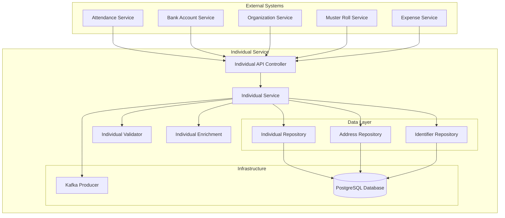
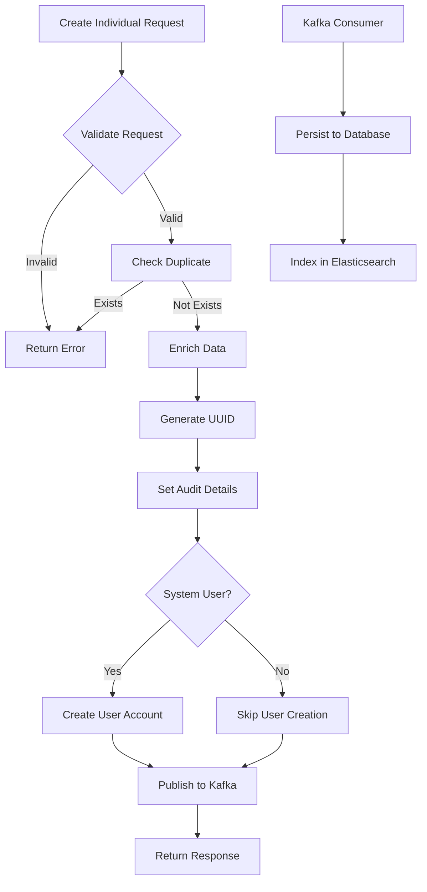
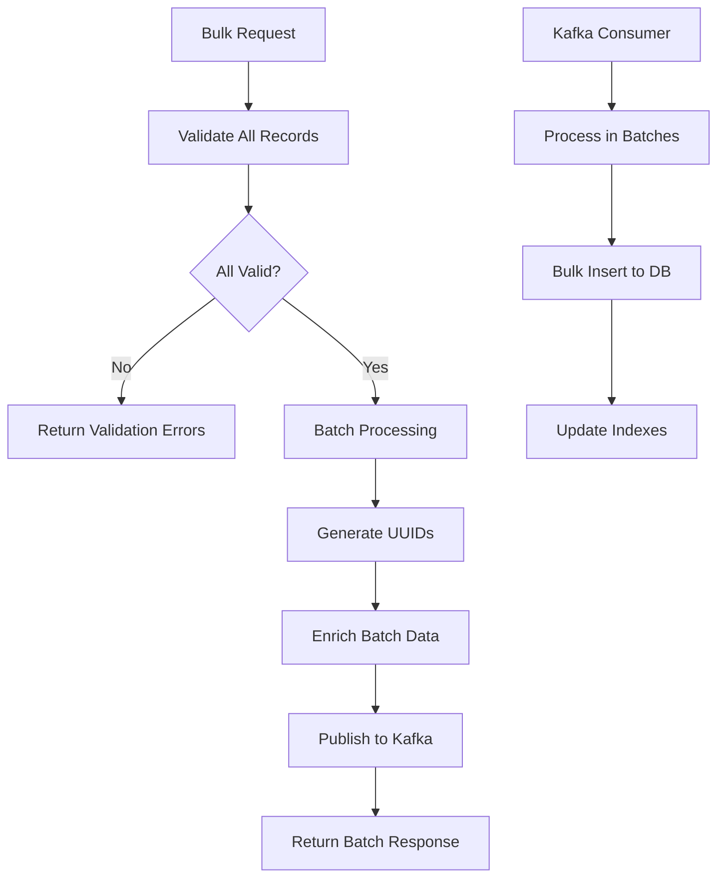

# Individual Service - Technical Documentation

## Table of Contents
1. [System & Architecture Overview](#system--architecture-overview)
2. [API Documentation](#api-documentation)
3. [Domain Models & Data Structures](#domain-models--data-structures)
4. [Database Design](#database-design)
5. [Configuration & Application Properties](#configuration--application-properties)
6. [Service Dependencies](#service-dependencies)
7. [External Dependencies](#external-dependencies)
8. [Events & Messaging](#events--messaging)
9. [Execution & Business Flows](#execution--business-flows)
10. [Security Considerations](#security-considerations)

---

## System & Architecture Overview

### Service Purpose
The Individual Service is a core registry service that maintains individual/person records on the DIGIT platform. It provides centralized person management with support for bulk operations, identity management, and address tracking.

### Key Features
- **Individual Registry**: Centralized person data management
- **Bulk Operations**: Efficient bulk create/update operations
- **Identity Management**: Multiple identifier support (Aadhaar, PAN, etc.)
- **Address Management**: Multiple address support per individual
- **Audit Trail**: Complete audit history for all operations
- **Multi-tenancy**: Tenant-based data isolation

### System Architecture



---

## API Documentation

### Base Configuration
- **Context Path**: `/individual`
- **Port**: 8008
- **API Version**: v1

### Endpoints

#### 1. Create Individual
**POST** `/individual/v1/_create`

Creates a new individual record.

**Request Body:**
```json
{
  "RequestInfo": {
    "apiId": "individual-service",
    "ver": "1.0",
    "ts": 1675234567890,
    "action": "_create",
    "did": "",
    "key": "",
    "msgId": "20230201-123456",
    "authToken": "auth-token",
    "userInfo": {
      "id": 12345,
      "userName": "user1",
      "roles": [{"code": "EMPLOYEE", "name": "Employee"}]
    }
  },
  "Individual": {
    "tenantId": "pb.amritsar",
    "name": {
      "givenName": "John",
      "familyName": "Doe",
      "otherNames": "William"
    },
    "dateOfBirth": "1990-01-01",
    "gender": "MALE",
    "mobileNumber": "9876543210",
    "altContactNumber": "9876543211",
    "email": "john.doe@example.com",
    "fatherName": "Robert Doe",
    "husbandName": "",
    "relationship": "FATHER",
    "identifiers": [
      {
        "identifierType": "AADHAAR",
        "identifierId": "1234-5678-9012"
      }
    ],
    "address": [
      {
        "tenantId": "pb.amritsar",
        "doorNo": "123",
        "latitude": 31.6340,
        "longitude": 74.8723,
        "locationAccuracy": 10,
        "type": "PERMANENT",
        "addressLine1": "Main Street",
        "addressLine2": "Near Park",
        "landmark": "City Park",
        "city": "Amritsar",
        "pincode": "143001",
        "detail": "House",
        "buildingName": "Green Villa",
        "street": "Main Street"
      }
    ],
    "isSystemUser": true,
    "userDetails": {
      "username": "johndoe",
      "password": "encrypted_password",
      "roles": ["CITIZEN"]
    }
  }
}
```

#### 2. Update Individual
**POST** `/individual/v1/_update`

Updates an existing individual record.

#### 3. Search Individuals
**POST** `/individual/v1/_search`

Searches for individuals based on various criteria.

**Query Parameters:**
- `tenantId` (required): Tenant identifier
- `ids`: List of individual UUIDs
- `mobileNumber`: Mobile number
- `name`: Name search (givenName/familyName)
- `gender`: Gender filter
- `identifierType`: Type of identifier
- `identifierId`: Identifier value
- `limit`: Number of records (default: 10, max: 100)
- `offset`: Page offset (default: 0)

#### 4. Bulk Create
**POST** `/individual/v1/bulk/_create`

Creates multiple individuals in a single request.

#### 5. Bulk Update
**POST** `/individual/v1/bulk/_update`

Updates multiple individuals in a single request.

---

## Domain Models & Data Structures

### Core Models

#### Individual Model
```java
public class Individual {
    private String id;                      // UUID
    private String tenantId;                // Tenant identifier
    private String clientReferenceId;       // External reference
    private Name name;                      // Name components
    private Date dateOfBirth;               // DOB
    private String gender;                  // MALE/FEMALE/OTHER/TRANSGENDER
    private String bloodGroup;              // Blood group
    private String mobileNumber;            // Primary contact
    private String altContactNumber;        // Alternate contact
    private String email;                   // Email address
    private String fatherName;              // Father's name
    private String husbandName;             // Husband's name
    private String relationship;            // Relationship type
    private List<Identifier> identifiers;   // Identity documents
    private List<Address> address;          // Addresses
    private Boolean isSystemUser;           // System user flag
    private String userUuid;                // User UUID reference
    private String userId;                  // User ID
    private String username;                // Username
    private String password;                // Encrypted password
    private UserDetails userDetails;        // User details
    private RowVersion rowVersion;          // Version control
    private Boolean isDeleted;              // Soft delete flag
    private AuditDetails auditDetails;      // Audit information
    private Object additionalFields;        // Additional data
}
```

#### Name Model
```java
public class Name {
    private String givenName;               // First name
    private String familyName;              // Last name
    private String otherNames;              // Middle/other names
}
```

#### Identifier Model
```java
public class Identifier {
    private String id;                      // UUID
    private String identifierType;          // AADHAAR/PAN/VOTER_ID/DRIVING_LICENSE
    private String identifierId;            // Identifier value
    private Boolean isDeleted;              // Soft delete flag
    private AuditDetails auditDetails;      // Audit information
}
```

#### Address Model
```java
public class Address {
    private String id;                      // UUID
    private String tenantId;                // Tenant identifier
    private String doorNo;                  // Door/House number
    private Double latitude;                // GPS latitude
    private Double longitude;               // GPS longitude
    private Double locationAccuracy;        // GPS accuracy
    private String type;                    // PERMANENT/CORRESPONDENCE/OTHER
    private String addressLine1;            // Address line 1
    private String addressLine2;            // Address line 2
    private String landmark;                // Landmark
    private String city;                    // City
    private String pincode;                 // Postal code
    private String detail;                  // Additional details
    private String buildingName;            // Building name
    private String street;                  // Street name
    private String locality;                // Locality reference
    private String ward;                    // Ward reference
    private Boolean isDeleted;              // Soft delete flag
    private AuditDetails auditDetails;      // Audit information
}
```

---

## Database Design

### Database Schema

#### individual_individual Table
```sql
CREATE TABLE individual_individual (
    id character varying(64) PRIMARY KEY,
    tenant_id character varying(64) NOT NULL,
    client_reference_id character varying(64),
    given_name character varying(200),
    family_name character varying(200),
    other_names character varying(200),
    date_of_birth date,
    gender character varying(20),
    blood_group character varying(10),
    mobile_number character varying(20),
    alt_contact_number character varying(20),
    email character varying(200),
    father_name character varying(200),
    husband_name character varying(200),
    relationship character varying(100),
    is_system_user boolean DEFAULT false,
    user_uuid character varying(64),
    user_id character varying(64),
    username character varying(64),
    password character varying(200),
    row_version integer,
    is_deleted boolean DEFAULT false,
    additional_details JSONB,
    created_by character varying(64) NOT NULL,
    last_modified_by character varying(64) NOT NULL,
    created_time bigint NOT NULL,
    last_modified_time bigint NOT NULL
);

CREATE INDEX idx_individual_tenant_id ON individual_individual(tenant_id);
CREATE INDEX idx_individual_mobile_number ON individual_individual(mobile_number);
CREATE INDEX idx_individual_name ON individual_individual(given_name, family_name);
CREATE INDEX idx_individual_created_time ON individual_individual(created_time);
```

#### individual_address Table
```sql
CREATE TABLE individual_address (
    id character varying(64) PRIMARY KEY,
    tenant_id character varying(64) NOT NULL,
    door_no character varying(64),
    latitude numeric(9,6),
    longitude numeric(9,6),
    location_accuracy numeric(5,2),
    type character varying(64),
    address_line_1 character varying(256),
    address_line_2 character varying(256),
    landmark character varying(256),
    city character varying(100),
    pincode character varying(10),
    detail character varying(2048),
    building_name character varying(256),
    street character varying(256),
    locality_code character varying(64),
    ward_code character varying(64),
    is_deleted boolean DEFAULT false,
    created_by character varying(64) NOT NULL,
    last_modified_by character varying(64) NOT NULL,
    created_time bigint NOT NULL,
    last_modified_time bigint NOT NULL
);

CREATE INDEX idx_address_tenant_id ON individual_address(tenant_id);
CREATE INDEX idx_address_city ON individual_address(city);
CREATE INDEX idx_address_pincode ON individual_address(pincode);
```

#### individual_individual_address Table
```sql
CREATE TABLE individual_individual_address (
    individual_id character varying(64) NOT NULL,
    address_id character varying(64) NOT NULL,
    CONSTRAINT pk_individual_address PRIMARY KEY (individual_id, address_id),
    CONSTRAINT fk_individual FOREIGN KEY (individual_id) REFERENCES individual_individual(id),
    CONSTRAINT fk_address FOREIGN KEY (address_id) REFERENCES individual_address(id)
);
```

#### individual_individual_identifier Table
```sql
CREATE TABLE individual_individual_identifier (
    id character varying(64) PRIMARY KEY,
    individual_id character varying(64) NOT NULL,
    identifier_type character varying(64) NOT NULL,
    identifier_id character varying(64) NOT NULL,
    is_deleted boolean DEFAULT false,
    created_by character varying(64) NOT NULL,
    last_modified_by character varying(64) NOT NULL,
    created_time bigint NOT NULL,
    last_modified_time bigint NOT NULL,
    CONSTRAINT fk_individual_identifier FOREIGN KEY (individual_id) REFERENCES individual_individual(id)
);

CREATE INDEX idx_identifier_individual_id ON individual_individual_identifier(individual_id);
CREATE INDEX idx_identifier_type ON individual_individual_identifier(identifier_type);
CREATE INDEX idx_identifier_value ON individual_individual_identifier(identifier_id);
```

---

## Configuration & Application Properties

### Server Configuration
```properties
server.contextPath=/individual
server.servlet.contextPath=/individual
server.port=8008
app.timezone=UTC

# Database Configuration
spring.datasource.driver-class-name=org.postgresql.Driver
spring.datasource.url=jdbc:postgresql://localhost:5432/digit-works
spring.datasource.username=postgres
spring.datasource.password=postgres

# Flyway Configuration
spring.flyway.table=individual_schema
spring.flyway.baseline-on-migrate=true
spring.flyway.enabled=true

# Kafka Configuration
kafka.config.bootstrap_server_config=localhost:9092
spring.kafka.consumer.group-id=individual-service
spring.kafka.producer.key-serializer=org.apache.kafka.common.serialization.StringSerializer
spring.kafka.producer.value-serializer=org.springframework.kafka.support.serializer.JsonSerializer

# Kafka Topics
individual.producer.save.topic=save-individual-topic
individual.producer.update.topic=update-individual-topic
individual.producer.bulk.save.topic=save-bulk-individual-topic
individual.producer.bulk.update.topic=update-bulk-individual-topic

# Service Configuration
individual.default.offset=0
individual.default.limit=10
individual.search.max.limit=100

# Persister Configuration
individual.persister.kafka.create.topic=save-individual-topic
individual.persister.kafka.update.topic=update-individual-topic
egov.persister.yml.repo.path=file:///persister
```

---

## Service Dependencies

### Internal DIGIT Services

1. **User Service** (`egov.user.host`)
   - **Purpose**: User account creation and management
   - **APIs Used**: `/user/_create`, `/user/_search`
   - **Usage**: Create system users when isSystemUser=true

2. **MDMS Service** (`egov.mdms.host`)
   - **Purpose**: Master data validation
   - **APIs Used**: `/egov-mdms-service/v1/_search`
   - **Usage**: Validate tenant, identifier types

3. **ID Generation Service** (`egov.idgen.host`)
   - **Purpose**: Generate unique individual IDs
   - **APIs Used**: `/egov-idgen/id/_generate`
   - **Usage**: Auto-generate individual reference numbers

4. **Localization Service** (`egov.localization.host`)
   - **Purpose**: Multi-language support
   - **APIs Used**: `/localization/messages/v1/_search`
   - **Usage**: Localized error messages

---

## External Dependencies

### Infrastructure Dependencies

1. **PostgreSQL Database**
   - **Version**: 12+
   - **Purpose**: Primary data storage
   - **Connection Pool**: HikariCP
   - **Configuration**:
     ```properties
     spring.datasource.hikari.maximum-pool-size=10
     spring.datasource.hikari.minimum-idle=5
     spring.datasource.hikari.idle-timeout=600000
     spring.datasource.hikari.max-lifetime=1800000
     ```

2. **Apache Kafka**
   - **Version**: 2.8+
   - **Purpose**: Asynchronous processing
   - **Topics Required**:
     - save-individual-topic
     - update-individual-topic
     - save-bulk-individual-topic
     - update-bulk-individual-topic
   - **Configuration**:
     ```properties
     spring.kafka.consumer.auto-offset-reset=earliest
     spring.kafka.consumer.properties.session.timeout.ms=30000
     spring.kafka.producer.properties.max.request.size=5242880
     ```

3. **Redis Cache** (Optional)
   - **Version**: 6.0+
   - **Purpose**: Performance optimization
   - **Configuration**:
     ```properties
     spring.redis.host=localhost
     spring.redis.port=6379
     spring.redis.timeout=3600
     spring.cache.type=redis
     spring.cache.redis.time-to-live=900
     ```

4. **Elasticsearch** (Optional)
   - **Version**: 7.x
   - **Purpose**: Advanced search capabilities
   - **Configuration**:
     ```properties
     elasticsearch.host=localhost
     elasticsearch.port=9200
     elasticsearch.cluster.name=digit-works
     ```

### External Service Dependencies

1. **SMS Gateway** (via Notification Service)
   - **Purpose**: OTP and notifications
   - **Provider**: Configured SMS provider
   - **Integration**: Through Kafka events

2. **File Store Service**
   - **Purpose**: Document storage for identity proofs
   - **APIs**: `/filestore/v1/files/upload`
   - **Storage**: S3/Azure Blob/Local

---

## Events & Messaging

### Kafka Topics

#### Produced Events

| Topic | Purpose | Event Schema |
|-------|---------|--------------|
| `save-individual-topic` | Create individual | IndividualRequest |
| `update-individual-topic` | Update individual | IndividualRequest |
| `save-bulk-individual-topic` | Bulk create | BulkIndividualRequest |
| `update-bulk-individual-topic` | Bulk update | BulkIndividualRequest |

### Event Schema

```json
{
  "RequestInfo": {
    "apiId": "individual-service",
    "ver": "1.0",
    "ts": 1675234567890,
    "action": "create",
    "userInfo": {...}
  },
  "Individual": {
    "id": "uuid",
    "tenantId": "pb.amritsar",
    "name": {...},
    "identifiers": [...],
    "address": [...],
    "auditDetails": {...}
  }
}
```

---

## Execution & Business Flows

### 1. Individual Creation Flow



### 2. Bulk Operation Flow



---

## Security Considerations

### Authentication & Authorization
1. **JWT Token Validation**: All APIs require valid JWT tokens
2. **Role-Based Access Control**:
   - INDIVIDUAL_ADMIN: Full access
   - INDIVIDUAL_USER: Read and update own record
   - INDIVIDUAL_VIEWER: Read-only access

### Data Security
1. **PII Protection**:
   - Sensitive fields encrypted at rest
   - Masked in logs
   - Access audit trail

2. **Input Validation**:
   - Mobile number format validation
   - Email validation
   - Identifier format checks

3. **SQL Injection Prevention**:
   - Parameterized queries
   - Input sanitization
   - No dynamic SQL

### Compliance
1. **GDPR Compliance**:
   - Right to erasure (soft delete)
   - Data portability
   - Consent management

2. **Data Retention**:
   - Configurable retention periods
   - Automated archival
   - Audit log retention