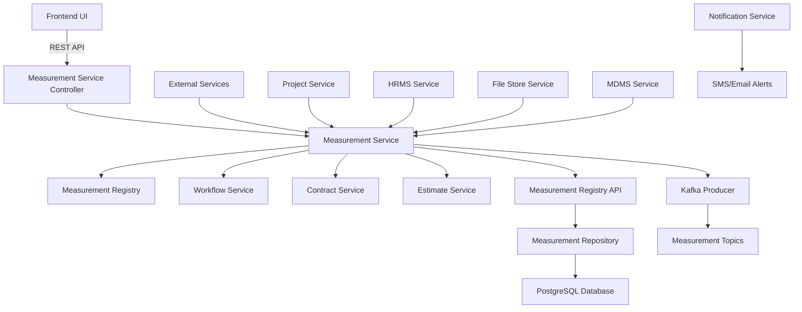
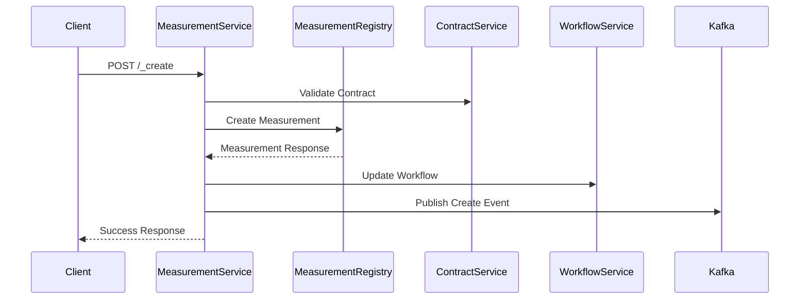
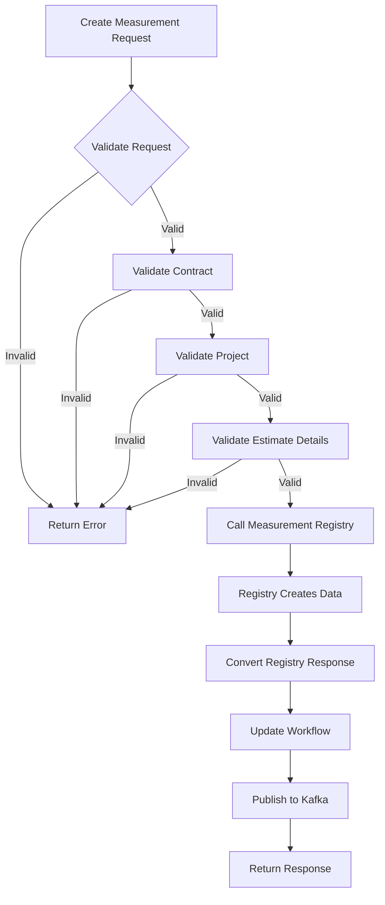
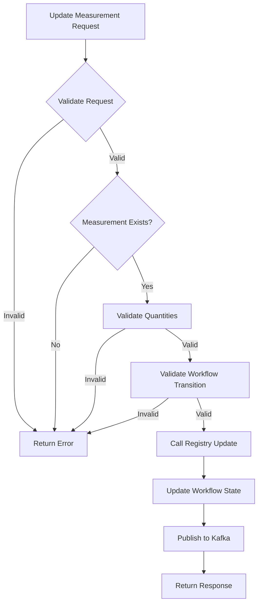
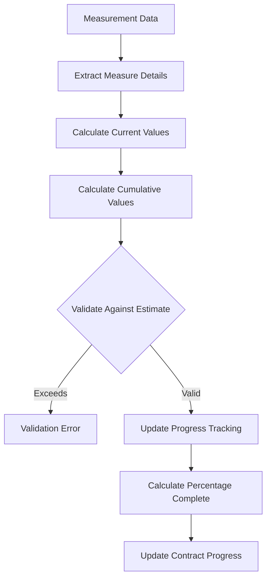
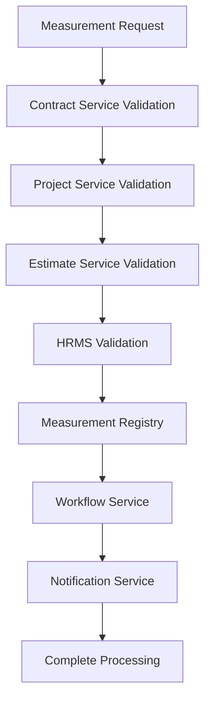
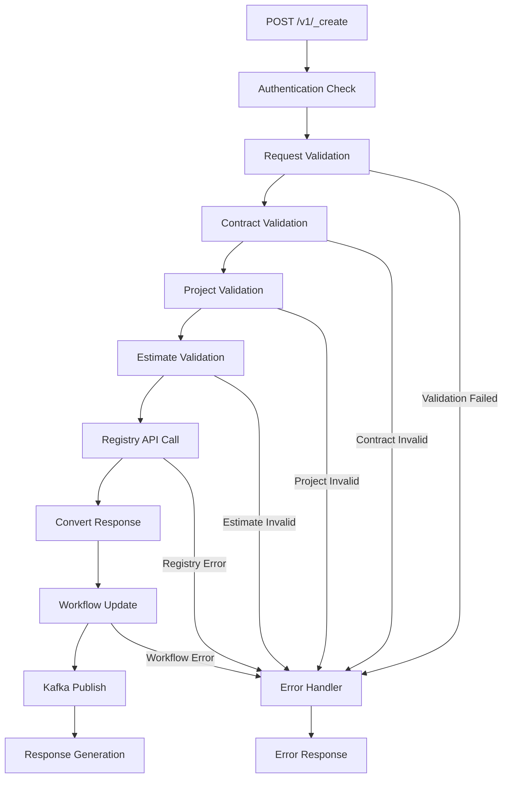
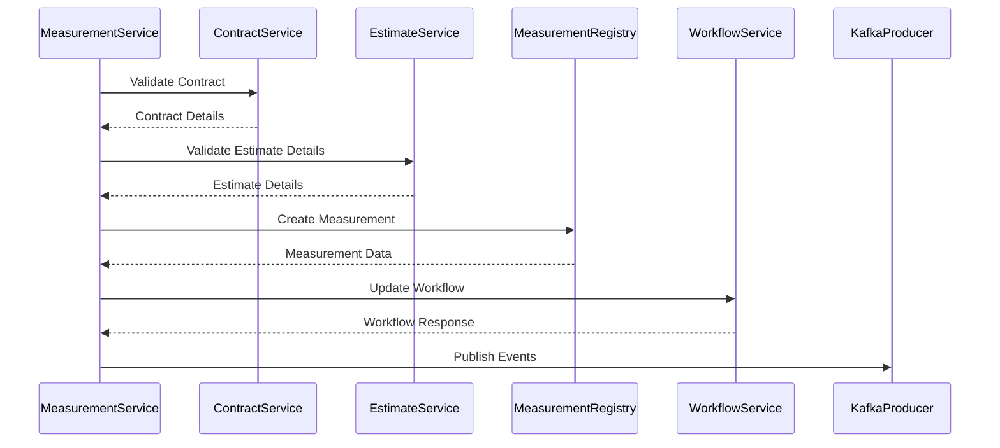
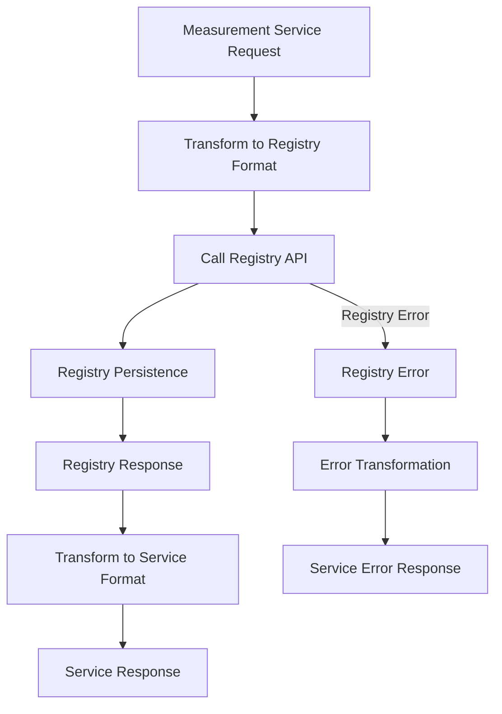

# Measurement Service Documentation

## Table of Contents
1. [System & Architecture Overview](#system--architecture-overview)
2. [API Documentation](#api-documentation)
3. [Domain Models & Data Structures](#domain-models--data-structures)
4. [Database Design](#database-design)
5. [Configuration & Application Properties](#configuration--application-properties)
6. [Service Dependencies](#service-dependencies)
7. [Events & Messaging](#events--messaging)
8. [Execution & Business Flows](#execution--business-flows)
9. [Security Considerations](#security-considerations)
10. [API Flow Diagrams](#api-flow-diagrams)

## System & Architecture Overview

The Measurement Service is a comprehensive Spring Boot microservice that manages project progress measurement tracking in the DIGIT Works platform. It consists of two main components: **Measurement Service** (business logic and workflow) and **Measurement Registry** (data persistence), working together to track work completion against contracts and estimates.



### Core Components

- **Measurement Service**: Business logic, validation, workflow management
- **Measurement Registry**: Data persistence, CRUD operations
- **Measurement Book**: Work measurement documentation
- **Progress Tracking**: Contract vs actual work measurement
- **Workflow Integration**: Approval and verification processes
- **Multi-Service Integration**: Contracts, estimates, projects coordination

## API Documentation

### Base URL: `/measurement-service`

#### 1. Create Measurement
- **Endpoint**: `POST /v1/_create`
- **Description**: Creates new measurement entries for work progress tracking
- **Authentication**: Required (JWT token)

**Request Body**:
```json
{
  "RequestInfo": {
    "apiId": "measurement-service",
    "ver": "1.0",
    "ts": 1234567890,
    "action": "create",
    "did": "1",
    "key": "abcd-efgh",
    "msgId": "create measurement request",
    "authToken": "{{token}}"
  },
  "measurements": [
    {
      "tenantId": "od.testing",
      "contractId": "contract-uuid",
      "measurementNumber": "MB/2023-24/000001",
      "physicalRefNumber": "PHY001",
      "projectId": "project-uuid",
      "periodFrom": 1234567890,
      "periodTo": 1234567899,
      "entryDate": 1234567890,
      "isActive": true,
      "wfStatus": "DRAFT",
      "measures": [
        {
          "id": "measure-uuid",
          "targetId": "estimate-detail-uuid",
          "isActive": true,
          "currentValue": 10.5,
          "cumulativeValue": 50.75,
          "comments": "Work progress as per site measurement",
          "measures": [
            {
              "value": 10.5,
              "breadth": 2.0,
              "length": 5.0,
              "height": 1.05,
              "number": 1.0,
              "unitType": "CUM"
            }
          ]
        }
      ],
      "documents": [
        {
          "id": "doc-uuid",
          "fileStoreId": "filestore-uuid",
          "documentType": "MEASUREMENT_PHOTO",
          "additionalDetails": {}
        }
      ],
      "additionalDetails": {},
      "workflow": {
        "action": "SUBMIT",
        "assignees": [],
        "comments": "Submitting for verification"
      }
    }
  ]
}
```

**Response**:
```json
{
  "ResponseInfo": {
    "apiId": "measurement-service",
    "ver": "1.0",
    "ts": 1234567890,
    "resMsgId": "uief87324",
    "msgId": "create measurement request",
    "status": "successful"
  },
  "measurements": [
    {
      "id": "measurement-uuid",
      "tenantId": "od.testing",
      "measurementNumber": "MB/2023-24/000001",
      "contractId": "contract-uuid",
      "projectId": "project-uuid",
      "periodFrom": 1234567890,
      "periodTo": 1234567899,
      "wfStatus": "PENDING_FOR_VERIFICATION",
      "measures": [...],
      "documents": [...],
      "auditDetails": {
        "createdBy": "user-uuid",
        "lastModifiedBy": "user-uuid",
        "createdTime": 1234567890,
        "lastModifiedTime": 1234567890
      }
    }
  ]
}
```

#### 2. Update Measurement
- **Endpoint**: `POST /v1/_update`
- **Description**: Updates existing measurement entries
- **Authentication**: Required

#### 3. Search Measurements
- **Endpoint**: `POST /v1/_search`
- **Description**: Search and retrieve measurements based on criteria

**Query Parameters**:
- `tenantId` (required): Tenant identifier
- `ids`: List of measurement UUIDs
- `measurementNumbers`: List of measurement numbers
- `contractIds`: List of contract IDs
- `projectIds`: List of project IDs
- `wfStatus`: Workflow status
- `fromDate`: Period from date filter
- `toDate`: Period to date filter
- `limit`: Number of records (default: 10)
- `offset`: Page offset (default: 0)

### Error Handling

All APIs follow standard error response format:

```json
{
  "ResponseInfo": {
    "apiId": "measurement-service",
    "ver": "1.0",
    "ts": 1234567890,
    "resMsgId": "uief87324",
    "msgId": "create measurement request",
    "status": "failed"
  },
  "Errors": [
    {
      "code": "INVALID_MEASUREMENT_DATA",
      "message": "Measurement data validation failed",
      "description": "Cumulative value cannot exceed contract quantity"
    }
  ]
}
```

## Domain Models & Data Structures

### Core Entities

#### MeasurementService
```java
public class MeasurementService {
    private String id;
    private String tenantId;
    private String measurementNumber;
    private String physicalRefNumber;
    private String contractId;
    private String projectId;
    private Long periodFrom;
    private Long periodTo;
    private Long entryDate;
    private Boolean isActive;
    private String wfStatus;
    private List<Measure> measures;
    private List<Document> documents;
    private Object additionalDetails;
    private Workflow workflow;
    private AuditDetails auditDetails;
}
```

#### Measure
```java
public class Measure {
    private String id;
    private String targetId; // Reference to estimate detail
    private Boolean isActive;
    private Double currentValue;
    private Double cumulativeValue;
    private String comments;
    private List<MeasureDetail> measures;
    private Object additionalDetails;
    private AuditDetails auditDetails;
}
```

#### MeasureDetail
```java
public class MeasureDetail {
    private String id;
    private String measureId;
    private Double value;
    private Double length;
    private Double width;
    private Double height;
    private Double breadth;
    private Double number;
    private String unitType;
    private String description;
    private Object additionalDetails;
    private AuditDetails auditDetails;
}
```

#### MeasurementRegistry (Data Model)
```java
public class Measurement {
    private String id;
    private String tenantId;
    private String measurementNumber;
    private String physicalRefNumber;
    private String contractId;
    private String projectId;
    private String mbNumber;
    private Long periodFrom;
    private Long periodTo;
    private Long entryDate;
    private Boolean isActive;
    private String wfStatus;
    private List<Measure> measures;
    private List<Document> documents;
    private Object additionalDetails;
    private AuditDetails auditDetails;
}
```

### Validation Rules

- **Contract ID**: Must exist and be active
- **Project ID**: Must match contract project
- **Period Dates**: From date must be <= To date
- **Cumulative Values**: Cannot exceed contract/estimate quantities
- **Measurement Number**: Auto-generated format MB/[FY]/[SEQUENCE]
- **Target ID**: Must reference valid estimate detail
- **Unit Types**: Must match estimate unit of measurement

### Business Enums

```java
public enum MeasurementStatus {
    DRAFT, PENDING_FOR_VERIFICATION, VERIFIED, 
    PENDING_FOR_APPROVAL, APPROVED, REJECTED, SENT_BACK
}

public enum UnitType {
    CUM, SQM, RMT, NOS, KG, TONNES, LITRE
}
```

## Database Design

### Tables

#### eg_measurement_measurements (Registry)
```sql
CREATE TABLE eg_measurement_measurements (
    id character varying(128) PRIMARY KEY,
    tenant_id character varying(64) NOT NULL,
    measurement_number character varying(64),
    physical_ref_number character varying(64),
    contract_id character varying(128) NOT NULL,
    project_id character varying(128),
    mb_number character varying(64),
    period_from bigint,
    period_to bigint,
    entry_date bigint,
    is_active boolean DEFAULT true,
    wf_status character varying(64),
    reference_id character varying(64),
    created_by character varying(64) NOT NULL,
    last_modified_by character varying(64) NOT NULL,
    created_time bigint NOT NULL,
    last_modified_time bigint NOT NULL,
    additional_details JSONB,
    CONSTRAINT uk_measurement_number UNIQUE (measurement_number, tenant_id)
);
```

#### eg_measurement_measures (Registry)
```sql
CREATE TABLE eg_measurement_measures (
    id character varying(128) PRIMARY KEY,
    measurement_id character varying(128) NOT NULL,
    target_id character varying(128),
    is_active boolean DEFAULT true,
    current_value numeric(12,4),
    cumulative_value numeric(12,4),
    comments character varying(1024),
    created_by character varying(64) NOT NULL,
    last_modified_by character varying(64) NOT NULL,
    created_time bigint NOT NULL,
    last_modified_time bigint NOT NULL,
    additional_details JSONB,
    CONSTRAINT fk_measure_measurement FOREIGN KEY (measurement_id) 
        REFERENCES eg_measurement_measurements (id) ON DELETE CASCADE
);
```

#### eg_measurement_measure_details (Registry)
```sql
CREATE TABLE eg_measurement_measure_details (
    id character varying(128) PRIMARY KEY,
    measure_id character varying(128) NOT NULL,
    value_field numeric(12,4),
    length_field numeric(12,4),
    width_field numeric(12,4),
    height_field numeric(12,4),
    breadth_field numeric(12,4),
    number_field numeric(12,4),
    unit_type character varying(64),
    description_field character varying(1024),
    created_by character varying(64) NOT NULL,
    last_modified_by character varying(64) NOT NULL,
    created_time bigint NOT NULL,
    last_modified_time bigint NOT NULL,
    additional_details JSONB,
    CONSTRAINT fk_measure_detail_measure FOREIGN KEY (measure_id) 
        REFERENCES eg_measurement_measures (id) ON DELETE CASCADE
);
```

#### eg_mbs_measurements (Service)
```sql
CREATE TABLE eg_mbs_measurements (
    id character varying(128) PRIMARY KEY,
    tenantId character varying(64) NOT NULL,
    mbNumber character varying(128) NOT NULL,
    wfStatus character varying(128) NOT NULL,
    additionalDetails JSONB,
    createdtime BIGINT,
    createdby character varying(128),
    lastmodifiedtime BIGINT,
    lastmodifiedby character varying(128)
);
```

### Entity Relationship Diagram

```mermaid
erDiagram
    MEASUREMENT ||--o{ MEASURE : contains
    MEASURE ||--o{ MEASURE_DETAIL : has
    MEASUREMENT ||--o{ DOCUMENT : includes
    MEASUREMENT ||--|| CONTRACT : references
    MEASUREMENT ||--|| PROJECT : belongs_to
    MEASURE ||--|| ESTIMATE_DETAIL : targets
    
    MEASUREMENT {
        varchar id PK
        varchar tenant_id
        varchar measurement_number UK
        varchar contract_id FK
        varchar project_id FK
        bigint period_from
        bigint period_to
        varchar wf_status
        boolean is_active
        jsonb additional_details
        audit_details
    }
    
    MEASURE {
        varchar id PK
        varchar measurement_id FK
        varchar target_id FK
        boolean is_active
        numeric current_value
        numeric cumulative_value
        varchar comments
        jsonb additional_details
        audit_details
    }
    
    MEASURE_DETAIL {
        varchar id PK
        varchar measure_id FK
        numeric value_field
        numeric length_field
        numeric width_field
        numeric height_field
        numeric breadth_field
        numeric number_field
        varchar unit_type
        varchar description_field
        audit_details
    }
```

## Configuration & Application Properties

### Server Configuration
```properties
server.contextPath=/measurement-service
server.servlet.contextPath=/measurement-service
server.port=8080
app.timezone=UTC
```

### Database Configuration
```properties
spring.datasource.driver-class-name=org.postgresql.Driver
spring.datasource.url=jdbc:postgresql://localhost:5432/postgresRegistry
spring.datasource.username=postgres
spring.datasource.password=postgres

spring.flyway.url=jdbc:postgresql://localhost:5432/postgresRegistry
spring.flyway.table=measurement-schema
spring.flyway.baseline-on-migrate=true
spring.flyway.locations=classpath:/db/migration/main
```

### Kafka Configuration
```properties
kafka.config.bootstrap_server_config=localhost:9092
spring.kafka.consumer.group-id=measurement-book-service
spring.kafka.producer.key-serializer=org.apache.kafka.common.serialization.StringSerializer
spring.kafka.producer.value-serializer=org.springframework.kafka.support.serializer.JsonSerializer

# Topics
measurement.kafka.create.topic=save-measurement-details
measurement.kafka.update.topic=update-measurement-details
measurement.kafka.enrich.create.topic=enrich-measurement-service-details
measurement-service.kafka.create.topic=save-measurement-service-details
measurement-service.kafka.update.topic=update-measurement-service-details
```

### External Service URLs
```properties
# MDMS Services
egov.mdms.host=https://unified-dev.digit.org
egov.mdms.search.endpoint=/egov-mdms-service/v1/_search
egov.mdms.v2.host=https://unified-dev.digit.org
egov.mdms.v2.search.endpoint=/mdms-v2/v1/_search

# Workflow Service
egov.workflow.host=http://localhost:8280
egov.workflow.transition.path=/egov-workflow-v2/egov-wf/process/_transition
egov.workflow.businessservice.search.path=/egov-workflow-v2/egov-wf/businessservice/_search
egov.workflow.bussinessServiceCode=MB
egov.workflow.moduleName=measurement-book-service

# Measurement Registry
egov.measurement.registry.host=http://localhost:8081
egov.measurement.registry.create.path=/measurement/v1/_create
egov.measurement.registry.update.path=/measurement/v1/_update
egov.measurement.registry.search.path=/measurement/v1/_search

# Contract Service
egov.contract.host=https://unified-dev.digit.org
egov.contract.path=/contract/v1/_search

# Estimate Service
egov.estimate.host=https://unified-dev.digit.org
egov.estimate.path=/estimate/v1/_search

# Project Service
works.project.service.host=https://works-dev.digit.org/
works.project.service.path=project/v1/_search

# HRMS Service
egov.hrms.host=https://unified-dev.digit.org
egov.hrms.search.endpoint=/egov-hrms/employees/_search
```

### Business Configuration
```properties
# ID Generation
egov.idgen.host=https://unified-dev.digit.org/
egov.idgen.path=egov-idgen/id/_generate
measurement.idgen.name=mb.reference.number
measurement.idgen.format=MB/[fy:yyyy-yy]/[SEQ_MEASUREMENT_NUM]

# Search Configuration
mb.default.offset=0
mb.default.limit=10
mb.search.max.limit=50
measurement-service.default.offset=0
measurement-service.default.limit=10
measurement-service.search.max.limit=50

# Workflow
is.workflow.enabled=true

# Notifications
notification.sms.enabled=true
sms.isAdditonalFieldRequired=true
kafka.topics.works.notification.sms.name=works.notification.sms
```

## Service Dependencies

### Internal DIGIT Services

1. **Measurement Registry** (`egov.measurement.registry.host`)
   - **Purpose**: Data persistence layer for measurements
   - **APIs Used**: `/measurement/v1/_create`, `/measurement/v1/_update`, `/measurement/v1/_search`
   - **Usage**: CRUD operations for measurement data

2. **Contract Service** (`egov.contract.host`)
   - **Purpose**: Contract validation and details
   - **APIs Used**: `/contract/v1/_search`
   - **Usage**: Validate contract existence and fetch contract details

3. **Estimate Service** (`egov.estimate.host`)
   - **Purpose**: Estimate detail validation and quantity checks
   - **APIs Used**: `/estimate/v1/_search`
   - **Usage**: Validate target estimate details and quantity limits

4. **Project Service** (`works.project.service.host`)
   - **Purpose**: Project validation and details
   - **APIs Used**: `/project/v1/_search`
   - **Usage**: Validate project existence and fetch project details

5. **Workflow Service** (`egov.workflow.host`)
   - **Purpose**: Measurement approval workflows
   - **APIs Used**: `/egov-workflow-v2/egov-wf/process/_transition`
   - **Usage**: Handle measurement status transitions

6. **HRMS Service** (`egov.hrms.host`)
   - **Purpose**: Employee validation and details
   - **APIs Used**: `/egov-hrms/employees/_search`
   - **Usage**: Validate assignees and approvers

7. **ID Generation Service** (`egov.idgen.host`)
   - **Purpose**: Generate measurement numbers
   - **APIs Used**: `/egov-idgen/id/_generate`
   - **Usage**: Auto-generate measurement book numbers

### External Dependencies

1. **PostgreSQL Database**
   - **Purpose**: Primary data storage for both service and registry
   - **Connection**: JDBC connection pool
   - **Usage**: Store measurement data, workflow states, documents

2. **Kafka Message Broker**
   - **Purpose**: Asynchronous processing and event streaming
   - **Topics**: Multiple measurement processing topics
   - **Usage**: Event-driven architecture, notifications

3. **File Store Service**
   - **Purpose**: Document storage for measurement photos and reports
   - **Usage**: Store measurement documentation and evidence

## Events & Messaging

### Kafka Topics

#### 1. save-measurement-details
- **Purpose**: Persist newly created measurements
- **Producer**: Measurement Service
- **Consumer**: Measurement Service (persistence consumer)

#### 2. update-measurement-details
- **Purpose**: Update existing measurements
- **Producer**: Measurement Service
- **Consumer**: Measurement Service, dependent services

#### 3. save-measurement-service-details
- **Purpose**: Persist measurement service business logic
- **Producer**: Measurement Service
- **Consumer**: Measurement Service

### Event Processing Patterns

#### Create Measurement Flow


## Execution & Business Flows

### 1. Measurement Creation Flow



### 2. Measurement Update Flow



### 3. Progress Calculation Flow



### 4. Multi-Service Integration Flow



## Security Considerations

### Authentication & Authorization

1. **JWT Token Validation**
   - All APIs require valid JWT token
   - Token validation through `RequestInfo.authToken`
   - Integration with DIGIT user service

2. **Role-Based Access Control**
   - **MEASUREMENT_CREATOR**: Can create and update measurements
   - **MEASUREMENT_VERIFIER**: Can verify submitted measurements
   - **MEASUREMENT_APPROVER**: Can approve verified measurements
   - **MEASUREMENT_VIEWER**: Can search and view measurements

3. **Tenant Isolation**
   - All operations scoped to tenant ID
   - Cross-tenant data access not allowed
   - Contract-project-measurement consistency validation

### Input Validation

1. **Request Validation**
   - JSON schema validation for all API requests
   - Business rule validation for measurements
   - Quantity and value range validation

2. **Business Rule Validation**
   - Contract existence and status validation
   - Project-contract consistency checks
   - Estimate detail reference validation
   - Cumulative quantity limit validation

3. **Data Integrity**
   - Measure detail calculation validation
   - Period date logical validation
   - Workflow state transition validation

### Data Protection

1. **Audit Trail**
   - Complete audit trail for all operations
   - Workflow state change tracking
   - User action logging

2. **Document Security**
   - Secure file upload through file store
   - Document type validation
   - Access control on measurement documents

## API Flow Diagrams

### 1. Create Measurement API Flow



### 2. Service Integration Flow



### 3. Registry Integration Flow



This comprehensive documentation provides detailed insights into the Measurement Service's architecture, dual-service design, progress tracking capabilities, multi-service integration, and workflow-driven measurement management for DIGIT Works platform.