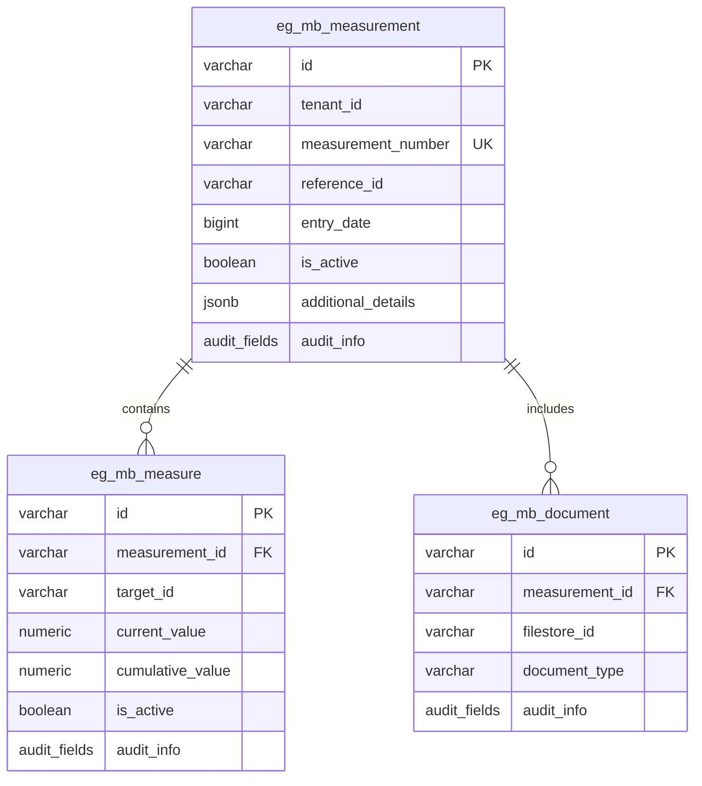
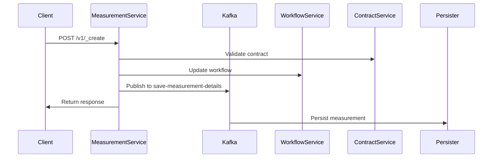
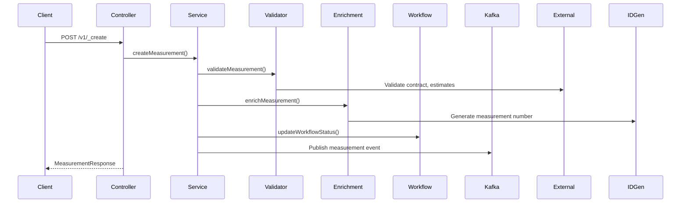
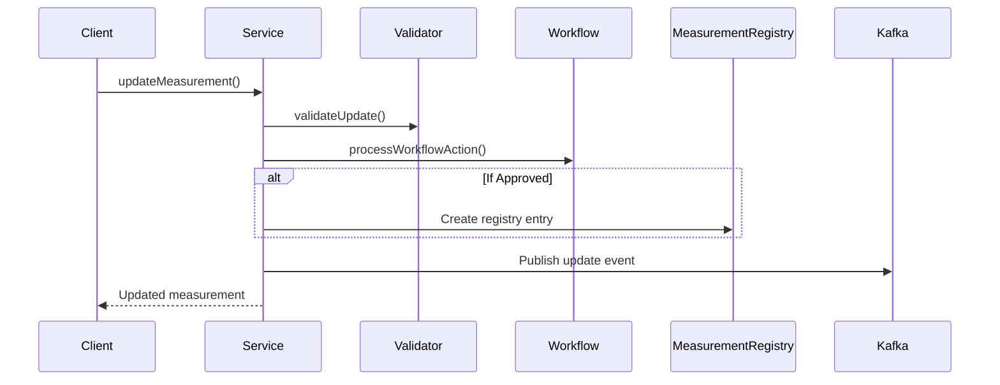
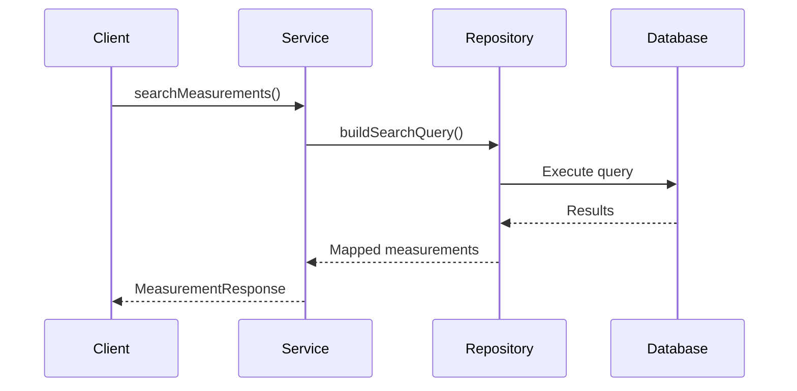
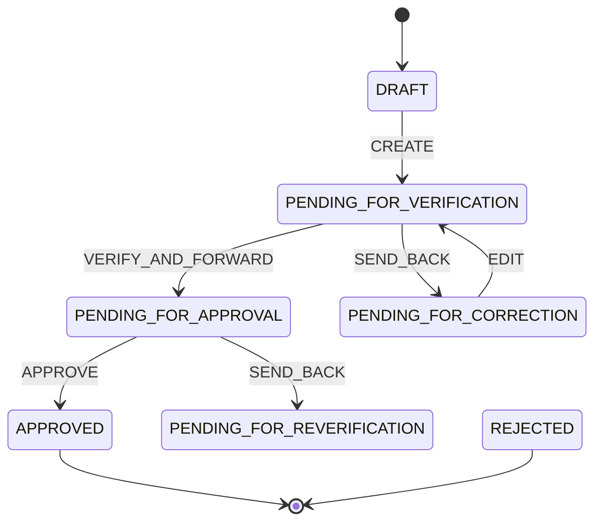
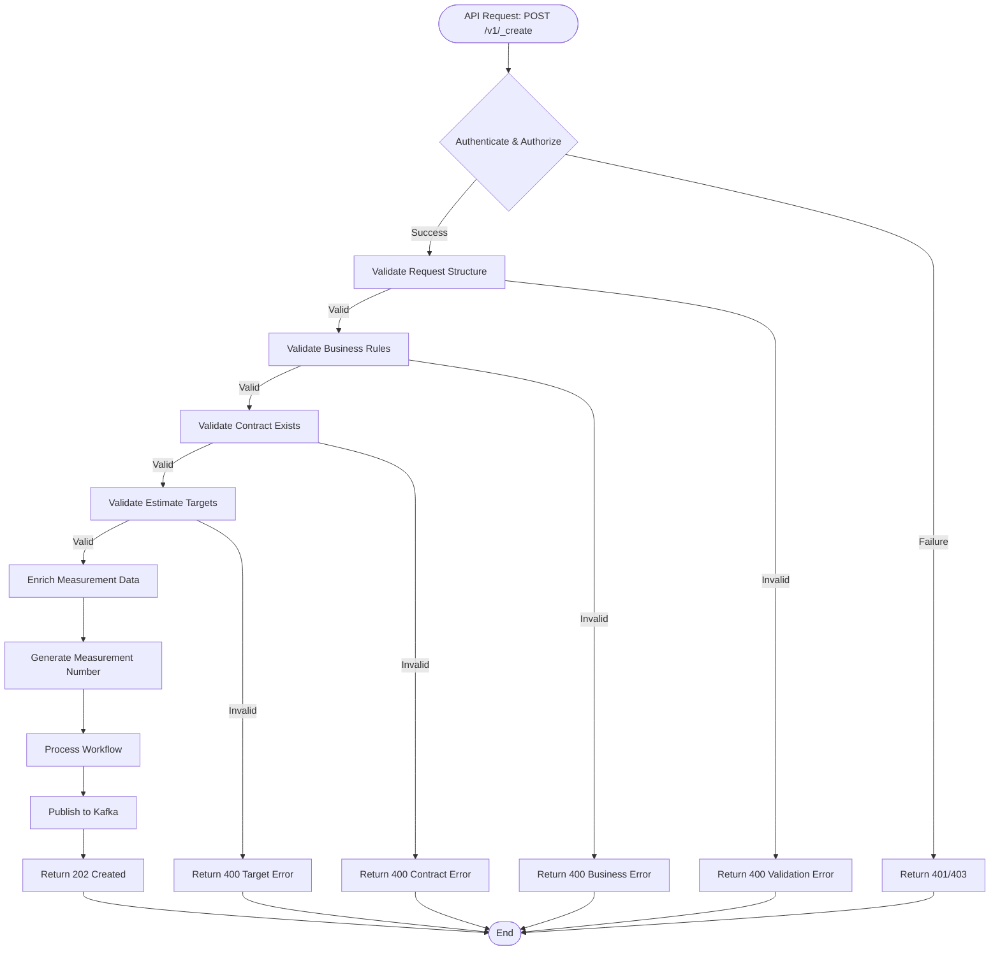
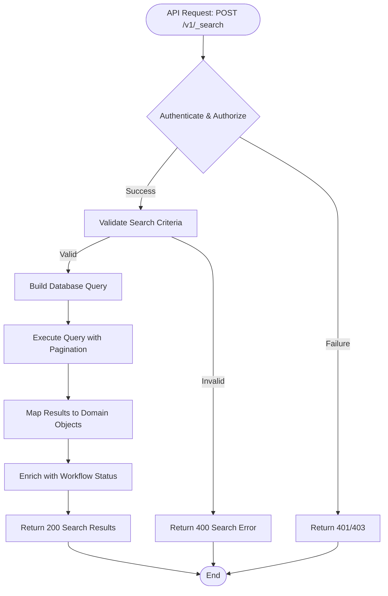

# Measurement Service - Technical Documentation

## Table of Contents
1. [System & Architecture Overview](#system--architecture-overview)
2. [API Documentation](#api-documentation)
3. [Domain Models & Data Structures](#domain-models--data-structures)
4. [Database Design](#database-design)
5. [Configuration & Application Properties](#configuration--application-properties)
6. [Service Dependencies](#service-dependencies)
7. [Events & Messaging](#events--messaging)
8. [Execution & Business Flows](#execution--business-flows)
9. [Security Considerations](#security-considerations)
10. [API Flow Diagrams](#api-flow-diagrams)

## System & Architecture Overview

The Measurement Service (also known as Measurement Book Service) is a core component of the DIGIT Works platform that manages construction project measurements and quantity tracking. Built on Spring Boot 3.x with Java 17, it follows microservices architecture with RESTful APIs, event-driven communication, and PostgreSQL for persistence.

### High-Level Architecture

```mermaid
graph TB
    subgraph "Measurement Service"
        Controller[Measurement API Controller]
        MBService[Measurement Service]
        MRegistry[Measurement Registry Service]
        Validator[Measurement Validator]
        Enrichment[Measurement Enrichment]
        Workflow[Workflow Service]
        Repository[Repository Layer]
    end
    
    subgraph "External Services"
        ContractSvc[Contract Service]
        EstimateSvc[Estimate Service]
        ProjectSvc[Project Service]
        MRegSvc[Measurement Registry Service]
        WorkflowSvc[Workflow Service]
        HRMS[HRMS Service]
        MDMS[MDMS Service]
        FileStore[FileStore Service]
        Localization[Localization Service]
        IDGen[ID Generation Service]
        Notification[Notification Service]
    end
    
    subgraph "Infrastructure"
        PostgreSQL[(PostgreSQL Database)]
        Kafka[Kafka Topics]
        Redis[(Redis Cache)]
    end
    
    Controller --> MBService
    MBService --> MRegistry
    MBService --> Validator
    MBService --> Enrichment
    MBService --> Workflow
    MBService --> Repository
    
    Repository --> PostgreSQL
    MBService --> Kafka
    
    MBService --> ContractSvc
    MBService --> EstimateSvc
    MBService --> ProjectSvc
    MBService --> MRegSvc
    MBService --> WorkflowSvc
    MBService --> HRMS
    MBService --> MDMS
    MBService --> FileStore
    MBService --> Localization
    MBService --> IDGen
    MBService --> Notification
```



### Component Responsibilities

- **Measurement Controller**: Handles HTTP requests for measurement book operations
- **Measurement Service**: Core business logic for measurements and measure details
- **Measurement Registry**: Integration with external measurement registry service
- **Validator**: Input validation and business rule enforcement
- **Enrichment**: Data enrichment with IDs, audit details, and external data
- **Workflow Service**: Manages measurement approval workflows
- **Repository Layer**: Data access and persistence management

### Interaction Between Services

The Measurement Service integrates with:
- **Contract Service**: Validates contracts and fetches contract details for measurement books
- **Estimate Service**: Retrieves estimate details and line items for measurements
- **Project Service**: Gets project information for measurement context
- **Measurement Registry**: External registry for measurement management
- **Workflow Engine**: Manages measurement book approval workflows
- **MDMS Service**: Master data validation and configuration
- **ID Generation**: Generates measurement book numbers

## API Documentation

### Base Information
- **Context Path**: `/measurement-service`
- **Port**: `8080`
- **API Version**: `v1`

### Authentication & Authorization
- Uses JWT token-based authentication
- Role-based access control with measurement-specific roles:
  - `MB_CREATOR`: Create and edit measurement books
  - `MB_VERIFIER`: Verify measurements
  - `MB_APPROVER`: Approve measurements

### REST Endpoints

#### 1. Create Measurement

**Endpoint**: `POST /measurement-service/v1/_create`

**Description**: Creates a new measurement book with validation and workflow integration.

**Request Schema**:
```json
{
  "RequestInfo": {
    "apiId": "measurement-service",
    "ver": "1.0",
    "ts": "timestamp",
    "action": "create",
    "userInfo": {
      "uuid": "string",
      "roles": []
    }
  },
  "measurement": {
    "tenantId": "string (required, 2-64 chars)",
    "referenceId": "string (required, 2-64 chars)",
    "entryDate": "bigint (required)",
    "physicalRefNumber": "string (2-100 chars)",
    "measures": [
      {
        "sNo": "string",
        "targetId": "string (required)",
        "isActive": "boolean",
        "currentValue": "bigDecimal",
        "cumulativeValue": "bigDecimal",
        "comments": "string"
      }
    ],
    "documents": [
      {
        "fileStore": "string",
        "documentType": "string"
      }
    ],
    "additionalDetails": {}
  },
  "workflow": {
    "action": "string (required)",
    "comment": "string",
    "assignees": ["string"]
  }
}
```

#### 2. Update Measurement

**Endpoint**: `POST /measurement-service/v1/_update`

**Description**: Updates existing measurement books with workflow transitions.

**Request Schema**: Same as create with required `id` field.

#### 3. Search Measurements

**Endpoint**: `POST /measurement-service/v1/_search`

**Description**: Searches measurement books based on criteria.

**Request Schema**:
```json
{
  "RequestInfo": {},
  "measurementCriteria": {
    "tenantId": "string (required)",
    "ids": ["string"],
    "measurementNumber": "string",
    "referenceId": ["string"],
    "contractNumber": ["string"],
    "fromDate": "bigint",
    "toDate": "bigint",
    "isActive": "boolean"
  },
  "pagination": {
    "limit": "number (default: 10, max: 50)",
    "offset": "number (default: 0)",
    "sortBy": "string",
    "sortOrder": "ASC|DESC"
  }
}
```

### Error Handling

Standard DIGIT error response format:
```json
{
  "ResponseInfo": {
    "apiId": "measurement-service",
    "ver": "1.0",
    "ts": "timestamp",
    "status": "FAILED"
  },
  "Errors": [
    {
      "code": "ERROR_CODE",
      "message": "Error description",
      "description": "Detailed error information"
    }
  ]
}
```

**Common Error Codes**:
- `MEASUREMENT_NOT_FOUND`: Measurement not found
- `INVALID_TENANT`: Invalid tenant ID
- `DUPLICATE_MEASUREMENT`: Duplicate measurement for reference
- `WORKFLOW_REQUIRED`: Workflow action required

## Domain Models & Data Structures

### Core Domain Models

#### Measurement Entity
```java
public class Measurement {
    private String id;                      // UUID
    private String tenantId;                // Required (2-64 chars)
    private String measurementNumber;       // Auto-generated (MB/YYYY-YY/SEQ)
    private String physicalRefNumber;       // Physical reference (2-100 chars)
    private String referenceId;             // Contract reference (required)
    private BigDecimal entryDate;           // Required timestamp
    private List<Measure> measures;         // Measurement details
    private Boolean isActive;               // Default: true
    private List<Document> documents;       // Supporting documents
    private AuditDetails auditDetails;      // Audit information
    private Object additionalDetails;       // Extensible metadata
    private ProcessInstance processInstance; // Workflow data
}
```

#### Measure Entity
```java
public class Measure {
    private String id;                      // UUID
    private String sNo;                     // Serial number
    private String targetId;                // Required target reference
    private Boolean isActive;               // Active status
    private BigDecimal currentValue;        // Current measurement value
    private BigDecimal cumulativeValue;     // Total cumulative value
    private String comments;                // Measurement comments
    private AuditDetails auditDetails;      // Audit information
    private Object additionalDetails;       // Extensible metadata
}
```

#### MeasurementService Entity
```java
public class MeasurementService {
    private String id;                      // UUID
    private String tenantId;                // Required
    private String referenceId;             // Service reference
    private String serviceRequestId;        // Service request ID
    private String accountId;               // Account reference
    private String serviceSla;              // Service SLA
    private AuditDetails auditDetails;      // Audit information
    private Object additionalDetails;       // Extensible metadata
}
```

### Validation Rules

- **Measurement Level**:
  - tenantId: Required, 2-64 characters
  - referenceId: Required, 2-64 characters, must be valid contract
  - entryDate: Required, valid timestamp
  - At least one active measure required

- **Measure Level**:
  - targetId: Required, must reference valid estimate line item
  - currentValue: Must be non-negative
  - cumulativeValue: Must be >= currentValue
  - Serial number must be unique within measurement

### Status Definitions

```java
public enum Status {
    DRAFT,          // Initial state
    INWORKFLOW,     // Under workflow processing  
    APPROVED,       // Approved measurement
    REJECTED,       // Rejected measurement
    INACTIVE        // Inactive/cancelled
}
```

## Database Design

### Tables Overview

#### eg_mb_measurement
Primary table for measurement books.

```sql
CREATE TABLE eg_mb_measurement (
    id                      VARCHAR(256) PRIMARY KEY,
    tenant_id               VARCHAR(64) NOT NULL,
    measurement_number      VARCHAR(128) UNIQUE,
    physical_ref_number     VARCHAR(256),
    reference_id            VARCHAR(256) NOT NULL,
    entry_date              BIGINT NOT NULL,
    is_active               BOOLEAN DEFAULT TRUE,
    additional_details      JSONB,
    created_by              VARCHAR(256) NOT NULL,
    last_modified_by        VARCHAR(256),
    created_time            BIGINT NOT NULL,
    last_modified_time      BIGINT NOT NULL
);
```

#### eg_mb_measure
Measurement details within a measurement book.

```sql
CREATE TABLE eg_mb_measure (
    id                      VARCHAR(256) PRIMARY KEY,
    measurement_id          VARCHAR(256) NOT NULL,
    s_no                    VARCHAR(64),
    target_id               VARCHAR(256) NOT NULL,
    is_active               BOOLEAN DEFAULT TRUE,
    current_value           NUMERIC(12,2),
    cumulative_value        NUMERIC(12,2),
    comments                VARCHAR(1000),
    additional_details      JSONB,
    created_by              VARCHAR(256) NOT NULL,
    last_modified_by        VARCHAR(256),
    created_time            BIGINT NOT NULL,
    last_modified_time      BIGINT NOT NULL,
    FOREIGN KEY (measurement_id) REFERENCES eg_mb_measurement (id)
);
```

#### eg_mb_document
Documents associated with measurements.

```sql
CREATE TABLE eg_mb_document (
    id                      VARCHAR(256) PRIMARY KEY,
    measurement_id          VARCHAR(256) NOT NULL,
    filestore_id            VARCHAR(256) NOT NULL,
    document_type           VARCHAR(128),
    additional_details      JSONB,
    created_by              VARCHAR(256) NOT NULL,
    last_modified_by        VARCHAR(256),
    created_time            BIGINT NOT NULL,
    last_modified_time      BIGINT NOT NULL,
    FOREIGN KEY (measurement_id) REFERENCES eg_mb_measurement (id)
);
```

### Entity Relationship Diagram



### Indexes and Performance

**Primary Indexes**:
- `eg_mb_measurement`: id, measurement_number (unique)
- `eg_mb_measure`: id, measurement_id (FK)
- `eg_mb_document`: id, measurement_id (FK)

**Secondary Indexes**:
- `index_eg_mb_measurement_tenantId`
- `index_eg_mb_measurement_referenceId`
- `index_eg_mb_measurement_entryDate`
- `index_eg_mb_measure_targetId`

## Configuration & Application Properties

### Environment-Specific Configuration

```properties
# Server Configuration
server.contextPath=/measurement-service
server.port=8080
app.timezone=UTC

# Database Configuration
spring.datasource.driver-class-name=org.postgresql.Driver
spring.datasource.url=jdbc:postgresql://localhost:5432/digit-works
spring.datasource.username=postgres
spring.datasource.password=1234

# Flyway Migration
spring.flyway.table=measurement-book-registry-schema
spring.flyway.baseline-on-migrate=true
spring.flyway.enabled=true

# Kafka Configuration
kafka.config.bootstrap_server_config=localhost:9092
spring.kafka.consumer.group-id=measurement-book-service
spring.kafka.producer.value-serializer=org.springframework.kafka.support.serializer.JsonSerializer

# Kafka Topics
measurement.kafka.create.topic=save-measurement-details
measurement.kafka.update.topic=update-measurement-details
measurement.kafka.enrich.create.topic=enrich-measurement-service-details
measurement-service.kafka.create.topic=save-measurement-service-details
measurement-service.kafka.update.topic=update-measurement-service-details

# Workflow Configuration
is.workflow.enabled=true
egov.workflow.host=http://localhost:8280
egov.workflow.bussinessServiceCode=MB
egov.workflow.moduleName=measurement-book-service

# External Service URLs
egov.mdms.host=https://unified-dev.digit.org
egov.mdms.search.endpoint=/egov-mdms-service/v1/_search
egov.contract.host=https://unified-dev.digit.org
egov.contract.path=/contract/v1/_search
egov.estimate.host=https://unified-dev.digit.org
egov.estimate.path=/estimate/v1/_search

# ID Generation
egov.idgen.host=https://unified-dev.digit.org/
measurement.idgen.name=mb.reference.number
measurement.idgen.format=MB/[fy:yyyy-yy]/[SEQ_MEASUREMENT_NUM]

# Search Configuration
mb.default.offset=0
mb.default.limit=10
mb.search.max.limit=50

# Notification
notification.sms.enabled=true
kafka.topics.notification.sms=egov.core.notification.sms
```

### Feature Flags

- `is.workflow.enabled`: Enable/disable workflow integration
- `notification.sms.enabled`: Enable SMS notifications

## Service Dependencies

### External Services Used

#### 1. Contract Service
- **Purpose**: Validate contract existence and fetch contract details
- **Host**: `egov.contract.host`
- **Endpoint**: `/contract/v1/_search`
- **Usage**: Contract validation during measurement creation

#### 2. Estimate Service
- **Purpose**: Retrieve estimate details and validate target IDs
- **Host**: `egov.estimate.host`
- **Endpoint**: `/estimate/v1/_search`
- **Usage**: Target ID validation and estimate line item details

#### 3. Project Service
- **Purpose**: Project information retrieval
- **Host**: `works.project.service.host`
- **Endpoint**: `/project/v1/_search`

#### 4. Measurement Registry Service
- **Purpose**: External measurement registry integration
- **Host**: `egov.measurement.registry.host`
- **Endpoints**: 
  - `/measurement/v1/_create`
  - `/measurement/v1/_update`
  - `/measurement/v1/_search`

#### 5. MDMS Service
- **Purpose**: Master data validation
- **Host**: `egov.mdms.host`
- **Endpoints**: 
  - `/egov-mdms-service/v1/_search`
  - `/mdms-v2/v1/_search`

#### 6. Workflow Service
- **Purpose**: Measurement approval workflows
- **Host**: `egov.workflow.host`
- **Business Service Code**: `MB`
- **Module Name**: `measurement-book-service`

#### 7. ID Generation Service
- **Purpose**: Generate measurement book numbers
- **Format**: `MB/[fy:yyyy-yy]/[SEQ_MEASUREMENT_NUM]`

### Libraries and Frameworks

- **Spring Boot 3.x**: Core framework
- **Jakarta Validation**: Request validation (Jakarta migration)
- **PostgreSQL Driver**: Database connectivity
- **Flyway**: Database migration
- **Apache Kafka**: Event messaging
- **Jackson**: JSON processing
- **Swagger**: API documentation
- **Lombok**: Code generation
- **DIGIT Common Libraries**: Shared utilities and models

## Events & Messaging

### Kafka Topics Used

#### Producer Topics

1. **save-measurement-details**
   - **Purpose**: Measurement creation events
   - **Producer**: Measurement Service
   - **Consumers**: Persister, Indexer
   - **Payload**: MeasurementRequest

2. **update-measurement-details**
   - **Purpose**: Measurement update events
   - **Producer**: Measurement Service
   - **Consumers**: Persister, Indexer
   - **Payload**: MeasurementRequest

3. **enrich-measurement-service-details**
   - **Purpose**: Enriched measurement events
   - **Producer**: Measurement Enrichment Service
   - **Consumers**: Indexer, Notification

4. **egov.core.notification.sms**
   - **Purpose**: SMS notifications
   - **Producer**: Notification Service
   - **Consumers**: SMS Service

### Event Flow



## Execution & Business Flows

### Key Business Flows

#### 1. Measurement Creation Flow



#### 2. Measurement Update Flow



#### 3. Search Flow



### Workflow States



### Business Rules

1. **Measurement Creation**:
   - Must reference valid contract
   - Entry date within contract period
   - At least one measure required
   - Target IDs must be valid estimate line items

2. **Measure Validation**:
   - Current value must be non-negative
   - Cumulative value >= current value
   - Cannot exceed estimate quantities

3. **Workflow Rules**:
   - Creator can edit in DRAFT/PENDING_FOR_CORRECTION
   - Verifier can approve/send back
   - Final approval creates registry entry

## Security Considerations

### Authentication & Authorization

- **JWT Token Validation**: All requests require valid JWT
- **Role-based Access**: 
  - `MB_CREATOR`: Create and edit measurements
  - `MB_VERIFIER`: Verify measurements  
  - `MB_APPROVER`: Approve measurements

### Data Security

- **Tenant Isolation**: All operations scoped to tenant
- **Input Validation**: Jakarta validation for all inputs
- **Audit Trail**: Complete audit history maintained
- **Document Security**: FileStore integration for secure file handling

### API Security

- **HTTPS Enforcement**: All communications encrypted
- **Rate Limiting**: Configurable request rate limits
- **CORS Configuration**: Restricted cross-origin requests

## API Flow Diagrams

### Create Measurement API Flow



### Search Measurement API Flow



---

*This documentation reflects the actual implementation of the Measurement Service in the DIGIT Works platform. For the latest updates, refer to the service's API specifications and configuration files.*