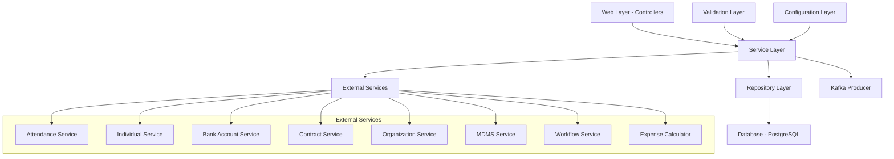
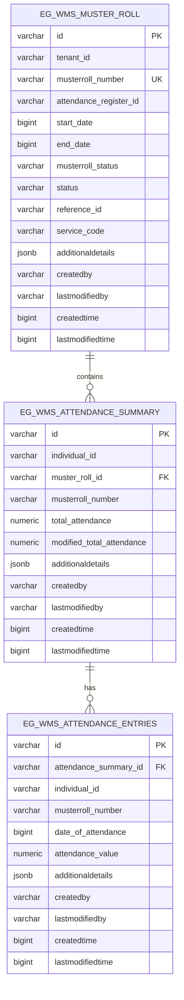
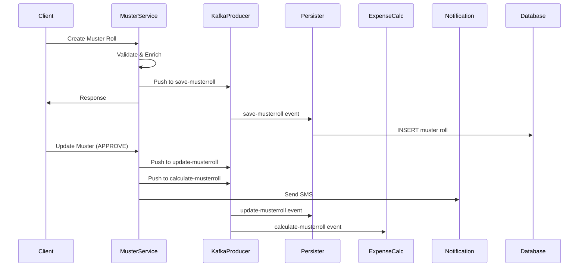
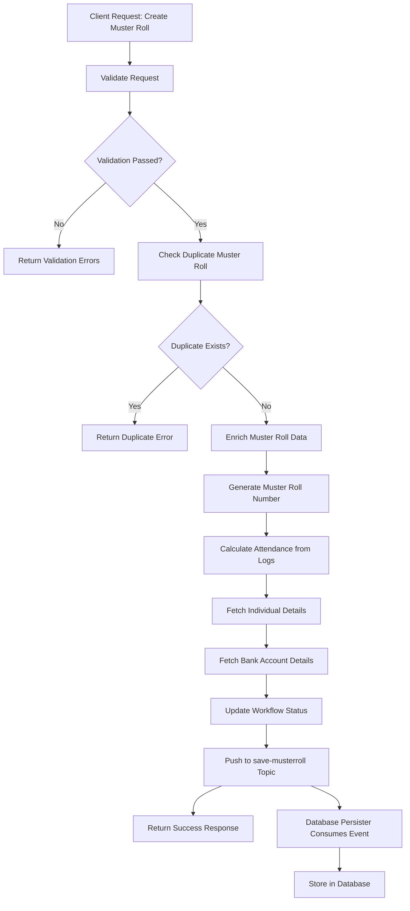
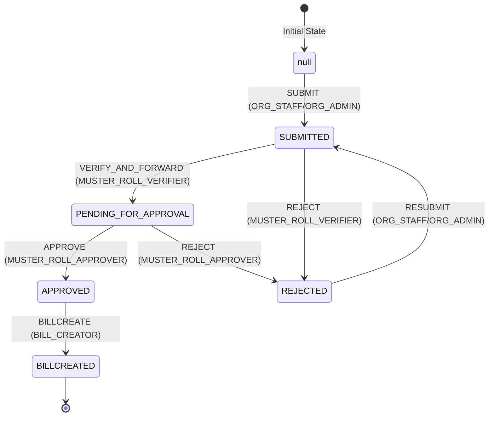
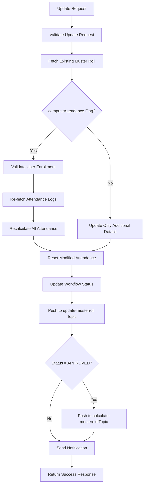
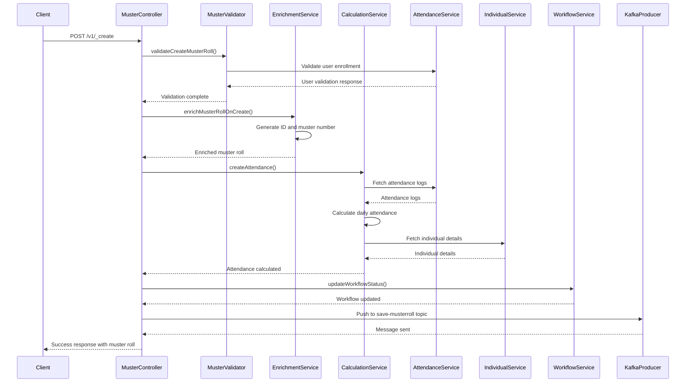
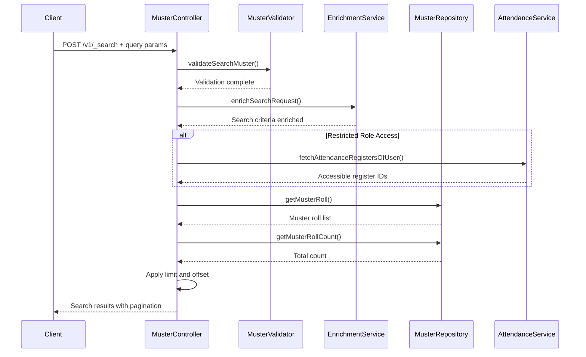
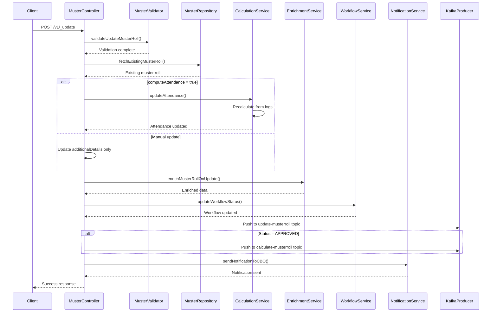
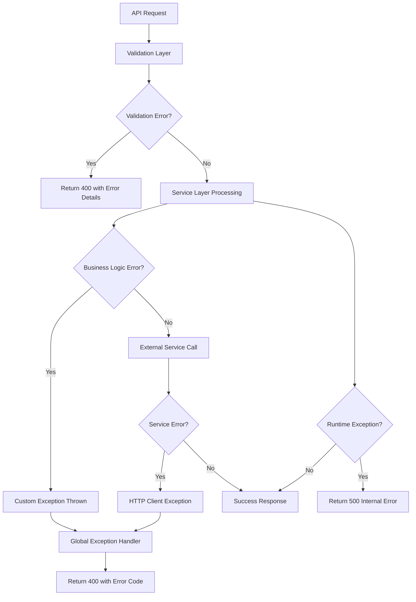

# Muster Roll Service - Technical Documentation

## Table of Contents
1. [System & Architecture Overview](#system--architecture-overview)
2. [API Documentation](#api-documentation)
3. [Domain Models & Data Structures](#domain-models--data-structures)
4. [Database Design](#database-design)
5. [Configuration & Application Properties](#configuration--application-properties)
6. [Service Dependencies](#service-dependencies)
7. [Events & Messaging](#events--messaging)
8. [Execution & Business Flows](#execution--business-flows)
9. [Security Considerations](#security-considerations)
10. [API Flow Diagrams](#api-flow-diagrams)

## System & Architecture Overview

### High-level Architecture
The Muster Roll Service is a Spring Boot microservice within the DIGIT Works ecosystem that manages attendance-based payroll processing for public works programs. It follows a layered architecture pattern with clear separation of concerns:



### Component Responsibilities

**Web Layer (`org.egov.web.controllers`)**
- `MusterRollApiController`: REST API endpoints for CRUD operations

**Service Layer (`org.egov.service`)**
- `MusterRollService`: Core business logic orchestration
- `CalculationService`: Attendance calculation and wage computation
- `EnrichmentService`: Data enrichment and ID generation
- `WorkflowService`: Workflow state management
- `NotificationService`: SMS/notification handling

**Repository Layer (`org.egov.repository`)**
- `MusterRollRepository`: Database operations
- `MusterRollQueryBuilder`: Dynamic SQL query construction
- `MusterRollRowMapper`: Result set mapping to domain objects

**Validation Layer (`org.egov.validator`)**
- `MusterRollValidator`: Input validation and business rules

### Key Features
- Weekly attendance-based muster roll creation (Monday to Sunday)
- Real-time attendance calculation from entry/exit logs
- Multi-level approval workflow (Submit → Verify → Approve)
- Integration with expense calculation for bill generation
- Role-based access control for different user types
- Attendance modification and recomputation capabilities

## API Documentation

### Base Configuration
- **Context Path**: `/muster-roll`
- **Port**: 8051
- **Content Type**: `application/json`

### REST API Endpoints

#### 1. Estimate Muster Roll
**Endpoint**: `POST /muster-roll/v1/_estimate`
**Purpose**: Calculate attendance estimates without persisting data

**Request Body**:
```json
{
  "requestInfo": {
    "apiId": "mukta-services",
    "ver": "1.0.0",
    "ts": 1665497225000,
    "action": "ESTIMATE",
    "authToken": "...",
    "userInfo": {
      "id": "1",
      "uuid": "user-uuid",
      "userName": "user@domain.com",
      "roles": [{"code": "ORG_STAFF", "name": "Organization Staff"}]
    }
  },
  "musterRoll": {
    "tenantId": "pg.punjab",
    "registerId": "register-uuid",
    "startDate": 1665497225000,
    "endDate": 1666102025000
  }
}
```

**Response**: Returns estimated attendance with calculated totals and individual entries

#### 2. Create Muster Roll
**Endpoint**: `POST /muster-roll/v1/_create`
**Purpose**: Create and persist a new muster roll

**Request Body**:
```json
{
  "requestInfo": {...},
  "musterRoll": {
    "tenantId": "pg.punjab",
    "registerId": "register-uuid",
    "startDate": 1665497225000,
    "referenceId": "contract-uuid",
    "serviceCode": "WORKS-CONTRACT"
  },
  "workflow": {
    "action": "SUBMIT",
    "comment": "Submitting muster roll for approval"
  }
}
```

#### 3. Update Muster Roll
**Endpoint**: `POST /muster-roll/v1/_update`
**Purpose**: Update existing muster roll (modify attendance, workflow transitions)

**Special Features**:
- **Recompute Attendance**: Set `"computeAttendance": "true"` in additionalDetails to recalculate from logs
- **Manual Attendance Override**: Update individual attendance values through modifiedTotalAttendance

#### 4. Search Muster Roll
**Endpoint**: `POST /muster-roll/v1/_search`
**Purpose**: Search muster rolls with various criteria

**Query Parameters**:
- `tenantId`: Required - Tenant identifier
- `ids`: Optional - Array of muster roll IDs
- `musterRollNumber`: Optional - Specific muster roll number
- `registerId`: Optional - Attendance register ID
- `fromDate`/`toDate`: Optional - Date range filters
- `status`: Optional - ACTIVE/INACTIVE/CANCELLED
- `musterRollStatus`: Optional - Workflow status
- `referenceId`: Optional - Contract/project reference
- `serviceCode`: Optional - Service type filter

### Authentication & Authorization

**Required Headers**:
- `Content-Type: application/json`
- `Authorization: Bearer <jwt-token>`

**Role-Based Access**:
- **ORG_STAFF/ORG_ADMIN**: Create, submit, resubmit muster rolls
- **MUSTER_ROLL_VERIFIER**: Verify and forward or reject
- **MUSTER_ROLL_APPROVER**: Final approval or rejection
- **BILL_CREATOR**: Generate bills from approved musters

**Restricted Search Roles**: ORG_ADMIN and ORG_STAFF have filtered search results based on their assigned registers

### Error Handling Patterns

**Common Error Responses**:
```json
{
  "ResponseInfo": {
    "apiId": "mukta-services",
    "ver": "1.0.0",
    "ts": 1665497225000,
    "resMsgId": "error-response",
    "msgId": "request-msg-id",
    "status": "FAILED"
  },
  "Errors": [
    {
      "code": "DUPLICATE_MUSTER_ROLL",
      "message": "Muster roll already exists for the register with given date range"
    }
  ]
}
```

**Error Codes**:
- `DUPLICATE_MUSTER_ROLL`: Muster already exists for date range
- `NO_MATCH_FOUND`: Invalid muster roll ID
- `ATTENDANCE_LOG_EMPTY`: No attendance logs found
- `INVALID_USER`: User not enrolled in register
- `START_DATE_MONDAY`: Start date must be Monday
- `ATTENDANCE_REGISTER_SERVICE_EXCEPTION`: External service error

## Domain Models & Data Structures

### Core Domain Models

#### MusterRoll
```java
public class MusterRoll {
    private String id;                      // UUID, generated
    private String tenantId;               // Required, 2-64 chars
    private String musterRollNumber;       // Auto-generated, unique
    private String registerId;             // Required, attendance register ref
    private Status status;                 // ACTIVE/INACTIVE/CANCELLED
    private String musterRollStatus;       // Workflow state
    private BigDecimal startDate;          // Epoch timestamp
    private BigDecimal endDate;            // Epoch timestamp
    private String referenceId;            // Contract/project reference
    private String serviceCode;            // Service type (WORKS-CONTRACT)
    private List<IndividualEntry> individualEntries;
    private Object additionalDetails;      // JSON for extended data
    private AuditDetails auditDetails;     // Created/modified metadata
    private ProcessInstance processInstance; // Workflow data
}
```

#### IndividualEntry
```java
public class IndividualEntry {
    private String id;                          // UUID
    private String individualId;                // Individual registry reference
    private BigDecimal actualTotalAttendance;   // Computed from logs
    private BigDecimal modifiedTotalAttendance; // Manual override
    private List<AttendanceEntry> attendanceEntries; // Daily attendance
    private Object additionalDetails;           // Individual metadata
    private AuditDetails auditDetails;
}
```

#### AttendanceEntry
```java
public class AttendanceEntry {
    private String id;                    // UUID
    private BigDecimal time;              // Date timestamp
    private BigDecimal attendance;        // 0.0, 0.5, or 1.0
    private Object additionalDetails;     // Entry/exit log references
    private AuditDetails auditDetails;
}
```

### Search Criteria Model
```java
public class MusterRollSearchCriteria {
    private List<String> ids;
    private String tenantId;              // Required
    private String musterRollNumber;
    private String registerId;
    private BigDecimal fromDate;
    private BigDecimal toDate;
    private Status status;
    private String musterRollStatus;
    private String referenceId;
    private String serviceCode;
    private Integer limit;                // Default: 100, Max: 200
    private Integer offset;               // Default: 0
    private String sortBy;
    private Pagination.OrderEnum order;   // ASC/DESC
}
```

### Validation Rules

**MusterRoll Validation**:
- tenantId: Required, 2-64 characters
- registerId: Required for create/estimate
- startDate: Must be Monday for weekly musters
- endDate: Auto-calculated as Sunday (startDate + 6 days)
- Unique constraint: (registerId, startDate, endDate)

**Workflow Validation**:
- action: Required in workflow object
- Valid state transitions as per workflow config

### Enum Definitions

**Status Enum** (from common library):
- `ACTIVE`: Currently active muster roll
- `INACTIVE`: Deactivated muster roll  
- `CANCELLED`: Cancelled muster roll

**Attendance Values**:
- `0.0`: Absent
- `0.5`: Half day attendance
- `1.0`: Full day attendance

## Database Design

### Entity Relationship Diagram


### Table Details

#### EG_WMS_MUSTER_ROLL
**Purpose**: Main muster roll entity
- **Primary Key**: id
- **Unique Constraints**: musterroll_number
- **Foreign Keys**: None (references external services)
- **Indexes**: 
  - tenant_id, musterroll_number, attendance_register_id
  - musterroll_status, start_date, end_date
  - reference_id, service_code

#### EG_WMS_ATTENDANCE_SUMMARY  
**Purpose**: Individual attendance aggregation per muster roll
- **Primary Key**: id
- **Foreign Keys**: muster_roll_id → EG_WMS_MUSTER_ROLL.id
- **Indexes**: musterroll_number
- **Key Fields**: 
  - total_attendance: System calculated
  - modified_total_attendance: Manual override

#### EG_WMS_ATTENDANCE_ENTRIES
**Purpose**: Daily attendance entries for each individual
- **Primary Key**: id
- **Foreign Keys**: attendance_summary_id → EG_WMS_ATTENDANCE_SUMMARY.id
- **Indexes**: musterroll_number, attendance_value
- **Constraints**: attendance_value typically in (0, 0.5, 1.0)

### Database Migration History
1. **V20221122121630**: Initial table creation
2. **V20221122133030**: Added indexes for performance
3. **V20230111101300**: Column renaming and index recreation
4. **V20230119140800**: Attendance summary table alterations
5. **V20230405154700**: Added reference_id and service_code columns

## Configuration & Application Properties

### Core Application Properties
```properties
# Server Configuration
server.contextPath=/muster-roll
server.port=8051
app.timezone=Asia/Kolkata

# Database Configuration
spring.datasource.driver-class-name=org.postgresql.Driver
spring.datasource.url=jdbc:postgresql://localhost:5432/digit-works
spring.flyway.enabled=true
spring.flyway.table=musterroll_service_schema
```

### Service Integration Endpoints
```properties
# Attendance Service
works.attendance.log.host=https://unified-dev.digit.org
works.attendance.log.search.endpoint=/attendance/log/v1/_search
works.attendance.register.search.endpoint=/attendance/v1/_search

# Contract Service  
works.contract.host=https://works-uat.digit.org
works.contract.endpoint=/contract/v1/_search

# Individual Service
works.individual.host=https://unified-dev.digit.org
works.individual.search.endpoint=/individual/v1/_search

# Bank Account Service
works.bankaccounts.host=https://unified-dev.digit.org
works.bankaccounts.search.endpoint=/bankaccount-service/bankaccount/v1/_search

# Organization Service
works.organisation.host=https://works-uat.digit.org
works.organisation.endpoint=/org-services/organisation/v1/_search
```

### Kafka Configuration
```properties
# Kafka Server
kafka.config.bootstrap_server_config=localhost:9092
spring.kafka.consumer.group-id=egov-wms-muster
spring.kafka.producer.key-serializer=org.apache.kafka.common.serialization.StringSerializer
spring.kafka.producer.value-serializer=org.springframework.kafka.support.serializer.JsonSerializer

# Topic Configuration
musterroll.kafka.create.topic=save-musterroll
musterroll.kafka.update.topic=update-musterroll
musterroll.kafka.calculate.topic=calculate-musterroll
```

### Workflow Configuration
```properties
# Workflow Service
egov.workflow.host=https://unified-dev.digit.org
egov.workflow.transition.path=/egov-workflow-v2/egov-wf/process/_transition
musterroll.workflow.business.service=MR
musterroll.workflow.module.name=muster-roll-services
```

### Business Configuration
```properties
# Search Configuration
musterroll.default.offset=0
musterroll.default.limit=100
musterroll.search.max.limit=200

# Role-based Access Control
muster.restricted.search.roles=ORG_ADMIN,ORG_STAFF

# Service Codes
works.contract.service.code=WORKS-CONTRACT
```

### Environment-specific Configurations

**Development**:
- All services point to unified-dev.digit.org
- Local PostgreSQL and Kafka
- Extended logging enabled

**Production**: 
- Environment-specific service endpoints
- Connection pooling optimized
- Audit logging enabled

## Service Dependencies

### Internal Service Dependencies

#### Attendance Service
**Purpose**: Source of attendance logs and register management
**Endpoints Used**:
- `/attendance/log/v1/_search`: Fetch entry/exit logs
- `/attendance/v1/_search`: Validate user enrollment
**Data Flow**: Attendance logs → Attendance calculation → Muster roll creation

#### Individual Service  
**Purpose**: Individual registry for personal details
**Usage**: Fetch individual details for muster roll entries
**Integration**: Called during attendance calculation to populate individual metadata

#### Bank Account Service
**Purpose**: Banking details for payment processing
**Usage**: Retrieve account information for wage payment
**Integration**: Bank details added to individual entries for downstream bill processing

#### Organization Service
**Purpose**: Organization management and hierarchy
**Usage**: Validate organization context and fetch contact details
**Integration**: Used for notification and organizational validation

#### Contract Service
**Purpose**: Work contract management
**Usage**: Validate contract references and fetch contract details
**Integration**: Muster rolls linked to contracts via referenceId

### External Platform Services

#### MDMS (Master Data Management Service)
**Purpose**: Configuration and master data
**Masters Used**:
- `MusterRoll`: Attendance calculation parameters
  - `HALF_DAY_NUM_HOURS`: Threshold for half-day
  - `FULL_DAY_NUM_HOURS`: Threshold for full-day
  - `ROUND_OFF_HOURS`: Rounding rules
- `WageSeekerSkills`: Skill-based wage calculations
- `tenants`: Tenant validation

#### Workflow Service
**Purpose**: State management and approvals
**Business Service**: `MR` (Muster Roll)
**States**: null → SUBMITTED → PENDING_FOR_APPROVAL → APPROVED/REJECTED

#### ID Generation Service
**Purpose**: Unique identifier generation
**Usage**: Generate muster roll numbers
**Format Configuration**: `egov.idgen.musterroll.number.name=muster.number`

#### Notification Service
**Purpose**: SMS notifications to stakeholders
**Topic**: `egov.core.notification.sms`
**Triggers**: Workflow state changes, approvals, rejections

### Libraries and Frameworks

**Spring Boot Framework**:
- Spring Web: REST API implementation
- Spring Data JDBC: Database operations
- Spring Kafka: Message processing
- Spring Validation: Input validation

**DIGIT Platform Libraries**:
- `org.egov.tracer`: Logging and error tracking
- `org.egov.works.services.common`: Common models and utilities
- `org.egov.common.contract`: Standard request/response models

**Database & Migration**:
- PostgreSQL JDBC Driver
- Flyway: Database migration management

**Utility Libraries**:
- Jackson: JSON processing
- JsonPath: MDMS response parsing
- Apache Commons Lang: String and collection utilities

## Events & Messaging

### Kafka Topics Configuration

#### Producer Topics

**1. save-musterroll**
- **Purpose**: Persist new muster roll creation
- **Trigger**: After successful validation and enrichment in create flow
- **Payload**: Complete MusterRollRequest object
- **Consumers**: Database persister services

**2. update-musterroll** 
- **Purpose**: Persist muster roll updates
- **Trigger**: After successful validation in update flow
- **Payload**: Complete MusterRollRequest with updated data
- **Consumers**: Database persister services

**3. calculate-musterroll**
- **Purpose**: Trigger expense calculation for approved muster rolls
- **Trigger**: When muster roll status becomes "APPROVED"
- **Payload**: MusterRollRequest with approved muster roll
- **Consumers**: Expense Calculator Service

#### Consumer Configuration
```properties
spring.kafka.consumer.group-id=egov-wms-muster
kafka.consumer.config.auto_commit=true
kafka.consumer.config.auto_commit_interval=100
kafka.consumer.config.session_timeout=15000
kafka.consumer.config.auto_offset_reset=earliest
```

### Event Flow Diagram


### Event Payloads

#### Create/Update Events
```json
{
  "requestInfo": {
    "apiId": "mukta-services",
    "ver": "1.0.0",
    "ts": 1665497225000,
    "action": "CREATE",
    "authToken": "...",
    "userInfo": {...}
  },
  "musterRoll": {
    "id": "muster-roll-uuid",
    "tenantId": "pg.punjab",
    "musterRollNumber": "MR/2023-24/10/09/001",
    "registerId": "register-uuid",
    "status": "ACTIVE",
    "musterRollStatus": "SUBMITTED",
    "startDate": 1665497225000,
    "endDate": 1666102025000,
    "referenceId": "contract-uuid",
    "serviceCode": "WORKS-CONTRACT",
    "individualEntries": [...],
    "additionalDetails": {},
    "auditDetails": {...},
    "processInstance": {...}
  },
  "workflow": {
    "action": "SUBMIT",
    "comment": "Submitting for approval"
  }
}
```

### Error Handling in Events
- **Dead Letter Queues**: Failed events are moved to error topics
- **Retry Mechanism**: Automatic retry with exponential backoff
- **Event Ordering**: Maintained through Kafka partitioning
- **Idempotency**: Duplicate event handling through unique identifiers

## Execution & Business Flows

### Muster Roll Creation Flow



### Attendance Calculation Process

**Step-by-step Process**:

1. **Fetch Attendance Logs**: Query attendance service for entry/exit events
   - Parameters: registerId, startDate, endDate, status=ACTIVE
   - Returns: List of timestamped entry/exit events per individual

2. **Process Entry/Exit Events**: Group by individual and event type
   - Create maps: individualId → List of entry timestamps
   - Create maps: individualId → List of exit timestamps

3. **Calculate Daily Attendance**: For each day in the muster period
   - Match entry and exit times for the same date
   - Apply MDMS rules for half-day/full-day calculation:
     ```
     workHours = exitTime - entryTime
     if (workHours == 0) attendance = 0.0
     if (isRoundOffHours && workHours > halfDayNumHours) attendance = 1.0
     else if (workHours >= fullDayNumHours) attendance = 1.0
     else attendance = 0.5
     ```

4. **Aggregate Total Attendance**: Sum daily attendance for each individual

5. **Handle Absentees**: Compare enrolled individuals vs. those with logs
   - Add zero attendance entries for completely absent individuals

6. **Enrich with Individual Data**: Fetch and attach personal/banking details

### Workflow Approval Process



### Update and Recomputation Flow



### Error Scenarios and Handling

#### Create Flow Errors
- **DUPLICATE_MUSTER_ROLL**: Same registerId + dateRange exists
- **ATTENDANCE_LOG_EMPTY**: No attendance logs found for period
- **INVALID_USER**: User not enrolled in attendance register
- **START_DATE_MONDAY**: Start date must be Monday

#### Update Flow Errors  
- **NO_MATCH_FOUND**: Invalid muster roll ID
- **INVALID_WORKFLOW_ACTION**: Action not allowed in current state
- **ATTENDANCE_REGISTER_SERVICE_EXCEPTION**: External service unavailable

#### Calculation Errors
- **INDIVIDUAL_SEARCH_SERVICE_EMPTY**: Individual details not found
- **PARSING_ERROR**: Invalid additionalDetails JSON format
- **JSONPATH_ERROR**: MDMS data parsing failed

### Performance Considerations

**Database Optimization**:
- Indexed columns for search queries
- Pagination for large result sets
- Connection pooling for high throughput

**Caching Strategy**:
- MDMS data cached at application level
- Individual/bank account details cached per request

**Async Processing**:
- Database operations through Kafka events
- Non-blocking external service calls

## Security Considerations

### Authentication Flow
The service integrates with DIGIT's authentication system:

1. **JWT Token Validation**: All API requests require valid JWT token in Authorization header
2. **User Context Extraction**: RequestInfo contains authenticated user details
3. **Tenant Isolation**: All operations scoped to user's tenant

### Authorization Checks

#### Role-Based Access Control
```java
// Role definitions and permissions
ORG_STAFF / ORG_ADMIN:
  - Create muster rolls
  - Submit for approval  
  - Resubmit after rejection
  - View own organization's data

MUSTER_ROLL_VERIFIER:
  - Verify and forward submissions
  - Reject with comments
  - View submitted muster rolls

MUSTER_ROLL_APPROVER:
  - Final approval authority
  - Reject with comments
  - View pending approvals

BILL_CREATOR:
  - Generate bills from approved musters
  - View approved muster rolls
```

#### Data Access Restrictions
- **Tenant-based Filtering**: Users can only access data within their tenant
- **Register-based Filtering**: ORG_STAFF/ORG_ADMIN restricted to their assigned registers
- **Workflow State Restrictions**: Users can only perform actions valid for current state

### Sensitive Data Handling

#### Personal Information Protection
- Individual IDs and personal details encrypted in additionalDetails
- Bank account information accessed through secure service calls
- Audit trails maintained for all data access

#### Database Security
- Database credentials managed through environment variables
- Connection encryption enforced
- Prepared statements used to prevent SQL injection

#### API Security
- Input validation on all endpoints
- Request size limits enforced
- Rate limiting implemented at gateway level

### Audit and Compliance
- All database operations logged with user context
- Workflow state changes tracked with timestamps
- External service calls logged for troubleshooting

## API Flow Diagrams

### Create Muster Roll API Flow


### Search Muster Roll API Flow


### Update Muster Roll API Flow  


### Error Handling Flow


This comprehensive documentation provides a complete technical reference for the Muster Roll Service, covering all aspects from architecture to API flows. The service plays a crucial role in the DIGIT Works ecosystem by managing attendance-based payroll processing with robust validation, workflow management, and integration capabilities.