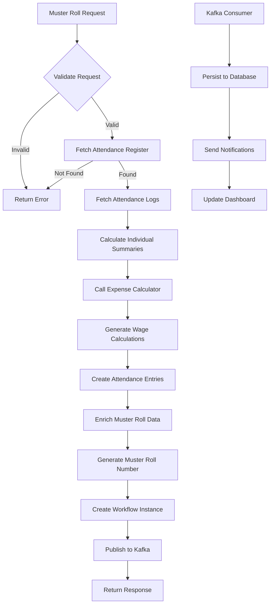
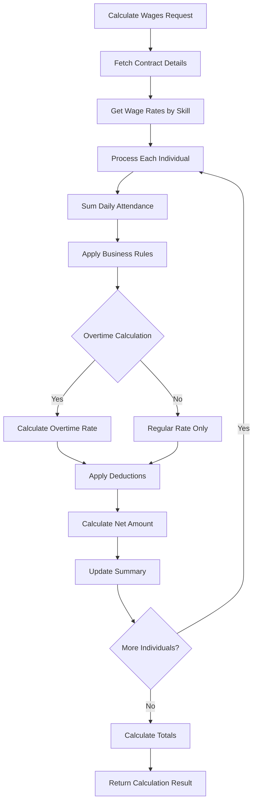
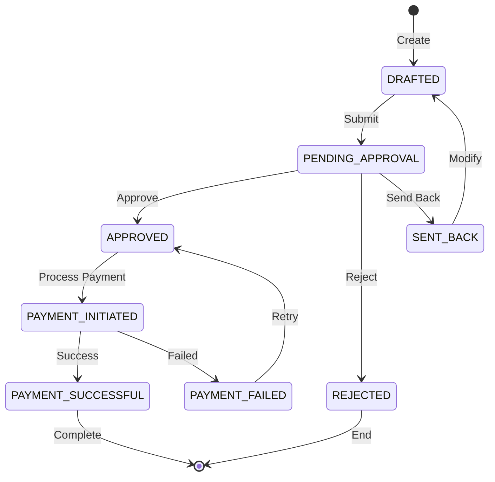
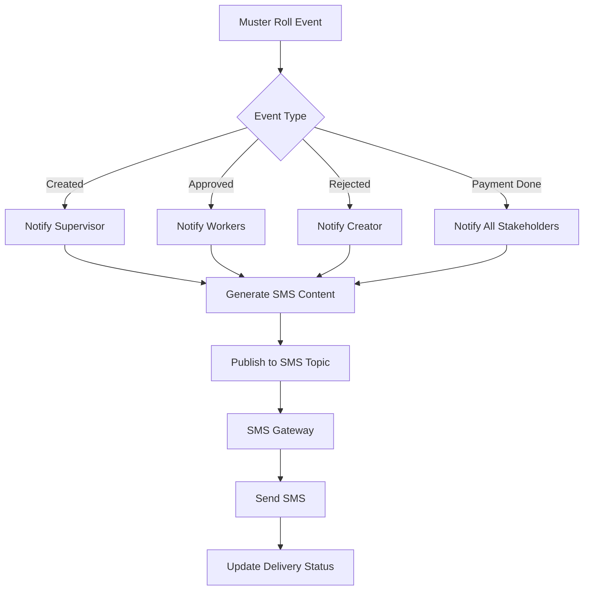

# Muster Roll Service - Technical Documentation

## Table of Contents
1. [System & Architecture Overview](#system--architecture-overview)
2. [API Documentation](#api-documentation)
3. [Domain Models & Data Structures](#domain-models--data-structures)
4. [Database Design](#database-design)
5. [Configuration & Application Properties](#configuration--application-properties)
6. [Service Dependencies](#service-dependencies)
7. [External Dependencies](#external-dependencies)
8. [Events & Messaging](#events--messaging)
9. [Execution & Business Flows](#execution--business-flows)
10. [Security Considerations](#security-considerations)

---

## System & Architecture Overview

### Service Purpose
The Muster Roll Service is a calculator service that computes wage aggregates based on attendance logs from the Attendance Service. It processes attendance data according to configurable business rules and generates muster rolls for wage payment processing. This service serves as the bridge between attendance tracking and payroll generation in the DIGIT-Works ecosystem.

### Key Features
- **Attendance Aggregation**: Calculate total attendance from attendance logs
- **Wage Estimation**: Compute wages based on attendance and skill rates
- **Muster Roll Generation**: Create payroll documents for wage seekers
- **Business Rule Engine**: Configurable wage calculation rules
- **Workflow Integration**: Approval workflows for muster roll verification
- **Integration Ready**: Seamless integration with Attendance, Individual, and Expense services

### System Architecture

```mermaid
graph TB
    subgraph "External Systems"
        ATTENDANCE[Attendance Service]
        INDIVIDUAL[Individual Service]
        EXPENSE[Expense Service]
        BANKACCT[Bank Account Service]
        ORGANISATION[Organisation Service]
        CONTRACT[Contract Service]
        CALCULATOR[Expense Calculator]
        WORKFLOW[Workflow Service]
        IDGEN[ID Generation Service]
    end
    
    subgraph "Muster Roll Service"
        API[Muster Roll API Controller]
        
        subgraph "Service Layer"
            MRSVC[Muster Roll Service]
            CALCSVC[Calculation Service]
            NOTISVC[Notification Service]
            WFSVC[Workflow Service]
        end
        
        subgraph "Enrichment Layer"
            MRENR[Muster Roll Enrichment]
            SUMENR[Summary Enrichment]
            ENTRYENR[Entry Enrichment]
        end
        
        subgraph "Validation Layer"
            MRVAL[Muster Roll Validator]
            ATTENDVAL[Attendance Validator]
            WAGEEVAL[Wage Validator]
        end
        
        subgraph "Data Layer"
            MRREPO[Muster Roll Repository]
            SUMREPO[Attendance Summary Repository]
            ENTRYREPO[Attendance Entry Repository]
        end
        
        subgraph "Infrastructure"
            KAFKA[Kafka Producer/Consumer]
            DB[(PostgreSQL Database)]
            CACHE[Cache Layer]
        end
    end
    
    API --> MRSVC
    MRSVC --> MRENR
    MRSVC --> MRVAL
    MRSVC --> CALCSVC
    MRSVC --> WFSVC
    
    CALCSVC --> SUMENR
    CALCSVC --> ENTRYENR
    CALCSVC --> ATTENDVAL
    CALCSVC --> WAGEEVAL
    
    MRSVC --> MRREPO
    CALCSVC --> SUMREPO
    CALCSVC --> ENTRYREPO
    
    MRREPO --> DB
    SUMREPO --> DB
    ENTRYREPO --> DB
    
    MRSVC --> KAFKA
    NOTISVC --> KAFKA
    
    CALCSVC --> ATTENDANCE
    MRSVC --> INDIVIDUAL
    MRSVC --> EXPENSE
    MRSVC --> BANKACCT
    MRSVC --> ORGANISATION
    MRSVC --> CONTRACT
    CALCSVC --> CALCULATOR
    WFSVC --> WORKFLOW
    MRSVC --> IDGEN
```



---

## API Documentation

### Base Configuration
- **Context Path**: `/muster-roll`
- **Port**: 8051
- **API Version**: v1

### Endpoints

#### 1. Estimate Muster Roll
**POST** `/muster-roll/v1/_estimate`

Estimates wages for a muster roll without creating the record.

**Request Body:**
```json
{
  "RequestInfo": {
    "apiId": "muster-roll-service",
    "ver": "1.0",
    "ts": 1675234567890,
    "action": "_estimate",
    "did": "",
    "key": "",
    "msgId": "20230201-123456",
    "authToken": "auth-token",
    "userInfo": {
      "id": 12345,
      "userName": "supervisor1",
      "roles": [{"code": "MUSTER_ROLL_APPROVER", "name": "Muster Roll Approver"}]
    }
  },
  "musterRoll": {
    "tenantId": "pb.amritsar",
    "registerId": "register-uuid-123",
    "startDate": 1675209600000,
    "endDate": 1675468800000,
    "attendanceRegister": {
      "id": "register-uuid-123",
      "name": "Road Construction Register",
      "referenceId": "PROJECT-123"
    }
  }
}
```

#### 2. Create Muster Roll
**POST** `/muster-roll/v1/_create`

Creates a new muster roll with calculated wages.

**Request Body:**
```json
{
  "RequestInfo": {...},
  "musterRoll": {
    "tenantId": "pb.amritsar",
    "musterRollNumber": "MR/2024-25/02/01/001",
    "registerId": "register-uuid-123",
    "startDate": 1675209600000,
    "endDate": 1675468800000,
    "musterRollStatus": "APPROVED",
    "status": "ACTIVE",
    "individualEntries": [{
      "individualId": "individual-uuid-456",
      "totalAttendance": 5.0,
      "attendanceEntries": [{
        "date": 1675209600000,
        "attendance": 1.0,
        "modifiedAttendance": 1.0
      }]
    }],
    "additionalDetails": {
      "projectName": "NH-1 Road Construction",
      "contractId": "contract-uuid-789",
      "totalWageAmount": 15000.00,
      "totalWorkers": 25
    }
  }
}
```

#### 3. Update Muster Roll
**POST** `/muster-roll/v1/_update`

Updates an existing muster roll (typically for corrections).

#### 4. Search Muster Rolls
**POST** `/muster-roll/v1/_search`

Searches muster rolls based on various criteria.

**Query Parameters:**
- `tenantId` (required): Tenant identifier
- `ids`: List of muster roll UUIDs
- `musterRollNumber`: Muster roll number
- `registerId`: Attendance register UUID
- `fromDate`: Start date filter
- `toDate`: End date filter
- `status`: Muster roll status
- `musterRollStatus`: Workflow status
- `limit`: Number of records (default: 100, max: 200)
- `offset`: Page offset (default: 0)

#### 5. Send for Approval
**POST** `/muster-roll/v1/_send_for_approval`

Sends muster roll for approval workflow.

---

## Domain Models & Data Structures

### Core Models

#### MusterRoll Model
```java
public class MusterRoll {
    private String id;                              // UUID
    private String tenantId;                        // Tenant identifier
    private String musterRollNumber;                // Custom formatted number
    private String registerId;                      // Attendance register reference
    private Long startDate;                         // Period start (epoch)
    private Long endDate;                           // Period end (epoch)
    private String musterRollStatus;                // Workflow status
    private String status;                          // ACTIVE/INACTIVE
    private List<AttendanceSummary> individualEntries; // Individual summaries
    private Workflow workflow;                      // Workflow details
    private AuditDetails auditDetails;              // Audit information
    private Object additionalDetails;               // Additional data
}
```

#### AttendanceSummary Model
```java
public class AttendanceSummary {
    private String id;                              // UUID
    private String individualId;                    // Individual reference
    private String musterRollId;                    // Muster roll reference
    private String musterRollNumber;                // Muster roll number
    private BigDecimal totalAttendance;             // Total attendance days
    private List<AttendanceEntry> attendanceEntries; // Daily entries
    private BigDecimal skillValue;                  // Skill rate
    private BigDecimal wageAmount;                  // Calculated wage
    private AuditDetails auditDetails;              // Audit information
    private Object additionalDetails;               // Additional data
}
```

#### AttendanceEntry Model
```java
public class AttendanceEntry {
    private String id;                              // UUID
    private String attendanceSummaryId;             // Summary reference
    private String individualId;                    // Individual reference
    private String musterRollNumber;                // Muster roll number
    private Long dateOfAttendance;                  // Attendance date (epoch)
    private BigDecimal attendance;                  // Attendance value (0-1)
    private BigDecimal modifiedAttendance;          // Modified/corrected value
    private AuditDetails auditDetails;              // Audit information
    private Object additionalDetails;               // Additional data
}
```

#### CalculationRequest Model
```java
public class CalculationRequest {
    private String tenantId;                        // Tenant identifier
    private String registerId;                      // Register reference
    private Long fromDate;                          // Calculation period start
    private Long toDate;                            // Calculation period end
    private List<String> individualIds;             // Specific individuals
    private String contractId;                      // Contract reference
    private Object calculationCriteria;             // Calculation parameters
}
```

#### CalculationResponse Model
```java
public class CalculationResponse {
    private String tenantId;                        // Tenant identifier
    private BigDecimal totalAmount;                 // Total calculated amount
    private List<IndividualCalculation> calculations; // Individual calculations
    private Object breakup;                         // Calculation breakup
}
```

---

## Database Design

### Database Schema

#### eg_wms_muster_roll Table
```sql
CREATE TABLE eg_wms_muster_roll(
    id                      character varying(256) PRIMARY KEY,
    tenantid               character varying(64) NOT NULL,
    musterrollnumber       character varying(128) NOT NULL,
    attendanceregisterid   character varying(256) NOT NULL,
    startdate              bigint NOT NULL,
    enddate                bigint NOT NULL,
    musterrollstatus       character varying(64) NOT NULL,
    status                 character varying(64) NOT NULL,
    additionaldetails      JSONB,
    createdby              character varying(256) NOT NULL,
    lastmodifiedby         character varying(256),
    createdtime            bigint,
    lastmodifiedtime       bigint,
    CONSTRAINT uk_eg_wms_muster_roll UNIQUE (musterrollnumber)
);

CREATE INDEX idx_muster_roll_tenant ON eg_wms_muster_roll(tenantid);
CREATE INDEX idx_muster_roll_register ON eg_wms_muster_roll(attendanceregisterid);
CREATE INDEX idx_muster_roll_dates ON eg_wms_muster_roll(startdate, enddate);
CREATE INDEX idx_muster_roll_status ON eg_wms_muster_roll(musterrollstatus);
CREATE INDEX idx_muster_roll_created_time ON eg_wms_muster_roll(createdtime);
```

#### eg_wms_attendance_summary Table
```sql
CREATE TABLE eg_wms_attendance_summary(
    id                      character varying(256) PRIMARY KEY,
    individual_id           character varying(256) NOT NULL,
    muster_roll_id          character varying(256) NOT NULL,
    musterrollnumber        character varying(128) NOT NULL,
    total_attendance        NUMERIC(10,2),
    skill_code              character varying(64),
    skill_value             NUMERIC(12,2),
    wage_amount             NUMERIC(12,2),
    additionaldetails       JSONB,
    createdby               character varying(256) NOT NULL,
    lastmodifiedby          character varying(256),
    createdtime             bigint,
    lastmodifiedtime        bigint,
    CONSTRAINT fk_eg_wms_attendance_summary FOREIGN KEY (muster_roll_id) REFERENCES eg_wms_muster_roll (id)
);

CREATE INDEX idx_summary_muster_roll ON eg_wms_attendance_summary(muster_roll_id);
CREATE INDEX idx_summary_individual ON eg_wms_attendance_summary(individual_id);
CREATE INDEX idx_summary_muster_number ON eg_wms_attendance_summary(musterrollnumber);
```

#### eg_wms_attendance_entries Table
```sql
CREATE TABLE eg_wms_attendance_entries(
    id                      character varying(256) PRIMARY KEY,
    attendance_summary_id   character varying(256) NOT NULL,
    individual_id           character varying(256) NOT NULL,
    musterrollnumber        character varying(128) NOT NULL,
    date_of_attendance      bigint,
    attendance              NUMERIC(3,2),
    modified_attendance     NUMERIC(3,2),
    additionaldetails       JSONB,
    createdby               character varying(256) NOT NULL,
    lastmodifiedby          character varying(256),
    createdtime             bigint,
    lastmodifiedtime        bigint,
    CONSTRAINT fk_eg_wms_attendance_entries FOREIGN KEY (attendance_summary_id) REFERENCES eg_wms_attendance_summary (id)
);

CREATE INDEX idx_entries_summary ON eg_wms_attendance_entries(attendance_summary_id);
CREATE INDEX idx_entries_individual ON eg_wms_attendance_entries(individual_id);
CREATE INDEX idx_entries_date ON eg_wms_attendance_entries(date_of_attendance);
CREATE INDEX idx_entries_muster_number ON eg_wms_attendance_entries(musterrollnumber);
```

---

## Configuration & Application Properties

### Server Configuration
```properties
server.contextPath=/muster-roll
server.servlet.context-path=/muster-roll
server.port=8051
app.timezone=Asia/Kolkata

# Database Configuration
spring.datasource.driver-class-name=org.postgresql.Driver
spring.datasource.url=jdbc:postgresql://localhost:5432/digit-works
spring.datasource.username=postgres
spring.datasource.password=postgres

# Flyway Configuration
spring.flyway.enabled=true
spring.flyway.table=musterroll_service_schema
spring.flyway.baseline-on-migrate=true

# Kafka Configuration
kafka.config.bootstrap_server_config=localhost:9092
spring.kafka.consumer.group-id=egov-wms-muster
spring.kafka.producer.key-serializer=org.apache.kafka.common.serialization.StringSerializer
spring.kafka.producer.value-serializer=org.springframework.kafka.support.serializer.JsonSerializer

# Kafka Topics
musterroll.kafka.create.topic=save-musterroll
musterroll.kafka.update.topic=update-musterroll
musterroll.kafka.calculate.topic=calculate-musterroll

# Search Configuration
musterroll.default.offset=0
musterroll.default.limit=100
musterroll.search.max.limit=200

# Notification Configuration
notification.sms.enabled=true
sms.isAdditonalFieldRequired=true
kafka.topics.notification.sms=egov.core.notification.sms
kafka.topics.works.notification.sms.name=works.notification.sms

# Business Configuration
muster.restricted.search.roles=ORG_ADMIN,ORG_STAFF
works.contract.service.code=WORKS-CONTRACT
```

---

## Service Dependencies

### Internal DIGIT Services

1. **Attendance Service** (`works.attendance.log.host`)
   - **Purpose**: Fetch attendance logs for calculation
   - **APIs Used**: 
     - `/attendance/log/v1/_search`
     - `/attendance/v1/_search`
   - **Usage**: Retrieve attendance data for muster roll calculation

2. **Individual Service** (`works.individual.host`)
   - **Purpose**: Individual details and validation
   - **APIs Used**: `/individual/v1/_search`
   - **Usage**: Fetch individual details, validate wage seekers

3. **Expense Calculator Service** (`works.expense.calculator.host`)
   - **Purpose**: Wage calculation logic
   - **APIs Used**: `/expense-calculator/v1/_estimate`
   - **Usage**: Calculate wages based on attendance and skill rates

4. **Bank Account Service** (`works.bankaccounts.host`)
   - **Purpose**: Payment account management
   - **APIs Used**: `/bankaccount-service/bankaccount/v1/_search`
   - **Usage**: Fetch bank account details for payments

5. **Organisation Service** (`works.organisation.host`)
   - **Purpose**: Organisation validation and details
   - **APIs Used**: `/org-services/organisation/v1/_search`
   - **Usage**: Validate contractor and organization details

6. **Contract Service** (`works.contract.host`)
   - **Purpose**: Contract details and rates
   - **APIs Used**: `/contract/v1/_search`
   - **Usage**: Fetch contract details, wage rates, and terms

7. **Workflow Service** (`egov.workflow.host`)
   - **Purpose**: Approval workflow management
   - **APIs Used**: 
     - `/egov-workflow-v2/egov-wf/process/_transition`
     - `/egov-workflow-v2/egov-wf/process/_search`
   - **Usage**: Handle muster roll approval workflow

8. **ID Generation Service** (`egov.idgen.host`)
   - **Purpose**: Generate muster roll numbers
   - **APIs Used**: `/egov-idgen/id/_generate`
   - **Usage**: Auto-generate muster roll numbers

---

## External Dependencies

### Infrastructure Dependencies

1. **PostgreSQL Database**
   - **Version**: 12+
   - **Purpose**: Primary data storage
   - **Configuration**:
     ```properties
     spring.datasource.hikari.maximum-pool-size=10
     spring.datasource.hikari.connection-timeout=30000
     spring.datasource.hikari.idle-timeout=600000
     ```

2. **Apache Kafka**
   - **Version**: 2.8+
   - **Purpose**: Event streaming and async processing
   - **Topics Required**:
     - save-musterroll
     - update-musterroll
     - calculate-musterroll
     - egov.core.notification.sms
     - works.notification.sms
   - **Configuration**:
     ```properties
     spring.kafka.consumer.auto-offset-reset=earliest
     spring.kafka.consumer.properties.session.timeout.ms=30000
     ```

### External Service Dependencies

1. **SMS Gateway**
   - **Purpose**: Send muster roll notifications
   - **Integration**: Via Notification Service
   - **Events**: Approval notifications, payment alerts

2. **Payment Gateway** (Future Integration)
   - **Purpose**: Direct payment processing
   - **APIs**: Bank integration APIs
   - **Usage**: Process wage payments directly

3. **Wage Rate Services**
   - **Purpose**: Dynamic wage rate fetching
   - **Integration**: REST API calls
   - **Usage**: Real-time minimum wage validation

---

## Events & Messaging

### Kafka Topics

#### Produced Events

| Topic | Purpose | Event Schema |
|-------|---------|--------------|
| `save-musterroll` | Create muster roll | MusterRollRequest |
| `update-musterroll` | Update muster roll | MusterRollRequest |
| `calculate-musterroll` | Trigger calculation | CalculationRequest |
| `works.notification.sms` | Send notifications | NotificationRequest |

#### Consumed Events

| Topic | Purpose | Handler |
|-------|---------|---------|
| `attendance-log-updated` | Recalculate muster | AttendanceUpdateHandler |
| `contract-updated` | Update rates | ContractUpdateHandler |

### Event Schema

```json
{
  "RequestInfo": {
    "apiId": "muster-roll-service",
    "ver": "1.0",
    "ts": 1675234567890,
    "action": "create",
    "userInfo": {...}
  },
  "musterRoll": {
    "id": "muster-roll-uuid",
    "tenantId": "pb.amritsar",
    "musterRollNumber": "MR/2024-25/02/01/001",
    "registerId": "register-uuid-123",
    "startDate": 1675209600000,
    "endDate": 1675468800000,
    "musterRollStatus": "APPROVED",
    "individualEntries": [...],
    "auditDetails": {...}
  }
}
```

---

## Execution & Business Flows

### 1. Muster Roll Creation Flow



### 2. Wage Calculation Flow



### 3. Approval Workflow



### 4. Notification Flow



---

## Security Considerations

### Authentication & Authorization
1. **JWT Token Validation**: All APIs require valid JWT tokens
2. **Role-Based Access Control**:
   - MUSTER_ROLL_APPROVER: Full muster roll management and approval
   - FIELD_SUPERVISOR: Create and submit muster rolls
   - ORG_ADMIN: View organization muster rolls
   - WAGE_SEEKER: View own attendance and wage details

### Data Security
1. **Wage Data Protection**:
   - Wage calculations encrypted in transit and at rest
   - Access logging for all wage-related operations
   - Audit trail for all modifications

2. **Input Validation**:
   - Attendance value validation (0-1 range)
   - Date range validation
   - Amount calculation validation

3. **Business Logic Security**:
   - Prevent duplicate muster rolls for same period
   - Validate attendance against actual logs
   - Ensure wage calculations match approved rates

### Compliance & Audit
1. **Financial Compliance**:
   - Immutable wage calculation records
   - Complete audit trail for all transactions
   - Regulatory compliance for wage payments

2. **Data Privacy**:
   - Wage information access restrictions
   - Employee consent for data processing
   - Right to data portability

3. **Fraud Prevention**:
   - Validation of attendance against actual logs
   - Cross-verification with project timelines
   - Automated anomaly detection

### Performance & Monitoring
1. **Calculation Performance**: Optimized algorithms for large-scale calculations
2. **Database Optimization**: Proper indexing for attendance queries
3. **Monitoring**: Real-time monitoring of calculation accuracy
4. **Alerting**: Automated alerts for calculation discrepancies