# Notification Service Documentation

## Table of Contents
1. [System & Architecture Overview](#system--architecture-overview)
2. [API Documentation](#api-documentation)
3. [Domain Models & Data Structures](#domain-models--data-structures)
4. [Database Design](#database-design)
5. [Configuration & Application Properties](#configuration--application-properties)
6. [Service Dependencies](#service-dependencies)
7. [Events & Messaging](#events--messaging)
8. [Execution & Business Flows](#execution--business-flows)
9. [Security Considerations](#security-considerations)
10. [API Flow Diagrams](#api-flow-diagrams)

## System & Architecture Overview

The Notification Service is a Spring Boot microservice that handles SMS notifications for the DIGIT Works platform. It supports multiple SMS gateway providers (CDAC, MSDG, Generic) and provides comprehensive SMS delivery management with callback handling, bounce tracking, and error handling.

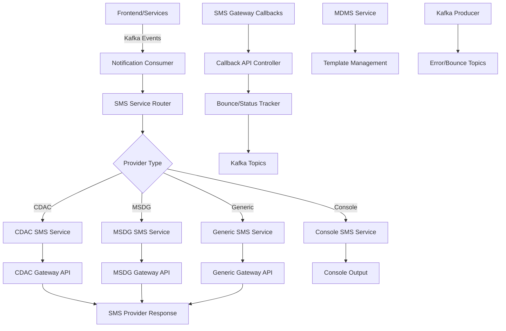

### Core Components

- **SMS Service Router**: Provider-specific SMS routing logic
- **Multiple Provider Support**: CDAC, MSDG, Generic HTTP, Console
- **Callback API**: SMS delivery status and bounce handling
- **Template Management**: Dynamic SMS content from MDMS
- **Kafka Integration**: Event-driven SMS processing
- **Error Handling**: Dead letter queue and retry mechanisms

## API Documentation

### Base URL: `/notification-sms`

#### 1. SMS Callback API
- **Endpoint**: `GET/POST /smsbounce/callback`
- **Description**: Receives delivery status callbacks from SMS gateways
- **Authentication**: Provider-specific callback authentication

**Query Parameters**:
- `userId`: User identifier
- `jobno`: SMS job number from provider
- `mobilenumber`: Target mobile number
- `status`: Delivery status code (0-11)
- `DoneTime`: Delivery timestamp
- `messagepart`: Message content part
- `sender_name`: Sender identifier

**Response**:
```json
{
  "status": "success",
  "message": "Status successfully sent"
}
```

### SMS Processing (Kafka-driven)

The service primarily operates through Kafka event consumption rather than direct REST APIs.

#### Kafka Event Schema
```json
{
  "message": "Your project PJ/2023-24/000001 has been approved",
  "mobileNumber": "+919876543210",
  "templateId": "PROJECT_APPROVAL",
  "tenantId": "od.testing",
  "additionalFields": {
    "requestInfo": {...},
    "templateData": {
      "projectNumber": "PJ/2023-24/000001",
      "applicantName": "John Doe"
    }
  }
}
```

## Domain Models & Data Structures

### Core Entities

#### SMSRequest
```java
public class SMSRequest {
    private RequestInfo RequestInfo;
    private String message;
    private String mobileNumber;
    private String templateId;
    private String tenantId;
    private Category category;
    private Long expiryTime;
    private Map<String, Object> additionalFields;
}
```

#### Sms
```java
public class Sms {
    private String mobileNumber;
    private String message;
    private Category category;
    private Long expiryTime;
    private String templateId;
    private Map<String, String> templateData;
    
    public boolean isValid() {
        return mobileNumber != null && message != null;
    }
}
```

#### Report (Callback)
```java
public class Report {
    private String jobno;
    private Integer messagestatus;
    private String DoneTime;
    private String usernameHash;
}
```

#### SMS Provider Configuration
```java
public class SMSProperties {
    private String providerClass;
    private String requestType;
    private String url;
    private String contentType;
    private String username;
    private String password;
    private String senderId;
    private String departmentId;
    private List<String> blacklistNumbers;
    private List<String> whitelistNumbers;
    private List<Integer> successCodes;
    private List<Integer> errorCodes;
    private Map<String, String> configMap;
    private Map<String, Object> categoryMap;
}
```

### Provider-Specific Implementations

#### CDAC SMS Service
- **Provider**: Government of Odisha CDAC SMS Gateway
- **Authentication**: Username/password based
- **API**: REST POST with JSON payload
- **Features**: Delivery reports, template mapping

#### MSDG SMS Service
- **Provider**: Mobile Service Delivery Gateway
- **Authentication**: API key based
- **API**: REST POST with form-data
- **Features**: Departmental SMS, template validation

#### Generic SMS Service
- **Provider**: Configurable HTTP gateway
- **Authentication**: Configurable
- **API**: Flexible HTTP methods and content types
- **Features**: Universal provider support

### Validation Rules

- **Mobile Number**: Must match pattern `^[6-9][0-9]{9}$`
- **Message**: Cannot be null or empty
- **Status Codes**: Callback status must be 0-11
- **Blacklist/Whitelist**: Number filtering based on configuration
- **Template**: Valid template ID from MDMS (if used)

## Database Design

### Kafka-Based Architecture

The Notification Service is primarily stateless and uses Kafka for data persistence and event tracking.

#### Message Flow Architecture
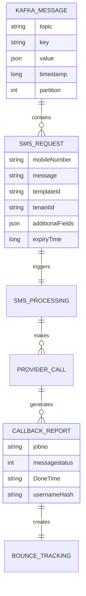

### Kafka Topics Structure

#### Input Topics
- `egov.core.notification.sms`: General DIGIT SMS notifications
- `mukta.notification.sms`: MUKTA-specific SMS notifications
- `works.notification.sms`: Works-specific SMS notifications

#### Output Topics
- `egov.core.notification.sms.bounce`: SMS bounce and delivery reports
- `egov.core.sms.expiry`: Expired SMS tracking
- `egov.core.sms.error`: SMS processing errors
- `notification-sms-deadletter`: Failed message handling

## Configuration & Application Properties

### Server Configuration
```properties
server.servlet.context-path=/notification-sms
server.context.path=/notification-sms
server.port=8095
spring.main.web-environment=false
```

### SMS Provider Configuration
```properties
# Provider Selection
sms.provider.class=CDAC
sms.provider.requestType=POST
sms.provider.url=https://govtsms.odisha.gov.in/api/api.php
sms.provider.contentType=application/json

# Provider Credentials
sms.provider.username=username
sms.provider.password=password
sms.senderid=ODIGOV
sms.departmentid=D001002

# Provider Behavior
sms.verify.response=true
sms.print.response=true
sms.verify.responseContains="success":true
sms.verify.ssl=true
sms.url.dont_encode_url=true
```

### Number Management
```properties
# Filtering
sms.blacklist.numbers=9999X,5*
sms.whitelist.numbers=
sms.mobile.prefix=

# Response Codes
sms.success.codes=200,201,202
sms.error.codes=
```

### Template and Content Mapping
```properties
# Dynamic Configuration Maps
sms.config.map={'action':'$action', 'source':'$source', 'department_id':'$department_id', 'template_id':'$template_id', 'sms_content': '$smsContent' , 'phonenumber': '$phonenumber'}
sms.category.map={'mtype': {'*': 'abc', 'OTP': 'def'}}
sms.extra.config.map={'extraParam': 'abc'}
```

### Kafka Configuration
```properties
spring.kafka.bootstrap-servers=localhost:9092
spring.kafka.consumer.group-id=sms
spring.kafka.consumer.auto-offset-reset=earliest
spring.kafka.consumer.session-timeout-ms-config=15000

# Topic Names
kafka.topics.notification.sms.name=egov.core.notification.sms
kafka.topics.mukta.notification.sms.name=mukta.notification.sms
kafka.topics.works.notification.sms.id=notification.sms
kafka.topics.sms.bounce=egov.core.notification.sms.bounce
kafka.topics.error.sms=egov.core.sms.error
```

### MDMS Integration
```properties
egov.mdms.host=http://localhost:8080
egov.mdms.search.endpoint=/egov-mdms-service/v1/_search
```

## Service Dependencies

### Internal DIGIT Services

1. **MDMS Service** (`egov.mdms.host`)
   - **Purpose**: SMS template management and configuration
   - **APIs Used**: `/egov-mdms-service/v1/_search`
   - **Usage**: Fetch SMS templates, tenant configurations

2. **All Works Services**
   - **Purpose**: SMS notification triggers
   - **Integration**: Through Kafka topics
   - **Usage**: Receive notification events from various services

### External Dependencies

1. **SMS Gateway Providers**
   - **CDAC Gateway**: Government SMS service
   - **MSDG Gateway**: Mobile service delivery
   - **Generic HTTP**: Third-party SMS providers
   - **Usage**: Actual SMS delivery

2. **Kafka Message Broker**
   - **Purpose**: Event-driven SMS processing
   - **Topics**: Multiple notification and tracking topics
   - **Usage**: Asynchronous SMS processing pipeline

3. **Hash Service**
   - **Purpose**: Mobile number hashing for privacy
   - **Usage**: Secure mobile number storage in callbacks

## Events & Messaging

### SMS Processing Flow

#### Input Events
```json
{
  "RequestInfo": {...},
  "message": "Your application {applicationNumber} has been {status}",
  "mobileNumber": "+919876543210", 
  "templateId": "APPLICATION_STATUS",
  "tenantId": "od.testing",
  "category": "NOTIFICATION",
  "additionalFields": {
    "templateData": {
      "applicationNumber": "AP/2023/000001",
      "status": "approved"
    }
  }
}
```

#### Output Events
```json
{
  "jobno": "JOB123456",
  "messagestatus": 1,
  "DoneTime": "2023-01-01 10:30:00",
  "usernameHash": "hashed-mobile-number"
}
```

### Event Processing Patterns

#### SMS Send Flow
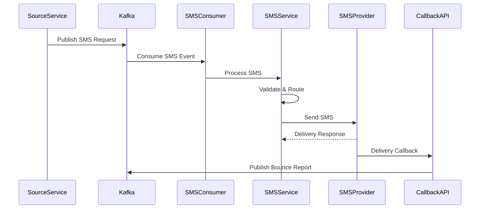

## Execution & Business Flows

### 1. SMS Processing Flow

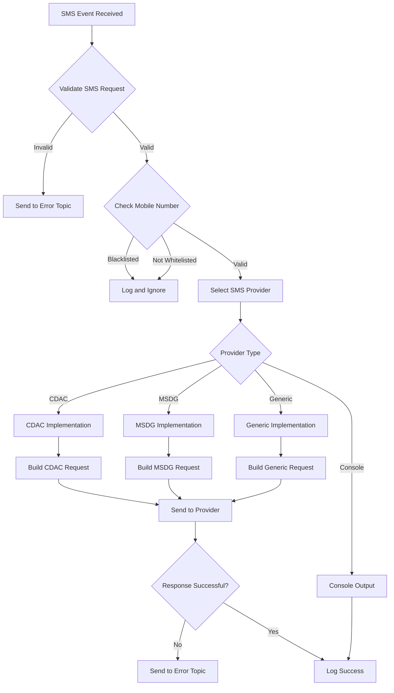

### 2. Provider Selection Flow

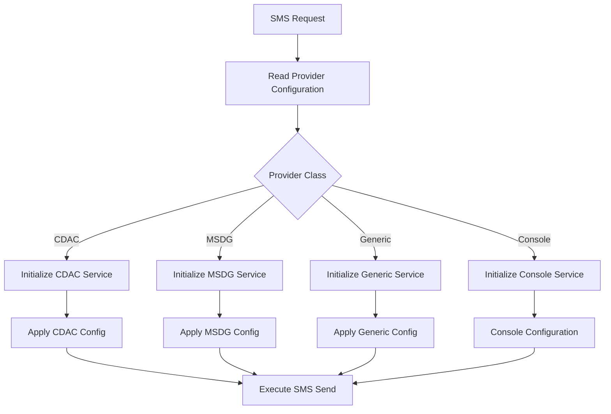

### 3. Callback Processing Flow

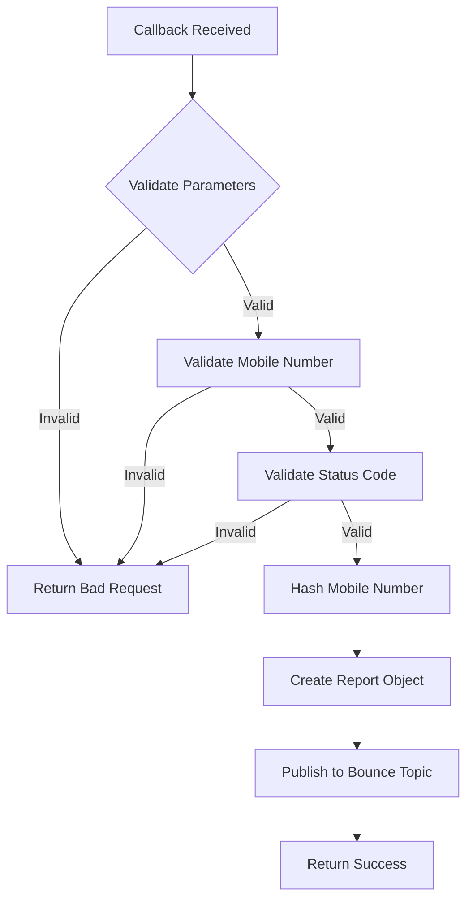

### 4. Template Processing Flow

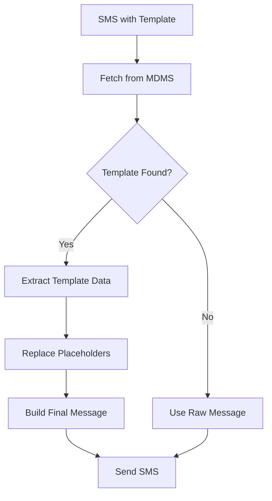

## Security Considerations

### Authentication & Authorization

1. **Provider Authentication**
   - SMS gateway credentials securely configured
   - API key management for different providers
   - SSL/TLS encryption for provider communication

2. **Callback Security**
   - Provider IP whitelisting (if supported)
   - Signature validation for callbacks
   - Rate limiting on callback endpoints

3. **Data Protection**
   - Mobile number hashing in bounce reports
   - No storage of sensitive SMS content
   - Secure credential management

### Input Validation

1. **Mobile Number Validation**
   - Regex pattern validation for Indian mobile numbers
   - Blacklist/whitelist number filtering
   - International number format support

2. **Message Content Validation**
   - Content length limits based on provider
   - Character encoding validation
   - Template injection prevention

3. **Provider Response Validation**
   - Expected response code validation
   - Response content verification
   - Error code handling

### Privacy & Compliance

1. **Data Minimization**
   - No persistent storage of SMS content
   - Mobile number hashing for tracking
   - Minimal log retention

2. **Audit Trail**
   - SMS delivery status tracking
   - Provider response logging
   - Error tracking and alerting

## API Flow Diagrams

### 1. SMS Send Process Flow

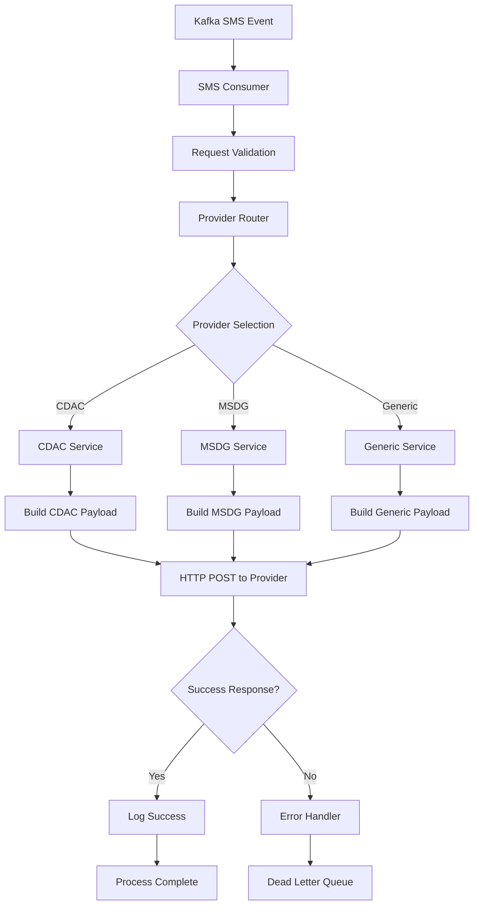

### 2. Callback Processing Flow

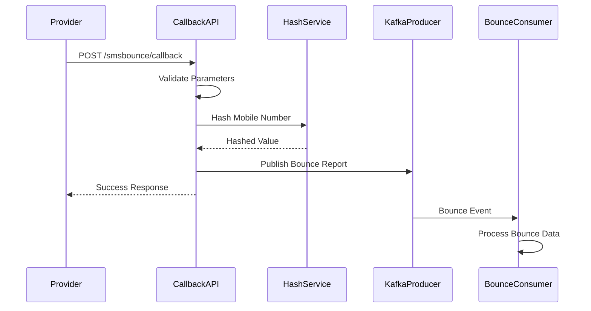

### 3. Template Resolution Flow

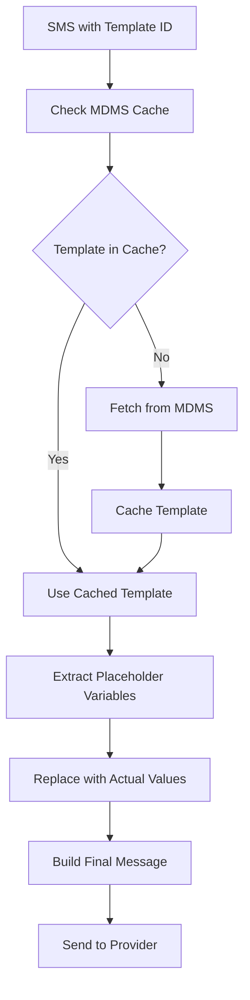

### 4. Error Handling Flow

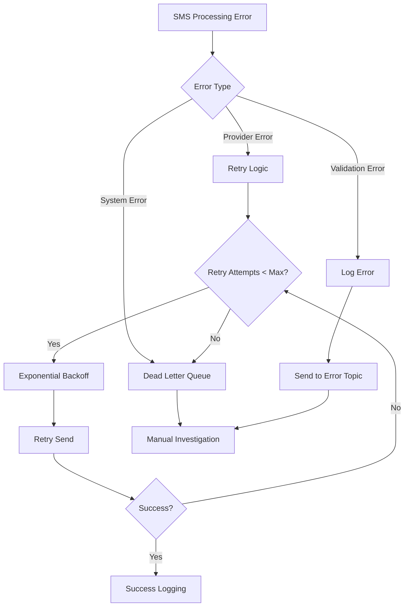

This comprehensive documentation provides detailed insights into the Notification Service's multi-provider SMS architecture, Kafka-driven processing, callback handling, and secure SMS delivery management for DIGIT Works platform.