# Organisation Service Technical Documentation

## Table of Contents
1. [System & Architecture Overview](#system--architecture-overview)
2. [API Documentation](#api-documentation)
3. [Domain Models & Data Structures](#domain-models--data-structures)
4. [Database Design](#database-design)
5. [Configuration & Application Properties](#configuration--application-properties)
6. [Service Dependencies](#service-dependencies)
7. [Events & Messaging](#events--messaging)
8. [Execution & Business Flows](#execution--business-flows)
9. [Security Considerations](#security-considerations)
10. [API Flow Diagrams](#api-flow-diagrams)

---

## System & Architecture Overview

The Organisation Service is a generic registry designed to store all types of organisations in the Works domain, including vendors, contractors, and community-based organisations (CBOs). The service provides comprehensive CRUD operations with validation, enrichment, and audit capabilities.

### High-Level Architecture

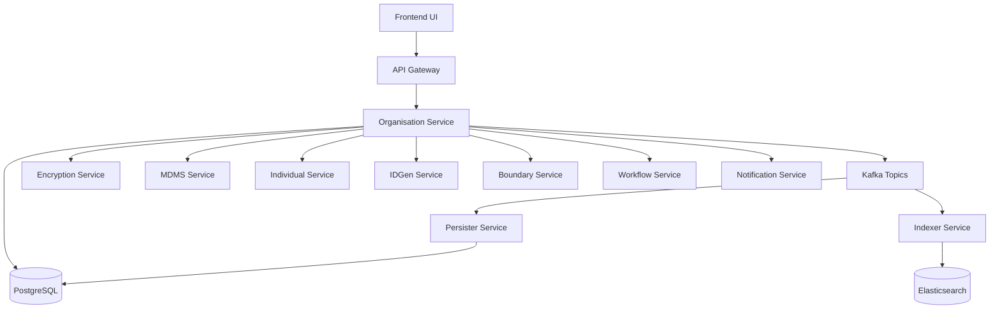

### Component Responsibilities

- **Organisation Service Core**: Main business logic, validation, and orchestration
- **Controller Layer**: REST API endpoints handling HTTP requests/responses
- **Service Layer**: Business logic implementation and workflow orchestration
- **Repository Layer**: Data access and database operations
- **Validator**: Request validation and business rule enforcement
- **Enrichment Service**: Data enrichment and ID generation coordination
- **Encryption Service**: Sensitive data encryption/decryption

### Interaction Between Internal and External Services

- **Internal Services**: Controllers → Services → Repository → Database
- **External Dependencies**: MDMS (validation), Individual Service (user management), IDGen (ID generation), Encryption (data security), Kafka (event publishing)

---

## API Documentation

### Base Context Path
- **Base URL**: `/org-services`
- **Server Port**: 8035

### API Endpoints

#### 1. Organisation Registry APIs (Without Workflow)

##### Create Organisation
- **Method**: `POST`
- **Endpoint**: `/org-services/organisation/v1/_create`
- **Description**: Creates a new organisation without workflow approval
- **Authentication**: Required (Bearer Token)
- **Authorization**: Based on user roles and tenant access

**Request Schema**:
```json
{
  "RequestInfo": {
    "apiId": "org-services",
    "ver": "1.0.0",
    "ts": 1640995200000,
    "action": "_create",
    "msgId": "uuid",
    "authToken": "token",
    "userInfo": {
      "uuid": "user-uuid",
      "tenantId": "tenant-id"
    }
  },
  "organisations": {
    "tenantId": "pg.citya",
    "name": "ABC Construction Company",
    "externalRefNumber": "EXT123",
    "dateOfIncorporation": 1609459200000,
    "orgAddress": [
      {
        "tenantId": "pg.citya",
        "doorNo": "123",
        "street": "Main Street",
        "landmark": "Near City Hall",
        "city": "CityA",
        "pincode": "110001",
        "boundaryCode": "WARD001",
        "boundaryType": "Ward",
        "geoLocation": {
          "latitude": 28.7041,
          "longitude": 77.1025
        }
      }
    ],
    "contactDetails": [
      {
        "contactName": "John Doe",
        "contactMobileNumber": "9876543210",
        "contactEmail": "john@abc.com"
      }
    ],
    "identifiers": [
      {
        "type": "PAN",
        "value": "ABCDE1234F"
      }
    ],
    "functions": [
      {
        "type": "CONTRACTOR",
        "category": "CIVIL",
        "class": "CLASS_1",
        "validFrom": 1640995200000,
        "validTo": 1672531200000
      }
    ],
    "jurisdiction": [
      {
        "code": "WARD001"
      }
    ],
    "documents": [
      {
        "documentType": "PAN_CARD",
        "fileStore": "filestore-id",
        "documentUid": "PAN123"
      }
    ]
  }
}
```

**Response Schema**:
```json
{
  "ResponseInfo": {
    "apiId": "org-services",
    "ver": "1.0.0",
    "ts": 1640995200000,
    "status": "SUCCESSFUL"
  },
  "organisations": [
    {
      "id": "org-uuid",
      "applicationNumber": "SR/ORG/17-12-2021/001",
      "orgNumber": "ORG-001",
      "applicationStatus": "ACTIVE",
      "isActive": true,
      "auditDetails": {
        "createdBy": "user-uuid",
        "createdTime": 1640995200000,
        "lastModifiedBy": "user-uuid",
        "lastModifiedTime": 1640995200000
      }
    }
  ]
}
```

##### Update Organisation
- **Method**: `POST`
- **Endpoint**: `/org-services/organisation/v1/_update`
- **Description**: Updates an existing organisation
- **Authentication**: Required
- **Authorization**: User must have update permissions

##### Search Organisations
- **Method**: `POST`
- **Endpoint**: `/org-services/organisation/v1/_search`
- **Description**: Searches organisations based on various criteria
- **Authentication**: Required
- **Authorization**: Tenant-based access control

**Search Request Schema**:
```json
{
  "RequestInfo": { ... },
  "searchCriteria": {
    "tenantId": "pg.citya",
    "id": ["org-uuid"],
    "name": "ABC Construction",
    "applicationNumber": "SR/ORG/17-12-2021/001",
    "orgNumber": "ORG-001",
    "applicationStatus": "ACTIVE",
    "contactMobileNumber": "9876543210",
    "identifierType": "PAN",
    "identifierValue": "ABCDE1234F",
    "boundaryCode": "WARD001",
    "createdFrom": 1640995200000,
    "createdTo": 1672531200000,
    "includeDeleted": false
  },
  "pagination": {
    "limit": 10,
    "offset": 0,
    "sortBy": "createdTime",
    "order": "desc"
  }
}
```

#### 2. Organisation Service APIs (With Workflow)

##### Create Organisation (Workflow)
- **Method**: `POST`
- **Endpoint**: `/org-services/v1/_create`
- **Description**: Creates organisation with workflow approval process
- **Status**: Currently returns empty implementation

##### Update Organisation (Workflow)
- **Method**: `POST`
- **Endpoint**: `/org-services/v1/_update`
- **Description**: Updates organisation with workflow approval process

##### Search Organisations (Workflow)
- **Method**: `POST`
- **Endpoint**: `/org-services/v1/_search`
- **Description**: Searches organisations in workflow context

### Error Handling Patterns

All APIs follow standardized error response format:

```json
{
  "Errors": [
    {
      "code": "INVALID_TENANT_ID",
      "message": "Tenant id is mandatory",
      "description": "The tenant: pg.citya is not present in MDMS"
    }
  ]
}
```

Common Error Codes:
- `INVALID_TENANT_ID`: Invalid or missing tenant
- `ORG_NAME`: Organisation name validation failure
- `INVALID_ORG_TYPE`: Organisation type not found in MDMS
- `INVALID_ORG_ID`: Organisation ID doesn't exist
- `USERINFO_UUID`: Missing user information
- `ADDRESS.BOUNDARY_CODE`: Invalid boundary code

---

## Domain Models & Data Structures

### Core Domain Models

#### Organisation
```java
public class Organisation {
    private String id;                      // UUID
    private String tenantId;               // Tenant identifier
    private String name;                   // Organisation name
    private String applicationNumber;      // Auto-generated application number
    private String orgNumber;             // Auto-generated organisation number
    private ApplicationStatus applicationStatus; // ACTIVE, INACTIVE, PENDING
    private String externalRefNumber;     // External reference
    private BigDecimal dateOfIncorporation; // Incorporation date (epoch)
    private List<Address> orgAddress;     // Organisation addresses
    private List<ContactDetails> contactDetails; // Contact information
    private List<Identifier> identifiers; // Tax identifiers (PAN, GSTIN)
    private List<Function> functions;     // Functional capabilities
    private List<Jurisdiction> jurisdiction; // Area of operation
    private Boolean isActive;             // Active status
    private List<Document> documents;     // Attached documents
    private Object additionalDetails;     // JSON for extra info
    private AuditDetails auditDetails;    // Audit trail
}
```

#### Function
```java
public class Function {
    private String id;                    // UUID
    private String orgId;                 // Organisation reference
    private String applicationNumber;     // Function application number
    private String type;                  // Organisation type (CONTRACTOR, VENDOR)
    private String category;              // Function category (CIVIL, ELECTRICAL)
    private String propertyClass;         // Classification (CLASS_1, CLASS_2)
    private BigDecimal validFrom;         // Validity start date
    private BigDecimal validTo;           // Validity end date
    private ApplicationStatus applicationStatus;
    private String wfStatus;              // Workflow status
    private Boolean isActive;
    private List<Document> documents;     // Function-specific documents
    private Object additionalDetails;
    private AuditDetails auditDetails;
}
```

#### Address
```java
public class Address {
    private String id;                    // UUID
    private String tenantId;
    private String orgId;                 // Organisation reference
    private String doorNo;                // Door/House number
    private String plotNo;                // Plot number
    private String landmark;              // Landmark for location
    private String city;
    private String pincode;
    private String district;
    private String region;
    private String state;
    private String country;
    private String boundaryCode;          // Administrative boundary code
    private String boundaryType;          // Boundary type (Ward, Zone)
    private String buildingName;
    private String street;
    private GeoLocation geoLocation;      // Latitude, Longitude
    private Object additionalDetails;
}
```

#### ContactDetails
```java
public class ContactDetails {
    private String id;                    // UUID
    private String tenantId;
    private String orgId;                 // Organisation reference
    private String contactName;           // Contact person name (encrypted)
    private String contactMobileNumber;   // Mobile number (encrypted)
    private String contactEmail;          // Email address (encrypted)
}
```

#### Identifier
```java
public class Identifier {
    private String id;                    // UUID
    private String orgId;                 // Organisation reference
    private String type;                  // Identifier type (PAN, GSTIN, TIN)
    private String value;                 // Identifier value
    private Boolean isActive;
    private Object additionalDetails;
}
```

#### Jurisdiction
```java
public class Jurisdiction {
    private String id;                    // UUID
    private String orgId;                 // Organisation reference
    private String code;                  // Jurisdiction boundary code
    private Object additionalDetails;
}
```

### DTOs and Request Models

#### OrgRequest
```java
public class OrgRequest {
    private RequestInfo requestInfo;      // Standard request metadata
    private List<Organisation> organisations; // Organisation data
}
```

#### OrgSearchRequest
```java
public class OrgSearchRequest {
    private RequestInfo requestInfo;
    private OrgSearchCriteria searchCriteria; // Search parameters
    private Pagination pagination;        // Pagination details
}
```

### Validation Rules

#### Organisation Validation
- `tenantId`: Mandatory, 2-64 characters
- `name`: Mandatory, 2-128 characters
- `contactDetails`: At least one contact required
- `identifiers`: At least one identifier required
- `functions`: At least one function required
- `orgAddress`: Optional but if provided, boundaryCode and boundaryType are mandatory

#### Function Validation
- `type`: Must exist in MDMS OrgType master
- `category`: Must exist in MDMS OrgFunctionCategory master
- `class`: Must exist in MDMS OrgFunctionClass master
- `validFrom < validTo`: Validity date validation

#### Address Validation
- `boundaryCode`: Must exist in boundary service
- `boundaryType`: Valid boundary type from MDMS

### Enum Definitions

#### ApplicationStatus
```java
public enum ApplicationStatus {
    ACTIVE,
    INACTIVE,
    PENDING,
    APPROVED,
    REJECTED
}
```

---

## Database Design

### Database Schema

The Organisation Service uses PostgreSQL with Flyway migration management.

#### Core Tables

##### eg_org (Main Organisation Table)
```sql
CREATE TABLE eg_org (
  id                     VARCHAR(256) PRIMARY KEY,
  tenant_id              VARCHAR(64) NOT NULL,
  application_number     VARCHAR(140) NOT NULL UNIQUE,
  name                   VARCHAR(140) NOT NULL,
  org_number             VARCHAR(140),
  external_ref_number    VARCHAR(64),
  date_of_incorporation  BIGINT,
  application_status     VARCHAR(256),
  is_active              BOOLEAN,
  additional_details     JSONB,
  created_by             VARCHAR(64),
  last_modified_by       VARCHAR(64),
  created_time           BIGINT,
  last_modified_time     BIGINT
);
```

##### eg_org_address (Organisation Address)
```sql
CREATE TABLE eg_org_address (
  id                  VARCHAR(256) PRIMARY KEY,
  tenant_id           VARCHAR(64),
  org_id              VARCHAR(256) NOT NULL REFERENCES eg_org(id),
  door_no             VARCHAR,
  plot_no             VARCHAR,
  landmark            VARCHAR,
  city                VARCHAR,
  pin_code            VARCHAR,
  district            VARCHAR,
  region              VARCHAR,
  state               VARCHAR,
  country             VARCHAR,
  boundary_code       VARCHAR,
  boundary_type       VARCHAR,
  building_name       VARCHAR(64),
  street              VARCHAR(64),
  additional_details  JSONB
);
```

##### eg_org_contact_detail (Contact Information)
```sql
CREATE TABLE eg_org_contact_detail (
  id                       VARCHAR(256) PRIMARY KEY,
  tenant_id                VARCHAR(64),
  org_id                   VARCHAR(256) NOT NULL REFERENCES eg_org(id),
  contact_name             VARCHAR(128), -- Encrypted field
  contact_mobile_number    VARCHAR(64),  -- Encrypted field
  contact_email            VARCHAR(128)  -- Encrypted field
);
```

##### eg_org_function (Organisation Functions)
```sql
CREATE TABLE eg_org_function (
  id                        VARCHAR(256) PRIMARY KEY,
  org_id                    VARCHAR(256) NOT NULL REFERENCES eg_org(id),
  application_number        VARCHAR(140) NOT NULL,
  type                      VARCHAR(256),
  category                  VARCHAR(256),
  class                     VARCHAR(256),
  valid_from                BIGINT,
  valid_to                  BIGINT,
  application_status        VARCHAR(256),
  wf_status                 VARCHAR(256),
  is_active                 BOOLEAN,
  additional_details        JSONB,
  created_by                VARCHAR(64),
  last_modified_by          VARCHAR(64),
  created_time              BIGINT,
  last_modified_time        BIGINT
);
```

##### eg_tax_identifier (Tax Identifiers)
```sql
CREATE TABLE eg_tax_identifier (
  id                     VARCHAR(256) PRIMARY KEY,
  org_id                 VARCHAR(256) NOT NULL REFERENCES eg_org(id),
  type                   VARCHAR(64),
  value                  VARCHAR(64),
  additional_details     JSONB
);
```

##### eg_org_jurisdiction (Jurisdiction)
```sql
CREATE TABLE eg_org_jurisdiction (
  id                   VARCHAR(256) PRIMARY KEY,
  org_id               VARCHAR(256) NOT NULL REFERENCES eg_org(id),
  code                 VARCHAR(64) NOT NULL,
  additional_details   JSONB
);
```

##### eg_org_document (Documents)
```sql
CREATE TABLE eg_org_document (
  id                    VARCHAR(256) PRIMARY KEY,
  org_id                VARCHAR(256) REFERENCES eg_org(id),
  org_func_id           VARCHAR(256) REFERENCES eg_org_function(id),
  document_type         VARCHAR,
  file_store            VARCHAR,
  document_uid          VARCHAR(256),
  additional_details    JSONB
);
```

##### eg_org_address_geo_location (Geo Location)
```sql
CREATE TABLE eg_org_address_geo_location (
  id                   VARCHAR(256) PRIMARY KEY,
  address_id           VARCHAR(256) NOT NULL REFERENCES eg_org_address(id),
  latitude             NUMERIC,
  longitude            NUMERIC,
  additional_details   JSONB
);
```

### Entity Relationships

#### Primary Keys & Foreign Keys
- **eg_org.id** → Primary key for organisations
- **eg_org_address.org_id** → Foreign key to eg_org.id
- **eg_org_contact_detail.org_id** → Foreign key to eg_org.id
- **eg_org_function.org_id** → Foreign key to eg_org.id
- **eg_tax_identifier.org_id** → Foreign key to eg_org.id
- **eg_org_jurisdiction.org_id** → Foreign key to eg_org.id
- **eg_org_document.org_id** → Foreign key to eg_org.id
- **eg_org_document.org_func_id** → Foreign key to eg_org_function.id
- **eg_org_address_geo_location.address_id** → Foreign key to eg_org_address.id

#### Relationship Types
- **Organisation → Address**: One-to-Many (1:M)
- **Organisation → ContactDetails**: One-to-Many (1:M)
- **Organisation → Function**: One-to-Many (1:M)
- **Organisation → Identifier**: One-to-Many (1:M)
- **Organisation → Jurisdiction**: One-to-Many (1:M)
- **Organisation → Document**: One-to-Many (1:M)
- **Function → Document**: One-to-Many (1:M)
- **Address → GeoLocation**: One-to-One (1:1)

### Indexes and Constraints

#### Indexes
```sql
-- Performance indexes added in migration V20230301143030
CREATE INDEX idx_eg_org_tenant_id ON eg_org(tenant_id);
CREATE INDEX idx_eg_org_application_number ON eg_org(application_number);
CREATE INDEX idx_eg_org_contact_mobile ON eg_org_contact_detail(contact_mobile_number);
CREATE INDEX idx_eg_org_address_boundary ON eg_org_address(boundary_code);
CREATE INDEX idx_eg_tax_identifier_type_value ON eg_tax_identifier(type, value);
```

#### Constraints
```sql
-- Unique constraints
ALTER TABLE eg_org ADD CONSTRAINT uk_eg_org UNIQUE (application_number);

-- Foreign key constraints enforce referential integrity
-- Check constraints for data validation (can be added as needed)
```

### Entity-Relationship Diagram

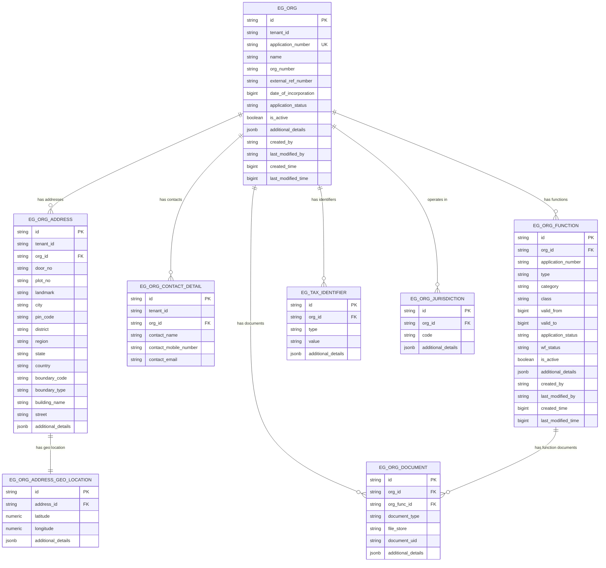

---

## Configuration & Application Properties

### Core Application Properties

#### Server Configuration
```properties
# Server Configuration
server.contextPath=/org-services
server.servlet.contextPath=/org-services
server.port=8035
app.timezone=UTC
```

#### Database Configuration
```properties
# PostgreSQL Database Configuration
spring.datasource.driver-class-name=org.postgresql.Driver
spring.datasource.url=jdbc:postgresql://localhost:5432/works
spring.datasource.username=egov
spring.datasource.password=egov

# Flyway Migration Configuration
spring.flyway.url=jdbc:postgresql://localhost:5432/digit-works
spring.flyway.user=egov
spring.flyway.password=egov
spring.flyway.table=public
spring.flyway.baseline-on-migrate=true
spring.flyway.outOfOrder=true
spring.flyway.locations=classpath:/db/migration/main
spring.flyway.enabled=true
```

#### Kafka Configuration
```properties
# Kafka Server Configuration
kafka.config.bootstrap_server_config=localhost:9092
spring.kafka.consumer.properties.spring.deserializer.value.delegate.class=org.springframework.kafka.support.serializer.JsonDeserializer
spring.kafka.consumer.key-deserializer=org.apache.kafka.common.serialization.StringDeserializer
spring.kafka.consumer.group-id=organisation
spring.kafka.producer.key-serializer=org.apache.kafka.common.serialization.StringSerializer
spring.kafka.producer.value-serializer=org.springframework.kafka.support.serializer.JsonSerializer
spring.kafka.listener.missing-topics-fatal=false
spring.kafka.consumer.properties.spring.json.use.type.headers=false

# Kafka Consumer Configuration
kafka.consumer.config.auto_commit=true
kafka.consumer.config.auto_commit_interval=100
kafka.consumer.config.session_timeout=15000
kafka.consumer.config.auto_offset_reset=earliest

# Kafka Producer Configuration
kafka.producer.config.retries_config=0
kafka.producer.config.batch_size_config=16384
kafka.producer.config.linger_ms_config=1
kafka.producer.config.buffer_memory_config=33554432

# Kafka Topics
org.kafka.create.topic=save-org
org.kafka.update.topic=update-org
org.contact.details.update.topic=organisation.contact.details.update
```

### External Service URLs

#### MDMS Configuration
```properties
# MDMS (Master Data Management Service)
egov.mdms.host=https://unified-qa.digit.org
egov.mdms.search.endpoint=/mdms-v2/v1/_search
```

#### User Service Configuration
```properties
# User Management Service
egov.user.host=https://works-dev.digit.org
egov.user.context.path=/user/users
egov.user.create.path=/_createnovalidate
egov.user.search.path=/user/_search
egov.user.update.path=/_updatenovalidate
```

#### Individual Service Configuration
```properties
# Individual Service
works.individual.host=https://works-dev.digit.org/
works.individual.search.endpoint=individual/v1/_search
works.individual.create.endpoint=individual/v1/_create
works.individual.update.endpoint=individual/v1/_update
```

#### IDGen Service Configuration
```properties
# ID Generation Service
egov.idgen.host=https://works-dev.digit.org/
egov.idgen.path=egov-idgen/id/_generate

# Organisation ID Generation Formats
egov.idgen.organisation.application.number.name=org.application.number
egov.idgen.organisation.application.number.format=SR/ORG/[cy:dd-MM-yyyy]/[SEQ_ORG_APP_NUM]
egov.idgen.organisation.number.name=org.number
egov.idgen.organisation.number.format=ORG-[SEQ_ORG_NUM]
egov.idgen.function.application.number.name=function.application.number
egov.idgen.function.application.number.format=SR/FUNC/[cy:dd-MM-yyyy]/[SEQ_FUNC_APP_NUM]
```

#### Workflow Configuration
```properties
# Workflow Service
is.workflow.enabled=true
egov.workflow.host=https://works-dev.digit.org
egov.workflow.transition.path=/egov-workflow-v2/egov-wf/process/_transition
egov.workflow.businessservice.search.path=/egov-workflow-v2/egov-wf/businessservice/_search
egov.workflow.processinstance.search.path=/egov-workflow-v2/egov-wf/process/_search
```

#### Boundary Service Configuration
```properties
# Location/Boundary Service
egov.location.host=http://localhost:8085
egov.location.context.path=/boundary-service/
egov.location.endpoint=/boundary/_search
egov.location.hierarchy.type=ADMIN
```

#### Encryption Service Configuration
```properties
# Encryption Service
egov.enc.host=https://unified-dev.digit.org
egov.enc.encrypt.endpoint=/egov-enc-service/crypto/v1/_encrypt
egov.enc.decrypt.endpoint=/egov-enc-service/crypto/v1/_decrypt
state.level.tenant.id=pg
```

### Notification Configuration
```properties
# Notification Configuration
notification.sms.enabled=true
kafka.topics.notification.sms=egov.core.notification.sms
egov.sms.notification.topic=egov.core.notification.sms

# URL Shortener
egov.url.shortner.host=https://works-dev.digit.org
egov.url.shortner.endpoint=/egov-url-shortening/shortener
```

### Search Configuration
```properties
# Search Configuration
org.default.offset=0
org.default.limit=100
org.search.max.limit=200
```

### CBO Application Configuration
```properties
# Community Based Organisation App URLs
works.cbo.url.host=https://works-dev.digit.org
works.cbo.url.endpoint=/works-shg-app
```

### Environment-Specific Configurations

#### Development Environment
```properties
# Development specific overrides
spring.datasource.url=jdbc:postgresql://localhost:5432/works-dev
egov.mdms.host=https://works-dev.digit.org
egov.enc.host=https://unified-dev.digit.org
```

#### Production Environment
```properties
# Production specific overrides (externalized)
spring.datasource.url=${DB_URL}
spring.datasource.username=${DB_USERNAME}
spring.datasource.password=${DB_PASSWORD}
egov.mdms.host=${MDMS_HOST}
egov.enc.host=${ENCRYPTION_HOST}
```

### Feature Flags

Currently, the service includes the following configurable features:

- **Workflow Enabled**: `is.workflow.enabled=true`
- **SMS Notification**: `notification.sms.enabled=true`
- **Flyway Migration**: `spring.flyway.enabled=true`

---

## Service Dependencies

### External Services

#### 1. MDMS (Master Data Management Service)
- **Purpose**: Validation of organisation types, function categories, classes, and tenant data
- **Dependency**: Critical - Service cannot operate without MDMS validation
- **Endpoints Used**:
  - `/mdms-v2/v1/_search`: Fetching master data for validation
- **Data Retrieved**:
  - Tenant information
  - Organisation types
  - Function categories and classes
  - Tax identifier types

#### 2. Individual Service
- **Purpose**: Creating and managing individual user records linked to organisations
- **Dependency**: High - Required for organisation contact person management
- **Endpoints Used**:
  - `/individual/v1/_search`: Search existing individuals
  - `/individual/v1/_create`: Create new individual records
  - `/individual/v1/_update`: Update individual information
- **Integration**: Automatic individual creation/update during organisation registration

#### 3. IDGen Service
- **Purpose**: Generate formatted unique identifiers
- **Dependency**: Critical - Required for application numbers and organisation numbers
- **Endpoints Used**:
  - `/egov-idgen/id/_generate`: Generate formatted IDs
- **Generated IDs**:
  - Organisation application numbers: `SR/ORG/[cy:dd-MM-yyyy]/[SEQ_ORG_APP_NUM]`
  - Organisation numbers: `ORG-[SEQ_ORG_NUM]`
  - Function application numbers: `SR/FUNC/[cy:dd-MM-yyyy]/[SEQ_FUNC_APP_NUM]`

#### 4. Encryption Service
- **Purpose**: Encrypt/decrypt sensitive contact information
- **Dependency**: High - Required for data privacy compliance
- **Endpoints Used**:
  - `/egov-enc-service/crypto/v1/_encrypt`: Encrypt sensitive data
  - `/egov-enc-service/crypto/v1/_decrypt`: Decrypt for search/display
- **Encrypted Fields**:
  - Contact name
  - Contact mobile number
  - Contact email

#### 5. Boundary/Location Service
- **Purpose**: Validate administrative boundary codes and types
- **Dependency**: Medium - Required for address validation
- **Endpoints Used**:
  - `/boundary/_search`: Validate boundary codes
- **Validation**: Ensures organisation addresses have valid administrative boundaries

#### 6. Workflow Service
- **Purpose**: Manage approval workflows for organisation registration
- **Dependency**: Low - Currently workflow features are minimally implemented
- **Endpoints Used**:
  - `/egov-workflow-v2/egov-wf/process/_transition`: Workflow state transitions
  - `/egov-workflow-v2/egov-wf/businessservice/_search`: Business service search
  - `/egov-workflow-v2/egov-wf/process/_search`: Process instance search

#### 7. User Service
- **Purpose**: User authentication and authorization
- **Dependency**: Medium - Required for user management integration
- **Endpoints Used**:
  - `/user/_search`: Search user details
  - `/user/_createnovalidate`: Create users without validation
  - `/user/_updatenovalidate`: Update users without validation

#### 8. Notification Service (Kafka-based)
- **Purpose**: Send SMS notifications for organisation events
- **Dependency**: Low - Non-critical feature
- **Topics Used**:
  - `egov.core.notification.sms`: Send SMS notifications
- **Events**: Organisation creation and update notifications

#### 9. URL Shortener Service
- **Purpose**: Generate short URLs for notifications and links
- **Dependency**: Low - Used for notification enhancement
- **Endpoints Used**:
  - `/egov-url-shortening/shortener`: Generate short URLs

### Internal Service Dependencies

#### 1. Persister Service
- **Purpose**: Asynchronously persist data to database
- **Communication**: Kafka topics
- **Topics**: `save-org`, `update-org`

#### 2. Indexer Service
- **Purpose**: Index data to Elasticsearch for search optimization
- **Communication**: Kafka topics
- **Topics**: `save-org`, `update-org`

### Libraries and Frameworks

#### Core Framework
```xml
<!-- Spring Boot 3.2.2 -->
<dependency>
    <groupId>org.springframework.boot</groupId>
    <artifactId>spring-boot-starter-web</artifactId>
    <version>3.2.2</version>
</dependency>

<!-- Spring Boot Data JDBC -->
<dependency>
    <groupId>org.springframework.boot</groupId>
    <artifactId>spring-boot-starter-jdbc</artifactId>
</dependency>

<!-- Validation -->
<dependency>
    <groupId>org.springframework.boot</groupId>
    <artifactId>spring-boot-starter-validation</artifactId>
    <version>3.2.3</version>
</dependency>
```

#### Database & Migration
```xml
<!-- PostgreSQL Driver -->
<dependency>
    <groupId>org.postgresql</groupId>
    <artifactId>postgresql</artifactId>
    <version>42.7.1</version>
</dependency>

<!-- Flyway Migration -->
<dependency>
    <groupId>org.flywaydb</groupId>
    <artifactId>flyway-core</artifactId>
    <version>9.22.3</version>
</dependency>
```

#### JSON Processing & Utilities
```xml
<!-- Jackson for JSON -->
<dependency>
    <groupId>com.fasterxml.jackson.datatype</groupId>
    <artifactId>jackson-datatype-jsr310</artifactId>
</dependency>

<!-- JSON Smart -->
<dependency>
    <groupId>net.minidev</groupId>
    <artifactId>json-smart</artifactId>
    <version>2.5.0</version>
</dependency>

<!-- Lombok -->
<dependency>
    <groupId>org.projectlombok</groupId>
    <artifactId>lombok</artifactId>
    <optional>true</optional>
</dependency>
```

#### DIGIT Platform Dependencies
```xml
<!-- DIGIT Works Common Services -->
<dependency>
    <groupId>org.egov.works</groupId>
    <artifactId>works-services-common</artifactId>
    <version>1.0.0-SNAPSHOT</version>
</dependency>

<!-- DIGIT Tracer -->
<dependency>
    <groupId>org.egov.services</groupId>
    <artifactId>tracer</artifactId>
    <version>2.9.0-SNAPSHOT</version>
</dependency>

<!-- Health Services Models -->
<dependency>
    <groupId>org.egov.common</groupId>
    <artifactId>health-services-models</artifactId>
    <version>1.0.22-SNAPSHOT</version>
</dependency>

<!-- Encryption Client -->
<dependency>
    <groupId>org.egov</groupId>
    <artifactId>enc-client</artifactId>
    <version>2.9.0</version>
</dependency>
```

#### API Documentation
```xml
<!-- Swagger Core -->
<dependency>
    <groupId>io.swagger</groupId>
    <artifactId>swagger-core</artifactId>
    <version>1.5.18</version>
</dependency>
```

### Dependency Management

The service uses Maven for dependency management with specific repositories:

```xml
<repositories>
    <repository>
        <id>repo.egovernments.org</id>
        <name>eGov ERP Releases Repository</name>
        <url>https://nexus-repo.egovernments.org/nexus/content/repositories/releases/</url>
    </repository>
    <repository>
        <id>repo.egovernments.org.snapshots</id>
        <name>eGov ERP Releases Repository</name>
        <url>https://nexus-repo.egovernments.org/nexus/content/repositories/snapshots/</url>
    </repository>
    <repository>
        <id>repo.digit.org</id>
        <name>eGov DIGIT Releases Repository</name>
        <url>https://nexus-repo.digit.org/nexus/content/repositories/snapshots/</url>
    </repository>
</repositories>
```

---

## Events & Messaging

### Kafka Integration

The Organisation Service uses Apache Kafka for asynchronous event publishing and processing.

### Events Emitted

#### 1. Organisation Create Event
- **Topic**: `save-org`
- **Event Type**: Organisation Creation
- **Trigger**: When a new organisation is successfully created
- **Payload Structure**:
```json
{
  "requestInfo": { ... },
  "organisations": [
    {
      "id": "org-uuid",
      "tenantId": "pg.citya",
      "name": "ABC Construction Company",
      "applicationNumber": "SR/ORG/17-12-2021/001",
      "orgNumber": "ORG-001",
      "applicationStatus": "ACTIVE",
      "contactDetails": [
        {
          "contactName": "encrypted-name",
          "contactMobileNumber": "encrypted-mobile",
          "contactEmail": "encrypted-email"
        }
      ],
      "identifiers": [...],
      "functions": [...],
      "orgAddress": [...],
      "jurisdiction": [...],
      "documents": [...],
      "auditDetails": { ... }
    }
  ]
}
```

#### 2. Organisation Update Event
- **Topic**: `update-org`
- **Event Type**: Organisation Update
- **Trigger**: When an existing organisation is successfully updated
- **Payload Structure**: Similar to create event with updated data

#### 3. Contact Details Update Event
- **Topic**: `organisation.contact.details.update`
- **Event Type**: Contact Information Change
- **Trigger**: When organisation contact details are modified
- **Payload Structure**:
```json
{
  "requestInfo": { ... },
  "organisationId": "org-uuid",
  "oldContactDetails": [...],
  "newContactDetails": [...],
  "updateDiff": {
    "changedFields": ["contactMobileNumber", "contactEmail"],
    "timestamp": 1640995200000
  }
}
```

### Events Consumed

Currently, the Organisation Service has a placeholder consumer but doesn't actively consume events:

```java
@Component
public class OrganizationConsumer {
    // Placeholder for future event consumption
    // @KafkaListener(topics = {"kafka.topics.consumer"})
    public void listen() {
        // Implementation pending
    }
}
```

### Consumer Services

#### 1. Persister Service
- **Listens To**: `save-org`, `update-org`
- **Purpose**: Asynchronously persist organisation data to PostgreSQL database
- **Processing**: 
  - Decrypts sensitive data using encryption service
  - Performs database INSERT/UPDATE operations
  - Handles UPSERT logic for related entities (address, contacts, functions)

#### 2. Indexer Service
- **Listens To**: `save-org`, `update-org`
- **Purpose**: Index organisation data to Elasticsearch for fast search
- **Processing**:
  - Transforms data for search optimization
  - Creates/updates Elasticsearch documents
  - Maintains search indexes for quick retrieval

#### 3. Notification Service
- **Listens To**: `egov.core.notification.sms`
- **Purpose**: Send SMS notifications for organisation events
- **Processing**:
  - Processes notification requests
  - Sends SMS to organisation contact numbers
  - Handles notification templates and localization

### Kafka Configuration Details

#### Producer Configuration
```properties
# Kafka Producer Settings
kafka.producer.config.retries_config=0
kafka.producer.config.batch_size_config=16384
kafka.producer.config.linger_ms_config=1
kafka.producer.config.buffer_memory_config=33554432
spring.kafka.producer.key-serializer=org.apache.kafka.common.serialization.StringSerializer
spring.kafka.producer.value-serializer=org.springframework.kafka.support.serializer.JsonSerializer
```

#### Consumer Configuration
```properties
# Kafka Consumer Settings
spring.kafka.consumer.group-id=organisation
kafka.consumer.config.auto_commit=true
kafka.consumer.config.auto_commit_interval=100
kafka.consumer.config.session_timeout=15000
kafka.consumer.config.auto_offset_reset=earliest
spring.kafka.consumer.key-deserializer=org.apache.kafka.common.serialization.StringDeserializer
spring.kafka.consumer.properties.spring.deserializer.value.delegate.class=org.springframework.kafka.support.serializer.JsonDeserializer
spring.kafka.consumer.properties.spring.json.use.type.headers=false
```

### Event Processing Flow

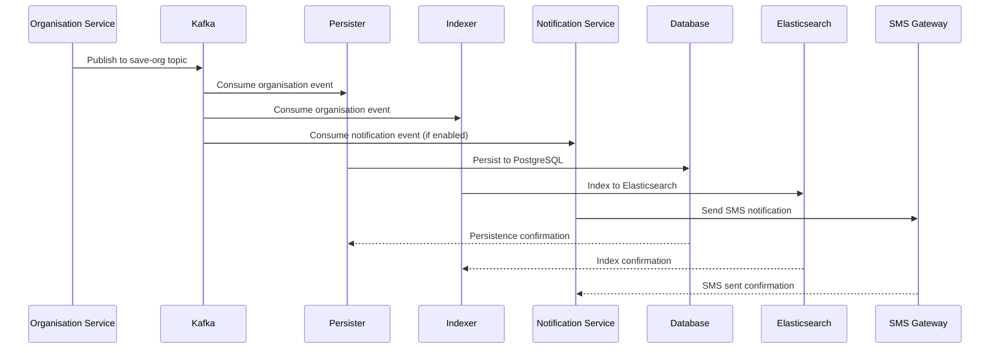

### Error Handling in Event Processing

#### Dead Letter Queue Strategy
- Failed messages are retried based on configuration
- After max retries, messages can be sent to dead letter topics
- Manual intervention required for dead letter queue processing

#### Event Ordering
- Organisation events maintain order using partitioning by organisation ID
- Ensures create events are processed before update events
- Critical for maintaining data consistency

### Monitoring and Observability

#### Kafka Metrics
- Producer/Consumer lag monitoring
- Topic partition health
- Message processing rates
- Error rates and retry counts

#### Event Tracing
- Each event includes correlation IDs for tracing
- Request Info provides audit trail across services
- Custom Kafka template supports distributed tracing

---

## Execution & Business Flows

### Key Business Flows

#### 1. Organisation Registration Flow (Without Workflow)

This is the primary business flow for registering a new organisation in the system.

**Step-by-Step Process**:

1. **Request Validation**
   - Validate RequestInfo and UserInfo presence
   - Validate organisation mandatory fields (tenantId, name)
   - Validate contact details (at least one required)
   - Validate identifiers and functions (at least one each required)
   - Validate address boundary codes and types

2. **MDMS Validation**
   - Fetch and validate tenant existence
   - Validate organisation types against MDMS
   - Validate function categories against MDMS
   - Validate function classes against MDMS
   - Validate tax identifier types against MDMS

3. **Boundary Validation**
   - Validate address boundary codes against boundary service
   - Ensure boundary types are valid for given tenant

4. **Data Enrichment**
   - Generate UUIDs for all entities
   - Generate formatted application number via IDGen
   - Generate formatted organisation number via IDGen
   - Generate formatted function application numbers via IDGen
   - Set audit details (created by, created time)
   - Set default active status

5. **Individual Service Integration**
   - Search for existing individual by mobile number
   - Create new individual if not exists
   - Update existing individual if found

6. **Data Encryption**
   - Clone organisation request for encryption
   - Encrypt contact details (name, mobile, email)
   - Maintain original data for response

7. **Event Publishing**
   - Publish encrypted organisation data to `save-org` Kafka topic
   - Trigger asynchronous persistence and indexing

8. **Notification**
   - Send SMS notification to organisation contact (if enabled)
   - Handle notification failures gracefully

**Success Response**: Organisation with generated IDs and audit details

#### 2. Organisation Update Flow (Without Workflow)

**Step-by-Step Process**:

1. **Request Validation**
   - Validate basic request structure
   - Validate organisation ID presence in request
   - Verify organisation exists in system

2. **Data Validation**
   - Perform same MDMS and boundary validations as create
   - Additional validation for existing organisation state

3. **Upsert Logic Implementation**
   - **Identifiers**: Add new, update existing (by ID)
   - **Documents**: Add new, update existing (by ID)
   - **Functions**: Add new functions, update existing
   - **Addresses**: Update existing addresses
   - **Contact Details**: Update contact information

4. **Data Enrichment**
   - Update audit details (last modified by, last modified time)
   - Generate application numbers for new functions
   - Generate UUIDs for new entities

5. **Individual Service Sync**
   - Update corresponding individual record
   - Sync contact information changes

6. **Encryption and Publishing**
   - Encrypt updated contact details
   - Publish to `update-org` Kafka topic

7. **Notification**
   - Send update notification to organisation contacts

#### 3. Organisation Search Flow

**Step-by-Step Process**:

1. **Search Criteria Validation**
   - Validate RequestInfo and search criteria
   - Validate tenant ID (mandatory unless mobile number provided)
   - Validate date ranges (createdFrom, createdTo)
   - Validate function validity date ranges

2. **Search Criteria Encryption**
   - Encrypt search criteria for contact mobile numbers
   - Encrypt other sensitive search parameters

3. **Multi-Stage Search Process**
   - **Stage 1**: Get organisation IDs from identifier search (if criteria present)
   - **Stage 2**: Get organisation IDs from boundary/address search (if criteria present)
   - **Stage 3**: Get organisation IDs from contact mobile search (if criteria present)
   - **Stage 4**: Intersect results from all searches

4. **Main Organisation Search**
   - Search organisations based on filtered IDs and other criteria
   - Apply pagination (limit, offset, sorting)

5. **Related Data Fetching**
   - Fetch addresses for found organisations
   - Fetch contact details for found organisations
   - Fetch documents for organisations and functions
   - Fetch jurisdictions for organisations
   - Fetch tax identifiers for organisations

6. **Data Assembly**
   - Construct complete organisation objects
   - Associate related entities with parent organisations
   - Associate function documents with respective functions

7. **Data Decryption**
   - Decrypt contact details for response
   - Apply field-level access control

8. **Response Preparation**
   - Count total matching records
   - Prepare paginated response
   - Include ResponseInfo with success status

#### 4. Document Management and Approval Processes

**Document Attachment Flow**:

1. **Document Upload**
   - Upload documents to file store service
   - Receive file store ID for reference

2. **Document Association**
   - Associate documents with organisation or specific functions
   - Store document metadata (type, UID, file store reference)

3. **Document Validation**
   - Validate document types against MDMS
   - Ensure required documents are present for organisation type

**Document Approval Process** (Future Enhancement):
- Currently documents are stored without separate approval
- Workflow integration planned for document verification
- Document status tracking to be implemented

#### 5. Organisation Verification and Approval Workflows

**Current State**:
- Organisation registration happens without workflow approval
- Organisation status is set to ACTIVE immediately upon creation
- Workflow endpoints exist but have minimal implementation

**Planned Workflow Integration**:

1. **Application Submission**
   - Organisation registration creates application in PENDING status
   - Application assigned to appropriate approver based on organisation type

2. **Document Review**
   - Approver reviews submitted documents
   - Request clarification or additional documents if needed

3. **Field Verification** (Optional)
   - For certain organisation types, field verification required
   - Verification officer assigned and notified

4. **Approval Decision**
   - Approver makes final decision (APPROVE/REJECT)
   - Comments and reason for decision recorded

5. **Organisation Activation**
   - Upon approval, organisation status changes to APPROVED
   - Organisation number generated and assigned
   - Organisation becomes eligible for work assignments

### Sequence Diagrams

#### Organisation Creation Sequence

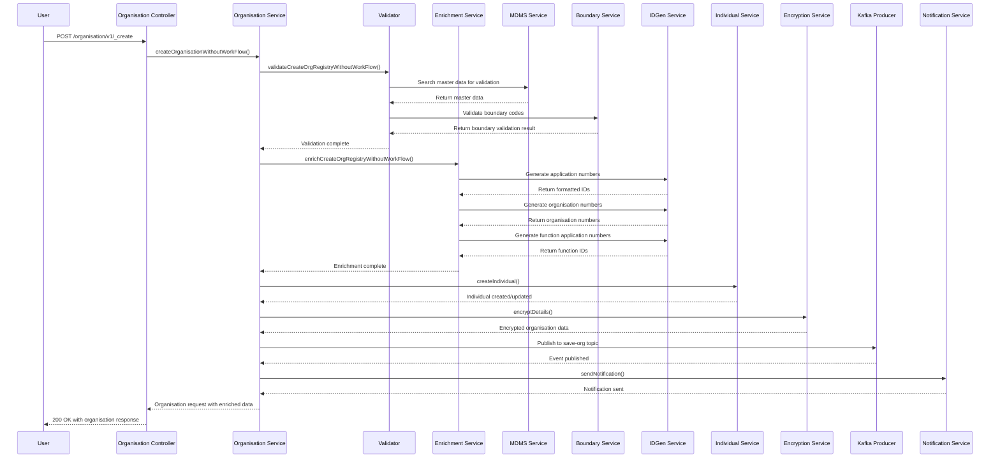

#### Organisation Search Sequence

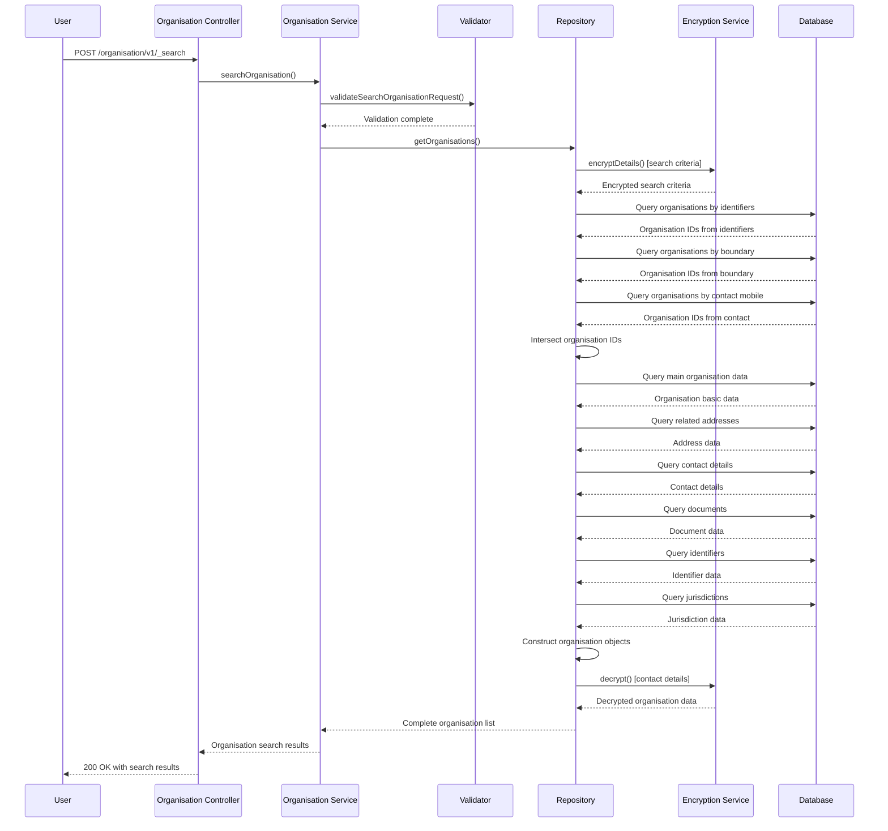

### Happy Path Scenarios

#### 1. Successful Organisation Registration
- All validations pass
- MDMS data exists for all references
- Boundary codes are valid
- Individual service responds successfully
- IDGen generates all required IDs
- Encryption service encrypts contact details
- Kafka event published successfully
- Notification sent successfully
- **Result**: Organisation created with ACTIVE status

#### 2. Successful Organisation Update
- Organisation exists in system
- All new data validates successfully
- Upsert operations complete without conflicts
- Individual service sync succeeds
- **Result**: Organisation updated with latest data

#### 3. Successful Organisation Search
- Search criteria valid
- Multiple search stages return relevant IDs
- Database queries execute successfully
- Data assembly completes
- Decryption succeeds
- **Result**: Paginated list of organisations returned

### Failure Scenarios

#### 1. Validation Failures
- **MDMS Validation Failure**: Organisation type not found in MDMS
  - **Response**: HTTP 400 with error code `INVALID_ORG_TYPE`
  - **Recovery**: Update MDMS configuration or use valid org type

- **Boundary Validation Failure**: Invalid boundary code
  - **Response**: HTTP 400 with error code `INVALID_BOUNDARY_CODE`
  - **Recovery**: Use valid boundary code from boundary service

- **Missing Mandatory Fields**: Required fields not provided
  - **Response**: HTTP 400 with specific field error codes
  - **Recovery**: Provide all mandatory fields

#### 2. External Service Failures
- **MDMS Service Down**: Cannot validate master data
  - **Response**: HTTP 500 with service unavailable error
  - **Recovery**: Retry after MDMS service restoration

- **IDGen Service Failure**: Cannot generate formatted IDs
  - **Response**: HTTP 500 with ID generation error
  - **Recovery**: Retry request or use alternative ID generation

- **Individual Service Failure**: Cannot create/update individual
  - **Response**: HTTP 500 with individual service error
  - **Recovery**: Retry or handle individual creation separately

#### 3. Data Integrity Issues
- **Duplicate Application Number**: Race condition in ID generation
  - **Response**: HTTP 500 with duplicate key error
  - **Recovery**: Retry with new application number

- **Organisation Not Found**: Update attempt on non-existent organisation
  - **Response**: HTTP 400 with `INVALID_ORG_ID` error
  - **Recovery**: Verify organisation ID or create new organisation

#### 4. Encryption/Decryption Failures
- **Encryption Service Down**: Cannot encrypt contact details
  - **Response**: HTTP 500 with encryption error
  - **Recovery**: Store data temporarily without encryption (if configured)

#### 5. Kafka Publishing Failures
- **Kafka Broker Down**: Cannot publish events
  - **Impact**: Data not persisted to database asynchronously
  - **Recovery**: Kafka retry mechanism or manual data recovery

### Error Recovery Mechanisms

1. **Retry Logic**: Automatic retries for transient failures
2. **Circuit Breaker**: Prevent cascade failures from external services
3. **Graceful Degradation**: Core functionality works even if some services fail
4. **Transaction Management**: Rollback partial operations on failures
5. **Dead Letter Queue**: Handle failed Kafka messages
6. **Health Check Endpoints**: Monitor service health and dependencies

---

## Security Considerations

### Authentication Flow

The Organisation Service implements a comprehensive authentication and authorization mechanism integrated with the DIGIT platform's security framework.

#### 1. Request Authentication
- **Bearer Token Validation**: All API requests require valid JWT tokens in Authorization header
- **Token Structure**: Standard JWT with user information, roles, and tenant access
- **Token Validation**: Performed by API Gateway and validated again at service level
- **Session Management**: Stateless authentication using JWT tokens

#### 2. User Information Processing
```java
// RequestInfo contains authenticated user details
RequestInfo requestInfo = request.getRequestInfo();
UserInfo userInfo = requestInfo.getUserInfo();
String userId = userInfo.getUuid();      // Authenticated user ID
String tenantId = userInfo.getTenantId(); // User's primary tenant
List<Role> roles = userInfo.getPrimaryrole(); // User roles
```

#### 3. Authentication Validation
```java
private void validateRequestInfo(RequestInfo requestInfo) {
    if (requestInfo == null) {
        throw new CustomException("REQUEST_INFO", "Request info is mandatory");
    }
    if (requestInfo.getUserInfo() == null) {
        throw new CustomException("USERINFO", "UserInfo is mandatory");
    }
    if (StringUtils.isBlank(requestInfo.getUserInfo().getUuid())) {
        throw new CustomException("USERINFO_UUID", "UUID is mandatory");
    }
}
```

### Authorization Checks

#### 1. Tenant-Based Access Control
- **Tenant Isolation**: Users can only access organisations within their authorized tenants
- **Multi-Tenant Support**: Users may have access to multiple tenants based on roles
- **Tenant Validation**: All operations validate tenant access permissions

```java
// Tenant validation in search criteria
if (searchCriteria.getContactMobileNumber() == null && 
    StringUtils.isBlank(searchCriteria.getTenantId())) {
    throw new CustomException("TENANT_ID", "Tenant ID is mandatory");
}
```

#### 2. Role-Based Access Control (RBAC)
- **ORG_ADMIN Role**: Full access to organisation management within tenant
- **CITIZEN Role**: Limited access based on organisation association
- **System Roles**: Administrative access across tenants (for system admins)

#### 3. Data Access Controls
- **Read Access**: Users can read organisations based on tenant and role permissions
- **Write Access**: Create/update operations require appropriate roles
- **Delete Access**: Soft delete operations with proper authorization checks

#### 4. Function-Level Authorization
```java
// Example authorization check for organisation creation
private void validateUserPermissions(RequestInfo requestInfo, String operation) {
    UserInfo userInfo = requestInfo.getUserInfo();
    List<Role> roles = userInfo.getPrimaryrole();
    
    boolean hasPermission = roles.stream()
        .anyMatch(role -> isAuthorizedRole(role.getCode(), operation));
    
    if (!hasPermission) {
        throw new CustomException("UNAUTHORIZED", 
            "User not authorized for operation: " + operation);
    }
}
```

### Sensitive Data Handling

#### 1. Data Classification
**Highly Sensitive Data** (Encrypted):
- Contact person names
- Mobile numbers
- Email addresses
- Tax identifier values (in future enhancement)

**Moderately Sensitive Data** (Access Controlled):
- Organisation addresses
- Document references
- Business function details

**Public Data** (Minimal Access Control):
- Organisation names (searchable)
- Public contact information
- Service categories

#### 2. Encryption Implementation

**Field-Level Encryption**:
```java
// Encryption service implementation
public class EncryptionService {
    public OrgRequest encryptDetails(OrgRequest orgRequest, String key) {
        List<Organisation> organisationList = orgRequest.getOrganisations();
        for(Organisation organisation: organisationList) {
            if (!CollectionUtils.isEmpty(organisation.getContactDetails())) {
                List<ContactDetails> encryptedContactDetails = 
                    encryptionDecryptionUtil.encryptObject(
                        organisation.getContactDetails(), 
                        config.getStateLevelTenantId(), 
                        key, 
                        ContactDetails.class);
                organisation.setContactDetails(encryptedContactDetails);
            }
        }
        return orgRequest;
    }
}
```

**Encryption Key Management**:
- **Primary Key**: `ORGANISATION_ENCRYPT_KEY = "Organisation"`
- **Key Rotation**: Managed by encryption service
- **Tenant-Specific Keys**: Different keys per state-level tenant
- **Key Storage**: Secure key management system integration

**Search Data Encryption**:
```java
// Search criteria encryption for secure queries
public OrgSearchRequest encryptDetails(OrgSearchRequest orgSearchRequest, String key) {
    OrgSearchCriteria searchCriteria = orgSearchRequest.getSearchCriteria();
    OrgSearchCriteria encryptedSearchCriteria = encryptionDecryptionUtil
        .encryptObject(searchCriteria, config.getStateLevelTenantId(), 
                      key, OrgSearchCriteria.class);
    orgSearchRequest.setSearchCriteria(encryptedSearchCriteria);
    return orgSearchRequest;
}
```

#### 3. Data Decryption for Response
```java
public List<Organisation> decrypt(List<Organisation> organisationList, 
                                 String key, OrgSearchRequest orgSearchRequest) {
    for(Organisation organisation: organisationList) {
        List<ContactDetails> contactDetailsList = organisation.getContactDetails();
        List<ContactDetails> decryptContactDetails = encryptionDecryptionUtil
            .decryptObject(contactDetailsList, key, ContactDetails.class, 
                          orgSearchRequest.getRequestInfo());
        organisation.setContactDetails(decryptContactDetails);
    }
    return organisationList;
}
```

#### 4. Database Storage Security
```sql
-- Contact details stored encrypted
CREATE TABLE eg_org_contact_detail (
  id                       VARCHAR(256) PRIMARY KEY,
  tenant_id                VARCHAR(64),
  org_id                   VARCHAR(256) NOT NULL,
  contact_name             VARCHAR(128), -- Encrypted
  contact_mobile_number    VARCHAR(64),  -- Encrypted
  contact_email            VARCHAR(128)  -- Encrypted
);
```

### Input Validation and Sanitization

#### 1. Request Validation
```java
@Valid @RequestBody OrgRequest body  // Bean validation
```

#### 2. Field-Level Validation
```java
@NotNull
@Size(min = 2, max = 64)
private String tenantId;

@NotNull
@Size(min = 2, max = 128)
private String name;

@Valid
@Size(min = 1)
private List<ContactDetails> contactDetails;
```

#### 3. Input Sanitization
```java
// Pattern validation constants
public static final String PATTERN_NAME = "^[^\\\\$\\\"<>?\\\\\\\\~`!@#$%^()+={}\\\\[\\\\]*,:;""'']*$";
public static final String PATTERN_MOBILE = "(^$|[0-9]{10})";
public static final String PATTERN_PINCODE = "^[1-9][0-9]{5}$";
```

#### 4. SQL Injection Prevention
- **Prepared Statements**: All database queries use parameterized queries
- **JdbcTemplate**: Spring's JdbcTemplate prevents SQL injection
- **Query Builder Pattern**: Dynamic query construction with safe parameter binding

```java
// Safe parameterized query example
public List<Organisation> getOrganisations(OrgSearchRequest orgSearchRequest) {
    List<Object> preparedStmtList = new ArrayList<>();
    String query = organisationFunctionQueryBuilder
        .getOrganisationSearchQuery(orgSearchRequest, orgIds, preparedStmtList, false);
    
    // Safe execution with prepared statements
    return jdbcTemplate.query(query, organisationFunctionRowMapper, 
                              preparedStmtList.toArray());
}
```

### Audit Trail and Logging

#### 1. Audit Details Tracking
```java
public class Organisation {
    private AuditDetails auditDetails;  // Tracks all changes
}

public class AuditDetails {
    private String createdBy;           // User who created
    private String lastModifiedBy;      // User who last modified
    private Long createdTime;           // Creation timestamp
    private Long lastModifiedTime;      // Last modification timestamp
}
```

#### 2. Comprehensive Logging
```java
@Slf4j
public class OrganisationService {
    public OrgRequest createOrganisationWithoutWorkFlow(OrgRequest orgRequest) {
        log.info("OrganisationService::createOrganisationWithoutWorkFlow");
        // ... implementation
        log.info("Organisation created with ID: " + organisation.getId());
    }
}
```

#### 3. Security Event Logging
- **Authentication Failures**: Logged with user context
- **Authorization Violations**: Detailed logging of access attempts
- **Data Access Patterns**: Monitor for unusual access patterns
- **Encryption/Decryption Events**: Track sensitive data operations

#### 4. Correlation ID Tracking
```java
// RequestInfo provides correlation tracking
String correlationId = requestInfo.getCorrelationId();
String msgId = requestInfo.getMsgId();
// Used for tracing requests across services
```

### Data Privacy Compliance

#### 1. Right to Erasure (GDPR Compliance)
- **Soft Delete Implementation**: `isActive` flag for logical deletion
- **Data Purging**: Scheduled jobs for permanent deletion after retention period
- **User Consent Management**: Integration with consent management framework

#### 2. Data Minimization
- **Need-to-Know Basis**: Users only access data required for their role
- **Field-Level Access Control**: Sensitive fields hidden based on permissions
- **Search Result Filtering**: Results filtered based on user authorization

#### 3. Data Retention Policies
- **Active Data**: Retained as long as organisation is active
- **Archived Data**: Moved to archive after inactivity period
- **Audit Logs**: Retained for compliance period (typically 7 years)

#### 4. Cross-Border Data Transfer
- **Tenant-Based Isolation**: Data remains within configured geographic boundaries
- **Encryption in Transit**: All inter-service communication encrypted
- **Data Residency**: Configurable data storage locations

### Security Monitoring and Alerting

#### 1. Real-Time Security Monitoring
- **Failed Authentication Attempts**: Alert on repeated failures
- **Unusual Data Access**: Monitor for bulk data downloads
- **Service Anomalies**: Alert on unexpected service behavior
- **Encryption Failures**: Immediate alerts for encryption service issues

#### 2. Security Metrics
- **Authentication Success Rate**: Monitor authentication patterns
- **API Response Times**: Detect potential security-related delays
- **Error Rates**: Monitor for security-related errors
- **Data Access Patterns**: Track normal vs. unusual access patterns

#### 3. Incident Response
- **Security Incident Logging**: Comprehensive incident documentation
- **Automated Response**: Automatic blocking of suspicious activities
- **Manual Investigation**: Tools for security team investigation
- **Recovery Procedures**: Data recovery and system restoration protocols

---

## API Flow Diagrams

### Organisation Create API Flow

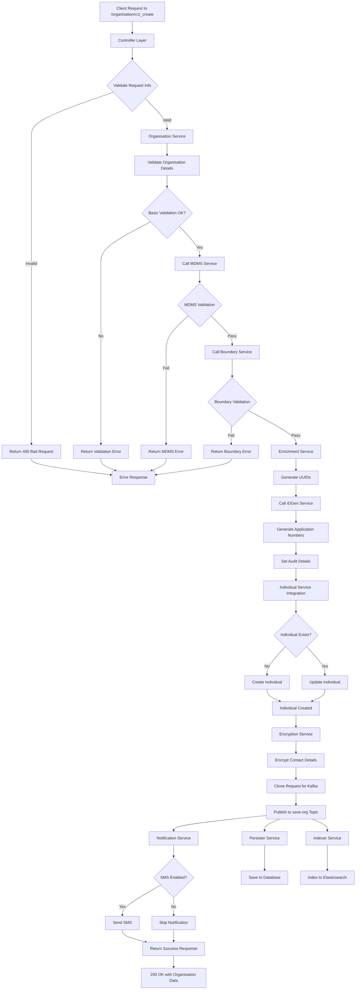

### Organisation Search API Flow

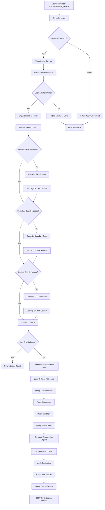

### Organisation Update API Flow

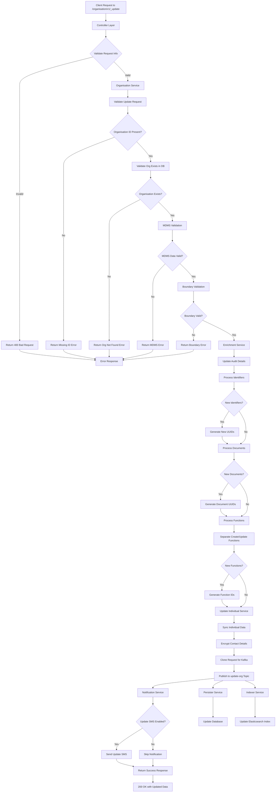

### Data Encryption Flow

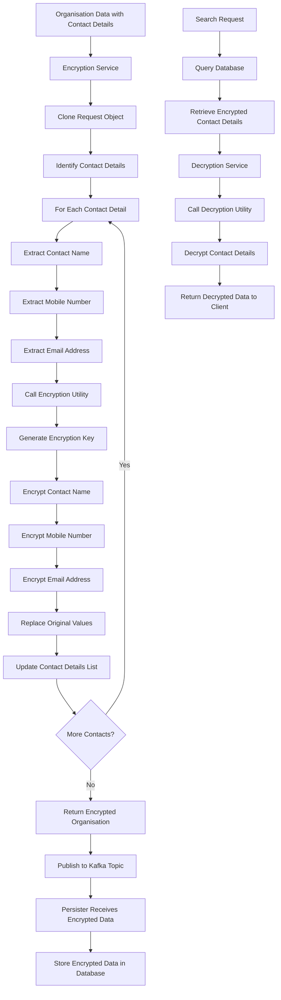

### Error Handling Flow

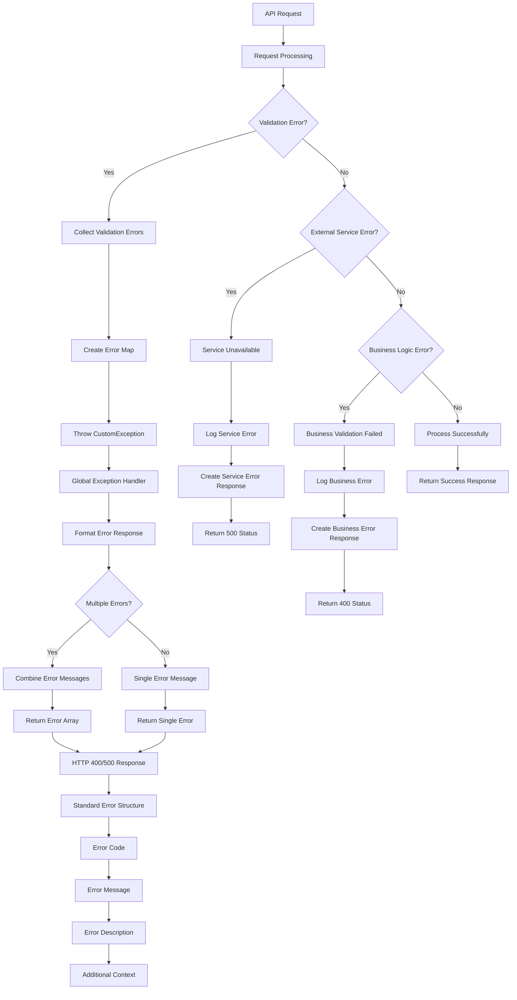

### Kafka Event Processing Flow

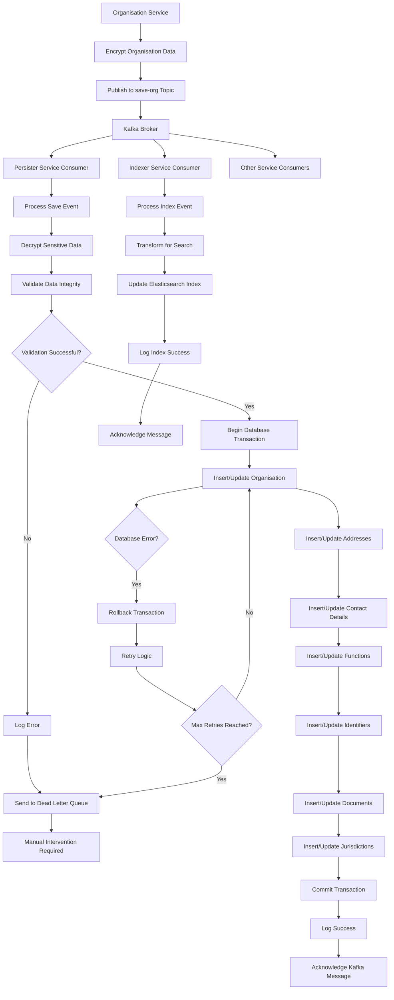

This comprehensive documentation provides a complete technical overview of the Organisation Service in the DIGIT Works codebase, covering all aspects from architecture to implementation details, security considerations, and operational flows.