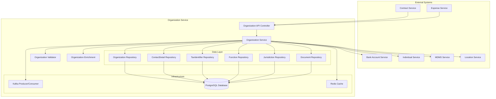
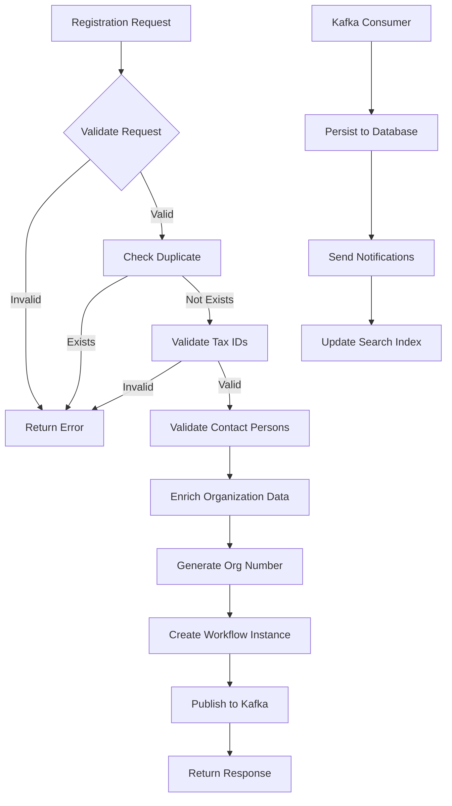
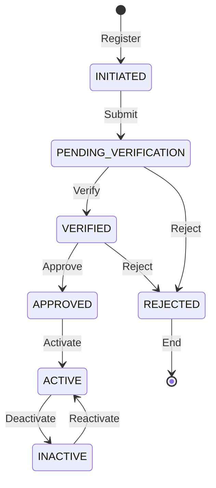
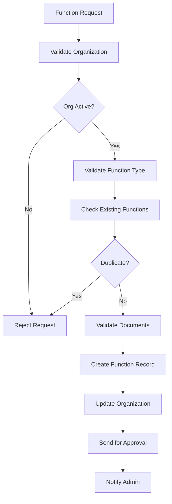

# Organization Service - Technical Documentation

## Table of Contents
1. [System & Architecture Overview](#system--architecture-overview)
2. [API Documentation](#api-documentation)
3. [Domain Models & Data Structures](#domain-models--data-structures)
4. [Database Design](#database-design)
5. [Configuration & Application Properties](#configuration--application-properties)
6. [Service Dependencies](#service-dependencies)
7. [External Dependencies](#external-dependencies)
8. [Events & Messaging](#events--messaging)
9. [Execution & Business Flows](#execution--business-flows)
10. [Security Considerations](#security-considerations)

---

## System & Architecture Overview

### Service Purpose
The Organization Service is a generic registry for all types of organizations including vendors, contractors, community-based organizations (CBOs), and departments. It manages organizational profiles, contact information, tax identifiers, functional classifications, and operational jurisdictions.

### Key Features
- **Multi-type Organization Support**: Vendors, contractors, CBOs, government departments
- **Contact Person Management**: Multiple contact persons per organization
- **Tax Identifier Support**: GST, PAN, and other tax IDs
- **Functional Classification**: Organization type, function, and class categorization
- **Jurisdiction Management**: Operational boundary mapping
- **Document Management**: Organization documents and certificates
- **Financial Information**: Links to bank accounts

### System Architecture



---

## API Documentation

### Base Configuration
- **Context Path**: `/org-services`
- **Port**: 8094
- **API Version**: v1

### Endpoints

#### 1. Create Organization
**POST** `/org-services/organisation/v1/_create`

Creates a new organization record.

**Request Body:**
```json
{
  "RequestInfo": {
    "apiId": "org-services",
    "ver": "1.0",
    "ts": 1675234567890,
    "action": "_create",
    "did": "",
    "key": "",
    "msgId": "20230201-123456",
    "authToken": "auth-token",
    "userInfo": {
      "id": 12345,
      "userName": "admin1",
      "roles": [{"code": "ORG_ADMIN", "name": "Organization Admin"}]
    }
  },
  "organisations": [{
    "tenantId": "pb.amritsar",
    "name": "ABC Construction Pvt Ltd",
    "applicationNumber": "ORG-APP-2024-001",
    "orgNumber": "ORG/2024/00001",
    "dateOfIncorporation": 1136073600000,
    "organisationStatus": "ACTIVE",
    "isActive": true,
    "type": "VENDOR",
    "applicationStatus": "APPROVED",
    "externalRefNumber": "EXT-REF-001",
    "orgAddress": [{
      "tenantId": "pb.amritsar",
      "doorNo": "456",
      "plotNo": "A-123",
      "landmark": "Near Main Market",
      "city": "Amritsar",
      "pincode": "143001",
      "district": "Amritsar",
      "region": "Punjab",
      "state": "Punjab",
      "country": "IN",
      "boundaryType": "Ward",
      "boundaryCode": "WARD01"
    }],
    "contactDetails": [{
      "contactName": "John Manager",
      "contactMobileNumber": "9876543210",
      "contactEmail": "john@abcconstruction.com",
      "individualId": "individual-uuid-123",
      "type": "PRIMARY"
    }],
    "identifiers": [{
      "type": "GST",
      "value": "29ABCDE1234F1Z5",
      "isActive": true,
      "additionalDetails": {
        "registrationDate": "2020-01-01"
      }
    },
    {
      "type": "PAN",
      "value": "ABCDE1234F",
      "isActive": true
    }],
    "functions": [{
      "type": "CONTRACTOR",
      "category": "CIVIL_WORKS",
      "class": "CLASS_A",
      "validFrom": 1675234567890,
      "validTo": 1706770567890,
      "isActive": true,
      "applicationNumber": "FUNC-APP-001",
      "wfStatus": "APPROVED"
    }],
    "jurisdiction": [{
      "id": "juris-uuid-123",
      "orgId": "org-uuid-123",
      "code": "pb.amritsar",
      "boundaryType": "CITY",
      "tenantId": "pb.amritsar",
      "additionalDetails": {
        "districtCode": "AMRITSAR",
        "regionCode": "PUNJAB"
      }
    }],
    "documents": [{
      "documentType": "REGISTRATION",
      "fileStoreId": "file-store-uuid-123",
      "documentUid": "doc-uuid-123",
      "isActive": true,
      "additionalDetails": {
        "fileName": "registration.pdf",
        "uploadDate": 1675234567890
      }
    }],
    "additionalDetails": {
      "registrationNumber": "REG/2020/001",
      "bankAccountId": "bank-account-uuid-123",
      "vendorClass": "A",
      "experienceYears": 15
    }
  }],
  "workflow": {
    "action": "APPROVE",
    "comment": "Organization approved",
    "assignees": ["user-uuid-456"]
  }
}
```

#### 2. Update Organization
**POST** `/org-services/organisation/v1/_update`

Updates an existing organization.

#### 3. Search Organizations
**POST** `/org-services/organisation/v1/_search`

Searches organizations based on criteria.

**Query Parameters:**
- `tenantId` (required): Tenant identifier
- `ids`: List of organization UUIDs
- `name`: Organization name
- `orgNumber`: Organization number
- `type`: Organization type (VENDOR/CONTRACTOR/CBO/DEPARTMENT)
- `functionType`: Function type
- `functionCategory`: Function category
- `isActive`: Active status
- `createdFrom`: Created date from
- `createdTo`: Created date to
- `limit`: Number of records (default: 10, max: 100)
- `offset`: Page offset (default: 0)

#### 4. Count Organizations
**POST** `/org-services/organisation/v1/_count`

Returns count of organizations matching criteria.

---

## Domain Models & Data Structures

### Core Models

#### Organisation Model
```java
public class Organisation {
    private String id;                          // UUID
    private String tenantId;                    // Tenant identifier
    private String name;                        // Organization name
    private String applicationNumber;           // Application number
    private String orgNumber;                   // Organization number
    private Long dateOfIncorporation;           // Incorporation date
    private String organisationStatus;          // ACTIVE/INACTIVE/INWORKFLOW
    private Boolean isActive;                   // Active flag
    private String type;                        // VENDOR/CONTRACTOR/CBO/DEPARTMENT
    private String applicationStatus;           // Workflow status
    private String externalRefNumber;           // External reference
    private List<Address> orgAddress;           // Organization addresses
    private List<ContactDetail> contactDetails; // Contact persons
    private List<TaxIdentifier> identifiers;    // Tax identifiers
    private List<Function> functions;           // Functional areas
    private List<Jurisdiction> jurisdiction;    // Operating jurisdictions
    private List<Document> documents;           // Organization documents
    private AuditDetails auditDetails;          // Audit information
    private Object additionalDetails;           // Additional data
}
```

#### ContactDetail Model
```java
public class ContactDetail {
    private String id;                          // UUID
    private String orgId;                       // Organization ID
    private String contactName;                 // Contact person name
    private String contactMobileNumber;         // Mobile number
    private String contactEmail;                // Email address
    private String individualId;                // Reference to Individual service
    private String type;                        // PRIMARY/SECONDARY/ADMIN
    private List<String> roles;                 // Contact roles
    private Boolean isActive;                   // Active flag
    private AuditDetails auditDetails;          // Audit information
}
```

#### TaxIdentifier Model
```java
public class TaxIdentifier {
    private String id;                          // UUID
    private String orgId;                       // Organization ID
    private String type;                        // GST/PAN/TIN/CIN
    private String value;                       // Identifier value
    private Boolean isActive;                   // Active flag
    private AuditDetails auditDetails;          // Audit information
    private Object additionalDetails;           // Additional data
}
```

#### Function Model
```java
public class Function {
    private String id;                          // UUID
    private String orgId;                       // Organization ID
    private String type;                        // WORKS/GOODS/SERVICES
    private String category;                    // Sub-category
    private String class;                       // Classification
    private Long validFrom;                     // Validity start date
    private Long validTo;                       // Validity end date
    private Boolean isActive;                   // Active flag
    private String applicationNumber;           // Application for this function
    private String wfStatus;                    // Workflow status
    private List<Document> documents;           // Function-specific documents
    private AuditDetails auditDetails;          // Audit information
    private Object additionalDetails;           // Additional data
}
```

#### Jurisdiction Model
```java
public class Jurisdiction {
    private String id;                          // UUID
    private String orgId;                       // Organization ID
    private String code;                        // Jurisdiction code
    private String boundaryType;                // CITY/WARD/ZONE/BLOCK
    private String tenantId;                    // Tenant identifier
    private AuditDetails auditDetails;          // Audit information
    private Object additionalDetails;           // Additional data
}
```

---

## Database Design

### Database Schema

#### eg_org_organisation Table
```sql
CREATE TABLE eg_org_organisation (
    id character varying(64) PRIMARY KEY,
    tenant_id character varying(64) NOT NULL,
    name character varying(256) NOT NULL,
    application_number character varying(128),
    org_number character varying(128) UNIQUE,
    date_of_incorporation bigint,
    organisation_status character varying(64),
    is_active boolean DEFAULT true,
    type character varying(64),
    application_status character varying(64),
    external_ref_number character varying(128),
    created_by character varying(64) NOT NULL,
    last_modified_by character varying(64),
    created_time bigint NOT NULL,
    last_modified_time bigint,
    additional_details JSONB
);

CREATE INDEX idx_org_tenant_id ON eg_org_organisation(tenant_id);
CREATE INDEX idx_org_name ON eg_org_organisation(name);
CREATE INDEX idx_org_number ON eg_org_organisation(org_number);
CREATE INDEX idx_org_type ON eg_org_organisation(type);
CREATE INDEX idx_org_status ON eg_org_organisation(organisation_status);
CREATE INDEX idx_org_created_time ON eg_org_organisation(created_time);
```

#### eg_org_address Table
```sql
CREATE TABLE eg_org_address (
    id character varying(64) PRIMARY KEY,
    org_id character varying(64) NOT NULL,
    tenant_id character varying(64) NOT NULL,
    door_no character varying(64),
    plot_no character varying(64),
    landmark character varying(256),
    city character varying(100),
    pincode character varying(10),
    district character varying(100),
    region character varying(100),
    state character varying(100),
    country character varying(10),
    boundary_type character varying(64),
    boundary_code character varying(64),
    created_by character varying(64) NOT NULL,
    last_modified_by character varying(64),
    created_time bigint NOT NULL,
    last_modified_time bigint,
    additional_details JSONB,
    CONSTRAINT fk_org_address_org FOREIGN KEY (org_id) REFERENCES eg_org_organisation(id)
);

CREATE INDEX idx_org_address_org_id ON eg_org_address(org_id);
CREATE INDEX idx_org_address_city ON eg_org_address(city);
```

#### eg_org_contact_detail Table
```sql
CREATE TABLE eg_org_contact_detail (
    id character varying(64) PRIMARY KEY,
    org_id character varying(64) NOT NULL,
    contact_name character varying(256),
    contact_mobile_number character varying(20),
    contact_email character varying(128),
    individual_id character varying(64),
    type character varying(64),
    roles text[],
    is_active boolean DEFAULT true,
    created_by character varying(64) NOT NULL,
    last_modified_by character varying(64),
    created_time bigint NOT NULL,
    last_modified_time bigint,
    CONSTRAINT fk_contact_org FOREIGN KEY (org_id) REFERENCES eg_org_organisation(id)
);

CREATE INDEX idx_contact_org_id ON eg_org_contact_detail(org_id);
CREATE INDEX idx_contact_mobile ON eg_org_contact_detail(contact_mobile_number);
CREATE INDEX idx_contact_individual_id ON eg_org_contact_detail(individual_id);
```

#### eg_org_tax_identifier Table
```sql
CREATE TABLE eg_org_tax_identifier (
    id character varying(64) PRIMARY KEY,
    org_id character varying(64) NOT NULL,
    type character varying(64) NOT NULL,
    value character varying(128) NOT NULL,
    is_active boolean DEFAULT true,
    created_by character varying(64) NOT NULL,
    last_modified_by character varying(64),
    created_time bigint NOT NULL,
    last_modified_time bigint,
    additional_details JSONB,
    CONSTRAINT fk_tax_org FOREIGN KEY (org_id) REFERENCES eg_org_organisation(id),
    CONSTRAINT uk_tax_type_value UNIQUE (type, value)
);

CREATE INDEX idx_tax_org_id ON eg_org_tax_identifier(org_id);
CREATE INDEX idx_tax_type ON eg_org_tax_identifier(type);
CREATE INDEX idx_tax_value ON eg_org_tax_identifier(value);
```

#### eg_org_function Table
```sql
CREATE TABLE eg_org_function (
    id character varying(64) PRIMARY KEY,
    org_id character varying(64) NOT NULL,
    type character varying(64),
    category character varying(128),
    class character varying(64),
    valid_from bigint,
    valid_to bigint,
    is_active boolean DEFAULT true,
    application_number character varying(128),
    wf_status character varying(64),
    created_by character varying(64) NOT NULL,
    last_modified_by character varying(64),
    created_time bigint NOT NULL,
    last_modified_time bigint,
    additional_details JSONB,
    CONSTRAINT fk_function_org FOREIGN KEY (org_id) REFERENCES eg_org_organisation(id)
);

CREATE INDEX idx_function_org_id ON eg_org_function(org_id);
CREATE INDEX idx_function_type ON eg_org_function(type);
CREATE INDEX idx_function_category ON eg_org_function(category);
CREATE INDEX idx_function_valid_from ON eg_org_function(valid_from);
CREATE INDEX idx_function_valid_to ON eg_org_function(valid_to);
```

#### eg_org_jurisdiction Table
```sql
CREATE TABLE eg_org_jurisdiction (
    id character varying(64) PRIMARY KEY,
    org_id character varying(64) NOT NULL,
    code character varying(64) NOT NULL,
    boundary_type character varying(64),
    tenant_id character varying(64) NOT NULL,
    created_by character varying(64) NOT NULL,
    last_modified_by character varying(64),
    created_time bigint NOT NULL,
    last_modified_time bigint,
    additional_details JSONB,
    CONSTRAINT fk_jurisdiction_org FOREIGN KEY (org_id) REFERENCES eg_org_organisation(id)
);

CREATE INDEX idx_jurisdiction_org_id ON eg_org_jurisdiction(org_id);
CREATE INDEX idx_jurisdiction_code ON eg_org_jurisdiction(code);
CREATE INDEX idx_jurisdiction_boundary_type ON eg_org_jurisdiction(boundary_type);
```

#### eg_org_document Table
```sql
CREATE TABLE eg_org_document (
    id character varying(64) PRIMARY KEY,
    org_id character varying(64),
    function_id character varying(64),
    document_type character varying(64),
    filestore_id character varying(128),
    document_uid character varying(128),
    is_active boolean DEFAULT true,
    created_by character varying(64) NOT NULL,
    last_modified_by character varying(64),
    created_time bigint NOT NULL,
    last_modified_time bigint,
    additional_details JSONB,
    CONSTRAINT fk_document_org FOREIGN KEY (org_id) REFERENCES eg_org_organisation(id),
    CONSTRAINT fk_document_function FOREIGN KEY (function_id) REFERENCES eg_org_function(id)
);

CREATE INDEX idx_document_org_id ON eg_org_document(org_id);
CREATE INDEX idx_document_function_id ON eg_org_document(function_id);
CREATE INDEX idx_document_type ON eg_org_document(document_type);
```

---

## Configuration & Application Properties

### Server Configuration
```properties
server.contextPath=/org-services
server.servlet.contextPath=/org-services
server.port=8094
app.timezone=UTC

# Database Configuration
spring.datasource.driver-class-name=org.postgresql.Driver
spring.datasource.url=jdbc:postgresql://localhost:5432/digit-works
spring.datasource.username=postgres
spring.datasource.password=postgres

# Flyway Configuration
spring.flyway.table=organisation_schema
spring.flyway.baseline-on-migrate=true
spring.flyway.enabled=true

# Kafka Configuration
kafka.config.bootstrap_server_config=localhost:9092
spring.kafka.consumer.group-id=org-services
spring.kafka.producer.key-serializer=org.apache.kafka.common.serialization.StringSerializer
spring.kafka.producer.value-serializer=org.springframework.kafka.support.serializer.JsonSerializer

# Kafka Topics
org.kafka.create.topic=save-organisation
org.kafka.update.topic=update-organisation
kafka.topics.notification.sms=egov.core.notification.sms

# Service Configuration
org.default.offset=0
org.default.limit=10
org.search.max.limit=100

# ID Generation
egov.idgen.host=https://works-dev.digit.org
egov.idgen.path=/egov-idgen/id/_generate
egov.idgen.org.number.name=org.number
egov.idgen.org.application.number.name=org.application.number
```

---

## Service Dependencies

### Internal DIGIT Services

1. **Individual Service** (`individual.service.host`)
   - **Purpose**: Link contact persons to individuals
   - **APIs Used**: `/individual/v1/_search`
   - **Usage**: Validate and fetch contact person details

2. **Bank Account Service** (`bankaccount.service.host`)
   - **Purpose**: Manage organization bank accounts
   - **APIs Used**: `/bankaccount/v1/_search`
   - **Usage**: Link organization to financial accounts

3. **MDMS Service** (`egov.mdms.host`)
   - **Purpose**: Master data validation
   - **APIs Used**: `/egov-mdms-service/v1/_search`
   - **Usage**: Validate organization types, functions, tax types

4. **Location Service** (`egov.location.host`)
   - **Purpose**: Boundary and jurisdiction validation
   - **APIs Used**: `/egov-location/location/v11/boundarys/_search`
   - **Usage**: Validate operational jurisdictions

5. **ID Generation Service** (`egov.idgen.host`)
   - **Purpose**: Generate unique identifiers
   - **APIs Used**: `/egov-idgen/id/_generate`
   - **Usage**: Auto-generate organization numbers

6. **Workflow Service** (`egov.workflow.host`)
   - **Purpose**: Manage organization approvals
   - **APIs Used**: `/egov-workflow-v2/egov-wf/process/_transition`
   - **Usage**: Handle organization registration workflow

7. **File Store Service** (`egov.filestore.host`)
   - **Purpose**: Document storage
   - **APIs Used**: `/filestore/v1/files/url`
   - **Usage**: Store organization documents and certificates

---

## External Dependencies

### Infrastructure Dependencies

1. **PostgreSQL Database**
   - **Version**: 12+
   - **Purpose**: Primary data storage
   - **Connection Pool**: HikariCP
   - **Configuration**:
     ```properties
     spring.datasource.hikari.maximum-pool-size=10
     spring.datasource.hikari.connection-timeout=30000
     ```

2. **Apache Kafka**
   - **Version**: 2.8+
   - **Purpose**: Event streaming and async processing
   - **Topics Required**:
     - save-organisation
     - update-organisation
     - notification topics
   - **Configuration**:
     ```properties
     spring.kafka.consumer.properties.session.timeout.ms=30000
     spring.kafka.producer.properties.max.request.size=5242880
     ```

3. **Redis Cache**
   - **Version**: 6.0+
   - **Purpose**: Performance caching
   - **Configuration**:
     ```properties
     spring.redis.host=localhost
     spring.redis.port=6379
     spring.cache.redis.time-to-live=3600
     ```

4. **Elasticsearch** (Optional)
   - **Version**: 7.x
   - **Purpose**: Advanced search and analytics
   - **Configuration**:
     ```properties
     elasticsearch.host=localhost
     elasticsearch.port=9200
     elasticsearch.index.name=organisations
     ```

### External Service Dependencies

1. **SMS Gateway**
   - **Purpose**: Send notifications
   - **Integration**: Via Notification Service
   - **Events**: Organization approval/rejection

2. **Email Service** (Optional)
   - **Purpose**: Email notifications
   - **Provider**: SMTP/SendGrid/AWS SES
   - **Usage**: Organization registration confirmation

3. **Document Verification Services**
   - **Purpose**: Verify tax identifiers
   - **APIs**: GST verification, PAN verification
   - **Integration**: REST API calls

---

## Events & Messaging

### Kafka Topics

#### Produced Events

| Topic | Purpose | Event Schema |
|-------|---------|--------------|
| `save-organisation` | Create organization | OrganisationRequest |
| `update-organisation` | Update organization | OrganisationRequest |
| `org-notification` | Organization notifications | NotificationRequest |

#### Consumed Events

| Topic | Purpose | Handler |
|-------|---------|---------|
| `contract-created` | Link contracts to org | ContractEventHandler |
| `payment-processed` | Update org payment status | PaymentEventHandler |

### Event Schema

```json
{
  "RequestInfo": {
    "apiId": "org-services",
    "ver": "1.0",
    "ts": 1675234567890,
    "action": "create",
    "userInfo": {...}
  },
  "organisations": [{
    "id": "org-uuid",
    "tenantId": "pb.amritsar",
    "name": "ABC Construction",
    "type": "VENDOR",
    "identifiers": [...],
    "functions": [...],
    "contactDetails": [...],
    "auditDetails": {...}
  }]
}
```

---

## Execution & Business Flows

### 1. Organization Registration Flow



### 2. Organization Approval Workflow



### 3. Function Registration Flow



---

## Security Considerations

### Authentication & Authorization
1. **JWT Token Validation**: All APIs require valid JWT tokens
2. **Role-Based Access Control**:
   - ORG_ADMIN: Full organization management
   - ORG_STAFF: Update organization details
   - ORG_VIEWER: Read-only access

### Data Security
1. **Sensitive Data Protection**:
   - Tax identifiers encrypted at rest
   - Contact details masked in logs
   - Bank account references secured

2. **Input Validation**:
   - Tax identifier format validation
   - Email and phone validation
   - Document type restrictions

3. **SQL Injection Prevention**:
   - Parameterized queries
   - Input sanitization
   - Prepared statements

### Compliance
1. **Tax Compliance**:
   - GST number verification
   - PAN validation
   - TIN/CIN checks

2. **Data Privacy**:
   - GDPR compliance for EU organizations
   - PII data protection
   - Consent management

3. **Audit Trail**:
   - Complete operation history
   - Change tracking
   - Access logs