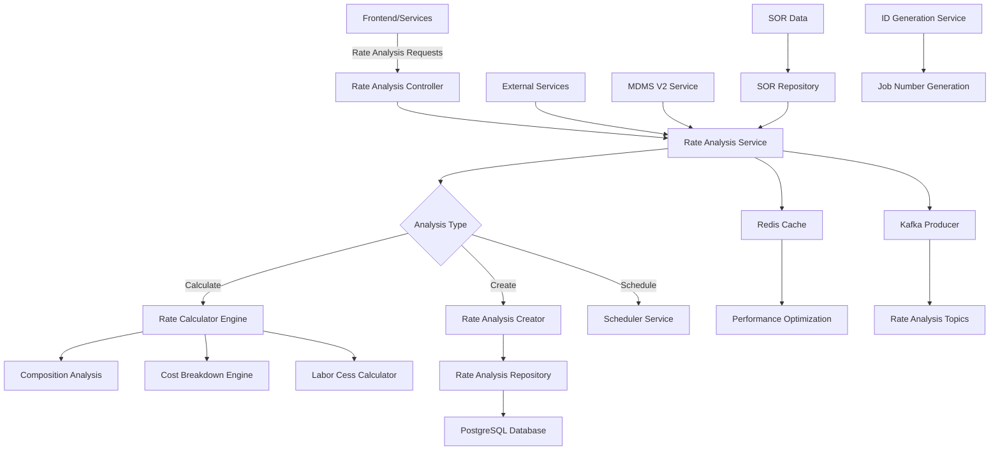
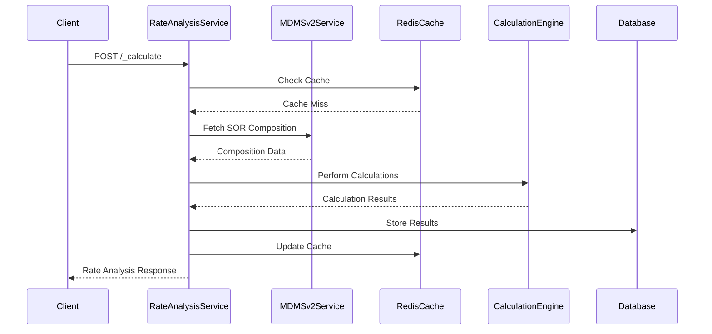
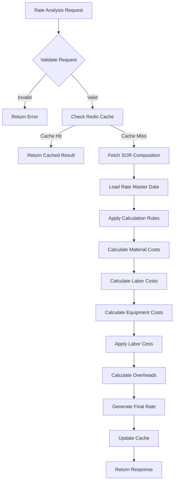
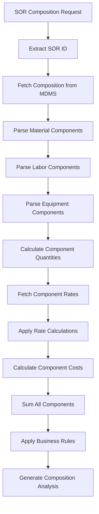
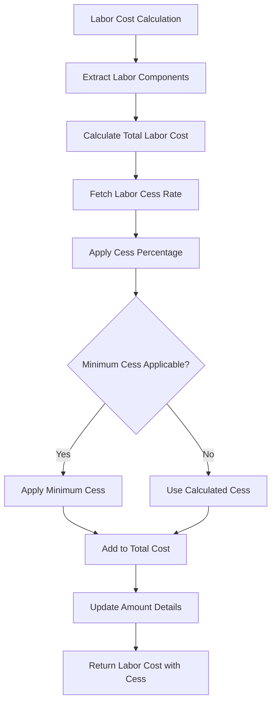
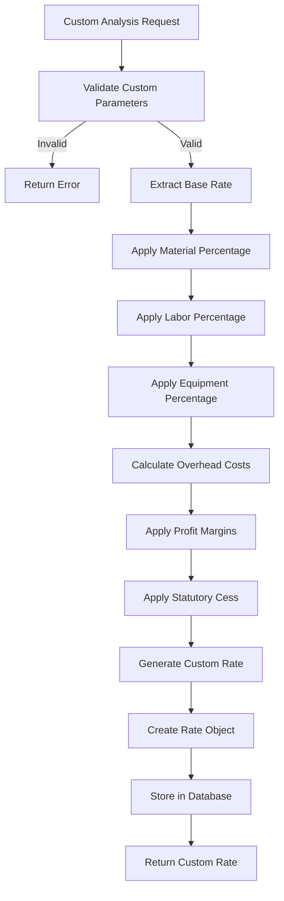
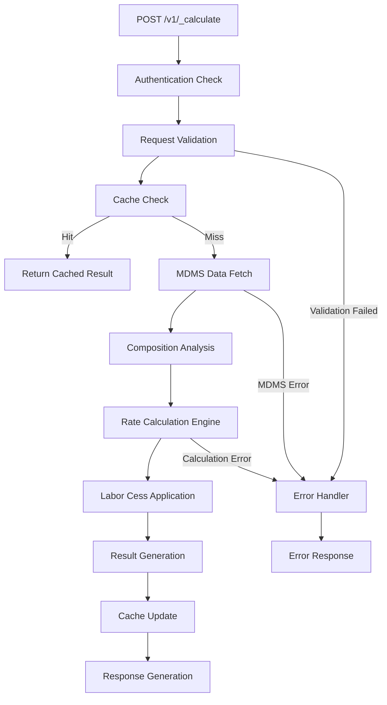
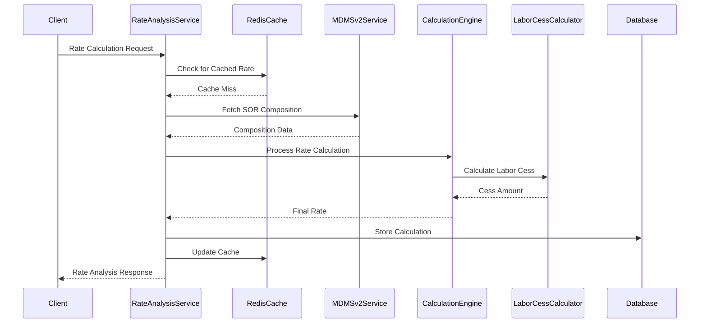
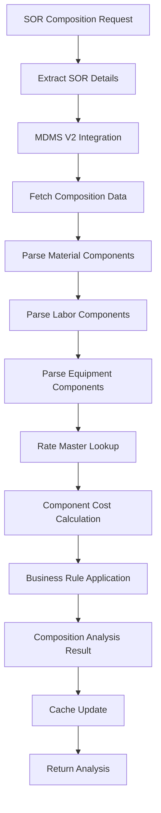
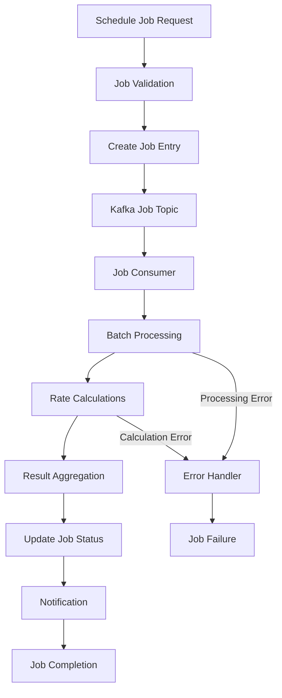

# Rate Analysis Service Documentation

## Table of Contents
1. [System & Architecture Overview](#system--architecture-overview)
2. [API Documentation](#api-documentation)
3. [Domain Models & Data Structures](#domain-models--data-structures)
4. [Database Design](#database-design)
5. [Configuration & Application Properties](#configuration--application-properties)
6. [Service Dependencies](#service-dependencies)
7. [Events & Messaging](#events--messaging)
8. [Execution & Business Flows](#execution--business-flows)
9. [Security Considerations](#security-considerations)
10. [API Flow Diagrams](#api-flow-diagrams)

## System & Architecture Overview

The Rate Analysis Service is a specialized Spring Boot microservice that performs detailed rate calculations and analysis for construction works in the DIGIT Works platform. It integrates with SOR (Schedule of Rates) data to provide comprehensive cost breakdowns, including material, labor, equipment, and overhead costs with sophisticated business rule applications.



### Core Components

- **Rate Calculator Engine**: Complex calculation algorithms for rate analysis
- **SOR Integration**: Deep integration with Schedule of Rates master data
- **Composition Analysis**: Material, labor, and equipment cost breakdown
- **Cost Breakdown Engine**: Detailed cost component analysis
- **Labor Cess Calculator**: Statutory labor cess calculations
- **Scheduler Service**: Batch processing for rate analysis jobs
- **Redis Cache**: Performance optimization for frequent calculations
- **MDMS V2 Integration**: Advanced master data management

## API Documentation

### Base URL: `/rate-analysis`

#### 1. Calculate Rate Analysis
- **Endpoint**: `POST /v1/_calculate`
- **Description**: Performs detailed rate analysis and cost breakdown
- **Authentication**: Required (JWT token)

**Request Body**:
```json
{
  "RequestInfo": {
    "apiId": "rate-analysis",
    "ver": "1.0",
    "ts": 1234567890,
    "action": "calculate",
    "did": "1",
    "key": "abcd-efgh",
    "msgId": "calculate rate analysis",
    "authToken": "{{token}}"
  },
  "rateAnalysisRequest": {
    "tenantId": "od.testing",
    "sorId": "SOR001",
    "sorCode": "SOR00101",
    "effectiveFrom": 1234567890,
    "analysisQuantity": 100.0,
    "analysisType": "DETAILED",
    "includeLabourCess": true,
    "additionalDetails": {}
  }
}
```

**Response**:
```json
{
  "ResponseInfo": {
    "apiId": "rate-analysis",
    "ver": "1.0",
    "ts": 1234567890,
    "resMsgId": "uief87324",
    "msgId": "calculate rate analysis",
    "status": "successful"
  },
  "rateAnalysis": [
    {
      "id": "analysis-uuid",
      "tenantId": "od.testing",
      "sorId": "SOR001",
      "sorCode": "SOR00101",
      "description": "Excavation in earth",
      "uom": "Cubic Meter",
      "sorType": "Works",
      "sorSubType": "Earth Works",
      "quantity": 100.0,
      "analysisQuantity": 100.0,
      "isBasicVariant": true,
      "sorVariant": "BASIC",
      "effectiveFrom": 1234567890,
      "status": "ACTIVE",
      "lineItems": [
        {
          "id": "lineitem-uuid",
          "type": "MATERIAL",
          "targetId": "MAT001",
          "description": "Cement",
          "uom": "Bag",
          "quantity": 5.0,
          "rate": 350.0,
          "amountDetails": [
            {
              "id": "amount-uuid",
              "type": "BASIC",
              "heads": "MATERIAL",
              "amount": 1750.0
            }
          ]
        },
        {
          "id": "lineitem-uuid-2",
          "type": "LABOUR",
          "targetId": "LAB001",
          "description": "Skilled Labour",
          "uom": "Day",
          "quantity": 2.0,
          "rate": 500.0,
          "amountDetails": [
            {
              "id": "amount-uuid-2",
              "type": "BASIC",
              "heads": "LABOUR",
              "amount": 1000.0
            },
            {
              "id": "amount-uuid-3",
              "type": "CESS",
              "heads": "LC.7",
              "amount": 10.0
            }
          ]
        }
      ],
      "totalRate": 276.0,
      "totalAmount": 27600.0
    }
  ]
}
```

#### 2. Create Rate Analysis
- **Endpoint**: `POST /v1/_create`
- **Description**: Creates and persists rate analysis data
- **Authentication**: Required

**Request Body**:
```json
{
  "RequestInfo": {...},
  "rateAnalysisRequest": {
    "tenantId": "od.testing",
    "sorId": "SOR001",
    "analysisType": "CUSTOM",
    "customAnalysis": {
      "description": "Custom rate analysis for special scenario",
      "baseRate": 250.0,
      "overheads": 15.0,
      "profit": 10.0,
      "materialCostPercentage": 60.0,
      "laborCostPercentage": 30.0,
      "equipmentCostPercentage": 10.0
    }
  }
}
```

**Response**:
```json
{
  "ResponseInfo": {...},
  "rates": {
    "id": "rates-uuid",
    "tenantId": "od.testing",
    "sorId": "SOR001",
    "sorCode": "SOR00101",
    "description": "Custom rate analysis",
    "uom": "Cubic Meter",
    "rate": 275.0,
    "effectiveFrom": 1234567890,
    "isBasicVariant": false,
    "sorVariant": "CUSTOM",
    "amountDetails": [
      {
        "id": "amount-detail-uuid",
        "type": "TOTAL",
        "heads": "FINAL_RATE",
        "amount": 275.0
      }
    ]
  }
}
```

#### 3. Schedule Rate Analysis Jobs
- **Endpoint**: `POST /v1/_schedule`
- **Description**: Schedules batch rate analysis jobs
- **Authentication**: Required

### Error Handling

All APIs follow standard error response format:

```json
{
  "ResponseInfo": {
    "apiId": "rate-analysis",
    "ver": "1.0",
    "ts": 1234567890,
    "resMsgId": "uief87324",
    "msgId": "calculate rate analysis",
    "status": "failed"
  },
  "Errors": [
    {
      "code": "RATE_ANALYSIS_FAILED",
      "message": "Rate analysis calculation failed",
      "description": "SOR composition data not found for the given SOR ID"
    }
  ]
}
```

## Domain Models & Data Structures

### Core Entities

#### AnalysisRequest
```java
public class AnalysisRequest {
    private RequestInfo requestInfo;
    private RateAnalysisRequest rateAnalysisRequest;
}
```

#### RateAnalysisRequest
```java
public class RateAnalysisRequest {
    private String tenantId;
    private String sorId;
    private String sorCode;
    private Long effectiveFrom;
    private Double analysisQuantity;
    private String analysisType;
    private Boolean includeLabourCess;
    private CustomAnalysis customAnalysis;
    private Object additionalDetails;
}
```

#### RateAnalysis
```java
public class RateAnalysis {
    private String id;
    private String tenantId;
    private String sorId;
    private String sorCode;
    private String description;
    private String uom;
    private String sorType;
    private String sorSubType;
    private Double quantity;
    private Double analysisQuantity;
    private Boolean isBasicVariant;
    private String sorVariant;
    private Long effectiveFrom;
    private String status;
    private List<LineItem> lineItems;
    private Double totalRate;
    private Double totalAmount;
    private Object additionalDetails;
}
```

#### LineItem
```java
public class LineItem {
    private String id;
    private String type; // MATERIAL, LABOUR, EQUIPMENT, OVERHEAD
    private String targetId;
    private String description;
    private String uom;
    private Double quantity;
    private Double rate;
    private List<AmountDetail> amountDetails;
    private Object additionalDetails;
}
```

#### AmountDetail
```java
public class AmountDetail {
    private String id;
    private String type; // BASIC, CESS, TAX, OVERHEAD
    private String heads;
    private Double amount;
    private Object additionalDetails;
}
```

#### Rates
```java
public class Rates {
    private String id;
    private String tenantId;
    private String sorId;
    private String sorCode;
    private String description;
    private String uom;
    private String sorType;
    private Double rate;
    private Long effectiveFrom;
    private Boolean isBasicVariant;
    private String sorVariant;
    private List<AmountDetail> amountDetails;
    private Object additionalDetails;
}
```

### Analysis Types

#### Analysis Types
- **BASIC**: Standard SOR-based rate analysis
- **DETAILED**: Comprehensive cost breakdown analysis
- **CUSTOM**: User-defined rate analysis
- **COMPARATIVE**: Comparison with market rates
- **HISTORICAL**: Historical rate trend analysis

#### Component Types
- **MATERIAL**: Material cost components
- **LABOUR**: Labor cost components
- **EQUIPMENT**: Equipment and machinery costs
- **OVERHEAD**: Overhead and administrative costs
- **CESS**: Statutory cess and levies

### Validation Rules

- **SOR ID**: Must exist in MDMS SOR master data
- **Tenant ID**: Must be valid as per MDMS configuration
- **Effective From**: Must be valid date, cannot be in past beyond threshold
- **Analysis Quantity**: Must be positive number
- **Rate Components**: Must sum up to total rate
- **Labor Cess**: Must be calculated as per statutory rules

## Database Design

### Tables

#### eg_works_rate_analysis
```sql
CREATE TABLE eg_works_rate_analysis (
    id character varying(128) PRIMARY KEY,
    tenant_id character varying(64) NOT NULL,
    sor_id character varying(128) NOT NULL,
    sor_code character varying(64) NOT NULL,
    description character varying(1024),
    uom character varying(64),
    sor_type character varying(64),
    sor_sub_type character varying(64),
    quantity numeric(12,4),
    analysis_quantity numeric(12,4),
    is_basic_variant boolean DEFAULT true,
    sor_variant character varying(64),
    effective_from bigint,
    status character varying(64) DEFAULT 'ACTIVE',
    total_rate numeric(12,2),
    total_amount numeric(12,2),
    created_by character varying(64) NOT NULL,
    last_modified_by character varying(64) NOT NULL,
    created_time bigint NOT NULL,
    last_modified_time bigint NOT NULL,
    additional_details JSONB,
    
    CONSTRAINT uk_rate_analysis_sor UNIQUE (sor_id, effective_from, tenant_id)
);

CREATE INDEX idx_rate_analysis_tenant_id ON eg_works_rate_analysis (tenant_id);
CREATE INDEX idx_rate_analysis_sor_id ON eg_works_rate_analysis (sor_id);
CREATE INDEX idx_rate_analysis_sor_code ON eg_works_rate_analysis (sor_code);
CREATE INDEX idx_rate_analysis_effective_from ON eg_works_rate_analysis (effective_from);
```

#### eg_works_rate_analysis_lineitem
```sql
CREATE TABLE eg_works_rate_analysis_lineitem (
    id character varying(128) PRIMARY KEY,
    rate_analysis_id character varying(128) NOT NULL,
    type character varying(64) NOT NULL,
    target_id character varying(128),
    description character varying(1024),
    uom character varying(64),
    quantity numeric(12,4),
    rate numeric(12,2),
    amount numeric(12,2),
    created_by character varying(64) NOT NULL,
    last_modified_by character varying(64) NOT NULL,
    created_time bigint NOT NULL,
    last_modified_time bigint NOT NULL,
    additional_details JSONB,
    
    CONSTRAINT fk_lineitem_rate_analysis FOREIGN KEY (rate_analysis_id) 
        REFERENCES eg_works_rate_analysis (id) ON DELETE CASCADE
);

CREATE INDEX idx_lineitem_rate_analysis_id ON eg_works_rate_analysis_lineitem (rate_analysis_id);
CREATE INDEX idx_lineitem_type ON eg_works_rate_analysis_lineitem (type);
CREATE INDEX idx_lineitem_target_id ON eg_works_rate_analysis_lineitem (target_id);
```

#### eg_works_rate_analysis_amount_detail
```sql
CREATE TABLE eg_works_rate_analysis_amount_detail (
    id character varying(128) PRIMARY KEY,
    lineitem_id character varying(128) NOT NULL,
    type character varying(64) NOT NULL,
    heads character varying(128),
    amount numeric(12,2),
    created_by character varying(64) NOT NULL,
    last_modified_by character varying(64) NOT NULL,
    created_time bigint NOT NULL,
    last_modified_time bigint NOT NULL,
    additional_details JSONB,
    
    CONSTRAINT fk_amount_detail_lineitem FOREIGN KEY (lineitem_id) 
        REFERENCES eg_works_rate_analysis_lineitem (id) ON DELETE CASCADE
);

CREATE INDEX idx_amount_detail_lineitem_id ON eg_works_rate_analysis_amount_detail (lineitem_id);
CREATE INDEX idx_amount_detail_type ON eg_works_rate_analysis_amount_detail (type);
CREATE INDEX idx_amount_detail_heads ON eg_works_rate_analysis_amount_detail (heads);
```

### Entity Relationship Diagram

```mermaid
erDiagram
    RATE_ANALYSIS ||--o{ LINEITEM : contains
    LINEITEM ||--o{ AMOUNT_DETAIL : includes
    RATE_ANALYSIS ||--|| SOR : references
    LINEITEM ||--|| MATERIAL_LABOUR_EQUIPMENT : targets
    
    RATE_ANALYSIS {
        varchar id PK
        varchar tenant_id
        varchar sor_id FK
        varchar sor_code
        varchar description
        varchar uom
        varchar sor_type
        numeric quantity
        numeric analysis_quantity
        boolean is_basic_variant
        varchar sor_variant
        bigint effective_from
        varchar status
        numeric total_rate
        numeric total_amount
        jsonb additional_details
        audit_details
    }
    
    LINEITEM {
        varchar id PK
        varchar rate_analysis_id FK
        varchar type
        varchar target_id FK
        varchar description
        varchar uom
        numeric quantity
        numeric rate
        numeric amount
        jsonb additional_details
        audit_details
    }
    
    AMOUNT_DETAIL {
        varchar id PK
        varchar lineitem_id FK
        varchar type
        varchar heads
        numeric amount
        jsonb additional_details
        audit_details
    }
```

## Configuration & Application Properties

### Server Configuration
```properties
server.servlet.contextPath=/rate-analysis
server.contextPath=/rate-analysis
server.port=8086
app.timezone=UTC
```

### Database Configuration
```properties
spring.datasource.driver-class-name=org.postgresql.Driver
spring.datasource.url=jdbc:postgresql://localhost:5432/digit-works
spring.datasource.username=postgres
spring.datasource.password=1234

spring.flyway.url=jdbc:postgresql://localhost:5432/digit-works
spring.flyway.table=rate_analysis_schema_version
spring.flyway.baseline-on-migrate=true
spring.flyway.locations=classpath:/db/migration/main
```

### Redis Configuration
```properties
spring.data.redis.host=localhost
spring.data.redis.port=6379
spring.data.redis.timeout=3600
```

### Kafka Configuration
```properties
kafka.config.bootstrap_server_config=localhost:9092
spring.kafka.consumer.group-id=rate-analysis
spring.kafka.producer.key-serializer=org.apache.kafka.common.serialization.StringSerializer
spring.kafka.producer.value-serializer=org.springframework.kafka.support.serializer.JsonSerializer

# Topics
rate.analysis.job.create.topic=rate-analysis-job-create
rate.analysis.job.update.topic=rate-analysis-job-update
egov.mdms.data.save.topic=save-mdms-data
```

### MDMS V2 Configuration
```properties
egov.mdms.v2.host=http://localhost:8081
egov.mdms.v1.search.endpoint=/mdms-v2/v1/_search
egov.mdms.v2.search.endpoint=/mdms-v2/v2/_search
egov.mdms.v2.create.endpoint=/mdms-v2/v2/_create/
egov.mdms.v2.update.endpoint=/mdms-v2/v2/_update/

# MDMS Schema Codes
works.mdms.data.rates.schema.code=WORKS-SOR.Rates
works.mdms.data.composition.schema.code=WORKS-SOR.Composition
```

### Business Configuration
```properties
# SOR Configuration
works.sor.type=W

# Labor Cess Configuration
labour.cess.head.code=LC.7
labour.cess.rate=1

# ID Generation
egov.idgen.host=https://unified-dev.digit.org/
egov.idgen.path=egov-idgen/id/_generate
egov.rate.analysis.job.number.name=rate.analysis.job.number

# Pagination
rate.analysis.default.offset=0
rate.analysis.default.limit=10
sor.default.offset=0
sor.default.limit=100

# MDMS Consumer
works.is.mdms.consumer.needed=true
```

## Service Dependencies

### Internal DIGIT Services

1. **MDMS V2 Service** (`egov.mdms.v2.host`)
   - **Purpose**: Advanced master data management for SOR data
   - **APIs Used**: `/mdms-v2/v1/_search`, `/mdms-v2/v2/_search`, `/mdms-v2/v2/_create`, `/mdms-v2/v2/_update`
   - **Usage**: Fetch SOR composition, rates, and master data

2. **ID Generation Service** (`egov.idgen.host`)
   - **Purpose**: Generate unique job numbers for rate analysis jobs
   - **APIs Used**: `/egov-idgen/id/_generate`
   - **Usage**: Auto-generate rate analysis job numbers

### External Dependencies

1. **PostgreSQL Database**
   - **Purpose**: Primary data storage for rate analysis data
   - **Connection**: JDBC connection pool
   - **Usage**: Store rate analysis results, line items, calculations

2. **Redis Cache**
   - **Purpose**: High-performance caching for frequent calculations
   - **Connection**: Redis connection
   - **Usage**: Cache SOR data, rate calculations, composition data

3. **Kafka Message Broker**
   - **Purpose**: Asynchronous job processing and data updates
   - **Topics**: Rate analysis job processing and MDMS updates
   - **Usage**: Event-driven rate analysis processing

## Events & Messaging

### Kafka Topics

#### 1. rate-analysis-job-create
- **Purpose**: Create new rate analysis jobs
- **Producer**: Rate Analysis Service
- **Consumer**: Rate Analysis Service (job processor)

#### 2. rate-analysis-job-update
- **Purpose**: Update existing rate analysis jobs
- **Producer**: Rate Analysis Service
- **Consumer**: Rate Analysis Service, dependent services

#### 3. save-mdms-data
- **Purpose**: Update MDMS with calculated rates
- **Producer**: Rate Analysis Service
- **Consumer**: MDMS V2 Service

### Event Processing Patterns

#### Rate Calculation Flow


## Execution & Business Flows

### 1. Rate Calculation Flow



### 2. SOR Composition Analysis Flow



### 3. Labor Cess Calculation Flow



### 4. Custom Rate Analysis Flow



## Security Considerations

### Authentication & Authorization

1. **JWT Token Validation**
   - All APIs require valid JWT token
   - Token validation through `RequestInfo.authToken`
   - Integration with DIGIT user service

2. **Role-Based Access Control**
   - **RATE_ANALYST**: Can perform rate calculations and analysis
   - **RATE_ADMINISTRATOR**: Can create and modify rate analysis data
   - **RATE_VIEWER**: Can view rate analysis results
   - **SYSTEM_ADMIN**: Full access to rate analysis operations

3. **Tenant Isolation**
   - All operations scoped to tenant ID
   - Cross-tenant rate analysis access not allowed
   - SOR data validation within tenant context

### Input Validation

1. **Request Validation**
   - JSON schema validation for analysis requests
   - Business rule validation for rate parameters
   - SOR ID existence validation

2. **Business Rule Validation**
   - SOR composition data validation
   - Rate calculation accuracy validation
   - Component cost validation
   - Labor cess calculation validation

3. **Calculation Security**
   - Mathematical precision validation
   - Rate tampering prevention
   - Component cost consistency checks

### Data Protection

1. **Rate Data Security**
   - Secure calculation processing
   - Rate calculation audit trails
   - Composition data integrity

2. **Cache Security**
   - Redis cache data encryption
   - Cache invalidation policies
   - Secure cache access patterns

## API Flow Diagrams

### 1. Calculate Rate Analysis API Flow



### 2. Complex Rate Calculation Flow



### 3. SOR Composition Processing Flow



### 4. Batch Job Processing Flow



This comprehensive documentation provides detailed insights into the Rate Analysis Service's sophisticated calculation engine, SOR integration, caching strategies, and complex business rule processing for accurate rate analysis in DIGIT Works platform.