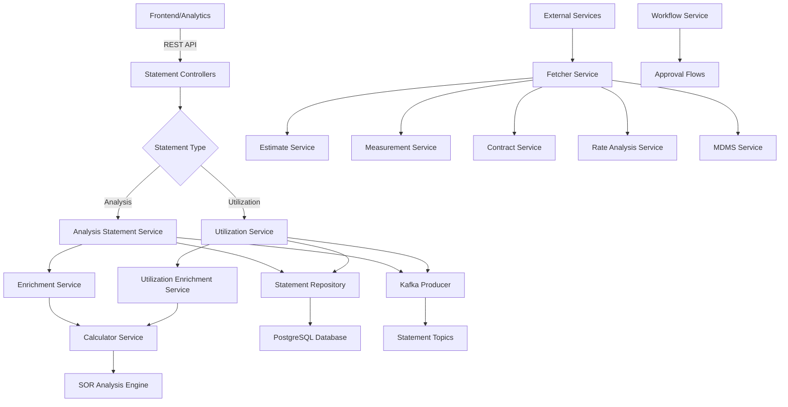
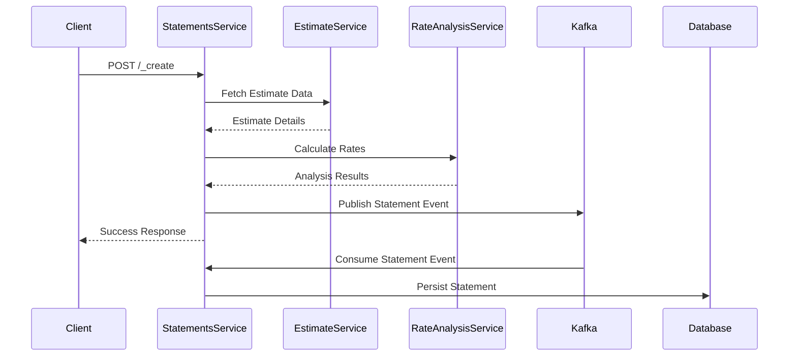
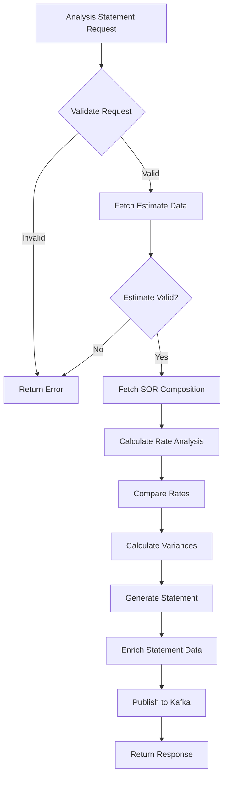
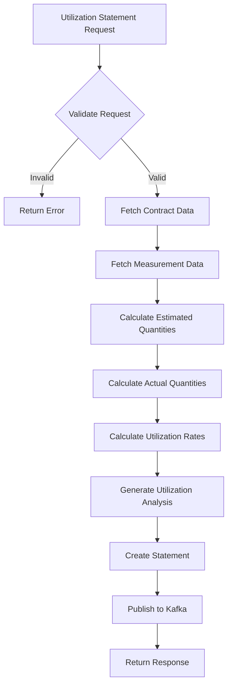
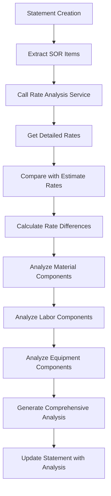
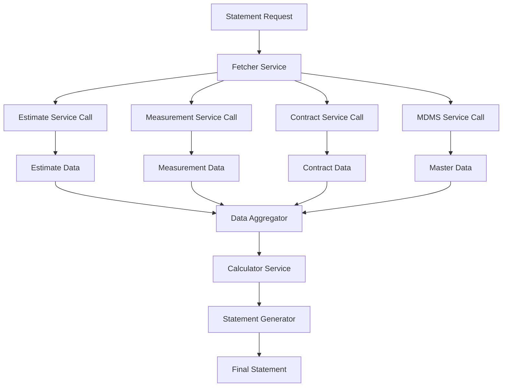
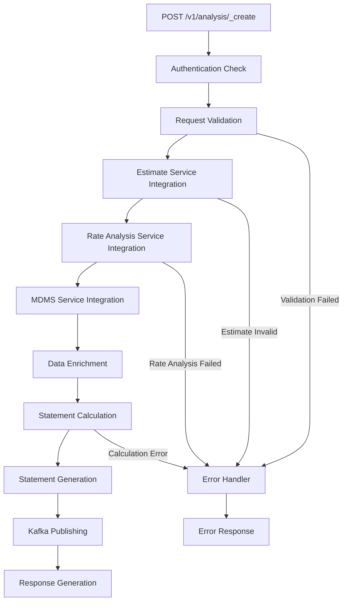
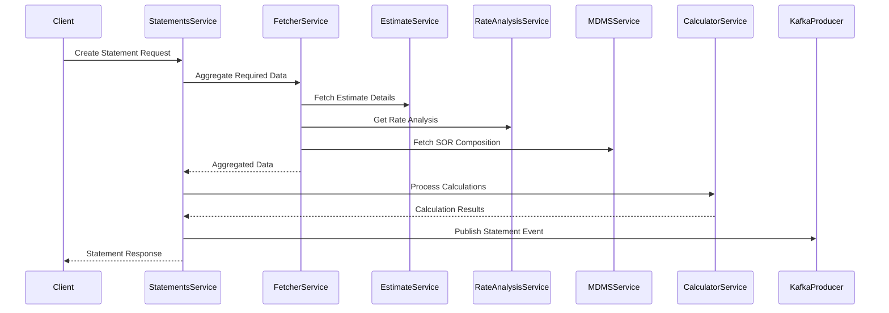
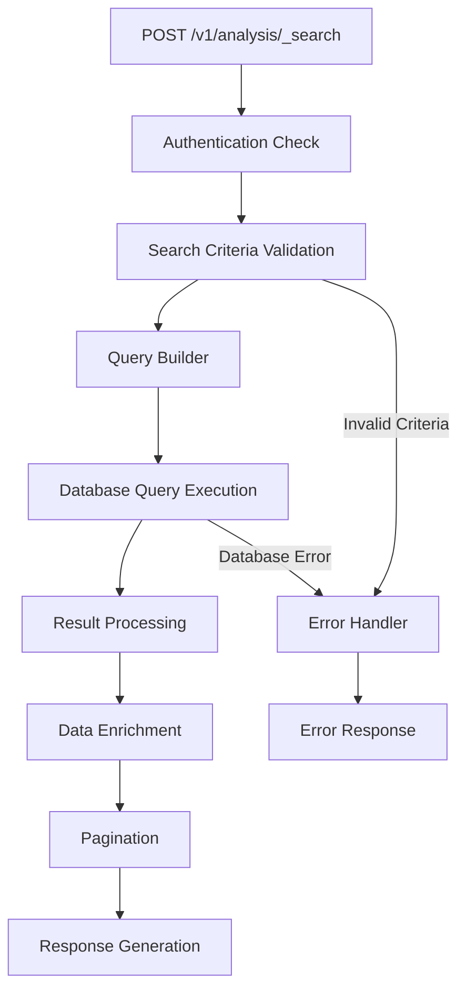
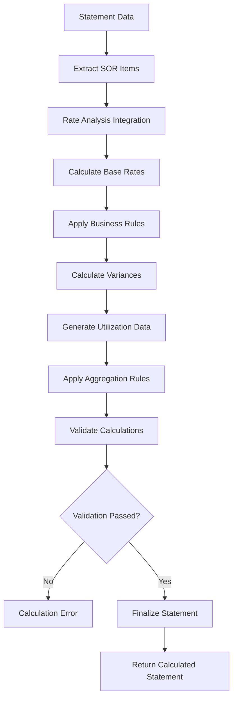

# Statements Service Documentation

## Table of Contents
1. [System & Architecture Overview](#system--architecture-overview)
2. [API Documentation](#api-documentation)
3. [Domain Models & Data Structures](#domain-models--data-structures)
4. [Database Design](#database-design)
5. [Configuration & Application Properties](#configuration--application-properties)
6. [Service Dependencies](#service-dependencies)
7. [Events & Messaging](#events--messaging)
8. [Execution & Business Flows](#execution--business-flows)
9. [Security Considerations](#security-considerations)
10. [API Flow Diagrams](#api-flow-diagrams)

## System & Architecture Overview

The Statements Service is a comprehensive Spring Boot microservice that manages financial statement generation, analysis, and reporting for the DIGIT Works platform. It provides analysis statements for estimates and utilization statements for tracking resource consumption, with sophisticated integration to multiple backend services for accurate financial reporting.



### Core Components

- **Analysis Statement Service**: Financial analysis and cost breakdown
- **Utilization Service**: Resource utilization tracking and reporting  
- **Calculator Service**: Complex calculation engine for rates and costs
- **Fetcher Service**: Multi-service data aggregation
- **Enrichment Services**: Data enhancement and validation
- **Statement Repository**: Data persistence and retrieval
- **Kafka Integration**: Event-driven statement processing

## API Documentation

### Base URL: `/statements`

#### 1. Create Analysis Statement
- **Endpoint**: `POST /v1/analysis/_create`
- **Description**: Creates financial analysis statements for estimates
- **Authentication**: Required (JWT token)

**Request Body**:
```json
{
  "RequestInfo": {
    "apiId": "statements-service",
    "ver": "1.0",
    "ts": 1234567890,
    "action": "create",
    "did": "1",
    "key": "abcd-efgh",
    "msgId": "create analysis statement",
    "authToken": "{{token}}"
  },
  "statement": {
    "tenantId": "od.testing",
    "estimateId": "estimate-uuid",
    "statementType": "ANALYSIS",
    "analysisType": "RATE_ANALYSIS",
    "fromPeriod": 1234567890,
    "toPeriod": 1234567899,
    "additionalDetails": {
      "includeOverheads": true,
      "includeLabor": true,
      "includeMaterial": true
    }
  }
}
```

**Response**:
```json
{
  "ResponseInfo": {
    "apiId": "statements-service",
    "ver": "1.0",
    "ts": 1234567890,
    "resMsgId": "uief87324",
    "msgId": "create analysis statement",
    "status": "successful"
  },
  "statement": [
    {
      "id": "statement-uuid",
      "tenantId": "od.testing",
      "statementNumber": "AS/2023-24/000001",
      "estimateId": "estimate-uuid",
      "statementType": "ANALYSIS",
      "analysisType": "RATE_ANALYSIS",
      "totalAmount": 250000.00,
      "status": "ACTIVE",
      "utilization": [
        {
          "sorId": "SOR001",
          "description": "Excavation in earth",
          "uom": "CUM",
          "estimatedQuantity": 100.0,
          "estimatedRate": 150.0,
          "estimatedAmount": 15000.0,
          "analysisRate": 148.5,
          "analysisAmount": 14850.0,
          "variance": -150.0,
          "variancePercentage": -1.0
        }
      ],
      "auditDetails": {
        "createdBy": "user-uuid",
        "lastModifiedBy": "user-uuid",
        "createdTime": 1234567890,
        "lastModifiedTime": 1234567890
      }
    }
  ]
}
```

#### 2. Search Analysis Statements
- **Endpoint**: `POST /v1/analysis/_search`
- **Description**: Search and retrieve analysis statements
- **Authentication**: Required

**Request Body**:
```json
{
  "RequestInfo": {...},
  "searchCriteria": {
    "tenantId": "od.testing",
    "statementType": "ANALYSIS",
    "ids": ["statement-uuid-1"],
    "estimateIds": ["estimate-uuid-1"],
    "statementNumbers": ["AS/2023-24/000001"],
    "fromDate": 1234567890,
    "toDate": 1234567899,
    "limit": 10,
    "offset": 0
  }
}
```

#### 3. Create Utilization Statement
- **Endpoint**: `POST /v1/utilization/_create`
- **Description**: Creates resource utilization statements
- **Authentication**: Required

**Request Body**:
```json
{
  "RequestInfo": {...},
  "statement": {
    "tenantId": "od.testing",
    "contractId": "contract-uuid",
    "measurementId": "measurement-uuid",
    "statementType": "UTILIZATION",
    "utilizationType": "MATERIAL",
    "fromPeriod": 1234567890,
    "toPeriod": 1234567899,
    "additionalDetails": {}
  }
}
```

#### 4. Search Utilization Statements
- **Endpoint**: `POST /v1/utilization/_search`
- **Description**: Search and retrieve utilization statements
- **Authentication**: Required

### Error Handling

All APIs follow standard error response format:

```json
{
  "ResponseInfo": {
    "apiId": "statements-service",
    "ver": "1.0",
    "ts": 1234567890,
    "resMsgId": "uief87324",
    "msgId": "create analysis statement",
    "status": "failed"
  },
  "Errors": [
    {
      "code": "STATEMENT_CREATION_FAILED",
      "message": "Statement creation failed",
      "description": "Invalid estimate data or insufficient information"
    }
  ]
}
```

## Domain Models & Data Structures

### Core Entities

#### Statement
```java
public class Statement {
    private String id;
    private String tenantId;
    private String statementNumber;
    private String estimateId;
    private String contractId;
    private String measurementId;
    private StatementTypeEnum statementType;
    private String analysisType;
    private String utilizationType;
    private Long fromPeriod;
    private Long toPeriod;
    private Double totalAmount;
    private String status;
    private List<Utilization> utilization;
    private Object additionalDetails;
    private AuditDetails auditDetails;
}
```

#### Utilization
```java
public class Utilization {
    private String id;
    private String statementId;
    private String sorId;
    private String description;
    private String uom;
    private Double estimatedQuantity;
    private Double estimatedRate;
    private Double estimatedAmount;
    private Double actualQuantity;
    private Double actualRate;
    private Double actualAmount;
    private Double analysisRate;
    private Double analysisAmount;
    private Double variance;
    private Double variancePercentage;
    private String utilizationType;
    private Object additionalDetails;
    private AuditDetails auditDetails;
}
```

#### StatementCreateRequest
```java
public class StatementCreateRequest {
    private RequestInfo requestInfo;
    private Statement statement;
    private Workflow workflow;
}
```

#### StatementSearchCriteria
```java
public class StatementSearchCriteria {
    private RequestInfo requestInfo;
    private StatementSearchRequest searchCriteria;
    private Pagination pagination;
}
```

#### StatementSearchRequest
```java
public class StatementSearchRequest {
    private String tenantId;
    private StatementTypeEnum statementType;
    private List<String> ids;
    private List<String> estimateIds;
    private List<String> contractIds;
    private List<String> measurementIds;
    private List<String> statementNumbers;
    private Long fromDate;
    private Long toDate;
    private String status;
    private Integer limit;
    private Integer offset;
}
```

### Statement Types and Categories

#### Statement Types
```java
public enum StatementTypeEnum {
    ANALYSIS("ANALYSIS"),
    UTILIZATION("UTILIZATION");
}
```

#### Analysis Types
- **RATE_ANALYSIS**: Detailed rate breakdown and comparison
- **COST_ANALYSIS**: Cost center and category analysis
- **VARIANCE_ANALYSIS**: Budget vs actual variance reporting

#### Utilization Types
- **MATERIAL**: Material consumption tracking
- **LABOR**: Labor utilization analysis
- **EQUIPMENT**: Equipment usage tracking
- **OVERHEAD**: Overhead cost allocation

### Validation Rules

- **Estimate ID**: Must exist and be approved for analysis statements
- **Contract ID**: Must exist and be active for utilization statements
- **Period Dates**: From date must be <= To date
- **Statement Type**: Must be valid enum value
- **Tenant ID**: Must be valid as per MDMS configuration
- **SOR References**: Must exist in MDMS SOR master data

## Database Design

### Tables

#### eg_works_statement
```sql
CREATE TABLE eg_works_statement (
    id character varying(128) PRIMARY KEY,
    tenant_id character varying(64) NOT NULL,
    statement_number character varying(64) NOT NULL,
    estimate_id character varying(128),
    contract_id character varying(128),
    measurement_id character varying(128),
    statement_type character varying(64) NOT NULL,
    analysis_type character varying(64),
    utilization_type character varying(64),
    from_period bigint,
    to_period bigint,
    total_amount numeric(12,2),
    status character varying(64) NOT NULL,
    created_by character varying(64) NOT NULL,
    last_modified_by character varying(64) NOT NULL,
    created_time bigint NOT NULL,
    last_modified_time bigint NOT NULL,
    additional_details JSONB,
    
    CONSTRAINT uk_statement_number UNIQUE (statement_number, tenant_id)
);

CREATE INDEX idx_statement_tenant_id ON eg_works_statement (tenant_id);
CREATE INDEX idx_statement_estimate_id ON eg_works_statement (estimate_id);
CREATE INDEX idx_statement_contract_id ON eg_works_statement (contract_id);
CREATE INDEX idx_statement_type ON eg_works_statement (statement_type);
CREATE INDEX idx_statement_created_time ON eg_works_statement (created_time);
```

#### eg_works_utilization
```sql
CREATE TABLE eg_works_utilization (
    id character varying(128) PRIMARY KEY,
    statement_id character varying(128) NOT NULL,
    sor_id character varying(64),
    description character varying(1024),
    uom character varying(64),
    estimated_quantity numeric(12,4),
    estimated_rate numeric(12,2),
    estimated_amount numeric(12,2),
    actual_quantity numeric(12,4),
    actual_rate numeric(12,2),
    actual_amount numeric(12,2),
    analysis_rate numeric(12,2),
    analysis_amount numeric(12,2),
    variance_amount numeric(12,2),
    variance_percentage numeric(5,2),
    utilization_type character varying(64),
    created_by character varying(64) NOT NULL,
    last_modified_by character varying(64) NOT NULL,
    created_time bigint NOT NULL,
    last_modified_time bigint NOT NULL,
    additional_details JSONB,
    
    CONSTRAINT fk_utilization_statement FOREIGN KEY (statement_id) 
        REFERENCES eg_works_statement (id) ON DELETE CASCADE
);

CREATE INDEX idx_utilization_statement_id ON eg_works_utilization (statement_id);
CREATE INDEX idx_utilization_sor_id ON eg_works_utilization (sor_id);
CREATE INDEX idx_utilization_type ON eg_works_utilization (utilization_type);
```

### Entity Relationship Diagram

```mermaid
erDiagram
    STATEMENT ||--o{ UTILIZATION : contains
    STATEMENT ||--|| ESTIMATE : references
    STATEMENT ||--|| CONTRACT : references
    STATEMENT ||--|| MEASUREMENT : references
    UTILIZATION ||--|| SOR : references
    
    STATEMENT {
        varchar id PK
        varchar tenant_id
        varchar statement_number UK
        varchar estimate_id FK
        varchar contract_id FK
        varchar measurement_id FK
        varchar statement_type
        varchar analysis_type
        varchar utilization_type
        bigint from_period
        bigint to_period
        numeric total_amount
        varchar status
        jsonb additional_details
        audit_details
    }
    
    UTILIZATION {
        varchar id PK
        varchar statement_id FK
        varchar sor_id FK
        varchar description
        varchar uom
        numeric estimated_quantity
        numeric estimated_rate
        numeric estimated_amount
        numeric actual_quantity
        numeric actual_rate
        numeric actual_amount
        numeric analysis_rate
        numeric analysis_amount
        numeric variance_amount
        numeric variance_percentage
        varchar utilization_type
        audit_details
    }
```

## Configuration & Application Properties

### Server Configuration
```properties
server.contextPath=/statements
server.servlet.contextPath=/statements
server.port=8086
app.timezone=UTC
```

### Database Configuration
```properties
spring.datasource.driver-class-name=org.postgresql.Driver
spring.datasource.url=jdbc:postgresql://localhost:5432/digit-works
spring.datasource.username=postgres
spring.datasource.password=1234

spring.flyway.url=jdbc:postgresql://localhost:5432/digit-works
spring.flyway.table=statement
spring.flyway.baseline-on-migrate=true
spring.flyway.locations=classpath:/db/migration/main
```

### Kafka Configuration
```properties
kafka.config.bootstrap_server_config=localhost:9092
spring.kafka.consumer.group-id=statements
spring.kafka.producer.key-serializer=org.apache.kafka.common.serialization.StringSerializer
spring.kafka.producer.value-serializer=org.springframework.kafka.support.serializer.JsonSerializer

# Statement Topics
save.analysis.statement.topic=save-analysis-statement
update.analysis.statement.topic=update-analysis-statement
analysis.statement.error.topic=analysis-statement-error-topic
utilization.error.topic=utilization-error-topic
```

### External Service URLs
```properties
# Estimate Service
works.estimate.host=https://unified-qa.digit.org
works.estimate.search.endpoint=/estimate/v1/_search

# Rate Analysis Service  
works.rate-analysis.host=https://unified-qa.digit.org
works.rate-analysis.calculate.endpoint=/rate-analysis/v1/_calculate

# Measurement Service
works.measurement.host=https://unified-qa.digit.org
works.measurement.search.endpoint=/measurement-service/v1/_search

# Contract Service
works.contract.host=https://unified-qa.digit.org
works.contract.search.endpoint=/contract/v1/_search

# MDMS Services
egov.mdms.host=https://unified-qa.digit.org
egov.mdms.search.endpoint=/egov-mdms-service/v1/_search
egov.mdms.v2.host=https://unified-qa.digit.org
egov.mdms.v2.search.endpoint=/mdms-v2/v1/_search

# Workflow Service
egov.workflow.host=https://unified-qa.digit.org
egov.workflow.processinstance.search.path=/egov-workflow-v2/egov-wf/process/_search
```

### Business Configuration
```properties
# SOR Configuration
statement.sorComposition.moduleName=WORKS-SOR
works.sor.type=W

# ID Generation
egov.idgen.host=https://unified-qa.digit.org/
egov.idgen.path=egov-idgen/id/_generate

# Workflow Configuration
estimate.workflow.business.service=ESTIMATE
estimate.workflow.module.name=estimate-service

# State Configuration
state.level.tenant.id=pg
```

## Service Dependencies

### Internal DIGIT Services

1. **Estimate Service** (`works.estimate.host`)
   - **Purpose**: Fetch estimate data for analysis statements
   - **APIs Used**: `/estimate/v1/_search`
   - **Usage**: Retrieve estimate details, quantities, and rates

2. **Rate Analysis Service** (`works.rate-analysis.host`)
   - **Purpose**: Perform detailed rate calculations and analysis
   - **APIs Used**: `/rate-analysis/v1/_calculate`
   - **Usage**: Calculate detailed rates for comparison analysis

3. **Measurement Service** (`works.measurement.host`)
   - **Purpose**: Fetch actual measurement data for utilization statements
   - **APIs Used**: `/measurement-service/v1/_search`
   - **Usage**: Retrieve actual quantities and progress data

4. **Contract Service** (`works.contract.host`)
   - **Purpose**: Validate contracts and fetch contract details
   - **APIs Used**: `/contract/v1/_search`
   - **Usage**: Contract validation and rate information

5. **MDMS Service** (`egov.mdms.host`)
   - **Purpose**: Master data for SOR, rates, and business rules
   - **APIs Used**: `/egov-mdms-service/v1/_search`, `/mdms-v2/v1/_search`
   - **Usage**: SOR composition data and calculation rules

6. **Workflow Service** (`egov.workflow.host`)
   - **Purpose**: Statement approval workflows
   - **APIs Used**: `/egov-workflow-v2/egov-wf/process/_search`
   - **Usage**: Handle statement approval processes

### External Dependencies

1. **PostgreSQL Database**
   - **Purpose**: Primary data storage for statements and utilization
   - **Connection**: JDBC connection pool
   - **Usage**: Store statement data, calculations, and audit trails

2. **Kafka Message Broker**
   - **Purpose**: Asynchronous statement processing
   - **Topics**: Statement processing and error handling topics
   - **Usage**: Event-driven statement generation and updates

## Events & Messaging

### Kafka Topics

#### 1. save-analysis-statement
- **Purpose**: Persist newly created analysis statements
- **Producer**: Statements Service
- **Consumer**: Statements Service (persistence consumer)

#### 2. update-analysis-statement
- **Purpose**: Update existing analysis statements
- **Producer**: Statements Service
- **Consumer**: Statements Service, dependent services

#### 3. analysis-statement-error-topic
- **Purpose**: Handle analysis statement processing errors
- **Producer**: Statements Service
- **Consumer**: Error handling service

### Event Processing Patterns

#### Statement Creation Flow


## Execution & Business Flows

### 1. Analysis Statement Creation Flow



### 2. Utilization Statement Creation Flow



### 3. Rate Analysis Integration Flow



### 4. Multi-Service Data Aggregation Flow



## Security Considerations

### Authentication & Authorization

1. **JWT Token Validation**
   - All APIs require valid JWT token
   - Token validation through `RequestInfo.authToken`
   - Integration with DIGIT user service

2. **Role-Based Access Control**
   - **STATEMENT_CREATOR**: Can create analysis and utilization statements
   - **STATEMENT_VIEWER**: Can search and view statements
   - **FINANCIAL_ANALYST**: Can create and analyze financial statements
   - **ADMIN**: Full access to statement operations

3. **Tenant Isolation**
   - All operations scoped to tenant ID
   - Cross-tenant statement access not allowed
   - Estimate and contract validation within tenant

### Input Validation

1. **Request Validation**
   - JSON schema validation for statement requests
   - Business rule validation for statement parameters
   - Period date validation

2. **Business Rule Validation**
   - Estimate existence and status validation
   - Contract validity period validation
   - SOR reference validation against MDMS
   - Calculation accuracy validation

3. **Data Integrity**
   - Amount calculation validation
   - Variance calculation accuracy
   - Rate consistency validation

### Data Protection

1. **Financial Data Security**
   - Secure handling of financial calculations
   - Audit trail for all statement operations
   - Rate tampering prevention

2. **Statement Security**
   - Statement number uniqueness enforcement
   - Data integrity validation
   - Secure calculation processing

## API Flow Diagrams

### 1. Create Analysis Statement API Flow



### 2. Multi-Service Integration Flow



### 3. Statement Search API Flow



### 4. Calculation Engine Flow



This comprehensive documentation provides detailed insights into the Statements Service's financial analysis capabilities, multi-service integration, calculation engine, and comprehensive reporting functionality for DIGIT Works platform.