# User OTP Service Documentation

## Table of Contents
1. [System & Architecture Overview](#system--architecture-overview)
2. [API Documentation](#api-documentation)
3. [Domain Models & Data Structures](#domain-models--data-structures)
4. [Database Design](#database-design)
5. [Configuration & Application Properties](#configuration--application-properties)
6. [Service Dependencies](#service-dependencies)
7. [Events & Messaging](#events--messaging)
8. [Execution & Business Flows](#execution--business-flows)
9. [Security Considerations](#security-considerations)
10. [API Flow Diagrams](#api-flow-diagrams)

## System & Architecture Overview

The User OTP Service is a Spring Boot microservice that manages One-Time Password (OTP) generation, delivery, and verification for user authentication in the DIGIT Works platform. It supports multiple delivery channels (SMS, Email) and handles different OTP types for registration, login, and password reset scenarios.

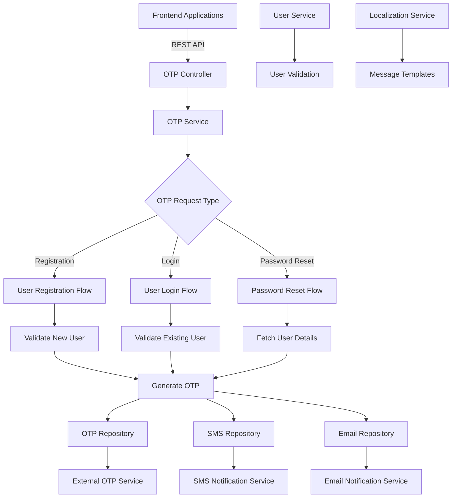

### Core Components

- **OTP Controller**: REST endpoints for OTP operations
- **OTP Service**: Business logic for different OTP flows
- **OTP Repository**: OTP generation and external service integration
- **SMS/Email Repositories**: Multi-channel notification delivery
- **User Integration**: User validation and lookup
- **Localization Support**: Multi-language OTP messages

## API Documentation

### Base URL: `/user-otp`

#### 1. Send OTP
- **Endpoint**: `POST /v1/_send`
- **Description**: Generates and sends OTP for authentication scenarios
- **Authentication**: Public endpoint for registration, validated for other operations

**Request Body**:
```json
{
  "RequestInfo": {
    "apiId": "user-otp",
    "ver": "1.0",
    "ts": 1234567890,
    "action": "send",
    "did": "1",
    "key": "abcd-efgh",
    "msgId": "send otp request",
    "authToken": "{{token}}"
  },
  "otp": {
    "mobileNumber": "9876543210",
    "tenantId": "od.testing",
    "type": "login",
    "userType": "CITIZEN"
  }
}
```

**Response**:
```json
{
  "ResponseInfo": {
    "apiId": "user-otp",
    "ver": "1.0",
    "ts": 1234567890,
    "resMsgId": "uief87324",
    "msgId": "send otp request",
    "status": "successful"
  },
  "successful": true
}
```

### OTP Types Supported

#### 1. Registration OTP
- **Type**: `register`
- **Purpose**: New user account creation
- **Validation**: Ensures user doesn't already exist
- **Delivery**: SMS only (no email for new users)

#### 2. Login OTP
- **Type**: `login`
- **Purpose**: Existing user authentication
- **Validation**: Ensures user exists in system
- **Delivery**: SMS + Email (if configured)

#### 3. Password Reset OTP
- **Type**: `passwordreset`
- **Purpose**: Password recovery for existing users
- **Validation**: Validates user existence and mobile number
- **Delivery**: SMS + Email

### Error Handling

All APIs follow standard error response format:

```json
{
  "ResponseInfo": {
    "apiId": "user-otp",
    "ver": "1.0",
    "ts": 1234567890,
    "resMsgId": "uief87324",
    "msgId": "send otp request",
    "status": "failed"
  },
  "Errors": [
    {
      "code": "USER_ALREADY_EXISTS",
      "message": "User already exists in system",
      "description": "Cannot register existing user"
    }
  ]
}
```

## Domain Models & Data Structures

### Core Entities

#### OtpRequest (Web Contract)
```java
public class OtpRequest {
    private RequestInfo requestInfo;
    private Otp otp;
    
    public org.egov.domain.model.OtpRequest toDomain() {
        return org.egov.domain.model.OtpRequest.builder()
            .mobileNumber(getMobileNumber())
            .tenantId(getTenantId())
            .type(getType())
            .userType(getUserType())
            .requestInfo(getRequestInfo())
            .build();
    }
}
```

#### Otp (Web Model)
```java
public class Otp {
    private String mobileNumber;
    private String tenantId;
    private String type;
    private String userType;
    
    public OtpRequestType getTypeOrDefault() {
        return type != null ? 
            OtpRequestType.fromValue(type) : 
            OtpRequestType.REGISTER;
    }
}
```

#### OtpRequest (Domain Model)
```java
public class OtpRequest {
    private String mobileNumber;
    private String tenantId;
    private OtpRequestType type;
    private String userType;
    private RequestInfo requestInfo;
    
    public void validate() {
        // Validation logic for required fields
    }
    
    public boolean isRegistrationRequestType() {
        return type == OtpRequestType.REGISTER;
    }
    
    public boolean isLoginRequestType() {
        return type == OtpRequestType.LOGIN;
    }
}
```

#### User (Domain Model)
```java
public class User {
    private String uuid;
    private String userName;
    private String name;
    private String mobileNumber;
    private String email;
    private String type;
    private String tenantId;
}
```

### OTP Types and Flows

#### OtpRequestType Enum
```java
public enum OtpRequestType {
    REGISTER("register"),
    LOGIN("login"),
    PASSWORDRESET("passwordreset");
    
    private final String value;
    
    public static OtpRequestType fromValue(String value) {
        // Implementation for string to enum conversion
    }
}
```

### Validation Rules

- **Mobile Number**: Must be 10 digits, can start with 6-9
- **Tenant ID**: Must be valid as per system configuration
- **User Type**: Must be valid user type (CITIZEN, EMPLOYEE, etc.)
- **Registration**: User must not exist for registration OTP
- **Login/Reset**: User must exist for login/password reset OTP

## Database Design

### External Service Integration

The User OTP service is stateless and integrates with external services for OTP generation and storage.

#### Service Integration Architecture
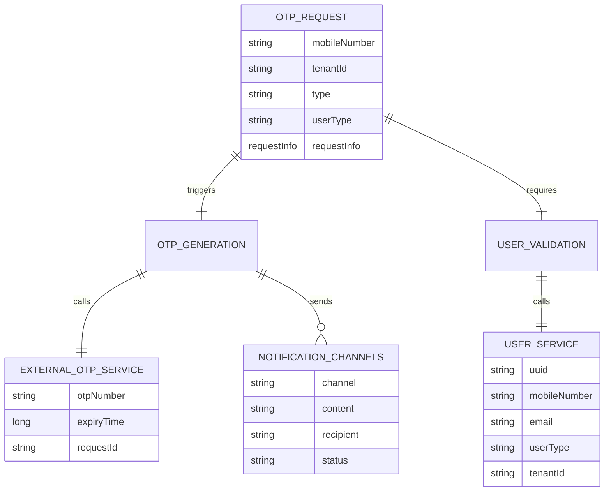

### Data Flow Architecture

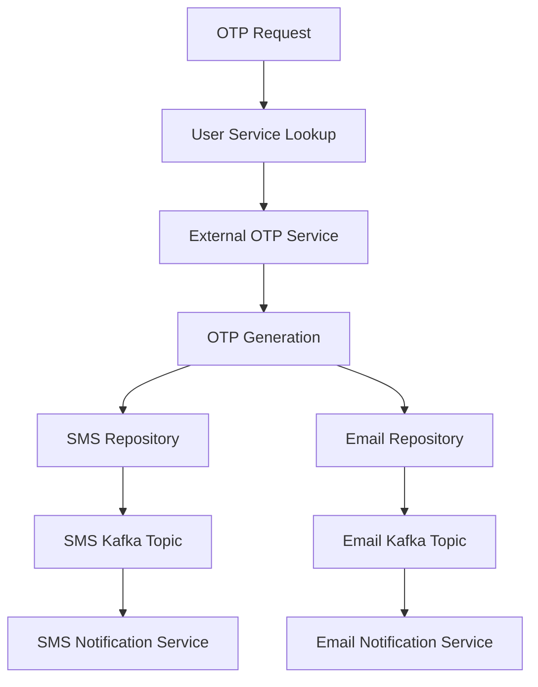

## Configuration & Application Properties

### Server Configuration
```properties
server.port=8080
server.contextPath=/user-otp
server.servlet.context-path=/user-otp
```

### External Service URLs
```properties
# OTP Generation Service
otp.host=http://localhost:8089/otp
otp.create.url=/v1/_create

# User Service
user.host=http://localhost:8081/
search.user.url=/user/_search

# Localization Service
egov.localisation.host=https://dev.digit.org
egov.localisation.search.endpoint=/localization/messages/v1/_search
egov.localisation.tenantid.strip.suffix.count=1
```

### Kafka Configuration
```properties
spring.kafka.bootstrap.servers=localhost:9092
spring.kafka.producer.key-serializer=org.apache.kafka.common.serialization.StringSerializer
spring.kafka.producer.value-serializer=org.springframework.kafka.support.serializer.JsonSerializer

# Notification Topics
sms.topic=egov.core.notification.sms.otp
email.topic=egov.core.notification.email
works.notification.sms.topic=works.notification.sms
```

### Business Configuration
```properties
# OTP Configuration
expiry.time.for.otp=3000

# Notification Configuration
sms.isAdditonalFieldRequired=true
```

## Service Dependencies

### Internal DIGIT Services

1. **External OTP Service** (`otp.host`)
   - **Purpose**: Generate and validate OTP numbers
   - **APIs Used**: `/v1/_create`
   - **Usage**: OTP generation with expiry management

2. **User Service** (`user.host`)
   - **Purpose**: User validation and information lookup
   - **APIs Used**: `/user/_search`
   - **Usage**: Validate user existence for different OTP flows

3. **Localization Service** (`egov.localisation.host`)
   - **Purpose**: Multi-language OTP message templates
   - **APIs Used**: `/localization/messages/v1/_search`
   - **Usage**: Localized OTP SMS and email content

4. **Notification Services**
   - **SMS Notification**: Through Kafka topics
   - **Email Notification**: Through Kafka topics
   - **Usage**: Multi-channel OTP delivery

### External Dependencies

1. **Kafka Message Broker**
   - **Purpose**: Asynchronous notification delivery
   - **Topics**: `egov.core.notification.sms.otp`, `egov.core.notification.email`
   - **Usage**: Decoupled notification processing

## Events & Messaging

### Notification Events

#### SMS Notification Event
```json
{
  "message": "Your OTP for login is: 123456. Valid for 5 minutes.",
  "mobileNumber": "9876543210",
  "category": "OTP",
  "expiryTime": 1234567890,
  "additionalFields": {
    "templateCode": "OTP_LOGIN",
    "requestInfo": {...},
    "tenantId": "od.testing"
  }
}
```

#### Email Notification Event
```json
{
  "email": {
    "emailTo": ["user@example.com"],
    "subject": "OTP for Account Verification",
    "body": "Your OTP is: 123456. Please use this to complete verification.",
    "isHTML": false
  },
  "requestInfo": {...}
}
```

### Event Processing Patterns

#### OTP Send Flow
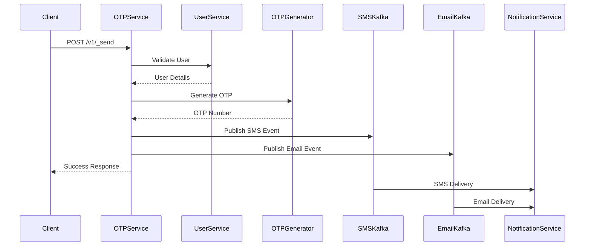

## Execution & Business Flows

### 1. User Registration OTP Flow

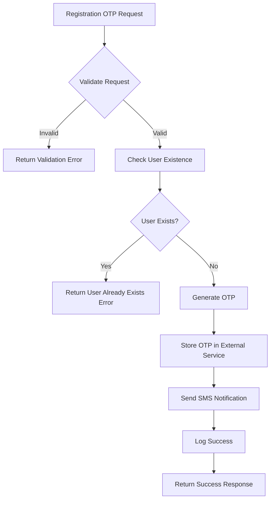

### 2. User Login OTP Flow

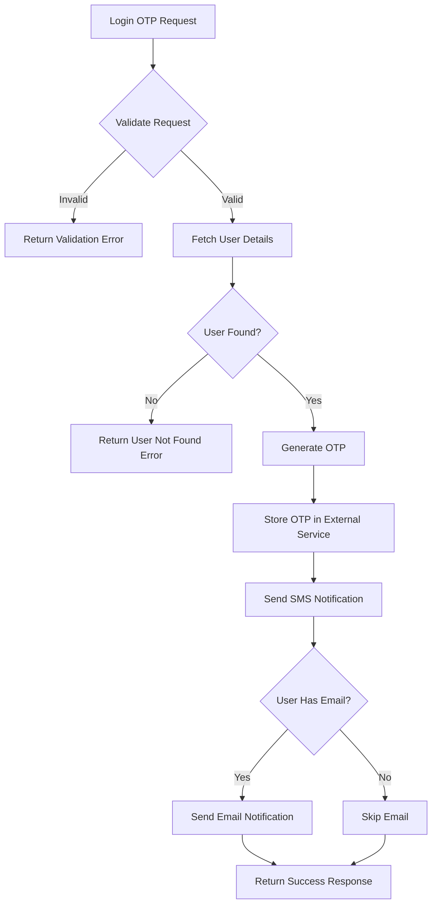

### 3. Password Reset OTP Flow

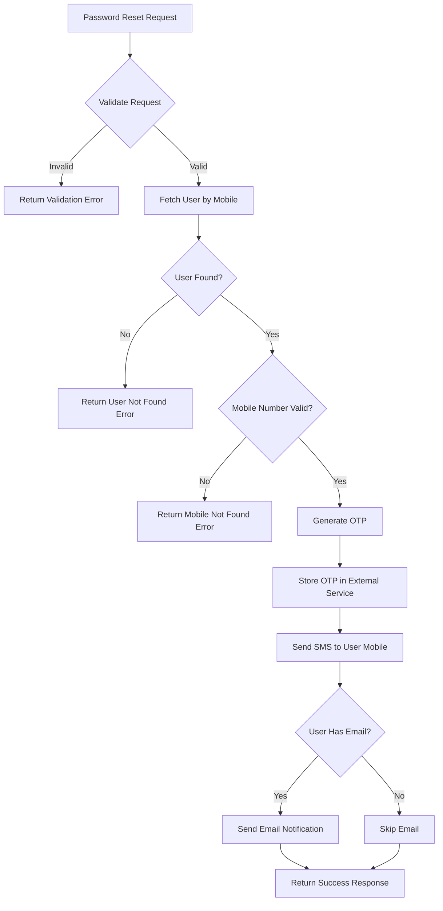

### 4. Multi-Channel Notification Flow

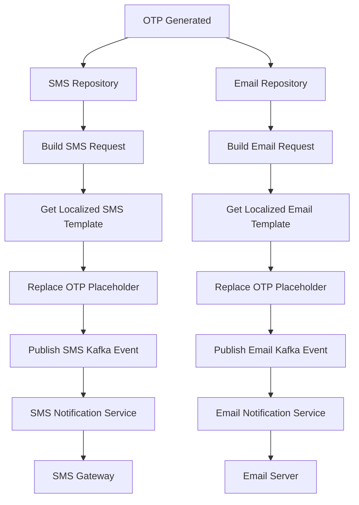

## Security Considerations

### Authentication & Authorization

1. **Public Registration Endpoint**
   - Registration OTP endpoint is public to allow new user registration
   - Rate limiting to prevent abuse
   - Input validation for security

2. **Authenticated Operations**
   - Login and password reset require basic request validation
   - Tenant-based access control
   - User type validation

3. **OTP Security**
   - Time-bound OTP validity (configurable expiry)
   - External OTP service for secure generation
   - No local OTP storage

### Input Validation

1. **Mobile Number Validation**
   - Format validation for Indian mobile numbers
   - Length and pattern checking
   - Sanitization of input

2. **Request Validation**
   - Required field validation
   - Type validation for enum fields
   - Tenant ID validation

3. **User Validation**
   - User existence checks based on OTP type
   - Mobile number ownership validation
   - User type consistency checking

### Data Protection

1. **Privacy Protection**
   - No storage of OTP numbers in service
   - Secure communication with external OTP service
   - Minimal logging of sensitive data

2. **Communication Security**
   - HTTPS for external service calls
   - Secure Kafka message transmission
   - Encrypted OTP delivery through SMS/Email

## API Flow Diagrams

### 1. Send OTP API Flow

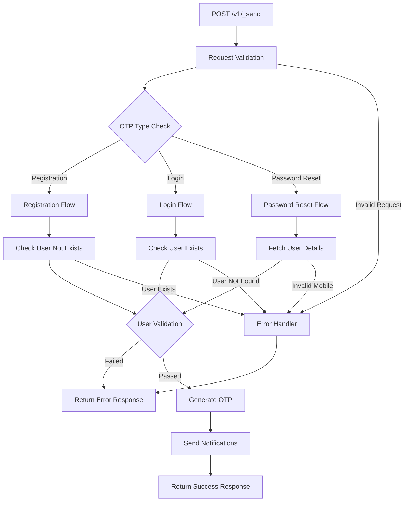

### 2. Multi-Channel Notification Flow

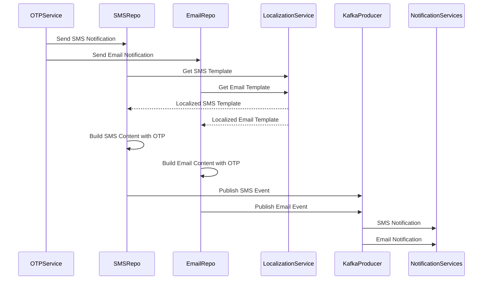

### 3. User Validation Flow

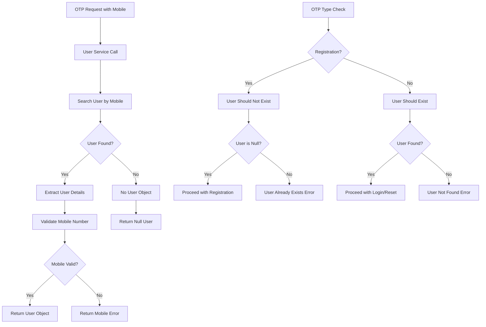

### 4. Error Handling Flow

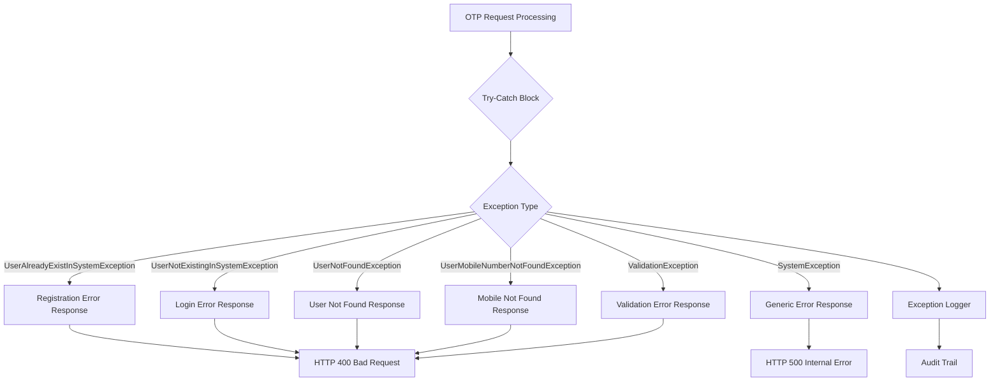

This comprehensive documentation provides detailed insights into the User OTP Service's authentication flow, multi-channel notification delivery, external service integration, and secure OTP management for DIGIT Works platform.