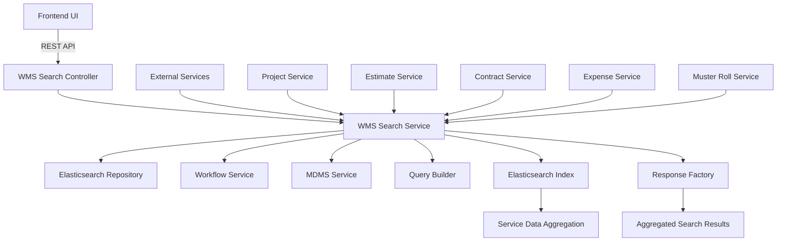
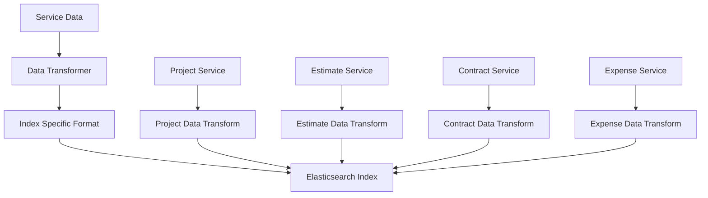
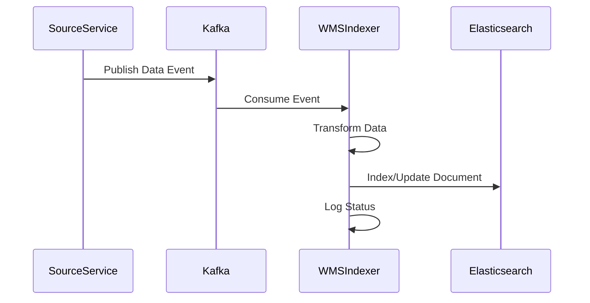
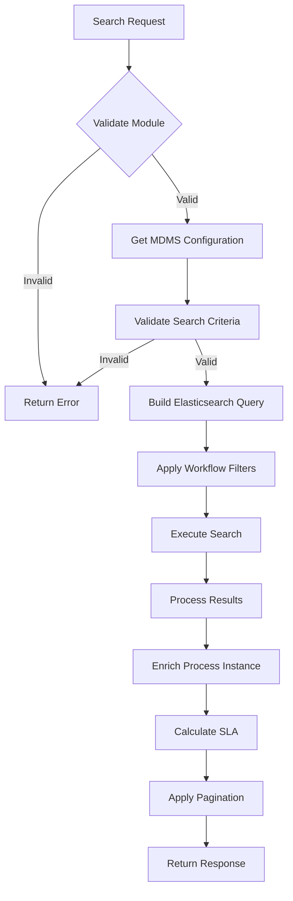
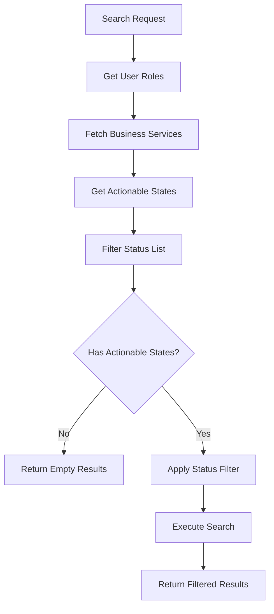
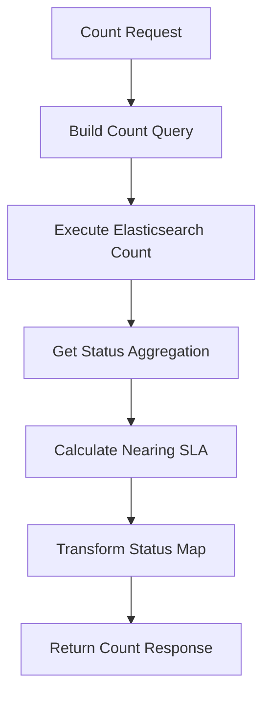
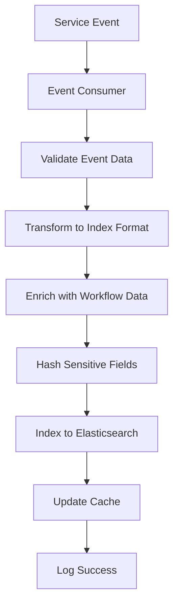
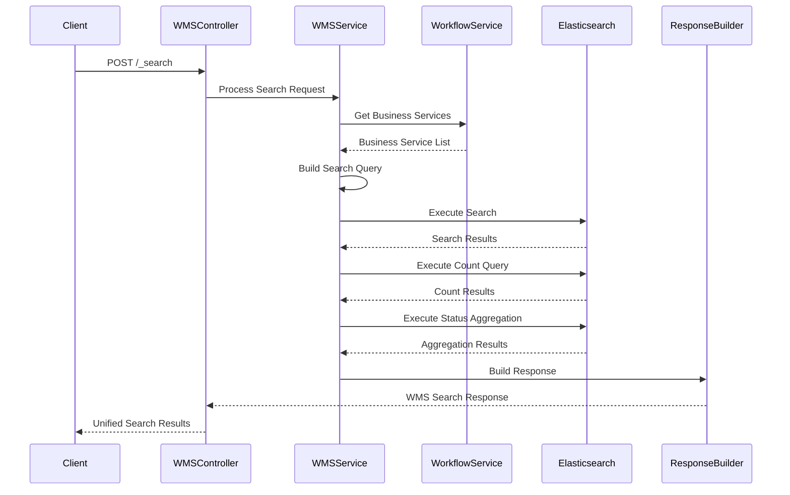
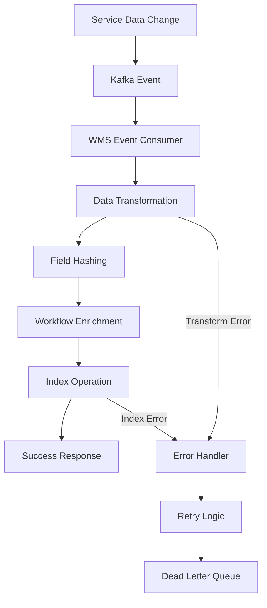
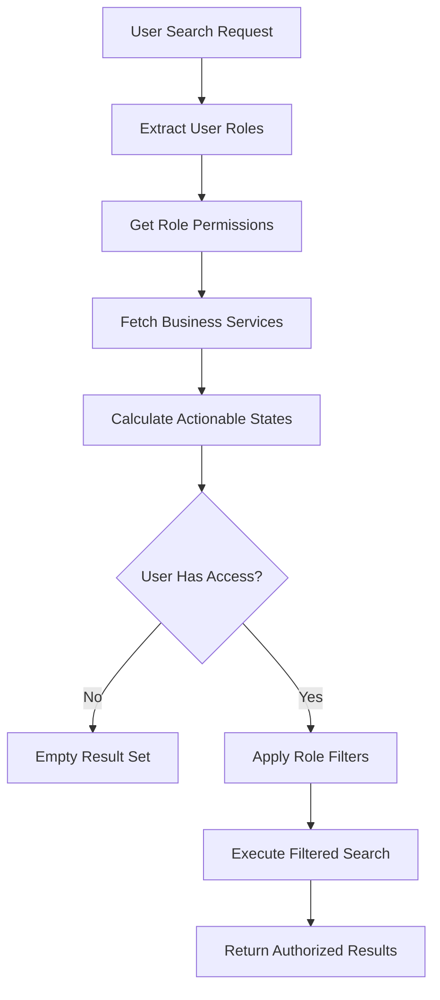

# WMS Service Documentation

## Table of Contents
1. [System & Architecture Overview](#system--architecture-overview)
2. [API Documentation](#api-documentation)
3. [Domain Models & Data Structures](#domain-models--data-structures)
4. [Database Design](#database-design)
5. [Configuration & Application Properties](#configuration--application-properties)
6. [Service Dependencies](#service-dependencies)
7. [Events & Messaging](#events--messaging)
8. [Execution & Business Flows](#execution--business-flows)
9. [Security Considerations](#security-considerations)
10. [API Flow Diagrams](#api-flow-diagrams)

## System & Architecture Overview

The WMS (Works Management System) Service is a Spring Boot microservice that provides comprehensive search and aggregation functionality for the DIGIT Works platform. It acts as a unified inbox service that aggregates data from multiple services and provides complex search capabilities with workflow integration.



### Core Components

- **Search Controller**: REST endpoints for unified search operations
- **Search Service**: Business logic for complex search and aggregation
- **Query Builder**: Dynamic query construction for Elasticsearch
- **Workflow Integration**: Status-based filtering and role-based access
- **MDMS Integration**: Configuration-driven search parameters
- **Elasticsearch Repository**: High-performance search operations

## API Documentation

### Base URL: `/wms/{module}`

#### 1. Unified Search
- **Endpoint**: `POST /{module}/_search`
- **Description**: Provides unified search across all DIGIT Works modules
- **Authentication**: Required (JWT token)

**Request Body**:
```json
{
  "RequestInfo": {
    "apiId": "wms-search",
    "ver": "1.0",
    "ts": 1234567890,
    "action": "search",
    "did": "1",
    "key": "abcd-efgh",
    "msgId": "search request",
    "authToken": "{{token}}"
  },
  "inbox": {
    "tenantId": "od.testing",
    "processSearchCriteria": {
      "businessService": ["PROJECT-APPROVAL", "ESTIMATE-APPROVAL"],
      "moduleName": "project-management-system",
      "status": ["PENDINGFORAPPROVAL", "PENDINGFORVERIFICATION"],
      "assignee": "user-uuid"
    },
    "moduleSearchCriteria": {
      "ward": ["WARD001", "WARD002"],
      "locality": ["LOC001"],
      "projectType": "ROAD",
      "projectSubType": "CC_ROAD",
      "createdFrom": 1234567890,
      "createdTo": 1234567899
    },
    "limit": 50,
    "offset": 0,
    "sortBy": "createdTime",
    "sortOrder": "DESC"
  }
}
```

**Response**:
```json
{
  "ResponseInfo": {
    "apiId": "wms-search",
    "ver": "1.0",
    "ts": 1234567890,
    "resMsgId": "uief87324",
    "msgId": "search request",
    "status": "successful"
  },
  "totalCount": 150,
  "nearingSlaCount": 25,
  "statusMap": [
    {
      "count": 50,
      "applicationStatus": "PENDING_FOR_APPROVAL",
      "businessservice": "PROJECT-APPROVAL",
      "statusid": "status-uuid-1"
    },
    {
      "count": 30,
      "applicationStatus": "PENDING_FOR_VERIFICATION", 
      "businessservice": "ESTIMATE-APPROVAL",
      "statusid": "status-uuid-2"
    }
  ],
  "items": [
    {
      "processInstance": {
        "id": "process-uuid",
        "businessId": "project-uuid",
        "businessService": "PROJECT-APPROVAL",
        "moduleName": "project-management-system",
        "state": {
          "uuid": "state-uuid",
          "state": "PENDINGFORAPPROVAL",
          "applicationStatus": "PENDING_FOR_APPROVAL"
        },
        "assignee": {
          "uuid": "user-uuid",
          "name": "John Doe"
        },
        "sla": 5
      },
      "businessObject": {
        "id": "project-uuid",
        "tenantId": "od.testing",
        "projectNumber": "PJ/2023-24/000001",
        "name": "Road Construction Project",
        "projectType": "ROAD",
        "projectSubType": "CC_ROAD",
        "ward": "WARD001",
        "locality": "LOC001",
        "estimateAmount": 500000.00,
        "serviceSla": 7,
        "auditDetails": {
          "createdBy": "creator-uuid",
          "createdTime": 1234567890,
          "lastModifiedBy": "modifier-uuid",
          "lastModifiedTime": 1234567890
        }
      }
    }
  ]
}
```

### Error Handling

All APIs follow standard error response format:

```json
{
  "ResponseInfo": {
    "apiId": "wms-search",
    "ver": "1.0",
    "ts": 1234567890,
    "resMsgId": "uief87324",
    "msgId": "search request",
    "status": "failed"
  },
  "Errors": [
    {
      "code": "INVALID_SEARCH_CRITERIA",
      "message": "Invalid search parameters provided",
      "description": "Module not found in MDMS configuration"
    }
  ]
}
```

## Domain Models & Data Structures

### Core Entities

#### WMSSearchRequest
```java
public class WMSSearchRequest {
    private RequestInfo RequestInfo;
    private WMSSearchCriteria inbox;
}
```

#### WMSSearchCriteria
```java
public class WMSSearchCriteria {
    private String tenantId;
    private ProcessInstanceSearchCriteria processSearchCriteria;
    private Map<String, Object> moduleSearchCriteria;
    private Integer limit;
    private Integer offset;
    private String sortBy;
    private String sortOrder;
}
```

#### ProcessInstanceSearchCriteria
```java
public class ProcessInstanceSearchCriteria {
    private List<String> businessService;
    private String moduleName;
    private List<String> status;
    private String assignee;
    private String businessId;
    private Long fromDate;
    private Long toDate;
    private String tenantId;
}
```

#### WMSSearch
```java
public class WMSSearch {
    private ProcessInstance processInstance;
    private Map<String, Object> businessObject;
}
```

#### WMSSearchResponse
```java
public class WMSSearchResponse {
    private List<WMSSearch> items;
    private Integer totalCount;
    private Integer nearingSlaCount;
    private List<HashMap<String, Object>> statusMap;
}
```

### Validation Rules

- **Tenant ID**: Must be valid as per MDMS configuration
- **Module**: Must exist in WMS module configuration
- **Business Service**: Must be valid workflow business service
- **Search Criteria**: Module-specific validation based on MDMS config
- **Pagination**: Limit must not exceed maximum configured value
- **Sort Parameters**: Must be valid searchable fields

### Configuration Model

```java
public class SearchQueryConfiguration {
    private String index;
    private List<SearchParam> allowedSearchCriteria;
    private List<String> sortableFields;
    private GroupBy groupBy;
}

public class SearchParam {
    private String name;
    private String dataType;
    private Boolean isHashingRequired;
    private Boolean isMandatory;
    private String operator;
}
```

## Database Design

### Elasticsearch Indices

The WMS service uses Elasticsearch for high-performance search operations across aggregated data.

#### Works Index Structure
```json
{
  "mappings": {
    "properties": {
      "Data": {
        "properties": {
          "tenantId": {"type": "keyword"},
          "id": {"type": "keyword"},
          "businessService": {"type": "keyword"},
          "moduleName": {"type": "keyword"},
          "applicationStatus": {"type": "keyword"},
          "ward": {"type": "keyword"},
          "locality": {"type": "keyword"},
          "projectType": {"type": "keyword"},
          "projectNumber": {"type": "keyword"},
          "estimateNumber": {"type": "keyword"},
          "contractNumber": {"type": "keyword"},
          "musterRollNumber": {"type": "keyword"},
          "createdTime": {"type": "long"},
          "lastModifiedTime": {"type": "long"},
          "currentProcessInstance": {
            "properties": {
              "state": {"type": "keyword"},
              "assignee": {"type": "keyword"},
              "businessService": {"type": "keyword"},
              "sla": {"type": "long"}
            }
          }
        }
      }
    }
  }
}
```

### Index Naming Convention

- **Pattern**: `{environment}-{module}-{version}`
- **Examples**: 
  - `works-project-v1`
  - `works-estimate-v1`
  - `works-contract-v1`
  - `works-expense-v1`

### Data Aggregation Strategy



## Configuration & Application Properties

### Server Configuration
```properties
server.context-path=/wms
server.servlet.context-path=/wms
server.port=9011
app.timezone=GMT+5:30
```

### Database Configuration
```properties
spring.datasource.driver-class-name=org.postgresql.Driver
spring.datasource.url=jdbc:postgresql://localhost:5432/digit-works
spring.datasource.username=postgres
spring.datasource.password=root
spring.flyway.enabled=false
```

### Elasticsearch Configuration
```properties
services.esindexer.host=http://localhost:9200/
egov.services.esindexer.host.search=/_search
management.health.elasticsearch.enabled=false

egov.es.username=egov-admin
egov.es.password=TUSYns9mEcRPy77n

# Search Configuration
es.search.pagination.default.limit=50
es.search.pagination.default.offset=0
es.search.pagination.max.search.limit=1000
es.search.default.sort.order=desc
```

### Workflow Configuration
```properties
workflow.host=https://works-dev.digit.org
workflow.process.search.path=/egov-workflow-v2/egov-wf/process/_search
workflow.businessservice.search.path=/egov-workflow-v2/egov-wf/businessservice/_search
workflow.process.count.path=/egov-workflow-v2/egov-wf/process/_count
workflow.process.statuscount.path=/egov-workflow-v2/egov-wf/process/_statuscount
workflow.process.nearing.sla.count.path=/egov-workflow-v2/egov-wf/process/_nearingslacount
```

### MDMS Configuration
```properties
egov.mdms.host=https://works-dev.digit.org
egov.mdms.search.endpoint=/egov-mdms-service/v1/_search
```

### Business Configuration
```properties
parent.level.tenant.id=pg
state.level.tenantid.length=2
is.environment.central.instance=false
state.level.tenant.id=pg
cache.expiry.minutes=10
```

## Service Dependencies

### Internal DIGIT Services

1. **Workflow Service** (`workflow.host`)
   - **Purpose**: Get workflow status information and role-based access
   - **APIs Used**: `/egov-workflow-v2/egov-wf/process/_search`, `/egov-workflow-v2/egov-wf/businessservice/_search`
   - **Usage**: Filter results based on user roles and workflow status

2. **MDMS Service** (`egov.mdms.host`)
   - **Purpose**: Get search configuration and master data
   - **APIs Used**: `/egov-mdms-service/v1/_search`
   - **Usage**: Module-specific search parameter configuration

3. **All Works Services**
   - **Purpose**: Data source for aggregated search
   - **Integration**: Through Elasticsearch indexing
   - **Usage**: Unified search across project, estimate, contract, expense data

### External Dependencies

1. **Elasticsearch Cluster**
   - **Purpose**: High-performance search and aggregation
   - **Connection**: HTTP REST API
   - **Usage**: Store aggregated data and execute complex queries

2. **PostgreSQL Database**
   - **Purpose**: Configuration and metadata storage
   - **Connection**: JDBC connection pool
   - **Usage**: Store service configurations and cache data

3. **Redis Cache** (Optional)
   - **Purpose**: Performance optimization
   - **Usage**: Cache frequently accessed search configurations

## Events & Messaging

### Data Indexing Events

The WMS service consumes events from all Works services to maintain up-to-date search indices.

#### Data Sync Topics
- **save-project**: Index project data
- **update-project**: Update project indices
- **save-estimate**: Index estimate data
- **update-estimate**: Update estimate indices
- **save-contract**: Index contract data
- **update-contract**: Update contract indices

#### Event Processing Pattern



## Execution & Business Flows

### 1. Unified Search Flow



### 2. Role-Based Filtering Flow



### 3. Aggregation and Count Flow



### 4. Data Indexing Flow



## Security Considerations

### Authentication & Authorization

1. **JWT Token Validation**
   - All APIs require valid JWT token in Authorization header
   - Token validation through `RequestInfo.authToken`
   - Integration with DIGIT user service for token validation

2. **Role-Based Data Filtering**
   - **EMPLOYEE**: Can see assigned tasks and own department data
   - **SUPERVISORY**: Can see team assignments and departmental data
   - **ADMIN**: Can see all data within tenant
   - **SUPERUSER**: Cross-tenant access for system administration

3. **Tenant Isolation**
   - All search operations are scoped to tenant ID
   - Cross-tenant data access not allowed
   - Index-level tenant segregation

### Data Protection

1. **Sensitive Data Handling**
   - PII fields are hashed before indexing
   - Configuration-driven field hashing
   - Audit trail for all search operations

2. **Search Query Security**
   - Parameterized query building
   - Input sanitization for Elasticsearch queries
   - SQL injection prevention in PostgreSQL queries

3. **Configuration Security**
   - MDMS-driven search parameter validation
   - Whitelist approach for allowed search fields
   - Dynamic query validation

### Performance Security

1. **Query Limits**
   - Maximum search limit enforcement
   - Pagination requirements
   - Result size monitoring

2. **Resource Protection**
   - Elasticsearch query timeouts
   - Connection pooling
   - Circuit breaker patterns

## API Flow Diagrams

### 1. Unified Search API Flow

```mermaid
flowchart TD
    A[POST /{module}/_search] --> B[Authentication Check]
    B --> C[Module Validation]
    C --> D[MDMS Config Retrieval]
    D --> E[Search Criteria Validation]
    E --> F[Workflow Service Integration]
    F --> G[Role-Based Filtering]
    G --> H[Query Builder]
    H --> I[Elasticsearch Execution]
    I --> J[Result Processing]
    J --> K[Response Generation]
    
    L[Error Handler] --> M[Error Response]
    C -->|Module Not Found| L
    E -->|Invalid Criteria| L
    F -->|Workflow Error| L
    I -->|Search Error| L
```

### 2. Complex Aggregation Flow



### 3. Data Indexing Flow



### 4. Role-Based Access Flow



This comprehensive documentation provides detailed insights into the WMS Service's architecture, unified search capabilities, Elasticsearch integration, workflow filtering, and complex aggregation functionality for DIGIT Works platform.