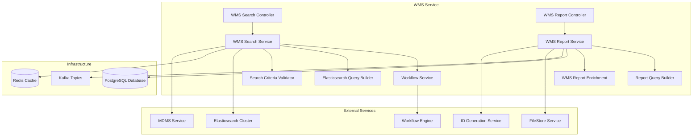
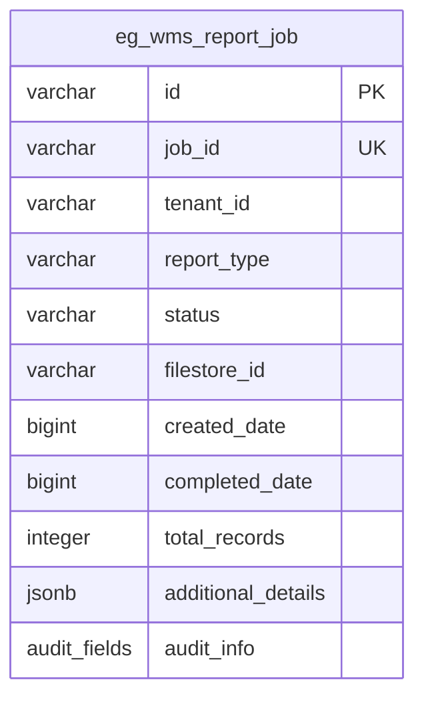
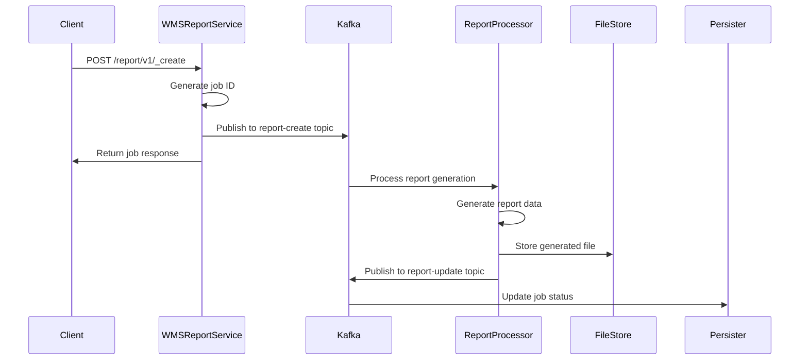
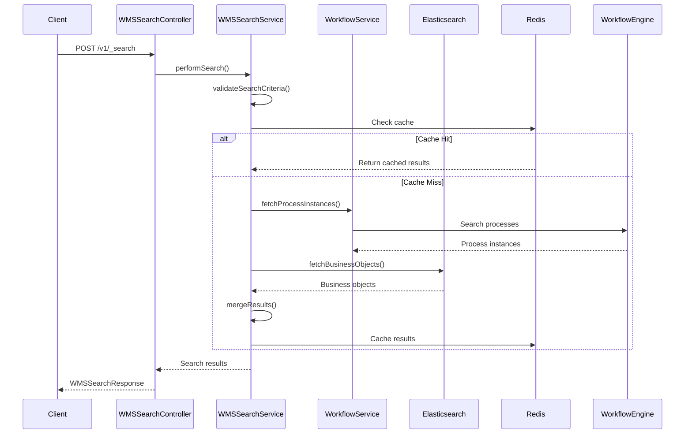
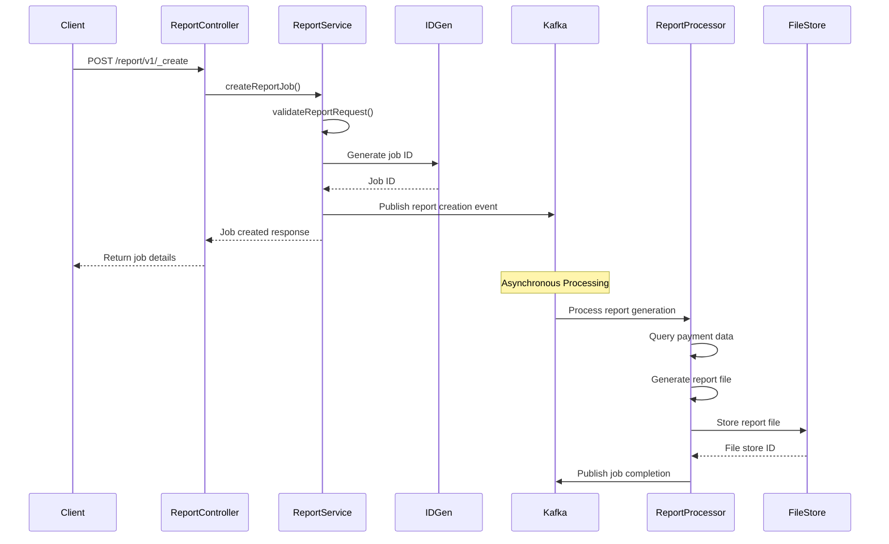
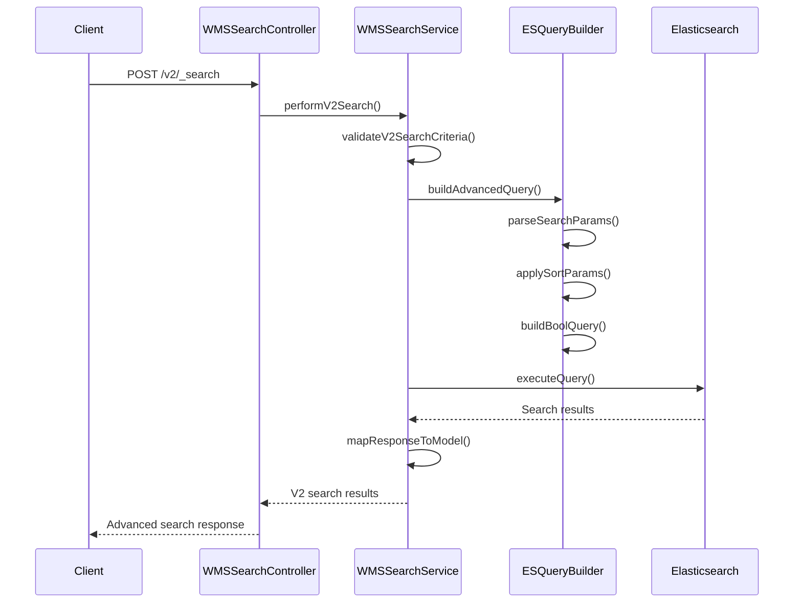
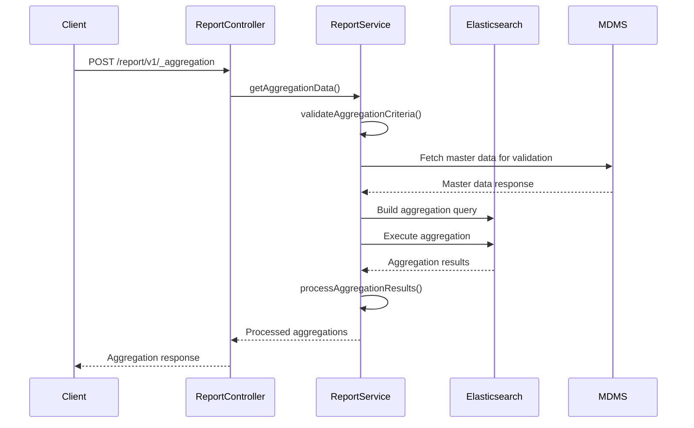
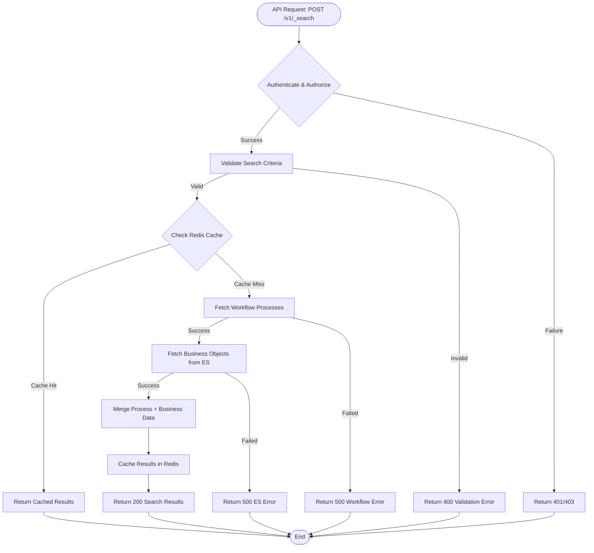
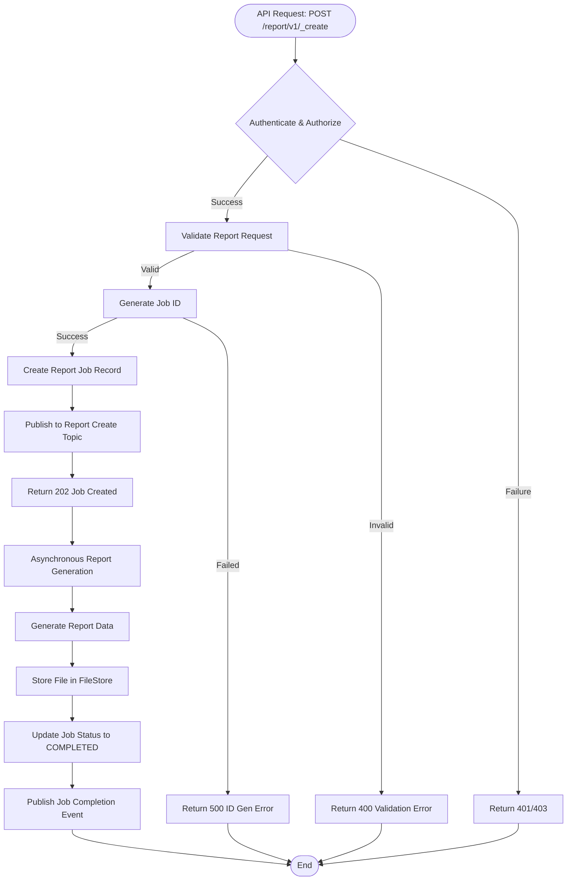

# WMS (Workflow Management and Search) Service - Technical Documentation

## Table of Contents
1. [System & Architecture Overview](#system--architecture-overview)
2. [API Documentation](#api-documentation)
3. [Domain Models & Data Structures](#domain-models--data-structures)
4. [Database Design](#database-design)
5. [Configuration & Application Properties](#configuration--application-properties)
6. [Service Dependencies](#service-dependencies)
7. [Events & Messaging](#events--messaging)
8. [Execution & Business Flows](#execution--business-flows)
9. [Security Considerations](#security-considerations)
10. [API Flow Diagrams](#api-flow-diagrams)

## System & Architecture Overview

The WMS (Workflow Management and Search) Service is a comprehensive service within the DIGIT Works platform that provides advanced search capabilities, workflow process management, and reporting functionality. Built on Spring Boot 3.x with Java 17, it integrates with Elasticsearch for advanced search, Redis for caching, and PostgreSQL for report storage.

### High-Level Architecture



### Component Responsibilities

- **Search Controller**: Handles workflow and business object search requests
- **Report Controller**: Manages payment tracking reports and job management
- **Search Service**: Core search logic with Elasticsearch integration
- **Report Service**: Report generation and management
- **Workflow Service**: Workflow process integration and status management
- **ES Query Builder**: Elasticsearch query construction for complex searches
- **Report Query Builder**: SQL query building for reporting
- **Validator**: Search criteria validation
- **Enrichment**: Report data enrichment with external service data

### Key Features

1. **Advanced Search**: Elasticsearch-powered search across workflow processes
2. **Report Generation**: Comprehensive payment tracking and project reports
3. **Workflow Integration**: Deep integration with DIGIT workflow engine
4. **Caching**: Redis-based caching for performance optimization
5. **Aggregations**: Payment aggregations and statistical reporting
6. **Job Management**: Asynchronous report generation with job tracking

## API Documentation

### Base Information
- **Context Path**: `/wms`
- **Port**: `9011`
- **API Version**: `v1` & `v2`

### Authentication & Authorization
- Uses JWT token-based authentication
- Role-based access control for search and reporting operations
- Tenant-based data isolation with state-level tenant support

### REST Endpoints

#### WMS Search APIs

##### 1. Workflow Search

**Endpoint**: `POST /wms/v1/_search`

**Description**: Searches workflow processes with business object details.

**Request Schema**:
```json
{
  "RequestInfo": {
    "apiId": "wms-search",
    "ver": "1.0",
    "ts": "timestamp",
    "userInfo": {...}
  },
  "inbox": {
    "tenantId": "string (required)",
    "processSearchCriteria": {
      "businessService": ["string"],
      "moduleName": "string",
      "tenantId": "string",
      "status": ["string"],
      "assignedTo": ["string"],
      "ids": ["string"]
    },
    "moduleSearchCriteria": {
      // Module specific search criteria
    },
    "limit": "number (default: 10)",
    "offset": "number (default: 0)"
  }
}
```

##### 2. V2 Search with Advanced Query

**Endpoint**: `POST /wms/v2/_search`

**Description**: Advanced search with configurable query parameters.

**Request Schema**:
```json
{
  "RequestInfo": {...},
  "searchCriteria": {
    "tenantId": "string (required)",
    "module": "string",
    "searchParams": [
      {
        "key": "string",
        "value": "string|array",
        "operation": "EQUAL|IN|LIKE|RANGE"
      }
    ],
    "sortParams": [
      {
        "key": "string",
        "order": "ASC|DESC"
      }
    ]
  },
  "pagination": {
    "limit": "number",
    "offset": "number"
  }
}
```

#### Report APIs

##### 1. Create Report Job

**Endpoint**: `POST /wms/report/v1/_create`

**Description**: Creates asynchronous report generation job.

**Request Schema**:
```json
{
  "RequestInfo": {...},
  "reportRequest": {
    "tenantId": "string (required)",
    "reportType": "PAYMENT_TRACKER|PROJECT_REPORT",
    "searchCriteria": {
      "tenantId": "string",
      "projectIds": ["string"],
      "fromDate": "bigint",
      "toDate": "bigint"
    },
    "reportFormat": "PDF|EXCEL|CSV"
  }
}
```

##### 2. Search Report Jobs

**Endpoint**: `POST /wms/report/v1/_search`

**Description**: Searches report generation jobs and status.

**Request Schema**:
```json
{
  "RequestInfo": {...},
  "reportSearchCriteria": {
    "tenantId": "string (required)",
    "jobIds": ["string"],
    "reportType": "string",
    "status": ["INPROGRESS|COMPLETED|FAILED"]
  },
  "pagination": {
    "limit": "number (default: 10)",
    "offset": "number (default: 0)"
  }
}
```

##### 3. Payment Aggregation

**Endpoint**: `POST /wms/report/v1/_aggregation`

**Description**: Provides payment aggregations and statistics.

**Request Schema**:
```json
{
  "RequestInfo": {...},
  "aggregationSearchCriteria": {
    "tenantId": "string (required)",
    "module": "payment-tracker|estimate",
    "aggregationType": "SUM|COUNT|AVG",
    "groupBy": ["field1", "field2"],
    "filters": {
      "projectId": ["string"],
      "billType": ["EXPENSE.WAGES|EXPENSE.PURCHASE|EXPENSE.SUPERVISION"]
    }
  }
}
```

### Response Schemas

#### WMS Search Response
```json
{
  "ResponseInfo": {...},
  "items": [
    {
      "ProcessInstance": {
        "id": "string",
        "tenantId": "string",
        "businessService": "string",
        "businessId": "string",
        "status": "string",
        "state": {...}
      },
      "businessObject": {
        // Module specific business object data
      },
      "serviceObject": {
        // Additional service specific data
      }
    }
  ],
  "totalCount": "number"
}
```

#### Report Response
```json
{
  "ResponseInfo": {...},
  "reportJobs": [
    {
      "id": "string",
      "jobId": "string",
      "tenantId": "string",
      "reportType": "string",
      "status": "INPROGRESS|COMPLETED|FAILED",
      "filestoreId": "string",
      "createdDate": "bigint",
      "completedDate": "bigint",
      "totalRecords": "number"
    }
  ]
}
```

### Error Handling

**Common Error Codes**:
- `INVALID_SEARCH_CRITERIA`: Invalid search parameters
- `ES_CONNECTION_ERROR`: Elasticsearch connection failure
- `REPORT_GENERATION_FAILED`: Report generation failure
- `INVALID_TENANT`: Invalid tenant configuration

## Domain Models & Data Structures

### Core Domain Models

#### WMSSearch Entity
```java
public class WMSSearch {
    private ProcessInstance ProcessInstance;        // Workflow process data
    private Map<String, Object> businessObject;     // Business entity data
    private Map<String, Object> serviceObject;      // Service specific data
}
```

#### WMSSearchCriteria Entity
```java
public class WMSSearchCriteria {
    private String tenantId;                        // Required
    private ProcessSearchCriteria processSearchCriteria; // Workflow criteria
    private Object moduleSearchCriteria;           // Module specific criteria
    private Integer limit;                          // Default: 10
    private Integer offset;                         // Default: 0
}
```

#### ProcessSearchCriteria Entity
```java
public class ProcessSearchCriteria {
    private List<String> businessService;          // Business service codes
    private String moduleName;                     // Module name
    private String tenantId;                       // Tenant identifier
    private List<String> status;                   // Workflow statuses
    private List<String> assignedTo;               // Assigned user UUIDs
    private List<String> ids;                      // Process instance IDs
}
```

#### ReportJob Entity
```java
public class ReportJob {
    private String id;                             // UUID
    private String jobId;                          // Generated job ID
    private String tenantId;                       // Required
    private String reportType;                     // PAYMENT_TRACKER|PROJECT_REPORT
    private JobStatus status;                      // INPROGRESS|COMPLETED|FAILED
    private String filestoreId;                    // Generated file reference
    private BigDecimal createdDate;                // Creation timestamp
    private BigDecimal completedDate;              // Completion timestamp
    private Integer totalRecords;                  // Total records in report
    private Object additionalDetails;              // Extensible metadata
    private AuditDetails auditDetails;             // Audit information
}
```

#### AggregationRequest Entity
```java
public class AggregationRequest {
    private AggregationSearchCriteria aggregationSearchCriteria; // Search criteria
    private RequestInfo RequestInfo;               // Request context
}
```

#### V2 Search Models

```java
public class SearchParam {
    private String key;                            // Field name
    private Object value;                          // Search value
    private String operation;                      // EQUAL|IN|LIKE|RANGE
}

public class SortParam {
    private String key;                            // Field name
    private String order;                          // ASC|DESC
}
```

### Validation Rules

- **Search Criteria**:
  - tenantId: Required for all search operations
  - limit: Maximum 1000 for Elasticsearch queries
  - offset: Non-negative integer

- **Report Criteria**:
  - reportType: Must be valid enum value
  - dateRange: fromDate must be less than toDate
  - tenantId: Required and must be valid

### Enums

```java
public enum JobStatus {
    INPROGRESS, COMPLETED, FAILED
}

public enum ReportType {
    PAYMENT_TRACKER, PROJECT_REPORT
}

public enum SearchOperation {
    EQUAL, IN, LIKE, RANGE, GT, LT, GTE, LTE
}
```

## Database Design

### Tables Overview

#### eg_wms_report_job
Stores report generation job information.

```sql
CREATE TABLE eg_wms_report_job (
    id                      VARCHAR(256) PRIMARY KEY,
    job_id                  VARCHAR(128) UNIQUE NOT NULL,
    tenant_id               VARCHAR(64) NOT NULL,
    report_type             VARCHAR(64) NOT NULL,
    status                  VARCHAR(32) NOT NULL,
    filestore_id            VARCHAR(256),
    created_date            BIGINT NOT NULL,
    completed_date          BIGINT,
    total_records           INTEGER,
    additional_details      JSONB,
    created_by              VARCHAR(256) NOT NULL,
    last_modified_by        VARCHAR(256),
    created_time            BIGINT NOT NULL,
    last_modified_time      BIGINT NOT NULL
);
```

### Entity Relationship Diagram



### Indexes and Performance

**Primary Indexes**:
- `eg_wms_report_job`: id, job_id (unique)

**Secondary Indexes**:
- `index_eg_wms_report_job_tenantId`
- `index_eg_wms_report_job_status`
- `index_eg_wms_report_job_reportType`
- `index_eg_wms_report_job_createdDate`

## Configuration & Application Properties

### Environment-Specific Configuration

```properties
# Server Configuration
server.context-path=/wms
server.port=9011
app.timezone=GMT+5:30

# Database Configuration
spring.datasource.driver-class-name=org.postgresql.Driver
spring.datasource.url=jdbc:postgresql://localhost:5432/digit-works
spring.datasource.username=postgres
spring.datasource.password=1234
spring.flyway.enabled=true
spring.flyway.table=wms_report_schema

# Redis Configuration
spring.data.redis.host=localhost
spring.data.redis.port=6379

# Kafka Configuration
kafka.config.bootstrap_server_config=localhost:9092
spring.kafka.consumer.group-id=wms
spring.kafka.producer.value-serializer=org.springframework.kafka.support.serializer.JsonSerializer

# Workflow Service Configuration
workflow.host=https://unified-dev.digit.org
workflow.process.search.path=/egov-workflow-v2/egov-wf/process/_search
workflow.businessservice.search.path=/egov-workflow-v2/egov-wf/businessservice/_search
workflow.process.count.path=/egov-workflow-v2/egov-wf/process/_count
workflow.process.statuscount.path=/egov-workflow-v2/egov-wf/process/_statuscount
workflow.process.nearing.sla.count.path=/egov-workflow-v2/egov-wf/process/_nearingslacount

# MDMS Configuration
egov.mdms.host=https://unified-dev.digit.org
egov.mdms.search.endpoint=/mdms-v2/v1/_search

# Elasticsearch Configuration
egov.es.username=elastic
egov.es.password=ZDRlODI0MTA3MWZiMTFlZmFk
services.esindexer.host=https://localhost:9200/
egov.services.esindexer.host.search=/_search
management.health.elasticsearch.enabled=false

# Search Pagination Configuration
es.search.pagination.default.limit=50
es.search.pagination.default.offset=0
es.search.pagination.max.search.limit=1000
es.search.default.sort.order=desc

# Report Configuration
wms.kafka.report.create.topic=mukta-wms-payment-report-create
wms.kafka.report.update.topic=mukta-wms-payment-report-update
report.search.pagination.default.limit=10
report.search.pagination.default.offset=0

# Module Configuration
wms.payment.tracker.module=payment-tracker
wms.estimate.module=estimate

# ID Generation Configuration
egov.idgen.host=http://localhost:8080
egov.idgen.path=/egov-idgen/id/_generate
egov.idgen.report.id.name=works.report.number

# FileStore Configuration
egov.filestore.host=http://localhost:8083
egov.filestore.path=/filestore/v1/files

# State Configuration
state.level.tenantid.length=2
is.environment.central.instance=false
state.level.tenant.id=pg
parent.level.tenant.id=pg

# Cache Configuration
cache.expiry.minutes=10
```

### Feature Flags

- `is.environment.central.instance`: Central vs distributed deployment mode
- `management.health.elasticsearch.enabled`: Elasticsearch health checks
- `cache.expiry.minutes`: Redis cache expiration time

## Service Dependencies

### External Services Used

#### 1. Workflow Service
- **Purpose**: Workflow process search and status management
- **Host**: `workflow.host`
- **Endpoints**:
  - `/egov-workflow-v2/egov-wf/process/_search`
  - `/egov-workflow-v2/egov-wf/businessservice/_search`
  - `/egov-workflow-v2/egov-wf/process/_count`
  - `/egov-workflow-v2/egov-wf/process/_statuscount`

#### 2. MDMS Service
- **Purpose**: Master data validation and configuration
- **Host**: `egov.mdms.host`
- **Endpoint**: `/mdms-v2/v1/_search`

#### 3. Elasticsearch
- **Purpose**: Advanced search and aggregation capabilities
- **Host**: `services.esindexer.host`
- **Endpoint**: `/_search`
- **Authentication**: Username/password based

#### 4. FileStore Service
- **Purpose**: Report file storage and retrieval
- **Host**: `egov.filestore.host`
- **Endpoint**: `/filestore/v1/files`

#### 5. ID Generation Service
- **Purpose**: Generate report job IDs
- **Host**: `egov.idgen.host`
- **Endpoint**: `/egov-idgen/id/_generate`
- **ID Format**: `works.report.number`

### Libraries and Frameworks

- **Spring Boot 3.x**: Core framework
- **Jakarta Validation**: Input validation (Jakarta migration) 
- **Elasticsearch Client**: Elasticsearch integration
- **Spring Data Redis**: Redis caching
- **PostgreSQL Driver**: Database connectivity
- **Flyway**: Database migration
- **Apache Kafka**: Event messaging
- **Jackson**: JSON processing

## Events & Messaging

### Kafka Topics Used

#### Producer Topics

1. **mukta-wms-payment-report-create**
   - **Purpose**: Report job creation events
   - **Producer**: WMS Report Service
   - **Consumers**: Report processor, Persister
   - **Payload**: ReportRequest
   - **Trigger**: After report job creation

2. **mukta-wms-payment-report-update**
   - **Purpose**: Report job status updates
   - **Producer**: WMS Report Service
   - **Consumers**: Persister, Notification service
   - **Payload**: ReportRequest
   - **Trigger**: Report completion or failure

### Event Flow



## Execution & Business Flows

### Key Business Flows

#### 1. Workflow Search Flow



#### 2. Report Generation Flow



#### 3. V2 Advanced Search Flow



#### 4. Payment Aggregation Flow



### Business Rules

#### Search Rules
1. **Tenant Validation**: All searches must include valid tenant ID
2. **Pagination Limits**: Maximum 1000 records per Elasticsearch query
3. **Cache Strategy**: Search results cached for 10 minutes by default
4. **Access Control**: Results filtered based on user permissions

#### Report Generation Rules
1. **Asynchronous Processing**: Large reports generated asynchronously
2. **File Storage**: Generated reports stored in FileStore service
3. **Job Tracking**: All report jobs tracked with status updates
4. **Retention Policy**: Report files retained based on configuration

#### Workflow Integration Rules
1. **Process Filtering**: Workflow processes filtered by business service
2. **Status Mapping**: Workflow states mapped to business-friendly statuses
3. **SLA Monitoring**: Near-SLA breach processes highlighted
4. **Assignment Tracking**: User assignments tracked and searchable

## Security Considerations

### Authentication & Authorization
- **JWT Token Validation**: Required for all search and report endpoints
- **Role-based Access**: Search results filtered by user permissions
- **Tenant Isolation**: All operations scoped to tenant context

### Data Security
- **Elasticsearch Security**: Secured with username/password authentication
- **Redis Security**: Network-level security for cache access
- **File Security**: Generated reports secured through FileStore service

### Search Security
- **Query Injection Prevention**: All search parameters validated and sanitized
- **Result Filtering**: Search results filtered based on user access permissions
- **Audit Trail**: All search operations logged for security audits

## API Flow Diagrams

### WMS Search API Flow



### Report Generation API Flow



---

*This documentation reflects the actual implementation of the WMS Service in the DIGIT Works platform, providing comprehensive workflow search, reporting, and aggregation capabilities with Elasticsearch integration.*