# Works PDF Service - Technical Documentation

## Table of Contents

1. [System & Architecture Overview](#system--architecture-overview)
2. [API Documentation](#api-documentation)
3. [Domain Models & Data Structures](#domain-models--data-structures)
4. [PDF Generation Architecture](#pdf-generation-architecture)
5. [Configuration & Application Properties](#configuration--application-properties)
6. [Service Dependencies](#service-dependencies)
7. [Template Management](#template-management)
8. [Execution & Business Flows](#execution--business-flows)
9. [Security Considerations](#security-considerations)
10. [API Flow Diagrams](#api-flow-diagrams)

---

## System & Architecture Overview

### High-level Architecture

The Works PDF Service is a **Backend For Frontend (BFF)** service built with Node.js/Express that acts as an intermediary layer between client applications and the core PDF service. It simplifies PDF generation by allowing clients to provide minimal parameters (like application number and tenant ID) instead of complete JSON payloads.

### Component Responsibilities

- **Route Handlers**: Handle HTTP requests for different document types
- **API Layer**: Manages external service integrations
- **Data Transformation**: Converts and enriches data for PDF templates
- **Localization Engine**: Provides multi-language support
- **PDF Generation**: Interfaces with the core PDF service
- **Group Bill Processing**: Handles batch Excel generation via Kafka

### Interaction Between Internal and External Services

```mermaid
graph TB
    Client[Client Application] --> WorksPDF[Works PDF Service]
    
    WorksPDF --> ProjectService[Project Service]
    WorksPDF --> EstimateService[Estimate Service]
    WorksPDF --> MusterRollService[Muster Roll Service]
    WorksPDF --> ContractService[Contract Service]
    WorksPDF --> ExpenseService[Expense Service]
    WorksPDF --> OrganisationService[Organisation Service]
    WorksPDF --> MDMSService[MDMS Service]
    WorksPDF --> LocalizationService[Localization Service]
    WorksPDF --> UserService[User Service]
    WorksPDF --> WorkflowService[Workflow Service]
    WorksPDF --> BankAccountService[Bank Account Service]
    WorksPDF --> ExpenseCalculator[Expense Calculator]
    WorksPDF --> MeasurementService[Measurement Service]
    WorksPDF --> StatementsService[Rate Analysis Statements]
    WorksPDF --> FileStoreService[File Store Service]
    
    WorksPDF --> PDFService[PDF Service]
    WorksPDF --> Kafka[Kafka Message Queue]
    WorksPDF --> PostgresDB[(PostgreSQL Database)]
    
    PDFService --> Client
```

---

## API Documentation

### Base Configuration
- **Base Path**: `/works-pdf`
- **Port**: `8080` (configurable via `APP_PORT`)
- **Content Type**: `application/pdf` for downloads, `application/json` for status endpoints

### REST API Endpoints

#### 1. Project Details PDF

**Endpoint**: `POST /works-pdf/download/project/project-details`

**Query Parameters**:
- `projectId` (required): The project identifier
- `tenantId` (required): Tenant identifier

**Request Body**:
```json
{
  "RequestInfo": {
    "apiId": "string",
    "ver": "string",
    "ts": "timestamp",
    "action": "string",
    "did": "string",
    "key": "string",
    "msgId": "string",
    "authToken": "string",
    "userInfo": {
      "id": "string",
      "userName": "string",
      "name": "string",
      "type": "string",
      "mobileNumber": "string",
      "emailId": "string",
      "roles": []
    }
  }
}
```

**Response**: PDF binary stream with headers:
```
Content-Type: application/pdf
Content-Disposition: attachment; filename=project-detail_<timestamp>.pdf
```

**Error Responses**:
- `400`: Missing required parameters or invalid request
- `404`: Project not found
- `500`: Internal server error

#### 2. Estimate PDF

**Endpoint**: `POST /works-pdf/download/estimate/estimates`

**Query Parameters**:
- `estimateNumber` (required): Estimate identifier
- `tenantId` (required): Tenant identifier

**Request/Response**: Similar structure to Project Details PDF

#### 3. Muster Roll PDF

**Endpoint**: `POST /works-pdf/download/musterRoll/muster-roll`

**Query Parameters**:
- `musterRollNumber` (required): Muster roll identifier
- `tenantId` (required): Tenant identifier

**Request/Response**: Similar structure to Project Details PDF

#### 4. Work Order PDF

**Endpoint**: `POST /works-pdf/download/workOrder/work-order`

**Query Parameters**:
- `contractId` (required): Contract identifier
- `tenantId` (required): Tenant identifier

**Request/Response**: Similar structure to Project Details PDF

#### 5. Deviation Statement PDF

**Endpoint**: `POST /works-pdf/download/deviationStatement`

**Query Parameters**:
- `tenantId` (required): Tenant identifier
- Additional criteria in request body

#### 6. Measurement Book PDF

**Endpoint**: `POST /works-pdf/download/measurementBook`

**Query Parameters**:
- `tenantId` (required): Tenant identifier
- `contractNumber` (required): Contract number
- `measurementBookNumber` (required): Measurement book number

#### 7. Detailed Estimate PDF

**Endpoint**: `POST /works-pdf/download/detailedEstimate`

#### 8. Rate Analysis Statement PDF

**Endpoint**: `POST /works-pdf/download/analysisStatement`

#### 9. Rate Analysis Utilization PDF

**Endpoint**: `POST /works-pdf/download/utilizationStatement`

#### 10. Group Bill Generation

**Endpoint**: `POST /works-pdf/bill/_generate`

**Request Body**:
```json
{
  "RequestInfo": { /* RequestInfo object */ },
  "Criteria": {
    "paymentId": "string"
  }
}
```

**Response**:
```json
{
  "message": "Group bill generation initiated",
  "paymentId": "string"
}
```

### Authentication & Authorization

- **Authentication**: Token-based authentication via `RequestInfo.authToken`
- **User Context**: User information passed in `RequestInfo.userInfo`
- **Role-based Access**: Supports both `CITIZEN` and `EMPLOYEE` roles
- **Tenant Isolation**: All requests are tenant-scoped

### Error Handling Patterns

All endpoints follow consistent error handling:

```json
{
  "errorMessage": "Descriptive error message",
  "errorCode": 400|404|500
}
```

**Common Error Scenarios**:
- Missing required query parameters
- Invalid request body structure
- Service unavailability
- Data not found
- Authentication/authorization failures

---

## Domain Models & Data Structures

### Core Domain Models

#### RequestInfo Structure
```javascript
{
  apiId: "string",
  ver: "string", 
  ts: "timestamp",
  action: "string",
  did: "string",
  key: "string",
  msgId: "string|language", // Format: "msgId|en_IN" for localization
  authToken: "string",
  userInfo: {
    id: "string",
    userName: "string",
    name: "string",
    type: "CITIZEN|EMPLOYEE",
    mobileNumber: "string",
    emailId: "string",
    roles: []
  }
}
```

#### Project Model
```javascript
{
  id: "string",
  tenantId: "string",
  projectNumber: "string",
  name: "string",
  projectType: "string",
  projectSubType: "string",
  department: "string",
  description: "string",
  referenceID: "string",
  address: {
    tenantId: "string",
    doorNo: "string", 
    latitude: "number",
    longitude: "number",
    locationAccuracy: "number",
    type: "string",
    addressLine1: "string",
    addressLine2: "string",
    landmark: "string",
    city: "string",
    pincode: "string",
    buildingName: "string",
    street: "string",
    boundary: "string",
    pdfLatlong: "string" // Computed field
  },
  startDate: "timestamp",
  endDate: "timestamp",
  documents: [],
  additionalDetails: {
    locality: "string"
  }
}
```

#### Estimate Model
```javascript
{
  id: "string",
  tenantId: "string", 
  estimateNumber: "string",
  projectId: "string",
  proposalDate: "timestamp",
  status: "string",
  wfStatus: "string",
  name: "string",
  estimateDetails: [{
    id: "string",
    sorId: "string",
    category: "string",
    quantity: "number",
    unitRate: "number",
    noOfunit: "number",
    isDeduction: "boolean",
    amountDetail: [{
      type: "string",
      amount: "number",
      heads: []
    }]
  }],
  auditDetails: {}
}
```

#### Muster Roll Model
```javascript
{
  id: "string",
  tenantId: "string",
  musterRollNumber: "string",
  registerId: "string",
  status: "string",
  musterRollStatus: "string",
  fromDate: "timestamp",
  toDate: "timestamp",
  referenceId: "string", // Contract ID
  individualEntries: [{
    id: "string",
    individualId: "string",
    totalAttendance: "number",
    attendanceEntries: [{
      id: "string", 
      time: "timestamp",
      attendance: "number",
      dateMonth: "string" // Computed field
    }]
  }],
  // Computed fields
  rollOfCbo: "string",
  projectDesc: "string", 
  cboName: "string",
  projectId: "string",
  totalWageAmount: "number",
  attendanceDetails: [],
  attendanceTotal: {}
}
```

#### Contract Model
```javascript
{
  id: "string",
  tenantId: "string",
  contractNumber: "string", 
  orgId: "string",
  status: "string",
  executingAuthority: "string",
  additionalDetails: {
    projectDesc: "string",
    cboName: "string", 
    projectId: "string"
  }
}
```

### Data Transformation Patterns

#### Localization Enhancement
```javascript
// Language extraction from msgId
const getLanguageFromRequest = (request) => {
  let lang = "en_IN";
  let msgId = request?.RequestInfo?.msgId;
  if (msgId && msgId.includes("|")) {
    lang = msgId.split("|")[1] || lang;
  }
  return lang;
}

// Localization key mapping
const localizationKeyPatterns = {
  city: "TENANT_TENANTS_" + city.split(".").join("_"),
  locality: cityPrefix + "_ADMIN_" + locality,
  boundary: cityPrefix + "_ADMIN_" + boundary
}
```

#### Geographic Data Processing
```javascript
// Latitude/Longitude formatting
if (project.address.latitude && project.address.longitude) {
  project.address.pdfLatlong = `${project.address.latitude}, ${project.address.longitude}`;
}
```

### Enum Definitions

#### Document Status
- `ACTIVE`
- `INACTIVE`
- `CANCELLED`

#### User Types
- `CITIZEN`
- `EMPLOYEE`

#### Estimate Categories
- `OVERHEAD`
- `NON_OVERHEAD`

#### Attendance Status
- `PRESENT`
- `ABSENT`
- `HALF_DAY`

---

## PDF Generation Architecture

### Template Engine

The service uses **server-side rendering** with template engines:
- **Jade Template Engine**: For view rendering (legacy support)
- **External PDF Service**: Core PDF generation using templates

### PDF Generation Libraries

**Primary Stack**:
- **Express.js**: Web framework
- **Axios**: HTTP client for external service calls
- **Stream Processing**: Direct PDF streaming to client

### Data Processing Flows

```mermaid
graph LR
    A[Client Request] --> B[Route Handler]
    B --> C[Parameter Validation]
    C --> D[Data Fetching]
    D --> E[Service Integration]
    E --> F[Data Enrichment]
    F --> G[Localization]
    G --> H[Template Data Preparation]
    H --> I[PDF Service Call]
    I --> J[Stream Response]
    J --> K[Client Download]
```

#### Data Enrichment Process

1. **Base Data Retrieval**: Fetch primary entity data
2. **Related Entity Lookup**: Get dependent service data
3. **MDMS Integration**: Master data enrichment
4. **Calculation Engine**: Compute derived values
5. **Localization**: Apply language-specific labels
6. **Template Mapping**: Structure data for PDF templates

### File Storage and Retrieval

#### Temporary File Handling
```javascript
// Excel file upload for group bills
const upload_file_using_filestore = async (filename, tenantId, fileData) => {
  const url = `${config.host.filestore}/filestore/v1/files?tenantId=${tenantId}&module=billgen&tag=works-billgen`;
  const form = new FormData();
  form.append("file", fileData, {
    filename: filename,
    contentType: "application/vnd.openxmlformats-officedocument.spreadsheetml.sheet"
  });
  // Upload and return fileStoreId
}
```

#### Database File Tracking
```sql
-- Payment Excel Generation Tracking
CREATE TABLE eg_payments_excel (
  id VARCHAR(256) PRIMARY KEY,
  paymentid VARCHAR(256),
  paymentnumber VARCHAR(256), 
  tenantId VARCHAR(256),
  status VARCHAR(256),
  numberofbills INTEGER,
  numberofbeneficialy INTEGER,
  totalamount DECIMAL,
  filestoreid VARCHAR(256),
  createdby VARCHAR(256),
  lastmodifiedby VARCHAR(256),
  createdtime BIGINT,
  lastmodifiedtime BIGINT
);
```

---

## Configuration & Application Properties

### Environment Variables

#### Core Configuration
```bash
# Host Configuration
EGOV_HOST=localhost

# Authentication
AUTH_TOKEN=<authentication_token>

# Database Configuration  
DB_USER=postgres
DB_PASSWORD=postgres
DB_HOST=localhost
DB_NAME=digit-works
DB_PORT=5432

# Application Settings
APP_PORT=8080
CONTEXT_PATH=/works-pdf

# PDF Template Configuration
PROJECT_DETAILS_TEMPLATE=project-detail
ESTIMATE_TEMPLATE=estimate
NOMINAL_MUSTER_ROLL_TEMPLATE=nominal-muster-roll
WORK_ORDER_TEMPLATE=work-order
WORK_ORDER_TEMPLATE_HINDI=work-order-hindi
WORK_ORDER_TEMPLATE_ODIYA=work-order-odiya
MEASUREMENT_TEMPLATE=measurement-book
DETAILED_ESTIMATE_TEMPLATE=detailed-estimate
RATE_ANALYSIS_TEMPLATE=analysis-statement

# Batch Processing
PDF_BATCH_SIZE=40
```

#### Service Host Configuration
```bash
# External Service Hosts
EGOV_MDMS_HOST=http://localhost:8083
EGOV_PDF_HOST=http://localhost:8081
EGOV_USER_HOST=<host>
EGOV_WORKFLOW_HOST=<host>
EGOV_PROJECT_HOST=http://localhost:8082
EGOV_ESTIMATE_HOST=http://localhost:8084
EGOV_MUSTER_ROLL_HOST=http://localhost:8085
EGOV_CONTRACT_HOST=http://localhost:8086
EGOV_ORGANISATION_HOST=http://localhost:8087
EGOV_LOCALIZATION_HOST=http://localhost:8088
EXPENSE_SERVICE_HOST=http://localhost:8090
BANKACCOUNT_SERVICE_HOST=http://localhost:8091
EGOV_FILESTORE_SERVICE_HOST=http://localhost:8092
EXPENSE_CALCULATOR_SERVICE_HOST=http://localhost:8093
EGOV_MEASUREMENT_HOST=http://localhost:8099
RATE_ANALYSIS_STATEMENTS_HOST=https://unified-qa.digit.org
```

#### Kafka Configuration
```bash
KAFKA_BROKER_HOST=localhost:9092
KAFKA_RECEIVE_CREATE_JOB_TOPIC=PDF_GEN_RECEIVE
KAFKA_BULK_PDF_TOPIC=BULK_PDF_GEN
KAFKA_PAYMENT_EXCEL_GEN_TOPIC=PAYMENT_EXCEL_GEN
KAFKA_EXPENSE_PAYMENT_CREATE_TOPIC=expense-payment-create
```

### Application Properties Structure

```javascript
module.exports = {
  auth_token: process.env.AUTH_TOKEN,
  
  pdf: {
    project_details_template: process.env.PROJECT_DETAILS_TEMPLATE || "project-detail",
    estimate_template: process.env.ESTIMATE_TEMPLATE || "estimate",
    nominal_muster_roll_template: process.env.NOMINAL_MUSTER_ROLL_TEMPLATE || "nominal-muster-roll",
    work_order_template: process.env.WORK_ORDER_TEMPLATE || "work-order",
    work_order_template_hindi: process.env.WORK_ORDER_TEMPLATE_HINDI || "work-order-hindi",
    work_order_template_odiya: process.env.WORK_ORDER_TEMPLATE_ODIYA || "work-order-odiya"
  },
  
  app: {
    port: parseInt(process.env.APP_PORT) || 8080,
    host: process.env.EGOV_HOST,
    contextPath: process.env.CONTEXT_PATH || "/works-pdf"
  },
  
  host: {
    // Service endpoints configuration
  },
  
  paths: {
    // API endpoint paths
  },
  
  constraints: {
    "beneficiaryIdByHeadCode": "Deduction_{tenentId}_{headcode}"
  }
};
```

### Template Configurations

Templates are configured per document type with language variants:

- **Base Templates**: English versions
- **Localized Templates**: Hindi, Odiya variants for work orders
- **Template Keys**: Used for PDF service integration
- **Dynamic Selection**: Based on user locale and document type

---

## Service Dependencies

### External Services

#### Core DIGIT Services
1. **MDMS Service** (`egov-mdms-service`)
   - Purpose: Master data management
   - Usage: Labour charges, location data, configuration

2. **PDF Service** (`pdf-service`)
   - Purpose: Core PDF generation
   - Usage: Template-based document generation

3. **User Service** (`user-service`)
   - Purpose: User management and authentication
   - Usage: User details lookup

4. **Workflow Service** (`egov-workflow-v2`)
   - Purpose: Business process management
   - Usage: Document status and approval workflows

5. **Localization Service** (`localization-service`)
   - Purpose: Multi-language support
   - Usage: Label translations and locale-specific content

6. **File Store Service** (`filestore-service`)
   - Purpose: File upload and storage
   - Usage: Excel file upload for group bills

#### Works-Specific Services
1. **Project Service**
   - Purpose: Project management
   - Usage: Project details retrieval
   - Endpoint: `/project/v1/_search`

2. **Estimate Service**
   - Purpose: Estimate management  
   - Usage: Estimate details and calculations
   - Endpoint: `/estimate/v1/_search`

3. **Muster Roll Service**
   - Purpose: Attendance management
   - Usage: Muster roll data and attendance tracking
   - Endpoint: `/muster-roll/v1/_search`

4. **Contract Service**
   - Purpose: Contract management
   - Usage: Work order and contract details
   - Endpoint: `/contract/v1/_search`

5. **Organisation Service**
   - Purpose: Organization management
   - Usage: CBO and organization details
   - Endpoint: `/org-services/organisation/v1/_search`

6. **Expense Service**
   - Purpose: Financial management
   - Usage: Bill and payment processing
   - Endpoints: 
     - `/expense/bill/v1/_search`
     - `/expense/payment/v1/_search`

7. **Bank Account Service**
   - Purpose: Banking integration
   - Usage: Bank account details for payments
   - Endpoint: `/bankaccount-service/bankaccount/v1/_search`

8. **Expense Calculator Service**
   - Purpose: Financial calculations
   - Usage: Wage and amount calculations for muster rolls
   - Endpoints:
     - `/expense-calculator/v1/_estimate`  
     - `/expense-calculator/v1/_search`

9. **Measurement Service**
   - Purpose: Work measurement management
   - Usage: Measurement book data
   - Endpoint: `/mukta-services/measurement/_search`

10. **Rate Analysis Statements Service**
    - Purpose: Rate analysis and utilization
    - Usage: Rate analysis statement generation
    - Endpoints:
      - `/statements/v1/analysis/_search`
      - `/statements/v1/utilization/_search`

### Internal Service-to-Service Calls

#### Service Integration Pattern
```javascript
// Generic service call pattern
const serviceCall = async (serviceHost, endpoint, data, params) => {
  return await axios({
    method: "post",
    url: url.resolve(serviceHost, endpoint),
    data: data,
    params: params
  });
};

// Example: Project service integration
const search_projectDetails = async (tenantId, requestinfo, projectId) => {
  const params = { tenantId, limit: 1, offset: 0 };
  const data = {
    "Projects": [{
      "tenantId": tenantId,
      "projectNumber": projectId
    }]
  };
  
  return await axios({
    method: "post", 
    url: url.resolve(config.host.projectDetails, config.paths.projectDetails_search),
    data: Object.assign(requestinfo, data),
    params
  });
};
```

### Libraries and Frameworks

#### Core Dependencies
```json
{
  "express": "~4.16.1",           // Web framework
  "axios": "1.4.0",               // HTTP client  
  "kafka-node": "^5.0.0",         // Kafka integration
  "pg": "^8.7.1",                 // PostgreSQL driver
  "winston": "^3.2.1",            // Logging framework
  "uuid": "^3.3.3",               // UUID generation
  "lodash.get": "^4.4.2",         // Object property access
  "form-data": "^2.5.0",          // Multipart form data
  "jade": "~1.11.0",              // Template engine
  "xlsx": "^0.18.5"               // Excel file processing
}
```

#### Support Libraries
- **cookie-parser**: Cookie parsing middleware
- **morgan**: HTTP request logger  
- **debug**: Debug utility
- **http-errors**: HTTP error handling

---

## Template Management

### Template Structure and Organization

Templates are organized by document type with localization support:

```
Templates/
├── project-detail/              # Project details template
├── estimate/                    # Estimate template  
├── nominal-muster-roll/         # Muster roll template
├── work-order/                  # Work order template (English)
├── work-order-hindi/            # Work order template (Hindi)
├── work-order-odiya/            # Work order template (Odiya)
├── deviation-statement/         # Deviation statement template
├── measurement-book/            # Measurement book template
├── detailed-estimate/           # Detailed estimate template
├── analysis-statement/          # Rate analysis template
└── utilization-statement/       # Utilization statement template
```

### Data Binding Patterns

#### Standard Data Structure for Templates
```javascript
// All templates receive this base structure
const templateData = {
  RequestInfo: requestInfo,        // Authentication context
  [entityKey]: [entityData],       // Primary entity (Projects, estimates, etc.)
  // Additional computed/enriched fields
}

// Example for Project Details
{
  RequestInfo: {...},
  Projects: [{
    id: "PRJ-001",
    projectNumber: "PW/2023/001", 
    name: "Road Construction",
    address: {
      city: "Bangalore Urban",     // Localized
      locality: "HSR Layout",      // Localized
      boundary: "Ward 1",          // Localized
      pdfLatlong: "12.9716, 77.5946"
    }
  }]
}
```

#### Muster Roll Template Data Structure
```javascript
{
  RequestInfo: {...},
  musterRolls: [{
    id: "MR-001",
    musterRollNumber: "MR/2023/001",
    // Base fields
    fromDate: 1640995200000,
    toDate: 1641081600000,
    
    // Enriched from contract service
    rollOfCbo: "Community Based Organization",
    projectDesc: "Road Construction Project",
    cboName: "ABC Contractors",
    projectId: "PRJ-001",
    totalWageAmount: 50000,
    
    // Computed attendance data
    attendanceDetails: [{
      individualName: "John Doe",
      skillType: "Skilled",
      totalDays: 15,
      totalWage: 7500,
      // ... other computed fields
    }],
    attendanceTotal: {
      totalIndividuals: 10,
      totalAttendance: 150,
      totalAmount: 75000
    },
    
    individualEntries: [{
      individualId: "IND-001",
      attendanceEntries: [{
        time: 1640995200000,
        attendance: 1,
        dateMonth: "01-Jan-2022"  // Computed format
      }]
    }]
  }]
}
```

### Conditional Rendering Logic

#### Language-Based Template Selection
```javascript
// Work order template selection based on locale
const getWorkOrderTemplate = (language) => {
  const templateMap = {
    'en_IN': config.pdf.work_order_template,
    'hi_IN': config.pdf.work_order_template_hindi, 
    'or_IN': config.pdf.work_order_template_odiya
  };
  return templateMap[language] || config.pdf.work_order_template;
};
```

#### Conditional Data Display
```javascript
// Handle missing or null data gracefully
const enrichContractData = (musterRoll, contractData) => {
  if (contractData?.contracts?.length > 0) {
    musterRoll.rollOfCbo = contractData.contracts[0].executingAuthority;
    musterRoll.projectDesc = contractData.contracts[0].additionalDetails.projectDesc;
    musterRoll.cboName = contractData.contracts[0].additionalDetails.cboName;
  } else {
    musterRoll.rollOfCbo = 'NA';
    musterRoll.projectDesc = 'NA'; 
    musterRoll.cboName = 'NA';
  }
};
```

### Localization Support

#### Multi-Language Module Loading
```javascript
const getStateCityLocalizations = async (request, tenantId) => {
  const lang = getLanguageFromRequest(request);
  const modules = [
    getStateLocalizationModule(tenantId),    // rainmaker-{state}
    getCityLocalizationModule(tenantId)      // rainmaker-{state}.{city}
  ].join(",");
  
  const localizations = await search_localization(
    { RequestInfo: request.RequestInfo }, 
    lang, 
    modules, 
    tenantId
  );
  
  // Convert to key-value map for easy lookup
  const localizationMap = {};
  localizations?.data?.messages?.forEach(msg => {
    localizationMap[msg.code] = msg.message;
  });
  
  return localizationMap;
};
```

#### Key Generation Patterns
```javascript
const localizationKeys = {
  // Tenant/City keys
  city: `TENANT_TENANTS_${city.split(".").join("_")}`,
  
  // Administrative boundaries  
  locality: `${getCityLocalizationPrefix(tenantId)}_ADMIN_${locality}`,
  boundary: `${getCityLocalizationPrefix(tenantId)}_ADMIN_${boundary}`,
  
  // Skill types for muster rolls
  skillType: `COMMON_MASTERS_SKILLS_${skillCode}`,
  
  // Document statuses
  status: `WF_${businessService}_${status}`
};
```

#### Localization Application
```javascript
const applyLocalization = (entity, localizationMap) => {
  // Apply city localization
  if (entity.address?.city) {
    const cityKey = `TENANT_TENANTS_${entity.address.city.split(".").join("_")}`;
    entity.address.city = getLocalizationByKey(cityKey, localizationMap);
  }
  
  // Apply locality localization  
  if (entity.additionalDetails?.locality) {
    const localityKey = `${getCityLocalizationPrefix(tenantId)}_ADMIN_${entity.additionalDetails.locality}`;
    entity.additionalDetails.locality = getLocalizationByKey(localityKey, localizationMap);
  }
  
  return entity;
};
```

---

## Execution & Business Flows

### Key PDF Generation Flows

#### 1. Project Details PDF Generation

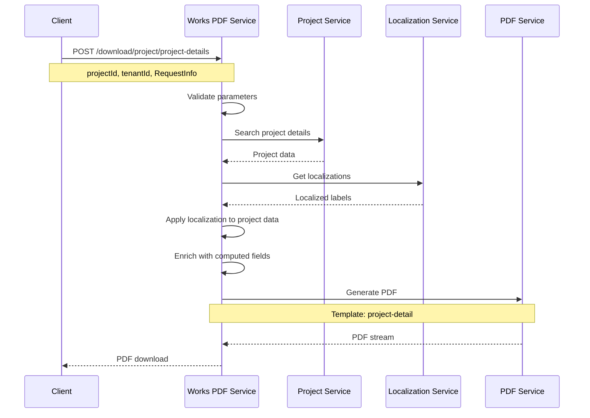

#### 2. Muster Roll PDF Generation

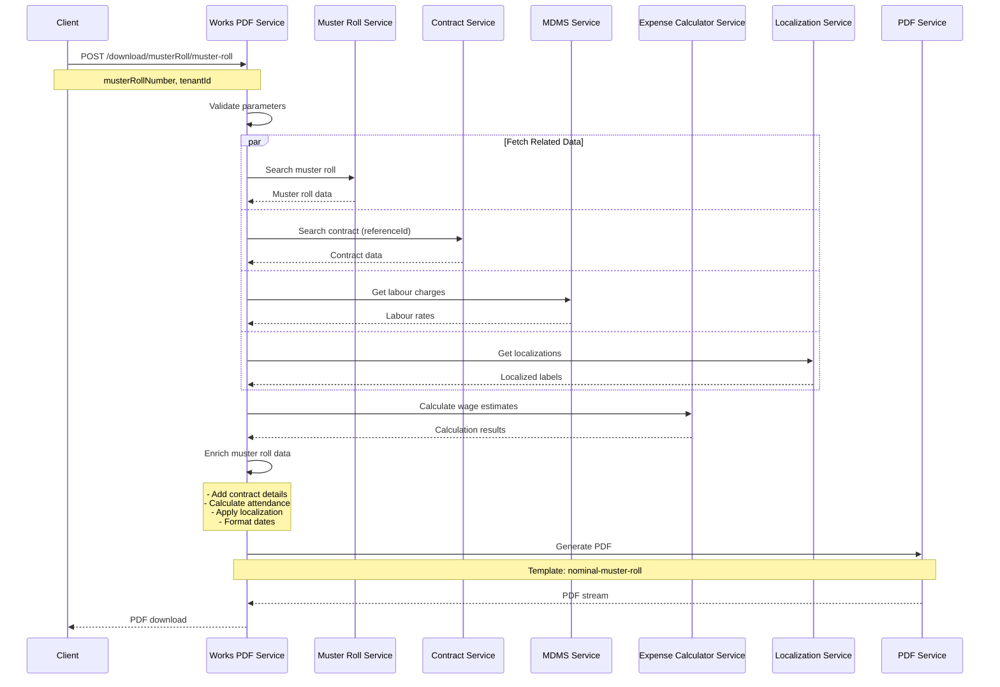

#### 3. Work Order PDF Generation

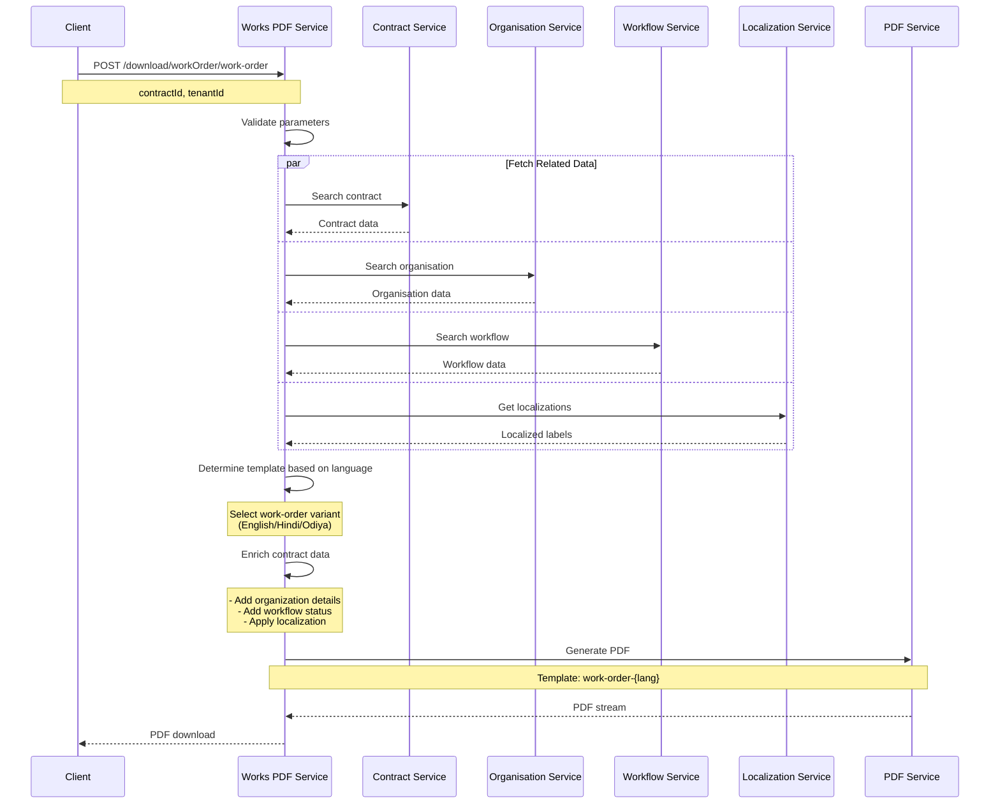

### Document Types and Generation Processes

#### 1. Project Details
- **Purpose**: Comprehensive project information document
- **Data Sources**: Project Service, Localization Service
- **Key Features**: 
  - Geographic coordinates display
  - Localized address components
  - Project timeline and status

#### 2. Estimates  
- **Purpose**: Cost estimation documents
- **Data Sources**: Estimate Service
- **Key Features**:
  - Line item details
  - Quantity and rate calculations
  - Total cost summaries

#### 3. Muster Rolls
- **Purpose**: Attendance and wage calculation documents
- **Data Sources**: Muster Roll Service, Contract Service, MDMS, Expense Calculator
- **Key Features**:
  - Individual attendance tracking
  - Daily wage calculations
  - Skill-based rate application
  - CBO and project context

#### 4. Work Orders
- **Purpose**: Contract execution documents  
- **Data Sources**: Contract Service, Organisation Service, Workflow Service
- **Key Features**:
  - Multi-language support (English, Hindi, Odiya)
  - Organisation details integration
  - Workflow status tracking

#### 5. Measurement Books
- **Purpose**: Work measurement documentation
- **Data Sources**: Measurement Service
- **Key Features**:
  - Measurement entries
  - Progress tracking
  - Quality assessments

#### 6. Analysis Statements
- **Purpose**: Rate analysis and utilization reports
- **Data Sources**: Rate Analysis Statements Service  
- **Key Features**:
  - Rate breakdowns
  - Material and labour analysis
  - Cost optimization insights

### Sequence Diagrams Using Mermaid

#### Group Bill Generation Flow

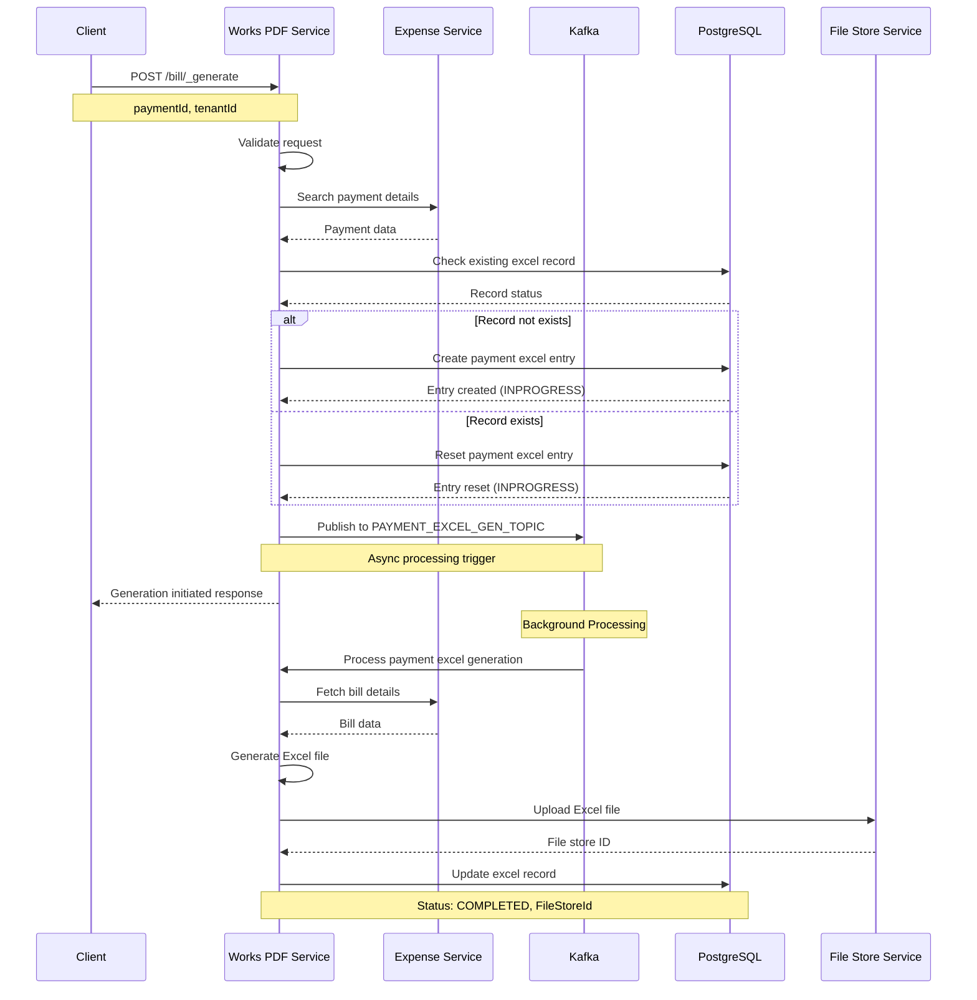

### Happy Path and Failure Scenarios

#### Happy Path - Muster Roll PDF Generation
1. **Request Validation** ✅ - All required parameters present
2. **Service Integration** ✅ - All dependent services available
3. **Data Enrichment** ✅ - Successful data transformation
4. **PDF Generation** ✅ - Template processing successful  
5. **Response Streaming** ✅ - PDF delivered to client

#### Failure Scenarios

##### 1. Validation Failures
```javascript
// Missing parameters
if (!tenantId) {
  return renderError(res, "tenantId is mandatory", 400);
}

// Invalid request structure  
if (!requestinfo) {
  return renderError(res, "requestinfo cannot be null", 400);
}
```

##### 2. Service Unavailability
```javascript
try {
  resProject = await search_projectDetails(tenantId, requestinfo, projectId);
} catch (ex) {
  console.log(ex.response?.data);
  return renderError(res, "Failed to query details of the project", 500);
}
```

##### 3. Data Not Found
```javascript
if (!project?.Project?.length) {
  return renderError(res, 
    "There is no project created using this project number", 404);
}
```

##### 4. PDF Generation Failures
```javascript
try {
  pdfResponse = await create_pdf(tenantId, pdfkey, project, requestinfo);
} catch (ex) {
  console.log(ex.response?.data);
  return renderError(res, "Failed to generate PDF for project details", 500);
}
```

##### 5. Kafka Processing Failures
```javascript
producer.send(payloads, function (err, data) {
  if (err) {
    logger.error(err.stack || err);
    errorCallback({
      message: `error while publishing to kafka: ${err.message}`
    });
  } else {
    logger.info("published to kafka successfully");
  }
});
```

---

## Security Considerations

### Authentication Flow

#### Token-Based Authentication
```javascript
// Authentication context in RequestInfo
{
  RequestInfo: {
    authToken: "Bearer <jwt_token>",
    userInfo: {
      id: "user_id",
      userName: "username", 
      type: "CITIZEN|EMPLOYEE",
      roles: [
        {
          code: "EMPLOYEE",
          name: "Employee",
          tenantId: "tenant_id"
        }
      ]
    }
  }
}
```

#### User Type Validation
```javascript
const checkIfCitizen = (requestinfo) => {
  return requestinfo.RequestInfo.userInfo.type === "CITIZEN";
};

// Role-based access control
const hasRequiredRole = (userInfo, requiredRoles) => {
  return userInfo.roles.some(role => 
    requiredRoles.includes(role.code));
};
```

### Authorization Checks

#### Tenant-Based Authorization
- All requests are scoped to a specific tenant
- Users can only access data within their tenant boundary
- Cross-tenant data access is prevented at the service level

#### Document-Level Access Control
```javascript
// Example: Citizen can only access their own records
if (checkIfCitizen(requestinfo)) {
  // Add additional filters to restrict data access
  searchCriteria.createdBy = requestinfo.RequestInfo.userInfo.uuid;
}
```

#### Service-Level Security
- Each downstream service enforces its own authorization
- Works PDF Service inherits security context from upstream services
- Token forwarding maintains authentication chain

### File Access Controls

#### Temporary File Handling
```javascript
// Secure file upload with controlled access
const upload_file_using_filestore = async (filename, tenantId, fileData) => {
  // Files are tagged with module and tenant for access control
  const url = `${config.host.filestore}/filestore/v1/files?tenantId=${tenantId}&module=billgen&tag=works-billgen`;
  
  // Content type validation
  const form = new FormData();
  form.append("file", fileData, {
    filename: filename,
    contentType: "application/vnd.openxmlformats-officedocument.spreadsheetml.sheet"
  });
  
  return axios.post(url, form, {
    maxContentLength: Infinity,
    maxBodyLength: Infinity,
    headers: { ...form.getHeaders() }
  });
};
```

#### Database Access Security
```javascript
// Parameterized queries to prevent SQL injection
const query = 'SELECT * FROM eg_payments_excel WHERE paymentid = $1';
await pool.query(query, [paymentId]);

// Connection pooling with credential management
const pool = new Pool({
  user: config.DB_USER,
  host: config.DB_HOST, 
  database: config.DB_NAME,
  password: config.DB_PASSWORD,
  port: config.DB_PORT
});
```

#### PDF Stream Security
```javascript
// Secure PDF streaming with proper headers
res.writeHead(200, {
  "Content-Type": "application/pdf",
  "Content-Disposition": `attachment; filename=${filename}.pdf`,
  "Cache-Control": "no-cache, no-store, must-revalidate",
  "Pragma": "no-cache",
  "Expires": "0"
});

// Direct stream piping without intermediate storage
pdfResponse.data.pipe(res);
```

---

## API Flow Diagrams

### 1. Project Details PDF Generation Flow

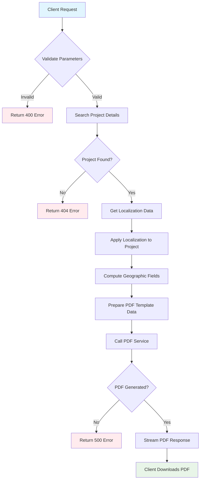

### 2. Muster Roll PDF Generation Flow

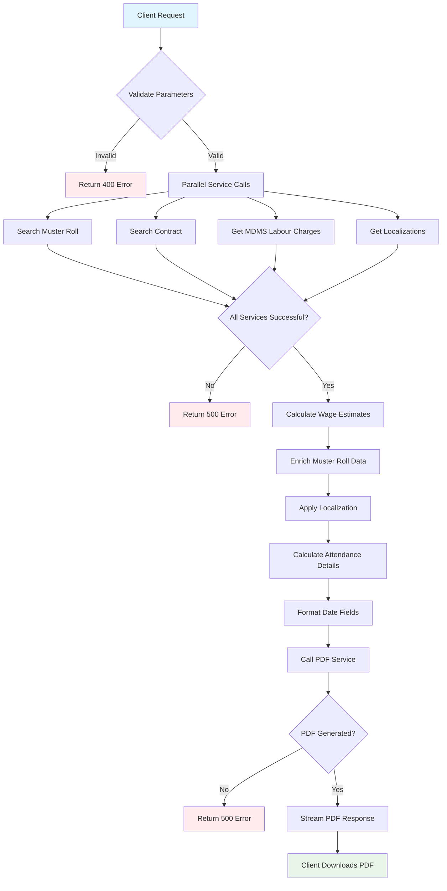

### 3. Work Order PDF Generation Flow

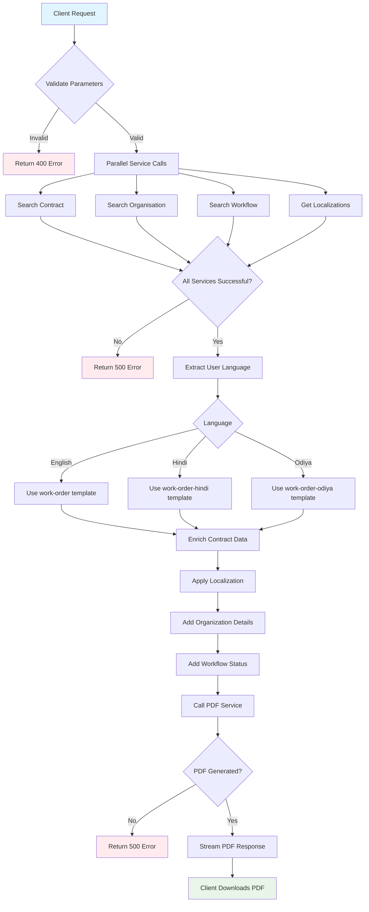

### 4. Group Bill Generation Flow

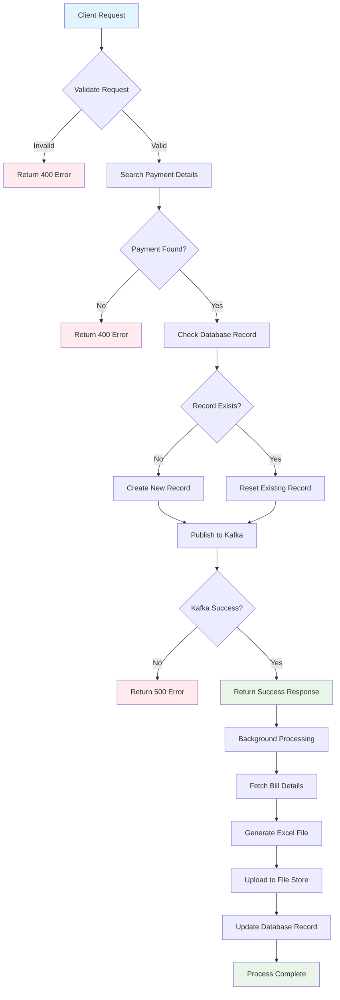

### 5. Error Handling Flow

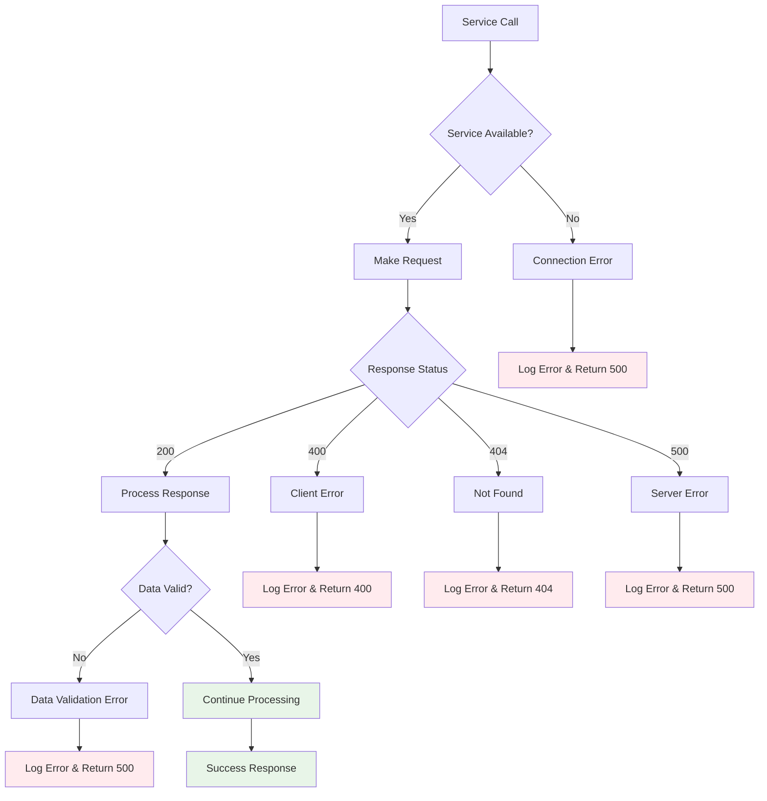

### Complete Flow with Error Handling

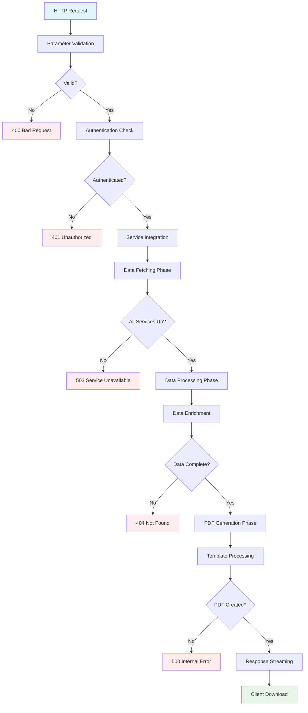

---

## Summary

The Works PDF Service serves as a critical Backend-for-Frontend component in the DIGIT Works ecosystem, providing simplified PDF generation capabilities for various work-related documents. The service demonstrates several architectural best practices:

### Key Strengths
- **Separation of Concerns**: Clear separation between PDF generation logic and business data retrieval
- **Service Integration**: Robust integration with multiple downstream services
- **Error Handling**: Comprehensive error handling and logging
- **Localization**: Multi-language support with dynamic template selection
- **Scalability**: Kafka-based async processing for resource-intensive operations
- **Security**: Token-based authentication with tenant isolation

### Technical Highlights
- **Technology Stack**: Node.js, Express, PostgreSQL, Kafka
- **PDF Generation**: Template-based approach with streaming responses
- **Data Processing**: Sophisticated data enrichment and transformation pipelines
- **Async Processing**: Background Excel generation for large datasets
- **Monitoring**: Comprehensive logging with Winston framework

### Integration Ecosystem
The service seamlessly integrates with 10+ microservices in the DIGIT Works platform, providing a unified PDF generation interface while maintaining loose coupling through well-defined APIs and data contracts.

This documentation provides a comprehensive technical reference for developers working with the Works PDF Service, covering implementation details, configuration options, and operational considerations.