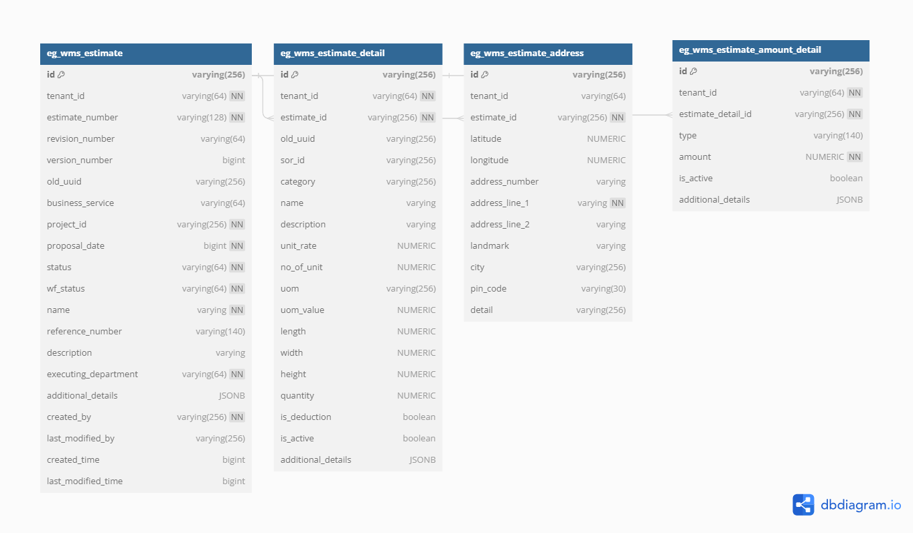
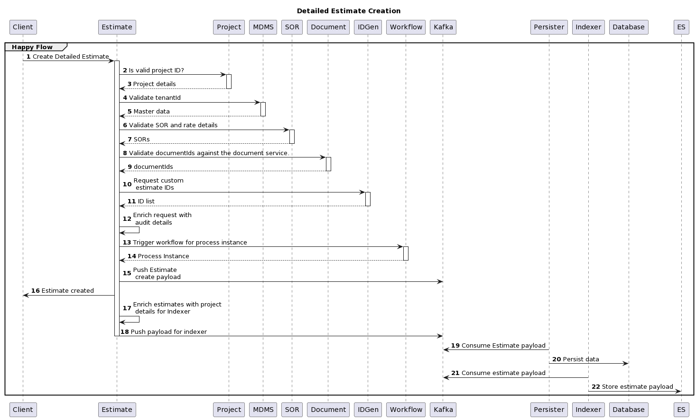
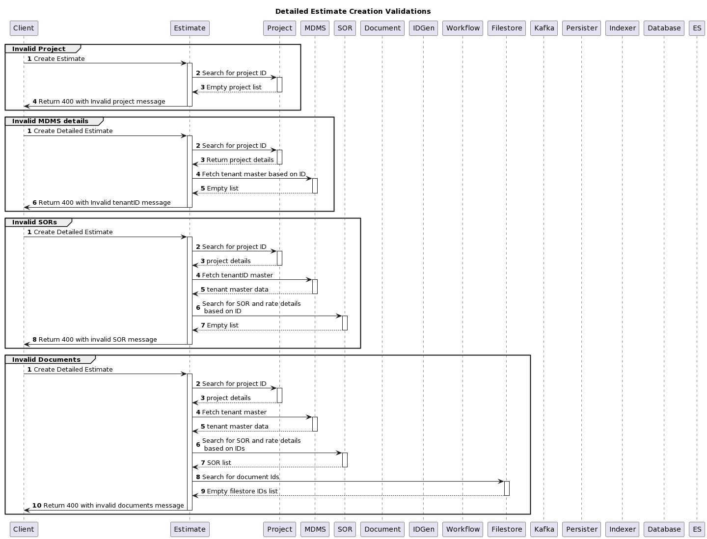
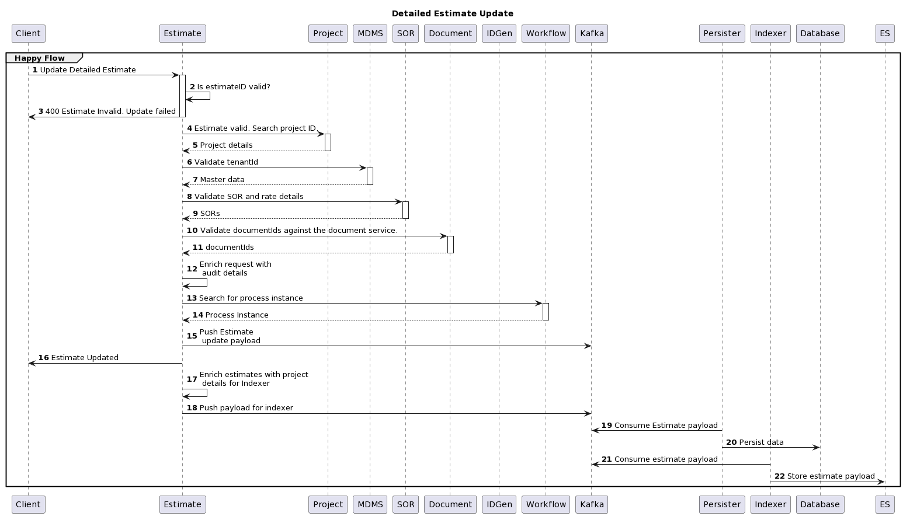

# Detailed Estimates

## Overview

Estimate Service allows users to create estimates and forward them for approval to higher authorities across departments for technical, financial, and admin sanctions. For more technical information on this service, please refer to the [GitHub module README](https://github.com/egovernments/DIGIT-Works/tree/develop/backend/estimate-service) and the [docs](https://github.com/egovernments/DIGIT-Works/tree/develop/backend/estimate-service/docs) folder. The detailed estimate allows users to select a SOR (schedule of rates) item to add to the estimate and enter detailed measurements for the SOR item (if applicable).&#x20;

### Dependencies

* [Project](https://health.digit.org/platform/architecture/low-level-design/services/project)
* [MDMS](https://core.digit.org/platform/core-services/mdms-master-data-management-service)
* [Workflow](https://core.digit.org/platform/core-services/workflow-service)
* [Notification](https://core.digit.org/platform/core-services/sms-notification-service)
* [Localisation](https://core.digit.org/platform/core-services/localization-service)
* [Access Control](https://core.digit.org/platform/core-services/access-control-services)
* [User](https://core.digit.org/platform/core-services/user-services)
* [IDGen](https://core.digit.org/platform/core-services/id-generation-service)

## API Specifications

**Base Path:** /estimates/

### API Contract Link


Estimates API specification


## Data Model

### DB Schema Diagram

<figure><figcaption></figcaption></figure>

## Estimate Flow Diagram

The diagram below shows the interaction between the estimate service and the persister, indexer. This does not follow the default pattern. Instead, enrichment of the payload for the indexer happens via a separate consumer and then the enriched payload is pushed to a topic. The indexer listens to this topic and sends it to ElasticSearch.&#x20;

<figure><figcaption></figcaption></figure>

## Web Sequence Diagrams




<figure><figcaption>
Create
</figcaption></figure>

<figure><figcaption>
Validations
</figcaption></figure>



<figure><figcaption>
Detailed Estimate Update
</figcaption></figure>







### Revision Estimates



<figure><figcaption>
Revision Estimate create flow
</figcaption></figure>

<figure><figcaption>
Revision Estimate Validations
</figcaption></figure>



<figure><figcaption>
Update Revision Estimate Flow
</figcaption></figure>

<figure><figcaption>
Validaiton of Revision Estimate Validation
</figcaption></figure>



### Estimate Inbox

Estimate inbox uses the Inbox V2 service (from DIGIT core) which queries ES to retrieve details for the inbox. For more information on Inbox V2, please refer [here](https://digit-discuss.atlassian.net/wiki/spaces/DD/pages/2289271031/Event+based+inbox).&#x20;


An inbox is needed when there are workflows enabled for the service.&#x20;


### Estimate PDF

The proposed sequence diagram is below.

## Postman Collections

TBD

## Related Topics

* [Functional specifications - Estimates](../../../../specifications/functional-specifications/estimates.md)
* [Estimates module service configuration](../../../../setup/configure-works/service-configuration/estimate.md)
* [Estimates module UI configuration](../../../../reference-implementations/muktasoft-v2.2/deployment/configuration/ui-configuration/modules/estimate.md) - for MuktaSoft
* [Estimates user stories](../../../../reference-implementations/muktasoft-v2.2/specifications/functional-requirements/user-stories/jit-fs-integration/) - for MuktaSoft
* [Employee user manual on using the Estimates module ](../../../../reference-implementations/muktasoft-v2.2/implementation/training-resources/user-manual/web-application-user-manual/estimate.md)- for MuktaSoft
