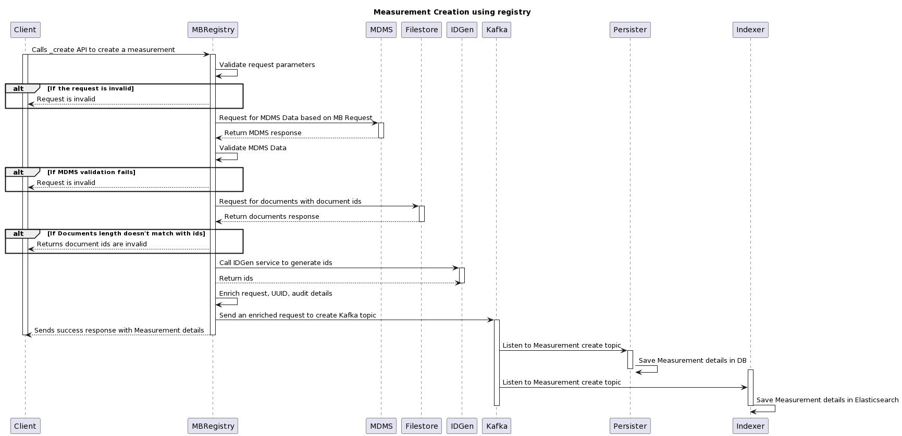
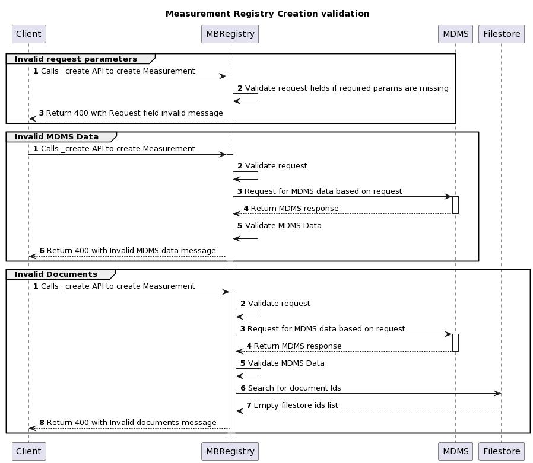
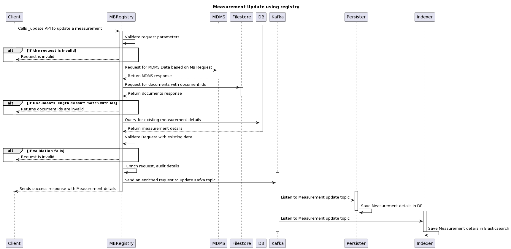
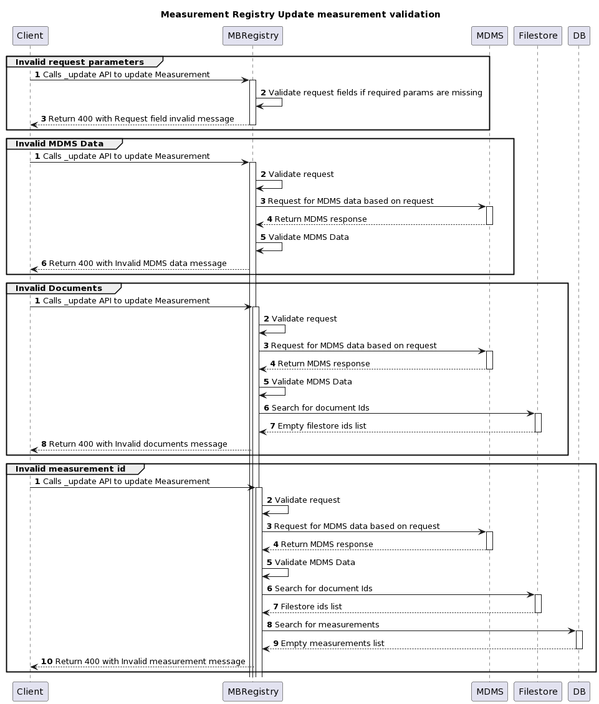
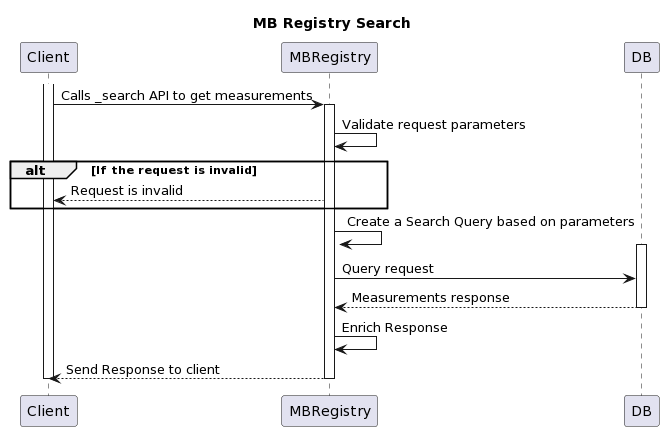
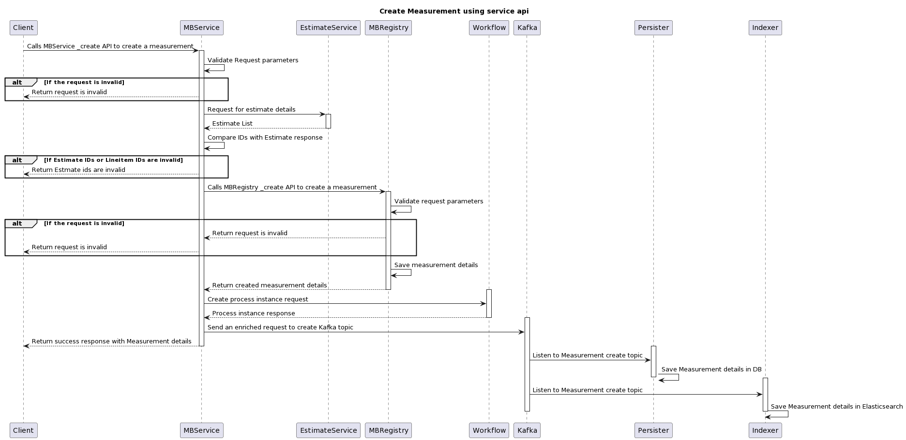
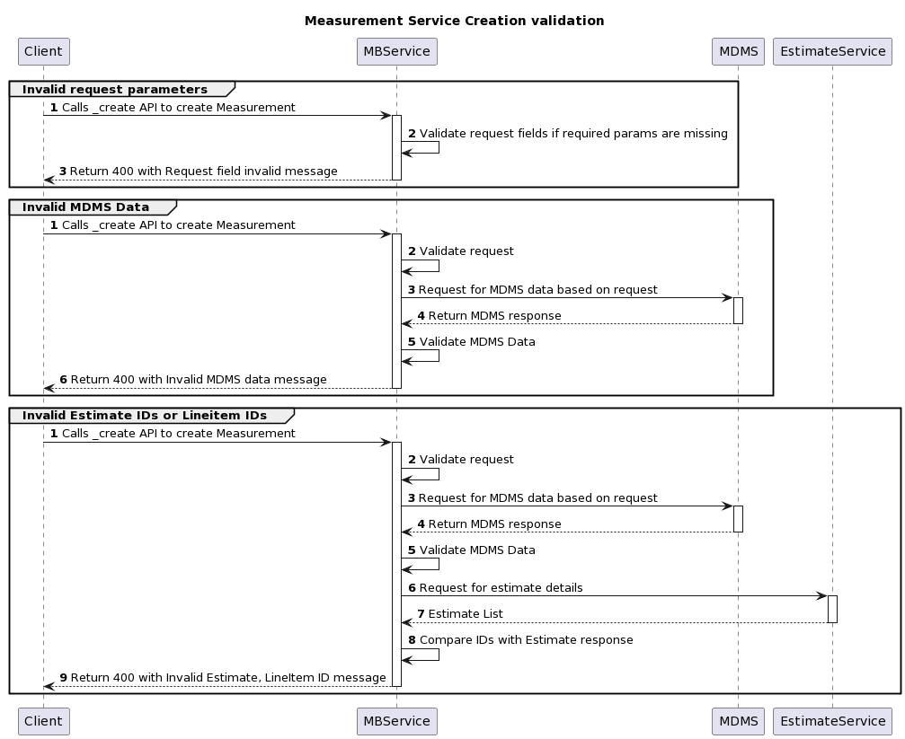
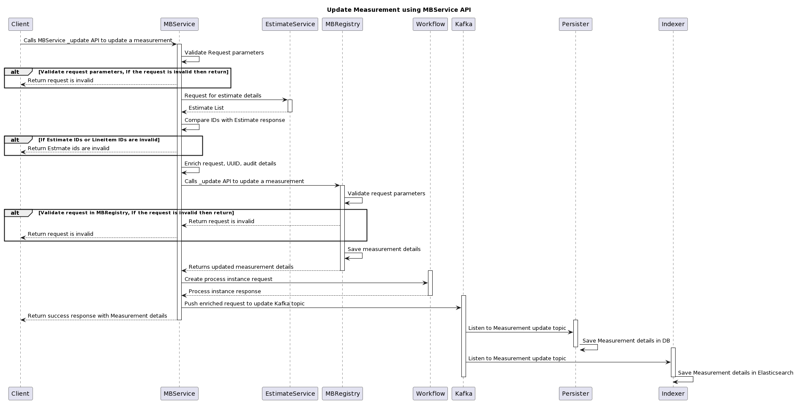

# Detailed Measurement Book

## Overview

The measurement book is a measure of progress in a Works contract. This service&#x20;

## API Specifications

### API Contract Link



### APIs


[Measurement-Book-v1.0.0.yaml](../../../../.gitbook/assets/Measurement-Book-v1.0.0.yaml)



[Measurement-Book-v1.0.0.yaml](../../../../.gitbook/assets/Measurement-Book-v1.0.0.yaml)



[Measurement-Book-v1.0.0.yaml](../../../../.gitbook/assets/Measurement-Book-v1.0.0.yaml)



[Measurement-Book-v1.0.0.yaml](../../../../.gitbook/assets/Measurement-Book-v1.0.0.yaml)


## Data Model&#x20;

### DB Schema Diagram

TBD

### Web Sequence Diagrams

#### Measurement Registry



<figure><figcaption></figcaption></figure>

<figure><figcaption></figcaption></figure>



<figure><figcaption></figcaption></figure>

<figure><figcaption></figcaption></figure>



<figure><figcaption></figcaption></figure>



#### Measurement Service



<figure><figcaption></figcaption></figure>

<figure><figcaption></figcaption></figure>



<figure><figcaption></figcaption></figure>



<figure><figcaption></figcaption></figure>


