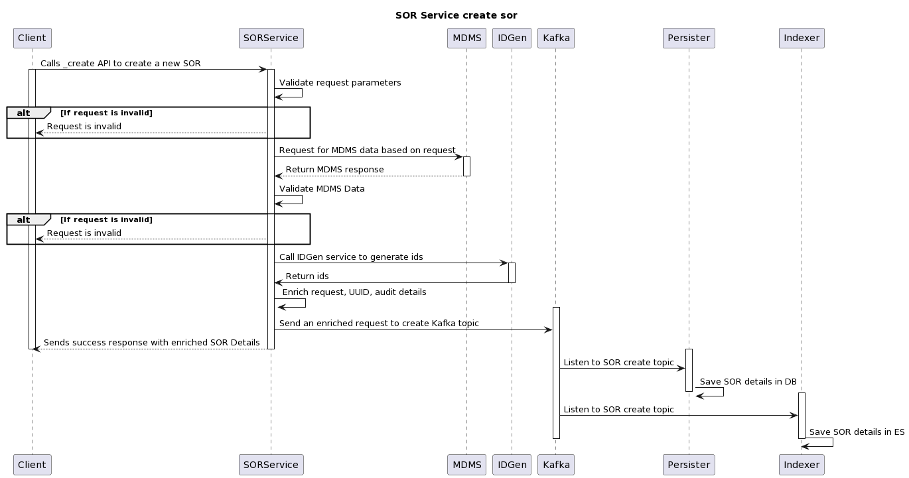
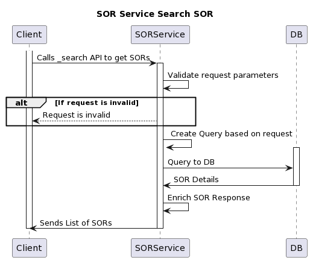

# Schedule of Rates (archive)

## Overview

Schedule of rates are defined by the state to provide detailed specifications for materials, labour, machinery etc..Rates are also defined at the state level but can be customized at the ULB level. This service provides a way to create/update/search for SORs and add rates to the SORs.

## API Specifications

### API Contract Link



### APIs


[sor-rates-1.0.0 (2).yaml](<../../../../.gitbook/assets/sor-rates-1.0.0 (2).yaml>)



[sor-rates-1.0.0 (2).yaml](<../../../../.gitbook/assets/sor-rates-1.0.0 (2).yaml>)



[sor-rates-1.0.0 (2).yaml](<../../../../.gitbook/assets/sor-rates-1.0.0 (2).yaml>)



[sor-rates-1.0.0 (2).yaml](<../../../../.gitbook/assets/sor-rates-1.0.0 (2).yaml>)



[sor-rates-1.0.0 (2).yaml](<../../../../.gitbook/assets/sor-rates-1.0.0 (2).yaml>)



[sor-rates-1.0.0 (2).yaml](<../../../../.gitbook/assets/sor-rates-1.0.0 (2).yaml>)


## Data Model&#x20;

### DB Schema Diagram

<figure><figcaption></figcaption></figure>

### Web Sequence Diagrams

#### SOR APIs



<figure><figcaption></figcaption></figure>

<figure><figcaption></figcaption></figure>



<figure><figcaption></figcaption></figure>

<figure><figcaption></figcaption></figure>



<figure><figcaption></figcaption></figure>



#### Rates



<figure><figcaption></figcaption></figure>

<figure><figcaption></figcaption></figure>



<figure><figcaption></figcaption></figure>

<figure><figcaption></figcaption></figure>



<figure><figcaption></figcaption></figure>



### Master Data Types

The following masters need to be created as part of this module:

* SOR Type
* SOR Subtype
* Unit of measurement
