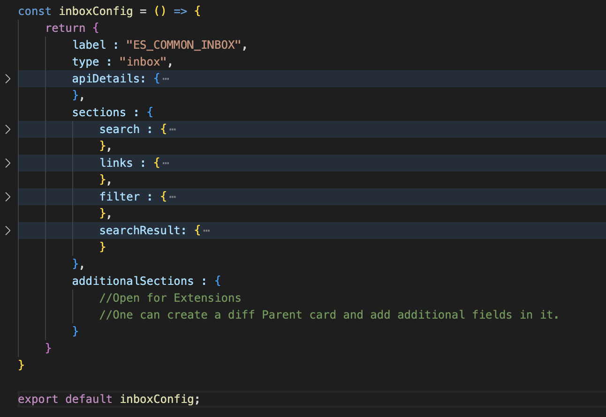
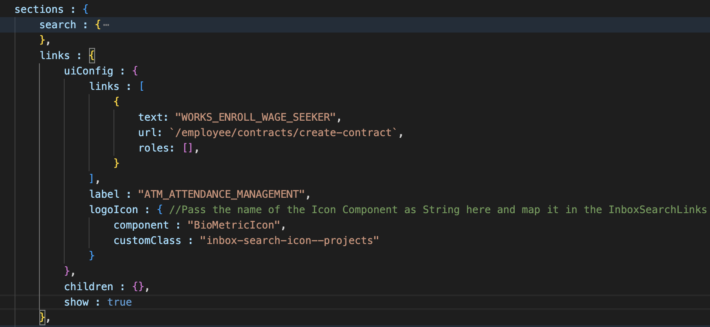
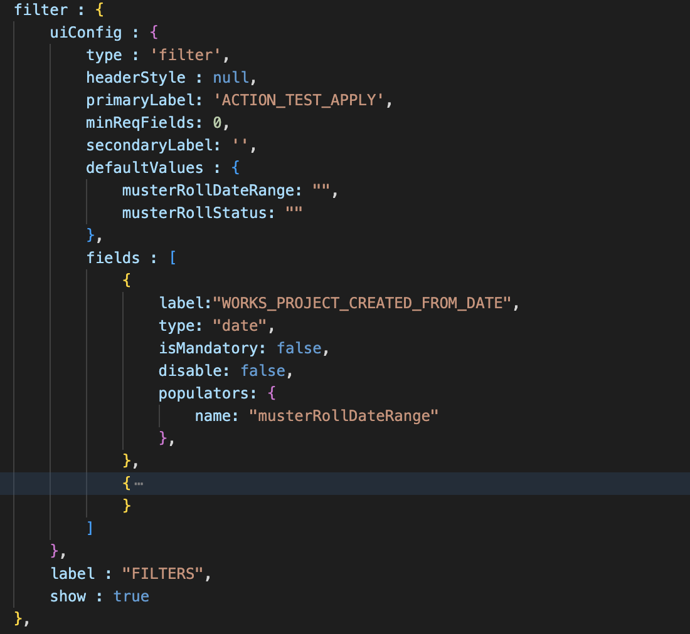
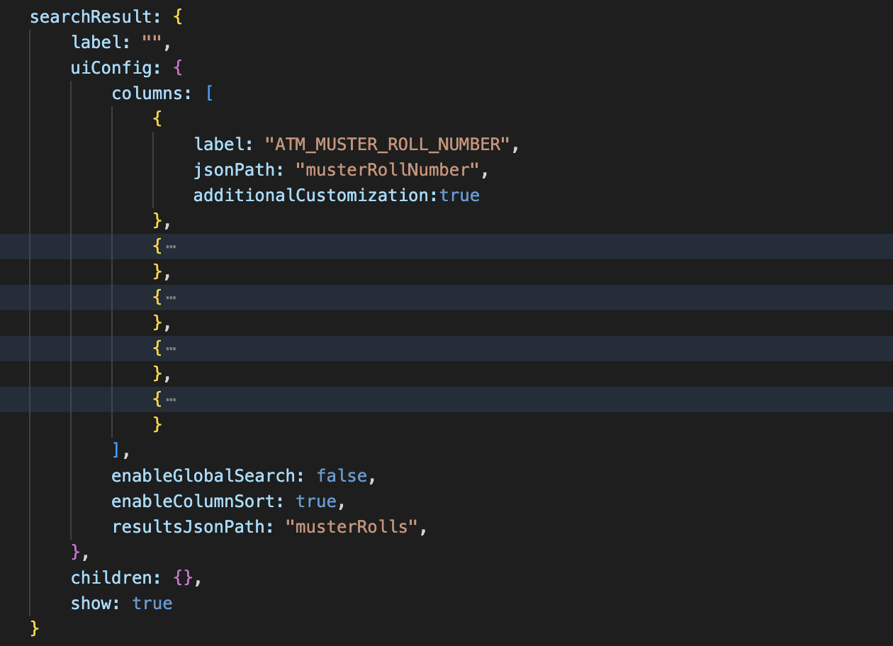
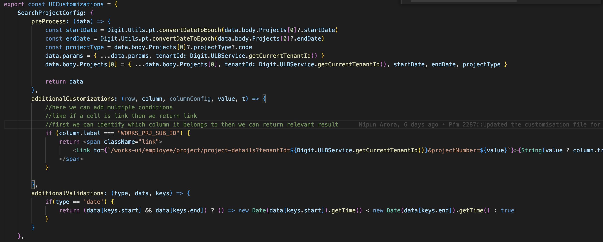
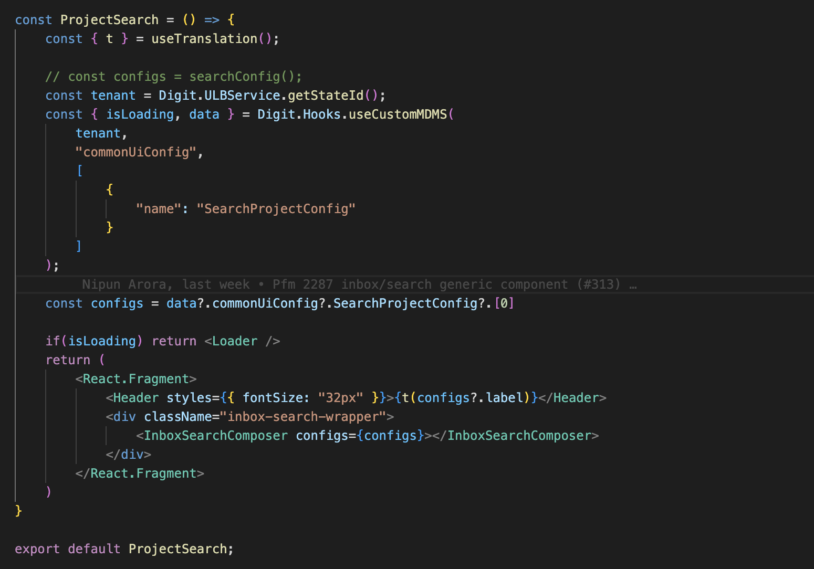

# Inbox/Search Screen

## **Overview**

This page provides the approach details for -

* rendering the Inbox screen or Search screen based on the config
* calling the API dynamically based on API details passed via config

## Common Components Used

#### InboxSearchComposer

This is a container component for inbox and search screens. It consists of 4 children components which can be rendered conditionally.                                                                                                     &#x20;

<table><thead><tr><th>Prop Name</th><th>Description</th><th data-hidden></th></tr></thead><tbody><tr><td>configs</td><td>Config fetched from MDMS data</td><td></td></tr></tbody></table>

#### InboxSearchLinks

This component is used to render titles and links in the inbox.

<table><thead><tr><th>Prop Name</th><th>Description</th><th data-hidden></th></tr></thead><tbody><tr><td>headerText</td><td>Config fetched from MDMS data</td><td></td></tr><tr><td>links</td><td>Links to navigate to other screens</td><td></td></tr><tr><td>customClass</td><td>Class to update styling</td><td></td></tr><tr><td>logoIcon</td><td>Icon name and class to render in component</td><td></td></tr></tbody></table>

#### SearchComponent

This component is used to render search or filter forms with ‘clear’ and ‘search’ buttons.

<table><thead><tr><th>Prop Name</th><th>Description</th><th data-hidden></th></tr></thead><tbody><tr><td>uiConfig</td><td>Config to render search/filter form</td><td></td></tr><tr><td>header</td><td>Title of form</td><td></td></tr><tr><td>screenType</td><td>Type of parent screen, can be either ‘inbox’ or ‘search’</td><td></td></tr><tr><td>fullConfig</td><td>Entire config of screen which also includes API details </td><td></td></tr></tbody></table>

#### Results table

This component is used to render a table with searched results.

<table><thead><tr><th>Prop Name</th><th>Description</th><th data-hidden></th></tr></thead><tbody><tr><td>config</td><td>Config to render table</td><td></td></tr><tr><td>data</td><td>Search results need to be populated in table</td><td></td></tr><tr><td>isLoading</td><td>Flag to pass to handle loading state</td><td></td></tr><tr><td>isFetching</td><td>Flag to pass to handle loading state</td><td></td></tr><tr><td>fullConfig</td><td>Entire config of screen which also includes API details </td><td></td></tr></tbody></table>

#### RenderFormFields

This component is used to render form fields passed in the 'fields' parameter in the config&#x20;

<table><thead><tr><th>Prop Name</th><th>Description</th><th data-hidden></th></tr></thead><tbody><tr><td>fields</td><td>Config to render all form fields</td><td></td></tr><tr><td>control, formData, errors, register, setValue, getValues, setError, clearErrors</td><td>Props to handle all form actions like collectibe data, setting errors, clearing errors etc.</td><td></td></tr><tr><td>apiDetails</td><td>Includes all API details required to fetch data</td><td></td></tr></tbody></table>

### **Hooks Used**

To fetch inbox details, ‘useCustomAPIHook’ is used which takes all the API details like URL, query params, body, config etc. from config (defined in MDMS).                                                                                         &#x20;



### Sample MDMS Data For Inbox&#x20;



### Sample MDMS Data For Search



## Configure Screens - Steps

1.  Create config based on the sections that need to be displayed on the screen. The basic structure for Inbox and Search screens is as below.&#x20;

    <figure><figcaption>
Base Inbox config
</figcaption></figure>

    <figure><figcaption>
Base Search config
</figcaption></figure>

2. Based on the flag given for each section its visibility is controlled. If the ‘show’ flag is true, then the section is visible, else it is hidden.&#x20;
3.  Add API details in the top section, this API will be called via _useCustomAPIHook_ and return the data. This consists of the below details.&#x20;

    <figure><figcaption>
Api details section
</figcaption></figure>

4.  Add search form config which can be used in both inbox/search screen. It consists of UIconfig containing label info, styling info, default form values, and fields which need to be rendered in the form. Refer below&#x20;

    <figure><figcaption>
search 
</figcaption></figure>

5.  Add Links config consists of link info, logo to be shown and title. Refer below&#x20;

    <figure><figcaption>
Links
</figcaption></figure>

6.  Add Filter form config which is similar to the search form. Refer below&#x20;

    <figure><figcaption>
Filter
</figcaption></figure>
7.  Add Table (Search result) config consists of labels, column data and related jsonpaths to access the data passed. Refer below&#x20;

    <figure><figcaption>
Results Table
</figcaption></figure>

8.  To add any customisations on query params, request body, table columns or to add any custom validations in forms, related code can be added in the _UICustomisations_ file as below&#x20;

    <figure><figcaption>
Ui customisations for Search project screen
</figcaption></figure>

9.  Once the above config is defined, created an index file/ Component in the pages folder. Fetch the config from MDMS and pass it to the _inboxSearchComposer_ component as below&#x20;

    <figure><figcaption>
Sample code for project search page
</figcaption></figure>

## Limitations&#x20;

* This approach is followed only in Inbox and Search screens currently.
* Only one API can be called dynamically based on given configurations.

