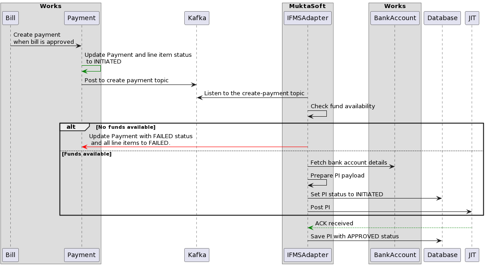
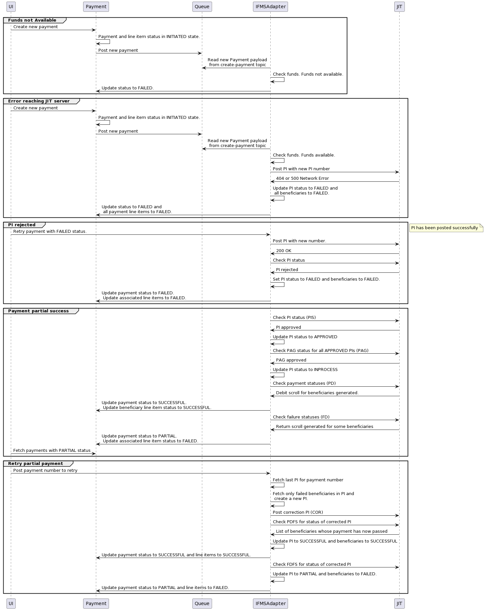

# IFMS Adapter

## Overview

Integration with Odisha IFMS (Integrated Financial Management System) is via the Just-in-Time (JIT) APIs provided by the Odisha treasury.&#x20;

## Components

<figure><figcaption></figcaption></figure>

## Master Data

The following pieces of information are shared offline:

* clientId
* clientSecret
* publicKey from JIT systems

All other master data is configured inside the [`ifms`](https://github.com/egovernments/works-mdms-data/tree/DEV/data/pg/ifms) folder at a state level as well as a [`ifms`](https://github.com/egovernments/works-mdms-data/tree/DEV/data/pg/citya/ifms) folder inside a ULB level.&#x20;

* Head of accounts to be used for the Mukta scheme at the state level - to be provided by HUDD
* Spending unit details specific to each ULB are to be provided by HUDD.&#x20;

## Sequence Diagram

#### Success Flow



<figure><figcaption>
Posting a PI
</figcaption></figure>



<figure><figcaption>
Checking PI status
</figcaption></figure>



<figure><figcaption>
Handling errors
</figcaption></figure>




## API Specifications



## DB Diagram


The IFMS Adapter does not use the persister service. The adapter interacts directly with the DB and has sync blocks on certain transactions to preserve data integrity.


<figure><figcaption></figcaption></figure>

## IFMS Adapter Description

### Dependent Services

* expense service
* expense-calculator service
* bank-account service
* individual service
* organisation service
* audit-log service
* IDGen service
* MDMS service
* encryption service

### Key Functionality

#### Funds Summary

1. IFMS adapter manages funds summary based on the head of accounts and SSU codes. It creates sanctions for each head of accounts and SSU details based on ULB tenant ID.
2. There are three types of transactions that can be received from the JIT VA API -
   * Initial Allotment - A new sanction will be created only if AllotmentTxnType is Initial Allotment.
   * Additional allotment - For this type of transaction it will update the amount of existing sanction.
   * Allotment withdrawal - It deducts the transaction amount from the sanction for this type of transaction.

#### Payment Instructions

* When a bill is approved this service creates payment using the expense service.
* There are consumers who keep listening to the payment create Kafka topic and generate payment instructions (PI) using payment and bill details and post the PI to the IFMS system using JIT API.
* A new PI will be generated when enough funds are available for any head of accounts for that tenantId.
* Before posting the PI there were multiple enrichments like bankaccount details, org and individual details, etc.
* After creating the PI it deducts the available balance from the funds summary.
* If a PI is created for any payment then the user can not generate a PI again till the PI fails.
* It keeps a log of each status call of PI and saves it in the DB

### JIT Connection Flow

IFMS adapter connects JIT with two APIs -

* authentication - _webservices/jitfs/v1.0/authenticate_
* service request - _webservices/jitfs/v1.0/get-jit-service-data_



<figure><figcaption></figcaption></figure>



<figure><figcaption></figcaption></figure>



### Cronjobs

There are multiple cronjobs for the IFMS adapter, all jobs are built using a single codebase with multiple charts, these charts are required to configure cronjobs with multiple configurations.

All cronjobs uses _ifms/scheduler?serviceId={SERVICE\_ID}_ API, the business logic is defined for each service code.

Service codes are -&#x20;

<table><thead><tr><th width="207">Cronjob</th><th width="121.33333333333331">Service ID</th><th>Description</th></tr></thead><tbody><tr><td>ifms-cronjob-pa</td><td>PA</td><td>It is used to create payment for approved bills, uses expense service API</td></tr><tr><td>ifms-cronjob-va</td><td>VA</td><td>It fetches the allotment details using JIT API's.</td></tr><tr><td>ifms-cronjob-pis</td><td>PIS</td><td>After PI creation it fetches whether the payment instruction's sanction is generated or not.</td></tr><tr><td>ifms-cronjob-pag</td><td>PAG</td><td>After receiving the PIS response it fetches for payment advice generation using JIT API.</td></tr><tr><td>ifms-cronjob-pd</td><td>PD</td><td>After receiving the PAG response it keeps fetching data for the PD service JIT API. The response will be received when payment is processed.</td></tr><tr><td>ifms-cronjob-fd</td><td>FD</td><td>It uses JITs bulk failure API and returns failed payments of the last 72hrs.</td></tr><tr><td>ifms-cronjob-ftps</td><td>FTPS</td><td>This same as PD - it is used for the revised transaction.</td></tr><tr><td>ifms-cronjob-ftfps</td><td>FTFPS</td><td>After receiving the response from FTPS API it keeps fetching data of failedrequests transactions of revised transactions.</td></tr></tbody></table>

### Indexes&#x20;

All requests and responses are logged in an encrypted fashion in two indexes in ES.

* ifms-request-logs
* ifms-error-logs

#### Request logs


Use this index to see a history of all successful requests to JIT.


Each request that is sent to JIT will be logged in the `ifms-request-logs` index. The index name is configurable in application.properties, Helm chart and environment file. There are multiple fields for the request:

* id - uuid of the request
* serviceId - Contains service ID of jit request like VA, PI, PIS etc
* jitBillNo - Contains bill number for which it’s calling the JIT API, it’s applicable for PI, PIS, PAG, PD, FTPS, and FTFPS.\
  Note: For Auth request jitBillNo will be AUTH
* encRequest - Contains request body which is encrypted using ifms.request.enc.secret value. You can decrypt this using the same secret.
* decryptionRek - Contains decryption rek which helps to decrypt the JIT response received from JIT.
* encResponse - Response received from JIT.
* createdtime - The time when the request was sent to the JIT system

#### Error logs


Use this index to see all failing requests to and back from the JIT IFMS APIs.


When the user sends any request to JIT and gets an error response, then it will store the details in ifms-error-logs index. It has multiple fields&#x20;

* serviceId - Contains service ID of jit request like VA, PI, PIS etc
* requestId - This is uuid of ifms-request-logs index
* statusCode - Status code of Network response
* jitEncRequest - Encrypted request which is sent to the JIT, we can not decrypt this request.
* errorMsg - Error response which was received from JIT
* encryptionRek - Encryption rek using which request is encrypted
* decryptionRek - Contains decryption rek which helps to decrypt the JIT response
* authToken - Auth token which request was sent to the JIT
* sekString - sek which was received from the login
* createdtime - The time when the request was sent to the JIT system

