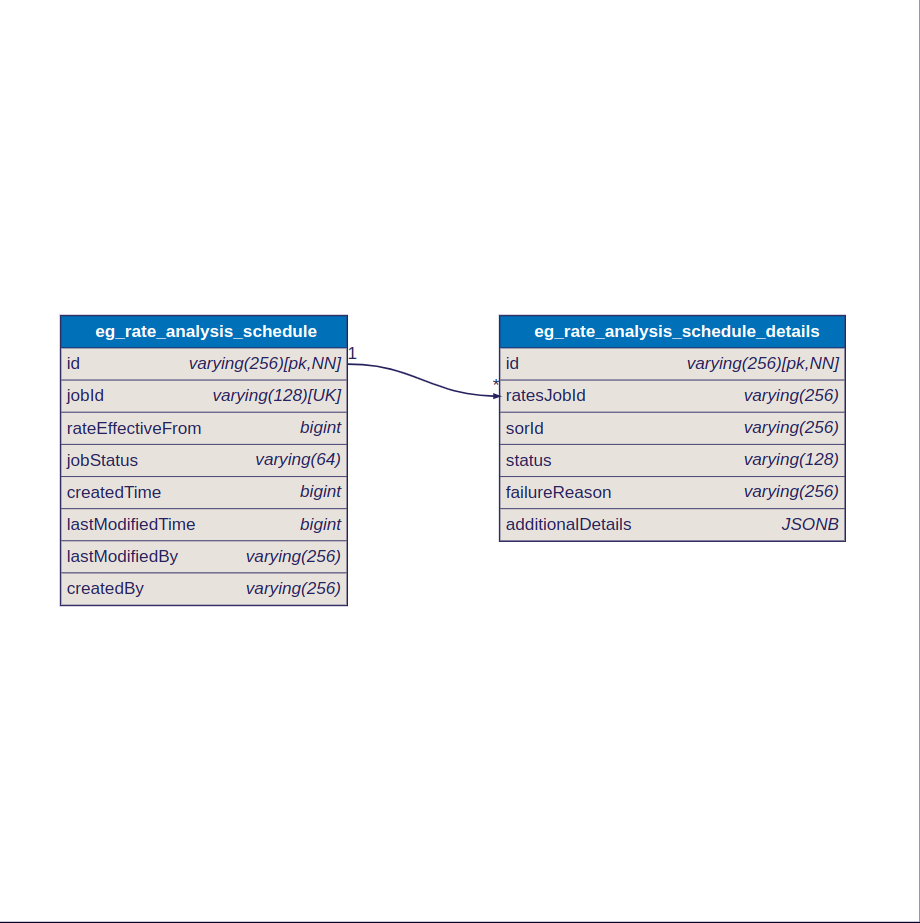

# Rate Analysis

## Overview

The service generates rate analysis for SOR (Schedule of Rates) compositions using four APIs:

1. **Job Management**:
   * **Create Job API**: Creates a new job.
   * **Search Job API**: Searches for existing jobs.
2. **Rate Analysis**:
   * **Generate Rate Analysis API**: Generates rate analysis.
   * **Create Rate Analysis API**: Saves the rate analysis.

To save the rate analysis per unit, the scheduler/create API is triggered. This internally calls the Create API and computes the rates generated with the help of the Calculate API.&#x20;

This streamlined process ensures accurate rate analysis for SOR compositions.

## Dependency

* DIGIT backbone services
* Persister
* MDMSV2
* IDgen

## Sequence Diagram

<figure><figcaption>
Rate Analysis
</figcaption></figure>

<figure><figcaption>
Scheduler
</figcaption></figure>

## API Specifications

[https://raw.githubusercontent.com/egovernments/DIGIT-Specs/works-v2/Domain%20Services/Works/Rate-Analysis-v1.0.0.yaml](https://raw.githubusercontent.com/egovernments/DIGIT-Specs/works-v2/Domain%20Services/Works/Rate-Analysis-v1.0.0.yaml)

## DB Diagram

<figure><figcaption>
Rate Analysis Schedule Tables
</figcaption></figure>

## Description

The Rate Analysis Save API internally calls the existing MDMSv2 API to save the rates, eliminating the need for a new database design. The Rate Analysis Create API generates the rate analysis in real-time.

The client should call the Scheduler Create API to save the generated rate analysis. This API creates a job that includes a list of SORs requiring rate revisions (even a single SOR is passed as a list).
