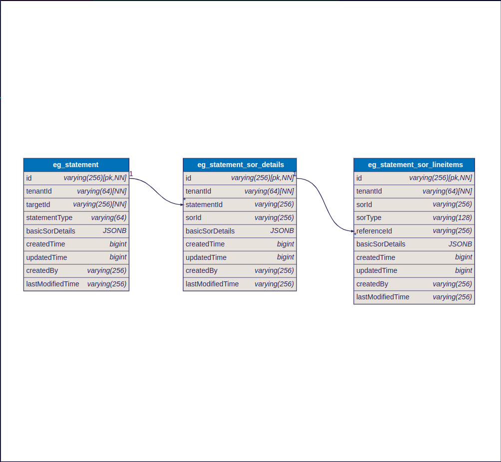

# Statements

## Overview

The statements service is used to generate and save the statement. The business logic for both types of statements differs based on the request. Hence, there are 4 APIs (2- Create and 2- Search).

MUKTASoft provides two types of statements: Analysis Statements and Utilization Statements.

**Analysis Statement**

* **Purpose**: Generated for estimates already created and present in the system.
* **Accessibility**: Employees can view the Analysis Statement from the estimate view screen.
* **Linkage**: The statement is linked to the specific estimate for which it is generated.

**Utilization Statement**

* **Purpose**: Generated for measurement books already created and present in the system.
* **Accessibility**: Employees can view the Utilization Statement from the measurement view screen.
* **Linkage**: The statement is linked to the specific measurement for which it is generated.

### Dependency

* DIGIT backbone services
* Persister
* MDMSV2
* IDgen
* Rate Analysis
* Estimate
* Measurement Book
* Contract

### Sequence Diagram

<figure><figcaption>
Utilization Statement
</figcaption></figure>

<figure><figcaption>
Analysis Statement
</figcaption></figure>

##

## API Specifications

[https://raw.githubusercontent.com/egovernments/DIGIT-Specs/works-v2/Domain%20Services/Works/Statement-v1.0.0.yaml](https://raw.githubusercontent.com/egovernments/DIGIT-Specs/works-v2/Domain%20Services/Works/Statement-v1.0.0.yaml)

## DB Diagram

<figure><figcaption></figcaption></figure>

