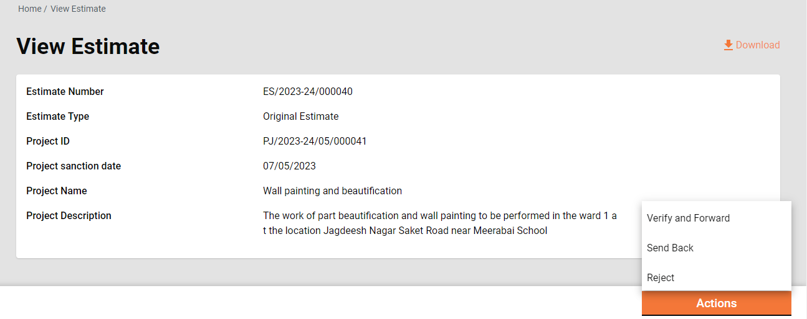
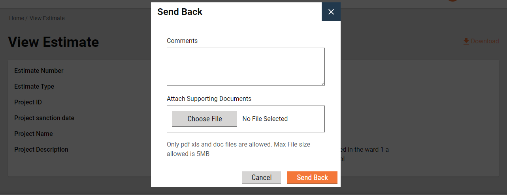

# Estimate

The estimate feature offers the below options to users:

1. [Inbox](estimate.md#kap9trqshk7j)
2. [Search estimates](estimate.md#lsw2xl5o2rec)
3. [View estimates](estimate.md#x27l4m714yv4)
4. [View analysis statements](estimate.md#view-analysis-statements)
5. [Create estimates](estimate.md#id-3bh6o6q4ckbs)
6. [Create workflows](estimate.md#ifmt2wi19o01)
   1. [Estimate creator](estimate.md#estimate-creator)
   2. [Technical sanctioner](estimate.md#technical-sanctioner)
   3. [Approver](estimate.md#approver)

## Inbox 

**Home Page > Estimates**

Click on the Estimate Inbox on the home page.

<figure><figcaption>
Estimate Inbox
</figcaption></figure>

<figure><figcaption>
Estimate Inbox
</figcaption></figure>

* The feature menus are displayed on the top left side.
* The bottom panel on the left side displays the following filters:
  1. **Assigned to Me** - The only estimates assigned to the logged-in user are displayed on the right window.
  2. **Assigned to All** - This is selected by default; hence, all estimates, irrespective of who is assigned, are displayed on the right window.
  3. **Ward**- It filters and displays the applications based on the selected ward.
  4. **Workflow States** - It appears only when the application type filter is selected. It filters the applications based on the selected status and displays the results on the right window.
* The top right side displays the search parameters. This enables users to search for estimates by Estimate Number, Project ID, and Project Type.
* The bottom right side provides a window to list the estimates based on the default settings, applied filters and search parameters.

## Search Estimate 

**Home Page > Estimates> Search Estimate**

The search estimate enables ULB employees to find specific estimates using multiple filters.

**Search Criteria**

1. Ward
2. Project Type
3. Project Name
4. Estimate Number/ Revised Estimate Number
5. Status
6. From Date
7. To Date

<figure><figcaption></figcaption></figure>

* At least one parameter is mandatory. Enter any one filter or more to search for an estimate.
* The system fetches the estimates created between the specified periods by entering the date ranges created from and created to. The From Date and To Date fields are considered one parameter.
* Click on the Search button to view the search results.
* Click on the Reset button to renew the search using different parameters.

**Search Result**

1. Estimate Number/ Revised Estimate Number
2. Project Name
3. Location
4. Prepared by
5. Status
6. Estimated Amount (₹)

<figure><figcaption></figcaption></figure>

## View Estimate 

**Home Page > Estimates> Inbox > Search Estimate > Search Results**

Click on the applicable **Estimate Number** from the search results to view the estimate details.

.png>)

<figure><figcaption>
View Estimate Details
</figcaption></figure>

<figure><figcaption>
View Estimate Details
</figcaption></figure>

<figure><figcaption>
View Estimate Details
</figcaption></figure>

<figure><figcaption>
View Estimate Details
</figcaption></figure>

### View Analysis Statements

On the view estimate details page, click on **View Analysis Statements.**

<figure><figcaption>
View Analysis Statements
</figcaption></figure>

<figure><figcaption>
View Analysis Statements
</figcaption></figure>

<figure><figcaption>
View Analysis Statements
</figcaption></figure>

* The screen displays the breakup of SORs total into labour, material, machinery and labour cess.
* It also displays the SOR-wise analysis of labour, material, and machinery.
* Additionally, it displays the consolidation of analysis into labour, material and machinery.
* The option to download the analysis statement in PDF is provided.

## Create Estimate 

**Home Page > Estimates > Inbox > Create Estimate**

To create an estimate for a project, search for the project using the search project feature. Open the project to view the details. Navigate to the Actions button on the bottom right corner and click on the Create Estimate option.&#x20;

* Search for the project using the Search Project option.
* Click on the applicable Project ID from the search results list to view the project details.
* The complete project detail is displayed along with the attached documents and the Actions menu.

.png>)

* Click on the Create Estimate option. This opens the Create Estimate page.

.png>)

* The basic project details are displayed at the top of the page.
* The project details tab displays the full project details.
* Estimate details are captured under 3 sections: SOR, Non-SOR and Other Charges.
* SORs can be added in bulk by adding an estimate template. To add an estimate template, search it using the template name or code and then click on the add button to add it to the estimate.
* SORs can also be added by searching them one by one and then adding them to the estimate.
* A SOR not having an effective rate in the system is not allowed to be added.

<figure><figcaption></figcaption></figure>

<figure><figcaption></figcaption></figure>

* Once a SOR is added to the estimate, its measurement is captured into the measurement sheet. To open the measurement sheet click on the plus icon beside the estimated quantity.
* The measurement captured calculates the quantity and the same is displayed as the estimated quantity.

<figure><figcaption>
Create Estimate
</figcaption></figure>

* The non-SOR section allows the user to capture the non-schedule items into the estimate.
* Enter the Item Description, Unit, and Rate and capture the measurement as shown for SOR to calculate the estimated quantity.
* Click on the Add Non-SOR icon to append add items.

<figure><figcaption></figcaption></figure>

* Other charges section is provided to capture the GST and Supervision Charges.
* The total of SOR/ Non-SOR and other charges are displayed as Total Estimate Amount.

<figure><figcaption>
Create Estimate
</figcaption></figure>

* Upload the documents in the Relevant Documents section which are required to verify and approve the estimate.
* Click on Save as Draft to save the estimate for further modification and see the analysis statements.
* Click on Submit to send the estimate for verification.

## Create Workflows 

### **Estimate Creator**

The Estimate Creator (EC) is responsible for creating and forwarding the estimation along with relevant documents uploaded.

EV can

* Save the estimate as a draft.
* Forward estimate
* Edit estimate

**Save as Draft**

The "Save as Draft" feature provides users with the capability to create an estimate and retain it in the creator's inbox for subsequent updates. This functionality allows users to initiate the estimate creation process, save the work in progress as a draft, and revisit it later for additional edits or finalization before submission.

**Submit**

The estimate creator (EC) has the right to create an estimate for a project and then forward it to the verifier. On creation, the EC gets the forward dialogue box from which the user optionally selects the verifier’s name as the assignee name, adds the comments if any, and then forwards the estimate.

<figure><figcaption></figcaption></figure>

On Forward, the estimate is forwarded to the verifier and the success page is displayed with the success message and estimate number.

.png>)

**Edit**

The estimate creator (EC) has the right to edit the estimate in case the estimate is sent back for any correction.

1. The estimate pending correction is available in the Inbox. Otherwise, search for the estimate using the search estimate.
2. Click on the estimate number to open the estimate and view the details.
3. Select the Edit from the Take Action. The estimate is opened into editable mode.
4. After editing, the submitted estimate is again sent to the verifier for verification.

**Verifier**

The Estimate Verifier (EV) is responsible for verifying the estimation and supporting documents uploaded.

EV can

* Verify and forward estimate
* Send estimate back to EC

**Verify and forward**

The EV verifies and forwards the application if the documents and estimation provided in the estimate are found satisfactory and complete.

To verify and forward the estimate

1. The estimate pending verification is available in the Inbox. Otherwise, search for the estimate using the search estimate.
2. Click on the estimate number to open the estimate and view the details.
3. Select the Verify and Forward from the Take Action. A pop-up window is opened.

1. Select the estimate’s technical sanctioner’s name as Assignee Name.
2. Provide any additional information for the assignee in the comments section.
3. Click on the Choose Files button to upload any supporting documents.
4. Click on the Verify and Forward button. The application is forwarded to the technical sanctioner.

**Send back**

EV can send the estimate back to the EC for any corrections or if any vital document has not been uploaded.

To send the estimate back to the CE

1. The estimate pending verification is available in the Inbox. Otherwise, search for the estimate using the search estimate.
2. Click on the estimate number to open the estimate and view the details.
3. Select the Send Back from the Take Action. A pop-up window is opened.

1. State the reasons for sending the estimate back to the CE in the comments section.
2. Click on the Choose Files button to upload any supporting documents.
3. Click on the Send Back button. The estimate is placed into CE’s inbox and enabled for editing.

### **Technical Sanctioner**

The Technical Sanctioner (TS) is responsible for technically sanctioning the estimate.

TS can

* Technical sanction estimate
* Send the estimate back to EV
* Send the estimate back to EC
* Reject the estimate

.png>)

**Technical Sanction**

The TS technically approves the estimate if the estimate is found technically correct.

To technically sanction the estimate

1. The estimate pending verification is available in the Inbox. Otherwise, search for the estimate using the search estimate option.
2. Click on the estimate number to open the estimate and view the details.
3. Select the Send Back from the Take Action. A pop-up window is opened.

.png>)

1. Select the estimate’s approver’s name as Assignee Name.
2. Provide any additional information for the assignee in the comments section.
3. Click on the Choose Files button to upload any supporting documents.
4. Click on the Technically Sanction button. The application is forwarded to the estimate approver.

**Send Back**

TS can send the estimate back to the EV for any clarification which is needed by TS to proceed further.

To send the estimate back to the EV

1. The estimate pending for technical sanction is available in the Inbox. Otherwise, search for the estimate using the search estimate.
2. Click on the estimate number to open the estimate and view the details.
3. Select the Send Back from the Take Action. A pop-up window is opened.

.png>)

1. State the reasons for sending the estimate back to the EV in the comments section.
2. Click on the Choose Files button to upload any supporting documents.
3. Click on the Send Back button. The estimate is placed into EV’s inbox.

**Send back to the originator**

TS can send the estimate back to the EC for any corrections or if any vital document has not been uploaded.

To send the estimate back to the CE

1. The estimate pending for technical sanction is available in the Inbox. Otherwise, search for the estimate using the search estimate.
2. Click on the estimate number to open the estimate and view the details.
3. Select the Send Back from the Take Action. A pop-up window is opened.

.png>)

1. State the reasons for sending the estimate back to the CE in the comments section.
2. Click on the Choose Files button to upload any supporting documents.
3. Click on the Send Back button. The estimate is placed into CE’s inbox and the estimate is enabled for editing.

**Reject**

The TS can reject the estimate if the documents and information furnished by the EC do not meet the prescribed guidelines.

To reject the estimate

1. The estimate Pending for Technical Sanction is available on the Inbox. Otherwise, search for the estimate using the search estimate.
2. Click on the estimate number to open the estimate and view the details.
3. Select the Reject from the Take Action. A pop-up window is opened.

.png>)

1. State the reasons for rejecting the estimate in the Comments section.
2. Click on the Choose Files button to upload any supporting documents.
3. Click on the Reject button. The estimate is rejected, and a notification is sent to the EC informing the same.

### **Approver**

The Approver verifies the estimate and if the documents and estimation provided in the application are found satisfactory and complete and the estimation amount is as per the guideline, the estimate is approved.

Approver can

* Approve the estimate
* Send the estimate back to TS
* Send the estimate back to EC
* Reject the estimate

.png>)

**Approve**

1. The estimate Pending Approval is available in the Inbox. Otherwise, search for the estimate using the search estimate.
2. Click on the estimate number to open the estimate and view the details.
3. Select the Approve from the Take Action. A pop-up window is opened.

.png>)

1. Provide any additional information for the applicant in the Comments section.
2. Click on the Approve Files button to upload any supporting documents.
3. Click on the Approve button. The estimate is approved.

**Send Back**

To send the estimate back to the TS

1. The estimate pending approval is available in the Inbox. Otherwise, search for the estimate using the search estimate.
2. Click on the estimate number to open the estimate and view the details.
3. Select the Send Back from the Take Action. This opens a pop-up window.

.png>)

1. State the reasons for sending the estimate back to the TS in the comments section.
2. Click on the Choose Files button to upload any supporting documents.
3. Click on the Send Back button. The estimate is placed into TS’s inbox.

**Send back to originator**

To send the estimate back to the CE

1. The estimate pending for technical sanction is available in the Inbox. Otherwise, search for the estimate using the search estimate.
2. Click on the estimate number to open the estimate and view the details.
3. Select the Send Back from the Take Action. A pop-up window is opened.

.png>)

1. State the reasons for sending the estimate back to the CE in the comments section.
2. Click on the Choose Files button to upload any supporting documents.
3. Click on the Send Back button. The estimate is placed into CE’s inbox and the estimate is enabled for editing.

**Reject**

The Approver can reject the estimate if the documents and information furnished by the EC do not meet the prescribed guidelines.

To reject the application

1. The estimate Pending Approval is available in the Inbox. Otherwise, search for the estimate using the search estimate.
2. Click on the estimate number to open the estimate and view the details.
3. Select the Edit from the Take Action. A pop-up window is opened.

.png>)

1. State the reasons for rejecting the estimate in the Comments section.
2. Click on the Choose Files button to upload any supporting documents.
3. Click on the Reject button. The estimate is rejected and a notification is sent to the EC informing the same.
