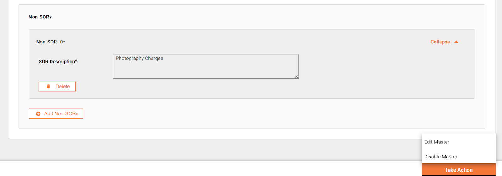

# Estimate Template

## **Search Template**

It allows users to search all templates using various parameters, such as Template ID, Template Name, and Active Status.

<figure><figcaption>
Search Template
</figcaption></figure>

## Create Template

It allows users to create an estimate template applicable to all ULBs. The estimate template is created at the state level.

1. To create an estimate template, click of Add Master Data from search estimate template screen.

<figure><figcaption>
Add Template
</figcaption></figure>

2. Enter the template name.
3. Enter the template description
4. Select project type.
5. Add SOR using the search SOR feature.
   1. Click on the drop-down to search for a SOR.

<figure><figcaption>
Add Template
</figcaption></figure>

b. Click on the view more to search for SORs with more details.

<figure><figcaption>
Add Template
</figcaption></figure>

3. Select an SOR to add into the estimate template.
4. Add the Non-SORs. Enter the Non-SOR description.

<figure><figcaption>
Add Template
</figcaption></figure>

3. Click on “Add Data” to create the template. Template ID is created automatically by the system.

## **View Template**

It allows the user to view the estimate template details. The “i” icon against a field displays the complete information of the value of that field.

<figure><figcaption></figcaption></figure>

<figure><figcaption></figcaption></figure>

<figure><figcaption></figcaption></figure>

## **Edit Template**

It allows the user to edit the details of the estimate template, change the name and description, add/remove the SORs and Non-SORs.

<figure><figcaption>
Edit Template
</figcaption></figure>

<figure><figcaption>
Edit Template
</figcaption></figure>

<figure><figcaption>
Edit Template
</figcaption></figure>
