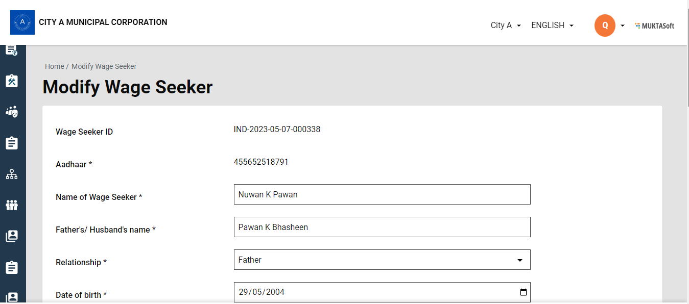
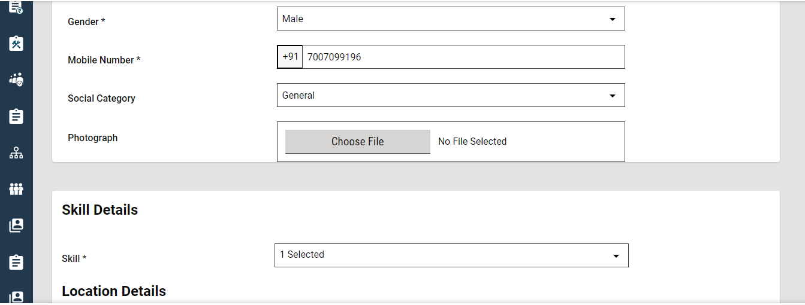
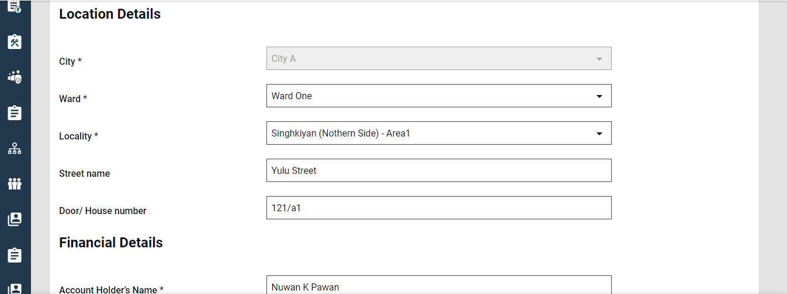
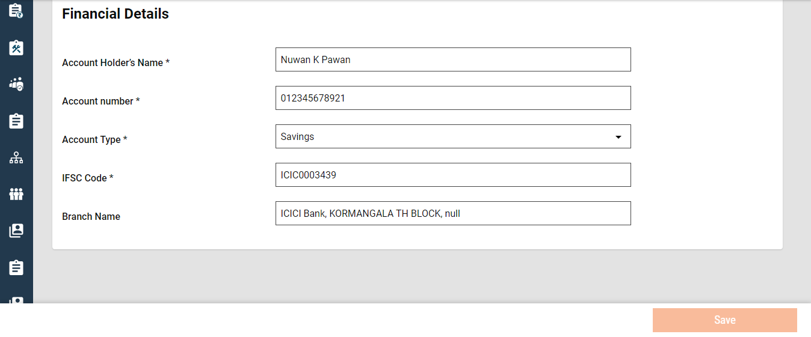

# Wage Seekers

## **Search Wage Seekers**

**Home > Wage Seekers / Sidebar Menu > Wage Seekers**

.png>)

1. From the homepage, click on Wage Seeker to search Wage Seeker.
2. Fill all the details inquired and click on Search.

**Search Criteria**

1. Ward
2. Wage Seeker Name
3. Wage Seeker ID
4. Mobile Number
5. Social Category
6. Created from Date
7. Created to Date

**Search Result**

Once you have filled in all details and clicked on Search, it displays the following details:

1. Wage Seeker ID
2. Wage Seeker Name
3. Father/ Husband Name
4. Social Category
5. City
6. Ward
7. Locality

.png>)

## **View Wage Seekers**

**Sidebar Menu / Homepage > Wage Seeker > Search Wage Seeker > Wage Seeker Result > Wage Seeker ID > View Wage Seeker**

1. To View the Wage Seeker, one must Search Wage Seeker.
2. Once you have filled in all the details click on the Search button. This will display the search results.
3. Click on the Wage Seeker ID in orange. This displays the View Wage Seeker option.

<figure><figcaption></figcaption></figure>

<figure><figcaption></figcaption></figure>

### **Modify Wage Seeker**

**Sidebar Menu/ Homepage > Wage Seeker > Search Wage Seeker > Wage Seeker Result > Wage Seeker ID > View Wage Seeker > Modify Wage Seeker**

To modify any details regarding Wage Seekers, one must view the Wage Seeker and then click on Modify at the bottom of the page. This will display all the details of the Wage Seeker. Make necessary changes and click on Save at the bottom.

<figure><figcaption></figcaption></figure>

<figure><figcaption></figcaption></figure>

<figure><figcaption></figcaption></figure>

<figure><figcaption></figcaption></figure>
