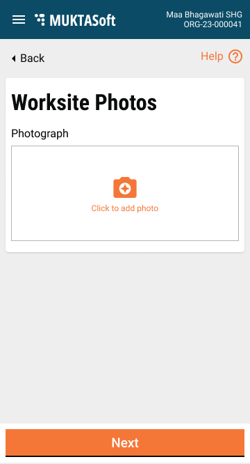

# Employee Mobile Application

## Introduction 

A mobile application for the employees will be developed to enable the users to take measurements on the ground and capture them in the system.&#x20;

## Functional Details

It will support the below-listed features.

1. [Login](employee-mobile-application.md#_c0qnf1z1dte6)
2. [Home page](employee-mobile-application.md#_x5u484zdip63)
3. [Search work orders](employee-mobile-application.md#_34017zp9dl9s)
4. [Measurement books](employee-mobile-application.md#_btyakwogsgk5)
   * [Inbox](employee-mobile-application.md#_kyte9d4fxso8)
   * [Create and save as a draft](employee-mobile-application.md#_agwx5cm8dkt1)
   * [Submit for verification](employee-mobile-application.md#_l1og8tx8hpjo)
   * [Edit measurement book](employee-mobile-application.md#_l1og8tx8hpjo)
   * [Verify and approve measurement book](employee-mobile-application.md#_l1og8tx8hpjo)
   * [View measurement book](employee-mobile-application.md#_xxo2kvnui0fb)

### Login 

The login screen enables the users to log into the mobile version of the MUKTASoft application.

|  |  |
| ---------------------------------------------------------------------------- | ---------------------------------------------------------------------------- |

### Home Page 

The home page enables the users to view the service menus and the menu icon to explore them.

|  |  |
| ---------------------------------------------------------------------------- | ---------------------------------------------------------------------------- |

### Work Orders 

The work orders screen lists the accepted and in-progress work orders to initiate the Measurement Book. Closed project work orders are excluded from the view list.

|  |  |
| ---------------------------------------------------------------------------- | ---------------------------------------------------------------------------- |

### Measurement Books 

The mobile version of the measurement book allows the user to record the measurement from the ground.

#### Inbox 

|  |  |
| ---------------------------------------------------------------------------- | -------------------------------------------------------------------------------- |

#### Create 

|  |  |
| -------------------------------------------------------------------------------- | -------------------------------------------------------------------------------- |

|  |  |
| --------------------------------------------------------------------------------- | ----------------------------------------------------------------------------- |

#### View 

The view measurement books are the same screens in read-only mode.

#### Workflows 

Workflow screens are available below.

|  |  |
| ----------------------------------------------------------------------------- | ----------------------------------------------------------------------------- |
|  |  |
|  |  |
